# `.\MetaGPT\metagpt\actions\write_prd.py` 详细设计文档

该代码实现了一个智能产品需求文档（PRD）生成与管理系统，能够根据用户需求自动生成、更新PRD文档，支持新需求创建、现有PRD更新、Bug修复处理，并能生成竞争分析图表和项目报告。

## 整体流程

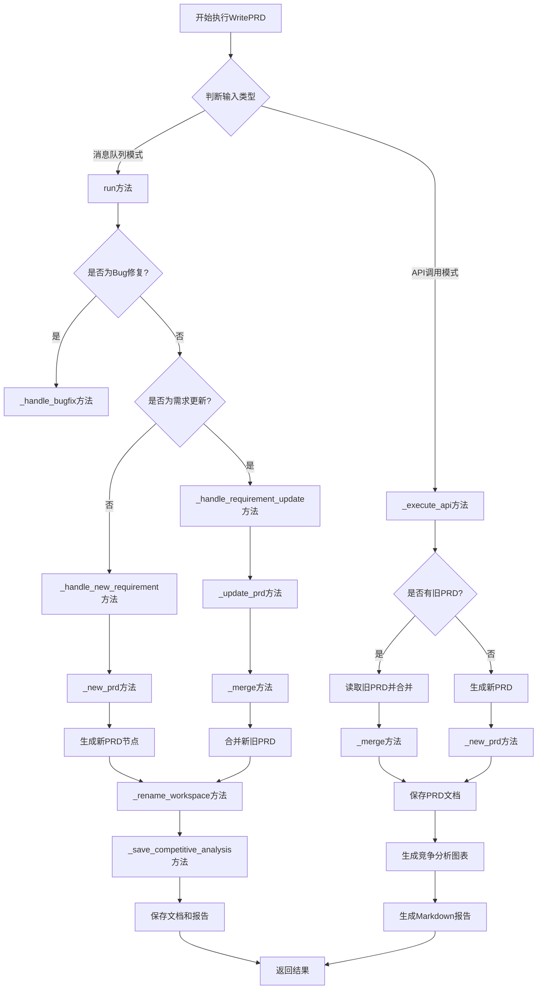

## 类结构

```
Action (基类)
└── WritePRD (PRD生成主类)
    ├── 字段: repo, input_args
    ├── 方法: run, _execute_api, _handle_bugfix, _handle_new_requirement
    ├── 方法: _handle_requirement_update, _is_bugfix, get_related_docs
    ├── 方法: _is_related, _merge, _update_prd, _save_competitive_analysis
    └── 方法: _rename_workspace, _new_prd
```

## 全局变量及字段


### `CONTEXT_TEMPLATE`
    
用于生成新PRD文档的上下文模板，包含项目名称和原始需求占位符。

类型：`str`
    


### `NEW_REQ_TEMPLATE`
    
用于判断新需求是否与现有PRD相关的模板，包含旧PRD内容和新需求的占位符。

类型：`str`
    


### `WritePRD.repo`
    
项目仓库实例，用于管理项目文档和代码文件的存储与操作。

类型：`Optional[ProjectRepo]`
    


### `WritePRD.input_args`
    
存储从消息中解析出的输入参数，包含项目路径、需求文件名和PRD文件名列表等信息。

类型：`Optional[BaseModel]`
    
    

## 全局函数及方法

### `WritePRD.run`

`WritePRD.run` 方法是 `WritePRD` 类的核心方法，负责处理产品需求文档（PRD）的生成、更新和Bug修复。它根据输入的需求类型（新需求、需求更新或Bug修复）执行相应的逻辑，最终生成或更新PRD文档，并返回处理结果。

参数：

- `with_messages`：`List[Message]`，可选，消息列表，通常包含用户需求和其他上下文信息。
- `user_requirement`：`str`，用户需求描述字符串。
- `output_pathname`：`str`，可选，输出文档的文件路径。
- `legacy_prd_filename`：`str`，可选，现有PRD文档的文件路径，用于参考或更新。
- `extra_info`：`str`，可选，额外的信息，用于补充需求描述。
- `**kwargs`：其他关键字参数。

返回值：`Union[AIMessage, str]`，返回一个AIMessage对象或字符串。AIMessage包含处理结果和指令内容，字符串则直接返回PRD文件的路径。

#### 流程图

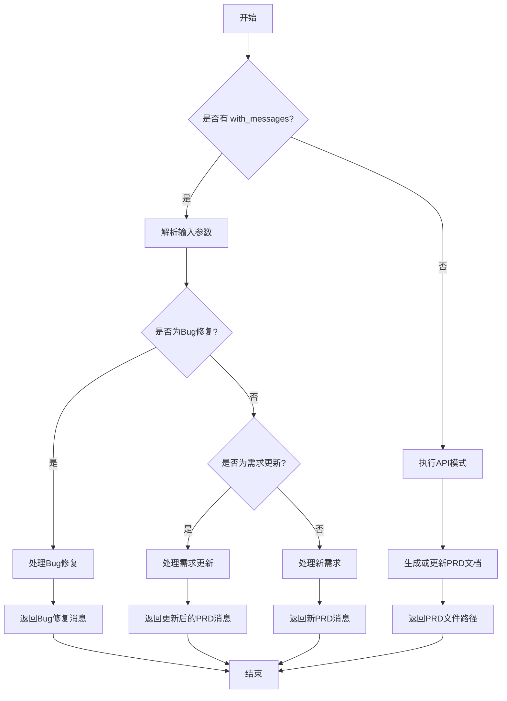

#### 带注释源码

```python
async def run(
    self,
    with_messages: List[Message] = None,
    *,
    user_requirement: str = "",
    output_pathname: str = "",
    legacy_prd_filename: str = "",
    extra_info: str = "",
    **kwargs,
) -> Union[AIMessage, str]:
    """
    Write a Product Requirement Document.

    Args:
        user_requirement (str): A string detailing the user's requirements.
        output_pathname (str, optional): The output file path of the document. Defaults to "".
        legacy_prd_filename (str, optional): The file path of the legacy Product Requirement Document to use as a reference. Defaults to "".
        extra_info (str, optional): Additional information to include in the document. Defaults to "".
        **kwargs: Additional keyword arguments.

    Returns:
        str: The file path of the generated Product Requirement Document.

    Example:
        # Write a new PRD (Product Requirement Document)
        >>> user_requirement = "Write a snake game"
        >>> output_pathname = "snake_game/docs/prd.json"
        >>> extra_info = "YOUR EXTRA INFO, if any"
        >>> write_prd = WritePRD()
        >>> result = await write_prd.run(user_requirement=user_requirement, output_pathname=output_pathname, extra_info=extra_info)
        >>> print(result)
        PRD filename: "/absolute/path/to/snake_game/docs/prd.json"

        # Rewrite an existing PRD (Product Requirement Document) and save to a new path.
        >>> user_requirement = "Write PRD for a snake game, include new features such as a web UI"
        >>> legacy_prd_filename = "/absolute/path/to/snake_game/docs/prd.json"
        >>> output_pathname = "/absolute/path/to/snake_game/docs/prd_new.json"
        >>> extra_info = "YOUR EXTRA INFO, if any"
        >>> write_prd = WritePRD()
        >>> result = await write_prd.run(user_requirement=user_requirement, legacy_prd_filename=legacy_prd_filename, extra_info=extra_info)
        >>> print(result)
        PRD filename: "/absolute/path/to/snake_game/docs/prd_new.json"
    """
    # 如果没有传入消息列表，则执行API模式
    if not with_messages:
        return await self._execute_api(
            user_requirement=user_requirement,
            output_pathname=output_pathname,
            legacy_prd_filename=legacy_prd_filename,
            extra_info=extra_info,
        )

    # 解析输入参数
    self.input_args = with_messages[-1].instruct_content
    if not self.input_args:
        # 初始化项目仓库并保存需求文档
        self.repo = ProjectRepo(self.context.kwargs.project_path)
        await self.repo.docs.save(filename=REQUIREMENT_FILENAME, content=with_messages[-1].content)
        self.input_args = AIMessage.create_instruct_value(
            kvs={
                "project_path": self.context.kwargs.project_path,
                "requirements_filename": str(self.repo.docs.workdir / REQUIREMENT_FILENAME),
                "prd_filenames": [str(self.repo.docs.prd.workdir / i) for i in self.repo.docs.prd.all_files],
            },
            class_name="PrepareDocumentsOutput",
        )
    else:
        self.repo = ProjectRepo(self.input_args.project_path)
    
    # 加载需求文档和现有PRD文档
    req = await Document.load(filename=self.input_args.requirements_filename)
    docs: list[Document] = [
        await Document.load(filename=i, project_path=self.repo.workdir) for i in self.input_args.prd_filenames
    ]

    if not req:
        raise FileNotFoundError("No requirement document found.")

    # 判断是否为Bug修复
    if await self._is_bugfix(req.content):
        logger.info(f"Bugfix detected: {req.content}")
        return await self._handle_bugfix(req)
    
    # 删除上一轮的Bug修复文件，避免冲突
    await self.repo.docs.delete(filename=BUGFIX_FILENAME)

    # 判断是否为需求更新
    if related_docs := await self.get_related_docs(req, docs):
        logger.info(f"Requirement update detected: {req.content}")
        await self._handle_requirement_update(req=req, related_docs=related_docs)
    else:
        logger.info(f"New requirement detected: {req.content}")
        await self._handle_new_requirement(req)

    # 构建返回消息
    kvs = self.input_args.model_dump()
    kvs["changed_prd_filenames"] = [
        str(self.repo.docs.prd.workdir / i) for i in list(self.repo.docs.prd.changed_files.keys())
    ]
    kvs["project_path"] = str(self.repo.workdir)
    kvs["requirements_filename"] = str(self.repo.docs.workdir / REQUIREMENT_FILENAME)
    self.context.kwargs.project_path = str(self.repo.workdir)
    return AIMessage(
        content="PRD is completed. "
        + "\n".join(
            list(self.repo.docs.prd.changed_files.keys())
            + list(self.repo.resources.prd.changed_files.keys())
            + list(self.repo.resources.competitive_analysis.changed_files.keys())
        ),
        instruct_content=AIMessage.create_instruct_value(kvs=kvs, class_name="WritePRDOutput"),
        cause_by=self,
    )
```

### `WritePRD._execute_api`

该方法用于通过API方式执行PRD（产品需求文档）的生成或更新。它根据用户需求、可选的旧PRD文件路径和额外信息，生成新的PRD文档，并保存到指定路径。同时，它会生成竞争分析图表和Markdown格式的文档。

参数：

- `user_requirement`：`str`，用户的需求描述。
- `output_pathname`：`str`，输出PRD文件的路径。如果未提供，则使用默认路径。
- `legacy_prd_filename`：`str`，旧PRD文件的路径。如果提供，则基于旧PRD进行更新；否则生成新的PRD。
- `extra_info`：`str`，额外的信息，用于补充用户需求。

返回值：`str`，返回生成的PRD文件的路径信息字符串。

#### 流程图

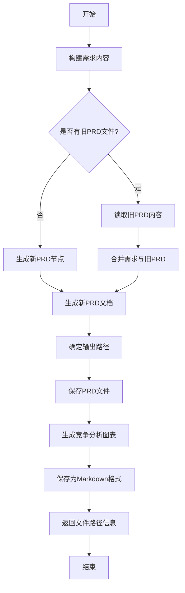

#### 带注释源码

```python
async def _execute_api(
    self, user_requirement: str, output_pathname: str, legacy_prd_filename: str, extra_info: str
) -> str:
    # 构建包含用户需求和额外信息的内容字符串
    content = "#### User Requirements\n{user_requirement}\n#### Extra Info\n{extra_info}\n".format(
        user_requirement=to_markdown_code_block(val=user_requirement),
        extra_info=to_markdown_code_block(val=extra_info),
    )
    # 使用文档报告器进行流式报告
    async with DocsReporter(enable_llm_stream=True) as reporter:
        await reporter.async_report({"type": "prd"}, "meta")
        # 创建需求文档对象
        req = Document(content=content)
        # 判断是否有旧PRD文件
        if not legacy_prd_filename:
            # 如果没有旧PRD，生成新的PRD节点
            node = await self._new_prd(requirement=req.content)
            new_prd = Document(content=node.instruct_content.model_dump_json())
        else:
            # 如果有旧PRD，读取其内容并合并需求
            content = await aread(filename=legacy_prd_filename)
            old_prd = Document(content=content)
            new_prd = await self._merge(req=req, related_doc=old_prd)

        # 确定输出路径
        if not output_pathname:
            output_pathname = self.config.workspace.path / "docs" / "prd.json"
        elif not Path(output_pathname).is_absolute():
            output_pathname = self.config.workspace.path / output_pathname
        output_pathname = rectify_pathname(path=output_pathname, default_filename="prd.json")
        # 保存PRD文件
        await awrite(filename=output_pathname, data=new_prd.content)
        # 生成竞争分析图表
        competitive_analysis_filename = output_pathname.parent / f"{output_pathname.stem}-competitive-analysis"
        await self._save_competitive_analysis(prd_doc=new_prd, output_filename=Path(competitive_analysis_filename))
        # 保存为Markdown格式
        md_output_filename = output_pathname.with_suffix(".md")
        await save_json_to_markdown(content=new_prd.content, output_filename=md_output_filename)
        await reporter.async_report(md_output_filename, "path")
    # 返回文件路径信息
    return f'PRD filename: "{str(output_pathname)}". The  product requirement document (PRD) has been completed.'
```

### `WritePRD._handle_bugfix`

该方法用于处理被识别为“Bug修复”类型的用户需求。当检测到需求是Bug修复时，它会将需求内容保存到一个特定的Bug修复文件中，并清空原始需求文件。然后，它构造并返回一个AIMessage，该消息包含了Bug修复的详细信息，并指定将消息发送给名为“Alex”的工程师进行处理。

参数：

- `req`：`Document`，包含用户需求内容的文档对象。

返回值：`AIMessage`，一个包含Bug修复信息、发送目标（工程师“Alex”）和结构化指令内容的消息对象。

#### 流程图

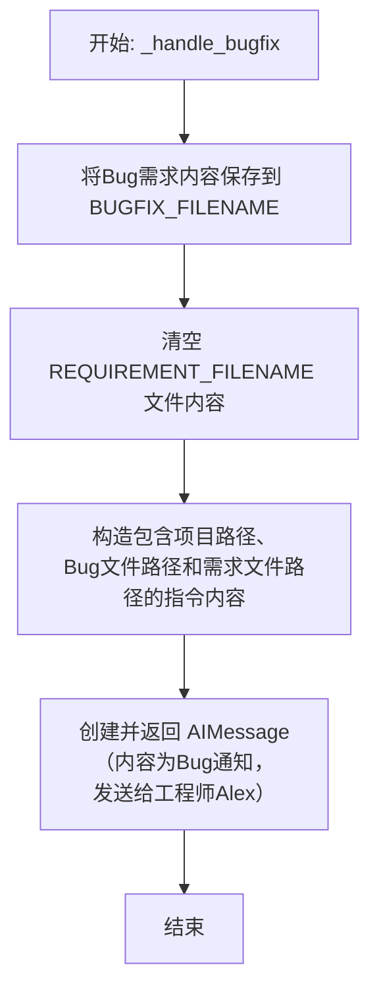

#### 带注释源码

```python
async def _handle_bugfix(self, req: Document) -> AIMessage:
    # 将Bug修复需求的内容保存到指定的Bug修复文件中
    await self.repo.docs.save(filename=BUGFIX_FILENAME, content=req.content)
    # 清空原始需求文件，表示该需求已作为Bug处理
    await self.repo.docs.save(filename=REQUIREMENT_FILENAME, content="")
    # 构造并返回一个AIMessage，用于通知工程师处理Bug
    return AIMessage(
        # 消息内容，简单提示收到了一个新问题
        content=f"A new issue is received: {BUGFIX_FILENAME}",
        # 指定该消息的触发原因是FixBug动作
        cause_by=FixBug,
        # 构造结构化的指令内容，包含项目路径、Bug文件路径和需求文件路径
        instruct_content=AIMessage.create_instruct_value(
            {
                "project_path": str(self.repo.workdir),
                "issue_filename": str(self.repo.docs.workdir / BUGFIX_FILENAME),
                "requirements_filename": str(self.repo.docs.workdir / REQUIREMENT_FILENAME),
            },
            class_name="IssueDetail",
        ),
        # 指定该消息的接收者为名为“Alex”的工程师
        send_to="Alex",  # the name of Engineer
    )
```

### `WritePRD._handle_new_requirement`

该方法用于处理新的产品需求，生成并保存新的产品需求文档（PRD）。它会创建一个新的PRD节点，重命名工作空间，保存PRD文档，并生成竞争分析图表和PDF报告。

参数：

- `req`：`Document`，包含新需求内容的文档对象。

返回值：`ActionOutput`，包含新生成的PRD文档信息的操作输出对象。

#### 流程图

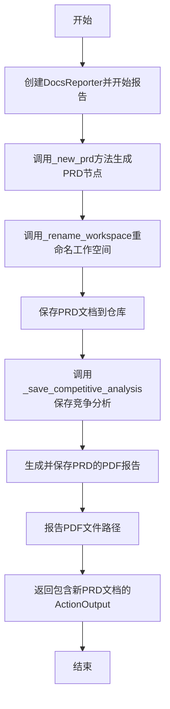

#### 带注释源码

```python
async def _handle_new_requirement(self, req: Document) -> ActionOutput:
    """handle new requirement"""
    # 使用DocsReporter进行文档生成过程的报告，支持LLM流式输出
    async with DocsReporter(enable_llm_stream=True) as reporter:
        # 报告PRD生成的元信息
        await reporter.async_report({"type": "prd"}, "meta")
        # 调用_new_prd方法，基于需求内容生成新的PRD节点
        node = await self._new_prd(req.content)
        # 根据PRD中的项目名称重命名工作空间
        await self._rename_workspace(node)
        # 在文档仓库中保存新的PRD文档，文件名为自动生成
        new_prd_doc = await self.repo.docs.prd.save(
            filename=FileRepository.new_filename() + ".json", content=node.instruct_content.model_dump_json()
        )
        # 保存竞争分析图表（如果PRD中包含）
        await self._save_competitive_analysis(new_prd_doc)
        # 生成并保存PRD的PDF报告，返回PDF文档对象
        md = await self.repo.resources.prd.save_pdf(doc=new_prd_doc)
        # 报告生成的PDF文件路径
        await reporter.async_report(self.repo.workdir / md.root_relative_path, "path")
        # 将新PRD文档包装成ActionOutput并返回
        return Documents.from_iterable(documents=[new_prd_doc]).to_action_output()
```

### `WritePRD._handle_requirement_update`

该方法用于处理产品需求文档（PRD）的更新请求。当接收到新的需求更新时，它会遍历所有相关的现有PRD文档，调用`_update_prd`方法将新需求合并到每个相关文档中，并最终返回一个包含所有更新后文档的`ActionOutput`对象。

参数：

- `req`：`Document`，包含新需求内容的文档对象。
- `related_docs`：`list[Document]`，与新需求相关的现有PRD文档列表。

返回值：`ActionOutput`，包含所有更新后的PRD文档的`ActionOutput`对象。

#### 流程图

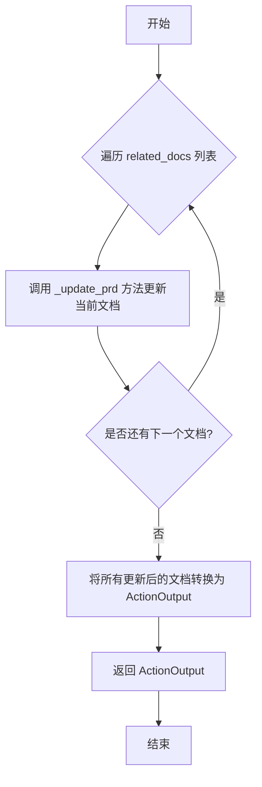

#### 带注释源码

```python
async def _handle_requirement_update(self, req: Document, related_docs: list[Document]) -> ActionOutput:
    # ... requirement update logic ...
    # 遍历所有与新需求相关的文档
    for doc in related_docs:
        # 调用 _update_prd 方法将新需求合并到当前文档中
        await self._update_prd(req=req, prd_doc=doc)
    # 将所有更新后的文档转换为 ActionOutput 对象并返回
    return Documents.from_iterable(documents=related_docs).to_action_output()
```

### `WritePRD._is_bugfix`

该方法用于判断给定的需求上下文是否属于Bug修复类型。它通过调用一个预定义的ActionNode（`WP_ISSUE_TYPE_NODE`）来利用大语言模型（LLM）对输入文本进行分类，判断其是否为“BUG”类型。

参数：

- `context`：`str`，包含用户需求描述的文本内容。

返回值：`bool`，如果LLM判断需求类型为“BUG”，则返回`True`，否则返回`False`。

#### 流程图

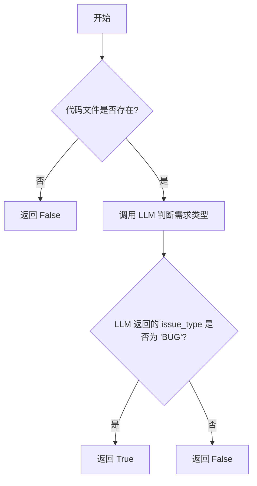

#### 带注释源码

```python
async def _is_bugfix(self, context: str) -> bool:
    # 首先检查当前项目仓库中是否存在代码文件。
    # 如果不存在代码文件，则不可能有Bug需要修复，直接返回False。
    if not self.repo.code_files_exists():
        return False
    # 使用预定义的 ActionNode `WP_ISSUE_TYPE_NODE` 和 LLM 对输入的 `context` 文本进行分析。
    # 该节点被设计用于从文本中提取并判断“问题类型”。
    node = await WP_ISSUE_TYPE_NODE.fill(req=context, llm=self.llm)
    # 从 ActionNode 的结果中获取 `issue_type` 字段的值。
    # 如果该值为 "BUG"，则返回 True，表示这是一个Bug修复需求。
    return node.get("issue_type") == "BUG"
```

### `WritePRD.get_related_docs`

该方法用于判断给定的新需求文档与一组现有PRD文档的关联性，并返回所有与当前需求相关的文档列表。它通过调用`_is_related`方法，使用LLM对每个现有文档与新需求进行语义相关性分析，筛选出需要更新的文档。

参数：
- `req`：`Document`，包含新需求内容的文档对象。
- `docs`：`list[Document]`，待筛选的现有PRD文档列表。

返回值：`list[Document]`，返回与当前新需求相关的所有现有PRD文档列表。如果没有任何文档相关，则返回空列表。

#### 流程图

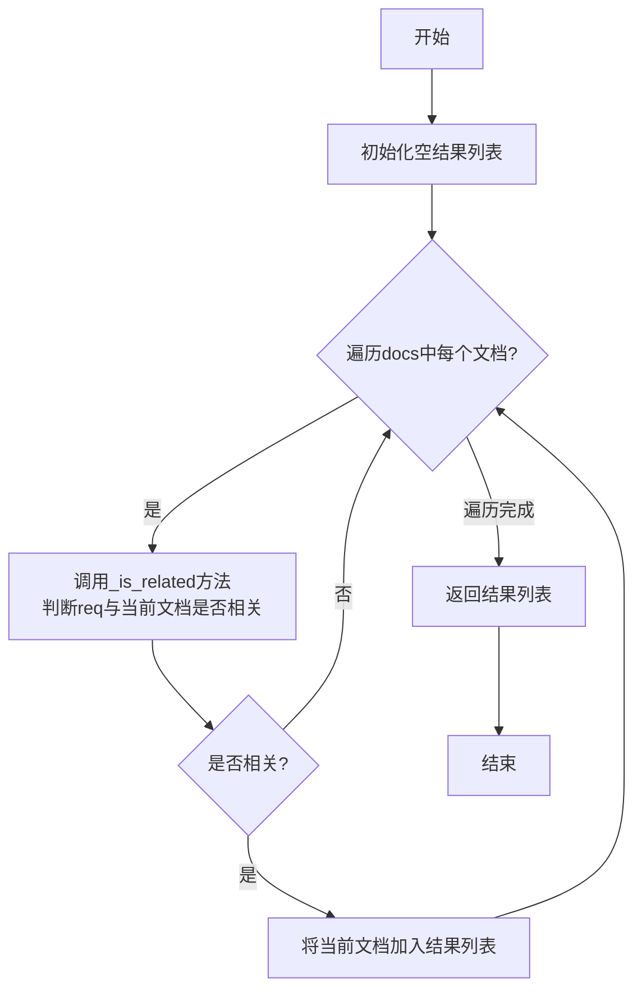

#### 带注释源码

```python
async def get_related_docs(self, req: Document, docs: list[Document]) -> list[Document]:
    """get the related documents"""
    # refine: use gather to speed up
    return [i for i in docs if await self._is_related(req, i)]
```

### `WritePRD._is_related`

该方法用于判断一个新的需求文档是否与一个已有的产品需求文档（PRD）相关。它通过构建一个包含旧PRD内容和新需求的上下文，并利用大语言模型（LLM）驱动的`WP_IS_RELATIVE_NODE`节点进行分析，最终返回一个布尔值表示两者是否相关。

参数：

- `req`：`Document`，新的需求文档对象，包含用户提出的新需求内容。
- `old_prd`：`Document`，已有的产品需求文档对象，包含旧PRD的内容。

返回值：`bool`，如果新需求与旧PRD相关则返回`True`，否则返回`False`。

#### 流程图

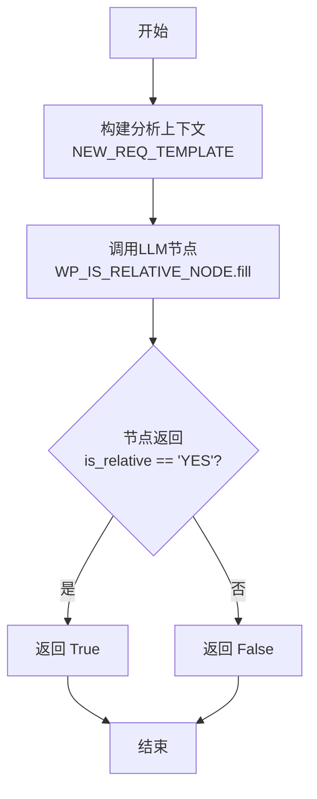

#### 带注释源码

```python
async def _is_related(self, req: Document, old_prd: Document) -> bool:
    # 1. 构建分析上下文：将旧PRD内容和新需求内容填充到预设的模板中。
    context = NEW_REQ_TEMPLATE.format(old_prd=old_prd.content, requirements=req.content)
    # 2. 调用LLM节点进行分析：将上下文发送给大语言模型，由`WP_IS_RELATIVE_NODE`节点判断相关性。
    node = await WP_IS_RELATIVE_NODE.fill(req=context, llm=self.llm)
    # 3. 解析并返回结果：检查节点返回的`is_relative`字段是否为"YES"，是则返回True，否则返回False。
    return node.get("is_relative") == "YES"
```

### `WritePRD._merge`

该方法用于合并新的需求与现有的产品需求文档（PRD），生成一个更新后的PRD文档。它通过调用LLM（大语言模型）来理解新旧需求，并整合它们。

参数：

- `req`：`Document`，包含新需求内容的文档对象。
- `related_doc`：`Document`，包含现有PRD内容的文档对象。

返回值：`Document`，返回一个更新后的PRD文档对象，其内容为合并后的JSON格式。

#### 流程图

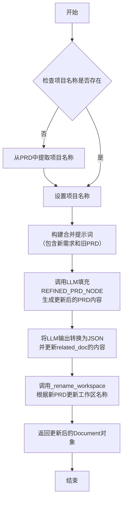

#### 带注释源码

```python
async def _merge(self, req: Document, related_doc: Document) -> Document:
    # 1. 确保项目名称已设置。如果未设置，则从项目路径或PRD内容中提取。
    if not self.project_name:
        self.project_name = Path(self.project_path).name
    # 2. 构建用于LLM的提示词，将新需求与旧PRD内容结合。
    prompt = NEW_REQ_TEMPLATE.format(requirements=req.content, old_prd=related_doc.content)
    # 3. 调用LLM，使用REFINED_PRD_NODE（一个ActionNode）来处理提示词，生成更新后的PRD结构。
    node = await REFINED_PRD_NODE.fill(req=prompt, llm=self.llm, schema=self.prompt_schema)
    # 4. 将LLM生成的更新内容（一个Pydantic模型的JSON字符串）赋值给旧PRD文档。
    related_doc.content = node.instruct_content.model_dump_json()
    # 5. 根据更新后的PRD内容，可能更新工作区（项目）的名称。
    await self._rename_workspace(node)
    # 6. 返回更新后的文档对象。
    return related_doc
```

### `WritePRD._update_prd`

该方法用于更新一个已存在的产品需求文档（PRD）。它接收新的需求和一个现有的PRD文档，通过合并新旧内容生成更新后的PRD，并保存相关文件（如竞争分析图表和PDF报告）。

参数：

- `req`：`Document`，包含新需求内容的文档对象。
- `prd_doc`：`Document`，待更新的现有PRD文档对象。

返回值：`Document`，更新后的PRD文档对象。

#### 流程图

```mermaid
flowchart TD
    A[开始: _update_prd(req, prd_doc)] --> B[启动DocsReporter<br>并报告PRD元数据]
    B --> C[调用_merge方法<br>合并新旧PRD内容]
    C --> D[保存更新后的PRD文档<br>到仓库]
    D --> E[调用_save_competitive_analysis<br>保存竞争分析图表]
    E --> F[生成并保存PRD的PDF报告]
    F --> G[报告PDF文件路径]
    G --> H[返回更新后的Document对象]
```

#### 带注释源码

```python
async def _update_prd(self, req: Document, prd_doc: Document) -> Document:
    # 启动文档报告器，用于流式报告生成过程（如LLM生成进度）
    async with DocsReporter(enable_llm_stream=True) as reporter:
        # 报告PRD生成的元数据
        await reporter.async_report({"type": "prd"}, "meta")
        # 调用_merge方法，将新需求(req)合并到现有PRD(prd_doc)中，生成新的PRD文档
        new_prd_doc: Document = await self._merge(req=req, related_doc=prd_doc)
        # 将更新后的PRD文档保存到项目仓库的docs/prd目录下
        await self.repo.docs.prd.save_doc(doc=new_prd_doc)
        # 如果PRD中包含竞争象限图，将其保存为Mermaid图表文件
        await self._save_competitive_analysis(new_prd_doc)
        # 将更新后的PRD文档转换为PDF格式并保存，返回PDF文档对象
        md = await self.repo.resources.prd.save_pdf(doc=new_prd_doc)
        # 报告生成的PDF文件路径
        await reporter.async_report(self.repo.workdir / md.root_relative_path, "path")
    # 返回更新后的PRD文档对象
    return new_prd_doc
```

### `WritePRD._save_competitive_analysis`

该方法用于从产品需求文档（PRD）中提取竞品分析象限图（Mermaid 格式），并将其渲染为图像文件（如 SVG），同时将生成的图像文件路径报告给图库报告器。

参数：

- `prd_doc`：`Document`，包含 PRD 内容的文档对象，其 `content` 属性应为 JSON 字符串。
- `output_filename`：`Path`，可选参数，指定竞品分析图像文件的输出路径。如果未提供，则使用默认路径：`{项目工作目录}/{COMPETITIVE_ANALYSIS_FILE_REPO}/{PRD文档名（不含扩展名）}`。

返回值：`None`，该方法不返回任何值。

#### 流程图

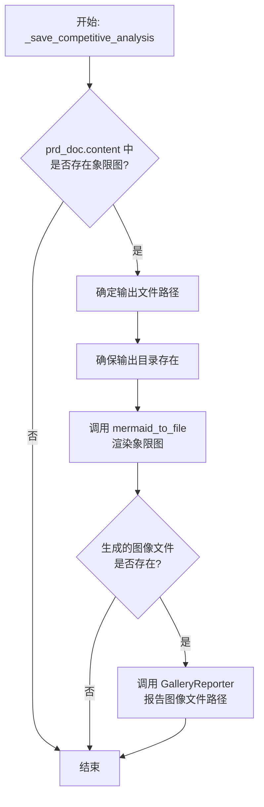

#### 带注释源码

```python
async def _save_competitive_analysis(self, prd_doc: Document, output_filename: Path = None):
    # 1. 从 PRD 文档内容（JSON 字符串）中解析出竞品分析象限图数据。
    m = json.loads(prd_doc.content)
    # COMPETITIVE_QUADRANT_CHART 是一个 ActionNode Key，用于定位象限图数据。
    quadrant_chart = m.get(COMPETITIVE_QUADRANT_CHART.key)
    
    # 2. 如果 PRD 中不包含竞品分析象限图，则直接返回。
    if not quadrant_chart:
        return
    
    # 3. 确定输出文件路径。
    #    如果调用者未指定 output_filename，则使用默认路径：
    #    {项目工作目录}/{竞品分析文件仓库}/{PRD文档名（不含扩展名）}
    pathname = output_filename or self.repo.workdir / COMPETITIVE_ANALYSIS_FILE_REPO / Path(prd_doc.filename).stem
    # 确保输出目录存在。
    pathname.parent.mkdir(parents=True, exist_ok=True)
    
    # 4. 调用 mermaid_to_file 函数，使用配置的 Mermaid 引擎将文本渲染为图像文件。
    #    图像文件将保存在 pathname 指定的路径（无扩展名），实际生成的文件会加上引擎对应的扩展名（如 .svg）。
    await mermaid_to_file(self.config.mermaid.engine, quadrant_chart, pathname)
    
    # 5. 检查生成的图像文件（假设为 .svg 格式）是否存在。
    image_path = pathname.parent / f"{pathname.name}.svg"
    if image_path.exists():
        # 6. 如果文件存在，则通过 GalleryReporter 报告其路径，以便在 UI 或日志中展示。
        await GalleryReporter().async_report(image_path, "path")
```

### `WritePRD._rename_workspace`

该方法用于根据PRD（产品需求文档）中提取的项目名称，重命名当前工作空间（项目根目录）的文件夹名称。如果类实例中已有`project_name`，则优先使用；否则从传入的PRD数据中解析项目名称，并更新`project_name`属性，最后调用Git仓库的重命名方法。

参数：

- `prd`：`Union[ActionOutput, ActionNode, str]`，包含PRD信息的对象或字符串，用于提取项目名称。

返回值：`None`，无返回值。

#### 流程图

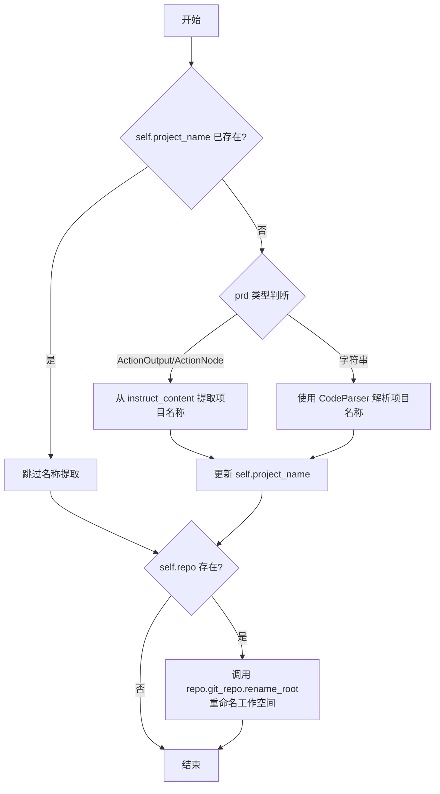

#### 带注释源码

```python
async def _rename_workspace(self, prd):
    # 如果当前实例的 project_name 属性为空，则尝试从 prd 参数中提取项目名称
    if not self.project_name:
        # 判断 prd 参数的类型，以不同的方式提取项目名称
        if isinstance(prd, (ActionOutput, ActionNode)):
            # 如果 prd 是 ActionOutput 或 ActionNode 类型，从其 instruct_content 中获取项目名称
            ws_name = prd.instruct_content.model_dump()["Project Name"]
        else:
            # 如果 prd 是字符串类型，使用 CodeParser 解析出 "Project Name" 块的内容
            ws_name = CodeParser.parse_str(block="Project Name", text=prd)
        # 如果成功提取到项目名称，则更新当前实例的 project_name 属性
        if ws_name:
            self.project_name = ws_name
    # 如果当前实例关联了项目仓库（self.repo 存在），则调用其 Git 仓库的重命名方法
    if self.repo:
        # 将项目根目录重命名为 self.project_name
        self.repo.git_repo.rename_root(self.project_name)
```

### `WritePRD._new_prd`

该方法用于根据新的用户需求生成一个全新的产品需求文档（PRD）的ActionNode。它通过填充预定义的PRD模板节点，结合项目名称和需求内容，生成结构化的PRD数据。

参数：

- `requirement`：`str`，包含用户原始需求的字符串。

返回值：`ActionNode`，一个填充了结构化PRD信息的ActionNode对象，其`instruct_content`属性包含了完整的PRD数据。

#### 流程图

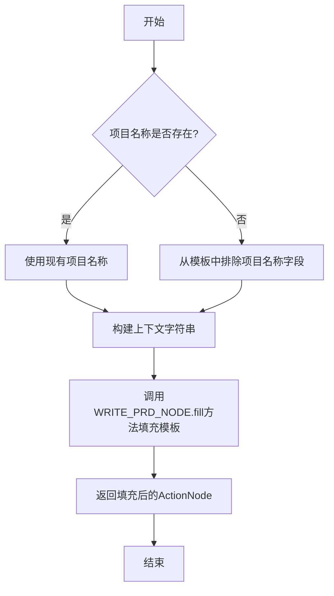

#### 带注释源码

```python
async def _new_prd(self, requirement: str) -> ActionNode:
    # 获取当前项目名称
    project_name = self.project_name
    # 使用模板格式化上下文，包含项目名称和用户需求
    context = CONTEXT_TEMPLATE.format(requirements=requirement, project_name=project_name)
    # 如果项目名称已存在，则在填充模板时排除“项目名称”字段，避免重复生成
    exclude = [PROJECT_NAME.key] if project_name else []
    # 调用预定义的WRITE_PRD_NODE（一个ActionNode）的fill方法
    # 使用LLM、上下文和排除列表来填充PRD模板，生成结构化的PRD数据
    node = await WRITE_PRD_NODE.fill(
        req=context, llm=self.llm, exclude=exclude, schema=self.prompt_schema
    )  # schema=schema
    # 返回填充好的ActionNode
    return node
```

## 关键组件


### 张量索引与惰性加载

代码中通过`Document.load`方法实现了文档的惰性加载，仅在需要时从文件系统读取文档内容，并通过`ProjectRepo`和`FileRepository`管理文档的存储和版本，支持增量迭代。

### 反量化支持

通过`ActionNode`的`instruct_content`属性（类型为`BaseModel`）和`model_dump_json()`方法，将结构化的LLM输出反序列化为JSON格式的文档内容，便于后续处理和存储。

### 量化策略

使用`ActionNode`及其预定义的节点（如`WRITE_PRD_NODE`, `REFINED_PRD_NODE`）作为量化模板，通过`fill`方法结合LLM和大语言模型提示词，将自然语言需求转化为结构化的产品需求文档数据。


## 问题及建议


### 已知问题

-   **代码复杂度高，职责不单一**：`WritePRD` 类的 `run` 方法过于庞大，承担了多种职责，包括判断需求类型（Bug修复、新需求、需求更新）、处理不同分支逻辑、文件操作、消息生成等。这违反了单一职责原则，导致方法难以理解、测试和维护。
-   **异步操作缺乏错误处理**：代码中大量使用了异步操作（如 `aread`, `awrite`, `save` 等），但缺乏统一的错误处理机制。例如，文件读取失败、网络请求超时等异常可能未被捕获，导致程序崩溃或状态不一致。
-   **硬编码的依赖和路径**：代码中存在多处硬编码的字符串，如 `"Alex"`（发送消息的对象名）、`BUGFIX_FILENAME` 等。这些硬编码降低了代码的灵活性和可配置性，增加了维护成本。
-   **潜在的循环依赖风险**：`WritePRD` 类通过 `self.context.kwargs.project_path` 等方式与外部上下文紧密耦合。这种隐式依赖使得类的独立性和可测试性变差，且可能引发循环依赖问题。
-   **资源管理不明确**：代码中使用了 `DocsReporter` 和 `GalleryReporter` 等资源，但它们的生命周期管理（如 `async with`）仅出现在部分方法中，可能导致资源泄露或状态不一致。
-   **缺乏输入验证**：`run` 方法的参数（如 `user_requirement`, `legacy_prd_filename`）缺乏严格的验证。例如，`legacy_prd_filename` 可能指向不存在的文件，但代码仅在后续读取时才会抛出异常，错误处理不够前置。
-   **魔法字符串和数字**：代码中使用了如 `"YES"`, `"BUG"` 等魔法字符串，以及通过 `CodeParser.parse_str` 解析特定块名（如 `"Project Name"`）。这些做法使得逻辑分散且难以维护，应使用枚举或常量代替。

### 优化建议

-   **重构以遵循单一职责原则**：将 `run` 方法拆分为多个更小、职责更明确的方法或类。例如，可以创建 `BugFixHandler`、`NewRequirementHandler`、`RequirementUpdateHandler` 等类，每个类负责处理一种特定的需求类型。`WritePRD` 类则主要充当协调者或工厂。
-   **增强错误处理与异常设计**：为所有异步操作和关键业务逻辑添加明确的异常处理。可以定义自定义异常类（如 `PRDGenerationError`, `FileOperationError`），并在适当位置捕获和记录异常，确保系统健壮性。
-   **使用配置管理替代硬编码**：将硬编码的字符串（如发送对象名、默认文件名）移至配置文件或环境变量中。通过依赖注入或配置对象来管理这些值，提高代码的可配置性和可维护性。
-   **解耦依赖，提高可测试性**：减少对 `self.context` 等全局状态的直接依赖。通过构造函数注入必要的依赖（如 `ProjectRepo`, `LLM` 实例）。这样可以使类更独立，便于单元测试和模拟。
-   **统一资源管理**：确保所有使用外部资源（如文件句柄、网络连接）的代码都遵循明确的资源管理协议（如使用 `async with` 上下文管理器）。可以考虑创建统一的资源管理类或装饰器。
-   **添加输入验证层**：在 `run` 方法开始时，对输入参数进行验证。使用 Pydantic 模型来定义和验证输入参数，确保数据的完整性和正确性，并将错误尽早抛出。
-   **使用枚举和常量**：将魔法字符串（如 `"YES"`, `"BUG"`）和块名（如 `"Project Name"`）定义为枚举类或模块级常量。这可以提高代码的可读性，并减少因拼写错误导致的 bug。
-   **优化异步操作**：在 `get_related_docs` 等方法中，注释提到“use gather to speed up”，但当前实现是顺序执行。应使用 `asyncio.gather` 来并行执行多个 `_is_related` 调用，以提高性能。
-   **改进日志记录**：当前的日志记录较为简单。可以增加更详细的调试信息、性能指标（如操作耗时）和结构化日志，以便于监控和问题排查。
-   **考虑添加缓存机制**：对于频繁读取且不常变动的数据（如已解析的旧 PRD 文档内容），可以考虑引入缓存机制，以减少不必要的文件 I/O 或 LLM 调用，提升性能。


## 其它


### 设计目标与约束

本模块的核心设计目标是提供一个灵活、可扩展的产品需求文档（PRD）生成与更新系统。它需要处理三种主要场景：全新PRD生成、基于现有PRD的增量更新以及Bug修复请求的识别与转发。设计上遵循了RFC 135和RFC 236的规范，强调将文件数据替换为文件名以优化消息传递，并支持增量迭代。系统被设计为可集成到更大的Agent工作流中（通过`Action`基类），同时对外提供简单的API调用接口（`_execute_api`方法）。主要约束包括：依赖LLM进行内容生成与逻辑判断（如相关性分析、问题类型识别），需要与项目文件仓库（`ProjectRepo`）紧密交互以管理文档状态，并需生成多种格式的输出（JSON、Markdown、PDF、图表）。

### 错误处理与异常设计

模块中的错误处理主要围绕文件操作和流程控制。当关键文件（如需求文档）缺失时，会抛出`FileNotFoundError`异常。在异步操作中（如文件读写、LLM调用），错误可能通过异步上下文传播。对于Bug修复场景，系统通过`_is_bugfix`方法进行识别，并将请求转发给专门的`FixBug`动作，自身不处理具体修复逻辑，这遵循了单一职责原则。在更新PRD时，如果合并过程（`_merge`）失败，异常会向上传递。整体上，错误处理策略偏向于“快速失败”，并在关键节点记录日志，但未实现复杂的重试或补偿机制。

### 数据流与状态机

数据流始于用户需求（字符串或`Message`），经过类型判断（新需求/更新/Bug）后分流。
1.  **新需求流**：用户需求 -> `_new_prd`（生成ActionNode）-> 保存为JSON文档 -> 触发竞争分析图表生成 -> 转换为Markdown/PDF报告。
2.  **更新流**：用户需求 + 现有PRD文档 -> `_is_related`判断 -> `_merge`合并 -> 更新原文档 -> 重新生成附属文件（图表、报告）。
3.  **Bug流**：用户需求 -> `_is_bugfix`判断为True -> `_handle_bugfix` -> 保存为BUG文件 -> 生成`IssueDetail`消息转发给工程师。
状态机隐含在`run`方法的分支逻辑中：系统根据输入（需求内容、是否存在旧PRD）决定进入“新需求”、“更新”或“Bug修复”状态。项目工作区的重命名（`_rename_workspace`）是一个副作用，会改变`ProjectRepo`的根目录状态。文档的“已更改”状态由`ProjectRepo`的`changed_files`属性跟踪。

### 外部依赖与接口契约

*   **LLM服务 (`self.llm`)**：核心依赖，用于执行`ActionNode`（如`WRITE_PRD_NODE`, `REFINED_PRD_NODE`）的填充，完成文本生成、判断和提炼。
*   **项目文件仓库 (`ProjectRepo`)**：强依赖，提供文档的增删改查、版本管理以及资源（如图表、报告）的保存能力。`WritePRD`通过其`docs`和`resources`属性与文件系统交互。
*   **配置系统 (`self.config`)**：依赖工作区路径等配置信息。
*   **工具注册表 (`register_tool`)**：通过装饰器将`WritePRD`类注册为工具，可能用于更广泛的工具调用生态。
*   **报告系统 (`DocsReporter`, `GalleryReporter`)**：依赖其进行生成过程的异步报告和可视化结果（如图表）的展示。
*   **Mermaid渲染引擎 (`self.config.mermaid.engine`)**：用于将竞争分析象限图的Mermaid代码渲染为图像文件。
*   **接口契约**：
    *   `run`方法：主入口，接受`Message`列表或关键字参数。返回`AIMessage`（集成到工作流）或字符串（API调用）。
    *   `_execute_api`方法：简化API，接受明确参数，返回结果字符串。
    *   与`FixBug`动作的契约：通过返回一个`cause_by=FixBug`的`AIMessage`来触发Bug修复流程。
    *   与上游`PrepareDocuments`动作的契约：期望通过`instruct_content`接收`PrepareDocumentsOutput`格式的数据，包含项目路径和文档文件名列表。

### 安全与合规考虑

代码中未显式涉及敏感数据处理（如个人身份信息）。主要考虑点在于：
1.  **LLM输入安全**：用户提供的`user_requirement`和`extra_info`会直接作为提示词的一部分发送给LLM，需防范提示词注入攻击。
2.  **文件路径安全**：`output_pathname`, `legacy_prd_filename`等参数会用于文件操作，需防范路径遍历攻击（Path Traversal）。代码中使用了`rectify_pathname`进行一定处理，并倾向于与配置的工作区路径结合，但应确保输入验证。
3.  **依赖安全**：所有外部库（如`pydantic`, `metagpt.*`）的版本需管理，避免已知漏洞。
4.  **输出内容合规**：生成的PRD内容基于LLM，可能产生不符合特定领域法规或公司政策的内容，需要后续审核或添加内容过滤机制。

### 性能考量

1.  **LLM调用优化**：`get_related_docs`方法中顺序判断文档相关性，可改为使用`asyncio.gather`并发执行`_is_related`以提升速度。
2.  **文件I/O**：频繁的文档保存、读取操作可能成为瓶颈，尤其是在处理大量或大文档时。`ProjectRepo`可能内部有缓存机制。
3.  **图表生成**：`_save_competitive_analysis`中的Mermaid渲染和SVG生成可能是同步阻塞调用，在异步环境中可能影响响应性，考虑是否需放入线程池执行。
4.  **内存使用**：将整个PRD文档（JSON内容）加载到内存中进行解析和合并，对于极大的文档需留意内存消耗。
5.  **增量更新**：当前“更新”流程会重新生成整个PRD文档和所有附属文件（如图表、PDF），而非真正意义上的增量更新文件内容，对于微小更改可能不够高效。

### 测试策略建议

1.  **单元测试**：
    *   `_is_bugfix`: 提供不同需求描述，验证是否能正确识别BUG类型。
    *   `_is_related`: 测试新旧需求内容的相关性判断逻辑。
    *   `_merge`: 测试新旧PRD内容的合并逻辑。
    *   `_rename_workspace`: 测试从PRD内容中提取并重命名项目工作区的逻辑。
2.  **集成测试**：
    *   `run`方法：模拟完整的`Message`工作流，测试新需求、更新、Bug修复三种分支的端到端流程，验证最终生成的文件和返回的消息结构。
    *   `_execute_api`方法：测试直接API调用的场景。
    *   与`ProjectRepo`的集成：测试文档的保存、加载、更改状态跟踪。
3.  **模拟（Mock）**：测试时应模拟`LLM`（返回预定义的`ActionNode`）、`FileRepository`操作、`DocsReporter`等外部依赖，使测试快速且稳定。
4.  **快照测试**：对于生成的PRD JSON结构、Markdown内容，可以进行快照测试，确保核心输出格式的稳定性。
5.  **性能测试**：针对多文档相关性判断的场景进行并发性能测试。

### 部署与运维

1.  **环境依赖**：需要Python环境、所有`requirements.txt`中列出的包（特别是`metagpt`套件）、可用的LLM API端点（如OpenAI）、Mermaid渲染环境（可能是本地安装的`mermaid-cli`或在线服务）。
2.  **配置管理**：`WritePRD`的行为依赖`self.config`（如工作区路径、Mermaid引擎），这些配置需要在部署时正确设置。
3.  **日志与监控**：通过`metagpt.logs.logger`记录关键步骤（如检测到Bug、新需求、更新），便于运维调试。可增加更细粒度的日志和性能指标（如LLM调用耗时、文件操作耗时）。
4.  **资源清理**：`Bugfix`流程中会删除旧的`BUGFIX_FILENAME`，但其他临时文件或中间产物的清理机制未明确。
5.  **扩展性**：作为`Action`子类，可以方便地集成到不同的MetaGPT智能体流程中。新增PRD模板或修改处理逻辑需要修改代码，可考虑通过配置化进一步解耦。

    