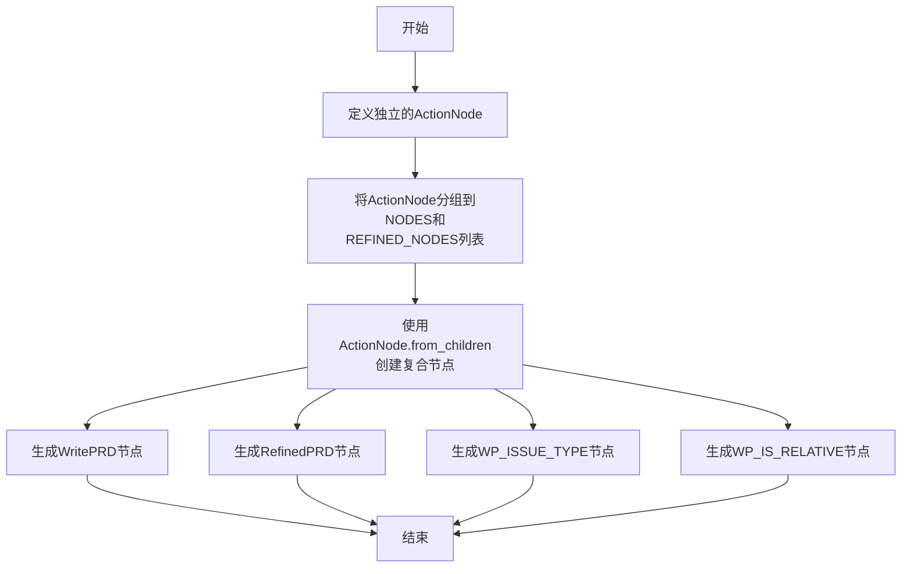

# `.\MetaGPT\metagpt\actions\write_prd_an.py` 详细设计文档

该文件定义了一系列用于生成和细化产品需求文档（PRD）的ActionNode对象，这些对象封装了PRD各个组成部分（如语言、编程语言、原始需求、产品目标、用户故事、竞品分析等）的元数据（键、期望类型、指令和示例），并组织成两个主要的PRD节点（WritePRD和RefinedPRD）以及两个用于问题分类的节点（WP_ISSUE_TYPE和WP_IS_RELATIVE）。

## 整体流程



## 类结构

```
ActionNode (来自metagpt.actions.action_node)
├── LANGUAGE
├── PROGRAMMING_LANGUAGE
├── ORIGINAL_REQUIREMENTS
├── REFINED_REQUIREMENTS
├── PROJECT_NAME
├── PRODUCT_GOALS
├── REFINED_PRODUCT_GOALS
├── USER_STORIES
├── REFINED_USER_STORIES
├── COMPETITIVE_ANALYSIS
├── COMPETITIVE_QUADRANT_CHART
├── REQUIREMENT_ANALYSIS
├── REFINED_REQUIREMENT_ANALYSIS
├── REQUIREMENT_POOL
├── REFINED_REQUIREMENT_POOL
├── UI_DESIGN_DRAFT
├── ANYTHING_UNCLEAR
├── ISSUE_TYPE
├── IS_RELATIVE
└── REASON
```

## 全局变量及字段


### `LANGUAGE`
    
定义项目使用的语言，通常与用户需求语言匹配

类型：`ActionNode`
    


### `PROGRAMMING_LANGUAGE`
    
定义项目使用的主流编程语言，未指定时默认使用Vite, React, MUI, Tailwind CSS

类型：`ActionNode`
    


### `ORIGINAL_REQUIREMENTS`
    
存储原始用户需求的节点

类型：`ActionNode`
    


### `REFINED_REQUIREMENTS`
    
存储经过精炼后的用户需求的节点

类型：`ActionNode`
    


### `PROJECT_NAME`
    
根据原始需求内容，使用蛇形命名法定义项目名称

类型：`ActionNode`
    


### `PRODUCT_GOALS`
    
定义最多三个清晰、正交的产品目标

类型：`ActionNode`
    


### `REFINED_PRODUCT_GOALS`
    
定义经过精炼和扩展后的产品目标，反映增量开发带来的需求变化

类型：`ActionNode`
    


### `USER_STORIES`
    
定义3到5个基于场景的用户故事

类型：`ActionNode`
    


### `REFINED_USER_STORIES`
    
定义经过精炼和扩展后的用户故事，反映增量开发带来的需求变化

类型：`ActionNode`
    


### `COMPETITIVE_ANALYSIS`
    
提供5到7个竞争产品分析

类型：`ActionNode`
    


### `COMPETITIVE_QUADRANT_CHART`
    
使用mermaid象限图语法展示竞争分析结果

类型：`ActionNode`
    


### `REQUIREMENT_ANALYSIS`
    
提供详细的需求分析

类型：`ActionNode`
    


### `REFINED_REQUIREMENT_ANALYSIS`
    
提供经过精炼的需求分析，以字符串列表形式呈现

类型：`ActionNode`
    


### `REQUIREMENT_POOL`
    
列出前5个需求及其优先级(P0, P1, P2)

类型：`ActionNode`
    


### `REFINED_REQUIREMENT_POOL`
    
列出5到7个需求及其优先级，包含遗留内容和增量内容

类型：`ActionNode`
    


### `UI_DESIGN_DRAFT`
    
提供UI设计的简单描述，包括元素、功能、样式和布局

类型：`ActionNode`
    


### `ANYTHING_UNCLEAR`
    
记录项目中不明确的方面并尝试澄清

类型：`ActionNode`
    


### `ISSUE_TYPE`
    
标识问题类型，BUG表示缺陷修复，REQUIREMENT表示需求变更

类型：`ActionNode`
    


### `IS_RELATIVE`
    
标识需求是否与旧PRD相关，YES表示相关，NO表示不相关

类型：`ActionNode`
    


### `REASON`
    
解释从问题到答案的推理过程

类型：`ActionNode`
    


### `NODES`
    
包含所有基础PRD节点的列表，用于构建WritePRD

类型：`List[ActionNode]`
    


### `REFINED_NODES`
    
包含所有精炼PRD节点的列表，用于构建RefinedPRD

类型：`List[ActionNode]`
    


### `WRITE_PRD_NODE`
    
通过组合NODES列表中的节点构建的完整PRD节点

类型：`ActionNode`
    


### `REFINED_PRD_NODE`
    
通过组合REFINED_NODES列表中的节点构建的精炼PRD节点

类型：`ActionNode`
    


### `WP_ISSUE_TYPE_NODE`
    
组合ISSUE_TYPE和REASON节点构建的问题类型判断节点

类型：`ActionNode`
    


### `WP_IS_RELATIVE_NODE`
    
组合IS_RELATIVE和REASON节点构建的相关性判断节点

类型：`ActionNode`
    


### `ActionNode.key`
    
ActionNode的唯一标识符，用于区分不同的节点

类型：`str`
    


### `ActionNode.expected_type`
    
定义该节点期望的数据类型，可以是Python类型或类型字符串

类型：`Union[type, str]`
    


### `ActionNode.instruction`
    
提供该节点的详细说明和填写指导

类型：`str`
    


### `ActionNode.example`
    
提供该节点的示例值，用于指导用户如何填写

类型：`Any`
    
    

## 全局函数及方法

### `ActionNode.from_children`

该方法是一个类方法，用于根据一组子节点（`ActionNode` 实例）创建一个新的父 `ActionNode` 实例。它通过聚合所有子节点的信息（如键、期望类型、指令等）来构建父节点的内容，并建立父子关系。

参数：

- `name`：`str`，要创建的父节点的名称。
- `children`：`List[ActionNode]`，用于构建父节点的子节点列表。

返回值：`ActionNode`，返回一个根据子节点信息构建的新 `ActionNode` 实例。

#### 流程图

```mermaid
flowchart TD
    A[开始: from_children(name, children)] --> B[初始化空字典 content]
    B --> C{遍历 children 列表?}
    C -- 是 --> D[获取子节点 child]
    D --> E[将 child.key 作为键<br>child 的序列化内容作为值<br>存入 content 字典]
    E --> C
    C -- 否 --> F[创建新的 ActionNode 实例<br>key=name, content=content]
    F --> G[设置新节点的子节点为 children]
    G --> H[返回新创建的 ActionNode 实例]
    H --> I[结束]
```

#### 带注释源码

```python
@classmethod
def from_children(cls, name: str, children: List["ActionNode"]) -> "ActionNode":
    """
    类方法：根据一组子节点创建一个新的父节点。
    
    参数:
        name (str): 父节点的名称，将作为新节点的 key。
        children (List[ActionNode]): 子节点列表，用于构建父节点的内容。
    
    返回:
        ActionNode: 一个新的 ActionNode 实例，其内容由所有子节点的信息聚合而成。
    """
    # 初始化一个空字典，用于存储子节点序列化后的内容
    content = {}
    # 遍历所有子节点
    for child in children:
        # 将子节点的 key 作为字典的键，子节点序列化后的内容作为值
        content[child.key] = child.serialize(child)
    # 使用传入的 name 作为 key，聚合后的 content 作为内容，创建一个新的 ActionNode 实例
    node = cls(key=name, content=content)
    # 设置新创建的节点的子节点列表
    node.children = children
    # 返回新创建的节点
    return node
```

## 关键组件


### ActionNode 类

用于定义和构建结构化数据节点的核心组件，每个节点包含键、期望类型、指令和示例，用于生成或解析特定领域的文档内容。

### 节点定义与配置

一系列预定义的 ActionNode 实例，每个实例代表产品需求文档（PRD）中的一个特定字段或部分，如语言、需求、目标、用户故事等，通过标准化的结构来捕获和约束信息输入。

### 节点组合与聚合

通过 `ActionNode.from_children` 方法将多个独立的 ActionNode 实例组合成更高层级的复合节点（如 `WRITE_PRD_NODE`, `REFINED_PRD_NODE`），用于生成完整或特定场景（如问题类型判断）的文档模板。

### 原始与精炼节点集合

定义了 `NODES` 和 `REFINED_NODES` 两个列表，分别用于初始 PRD 创建和增量开发后的 PRD 精炼场景，体现了对同一文档不同生命周期阶段的结构化支持。


## 问题及建议


### 已知问题

-   **硬编码的默认技术栈**：`PROGRAMMING_LANGUAGE` 节点的 `instruction` 和 `example` 中硬编码了 `Vite, React, MUI, Tailwind CSS`。这限制了代码的通用性，使其看起来像是专门为前端项目设计的，而实际上 PRD 文档应适用于任何类型的软件项目。
-   **重复的节点定义**：`ORIGINAL_REQUIREMENTS` 和 `REFINED_REQUIREMENTS` 的 `instruction` 描述存在混淆。`REFINED_REQUIREMENTS` 的 `instruction` 写的是“Place the New user's original requirements here.”，这与其“精炼后需求”的名称不符，逻辑上应是放置精炼后的需求。
-   **潜在的类型安全风险**：`REFINED_REQUIREMENT_ANALYSIS` 节点的 `expected_type` 为 `Union[List[str], str]`，这种联合类型虽然灵活，但增加了下游处理逻辑的复杂性，需要同时处理字符串和列表两种格式，容易引发运行时错误。
-   **魔法字符串与列表**：节点列表 `NODES` 和 `REFINED_NODES` 是通过手动维护的列表定义的。当节点数量增多或结构变化时，这种方式容易出错，且不易于扩展和维护。
-   **示例内容过于具体**：多个节点（如 `USER_STORIES`, `COMPETITIVE_ANALYSIS`）的 `example` 字段使用了“2048游戏”的具体案例。虽然有助于理解，但可能给使用者造成误导，认为这是唯一或推荐的用例，降低了模板的抽象性和指导意义。

### 优化建议

-   **解耦技术栈默认值**：将 `PROGRAMMING_LANGUAGE` 节点的默认技术栈从 `instruction` 中移除，改为一个可配置的常量或从配置文件中读取。`instruction` 应更通用，例如：“指定项目使用的主流编程语言、框架或技术栈。”
-   **修正节点描述与逻辑**：修正 `REFINED_REQUIREMENTS` 节点的 `instruction`，明确其用途为放置“精炼后的需求”。同时，审查所有节点的描述，确保其准确性和一致性。
-   **统一数据类型**：重新评估 `REFINED_REQUIREMENT_ANALYSIS` 节点的数据类型需求。如果可能，将其 `expected_type` 统一为 `List[str]`，以简化处理逻辑并增强类型安全。如果必须支持字符串，应在文档中明确说明两种格式的使用场景。
-   **使用更结构化的方式管理节点**：考虑使用枚举（Enum）或字典来定义和管理这些 `ActionNode` 常量。可以创建一个 `PRDNodes` 类，将相关节点作为属性或类方法进行组织，提高代码的可读性和可维护性，并便于进行批量操作（如序列化、验证）。
-   **抽象化示例内容**：将过于具体的示例替换为更通用、领域无关的示例。例如，`USER_STORIES` 的示例可以改为描述一个“用户希望通过软件完成某个目标”的通用模式，而不是特定于游戏。
-   **增加配置与扩展点**：考虑将整个 PRD 模板（即 `NODES` 和 `REFINED_NODES` 的构成）设计为可配置的。允许用户根据项目类型（如前端、后端、移动端）加载不同的节点模板，提高系统的灵活性和适应性。


## 其它


### 设计目标与约束

本模块的设计目标是提供一个可扩展、可配置的PRD（产品需求文档）结构化定义框架。它通过预定义的`ActionNode`对象来标准化PRD文档的各个组成部分（如需求、目标、用户故事等），并支持创建两种主要节点：`WritePRD`（用于初始PRD生成）和`RefinedPRD`（用于PRD的迭代与精炼）。核心约束包括：1) 使用`ActionNode`作为基础构建块，其结构（key, expected_type, instruction, example）不可变；2) 节点集合（`NODES`和`REFINED_NODES`）定义了文档的固定章节结构，增减节点需同步更新这两个列表及对应的组合节点；3) 生成的组合节点（如`WRITE_PRD_NODE`）用于在更大的工作流中被调用和执行。

### 错误处理与异常设计

当前代码未显式包含错误处理逻辑。潜在的异常场景包括：1) 在创建`ActionNode`或使用`ActionNode.from_children`时，如果传入的参数不符合预期类型（如`expected_type`不是有效的类型提示），可能引发`TypeError`。2) 如果`NODES`或`REFINED_NODES`列表中的元素不是`ActionNode`实例，在后续处理中可能导致运行时错误。优化建议：应在节点创建和组合阶段添加类型验证，并考虑在更上层的调用者处捕获和处理这些潜在异常，例如在解析用户输入填充这些节点时。

### 数据流与状态机

本模块主要定义数据结构（节点定义）和静态结构（节点列表与组合），不包含运行时数据流或状态机。其数据流发生在外部：当本模块定义的`WRITE_PRD_NODE`或`REFINED_PRD_NODE`被`Action`类执行时，会接收上游的“需求”文本作为输入，然后按照各个子`ActionNode`的`instruction`引导LLM生成对应内容，填充节点的`content`字段，最终将所有子节点的内容组装成一个结构化的字典或文本输出。这是一个单向的、一次性的数据填充流程，无复杂状态转换。

### 外部依赖与接口契约

1.  **内部依赖**：强依赖于`metagpt.actions.action_node.ActionNode`类。本模块所有功能都围绕创建和组合`ActionNode`实例展开。`ActionNode`的接口（构造函数参数、`from_children`方法）是本模块正常工作的前提。
2.  **外部契约**：模块末尾导出的`WRITE_PRD_NODE`、`REFINED_PRD_NODE`、`WP_ISSUE_TYPE_NODE`、`WP_IS_RELATIVE_NODE`是提供给其他模块（如具体的`WritePRD`或`RefinePRD` Action）使用的公共接口。调用者约定：将这些节点作为模板，在运行时传入上下文信息以生成具体内容。任何对这些组合节点结构的修改（如增删子节点）都是破坏性变更，需要同步更新所有调用方。
3.  **隐式依赖**：`example`字段中使用的语法（如Mermaid语法）暗示了与支持该语法的渲染工具（如某些Markdown查看器）的兼容性期望。

### 配置管理与扩展性

当前配置以硬编码的Python常量形式存在，包括所有`ActionNode`实例的定义以及`NODES`和`REFINED_NODES`列表。扩展或修改PRD模板结构需要直接修改源代码。优化建议：可考虑将节点定义（key, instruction, example等）抽取到外部配置文件（如YAML、JSON）中，通过加载配置来动态生成`ActionNode`列表和组合节点，从而提高模板的可维护性和可扩展性，支持不同项目或团队定制不同的PRD结构。

### 安全与合规考量

本模块不直接处理用户数据或执行网络操作，主要风险较低。但需注意：1) `example`字段的内容可能包含示例数据，应确保其不包含敏感信息。2) 如果生成的PRD内容用于对外发布，需确保其中由LLM生成的部分（基于本模块的`instruction`引导）符合内容安全与合规要求，这依赖于上游LLM调用方的过滤与审核机制。模块本身未内置相关内容审查功能。

    