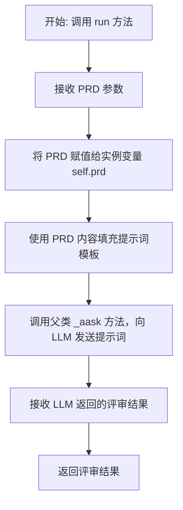
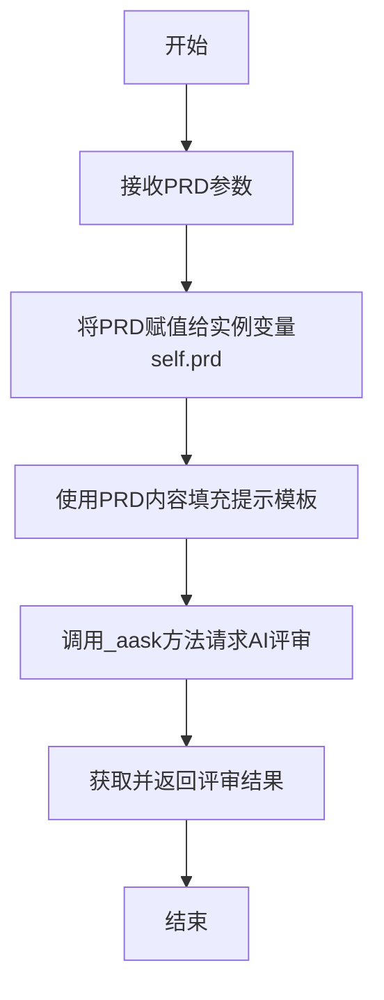

# `.\MetaGPT\metagpt\actions\write_prd_review.py` 详细设计文档

该代码定义了一个名为 WritePRDReview 的 Action 类，其核心功能是基于给定的产品需求文档（PRD），通过调用大语言模型生成详细的评审反馈和建议。

## 整体流程



## 类结构

```
Action (父类，来自 metagpt.actions.action)
└── WritePRDReview (子类，负责 PRD 评审)
```

## 全局变量及字段


### `WritePRDReview.name`
    
动作的名称标识符，当前为空字符串，可能用于在系统中唯一标识此动作。

类型：`str`
    


### `WritePRDReview.i_context`
    
可选的输入上下文信息，可能用于提供额外的背景或约束条件给动作执行。

类型：`Optional[str]`
    


### `WritePRDReview.prd`
    
存储待评审的产品需求文档（PRD）内容，作为动作执行的主要输入。

类型：`Optional[str]`
    


### `WritePRDReview.desc`
    
对该动作功能的描述，说明了其核心职责是基于PRD提供清晰详细的反馈。

类型：`str`
    


### `WritePRDReview.prd_review_prompt_template`
    
用于生成PRD评审提示词的模板字符串，定义了向AI模型提问的结构和内容。

类型：`str`
    
    

## 全局函数及方法

### `WritePRDReview.run`

该方法用于执行PRD（产品需求文档）评审。它接收一个PRD文档作为输入，使用预定义的提示模板生成一个评审请求，然后调用AI模型进行评审，并返回评审结果。

参数：

- `prd`：`str`，需要评审的产品需求文档内容。

返回值：`str`，AI模型生成的PRD评审反馈和建议。

#### 流程图



#### 带注释源码

```python
async def run(self, prd):
    # 将传入的PRD字符串保存到实例变量self.prd中，以便后续使用
    self.prd = prd
    # 使用实例变量self.prd的内容，填充预定义的提示模板prd_review_prompt_template
    # 生成一个完整的、面向AI模型的提示字符串
    prompt = self.prd_review_prompt_template.format(prd=self.prd)
    # 异步调用从父类Action继承的_aask方法
    # 该方法负责与AI模型（如LLM）交互，发送提示并获取响应
    review = await self._aask(prompt)
    # 将AI模型返回的评审内容（字符串）作为本方法的返回值
    return review
```

## 关键组件


### Action基类

提供所有Action子类的通用框架，定义了异步执行的核心接口和基础属性。

### WritePRDReview类

继承自Action基类，专门用于执行产品需求文档（PRD）的评审任务，通过模板生成提示词并调用大模型获取评审反馈。

### 提示词模板 (`prd_review_prompt_template`)

一个字符串模板，用于将具体的PRD内容格式化，生成发送给大模型（如GPT）的完整提示词，以引导其进行PRD评审。

### 异步执行方法 (`run`)

`WritePRDReview`类的核心方法，接收PRD内容，使用提示词模板进行格式化，然后异步调用大模型的问答接口获取评审结果并返回。


## 问题及建议


### 已知问题

-   **类字段 `name` 和 `i_context` 未在 `run` 方法中使用**：`name` 字段为空字符串，`i_context` 字段在类中定义但未在 `run` 方法或任何逻辑中使用，这可能导致代码意图不明确，并可能在未来引发维护问题。
-   **硬编码的提示词模板**：`prd_review_prompt_template` 作为类属性硬编码在代码中，这使得模板难以根据不同的使用场景或需求进行修改或定制，降低了代码的灵活性和可配置性。
-   **缺乏输入验证**：`run` 方法直接使用传入的 `prd` 参数，没有进行任何有效性检查（例如，是否为 `None` 或空字符串）。如果传入无效的 PRD 内容，可能导致后续的 `_aask` 方法调用产生非预期的结果或错误。
-   **继承的 `Action` 基类细节不明确**：该类继承自 `Action`，但文档中未提供 `Action` 基类的具体信息（如 `_aask` 方法的行为、其他可能影响 `WritePRDReview` 的字段或方法）。这种依赖关系不透明，增加了理解和使用该类的难度。

### 优化建议

-   **明确字段用途或移除无用字段**：如果 `name` 和 `i_context` 字段在当前或未来逻辑中确实不需要，应考虑将其移除，以避免混淆。如果它们有预期用途（例如，`name` 用于标识动作类型，`i_context` 用于存储额外的上下文），应在 `run` 方法或相关逻辑中体现其作用，并添加注释说明。
-   **将提示词模板外部化或参数化**：考虑将 `prd_review_prompt_template` 移至配置文件、环境变量或作为构造函数的参数传入。这样可以提高代码的可维护性和灵活性，允许在不修改代码的情况下调整提示词。
-   **添加输入验证逻辑**：在 `run` 方法的开始处，添加对 `prd` 参数的检查。例如，确保它不是 `None` 且不是空字符串或仅包含空白字符。如果验证失败，可以抛出一个清晰的异常（如 `ValueError`）或返回一个明确的错误信息，以提高代码的健壮性。
-   **补充基类依赖的文档或说明**：在类的文档字符串或独立的设计文档中，简要说明 `Action` 基类的关键契约，特别是 `_aask` 方法的作用、输入输出预期以及可能抛出的异常。这有助于其他开发者理解该类的运行上下文和依赖。
-   **考虑异步方法的错误处理**：`run` 方法是异步的，并调用了 `_aask`。建议在方法内部添加 `try-except` 块来捕获和处理 `_aask` 可能抛出的异常（如网络错误、API调用失败等），确保异步操作的稳定性，并提供有意义的错误反馈。


## 其它


### 设计目标与约束

本模块的核心设计目标是提供一个可复用的动作（Action），用于对产品需求文档（PRD）进行自动化评审，并生成反馈和建议。其设计遵循以下约束：
1.  **继承性**：作为 `Action` 基类的子类，必须实现 `run` 方法，并遵循其异步执行的约定。
2.  **可配置性**：通过类属性（如 `desc`, `prd_review_prompt_template`）允许对动作的描述和提示词模板进行定制，以适应不同的评审场景或风格。
3.  **职责单一**：该类的职责明确为“执行PRD评审”，不包含PRD的生成、存储或后续处理逻辑。
4.  **接口清晰**：`run` 方法以 PRD 文本作为输入，直接返回评审意见文本，输入输出简单明确。

### 错误处理与异常设计

当前代码未显式包含错误处理逻辑，依赖父类 `Action` 或执行环境。潜在的异常及处理方式分析如下：
1.  **模板格式化错误**：`prd_review_prompt_template.format(...)` 可能因模板字符串与传入的 `prd` 参数不匹配而引发 `KeyError`。当前设计假设模板格式正确且 `prd` 参数为字符串。
2.  **异步调用错误**：`await self._aask(prompt)` 可能因网络问题、模型服务不可用或提示词导致模型调用失败而引发异常。这些异常预计会向上传播给调用者。
3.  **输入数据为空或无效**：`run` 方法未对 `prd` 参数进行非空或有效性校验。传入 `None` 或空字符串可能导致无意义的评审结果或模板格式化问题。
   **建议的改进方向**：在 `run` 方法开始处增加对 `prd` 参数的校验（如 `if not prd:`），并考虑抛出 `ValueError` 或返回明确的错误信息。

### 数据流与状态机

该模块的数据流相对线性，不涉及复杂的状态转换：
1.  **数据输入**：外部调用者通过调用 `run(prd)` 方法传入 `prd`（字符串类型）。
2.  **内部处理**：
    a. `run` 方法将传入的 `prd` 存储到实例属性 `self.prd` 中（此步骤非必需，主要为可能的后续处理或调试提供便利）。
    b. 使用 `self.prd` 填充预定义的 `prd_review_prompt_template`，生成完整的提示词（`prompt`）。
    c. 调用继承自父类的 `_aask` 方法，将 `prompt` 发送给大语言模型（LLM）并等待其异步响应。
3.  **数据输出**：`_aask` 方法返回的模型响应（`review`，字符串类型）作为 `run` 方法的返回值，输出给调用者。
   **状态机**：该类本身是无状态的（Stateless）。每次 `run` 调用都是独立的，仅依赖于当次输入的 `prd` 和固定的模板。实例属性 `i_context` 和 `prd` 在每次运行后可能被覆盖，不用于维持跨调用状态。

### 外部依赖与接口契约

1.  **父类依赖**：强依赖于 `metagpt.actions.action.Action` 基类。契约包括：
    *   必须实现异步 `run` 方法。
    *   可以使用基类提供的 `_aask` 等方法与LLM交互。
    *   遵循基类可能定义的字段（如 `name`, `i_context`）和行为。
2.  **LLM服务依赖**：通过父类的 `_aask` 方法隐式依赖一个底层的大语言模型服务。契约是 `_aask` 接收一个字符串提示词并返回一个字符串响应。
3.  **调用者契约**：
    *   **输入**：调用 `run` 方法时必须提供一个有效的、字符串类型的 PRD 文档内容。
    *   **输出**：调用者将获得一个字符串类型的评审意见。
    *   **执行模式**：调用者必须在一个异步环境中调用 `run` 方法（使用 `await`）。

### 配置与扩展点

1.  **提示词模板**：`prd_review_prompt_template` 是一个关键的配置点。通过修改此模板字符串，可以改变评审的视角（如“作为资深产品经理”、“作为技术负责人”）、评审的侧重点或输出的格式要求，而无需修改代码逻辑。
2.  **动作描述**：`desc` 字段描述了此动作的用途，可能在更高层的系统（如智能体角色定义）中被用于解释该动作的能力。
3.  **类名与动作名**：`WritePRDReview` 类名和 `name` 属性（虽然当前为空）标识了此动作的类型，在动作注册、路由或日志中可能被使用。
   **扩展建议**：可以将 `prd_review_prompt_template` 设计为可从配置文件加载，以提供更大的灵活性。

### 测试策略建议

1.  **单元测试**：
    *   **`run` 方法**：模拟（Mock）`_aask` 方法，测试在给定输入 `prd` 下，是否正确构建了提示词并返回了模拟的LLM响应。应测试正常流程和边界情况（如空PRD、超长PRD）。
    *   **模板安全**：测试 `prd_review_prompt_template.format` 是否能正确处理包含特殊字符（如花括号`{}`）的PRD文本。
2.  **集成测试**：与真实的 `Action` 基类及LLM后端进行集成，测试从输入PRD到输出评审的端到端流程，确保提示词工程的有效性。
3.  **契约测试**：验证与父类 `Action` 的契约，确保 `run` 方法的签名和行为符合预期。

    