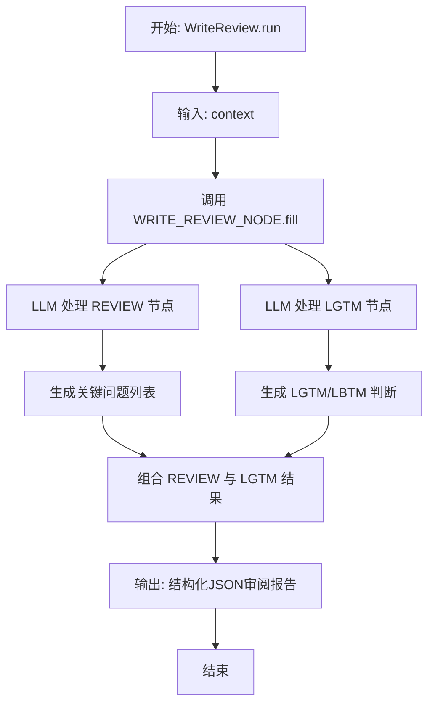
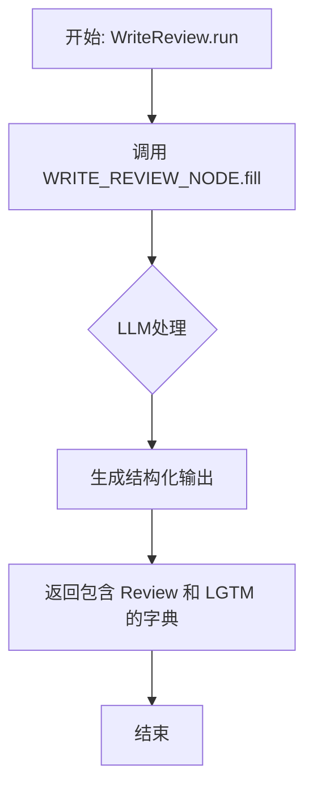

# `.\MetaGPT\metagpt\actions\write_review.py` 详细设计文档

该代码定义了一个名为 `WriteReview` 的审阅动作（Action），其核心功能是：利用大语言模型（LLM）对给定的上下文内容（如一份文档、代码或设计）进行结构化审阅。审阅过程通过一个预定义的 `ActionNode` 树（包含提出关键问题的 `REVIEW` 节点和给出最终判断的 `LGTM` 节点）来引导，最终生成一个包含审阅问题和总体评价的JSON格式结果。

## 整体流程



## 类结构

```
Action (来自 metagpt.actions)
└── WriteReview (审阅动作)

ActionNode (来自 metagpt.actions.action_node)
├── REVIEW (审阅问题节点)
├── LGTM (最终判断节点)
└── WRITE_REVIEW_NODE (根节点，聚合REVIEW和LGTM)
```

## 全局变量及字段


### `REVIEW`
    
定义评审环节的ActionNode，用于生成评审问题列表。

类型：`ActionNode`
    


### `LGTM`
    
定义最终批准环节的ActionNode，用于给出LGTM或LBTM的结论。

类型：`ActionNode`
    


### `WRITE_REVIEW_NODE`
    
由REVIEW和LGTM两个子节点组合而成的复合ActionNode，代表完整的评审流程。

类型：`ActionNode`
    


### `WriteReview.name`
    
Action的名称，固定为'WriteReview'。

类型：`str`
    
    

## 全局函数及方法

### `WriteReview.run`

该方法用于执行代码审查操作，根据给定的上下文生成审查意见和最终审查结论（LGTM/LBTM）。

参数：

- `context`：`str`，需要被审查的文本内容，例如PRD、代码片段等。

返回值：`dict`，返回一个字典，包含两个键值对：`"Review"`（审查问题列表）和`"LGTM"`（审查结论字符串）。

#### 流程图



#### 带注释源码

```python
async def run(self, context):
    # 调用预定义的 WRITE_REVIEW_NODE 的 fill 方法
    # 该方法将 `context` 作为请求发送给 LLM，并按照 JSON 格式返回结果
    # 返回的字典结构为：{"Review": [...], "LGTM": "..."}
    return await WRITE_REVIEW_NODE.fill(req=context, llm=self.llm, schema="json")
```

## 关键组件


### ActionNode 组件

ActionNode 是定义结构化 LLM 交互的核心组件，它通过指定键、期望类型、指令和示例来构建一个可复用的、用于指导大语言模型生成特定格式输出的模板节点。

### WriteReview 动作类

WriteReview 是一个具体的动作类，它继承自 Action 基类，封装了执行代码审查的核心逻辑。其 `run` 方法通过调用预定义的 `WRITE_REVIEW_NODE` 来驱动大语言模型生成包含审查问题和最终判断的结构化输出。

### 结构化审查流程节点 (WRITE_REVIEW_NODE)

WRITE_REVIEW_NODE 是一个由 REVIEW 和 LGTM 两个子节点组合而成的复合 ActionNode。它定义了一个标准化的审查流程：首先生成一系列批判性问题 (REVIEW)，然后给出一个最终的通过/不通过判断 (LGTM/LBTM)。

### 审查问题生成节点 (REVIEW)

REVIEW 节点专门用于指导大语言模型扮演资深评审者角色，针对给定的输出内容，生成一系列简洁、清晰的批判性问题，以帮助作者改进其工作。

### 最终裁决节点 (LGTM)

LGTM 节点用于指导大语言模型在审查流程的最后，根据对输出内容的整体评估，给出一个明确的“通过”(LGTM) 或“不通过”(LBTM) 的最终裁决。


## 问题及建议


### 已知问题

-   **`run` 方法参数命名过于宽泛**：`run` 方法的参数名为 `context`，其含义不明确。在 `Action` 的通用上下文中，`context` 可能指代任何输入信息，这降低了代码的可读性和可维护性。调用者需要查阅文档或深入代码才能理解应该传入什么内容。
-   **缺乏输入验证与错误处理**：代码没有对 `run` 方法的输入 `context` 进行任何验证。如果传入的数据格式不符合 `WRITE_REVIEW_NODE.fill` 方法的预期（例如，不是一个有效的提示字符串或字典），可能会导致底层 `llm` 调用失败或返回不可预测的结果，且错误信息可能难以追溯。
-   **硬编码的提示词结构**：`REVIEW` 和 `LGTM` 节点的 `instruction` 和 `example` 是硬编码在代码中的字符串。这使得调整审阅的标准、语气或示例变得困难，需要直接修改源代码，不利于根据不同项目或团队文化进行定制化配置。
-   **对 `ActionNode.fill` 的强依赖**：`WriteReview` 类的核心逻辑完全委托给 `WRITE_REVIEW_NODE.fill` 方法。这虽然遵循了框架设计，但也意味着 `WriteReview` 类本身几乎没有业务逻辑，更像一个薄包装。如果 `ActionNode` 的接口或行为发生变更，此类将直接受到影响，且难以独立测试其“审阅”逻辑。

### 优化建议

-   **明确方法参数语义**：将 `run` 方法的参数名从 `context` 改为更具业务含义的名称，例如 `content_to_review` 或 `prd_content`，以清晰表明该方法是对“什么内容”进行审阅。
-   **增加输入验证与健壮性处理**：在 `run` 方法开始处，添加对输入参数的验证逻辑。例如，检查 `context` 是否为非空字符串或字典。同时，使用 `try-except` 块捕获 `WRITE_REVIEW_NODE.fill` 可能抛出的异常，并转换为更具业务意义的异常或记录详细的错误日志，便于问题定位。
-   **将提示词配置外部化**：考虑将 `REVIEW` 和 `LGTM` `ActionNode` 的定义（特别是 `instruction` 和 `example`）移至配置文件（如 YAML、JSON）或环境变量中。这样可以在不修改代码的情况下调整审阅行为，也便于进行 A/B 测试或为不同场景配置不同的审阅模板。
-   **增强类的独立性与可测试性**：虽然当前设计符合框架规范，但可以考虑在 `WriteReview` 类内部封装一些预处理或后处理逻辑。例如，对 `WRITE_REVIEW_NODE.fill` 返回的原始结果进行解析、格式化或评分计算。这不仅能丰富 `WriteReview` 的功能，也使其核心逻辑更易于进行单元测试（通过 Mock `WRITE_REVIEW_NODE`），而无需依赖完整的 LLM 调用链。


## 其它


### 设计目标与约束

设计目标：提供一个可复用的代码审查动作，能够根据给定的上下文（如PRD、代码等）生成结构化的审查意见（包括关键问题列表和总体评价）。约束：依赖于MetaGPT框架的Action和ActionNode基类；输出格式需符合ActionNode定义的JSON Schema；审查逻辑完全由大语言模型驱动，无硬编码规则。

### 错误处理与异常设计

当前代码未显式处理错误。潜在异常点包括：`WRITE_REVIEW_NODE.fill` 方法调用时，可能因`llm`参数无效、网络问题或模型返回格式不符合`schema="json"`要求而抛出异常。建议在`run`方法中添加`try-except`块，捕获可能出现的`ValueError`, `KeyError`或网络相关异常，并记录日志或抛出更明确的业务异常（如`ReviewGenerationError`），以提升系统健壮性。

### 数据流与状态机

数据流：输入`context`（字符串） -> `WriteReview.run`方法 -> `WRITE_REVIEW_NODE.fill`方法 -> 调用大语言模型API -> 模型生成结构化JSON -> 解析JSON -> 返回包含`Review`（问题列表）和`LGTM`（评价字符串）的字典。状态机：本模块为无状态动作，每次调用独立，不维护内部状态。其执行构成一个简单的线性流程：接收请求 -> 构造提示 -> 调用LLM -> 解析响应 -> 返回结果。

### 外部依赖与接口契约

外部依赖：
1.  **MetaGPT框架**：强依赖`metagpt.actions.Action`和`metagpt.actions.action_node.ActionNode`类。
2.  **大语言模型（LLM）服务**：通过`self.llm`属性访问，需实现特定的异步调用接口（如`achat`或`afill`）。
接口契约：
*   **输入**：`run`方法的`context`参数应为字符串类型，代表待审查的内容。
*   **输出**：`run`方法返回一个字典（或可解析为字典的对象），其结构由`WRITE_REVIEW_NODE`定义，必须包含`"Review"`（`List[str]`）和`"LGTM"`（`str`）两个键。
*   **与框架的契约**：`WriteReview`类作为`Action`的子类，其`name`属性和`run`方法需符合MetaGPT对Action组件的预期，以便被工作流引擎正确调度和执行。

    