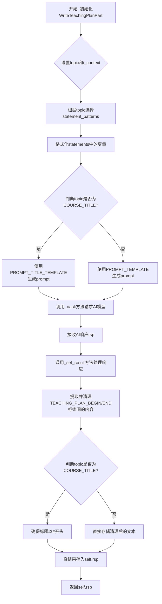
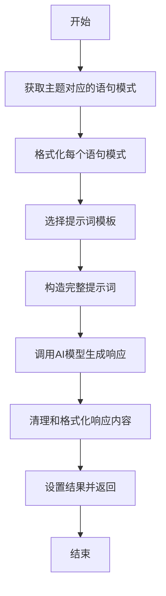
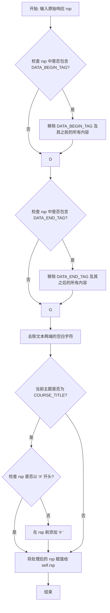
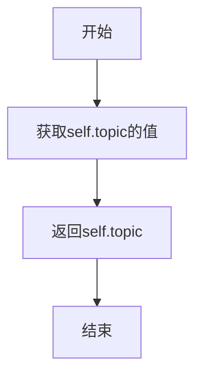
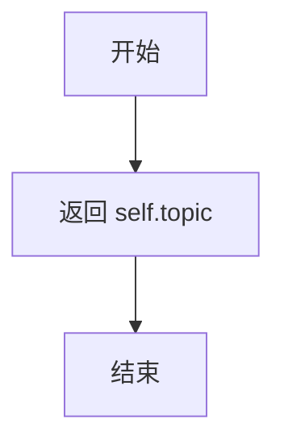

# `.\MetaGPT\metagpt\actions\write_teaching_plan.py` 详细设计文档

该代码实现了一个教学计划生成系统，核心功能是通过AI模型根据给定的课程内容（教科书文本）自动生成结构化教学计划的各个组成部分。系统定义了教学计划的多个标准主题（如教学目标、教学内容、教学方法等），并为每个主题提供专门的提示模板和格式化要求，最终生成符合规范的教学计划文档。

## 整体流程



## 类结构

```
Action (基类，来自metagpt.actions)
└── WriteTeachingPlanPart (教学计划部分生成器)
TeachingPlanBlock (静态配置类，包含教学计划的结构化定义)
```

## 全局变量及字段


### `WriteTeachingPlanPart.i_context`
    
存储待处理的课程内容或上下文信息，用于生成教案部分。

类型：`Optional[str]`
    


### `WriteTeachingPlanPart.topic`
    
标识当前要生成的教案部分主题，如'Teaching Objectives'或'Teaching Content'。

类型：`str`
    


### `WriteTeachingPlanPart.language`
    
指定生成教案内容所使用的语言，默认为'Chinese'。

类型：`str`
    


### `WriteTeachingPlanPart.rsp`
    
存储AI模型生成的教案部分内容或最终处理后的结果。

类型：`Optional[str]`
    


### `TeachingPlanBlock.FORMATION`
    
定义提示词模板中'Formation'部分的固定文本，用于说明整个提示的结构和角色定义。

类型：`str`
    


### `TeachingPlanBlock.COURSE_TITLE`
    
常量字符串，表示'Title'主题，用于标识和生成课程标题部分。

类型：`str`
    


### `TeachingPlanBlock.TOPICS`
    
包含所有教案部分主题的列表，定义了完整的教案结构。

类型：`List[str]`
    


### `TeachingPlanBlock.TOPIC_STATEMENTS`
    
字典，为每个教案主题（键）提供具体的生成指令或要求（值列表）。

类型：`Dict[str, List[str]]`
    


### `TeachingPlanBlock.PROMPT_TITLE_TEMPLATE`
    
用于生成课程标题的提示词模板字符串，包含特定的格式和约束。

类型：`str`
    


### `TeachingPlanBlock.PROMPT_TEMPLATE`
    
用于生成除标题外其他教案部分的通用提示词模板字符串。

类型：`str`
    


### `TeachingPlanBlock.DATA_BEGIN_TAG`
    
标记AI响应中教案内容开始的分隔符，用于从响应中提取有效内容。

类型：`str`
    


### `TeachingPlanBlock.DATA_END_TAG`
    
标记AI响应中教案内容结束的分隔符，用于从响应中提取有效内容。

类型：`str`
    
    

## 全局函数及方法

### `WriteTeachingPlanPart.run`

该方法用于生成教案的特定部分。它根据给定的主题（如课程标题、教学内容、教学方法等）和上下文信息，构造一个特定的提示词（prompt），然后调用AI模型生成相应的教案内容。生成的内容会被清理和格式化，最终返回处理后的结果。

参数：

- `with_message`：`Optional[Any]`，可选参数，通常用于传递额外的消息或上下文信息，但在当前实现中未直接使用。
- `**kwargs`：`Any`，关键字参数，用于传递额外的配置或上下文信息。

返回值：`Optional[str]`，返回处理后的教案部分内容字符串，如果未生成内容则返回`None`。

#### 流程图



#### 带注释源码

```python
async def run(self, with_message=None, **kwargs):
    # 1. 获取当前主题对应的语句模式列表
    statement_patterns = TeachingPlanBlock.TOPIC_STATEMENTS.get(self.topic, [])
    statements = []
    # 2. 遍历每个语句模式，使用上下文信息进行格式化
    for p in statement_patterns:
        s = self.format_value(p, context=self.context)
        statements.append(s)
    # 3. 根据主题选择提示词模板：课程标题使用特殊模板，其他部分使用通用模板
    formatter = (
        TeachingPlanBlock.PROMPT_TITLE_TEMPLATE
        if self.topic == TeachingPlanBlock.COURSE_TITLE
        else TeachingPlanBlock.PROMPT_TEMPLATE
    )
    # 4. 使用格式化后的语句、角色、课程内容等填充提示词模板
    prompt = formatter.format(
        formation=TeachingPlanBlock.FORMATION,
        role=self.prefix,
        statements="\n".join(statements),
        lesson=self.i_context,
        topic=self.topic,
        language=self.language,
    )

    # 5. 记录生成的提示词用于调试
    logger.debug(prompt)
    # 6. 调用AI模型生成响应
    rsp = await self._aask(prompt=prompt)
    # 7. 记录AI模型的响应用于调试
    logger.debug(rsp)
    # 8. 清理和格式化响应内容
    self._set_result(rsp)
    # 9. 返回处理后的结果
    return self.rsp
```

### `WriteTeachingPlanPart._set_result`

该方法用于处理从AI模型返回的响应文本（`rsp`）。其主要功能是清理响应文本，移除特定的标记标签（`[TEACHING_PLAN_BEGIN]` 和 `[TEACHING_PLAN_END]`），并对处理后的文本进行格式化。如果当前主题是“课程标题”（`COURSE_TITLE`），它会确保标题以Markdown一级标题（`# `）开头。处理后的最终结果存储在类的实例变量 `self.rsp` 中。

参数：

- `rsp`：`str`，从AI模型获取的原始响应文本。

返回值：`None`，该方法不返回任何值，其处理结果直接赋值给实例变量 `self.rsp`。

#### 流程图



#### 带注释源码

```python
def _set_result(self, rsp):
    # 1. 清理响应文本中的开始标记
    # 如果响应中包含预定义的开始标记 `DATA_BEGIN_TAG`（即 `[TEACHING_PLAN_BEGIN]`），
    # 则找到该标记的位置，并截取其之后的所有内容作为新的响应文本。
    # 这样做是为了去除AI响应中可能包含的指令性前缀。
    if TeachingPlanBlock.DATA_BEGIN_TAG in rsp:
        ix = rsp.index(TeachingPlanBlock.DATA_BEGIN_TAG)
        rsp = rsp[ix + len(TeachingPlanBlock.DATA_BEGIN_TAG) :]

    # 2. 清理响应文本中的结束标记
    # 如果响应中包含预定义的结束标记 `DATA_END_TAG`（即 `[TEACHING_PLAN_END]`），
    # 则找到该标记的位置，并截取其之前的所有内容作为新的响应文本。
    # 这样做是为了去除AI响应中可能包含的指令性后缀。
    if TeachingPlanBlock.DATA_END_TAG in rsp:
        ix = rsp.index(TeachingPlanBlock.DATA_END_TAG)
        rsp = rsp[0:ix]

    # 3. 基础格式化
    # 去除经过标记清理后的文本两端的空白字符（如空格、换行符），得到一个干净的字符串。
    self.rsp = rsp.strip()

    # 4. 特殊处理：课程标题格式化
    # 仅当当前处理的主题 (`self.topic`) 是 `COURSE_TITLE`（即“课程标题”）时，执行此步骤。
    if self.topic != TeachingPlanBlock.COURSE_TITLE:
        return # 如果不是标题主题，处理结束。

    # 检查清理后的标题文本 (`self.rsp`) 是否以Markdown一级标题符号 `#` 开头。
    # 条件 `'#' not in self.rsp` 检查字符串中是否包含 `#`。
    # 条件 `self.rsp.index('#') != 0` 检查 `#` 是否在字符串的开头（索引为0）。
    # 如果两个条件任一成立（即标题不以 `#` 开头），则在标题前添加 `# `。
    if "#" not in self.rsp or self.rsp.index("#") != 0:
        self.rsp = "# " + self.rsp
```

### `WriteTeachingPlanPart.__str__`

该方法重写了对象的字符串表示方法，当对`WriteTeachingPlanPart`类的实例调用`str()`函数或进行字符串格式化时，会返回该实例的`topic`字段值。

参数：

- `self`：`WriteTeachingPlanPart`，当前`WriteTeachingPlanPart`类的实例。

返回值：`str`，返回当前实例的`topic`字段值。

#### 流程图



#### 带注释源码

```python
def __str__(self):
    """Return `topic` value when str()"""
    return self.topic
```

### `WriteTeachingPlanPart.__repr__`

该方法用于在调试时提供对象的可读字符串表示，返回对象的 `topic` 字段值。

参数：

-  `self`：`WriteTeachingPlanPart`，当前 `WriteTeachingPlanPart` 类的实例。

返回值：`str`，返回 `self.topic` 字段的字符串值。

#### 流程图



#### 带注释源码

```python
    def __repr__(self):
        """Show `topic` value when debug"""
        # 返回实例的 `topic` 属性值，用于调试时的对象表示。
        return self.topic
```

### `WriteTeachingPlanPart.format_value`

`WriteTeachingPlanPart.format_value` 是一个静态方法，用于格式化字符串模板。其核心功能是接收一个可能包含占位符（如 `{key}`）的字符串 `value` 和一个 `Context` 对象，然后使用 `Context` 对象中的配置和额外参数来填充这些占位符，最终返回格式化后的字符串。如果 `value` 不是字符串或不包含占位符，则直接返回原值。该方法还具备一定的容错性，当使用标准 `str.format` 方法因键缺失而失败时，会回退到使用字符串替换的方式。

参数：

- `value`：`str`，需要格式化的字符串模板，可能包含 `{key}` 形式的占位符。
- `context`：`Context`，上下文对象，包含配置信息（`context.config`）和额外关键字参数（`context.kwargs`），用于提供填充占位符的值。

返回值：`str`，格式化后的字符串。如果输入 `value` 不是字符串或不包含占位符，则返回原 `value`。

#### 流程图

```mermaid
graph TD
    A[开始: format_value(value, context)] --> B{value 是字符串?};
    B -- 否 --> C[返回 value];
    B -- 是 --> D{value 包含 '{'?};
    D -- 否 --> C;
    D -- 是 --> E[构建 options 字典<br/>合并 config 和 kwargs];
    E --> F[尝试使用 str.format 格式化];
    F --> G{是否抛出 KeyError?};
    G -- 否 --> H[返回格式化结果];
    G -- 是 --> I[记录警告日志];
    I --> J[遍历 options，手动替换占位符];
    J --> K[返回替换后的字符串];
```

#### 带注释源码

```python
@staticmethod
def format_value(value, context: Context):
    """Fill parameters inside `value` with `options`."""
    # 1. 类型检查：如果输入值不是字符串，直接返回原值。
    if not isinstance(value, str):
        return value
    # 2. 占位符检查：如果字符串中不包含花括号 `{`，说明没有需要格式化的占位符，直接返回原字符串。
    if "{" not in value:
        return value

    # 3. 数据准备：从上下文对象中提取配置和额外参数，合并到一个字典中。
    #    首先，将配置对象转换为字典。
    options = context.config.model_dump()
    #    然后，遍历上下文的额外关键字参数，将它们添加到 options 字典中。
    #    注意：这里的 `context.kwargs` 被假定为一个可迭代的键值对序列。
    #    如果 kwargs 中的值为 None，它也会覆盖 config 中的值，这可能是为了有意识地禁用某些配置。
    for k, v in context.kwargs:
        options[k] = v  # None value is allowed to override and disable the value from config.
    # 4. 过滤 None 值：创建一个新字典，只包含值不为 None 的项，用于格式化。
    opts = {k: v for k, v in options.items() if v is not None}
    
    # 5. 主要格式化尝试：使用 Python 内置的 `str.format` 方法进行格式化。
    #    这是最标准、最健壮的方式，能正确处理各种复杂的格式化场景。
    try:
        return value.format(**opts)
    except KeyError as e:
        # 6. 异常处理：如果 `str.format` 因字典中缺少某个键而失败（抛出 KeyError），
        #    则记录一个警告日志，说明缺少哪个参数。
        logger.warning(f"Parameter is missing:{e}")

    # 7. 回退机制：如果 `str.format` 失败，则使用更简单但功能较弱的字符串替换方法作为备选方案。
    #    遍历 opts 字典中的每一项，将字符串中所有的 `{key}` 替换为对应的字符串形式的值。
    for k, v in opts.items():
        value = value.replace("{" + f"{k}" + "}", str(v))
    # 8. 返回最终结果：返回经过替换处理后的字符串。
    return value
```

## 关键组件


### WriteTeachingPlanPart 类

核心执行组件，负责根据给定的教学主题和上下文，生成教学计划的具体部分。它通过格式化提示词模板、调用AI模型获取响应，并对响应进行后处理（如提取标签内内容、格式化标题）来完成特定主题（如课程标题、教学内容、练习题目等）的编写任务。

### TeachingPlanBlock 类

静态配置与模板容器，定义了生成教学计划所需的所有常量、主题列表、各主题对应的详细指令语句以及用于构建提示词的核心模板。它不包含执行逻辑，但为 `WriteTeachingPlanPart` 类的运行提供了完整的数据和格式规范。

### 提示词模板系统

由 `TeachingPlanBlock.PROMPT_TITLE_TEMPLATE` 和 `TeachingPlanBlock.PROMPT_TEMPLATE` 构成，定义了与AI模型交互的精确指令格式。该系统通过“Formation”、“Capacity and role”、“Statement”、“Answer options”、“Constraint”等结构化部分，明确指导AI模型生成符合特定格式和内容要求（如使用特定语言、包含特定标签、采用Markdown格式）的教学计划内容。

### 上下文参数格式化

由 `WriteTeachingPlanPart.format_value` 静态方法实现，负责将配置上下文（`Context`）中的参数动态填充到字符串模板（如 `TOPIC_STATEMENTS` 中的语句）中。它支持标准的 `str.format` 语法，并在遇到缺失参数时提供回退机制，增强了模板的灵活性和可配置性。

### 响应后处理机制

在 `WriteTeachingPlanPart._set_result` 方法中实现，用于清理和标准化从AI模型获得的原始响应。其主要功能是提取 `[TEACHING_PLAN_BEGIN]` 和 `[TEACHING_PLAN_END]` 标签之间的核心内容，并对课程标题部分确保其符合Markdown一级标题（`# `）的格式要求。


## 问题及建议


### 已知问题

-   **硬编码与配置化不足**：`TeachingPlanBlock` 类中的 `FORMATION`、`TOPICS`、`TOPIC_STATEMENTS`、`PROMPT_TEMPLATE` 等大量字符串常量被硬编码在类定义中。这使得修改提示词、主题列表或格式要求变得困难，需要直接修改源代码，降低了代码的可维护性和灵活性。
-   **脆弱的字符串解析**：`WriteTeachingPlanPart._set_result` 方法使用字符串查找 (`index`) 和切片来提取 `[TEACHING_PLAN_BEGIN]` 和 `[TEACHING_PLAN_END]` 标签之间的内容。如果 AI 模型的响应格式稍有偏差（如标签拼写错误、换行位置不同），此解析逻辑可能失败，导致结果提取不正确或引发 `ValueError`。
-   **静态方法依赖上下文**：`WriteTeachingPlanPart.format_value` 是一个静态方法，但其功能严重依赖于传入的 `context` 参数。这种设计模糊了方法的职责边界，使其更像一个实例方法，但又被声明为静态方法，可能引起混淆。
-   **结果处理逻辑耦合**：`WriteTeachingPlanPart._set_result` 方法不仅负责提取标签间的内容，还专门为 `COURSE_TITLE` 主题添加了 Markdown 标题格式 (`# `) 的逻辑。这种针对特定主题的特殊处理与通用的结果清洗逻辑耦合在一起，违反了单一职责原则。
-   **潜在的 KeyError 处理不完整**：在 `format_value` 方法中，当使用 `str.format` 失败并捕获 `KeyError` 后，代码会回退到手动替换。然而，手动替换循环 (`for k, v in opts.items():`) 可能无法正确处理所有复杂的格式化字符串场景（例如嵌套花括号或格式说明符），可能导致替换不完整或错误。
-   **日志级别不当**：在 `run` 方法中，使用 `logger.debug` 记录生成的 `prompt` 和 AI 的响应 `rsp`。对于调试和问题诊断，这些信息至关重要，但 `debug` 级别在默认生产日志配置下可能不会被输出，使得线上问题排查困难。

### 优化建议

-   **将配置外部化**：建议将 `TeachingPlanBlock` 中的常量（如 `TOPICS`, `TOPIC_STATEMENTS`, 提示词模板）移至配置文件（如 YAML、JSON）或数据库中进行管理。这样可以在不修改代码的情况下调整教学计划的结构和生成逻辑，提高系统的可配置性和可维护性。
-   **增强解析鲁棒性**：重构 `_set_result` 方法，使用更健壮的解析方式，例如正则表达式，来匹配 `DATA_BEGIN_TAG` 和 `DATA_END_TAG` 之间的内容。正则表达式可以更好地处理标签周围的空白字符和可能的格式变化。同时，应添加更完善的错误处理，当无法找到标签时提供默认值或明确的错误信息。
-   **重构 `format_value` 方法**：考虑将 `format_value` 改为 `WriteTeachingPlanPart` 的实例方法，因为它明显依赖于实例的上下文 (`context`)。如果必须保持静态，应更清晰地说明其输入要求，并改进其回退替换逻辑，确保能处理所有预期的格式化字符串。
-   **分离关注点**：将 `_set_result` 方法中的通用内容提取逻辑与针对 `COURSE_TITLE` 的特殊格式化逻辑分离。可以创建一个专用的方法（如 `_format_course_title`）来处理标题的特定需求，使 `_set_result` 只负责通用的标签提取和清理工作。
-   **改进字符串格式化**：在 `format_value` 方法中，评估手动替换循环的充分性。考虑使用更高级的模板引擎（如 `string.Template` 或 Jinja2）来获得更强大、更安全的字符串插值功能，特别是当配置值变得复杂时。
-   **调整日志级别**：考虑将 `run` 方法中记录 `prompt` 和最终 `rsp` 的日志级别从 `debug` 提升至 `info`。或者，提供一个配置开关，允许在需要诊断时动态启用详细日志记录。确保关键的操作步骤和输入输出在标准日志中可见。
-   **添加类型提示与验证**：为 `WriteTeachingPlanPart` 的字段（如 `i_context`, `topic`, `language`）添加更精确的类型提示。在 `run` 方法开始时，可以添加参数验证，确保 `topic` 等关键字段不为空且在 `TeachingPlanBlock.TOPICS` 范围内，提前暴露配置错误。
-   **考虑异步优化**：`run` 方法是异步的，主要等待 `_aask`。确保整个调用链（如果有）是异步友好的，以避免阻塞事件循环。如果 `format_value` 或 `_set_result` 未来可能涉及耗时操作（如 IO），也应考虑将其异步化。


## 其它


### 设计目标与约束

本模块的核心设计目标是提供一个可扩展、模块化的框架，用于根据给定的教材内容（`i_context`）和特定主题（`topic`），自动生成教学计划的各个组成部分。其设计遵循以下约束：
1.  **模块化与职责分离**：`WriteTeachingPlanPart` 类作为 `Action` 的子类，负责执行单一、具体的教学计划部分生成任务。`TeachingPlanBlock` 类作为静态配置和模板的持有者，负责定义生成逻辑的结构、主题列表和提示词模板，实现了业务逻辑与配置数据的分离。
2.  **可配置性与模板驱动**：生成过程由 `TeachingPlanBlock` 中定义的静态模板（`PROMPT_TEMPLATE`, `PROMPT_TITLE_TEMPLATE`）和主题声明（`TOPIC_STATEMENTS`）驱动，使得生成逻辑的调整无需修改核心代码，只需更新配置即可支持新的教学计划部分或修改生成要求。
3.  **输出标准化**：通过预定义的标签（`DATA_BEGIN_TAG`, `DATA_END_TAG`）对大型语言模型（LLM）的输出进行包裹，并在 `_set_result` 方法中进行解析和清理，确保返回纯净的、格式化的内容（如为标题添加 Markdown 一级标题标记 `#`），提高了与下游处理流程的兼容性。
4.  **上下文感知**：通过 `format_value` 静态方法，支持将运行时上下文（`Context`）中的配置参数动态填充到模板字符串中，实现了提示词的参数化，增强了灵活性。

### 错误处理与异常设计

当前代码的错误处理机制相对基础，主要体现在：
1.  **静默处理与日志记录**：在 `format_value` 方法中，当使用 `str.format` 因缺少键值而抛出 `KeyError` 时，代码会捕获该异常，记录一条警告日志（`logger.warning`），然后尝试通过字符串替换的方式进行回退处理。这种设计避免了因单个参数缺失导致整个流程中断，保证了鲁棒性，但可能掩盖了配置错误。
2.  **缺乏输入验证**：`run` 方法的关键输入参数（如 `self.i_context`, `self.topic`）未进行有效性或非空检查。如果 `self.topic` 不在 `TeachingPlanBlock.TOPICS` 列表中或 `TOPIC_STATEMENTS` 字典中，可能导致运行时错误或生成无意义的内容。
3.  **LLM 交互错误未显式处理**：`_aask` 方法（假设来自父类 `Action`）与 LLM 交互，但当前代码未显式处理其可能抛出的异常（如网络错误、API 调用失败、返回内容格式异常等）。这些错误会向上传播，依赖调用方处理。
4.  **结果解析的容错性**：`_set_result` 方法假设响应中一定包含 `DATA_BEGIN_TAG` 和 `DATA_END_TAG`。如果 LLM 未按指令返回带标签的内容，该方法可能无法正确提取结果，导致返回空字符串或未修剪的文本。

### 数据流与状态机

模块内的数据流清晰，但未构成复杂的状态机：
1.  **初始化数据流**：`WriteTeachingPlanPart` 实例的 `i_context`（教材内容）、`topic`（教学计划部分主题）、`language`（输出语言）等字段在对象创建后被设置。
2.  **执行期数据流**：
    a. **输入**：`run` 方法主要依赖实例字段 `i_context`, `topic`, `language` 以及类 `TeachingPlanBlock` 中的静态配置。
    b. **处理**：根据 `topic` 选择对应的声明语句（`TOPIC_STATEMENTS`）和提示词模板，利用 `format_value` 方法将上下文配置注入声明语句，最终组装成完整的提示词（`prompt`）。
    c. **外部调用**：将组装好的 `prompt` 通过 `_aask` 方法发送给 LLM 并获取响应（`rsp`）。
    d. **后处理**：响应 `rsp` 被传入 `_set_result` 方法，进行标签剥离和格式修正（如为标题添加 `#`），结果存储在 `self.rsp` 并作为方法返回值。
3.  **输出数据流**：处理后的纯净文本 `self.rsp` 作为 `run` 方法的返回值输出。整个流程是线性的、无状态的转换过程，从一个输入集合（教材内容+主题）到一个输出（该主题的教学计划部分文本）。`WriteTeachingPlanPart` 实例本身不维护跨多次 `run` 调用的状态。

### 外部依赖与接口契约

1.  **父类依赖**：`WriteTeachingPlanPart` 继承自 `metagpt.actions.Action`。它强依赖父类提供的 `_aask` 方法（用于与 LLM 交互）以及可能由父类或框架设置的 `self.prefix`（角色前缀）、`self.context`（上下文对象）。
2.  **上下文对象依赖**：`format_value` 方法以及 `run` 方法中访问 `self.context`，依赖于 `metagpt.context.Context` 类提供的配置信息（`context.config`）和额外参数（`context.kwargs`）。这构成了与元GPT框架运行时环境的契约。
3.  **日志系统依赖**：使用 `metagpt.logs.logger` 进行调试和警告信息记录，依赖于框架的日志配置。
4.  **隐式接口契约**：
    a. 调用方在调用 `run` 方法前，必须确保 `WriteTeachingPlanPart` 实例的 `i_context` 和 `topic` 字段已正确赋值。
    b. `self.context` 对象必须在 `run` 方法被调用时已有效注入到实例中。
    c. `_aask` 方法预期返回一个字符串类型的响应。
    d. `TeachingPlanBlock` 类中的静态配置（如 `TOPICS`, `TOPIC_STATEMENTS`, `PROMPT_TEMPLATE`）定义了生成任务的范围和规则，是模块功能的核心契约的一部分。


    