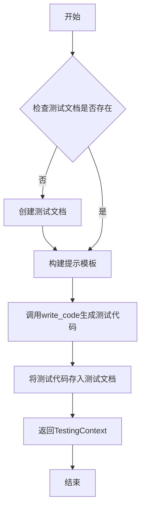

# `.\MetaGPT\metagpt\actions\write_test.py` 详细设计文档

该文件定义了一个名为 WriteTest 的 Action 类，其核心功能是基于给定的源代码，通过调用大语言模型生成相应的单元测试代码，并将生成的测试代码封装到 TestingContext 中，作为自动化测试流程的一部分。

## 整体流程

```mermaid
graph TD
    A[开始: WriteTest.run()] --> B{检查测试文档是否存在?}
    B -- 否 --> C[创建新的测试文档对象]
    B -- 是 --> D[使用模板构造提示词]
    C --> D
    D --> E[调用大语言模型生成测试代码]
    E --> F{解析生成的代码?}
    F -- 成功 --> G[将代码存入测试文档]
    F -- 失败 --> H[记录错误日志，使用原始响应]
    H --> G
    G --> I[返回包含测试代码的 TestingContext]
```

## 类结构

```
Action (基类)
└── WriteTest
```

## 全局变量及字段


### `PROMPT_TEMPLATE`
    
用于生成测试代码的提示词模板，包含测试用例编写的详细要求和格式规范。

类型：`str`
    


### `WriteTest.name`
    
动作的名称，标识该动作为编写测试用例。

类型：`str`
    


### `WriteTest.i_context`
    
测试上下文对象，包含待测试的代码文档和生成的测试文档等信息。

类型：`Optional[TestingContext]`
    
    

## 全局函数及方法

### `WriteTest.write_code`

该方法用于根据给定的提示词（prompt）调用大语言模型生成测试代码，并尝试解析返回的代码内容。如果解析失败，则记录错误并返回原始响应。

参数：
- `prompt`：`str`，包含代码上下文和指令的提示词，用于引导大语言模型生成测试代码。

返回值：`str`，返回解析后的代码字符串。如果解析失败，则返回大语言模型的原始响应。

#### 流程图

```mermaid
flowchart TD
    A[开始: write_code(prompt)] --> B[调用 _aask(prompt) 获取 LLM 原始响应]
    B --> C{尝试使用 CodeParser 解析代码}
    C -->|成功| D[返回解析后的代码]
    C -->|失败| E[记录错误日志]
    E --> F[返回 LLM 的原始响应]
    D --> G[结束]
    F --> G
```

#### 带注释源码

```python
async def write_code(self, prompt):
    # 1. 调用父类 Action 的 _aask 方法，向大语言模型发送提示词并获取原始响应。
    code_rsp = await self._aask(prompt)

    try:
        # 2. 尝试使用 CodeParser 工具从原始响应中解析出结构化的代码块。
        #    这通常用于处理被 Markdown 代码块（如 ```python ... ```）包裹的响应。
        code = CodeParser.parse_code(text=code_rsp)
    except Exception:
        # 3. 如果解析过程出现任何异常（例如，响应格式不符合预期），则执行以下操作：
        #    a. 使用 logger 记录错误信息，包含无法解析的原始响应。
        logger.error(f"Can't parse the code: {code_rsp}")

        #    b. 假设大语言模型直接返回了代码本身，没有用 ``` 包裹。
        #       将原始响应赋值给 code 变量，作为备用返回值。
        code = code_rsp
    # 4. 返回处理后的代码字符串（无论是成功解析的还是原始的）。
    return code
```

### `WriteTest.run`

该方法用于生成给定代码的测试用例。它基于提供的代码内容，使用预定义的提示模板生成测试代码，并将结果存储在测试文档中。

参数：

- `*args`：`tuple`，可变位置参数，当前未使用。
- `**kwargs`：`dict`，可变关键字参数，当前未使用。

返回值：`TestingContext`，包含生成的测试文档和原始代码文档的上下文对象。

#### 流程图



#### 带注释源码

```python
async def run(self, *args, **kwargs) -> TestingContext:
    # 如果测试文档不存在，则创建一个新的测试文档
    if not self.i_context.test_doc:
        self.i_context.test_doc = Document(
            filename="test_" + self.i_context.code_doc.filename,  # 测试文件名以'test_'为前缀
            root_path=TEST_CODES_FILE_REPO  # 测试文件的根路径
        )
    
    # 设置一个虚拟的根路径，用于构建提示模板中的文件路径
    fake_root = "/data"
    
    # 构建提示模板，填充代码内容、测试文件名、源文件路径和工作空间
    prompt = PROMPT_TEMPLATE.format(
        code_to_test=self.i_context.code_doc.content,  # 待测试的代码内容
        test_file_name=self.i_context.test_doc.filename,  # 测试文件名
        source_file_path=fake_root + "/" + self.i_context.code_doc.root_relative_path,  # 源文件路径
        workspace=fake_root,  # 工作空间路径
    )
    
    # 调用write_code方法生成测试代码，并存入测试文档
    self.i_context.test_doc.content = await self.write_code(prompt)
    
    # 返回包含测试文档和代码文档的上下文对象
    return self.i_context
```

## 关键组件


### 测试代码生成器 (WriteTest Action)

一个用于根据给定的源代码自动生成对应单元测试用例的Action类，它接收一个包含待测试代码文档的上下文，通过大语言模型生成符合unittest框架规范的测试代码。

### 测试上下文管理 (TestingContext)

一个用于封装测试生成过程所需所有信息的上下文对象，包括待测试的源代码文档和将要生成的测试代码文档，确保任务参数在对象创建时固化。

### 代码解析器 (CodeParser)

一个工具类，用于从大语言模型的响应文本中解析出结构化的代码块，确保生成的测试代码能够被正确提取和使用。

### 提示词工程 (PROMPT_TEMPLATE)

一个结构化的提示词模板，用于指导大语言模型生成高质量、覆盖全面、符合项目规范和目录结构的单元测试代码，包含了角色定义、要求、注意事项和具体的代码上下文。

### 文档对象模型 (Document)

一个表示代码文件（包括源代码和测试代码）的模型，封装了文件名、存储路径和文件内容等信息，用于在系统中统一管理和传递代码文档。

### 测试文件仓库路径 (TEST_CODES_FILE_REPO)

一个全局常量，定义了生成的测试代码文件在项目中的默认存储根目录，用于统一管理测试资产。


## 问题及建议


### 已知问题

-   **硬编码的根路径**：`run` 方法中使用了硬编码的 `fake_root = "/data"` 来构造文件路径。这假设了所有运行环境都使用相同的根目录结构，与实际项目配置（`workspace`）脱节，可能导致生成的测试代码中的导入语句路径不正确，从而无法执行。
-   **异常处理过于宽泛**：`write_code` 方法中的 `try...except` 块捕获了所有 `Exception`。这虽然能防止程序因解析失败而崩溃，但也可能掩盖了除 `CodeParser.parse_code` 失败之外的其他潜在错误（例如网络问题、逻辑错误），不利于调试和问题定位。
-   **缺少输入验证**：`run` 方法直接使用 `self.i_context` 的属性（如 `code_doc`），但未在方法开始时验证 `self.i_context` 或其关键属性是否为 `None`。如果 `i_context` 未正确初始化，可能导致 `AttributeError`。
-   **潜在的资源浪费**：每次调用 `run` 方法时，即使 `i_context.test_doc` 已存在，也会重新生成提示词并调用大模型生成测试代码。如果上下文未改变，这可能是不必要的计算开销。
-   **提示词模板中的路径逻辑可能混淆**：提示词模板 (`PROMPT_TEMPLATE`) 同时向模型传递了 `source_file_path`、`workspace` 和 `test_file_name` 来指导导入语句的编写。但 `workspace` 被设置为固定的 `fake_root` (`/data`)，而 `source_file_path` 是基于 `fake_root` 和 `code_doc.root_relative_path` 拼接的。如果 `root_relative_path` 的格式或起点与模型预期不符，可能导致模型生成错误的导入路径。

### 优化建议

-   **移除硬编码路径，使用配置或上下文**：`run` 方法中的 `fake_root` 应被替换为从项目配置、环境变量或 `TestingContext` 中获取的真实工作区 (`workspace`) 路径。例如，可以扩展 `TestingContext` 包含一个 `workspace` 字段，或者在 `Action` 基类/项目配置中获取。
-   **细化异常处理**：将 `write_code` 方法中的 `except Exception:` 改为只捕获 `CodeParser.parse_code` 可能抛出的特定异常（例如 `ValueError`, `SyntaxError` 或自定义的解析异常）。对于其他异常，应该记录更详细的错误信息并重新抛出，或者进行更明确的处理。
-   **增加输入验证**：在 `run` 方法的开始处，添加对 `self.i_context`、`self.i_context.code_doc` 等必要属性的非空检查。可以使用 `assert` 语句（在开发环境）或抛出更清晰的 `ValueError` 来确保方法的先决条件得到满足。
-   **引入缓存或条件执行逻辑**：可以考虑在 `TestingContext` 中增加一个哈希值（如基于 `code_doc.content` 计算），并在 `run` 方法中检查。如果上下文自上次成功运行后未发生变化，且 `test_doc.content` 已存在，则可以跳过生成步骤，直接返回现有上下文，提高效率。
-   **重构提示词路径生成逻辑**：确保传递给模型的路径参数 (`source_file_path`, `workspace`) 逻辑清晰且与实际项目结构一致。理想情况下，`workspace` 应为真实根目录，`source_file_path` 应为从该根目录到待测试代码文件的真实相对路径。这需要与调用方约定好 `TestingContext` 中路径信息的语义。
-   **考虑将提示词模板外部化**：将 `PROMPT_TEMPLATE` 移出代码文件，存储为独立的模板文件（如 `.txt` 或 `.jinja2` 文件）。这便于管理和修改提示词，而无需改动代码，也支持不同环境使用不同的模板。
-   **增强日志记录**：在 `run` 方法的关键步骤（如开始执行、生成提示词、调用大模型前后、保存结果前）添加更详细的 `INFO` 级别日志，便于跟踪执行流程和诊断问题。


## 其它


### 设计目标与约束

1. **设计目标**：
   - 自动化生成符合PEP8规范的、结构良好、可维护的Python 3.9测试用例。
   - 基于给定的代码上下文，生成覆盖全面的测试套件，确保项目质量。
   - 遵循现有代码的设计和接口，不改变任何数据结构或接口设计。
   - 生成的测试代码应具有默认值、强类型和显式变量声明。

2. **约束**：
   - 使用Python的unittest框架编写测试用例。
   - 测试代码必须正确导入被测试的类，基于给定的文件路径和项目结构。
   - 生成的测试代码必须放置在指定的测试目录中，并确保可执行性。
   - 遵循特定的提示模板格式，使用`##`分割章节，并在测试代码前添加章节标题。

### 错误处理与异常设计

1. **异常处理**：
   - 在`write_code`方法中，尝试使用`CodeParser.parse_code`解析生成的代码。如果解析失败，捕获异常并记录错误日志，同时返回原始生成的代码字符串。
   - 这种设计确保了即使代码解析失败，系统仍能继续运行，避免因解析错误导致整个任务中断。

2. **错误日志记录**：
   - 使用`logger.error`记录解析失败的具体信息，便于后续调试和问题追踪。
   - 日志信息包含无法解析的代码内容，帮助快速定位问题。

3. **默认值处理**：
   - 在`run`方法中，如果`i_context.test_doc`不存在，则创建一个新的`Document`对象作为测试文档，确保后续操作不会因缺少测试文档而失败。

### 数据流与状态机

1. **数据流**：
   - **输入**：`TestingContext`对象，包含待测试的代码文档（`code_doc`）和可选的测试文档（`test_doc`）。
   - **处理**：
     - 检查并初始化测试文档。
     - 根据提示模板生成测试代码的提示信息。
     - 调用`write_code`方法生成测试代码。
   - **输出**：更新后的`TestingContext`对象，其中`test_doc.content`包含生成的测试代码。

2. **状态机**：
   - **初始状态**：`WriteTest`对象初始化，`i_context`可能为空或包含部分信息。
   - **运行状态**：调用`run`方法，检查并初始化测试文档，生成提示信息，调用`write_code`生成测试代码。
   - **结束状态**：返回更新后的`TestingContext`对象，测试代码已生成并存储在`test_doc.content`中。

### 外部依赖与接口契约

1. **外部依赖**：
   - `metagpt.actions.action.Action`：基类，提供动作执行的基本框架。
   - `metagpt.const.TEST_CODES_FILE_REPO`：常量，定义测试代码的存储路径。
   - `metagpt.logs.logger`：日志记录器，用于记录错误和调试信息。
   - `metagpt.schema.Document`和`TestingContext`：数据模型，用于存储代码和测试上下文。
   - `metagpt.utils.common.CodeParser`：工具类，用于解析生成的代码。

2. **接口契约**：
   - `WriteTest.run`方法：接受任意参数，返回`TestingContext`对象。该方法负责整个测试代码生成流程。
   - `WriteTest.write_code`方法：接受提示信息字符串，返回生成的测试代码字符串。该方法负责与语言模型交互并解析响应。
   - 提示模板`PROMPT_TEMPLATE`：定义了生成测试代码的具体要求和格式，确保生成的代码符合项目规范。

3. **文件路径约定**：
   - 使用假根路径`/data`模拟项目结构，确保生成的测试代码能正确导入被测试的模块。
   - 测试代码文件命名约定：`test_` + 原始代码文件名，确保测试文件与源代码文件对应。

    