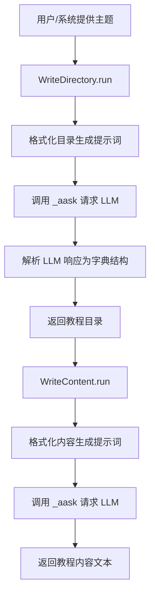
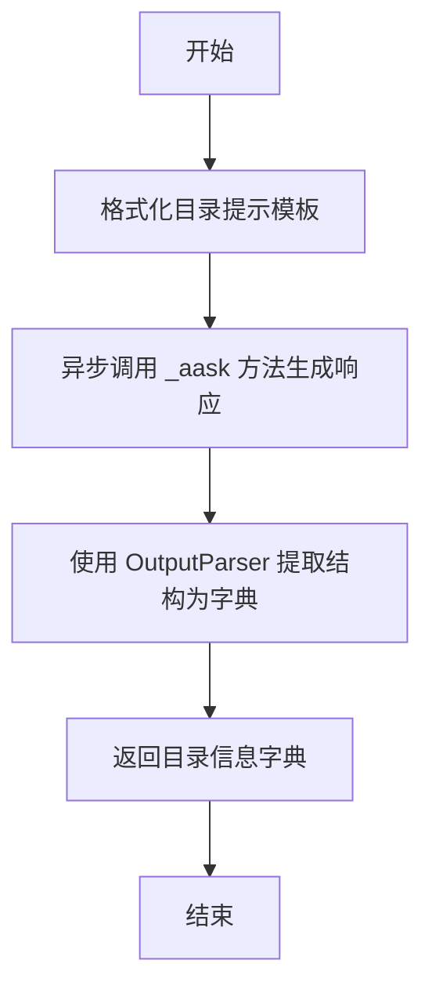
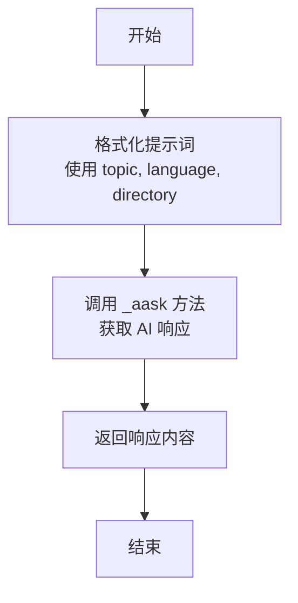

# `.\MetaGPT\metagpt\actions\write_tutorial.py` 详细设计文档

该代码定义了两个动作类，用于生成教程的目录和内容。WriteDirectory 根据给定的主题生成教程的目录结构，WriteContent 根据给定的主题和目录生成教程的详细内容。它们都继承自一个通用的 Action 基类，并通过调用大语言模型（LLM）的异步接口来完成核心任务。

## 整体流程



## 类结构

```
Action (基类，来自 metagpt.actions)
├── WriteDirectory
└── WriteContent
```

## 全局变量及字段


### `WriteDirectory.name`
    
动作类的名称，固定为'WriteDirectory'，用于标识该动作。

类型：`str`
    


### `WriteDirectory.language`
    
输出教程目录时使用的语言，默认为'Chinese'。

类型：`str`
    


### `WriteContent.name`
    
动作类的名称，固定为'WriteContent'，用于标识该动作。

类型：`str`
    


### `WriteContent.directory`
    
存储由WriteDirectory生成的教程目录结构，作为WriteContent生成具体内容的依据。

类型：`dict`
    


### `WriteContent.language`
    
输出教程内容时使用的语言，默认为'Chinese'。

类型：`str`
    
    

## 全局函数及方法

### `WriteDirectory.run`

该方法根据给定的主题生成教程目录。它使用预定义的目录提示模板，结合主题和语言设置，通过异步调用生成目录结构，并解析返回的响应为字典格式。

参数：

- `topic`：`str`，教程的主题。
- `*args`：可变位置参数，未在方法中使用。
- `**kwargs`：可变关键字参数，未在方法中使用。

返回值：`Dict`，返回教程目录信息，格式为 `{"title": "xxx", "directory": [{"dir 1": ["sub dir 1", "sub dir 2"]}]}`。

#### 流程图



#### 带注释源码

```python
async def run(self, topic: str, *args, **kwargs) -> Dict:
    """Execute the action to generate a tutorial directory according to the topic.

    Args:
        topic: The tutorial topic.

    Returns:
        the tutorial directory information, including {"title": "xxx", "directory": [{"dir 1": ["sub dir 1", "sub dir 2"]}]}.
    """
    # 使用 DIRECTORY_PROMPT 模板，结合主题和语言设置，生成提示字符串
    prompt = DIRECTORY_PROMPT.format(topic=topic, language=self.language)
    
    # 异步调用 _aask 方法，传入提示字符串，获取模型生成的响应
    resp = await self._aask(prompt=prompt)
    
    # 使用 OutputParser 的 extract_struct 方法，将响应解析为字典结构
    return OutputParser.extract_struct(resp, dict)
```

### `WriteContent.run`

该方法根据给定的教程主题和预设的目录结构，生成详细的教程内容。

参数：

- `topic`：`str`，教程的主题。
- `*args`：`tuple`，可变位置参数，当前未使用。
- `**kwargs`：`dict`，可变关键字参数，当前未使用。

返回值：`str`，生成的教程内容。

#### 流程图



#### 带注释源码

```python
async def run(self, topic: str, *args, **kwargs) -> str:
    """Execute the action to write document content according to the directory and topic.

    Args:
        topic: The tutorial topic.  # 教程主题

    Returns:
        The written tutorial content.  # 生成的教程内容
    """
    # 使用类属性 self.directory 和 self.language 以及传入的 topic 参数，格式化预设的 CONTENT_PROMPT 提示词模板。
    prompt = CONTENT_PROMPT.format(topic=topic, language=self.language, directory=self.directory)
    # 调用父类 Action 的 _aask 异步方法，将格式化后的提示词发送给 AI 模型，并等待其生成内容。
    return await self._aask(prompt=prompt)
```

## 关键组件


### WriteDirectory Action

负责根据给定的教程主题，生成一个结构化的教程目录。它使用预定义的提示模板（DIRECTORY_PROMPT）与语言模型交互，并将返回的非结构化文本解析为字典格式的目录信息。

### WriteContent Action

负责根据给定的教程主题和由`WriteDirectory`生成的目录结构，撰写详细的教程内容。它使用另一个预定义的提示模板（CONTENT_PROMPT）来指导语言模型生成连贯、符合目录结构的文本内容。

### 提示模板系统 (DIRECTORY_PROMPT & CONTENT_PROMPT)

定义了两个核心的提示词模板，用于指导语言模型分别执行目录生成和内容撰写的任务。这些模板将主题、语言和目录结构作为变量插入，是连接业务逻辑（主题）与模型能力的关键接口。

### 输出解析器 (OutputParser.extract_struct)

一个工具函数，用于将语言模型返回的非结构化文本（通常包含JSON或类似结构）解析并提取为指定的Python数据结构（在本代码中为字典）。这是确保`WriteDirectory`动作输出格式稳定、可被下游`WriteContent`动作使用的重要组件。


## 问题及建议


### 已知问题

-   **`WriteContent` 类的 `directory` 字段初始化不当**：`directory: dict = dict()` 使用了可变对象作为类属性的默认值。这会导致所有 `WriteContent` 类的实例共享同一个 `dict` 对象。如果在一个实例中修改了 `directory`，会影响其他实例，可能引发难以追踪的bug。
-   **缺乏输入验证与错误处理**：`run` 方法直接使用传入的 `topic` 和 `directory` 来格式化提示词，没有对输入的有效性（如非空、类型、结构）进行检查。如果输入不符合预期（例如 `topic` 为空字符串，或 `directory` 不是预期的字典结构），可能导致提示词生成错误或大语言模型（LLM）返回不可预料的结果。
-   **对 `OutputParser.extract_struct` 的异常未做处理**：`WriteDirectory.run` 方法中，`OutputParser.extract_struct(resp, dict)` 的调用可能因 `resp` 的格式不符合预期而解析失败或抛出异常。当前代码没有捕获和处理这种异常，可能导致整个流程中断。
-   **`WriteContent` 类的职责与状态耦合**：`WriteContent` 类将需要动态传入的 `directory` 数据作为了实例属性。这模糊了类的职责（执行“写内容”这个动作）和动作执行所需上下文数据（本次要依据哪个目录来写）的边界。更好的设计是动作类本身不持有任务数据，数据通过 `run` 方法参数传入。

### 优化建议

-   **修复可变默认参数问题**：将 `WriteContent` 类中 `directory: dict = dict()` 修改为 `directory: Dict = None`，并在 `__init__` 方法或 `run` 方法中进行初始化。更佳实践是移除这个类属性，完全通过 `run` 方法的参数传递。
-   **增加健壮性检查**：
    -   在 `run` 方法开始处，验证 `topic` 是否为非空字符串。
    -   对于 `WriteContent.run`，验证 `self.directory`（或传入的目录参数）是否包含必要的键（如 `"title"`, `"directory"`）或符合预期的结构。
    -   使用 `try...except` 块包裹 `OutputParser.extract_struct` 的调用，捕获可能的异常（如 `json.decoder.JSONDecodeError` 或自定义解析错误），并记录日志或抛出更明确的业务异常。
-   **重构 `WriteContent` 类的设计**：
    -   **方案一（推荐）**：移除 `directory` 类属性，修改 `run` 方法签名为 `async def run(self, topic: str, directory: Dict, *args, **kwargs) -> str:`。这使得类的职责更清晰，且无状态，更适合在并发环境中复用。
    -   **方案二**：如果必须在类初始化时设定目录，应使用 `__init__` 方法并避免可变默认值：`def __init__(self, directory: Dict = None, ...):` 然后 `self.directory = directory or {}`。
-   **提升可测试性**：目前的 `run` 方法严重依赖父类 `Action` 的 `_aask` 方法（与LLM交互）和 `OutputParser`。建议考虑将这些依赖通过构造函数注入（如传入 `llm_client` 和 `parser`），以便在单元测试中轻松模拟（mock）它们，从而可以独立测试本类的核心逻辑（提示词组装、输入输出处理）。
-   **考虑国际化扩展**：`language` 字段目前是硬编码的类属性。如果未来需要支持运行时动态指定语言，可以将其改为实例属性，并通过 `__init__` 方法或 `run` 方法参数传入。


## 其它


### 设计目标与约束

本模块的设计目标是提供一个可扩展的教程内容生成框架，通过分离“目录生成”和“内容撰写”两个关注点，实现结构化的内容创作流程。主要约束包括：1) 依赖外部大语言模型（LLM）作为内容生成引擎；2) 输出内容的结构和格式由预设的提示词模板（`DIRECTORY_PROMPT`, `CONTENT_PROMPT`）控制；3) 当前默认输出语言为中文，但设计上支持通过`language`字段进行配置。

### 错误处理与异常设计

当前代码中的错误处理机制较为隐式，主要依赖于基类`Action`的`_aask`方法以及`OutputParser.extract_struct`方法对异常进行捕获和处理。对于`WriteDirectory.run`方法，如果LLM返回的内容无法被`OutputParser`解析为字典结构，可能会抛出异常或返回非预期结果。`WriteContent.run`方法直接返回LLM的原始响应字符串，对生成内容的质量或格式错误没有内置的校验机制。建议在后续版本中显式定义并处理可能发生的异常，如网络请求失败、响应解析错误、内容生成不符合要求等。

### 数据流与状态机

模块的数据流始于用户或上游组件提供的`topic`（教程主题）。`WriteDirectory`动作接收`topic`，结合`DIRECTORY_PROMPT`模板生成提示词，调用LLM服务，并将返回的文本解析为一个结构化的目录字典。此目录字典作为关键数据，被传递给`WriteContent`动作（通过设置其`directory`字段）。`WriteContent`动作再结合`topic`、`directory`和`CONTENT_PROMPT`模板生成新的提示词，调用LLM服务，最终生成完整的教程内容文本。整个过程构成一个简单的线性状态流：`主题输入` -> `生成目录` -> `基于目录生成内容` -> `内容输出`。

### 外部依赖与接口契约

1.  **外部依赖**:
    *   **MetaGPT框架**：强依赖`metagpt.actions.Action`基类、`metagpt.prompts.tutorial_assistant`中的提示词模板（`DIRECTORY_PROMPT`, `CONTENT_PROMPT`）以及`metagpt.utils.common.OutputParser`工具类。
    *   **大语言模型（LLM）服务**：通过继承自`Action`基类的`_aask`方法进行调用，这是内容生成的核心依赖。
2.  **接口契约**:
    *   **`WriteDirectory.run`**:
        *   **输入**：字符串类型的`topic`。
        *   **输出**：一个字典，其结构预期为`{"title": str, "directory": List[Dict[str, List[str]]]}`，该契约由`DIRECTORY_PROMPT`模板和`OutputParser.extract_struct`的解析逻辑共同定义。
    *   **`WriteContent.run`**:
        *   **输入**：字符串类型的`topic`。注意，`directory`信息是通过类字段在动作实例化后设置的，而非通过`run`方法的参数传入。
        *   **输出**：字符串类型的教程正文内容。
    *   两个`run`方法均为`async`定义，要求调用者处于异步上下文中。

    