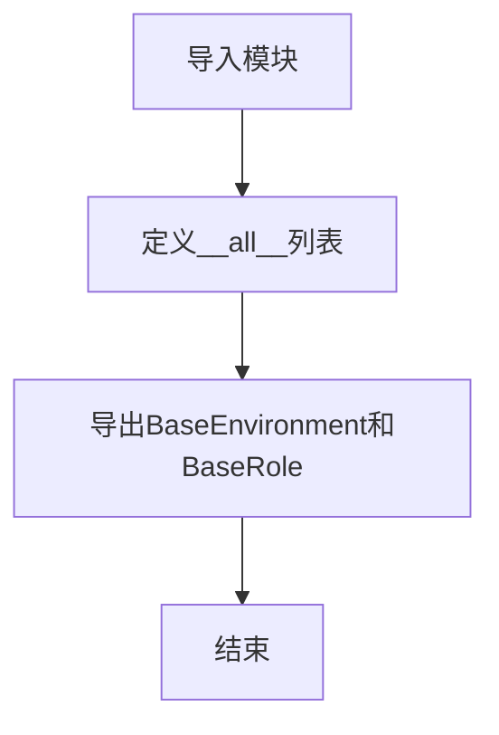

# `.\MetaGPT\metagpt\base\__init__.py` 详细设计文档

该文件是一个Python包的初始化模块，主要功能是定义包的公共接口，通过`__all__`列表显式导出`BaseEnvironment`和`BaseRole`两个核心基类，为构建基于角色的智能体（Agent）系统提供基础框架。

## 整体流程



## 类结构

```
metagpt.base (包)
├── __init__.py (当前文件)
├── base_env.py (包含BaseEnvironment类)
└── base_role.py (包含BaseRole类)
```

## 全局变量及字段


### `__all__`
    
定义模块的公共接口，控制使用 'from module import *' 时导出的符号列表。

类型：`List[str]`
    


    

## 全局函数及方法


## 关键组件


### BaseEnvironment

BaseEnvironment 是环境类的基类，定义了智能体运行和交互的通用环境框架。

### BaseRole

BaseRole 是角色类的基类，定义了智能体的核心属性和行为模式，是构建具体智能体的基础。


## 问题及建议


### 已知问题

-   **代码结构过于简单，缺乏实际功能实现**：当前代码仅包含两个空壳类的导入和导出，没有提供任何具体的环境模拟、角色行为、交互逻辑或状态管理功能。这更像是一个占位符或框架起点，而非可运行的模块。
-   **依赖抽象基类但未定义具体行为**：代码依赖于 `BaseEnvironment` 和 `BaseRole` 这两个抽象基类，但未展示或实现任何具体的方法、属性或交互协议。这导致模块无法独立使用，必须依赖外部（`metagpt.base` 包）提供具体实现，耦合度较高且功能不明确。
-   **缺乏文档和类型注解**：代码中没有包含任何模块级或类级的文档字符串（docstring），也没有使用类型注解（如 `from typing import ...`）来明确接口契约。这降低了代码的可读性、可维护性，也不利于静态类型检查工具（如 mypy）的使用。
-   **`__all__` 可能不必要**：在仅导出两个类且没有其他私有变量或函数的简单模块中，使用 `__all__` 来控制导出内容可能显得冗余。Python 的默认导入行为（`from module import *` 会导入所有不以下划线开头的名称）在此场景下可能已足够，除非有明确的隐藏内部名称的需求。

### 优化建议

-   **补充具体实现或明确占位符意图**：如果这是一个框架的起点，应在模块或类的文档字符串中明确说明其意图、预期用途以及如何扩展。例如，可以添加注释说明“此模块定义了多智能体系统的核心抽象基类，具体环境与角色需子类化实现”。
-   **为基类添加抽象方法定义和文档**：在 `BaseEnvironment` 和 `BaseRole` 类中（虽然定义在别处，但建议在定义处执行），应使用 `abc.ABC` 和 `@abstractmethod` 装饰器定义关键的抽象方法（如 `BaseEnvironment.step`, `BaseRole.act`），并为其添加详细的文档字符串和类型注解，以建立清晰的接口契约。
-   **添加模块文档和类型注解**：在文件顶部添加模块级别的文档字符串，解释模块的目的和主要内容。为导入的类（如果可能）或在本模块中定义的任何函数/变量添加类型注解。
-   **评估 `__all__` 的必要性**：如果模块没有需要隐藏的内部辅助函数或变量，可以考虑移除 `__all__`，以简化代码。如果保留，应确保其与模块实际导出的内容完全一致。
-   **考虑添加示例或测试用例**：为了展示如何使用这些基类，可以在模块的文档字符串中添加简单的代码示例，或者创建配套的测试文件来验证抽象接口的正确性。


## 其它


### 设计目标与约束

该模块的设计目标是提供`BaseEnvironment`和`BaseRole`两个基础抽象类，作为MetaGPT框架中环境（Environment）和角色（Role）概念的核心基类。其核心约束包括：1) 保持接口的简洁性和抽象性，仅定义必要的公共接口和属性，具体实现由子类完成；2) 确保与框架其他部分的兼容性，作为构建更复杂环境模拟和角色代理的基石；3) 遵循Python的面向对象设计原则，利用抽象基类明确契约。

### 错误处理与异常设计

当前代码片段仅包含导入和导出声明，未定义具体的类实现，因此没有显式的错误处理逻辑。预期的设计是，具体的错误处理（如参数验证、状态检查、交互异常）应在继承`BaseEnvironment`和`BaseRole`的子类中实现。基类本身可能通过定义抽象方法（如使用`@abstractmethod`）来强制子类实现关键操作，如果子类未实现，Python解释器将在实例化时抛出`TypeError`。更详细的异常类型（如`EnvironmentError`, `RoleActionError`）预计在子类或框架的其他部分定义。

### 数据流与状态机

由于当前是基类定义文件，具体的数据流和状态机模型尚未展现。根据命名和常见设计模式推断：
*   `BaseEnvironment` 预期管理一个共享状态，并协调多个`BaseRole`实例之间的交互。数据流可能表现为角色向环境发送动作（Action），环境处理动作并更新内部状态，然后将观察结果（Observation）返回给相关角色。
*   `BaseRole` 预期封装一个代理的行为逻辑，其内部可能维护一个私有状态（如记忆、目标）。其数据流可能是一个循环：接收观察 -> 内部思考/规划 -> 产生动作 -> 发送给环境。这隐含了一个简单的状态机，角色在不同阶段（观察、思考、行动）间转换。

具体的状态定义、转换条件和数据格式需查看这两个基类的具体实现代码。

### 外部依赖与接口契约

1.  **外部依赖**：
    *   `metagpt.base.base_env` 模块：当前文件依赖此模块以导入`BaseEnvironment`类。
    *   `metagpt.base.base_role` 模块：当前文件依赖此模块以导入`BaseRole`类。
    *   Python标准库：无特殊依赖。

2.  **接口契约**：
    *   `__all__`变量：定义了本模块的公共接口，明确指明只有`BaseEnvironment`和`BaseRole`类会被`from module import *`语句导入。这是管理模块命名空间的重要契约。
    *   作为基类，`BaseEnvironment`和`BaseRole`的类定义（虽然在此片段中未展开）本身构成了与所有子类之间的最重要契约。它们声明的公开方法（特别是抽象方法）定义了子类必须实现的接口。

### 安全与权限考虑

在基础抽象层，安全与权限问题通常不是关注重点，具体的安全策略（如角色对环境的访问控制、动作执行的权限验证、数据的安全性）应在具体的`BaseEnvironment`和`BaseRole`子类中，根据应用场景进行设计和实现。基类设计应考虑到未来扩展安全钩子（hooks）或权限检查接口的可能性。

### 配置管理与初始化

当前代码未涉及配置。通常，`BaseEnvironment`和`BaseRole`的`__init__`方法会接受配置参数，用于初始化环境或角色的初始状态。配置的管理（如从文件读取、默认值设置）预计由子类或使用这些类的上层代码负责。基类可能定义一些通用的初始化逻辑或配置验证的模板方法。

### 日志与监控

基础类应提供基本的日志记录能力，通常通过Python内置的`logging`模块。`BaseEnvironment`和`BaseRole`可能会设置类级别的logger（例如`self._logger = logging.getLogger(self.__class__.__name__)`），以便在关键生命周期事件（如环境重置、角色执行动作）时输出日志，用于调试和运行监控。具体的日志级别和格式由框架或应用的整体配置决定。

### 测试策略

针对此类基础抽象类的测试策略包括：
1.  **单元测试**：测试具体的子类实现是否正确继承了基类接口并实现了抽象方法。由于基类本身可能包含一些具体方法或属性，也需要对这些进行测试。
2.  **接口契约测试**：确保所有标记为抽象的方法在子类中都被正确实现，可以通过创建最小化的测试子类来验证。
3.  **集成测试**：在框架层面测试`BaseEnvironment`和`BaseRole`的交互是否符合预期，例如模拟角色-环境的交互循环。
由于当前文件主要是导入和导出，其测试通常与`metagpt.base.base_env`和`metagpt.base.base_role`模块的测试合并进行。


    