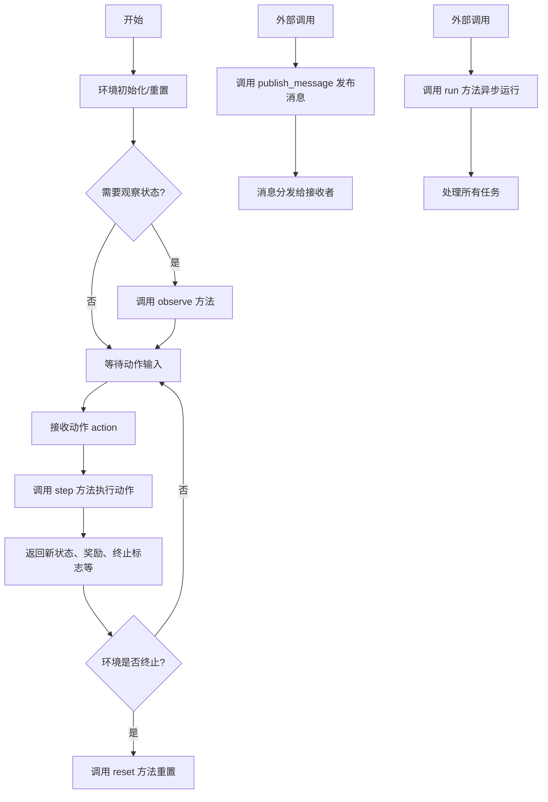
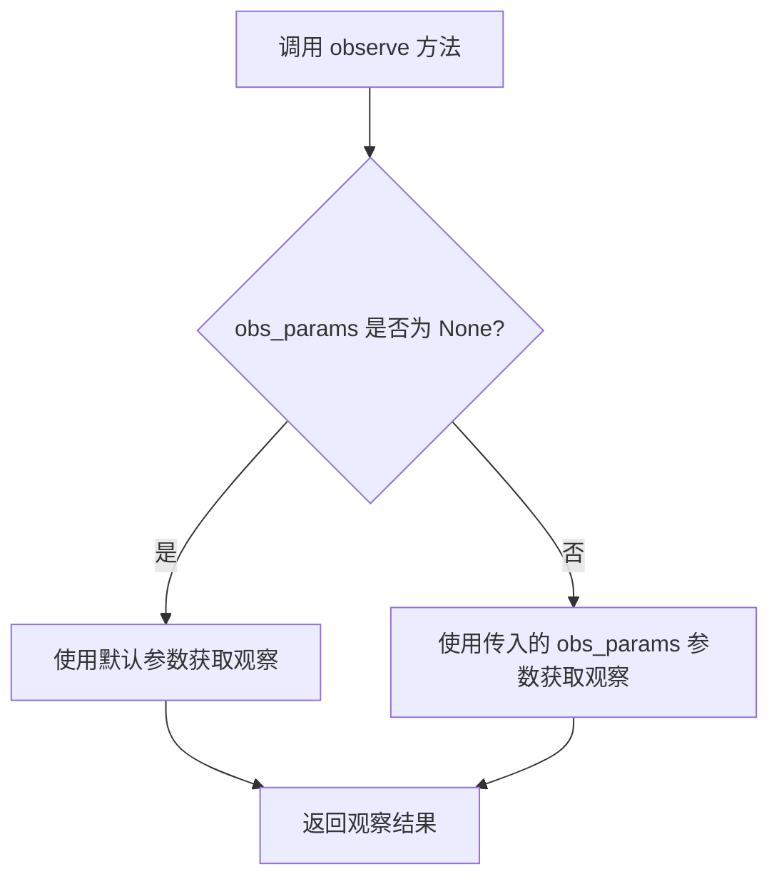
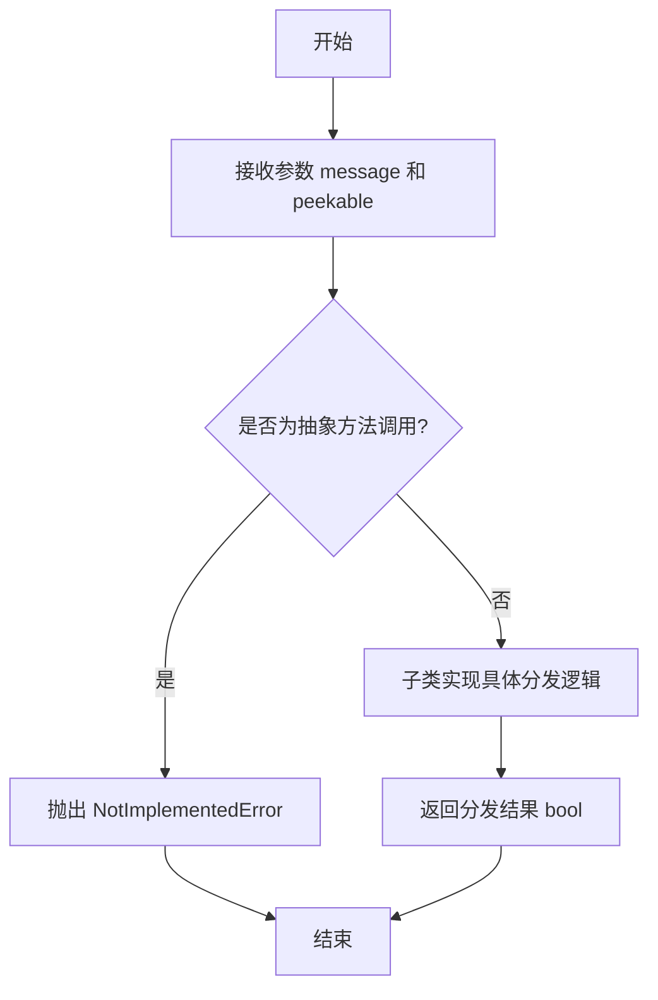
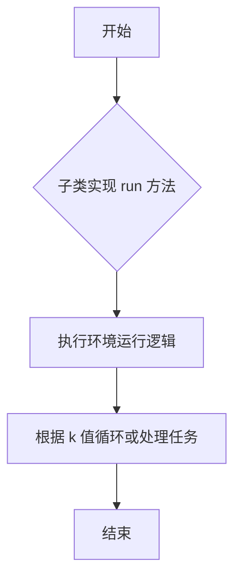

# `.\MetaGPT\metagpt\base\base_env.py` 详细设计文档

该文件定义了一个名为 BaseEnvironment 的抽象基类，它是 MetaGPT 框架中所有环境组件的基类。它提供了一个标准化的接口，用于模拟和管理智能体（Agent）的交互环境，核心功能包括环境重置（reset）、状态观察（observe）、执行动作（step）、消息发布（publish_message）以及异步运行（run）。

## 整体流程



## 类结构

```
BaseSerialization (序列化基类)
└── BaseEnvironment (环境抽象基类)
```

## 全局变量及字段


    

## 全局函数及方法


### `BaseEnvironment.reset`

`BaseEnvironment.reset` 是 `BaseEnvironment` 抽象基类中的一个抽象方法。它的核心功能是重置环境到其初始状态，并返回环境的初始观察结果和可选的附加信息。此方法为所有具体环境实现定义了标准接口，是强化学习或模拟环境中启动或重启一个“回合”（episode）的关键入口点。

参数：

-  `seed`：`Optional[int]`，一个可选的随机数种子。如果提供，环境应使用此种子来初始化其内部随机数生成器，以确保实验的可重复性。
-  `options`：`Optional[dict[str, Any]]`，一个可选的字典，用于传递额外的、环境特定的重置配置参数。例如，可以指定环境的初始难度、特定角色的初始状态等。

返回值：`tuple[dict[str, Any], dict[str, Any]]`，一个包含两个字典的元组。第一个字典（通常对应 `observation`）包含环境重置后的初始观察状态。第二个字典（通常对应 `info`）包含与重置过程相关的辅助信息，例如环境的动态配置或用于调试的元数据。

#### 流程图

```mermaid
flowchart TD
    A[调用 reset 方法] --> B{是否提供 seed?}
    B -- 是 --> C[使用 seed 初始化环境随机状态]
    B -- 否 --> D[使用默认或随机状态初始化]
    C --> E{是否提供 options?}
    D --> E
    E -- 是 --> F[根据 options 配置环境特定初始状态]
    E -- 否 --> G[使用默认配置初始化环境]
    F --> H[生成初始观察 observation]
    G --> H
    H --> I[生成辅助信息 info]
    I --> J[返回 (observation, info)]
```

#### 带注释源码

```python
    @abstractmethod
    def reset(
        self,
        *,
        seed: Optional[int] = None,
        options: Optional[dict[str, Any]] = None,
    ) -> tuple[dict[str, Any], dict[str, Any]]:
        """Implement this to get init observation"""
        # 这是一个抽象方法，由 BaseEnvironment 的子类具体实现。
        # 参数 `seed` 和 `options` 使用仅关键字参数语法（*后的参数），强制调用者明确指定参数名，提高可读性。
        # 返回值类型注解表明，方法必须返回一个包含两个字典的元组。
        # 文档字符串说明该方法的目标是获取环境的初始观察。
        # 具体实现需要：
        # 1. 根据 `seed` 重置环境的随机性（如果适用）。
        # 2. 根据 `options` 中的键值对设置环境的特定初始条件。
        # 3. 将环境内部状态重置为定义的初始状态。
        # 4. 计算并返回代表初始状态的观察值（第一个字典）。
        # 5. 计算并返回可能包含环境动态、配置或调试信息的字典（第二个字典）。
```


### `BaseEnvironment.observe`

该方法是一个抽象方法，用于从环境中获取部分观察结果。它定义了子类环境必须实现的一个接口，允许外部调用者根据可选的观察参数来查询环境的当前状态。

参数：

-  `obs_params`：`Optional[BaseEnvObsParams]`，可选的观察参数对象，用于指定获取观察结果时的具体条件或过滤信息。如果为`None`，则可能返回默认或完整的观察结果。

返回值：`Any`，返回环境的观察结果，其具体类型和结构由实现该抽象方法的具体子类决定。通常是一个包含环境状态信息的字典、对象或其它数据结构。

#### 流程图



#### 带注释源码

```python
    @abstractmethod
    def observe(self, obs_params: Optional[BaseEnvObsParams] = None) -> Any:
        """Implement this if you want to get partial observation from the env"""
        # 这是一个抽象方法，没有具体的实现代码。
        # 子类必须重写此方法，根据 `obs_params` 参数（如果提供）来返回环境的部分观察状态。
        # 返回值类型 `Any` 表示具体的观察数据结构由子类定义。
```


### `BaseEnvironment.step`

该方法定义了环境执行一个动作并返回新观察结果、奖励、终止标志、截断标志和额外信息的抽象接口。它是强化学习环境中核心的交互方法，子类必须实现具体的逻辑。

参数：

- `action`：`BaseEnvAction`，要执行的动作对象，包含动作类型和参数。

返回值：`tuple[dict[str, Any], float, bool, bool, dict[str, Any]]`，返回一个五元组，包含：
  1. 新观察结果（字典）
  2. 奖励值（浮点数）
  3. 是否终止（布尔值）
  4. 是否截断（布尔值）
  5. 额外信息（字典）

#### 流程图

```mermaid
flowchart TD
    A[开始: step(action)] --> B[接收动作参数 action]
    B --> C[执行动作<br>更新环境状态]
    C --> D[生成新观察结果 obs]
    D --> E[计算奖励 reward]
    E --> F[判断是否终止 done]
    F --> G[判断是否截断 truncated]
    G --> H[收集额外信息 info]
    H --> I[返回元组<br>obs, reward, done, truncated, info]
    I --> J[结束]
```

#### 带注释源码

```python
@abstractmethod
def step(self, action: BaseEnvAction) -> tuple[dict[str, Any], float, bool, bool, dict[str, Any]]:
    """Implement this to feed a action and then get new observation from the env"""
    # 这是一个抽象方法，子类必须实现具体的逻辑。
    # 参数 action: 一个 BaseEnvAction 对象，表示要在环境中执行的动作。
    # 返回值: 一个五元组，包含:
    #   - 新观察结果 (obs): 一个字典，表示执行动作后环境的新状态。
    #   - 奖励值 (reward): 一个浮点数，表示执行该动作后获得的即时奖励。
    #   - 终止标志 (done): 一个布尔值，True 表示环境已到达终止状态（如任务完成或失败）。
    #   - 截断标志 (truncated): 一个布尔值，True 表示环境因步数限制等原因被提前截断。
    #   - 额外信息 (info): 一个字典，包含调试、日志或其他辅助信息。
    pass
```

### `BaseEnvironment.publish_message`

该方法用于将消息分发给指定的接收者。它是一个抽象方法，需要在子类中具体实现消息的分发逻辑。

参数：

- `message`：`Message`，需要分发的消息对象
- `peekable`：`bool`，指示消息是否可被预览，默认为`True`

返回值：`bool`，指示消息是否成功分发

#### 流程图



#### 带注释源码

```python
@abstractmethod
def publish_message(self, message: "Message", peekable: bool = True) -> bool:
    """Distribute the message to the recipients."""
    # 这是一个抽象方法，没有具体实现。
    # 子类必须重写此方法以实现具体的消息分发逻辑。
    # 参数:
    #   message: 需要分发的消息对象，类型为 Message
    #   peekable: 布尔值，指示消息是否可被预览，默认为 True
    # 返回值:
    #   布尔值，指示消息是否成功分发
    pass
```

### `BaseEnvironment.run`

`BaseEnvironment.run` 是一个异步抽象方法，旨在一次性处理环境中的所有任务。它通常由具体的环境子类实现，用于执行环境的核心运行逻辑，例如驱动角色交互、处理消息队列或模拟环境状态演进。该方法允许指定运行轮次（`k`），但具体行为取决于子类的实现。

参数：

- `k`：`int`，默认值为1，表示运行轮次或迭代次数。具体含义由子类定义，可能代表任务处理次数、时间步数等。

返回值：`None`，该方法没有返回值（返回 `None`）。

#### 流程图



#### 带注释源码

```python
    @abstractmethod
    async def run(self, k=1):
        """Process all task at once"""
        # 这是一个抽象方法，需要在 BaseEnvironment 的子类中具体实现。
        # 参数 k 表示运行轮次，默认值为 1。
        # 该方法没有返回值（返回 None）。
        # 子类应在此方法中定义环境的核心运行逻辑，例如处理所有待办任务、驱动角色交互等。
```

## 关键组件


### BaseEnvironment

作为所有环境实现的抽象基类，定义了环境交互的核心接口，包括重置、观察、执行动作、发布消息和异步运行等基本操作。

### BaseEnvAction

作为环境动作的抽象基类，定义了传递给环境执行步骤（`step`）的动作数据的结构。

### BaseEnvObsParams

作为环境观察参数的抽象基类，定义了获取环境观察状态时可能需要的参数结构。

### BaseSerialization

作为序列化功能的基类，为`BaseEnvironment`提供了序列化和反序列化能力，支持环境的持久化存储和状态恢复。


## 问题及建议


### 已知问题

-   **抽象方法签名不一致**：`reset` 和 `step` 方法的返回值类型定义过于具体（`tuple[dict[str, Any], ...]`），这限制了子类的实现灵活性，可能迫使子类返回不必要的字典结构，违反了接口隔离原则。
-   **异步与非异步方法混合**：基类中同时存在同步方法（如 `step`, `observe`）和异步方法（`run`），但没有明确的指导或约束来规定子类应如何协调这两种模式，可能导致子类实现时出现同步/异步调用混淆或死锁风险。
-   **`observe` 方法返回值类型过于宽泛**：`observe` 方法的返回类型为 `Any`，这虽然提供了灵活性，但牺牲了类型安全性和清晰性，使得静态类型检查工具难以发挥作用，也增加了子类实现者和调用者的理解成本。
-   **`publish_message` 方法与环境核心职责耦合度低**：`publish_message` 方法直接操作 `Message` 对象并涉及消息分发逻辑，这更像是特定应用（如多智能体通信）的功能，而非通用环境的核心抽象。将其放在基类中可能违反了单一职责原则，导致基类臃肿。
-   **缺乏生命周期或资源管理钩子**：基类没有提供如 `close`、`seed` 或渲染相关的方法，这对于需要管理资源（如网络连接、图形界面）或设定随机种子的环境来说是一个缺失。

### 优化建议

-   **使用更通用的返回值类型**：考虑将 `reset` 和 `step` 等方法的返回值类型从具体的 `tuple[dict[str, Any], ...]` 放宽为 `Tuple[ObsType, float, bool, bool, InfoType]`，并使用 `TypeVar` 进行泛型化（例如 `ObsType = TypeVar('ObsType')`），让子类可以指定其特定的观察值和信息类型，提高接口的灵活性和类型安全性。
-   **明确同步/异步边界**：重新设计基类，明确其是同步环境还是异步环境。如果必须支持两者，可以考虑提供两个基类（如 `BaseSyncEnvironment` 和 `BaseAsyncEnvironment`），或者引入一个明确的 `is_async` 属性及文档来指导子类的实现。对于 `run` 这类方法，应确保其内部调用的其他方法（如 `step`）的同步性与之一致。
-   **细化 `observe` 方法的返回类型**：将 `observe` 的返回类型从 `Any` 改为一个泛型参数或更具体的基类/协议，以提供更好的类型提示和约束。例如，可以定义为 `def observe(self, ...) -> ObsType:`。
-   **分离关注点，重构 `publish_message`**：将 `publish_message` 方法从 `BaseEnvironment` 中移除，放入一个专门用于多智能体通信的 `CommunicativeEnvironment` 混入类（Mixin）或子类中。这样可以使基础环境类更加通用和轻量。
-   **补充标准环境接口方法**：参考 OpenAI Gym 等流行RL环境接口，在基类中添加可选的生命周期方法，如 `close(self)` 用于资源清理，`render(self, mode='human')` 用于可视化，以及 `seed(self, seed=None)` 用于设置随机种子。可以将它们定义为非抽象方法（或提供默认实现），以保持向后兼容性。
-   **增加详细的文档字符串和示例**：为每个抽象方法和类本身添加更详细的文档字符串，说明其职责、参数含义、返回值结构以及子类实现时的注意事项。提供一个简单的示例实现会极大提升开发者的体验。


## 其它


### 设计目标与约束

该代码定义了一个抽象基类 `BaseEnvironment`，旨在为构建各类环境（如强化学习环境、多智能体环境、模拟环境等）提供一个统一的接口规范。其核心设计目标是实现环境交互的标准化，确保所有具体环境实现都遵循相同的 `reset`、`observe`、`step` 等核心方法，以支持可插拔和可替换的环境组件。主要约束包括：必须继承自 `BaseSerialization` 以支持序列化；所有标注为 `@abstractmethod` 的方法必须在子类中实现；接口设计遵循经典的“状态-动作-奖励”循环模式，并扩展了消息发布和批量运行能力。

### 错误处理与异常设计

当前代码为抽象基类，未包含具体的错误处理逻辑。错误处理的责任被委托给了具体的子类实现。预期的异常设计模式包括：在 `reset` 方法中，如果提供的 `seed` 或 `options` 参数无效，应抛出 `ValueError`；在 `step` 方法中，如果输入的 `action` 格式错误或超出当前状态下的有效动作空间，应抛出 `RuntimeError` 或自定义的 `InvalidActionError`；在 `observe` 和 `publish_message` 方法中，如果因环境状态或权限问题导致操作失败，应返回明确的错误标识（如 `False`）或抛出异常。基类本身应确保抽象方法签名稳定，子类实现不匹配时由 Python 解释器抛出 `TypeError`。

### 数据流与状态机

`BaseEnvironment` 定义了一个典型的环境交互数据流：1) 通过 `reset` 初始化环境，返回初始状态和信息。2) 通过 `observe`（可选）获取特定视角下的状态观察值。3) 通过 `step` 执行一个动作，驱动环境状态转移，并返回新的状态、奖励、终止标志、截断标志及附加信息。这是一个循环过程，直到终止或截断。`publish_message` 方法引入了消息传递的数据流，用于多智能体或事件驱动环境中的通信。`run(k)` 方法则定义了批量处理任务的数据流。整体上，该类描述了一个隐式状态机，其状态由具体环境内部维护，通过上述方法进行查询和更改。

### 外部依赖与接口契约

**外部依赖：**
1.  **类型提示依赖**：从 `metagpt.base.base_env_space` 导入 `BaseEnvAction` 和 `BaseEnvObsParams`，从 `metagpt.schema` 导入 `Message`（仅用于类型检查）。这要求项目结构中必须存在这些模块和类定义。
2.  **继承依赖**：继承自 `metagpt.base.base_serialization.BaseSerialization`，依赖于该基类提供的序列化能力。
3.  **标准库依赖**：`typing`, `abc`。

**接口契约：**
1.  **`reset` 契约**：必须返回一个包含初始观察值（`observation`）和辅助信息（`info`）的元组。
2.  **`step` 契约**：必须接受一个 `BaseEnvAction` 实例，并返回一个标准五元组 `(observation, reward, terminated, truncated, info)`，其类型和含义需与 OpenAI Gym/PettingZoo 等主流环境接口保持一致。
3.  **`observe` 契约**：应能根据可选的 `obs_params` 返回部分观察结果。
4.  **`publish_message` 契约**：应能处理 `Message` 对象，并根据 `peekable` 参数决定消息的可见性，返回一个表示成功与否的布尔值。
5.  **`run` 契约**：应为一个异步方法，能够处理 `k` 个步骤或任务。

### 并发与异步设计

代码中明确包含了异步方法 `async def run(self, k=1)`，这表明该环境框架设计支持异步操作，可能用于处理耗时任务、I/O操作或并发运行多个环境实例。然而，其他核心方法（`reset`, `step`, `observe`, `publish_message`）目前是同步的。这种混合模式要求设计者仔细考虑：在异步上下文（如 `run`）中调用同步方法是否会导致阻塞，以及是否需要在子类中将部分同步方法也改为异步以实现彻底的异步化。当前的基类设计将并发模型的选择权留给了子类实现者。

### 配置与初始化

类的初始化配置主要通过 `__init__` 方法（在本代码段中未显示，但应由 `BaseSerialization` 或子类提供）和 `reset` 方法的 `options` 参数来完成。`options` 字典提供了在环境重置时传入任意配置的灵活性，可用于设置难度、初始状态、渲染模式等。`seed` 参数用于控制环境的随机数生成器，确保实验的可重复性。具体的配置项、默认值及其验证逻辑，需要在具体环境子类的文档和实现中明确。

### 测试策略建议

针对该抽象基类的测试应采用以下策略：
1.  **接口符合性测试**：创建具体子类的测试实例，验证其是否完整实现了所有抽象方法，并且方法签名与返回类型符合基类定义。
2.  **契约测试**：对 `step` 方法，测试其返回的五元组结构是否正确；对 `reset`，测试其是否返回预期的数据结构。
3.  **集成测试**：将具体环境与使用该环境接口的智能体或算法进行集成测试，验证整个交互循环（reset-step-observe）能否正常工作。
4.  **异步测试**：对于实现了 `run` 方法的子类，需要使用 `pytest-asyncio` 等工具进行异步测试。
5.  **序列化测试**：利用 `BaseSerialization` 基类，测试环境实例的序列化与反序列化是否能够正确保存和恢复状态。

    