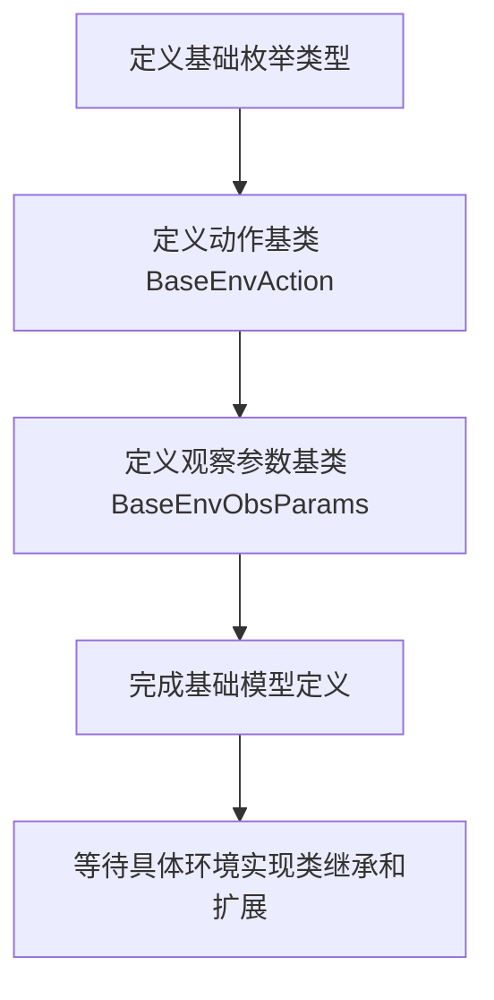

# `.\MetaGPT\metagpt\base\base_env_space.py` 详细设计文档

该代码定义了一个环境交互框架的核心基础模型，包括环境动作（Action）和观察（Observation）的抽象基类及其相关枚举类型，用于规范智能体与环境交互时的数据结构。

## 整体流程



## 类结构

```
BaseEnvActionType (IntEnum)
BaseEnvAction (BaseModel)
BaseEnvObsType (IntEnum)
BaseEnvObsParams (BaseModel)
```

## 全局变量及字段


### `BaseEnvAction.model_config`
    
Pydantic模型的配置字典，用于允许任意类型，确保模型在序列化和验证时的灵活性。

类型：`pydantic.ConfigDict`
    


### `BaseEnvAction.action_type`
    
表示环境动作类型的整数字段，用于标识和区分不同的动作。

类型：`int`
    


### `BaseEnvObsParams.model_config`
    
Pydantic模型的配置字典，用于允许任意类型，确保模型在序列化和验证时的灵活性。

类型：`pydantic.ConfigDict`
    


### `BaseEnvObsParams.obs_type`
    
表示环境观察类型的整数字段，用于标识和区分不同的观察模式。

类型：`int`
    
    

## 全局函数及方法


## 关键组件


### 基础环境动作类型枚举 (BaseEnvActionType)

一个空的IntEnum基类，用于定义环境支持的动作类型，为具体环境实现提供类型约束和扩展点。

### 基础环境动作模型 (BaseEnvAction)

一个Pydantic数据模型，用于封装环境动作的核心信息，包含动作类型字段，并支持任意类型以增强灵活性。

### 基础环境观察类型枚举 (BaseEnvObsType)

一个空的IntEnum基类，用于定义环境支持的观察类型，为具体环境实现提供类型约束和扩展点。

### 基础环境观察参数模型 (BaseEnvObsParams)

一个Pydantic数据模型，用于封装获取环境观察结果所需的参数，包含观察类型字段，并支持任意类型以增强灵活性。


## 问题及建议


### 已知问题

-   **枚举类定义不完整**：`BaseEnvActionType` 和 `BaseEnvObsType` 两个枚举类内部仅包含 `pass` 语句，没有定义任何具体的枚举成员。这导致它们无法实际用于区分不同的动作类型或观察类型，失去了枚举的核心价值。
-   **模型字段类型过于宽泛**：`BaseEnvAction` 和 `BaseEnvObsParams` 模型中的 `action_type` 和 `obs_type` 字段类型为 `int`。虽然灵活，但缺乏类型安全性和自描述性。调用者可以传入任意整数值，代码无法在类型层面保证其有效性，必须依赖额外的运行时验证。
-   **缺少关键的业务逻辑约束**：当前基类仅定义了数据容器，没有包含任何与动作执行或观察获取相关的逻辑方法。具体的环境实现需要完全从头实现这些核心流程，可能导致不同实现之间的不一致和重复代码。
-   **文档字符串过于简单**：类和方法（如 `BaseEnvAction` 和 `BaseEnvObsParams`）的文档字符串仅描述了“是什么”，但没有说明“如何用”，例如，子类应如何扩展、字段的具体语义、以及如何与环境的其他部分交互。

### 优化建议

-   **完善枚举定义**：在 `BaseEnvActionType` 和 `BaseEnvObsType` 中定义具体的枚举成员（例如 `MOVE = 1`， `ATTACK = 2` 等），为不同的环境交互提供明确的类型标识。这能极大地提升代码的可读性和可维护性。
-   **使用枚举类型约束模型字段**：将 `BaseEnvAction.action_type` 和 `BaseEnvObsParams.obs_type` 的字段类型从 `int` 改为对应的枚举类型（如 `BaseEnvActionType` 和 `BaseEnvObsType`）。这样可以利用 Pydantic 和类型检查工具在数据验证阶段就确保值的有效性。
-   **在基类中定义抽象方法或钩子**：在 `BaseEnvAction` 和 `BaseEnvObsParams` 基类或其关联的上下文（如一个 `BaseEnvironment` 类）中，定义抽象方法（如 `def execute(self, env): ...` 和 `def collect(self, env): ...`）。这可以强制子类实现关键行为，并确立统一的接口契约，减少重复和歧义。
-   **增强文档和示例**：为每个类、枚举值和字段添加更详细的文档，说明其用途、取值范围、以及在实际环境中的典型用法。提供简单的子类化示例代码，可以显著降低使用门槛并促进一致性。
-   **考虑使用泛型或配置类**：如果动作和观察的参数结构因类型而异，可以考虑使用 Pydantic 的泛型（`GenericModel`）或为每个 `action_type`/`obs_type` 定义特定的 `Pydantic` 模型，然后通过一个联合（Union）字段来容纳它们，以实现更严格和结构化的参数验证。


## 其它


### 设计目标与约束

该代码旨在为环境交互系统提供一个基础框架，定义了动作（Action）和观察（Observation）的核心数据模型。其设计目标是实现类型安全、可扩展性和清晰的接口契约。主要约束包括：使用Pydantic进行数据验证和序列化；通过枚举定义有限的、预定义的动作和观察类型；模型配置允许任意类型以支持复杂参数。

### 错误处理与异常设计

当前代码未显式定义错误处理逻辑。错误处理预计由使用这些基础类的上层调用者实现。潜在的异常可能包括：传入的`action_type`或`obs_type`值不在预期的枚举范围内（尽管当前枚举为空，但预期子类会定义具体值），或者Pydantic在字段验证时抛出`ValidationError`。建议在具体实现中，通过自定义异常或返回包含错误码的结果对象来明确处理无效输入。

### 数据流与状态机

此模块定义了静态的数据结构（模型），本身不包含状态机或主动的数据流。数据流起始于调用者创建`BaseEnvAction`或`BaseEnvObsParams`实例并填充数据。这些实例随后作为参数传递给环境（Env）的执行或观察方法。环境内部处理这些请求，可能引发状态变迁，并返回结果。本模块仅定义了此数据流的输入契约部分。

### 外部依赖与接口契约

1.  **外部依赖**：
    *   `pydantic.BaseModel`: 用于构建具有数据验证和序列化能力的模型类。
    *   `pydantic.ConfigDict`: 用于配置模型行为（此处启用了`arbitrary_types_allowed`）。
    *   `pydantic.Field`: 用于定义模型字段的元数据。
    *   `enum.IntEnum`: 用于定义动作和观察类型的枚举，确保类型安全。
2.  **接口契约**：
    *   `BaseEnvAction` 类契约：任何环境动作必须包含一个整数类型的 `action_type` 字段。
    *   `BaseEnvObsParams` 类契约：任何观察参数必须包含一个整数类型的 `obs_type` 字段。
    *   继承契约：具体的环境实现应创建 `BaseEnvActionType` 和 `BaseEnvObsType` 的子枚举来定义其支持的具体类型，并创建 `BaseEnvAction` 和 `BaseEnvObsParams` 的子类来添加相应的参数字段。

### 配置管理

模块的配置主要体现在Pydantic模型的`model_config`中。`ConfigDict(arbitrary_types_allowed=True)`是一个关键配置，它允许模型字段使用非Pydantic内置的类型（例如自定义类或第三方库对象），这为后续在动作或观察参数中嵌入复杂数据结构提供了灵活性。此配置是全局应用于这两个基类模型的。

### 安全考虑

当前代码层面不涉及直接的安全风险，如网络、认证或数据泄露。安全考虑应集中于使用这些类的上下文中。需要确保：
1.  反序列化安全：如果这些模型实例来自不可信的序列化数据（如JSON），需警惕通过`arbitrary_types_allowed`可能引入的反序列化风险。应确保输入源的可靠性或进行严格的输入过滤。
2.  逻辑安全：在子类实现中，应验证`action_type`和`obs_type`的合法性，防止无效或恶意类型导致未定义行为。

### 测试策略

针对此基础模块的单元测试应聚焦于：
1.  **模型验证测试**：验证`BaseEnvAction`和`BaseEnvObsParams`实例能否被正确创建，以及错误的字段类型能否被Pydantic正确拦截并抛出`ValidationError`。
2.  **继承与扩展测试**：测试子类能否正确继承基类字段，并添加新的字段，同时确保`model_config`被正确继承。
3.  **枚举测试**：测试具体的`BaseEnvActionType`和`BaseEnvObsType`子枚举的值和含义。
4.  **序列化/反序列化测试**：测试模型实例能否与字典、JSON等格式进行正确的相互转换，特别是当包含通过`arbitrary_types_allowed`允许的复杂类型时。

    