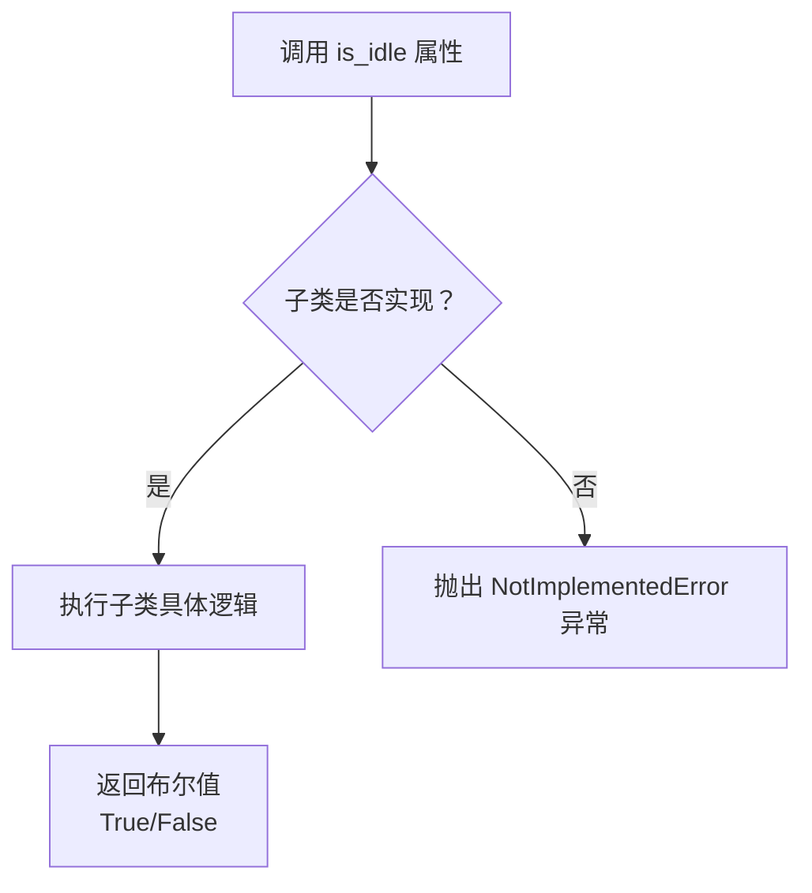
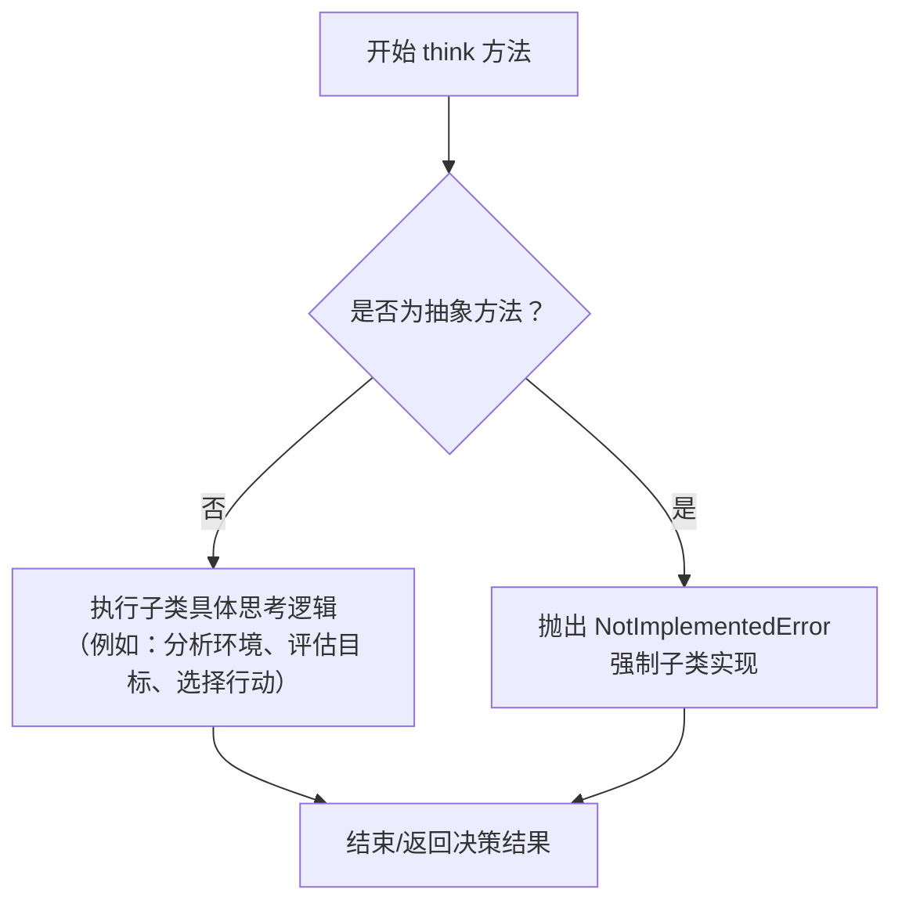
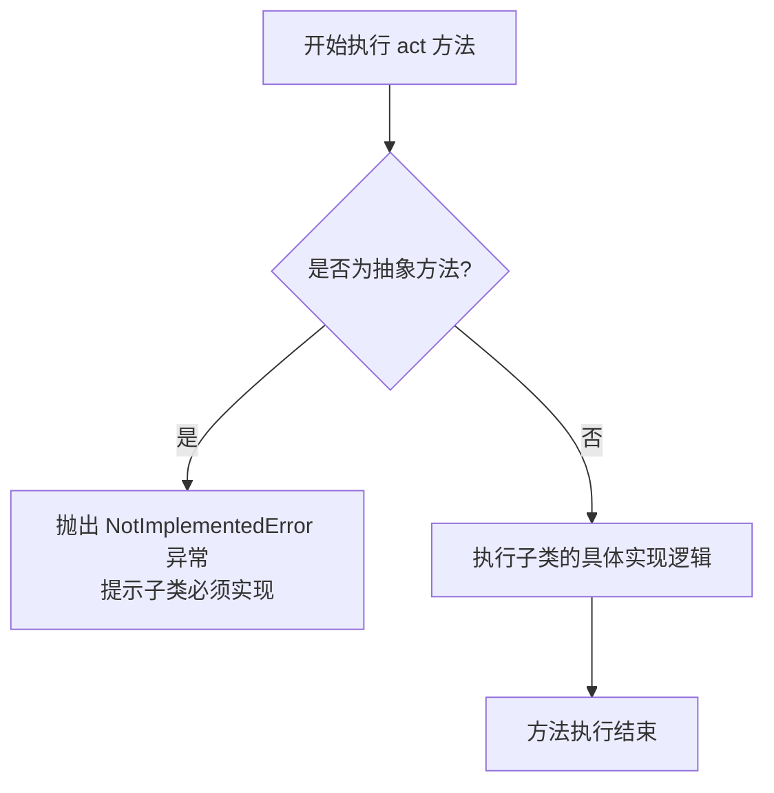
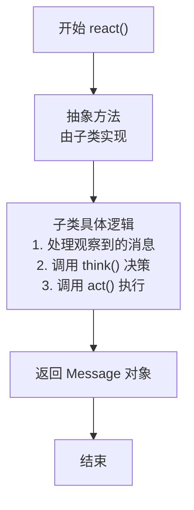

# `.\MetaGPT\metagpt\base\base_role.py` 详细设计文档

该文件定义了一个抽象基类 `BaseRole`，用于构建具有思考、行动和反应能力的角色（Agent）框架。它规定了所有具体角色必须实现的核心行为接口，如思考决策、执行动作、对环境做出反应以及运行完整的工作循环，并提供了获取角色记忆的基础能力。

## 整体流程

```mermaid
graph TD
    A[外部调用 Role.run()] --> B[Role.observe (隐式)]
    B --> C[Role.think]
    C --> D[Role.act]
    D --> E{是否产生新消息或完成?}
    E -- 是 --> F[返回 Message 或 None]
    E -- 否/继续循环 --> C
    
    subgraph 另一种触发方式
        G[外部事件触发] --> H[Role.react]
        H --> I[内部策略选择与执行]
        I --> J[返回 Message]
    end
```

## 类结构

```
BaseSerialization
└── BaseRole (抽象基类)
    ├── (具体角色类，如 Engineer, ProductManager 等，由其他文件实现)
    └── ...
```

## 全局变量及字段


### `BaseRole.name`
    
角色的名称，用于标识不同的角色实例。

类型：`str`
    
    

## 全局函数及方法


### `BaseRole.is_idle`

这是一个抽象基类 `BaseRole` 的属性（property），用于判断一个角色（Role）当前是否处于空闲状态。它被定义为抽象属性，要求所有继承自 `BaseRole` 的具体角色类必须提供自己的实现逻辑。

参数：
- 无

返回值：`bool`，返回一个布尔值，`True` 表示角色当前空闲，`False` 表示角色当前忙碌。

#### 流程图



#### 带注释源码

```python
    @property
    def is_idle(self) -> bool:
        # 这是一个抽象属性（property），没有提供具体实现。
        # 它强制要求所有继承自 BaseRole 的子类必须重写此属性，
        # 并提供判断该角色实例是否处于空闲状态的逻辑。
        # 当直接调用基类的此属性时，会抛出 NotImplementedError 异常。
        raise NotImplementedError
```


### `BaseRole.think`

`BaseRole.think` 是一个抽象方法，定义了所有角色（Role）在决策过程中的核心行为。它要求子类实现具体的逻辑，以“思考”当前情境并决定下一步的行动方案。该方法不接收任何参数，也不强制规定返回值类型，其具体实现由子类根据角色特性定义。

参数：
- 无

返回值：无明确返回值类型（由子类实现决定），其作用是驱动角色完成决策过程，为后续的 `act` 方法提供行动依据。

#### 流程图



#### 带注释源码

```python
    @abstractmethod
    def think(self):
        """Consider what to do and decide on the next course of action."""
        # @abstractmethod 装饰器标记此方法为抽象方法。
        # 这意味着 BaseRole 的子类必须实现（override）这个方法，提供具体的“思考”逻辑。
        # 方法本身不包含实现，直接抛出 NotImplementedError 异常。
        # 其设计目的是定义一个统一的接口，确保所有角色都有决策环节。
        raise NotImplementedError
```


### `BaseRole.act`

`act` 方法是 `BaseRole` 抽象基类中定义的一个抽象方法。它代表了角色（Role）执行其当前决策或计划的具体行为。作为抽象方法，它仅定义了接口，具体的实现逻辑由继承 `BaseRole` 的子类提供。该方法旨在将角色的“思考”（`think`）结果转化为实际行动，是角色行为模型中的关键执行环节。

参数：
- 此方法没有定义任何参数。

返回值：此方法没有定义返回值类型，具体返回值由子类实现决定。

#### 流程图



#### 带注释源码

```
    @abstractmethod
    def act(self):
        """Perform the current action."""
        # 这是一个抽象方法装饰器，表明此方法必须在子类中被具体实现。
        # 方法目的：执行角色当前计划或决策所对应的具体行动。
        # 由于是抽象方法，此处没有实现体，直接抛出 NotImplementedError 异常。
        # 任何继承 BaseRole 的非抽象子类都必须重写此方法并提供具体的行动逻辑。
        raise NotImplementedError
```


### `BaseRole.react`

`react` 方法是 `BaseRole` 抽象基类中定义的一个抽象异步方法。它作为角色（Role）对观察到的消息（Message）做出反应的三种策略之一的入口点。具体实现将由继承 `BaseRole` 的子类提供，用于定义角色如何根据其内部状态和外部输入（消息）来思考（think）和行动（act）。

参数：
- 此方法没有显式定义的参数。它依赖于类的内部状态（如 `name`、`is_idle` 属性以及可能通过 `get_memories` 方法获取的记忆）来执行其逻辑。

返回值：`Message`，此方法返回一个 `Message` 对象，代表角色在反应过程中产生或处理的消息。

#### 流程图



#### 带注释源码

```
from abc import abstractmethod
from typing import Optional, Union

from metagpt.base.base_serialization import BaseSerialization


class BaseRole(BaseSerialization):
    """Abstract base class for all roles."""

    name: str

    @property
    def is_idle(self) -> bool:
        raise NotImplementedError

    @abstractmethod
    def think(self):
        """Consider what to do and decide on the next course of action."""
        raise NotImplementedError

    @abstractmethod
    def act(self):
        """Perform the current action."""
        raise NotImplementedError

    @abstractmethod
    async def react(self) -> "Message":
        """Entry to one of three strategies by which Role reacts to the observed Message."""
        # 这是一个抽象方法，没有具体的实现代码。
        # 子类必须重写此方法，提供具体的反应逻辑。
        # 典型的实现可能包括：
        # 1. 从环境中获取或处理输入消息。
        # 2. 调用 `think()` 方法来决定下一步行动。
        # 3. 调用 `act()` 方法来执行决策。
        # 4. 返回一个代表行动结果或新状态的消息对象。
        raise NotImplementedError

    @abstractmethod
    async def run(self, with_message: Optional[Union[str, "Message", list[str]]] = None) -> Optional["Message"]:
        """Observe, and think and act based on the results of the observation."""
        raise NotImplementedError

    @abstractmethod
    def get_memories(self, k: int = 0) -> list["Message"]:
        """Return the most recent k memories of this role."""
        raise NotImplementedError
```


### `BaseRole.run`

`BaseRole.run` 是 `BaseRole` 抽象基类的核心异步方法，它定义了角色（Role）在接收到输入消息后，进行观察、思考并采取行动的标准流程。该方法旨在提供一个统一的入口，用于驱动角色完成一次完整的“感知-思考-行动”循环。

参数：

- `with_message`：`Optional[Union[str, "Message", list[str]]]`，可选的输入消息。它可以是字符串、`Message`对象或字符串列表。如果提供，该方法将以此消息作为观察的起点；如果为`None`，则角色可能从内部状态或环境中获取观察信息。

返回值：`Optional["Message"]`，返回一个可选的`Message`对象。通常，这代表了角色在本次运行周期内产生的主要输出或行动结果。如果本次运行没有产生消息，则可能返回`None`。

#### 流程图

```mermaid
flowchart TD
    A[开始: run(with_message)] --> B{with_message 是否为 None?};
    B -- 是 --> C[从内部状态或环境获取观察信息];
    B -- 否 --> D[将 with_message 作为观察信息];
    C --> E[调用 think() 方法进行思考];
    D --> E;
    E --> F[调用 act() 方法执行行动];
    F --> G[返回行动产生的 Message 或 None];
    G --> H[结束];
```

#### 带注释源码

```python
    @abstractmethod
    async def run(self, with_message: Optional[Union[str, "Message", list[str]]] = None) -> Optional["Message"]:
        """Observe, and think and act based on the results of the observation."""
        # 这是一个抽象方法，仅定义了接口契约。
        # 具体实现应由继承自 BaseRole 的子类提供。
        # 其标准流程应为：
        # 1. 观察（Observe）： 处理 `with_message` 参数或从其他来源获取输入。
        # 2. 思考（Think）：  调用 `think()` 方法，基于观察决定下一步行动。
        # 3. 行动（Act）：    调用 `act()` 方法，执行思考后决定的行动。
        # 4. 返回（Return）： 返回行动产生的结果消息，如果无结果则返回 None。
        raise NotImplementedError
```


### `BaseRole.get_memories`

该方法是一个抽象方法，用于获取角色（Role）的最近 `k` 条记忆（Message）。它定义了所有具体角色类必须实现的一个接口，用于从角色的记忆存储中检索信息。

参数：

-  `k`：`int`，指定要获取的记忆条数。当 `k` 为 0 时，通常表示获取所有记忆或默认数量的记忆。具体行为由子类实现决定。

返回值：`list["Message"]`，返回一个包含 `Message` 对象的列表，这些对象代表了角色的记忆。列表的长度最多为 `k` 条，具体数量取决于实现和实际存储的记忆数量。

#### 流程图

```mermaid
flowchart TD
    A[开始调用 get_memories(k)] --> B{检查参数 k};
    B -->|k > 0| C[子类实现：从存储中获取最近 k 条记忆];
    B -->|k == 0| D[子类实现：获取所有记忆或默认数量记忆];
    C --> E[返回包含 k 条 Message 的列表];
    D --> E;
    E --> F[结束];
```

#### 带注释源码

```
    @abstractmethod
    def get_memories(self, k: int = 0) -> list["Message"]:
        """Return the most recent k memories of this role."""
```


## 关键组件


### BaseRole

抽象基类，定义了所有角色的通用接口和基本属性，包括角色名称、状态判断以及思考、行动、反应、运行和获取记忆等核心行为。

### BaseSerialization

基础序列化类，为角色提供序列化和反序列化的能力，确保角色状态可以持久化存储和恢复。

### 抽象方法

定义了角色必须实现的核心行为接口，包括思考（think）、行动（act）、反应（react）、运行（run）和获取记忆（get_memories），确保了所有具体角色类行为的一致性。

### 属性

定义了角色的基本属性，如名称（name）和空闲状态判断（is_idle），为角色提供了基本的状态和标识信息。

### 异步方法

支持异步操作的接口，如异步反应（react）和异步运行（run），使得角色能够在异步环境中高效地处理消息和任务。

### 消息处理

定义了角色与消息交互的接口，包括接收消息、处理消息并生成响应，是角色与外部环境通信的核心机制。

### 记忆管理

提供了角色记忆的获取接口（get_memories），使得角色能够访问其历史交互记录，支持基于上下文的决策和行为。


## 问题及建议


### 已知问题

-   **抽象基类（ABC）设计不完整**：`BaseRole` 类继承自 `BaseSerialization`，但未定义 `__init__` 方法。这可能导致子类在实例化时，其 `name` 字段的初始化行为不明确或依赖于父类 `BaseSerialization` 的实现，增加了代码的脆弱性和理解成本。
-   **属性 `is_idle` 实现不一致**：`is_idle` 被定义为 `@property`，但其实现直接抛出 `NotImplementedError`。这与其他使用 `@abstractmethod` 装饰的抽象方法（如 `think`, `act`）在语义上不一致，可能导致开发者混淆。作为属性，它更适合使用 `@property` 与 `@abstractmethod` 结合来定义抽象属性。
-   **异步与非异步方法混合**：类中同时存在同步方法（如 `think`, `act`）和异步方法（如 `react`, `run`）。这种混合设计可能增加子类实现的复杂性，并可能在使用时引发同步/异步上下文管理问题，尤其是在 `run` 方法调用同步的 `think` 和 `act` 时。
-   **类型注解存在循环引用**：在 `react` 和 `run` 方法的返回值类型注解中，使用了 `"Message"` 字符串字面量来避免循环导入。虽然这是一种常见做法，但它削弱了类型检查的效力，并可能使IDE的智能提示功能失效。
-   **`get_memories` 方法默认参数值可能不明确**：`get_memories(k: int = 0)` 中，参数 `k=0` 的语义不清晰。是返回0条消息（空列表），还是返回所有消息？这依赖于子类的具体实现，但基类接口未能提供明确的约定，容易导致误解和错误使用。

### 优化建议

-   **完善抽象基类的构造方法**：在 `BaseRole` 中显式定义 `__init__` 方法，明确 `name` 字段为必需参数，并调用父类 `BaseSerialization.__init__`。这可以确保所有子类遵循一致的初始化模式。
-   **统一抽象成员的定义方式**：将 `is_idle` 属性改为使用 `@property` 和 `@abstractmethod` 组合定义，使其与其他抽象方法在抽象语义上保持一致。例如：`@property` `@abstractmethod` `def is_idle(self) -> bool: ...`。
-   **考虑接口的同步/异步一致性**：评估角色（Role）的核心行为模型。如果其核心反应循环（`react`, `run`）本质上是异步的，考虑将 `think` 和 `act` 也定义为异步方法（`async def`），以保持接口的一致性，简化子类实现和调用方的使用。如果确有同步实现的必要，应在文档中明确说明混合使用的场景和注意事项。
-   **使用 `typing` 模块处理循环引用**：对于由循环引用引起的类型注解问题，可以使用 `from __future__ import annotations`（Python 3.7+）使所有注解在运行时成为字符串，或者使用 `typing.TYPE_CHECKING` 块来条件导入 `Message` 类，以改善开发工具的支持。
-   **明确接口契约的默认行为**：重新审视 `get_memories(k=0)` 的语义。建议在方法文档字符串中明确说明 `k=0` 时的具体行为（例如，“当 k=0 时，返回所有记忆”或“当 k<=0 时，返回空列表”）。更好的做法是修改方法签名，使用更明确的默认值或移除默认值，强制调用方指定意图。
-   **增强文档字符串**：为每个抽象方法和属性添加更详细的文档字符串，说明其预期行为、参数和返回值的具体含义，以及子类实现时应注意的事项。特别是对于 `run` 和 `react` 这种核心流程方法。


## 其它


### 设计目标与约束

该代码定义了所有角色的抽象基类 `BaseRole`，其设计目标是提供一个统一、可扩展的框架，用于构建具有自主思考、行动和反应能力的智能体（角色）。核心约束包括：必须继承自 `BaseSerialization` 以确保序列化能力；必须实现 `think`、`act`、`react`、`run`、`get_memories` 等核心生命周期方法；属性 `name` 为必需字段，用于标识角色。

### 错误处理与异常设计

代码中显式使用了 `NotImplementedError` 和 `@abstractmethod` 装饰器来强制子类实现抽象方法。当子类未实现这些方法而直接调用时，将抛出 `NotImplementedError` 异常。`is_idle` 属性也采用了抛出 `NotImplementedError` 的方式，要求子类必须覆盖此属性。这种设计确保了接口契约的严格执行，但将具体的错误处理逻辑（如重试、状态回滚、日志记录）留给了具体的子类实现。

### 数据流与状态机

`BaseRole` 定义了一个角色交互的核心数据流和潜在状态机模型。数据流始于外部输入（通过 `run` 方法的 `with_message` 参数），角色通过 `think` 方法处理内部状态和记忆（由 `get_memories` 获取）以做出决策，然后通过 `act` 方法执行动作并可能产生输出（`Message`）。`react` 方法封装了“观察-思考-行动”这一完整反应策略。虽然当前基类未明确定义状态枚举，但 `is_idle` 属性暗示了“空闲”这一关键状态，完整的角色状态机（如思考中、行动中、等待中）应在子类中具体定义和实现。

### 外部依赖与接口契约

1.  **继承依赖**：强依赖于 `BaseSerialization` 类（来自 `metagpt.base.base_serialization`），以获得序列化/反序列化能力。
2.  **类型依赖**：方法的参数和返回值中使用了 `"Message"` 类型（字符串形式），这表明存在一个外部的 `Message` 类。`run` 方法能接受 `str`、`"Message"` 或 `list[str]`，`react` 和 `run` 方法返回 `"Message"`，`get_memories` 返回 `list["Message"]`。这定义了与 `Message` 类交互的核心数据契约。
3.  **异步接口**：`react` 和 `run` 方法是 `async` 方法，规定了子类实现必须支持异步操作，并与异步框架（如 `asyncio`）兼容。

    