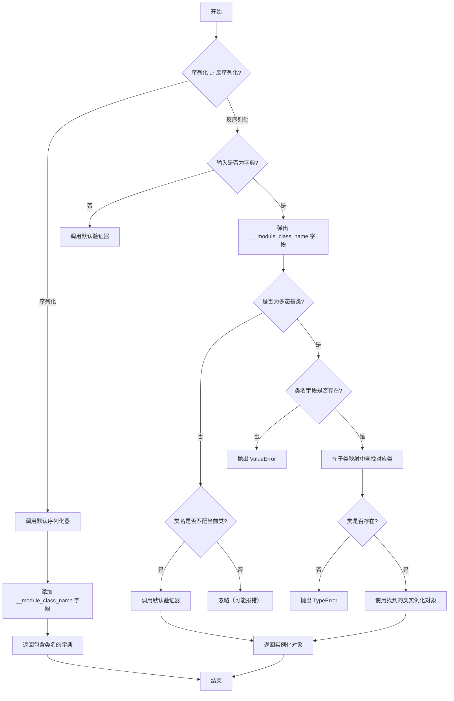
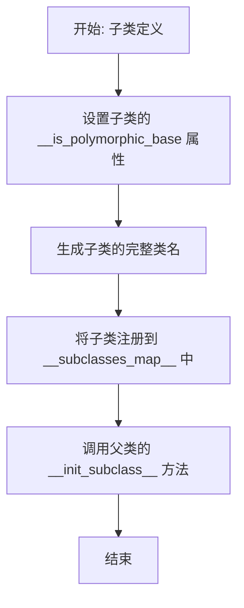

# `.\MetaGPT\metagpt\base\base_serialization.py` 详细设计文档

该代码实现了一个基于Pydantic的多态序列化/反序列化混入类（Mixin），通过在序列化输出中添加类全名（`__module_class_name`）字段，并在反序列化时根据该字段动态查找并实例化正确的子类，从而支持继承层次结构的对象在序列化后能保持其具体类型信息。

## 整体流程



## 类结构

```
BaseSerialization (多态序列化混入类)
├── 继承自: pydantic.BaseModel
├── 混入方法: __serialize_with_class_type__
├── 混入方法: __convert_to_real_type__
└── 类方法: __init_subclass__
```

## 全局变量及字段


### `BaseSerialization.__is_polymorphic_base`
    
类属性，标识当前类是否为多态基类，用于控制反序列化时的行为。

类型：`bool`
    


### `BaseSerialization.__subclasses_map__`
    
类属性，存储所有继承自BaseSerialization的子类的映射关系，键为类的完整限定名，值为类本身。

类型：`dict[str, type]`
    
    

## 全局函数及方法

### `BaseSerialization.__serialize_with_class_type__`

该方法是一个模型序列化包装器，用于在序列化对象时，在默认序列化结果的基础上，添加一个特殊的 `__module_class_name` 字段。该字段记录了对象的完整类路径（模块名.类名），其核心目的是为了支持多态反序列化，使得在反序列化时能够根据此字段准确地重建出原始的子类对象，而非其父类。

参数：

- `self`：`BaseSerialization`，当前序列化的对象实例。
- `default_serializer`：`Callable`，Pydantic 提供的默认序列化函数。

返回值：`Any`，返回一个字典，包含默认序列化器的所有输出以及一个额外的 `__module_class_name` 键值对。

#### 流程图

```mermaid
flowchart TD
    A[开始: __serialize_with_class_type__] --> B[调用 default_serializer(self) 获取基础序列化结果]
    B --> C[在结果字典中添加<br>__module_class_name 字段]
    C --> D[字段值为 self.__class__.__module__<br>+ '.' + self.__class__.__qualname__]
    D --> E[返回包含类名的字典]
    E --> F[结束]
```

#### 带注释源码

```python
@model_serializer(mode="wrap")  # 使用 Pydantic 的包装模式序列化器，允许在默认序列化前后执行自定义逻辑。
def __serialize_with_class_type__(self, default_serializer) -> Any:
    # 首先，使用 Pydantic 的默认序列化器处理当前对象。
    ret = default_serializer(self)
    # 然后，在序列化结果字典中添加一个 `__module_class_name` 字段。
    # 该字段的值是对象的完整类路径，由模块名和类限定名组成。
    ret["__module_class_name"] = f"{self.__class__.__module__}.{self.__class__.__qualname__}"
    # 返回添加了类信息的新字典。
    return ret
```

### `BaseSerialization.__convert_to_real_type__`

该方法是一个类级别的模型验证器，用于在反序列化过程中实现多态类型转换。当传入的数据是一个字典且包含 `__module_class_name` 字段时，它会根据该字段的值查找对应的子类，并使用该子类来实例化对象，而不是使用基类。这确保了序列化/反序列化过程中能够保持对象的实际类型信息。

参数：

- `cls`：`type[BaseSerialization]`，当前类（`BaseSerialization` 或其子类）
- `value`：`Any`，传入的待验证/转换的值
- `handler`：`Callable`，Pydantic 提供的默认验证处理器

返回值：`Any`，返回处理后的对象实例，可能是基类或子类的实例

#### 流程图

```mermaid
graph TD
    A[开始: __convert_to_real_type__] --> B{value 是否为 dict?};
    B -- 否 --> C[调用 handler(value) 并返回];
    B -- 是 --> D[从 value 中弹出 __module_class_name];
    D --> E{当前类是否为多态基类?};
    E -- 否 --> F{class_full_name 是否为 None?};
    F -- 是 --> G[调用 handler(value) 并返回];
    F -- 否 --> H{当前类名是否与 class_full_name 匹配?};
    H -- 是 --> G;
    H -- 否 --> I[忽略，继续执行];
    E -- 是 --> J{class_full_name 是否为 None?};
    J -- 是 --> K[抛出 ValueError];
    J -- 否 --> L[从 __subclasses_map__ 查找 class_type];
    L --> M{class_type 是否为 None?};
    M -- 是 --> N[抛出 TypeError];
    M -- 否 --> O[使用 value 实例化 class_type 并返回];
    C --> P[结束];
    G --> P;
    I --> P;
    K --> P;
    N --> P;
    O --> P;
```

#### 带注释源码

```python
@model_validator(mode="wrap")
@classmethod
def __convert_to_real_type__(cls, value: Any, handler):
    # 如果传入的值不是字典，直接调用默认处理器处理并返回
    if isinstance(value, dict) is False:
        return handler(value)

    # 如果是字典，尝试弹出 __module_class_name 字段
    # 这样做是为了在反序列化时移除这个额外字段，因为模型禁止额外关键字
    # 同时确保类似 Cat.model_validate(cat.model_dump()) 的操作能正常工作
    class_full_name = value.pop("__module_class_name", None)

    # 如果当前类不是多态基类
    if not cls.__is_polymorphic_base:
        # 如果没有提供类全名，直接使用默认处理器处理
        if class_full_name is None:
            return handler(value)
        # 如果提供的类全名与当前类匹配，也使用默认处理器处理
        elif str(cls) == f"<class '{class_full_name}'>":
            return handler(value)
        else:
            # 如果不匹配，说明尝试实例化的类型与当前类不符，但这里不做处理，继续执行
            # 可以在此处添加日志或抛出异常，但当前实现选择忽略
            pass

    # 如果当前类是多态基类，则必须进行类型查找和转换
    if class_full_name is None:
        # 缺少必要的类型信息，无法进行多态反序列化
        raise ValueError("Missing __module_class_name field")

    # 从子类映射表中查找对应的类类型
    class_type = cls.__subclasses_map__.get(class_full_name, None)

    if class_type is None:
        # 如果找不到对应的类类型，说明该类型尚未定义
        # 可以在此处尝试动态导入，但当前实现直接抛出异常
        raise TypeError(f"Trying to instantiate {class_full_name}, which has not yet been defined!")

    # 使用找到的子类类型和剩余的数据实例化对象
    return class_type(**value)
```

### `BaseSerialization.__init_subclass__`

该方法是一个类方法，用于在定义`BaseSerialization`的子类时自动执行。它的核心功能是初始化子类的多态相关属性，并将子类注册到全局映射中，以便后续在反序列化时能够根据类名找到正确的类。

参数：

- `cls`：`type`，当前正在被初始化的子类。
- `is_polymorphic_base`：`bool`，默认为`False`，指示当前子类是否为多态基类。
- `**kwargs`：`Any`，其他关键字参数，传递给父类的`__init_subclass__`方法。

返回值：`None`，无返回值。

#### 流程图



#### 带注释源码

```python
def __init_subclass__(cls, is_polymorphic_base: bool = False, **kwargs):
    # 设置当前子类的 __is_polymorphic_base 属性，
    # 用于标识该类是否为多态基类。
    cls.__is_polymorphic_base = is_polymorphic_base

    # 生成当前子类的完整类名，格式为 "模块名.类名"，
    # 并将其作为键，子类本身作为值，注册到 __subclasses_map__ 字典中。
    # 这个映射用于在反序列化时根据类名查找对应的类。
    cls.__subclasses_map__[f"{cls.__module__}.{cls.__qualname__}"] = cls

    # 调用父类（BaseModel）的 __init_subclass__ 方法，
    # 确保父类的初始化逻辑也被执行。
    super().__init_subclass__(**kwargs)
```

## 关键组件


### 序列化/反序列化包装器 (`__serialize_with_class_type__` 方法)

在默认序列化结果中添加 `__module_class_name` 字段，该字段记录了对象的完整类路径（模块名.类名），以实现多态序列化。

### 多态反序列化转换器 (`__convert_to_real_type__` 方法)

在反序列化时，根据输入字典中的 `__module_class_name` 字段，查找并实例化正确的子类对象，从而实现多态反序列化。

### 子类注册机制 (`__init_subclass__` 方法)

当一个类继承 `BaseSerialization` 时，自动将其完整类名注册到 `__subclasses_map__` 字典中，为后续的多态反序列化提供类型查找表。

### 多态基类标识 (`__is_polymorphic_base` 类属性)

用于标识一个类是否为多态继承体系的基类。当设置为 `True` 时，`__convert_to_real_type__` 方法会强制要求输入数据包含 `__module_class_name` 字段，并据此查找具体子类进行实例化。

### 子类映射表 (`__subclasses_map__` 类属性)

一个字典，用于存储所有已定义的 `BaseSerialization` 子类的完整类名与类对象本身的映射关系，是多态反序列化时进行类型查找的核心数据结构。


## 问题及建议


### 已知问题

-   **动态导入缺失**：`__convert_to_real_type__` 方法在反序列化时，如果遇到尚未在 `__subclasses_map__` 中注册的类名（例如，由于模块尚未导入），会直接抛出 `TypeError`。当前代码中的 `TODO` 注释表明动态导入功能尚未实现，这限制了代码的灵活性，尤其是在插件化或延迟加载场景下。
-   **潜在的子类注册冲突**：`__init_subclass__` 方法使用类的完全限定名（`f"{cls.__module__}.{cls.__qualname__}"`）作为键来注册子类。如果两个不同的模块中存在同名的类（例如，`package1.module.MyClass` 和 `package2.module.MyClass`），它们将被视为不同的类，注册机制可以正常工作。但如果同一个完全限定名的类被多次定义和继承（例如，在重新加载模块时），可能会导致 `__subclasses_map__` 中的条目被意外覆盖，引发不可预测的行为。
-   **序列化字段名硬编码**：用于存储类名的字段名 `"__module_class_name"` 在序列化和反序列化逻辑中被硬编码。如果未来需要更改此字段名，必须在多个位置进行修改，增加了维护成本。
-   **对非字典输入的处理可能过于严格**：在 `__convert_to_real_type__` 方法中，如果输入 `value` 不是字典，则直接调用 `handler(value)`。虽然这符合 `model_validator` 的常见模式，但未考虑 `value` 可能已经是目标类实例的情况。在某些边缘情况下，如果传入一个已经正确构造的实例，此逻辑可能会进行不必要的处理或引发错误。
-   **缺乏对循环引用的处理**：当前的序列化/反序列化逻辑没有处理对象间循环引用的情况。如果被序列化的对象图中存在循环引用，使用 `model_dump()` 和 `model_validate()` 可能会导致递归错误或序列化失败。

### 优化建议

-   **实现动态导入**：实现 `TODO` 注释中提到的动态导入功能。可以在 `__convert_to_real_type__` 方法中，当在 `__subclasses_map__` 中找不到类时，尝试根据 `class_full_name` 动态导入对应的模块和类，然后将其注册到映射中并实例化。这需要谨慎处理导入错误和安全性问题。
-   **增强子类注册的健壮性**：考虑在 `__init_subclass__` 中添加日志或警告，当检测到完全限定名冲突时进行提示。或者，可以设计一个机制来允许显式地覆盖或管理映射中的条目。对于热重载场景，可能需要提供清理旧映射条目的方法。
-   **将类名字段名提取为类变量**：将 `"__module_class_name"` 定义为一个类级常量（例如 `_CLASS_NAME_FIELD = "__module_class_name"`），并在序列化和反序列化方法中引用该常量。这样，只需在一个地方修改即可改变字段名。
-   **优化非字典输入处理**：在 `__convert_to_real_type__` 方法中，可以增加一个检查：如果 `isinstance(value, cls)`，则直接返回 `value`，避免不必要的处理。这能更优雅地处理已经是目标类型实例的输入。
-   **支持循环引用序列化**：研究 Pydantic 对循环引用的支持（例如，通过 `defer_build=True` 或自定义编码器），并考虑在 `__serialize_with_class_type__` 方法中集成相关逻辑，或者至少提供明确的错误提示来指导用户如何处理循环引用。
-   **性能考虑与缓存**：`__subclasses_map__` 是一个类变量，所有子类共享。它的查找是 O(1) 的，性能良好。动态导入实现后，应考虑对导入结果进行缓存，避免重复导入开销。序列化流程中的 `default_serializer(self)` 调用是主要性能点，通常由 Pydantic 优化，无需过度担心。
-   **改进错误信息**：在抛出 `ValueError` 或 `TypeError` 时，可以提供更具体、更友好的错误信息，帮助开发者快速定位问题，例如指出缺失的字段名或建议检查类定义是否已导入。
-   **添加类型注解**：确保所有方法（包括 `__init_subclass__`）的参数和返回值都有完整的类型注解，以提升代码的清晰度和工具支持（如 mypy）。
-   **考虑抽象基类（ABC）集成**：如果多态基类本身应该是抽象的（即不应被直接实例化），可以考虑让其继承自 `abc.ABC`，并将 `__is_polymorphic_base` 的逻辑与 `@abc.abstractmethod` 结合，提供更清晰的接口契约。


## 其它


### 设计目标与约束

本模块的核心设计目标是实现基于 Pydantic 模型的、支持多态子类序列化与反序列化的通用机制。主要约束包括：1) 必须与 Pydantic v2 的序列化/验证流程无缝集成，避免使用不稳定的内部 API（如 `__get_pydantic_core_schema__`）。2) 序列化输出必须包含足够的信息（类全限定名）以支持后续正确的反序列化。3) 反序列化过程必须能根据序列化信息动态定位并实例化正确的子类。4) 必须保持 Pydantic 的严格模式（如 `extra="forbid"`），确保数据模型的健壮性。

### 错误处理与异常设计

模块定义了明确的异常抛出点以处理反序列化过程中的错误情况：1) 当输入的字典数据缺少必需的 `__module_class_name` 字段时，抛出 `ValueError("Missing __module_class_name field")`。2) 当 `__module_class_name` 字段指定的类在当前的子类注册表中不存在时，抛出 `TypeError`，提示该类尚未定义。这些异常设计旨在快速失败（fail-fast），帮助开发者快速定位序列化数据不完整或类定义缺失的问题。对于序列化过程，则依赖 Pydantic 自身的验证和序列化错误。

### 数据流与状态机

数据流主要围绕序列化与反序列化两个过程：
1.  **序列化流**：对象实例 -> `model_dump()` 触发 -> `__serialize_with_class_type__` 包装器 -> 调用默认序列化器生成字典 -> 向字典插入 `__module_class_name` 键（值为类全限定名） -> 输出最终字典。
2.  **反序列化流**：输入字典 -> `model_validate()` 触发 -> `__convert_to_real_type__` 包装器 -> 检查输入是否为字典并提取 `__module_class_name` -> 若非多态基类且类名匹配或为空，则直接处理；若为多态基类，则根据提取的类名从 `__subclasses_map__` 查找对应的类 -> 使用找到的类构造函数和剩余字典数据实例化对象 -> 返回实例。
模块内部维护一个关键状态：`__subclasses_map__` 字典，它在所有子类通过 `__init_subclass__` 钩子注册时动态构建，作为类名到类对象的映射，是反序列化时进行类查找的“状态机”核心。

### 外部依赖与接口契约

1.  **外部依赖**：
    *   **Pydantic (v2+)**: 核心依赖，用于基础数据模型定义、验证和序列化框架。本模块重度依赖其 `BaseModel`、`model_serializer`、`model_validator` 装饰器以及 `__init_subclass__` 机制。
    *   **Python 类型系统 (`typing`)**: 用于类型注解。
2.  **接口契约**：
    *   **继承契约**: 任何希望参与此多态序列化机制的类必须继承自 `BaseSerialization`（或其标记为多态基类的子类）。子类化时自动注册。
    *   **序列化输出契约**: 序列化后的字典必定包含一个额外的键 `__module_class_name`，其值为序列化对象的完整类路径（`{模块名}.{类名}`）。
    *   **反序列化输入契约**: 反序列化输入的字典应包含 `__module_class_name` 键，且其值对应的类必须已在当前运行时环境中定义并注册到 `__subclasses_map__` 中。反序列化后，该键会从数据中移除。
    *   **多态基类标记**: 通过 `__init_subclass__(is_polymorphic_base=True)` 参数，可以将一个子类标记为“多态基类”。标记后，该类的 `model_validate` 将总是尝试根据 `__module_class_name` 查找具体子类，而不是尝试实例化自身。

    