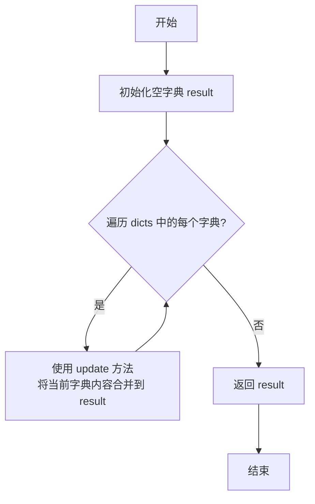
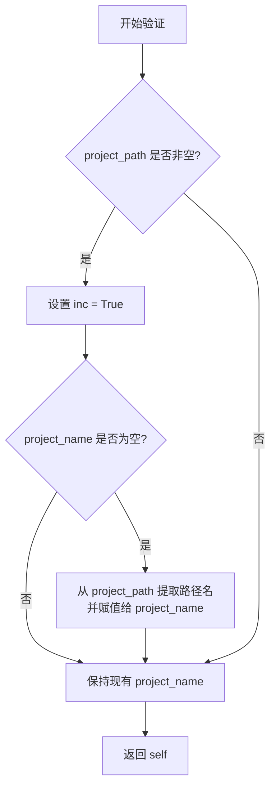
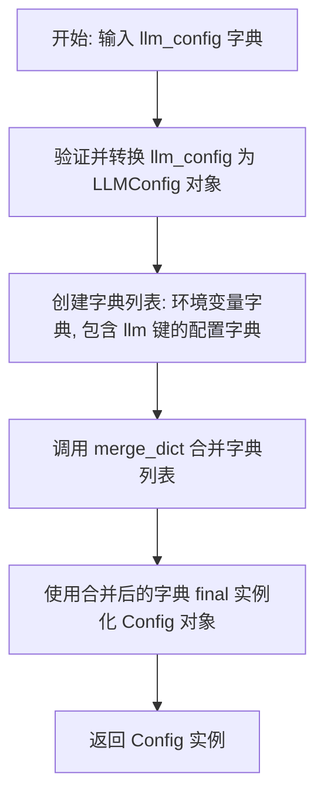
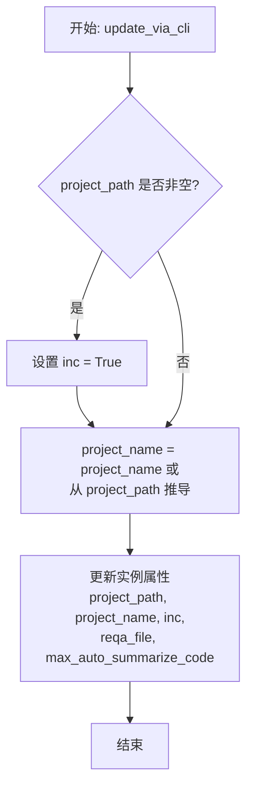
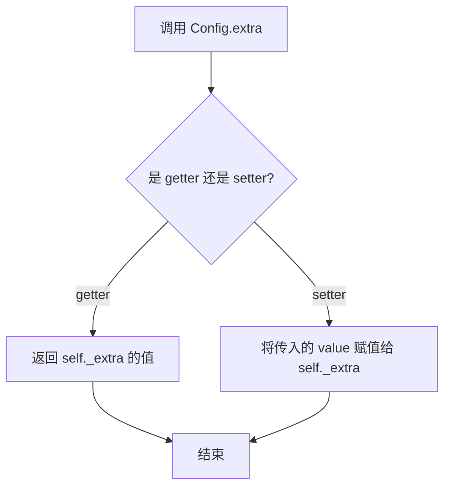
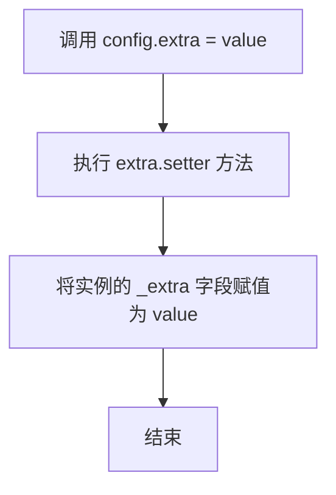
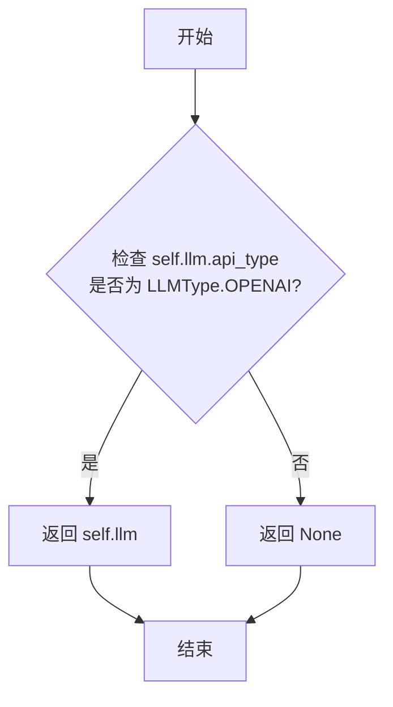
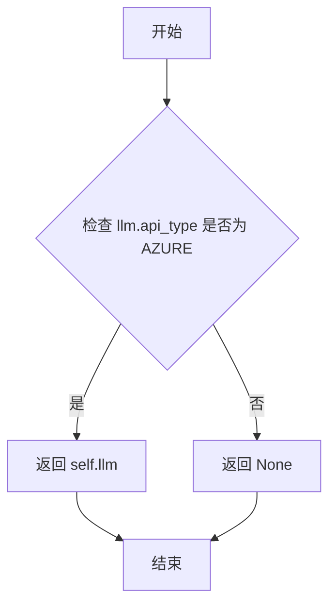

# `.\MetaGPT\metagpt\config2.py` 详细设计文档

该文件是MetaGPT项目的核心配置文件，定义了整个系统的配置模型。它通过Pydantic模型管理各种配置项，包括LLM（大语言模型）、搜索、浏览器、存储（S3、Redis）、工作空间、角色定制等参数，并提供了从环境变量、YAML文件和命令行参数加载、合并和缓存配置的机制。

## 整体流程

```mermaid
graph TD
    A[开始] --> B{调用Config.default()或类似方法}
    B --> C[读取环境变量]
    C --> D[按优先级读取默认YAML配置文件]
    D --> E[合并所有配置源（环境变量、YAML、kwargs）]
    E --> F[使用合并后的字典实例化Config对象]
    F --> G[将实例缓存到_CONFIG_CACHE]
    G --> H[返回Config实例]
    H --> I[应用CLI参数更新配置（可选）]
    I --> J[配置对象准备就绪，供系统其他部分使用]
```

## 类结构

```
BaseModel (Pydantic基类)
├── CLIParams (CLI参数模型)
└── YamlModel (YAML模型基类)
    └── Config (主配置类，继承自CLIParams和YamlModel)
```

## 全局变量及字段


### `_CONFIG_CACHE`
    
全局配置缓存字典，用于存储已加载的默认配置，键为配置路径元组，值为对应的Config对象，避免重复加载。

类型：`Dict[Tuple[Path, ...], Config]`
    


### `config`
    
全局配置实例，通过调用Config.default()方法初始化，作为应用程序运行时的默认配置对象。

类型：`Config`
    


### `CLIParams.project_path`
    
命令行参数，表示项目路径，当设置此参数时会自动将inc标志设为True。

类型：`str`
    


### `CLIParams.project_name`
    
命令行参数，表示项目名称，如果未显式提供，则从project_path中推导。

类型：`str`
    


### `CLIParams.inc`
    
命令行参数，表示是否为增量模式，当project_path被设置时自动变为True。

类型：`bool`
    


### `CLIParams.reqa_file`
    
命令行参数，表示需求分析文件的路径。

类型：`str`
    


### `CLIParams.max_auto_summarize_code`
    
命令行参数，表示自动总结代码的最大次数限制。

类型：`int`
    


### `CLIParams.git_reinit`
    
命令行参数，表示是否重新初始化Git仓库。

类型：`bool`
    


### `Config.llm`
    
核心参数，大语言模型（LLM）的配置，包含API类型、密钥、模型等关键信息。

类型：`LLMConfig`
    


### `Config.embedding`
    
RAG（检索增强生成）相关的嵌入模型配置。

类型：`EmbeddingConfig`
    


### `Config.omniparse`
    
OmniParse工具的配置，用于文档解析等任务。

类型：`OmniParseConfig`
    


### `Config.proxy`
    
全局网络代理地址，当llm配置中没有单独设置代理时使用此值。

类型：`str`
    


### `Config.search`
    
搜索工具的配置，例如搜索引擎的API设置。

类型：`SearchConfig`
    


### `Config.enable_search`
    
布尔标志，控制是否启用搜索功能。

类型：`bool`
    


### `Config.browser`
    
浏览器自动化工具的配置。

类型：`BrowserConfig`
    


### `Config.mermaid`
    
Mermaid图表生成工具的配置。

类型：`MermaidConfig`
    


### `Config.s3`
    
可选配置，Amazon S3对象存储服务的连接和认证信息。

类型：`Optional[S3Config]`
    


### `Config.redis`
    
可选配置，Redis内存数据库的连接和认证信息。

类型：`Optional[RedisConfig]`
    


### `Config.repair_llm_output`
    
布尔标志，控制是否对LLM的输出进行修复或后处理。

类型：`bool`
    


### `Config.prompt_schema`
    
枚举类型，定义发送给LLM的提示词（Prompt）的格式规范。

类型：`Literal["json", "markdown", "raw"]`
    


### `Config.workspace`
    
工作空间配置，定义项目文件存储的目录结构等。

类型：`WorkspaceConfig`
    


### `Config.enable_longterm_memory`
    
布尔标志，控制是否启用长期记忆功能。

类型：`bool`
    


### `Config.code_validate_k_times`
    
整数参数，定义代码验证过程的最大尝试次数。

类型：`int`
    


### `Config.exp_pool`
    
经验池（Experience Pool）的配置，用于存储和复用任务经验。

类型：`ExperiencePoolConfig`
    


### `Config.metagpt_tti_url`
    
字符串参数，MetaGPT文本到图像（TTI）服务的URL地址（标记为未来将移除）。

类型：`str`
    


### `Config.language`
    
字符串参数，定义系统运行和输出的默认语言。

类型：`str`
    


### `Config.redis_key`
    
字符串参数，Redis存储中使用的默认键名前缀（标记为未来将移除）。

类型：`str`
    


### `Config.iflytek_app_id`
    
字符串参数，科大讯飞（iFlyTek）语音服务的应用ID（标记为未来将移除）。

类型：`str`
    


### `Config.iflytek_api_secret`
    
字符串参数，科大讯飞（iFlyTek）语音服务的API密钥（标记为未来将移除）。

类型：`str`
    


### `Config.iflytek_api_key`
    
字符串参数，科大讯飞（iFlyTek）语音服务的API密钥（标记为未来将移除）。

类型：`str`
    


### `Config.azure_tts_subscription_key`
    
字符串参数，Azure文本转语音（TTS）服务的订阅密钥（标记为未来将移除）。

类型：`str`
    


### `Config.azure_tts_region`
    
字符串参数，Azure文本转语音（TTS）服务的区域（标记为未来将移除）。

类型：`str`
    


### `Config._extra`
    
私有字典字段，用于存储未在模型中定义的额外配置项，通过extra属性访问器暴露。

类型：`dict`
    


### `Config.roles`
    
可选配置，自定义角色（Role）的配置列表，允许为不同角色设置特定参数。

类型：`Optional[List[RoleCustomConfig]]`
    


### `Config.role_zero`
    
RoleZero（可能是默认或管理角色）的特定配置。

类型：`RoleZeroConfig`
    
    

## 全局函数及方法


### `merge_dict`

`merge_dict` 函数用于将多个字典合并为一个字典。合并时，后一个字典中的键值对会覆盖前一个字典中相同的键。

参数：
- `dicts`：`Iterable[Dict]`，一个可迭代对象，包含多个待合并的字典。

返回值：`Dict`，合并后的新字典。

#### 流程图



#### 带注释源码

```python
def merge_dict(dicts: Iterable[Dict]) -> Dict:
    """Merge multiple dicts into one, with the latter dict overwriting the former"""
    # 1. 初始化一个空字典，用于存储合并结果
    result = {}
    # 2. 遍历传入的可迭代对象 dicts 中的每一个字典
    for dictionary in dicts:
        # 3. 使用字典的 update 方法，将当前遍历到的字典 dictionary 中的键值对合并到 result 中。
        #    如果 dictionary 中的某个键在 result 中已存在，则其对应的值会被 dictionary 中的值覆盖。
        result.update(dictionary)
    # 4. 返回合并后的最终字典
    return result
```


### `CLIParams.check_project_path`

该方法是一个Pydantic模型验证器，用于在`CLIParams`模型实例化后，自动检查和设置与项目路径相关的字段。其核心逻辑是：如果`project_path`字段被设置（非空），则自动将`inc`字段设置为`True`，并根据`project_path`的路径名自动填充`project_name`字段（如果`project_name`为空）。

参数：
-  `self`：`CLIParams`，`CLIParams`模型自身的实例。

返回值：`CLIParams`，返回经过验证和修改后的`CLIParams`模型实例自身。

#### 流程图



#### 带注释源码

```python
@model_validator(mode="after")
def check_project_path(self):
    """Check project_path and project_name"""
    # 检查 project_path 字段是否被设置（非空字符串）
    if self.project_path:
        # 如果 project_path 存在，则自动将 inc 字段设置为 True
        self.inc = True
        # 如果 project_name 字段为空，则使用 project_path 的路径名（最后一个部分）来填充它
        self.project_name = self.project_name or Path(self.project_path).name
    # 返回修改后的模型实例
    return self
```

### `Config.from_home`

`Config.from_home` 是一个类方法，用于从用户主目录下的指定路径加载配置文件，并返回一个 `Config` 对象实例。如果指定的配置文件不存在，则返回 `None`。

参数：

- `path`：`str`，配置文件的相对路径（相对于 `CONFIG_ROOT` 目录）。

返回值：`Optional[Config]`，如果配置文件存在，则返回一个 `Config` 对象实例；否则返回 `None`。

#### 流程图

```mermaid
flowchart TD
    A[开始] --> B[构造完整路径 pathname = CONFIG_ROOT / path]
    B --> C{pathname 是否存在?}
    C -- 是 --> D[调用 Config.from_yaml_file(pathname) 加载配置]
    D --> E[返回 Config 对象]
    C -- 否 --> F[返回 None]
    E --> G[结束]
    F --> G
```

#### 带注释源码

```python
@classmethod
def from_home(cls, path):
    """Load config from ~/.metagpt/config2.yaml"""
    # 1. 将传入的相对路径与预定义的配置根目录（CONFIG_ROOT）拼接，得到完整的文件路径。
    pathname = CONFIG_ROOT / path
    # 2. 检查拼接后的完整路径是否存在。
    if not pathname.exists():
        # 3. 如果文件不存在，则返回 None。
        return None
    # 4. 如果文件存在，则调用父类 YamlModel 的 from_yaml_file 类方法，
    #    从该 YAML 文件加载配置并实例化一个 Config 对象，然后返回该对象。
    return Config.from_yaml_file(pathname)
```

### `Config.default`

`Config.default` 是一个类方法，用于加载并返回默认的 `Config` 配置实例。它遵循特定的优先级顺序（环境变量 < 默认配置文件）来合并配置，并支持缓存以提高性能。

参数：

- `reload`：`bool`，如果为 `True`，则强制重新加载配置，忽略缓存。默认为 `False`。
- `**kwargs`：`dict`，额外的关键字参数，用于在加载过程中覆盖或补充配置项。

返回值：`Config`，返回一个已加载并合并了环境变量、默认配置文件及额外参数的 `Config` 配置实例。

#### 流程图

```mermaid
flowchart TD
    A[开始: Config.default(reload, **kwargs)] --> B{reload 为 True<br>或缓存未命中?};
    B -- 是 --> C[初始化默认配置文件路径列表];
    C --> D[创建配置字典列表<br>（环境变量、各配置文件、kwargs）];
    D --> E[调用 merge_dict 合并所有字典];
    E --> F[使用合并后的字典<br>实例化 Config 对象];
    F --> G[将结果存入缓存];
    G --> H[返回 Config 实例];
    B -- 否 --> I[直接从缓存中<br>返回 Config 实例];
    I --> H;
```

#### 带注释源码

```python
@classmethod
def default(cls, reload: bool = False, **kwargs) -> "Config":
    """加载默认配置
    - 优先级: 环境变量 < 默认配置文件路径
    - 在默认配置文件路径列表中，后一个文件会覆盖前一个文件的配置项
    """
    # 定义默认的配置文件路径元组
    default_config_paths = (
        METAGPT_ROOT / "config/config2.yaml",  # 项目根目录下的默认配置
        CONFIG_ROOT / "config2.yaml",          # 用户主目录下的配置（优先级更高）
    )
    # 检查是否需要重新加载或缓存中不存在该路径组合的配置
    if reload or default_config_paths not in _CONFIG_CACHE:
        # 构建配置字典列表，顺序决定了优先级（从低到高）
        dicts = [
            dict(os.environ),  # 1. 环境变量（最低优先级）
            *(Config.read_yaml(path) for path in default_config_paths),  # 2. 读取所有默认配置文件
            kwargs  # 3. 传入的关键字参数（最高优先级，用于临时覆盖）
        ]
        # 合并所有字典，后出现的字典会覆盖先出现的字典中的相同键
        final = merge_dict(dicts)
        # 使用合并后的字典创建 Config 实例，并存入缓存
        _CONFIG_CACHE[default_config_paths] = Config(**final)
    # 从缓存中返回配置实例
    return _CONFIG_CACHE[default_config_paths]
```

### `Config.from_llm_config`

`Config.from_llm_config` 是一个类方法，用于根据用户提供的 LLM（大语言模型）配置字典，快速创建一个 `Config` 类的实例。它简化了为特定角色或任务配置专用 LLM 的过程，通过合并环境变量和用户配置来生成最终的配置对象。

参数：

- `llm_config`：`dict`，一个包含 LLM 配置信息的字典，例如 `{"api_type": "xxx", "api_key": "xxx", "model": "xxx"}`。

返回值：`Config`，返回一个根据提供的 `llm_config` 和环境变量初始化好的 `Config` 配置对象。

#### 流程图



#### 带注释源码

```python
    @classmethod
    def from_llm_config(cls, llm_config: dict):
        """user config llm
        example:
        llm_config = {"api_type": "xxx", "api_key": "xxx", "model": "xxx"}
        gpt4 = Config.from_llm_config(llm_config)
        A = Role(name="A", profile="Democratic candidate", goal="Win the election", actions=[a1], watch=[a2], config=gpt4)
        """
        # 1. 将输入的字典 llm_config 通过 Pydantic 的 model_validate 方法验证并转换为 LLMConfig 对象。
        #    这确保了配置数据的结构正确性和类型安全。
        llm_config = LLMConfig.model_validate(llm_config)

        # 2. 准备一个字典列表，用于后续的配置合并。
        #    - 第一个元素是当前系统的环境变量字典，为配置提供基础值（如 API Key 可能来自环境变量）。
        #    - 第二个元素是一个新字典，其键为 'llm'，值为上一步转换得到的 LLMConfig 对象。
        #    这个列表的顺序决定了配置的优先级：后者覆盖前者。
        dicts = [dict(os.environ)]
        dicts += [{"llm": llm_config}]

        # 3. 调用 merge_dict 函数，将列表中的所有字典合并为一个字典。
        #    合并规则是：列表中靠后的字典会覆盖靠前字典中相同的键。
        final = merge_dict(dicts)

        # 4. 使用合并后的最终字典 `final` 作为关键字参数，实例化并返回一个 Config 对象。
        #    由于 `final` 字典包含了 'llm' 键，它会用于初始化 Config 实例中的 `llm` 字段。
        return Config(**final)
```

### `Config.update_via_cli`

该方法用于通过命令行界面（CLI）传入的参数来更新`Config`对象的特定配置项。它主要处理与项目初始化、增量更新和代码自动摘要相关的配置。

参数：

- `project_path`：`str`，项目根目录的路径。如果提供了此路径，则强制将`inc`标志设置为`True`。
- `project_name`：`str`，项目的名称。如果未提供，则从`project_path`中推导。
- `inc`：`bool`，指示是否为增量（incremental）模式。当`project_path`被设置时，此值会被覆盖为`True`。
- `reqa_file`：`str`，需求分析文件的路径。
- `max_auto_summarize_code`：`int`，自动摘要代码的最大次数限制。

返回值：`None`，此方法不返回任何值，直接修改`Config`实例自身的属性。

#### 流程图



#### 带注释源码

```python
def update_via_cli(self, project_path, project_name, inc, reqa_file, max_auto_summarize_code):
    """update config via cli"""

    # Use in the PrepareDocuments action according to Section 2.2.3.5.1 of RFC 135.
    # 根据 RFC 135 的 2.2.3.5.1 章节，此逻辑用于 PrepareDocuments 动作。
    # 如果提供了项目路径，则强制进入增量模式，并确保项目名称被设置。
    if project_path:
        inc = True
        project_name = project_name or Path(project_path).name
    # 将处理后的参数值赋值给实例的对应字段
    self.project_path = project_path
    self.project_name = project_name
    self.inc = inc
    self.reqa_file = reqa_file
    self.max_auto_summarize_code = max_auto_summarize_code
```

### `Config.extra`

`Config.extra` 是一个属性（property），用于访问和设置 `Config` 类内部的私有字典字段 `_extra`。它提供了一个受控的接口来管理额外的配置信息，这些信息不属于 `Config` 类中明确定义的字段。

参数：
-  `value`：`dict`，当作为 setter 使用时，传入一个字典用于设置 `_extra` 字段的值。

返回值：`dict`，返回 `_extra` 字段中存储的额外配置字典。

#### 流程图



#### 带注释源码

```python
    @property
    def extra(self):
        # Getter 方法：返回私有字段 `_extra` 的值。
        return self._extra

    @extra.setter
    def extra(self, value: dict):
        # Setter 方法：将传入的字典 `value` 赋值给私有字段 `_extra`。
        self._extra = value
```

### `Config.extra.setter`

这是一个属性设置器（setter），用于设置 `Config` 类中私有字段 `_extra` 的值。它允许通过 `config.extra = value` 的语法来更新 `_extra` 字典，而不是直接访问私有变量。

参数：

- `value`：`dict`，一个字典，用于替换 `Config` 实例中 `_extra` 字段的当前值。

返回值：`None`，此方法不返回任何值，其作用是为实例属性赋值。

#### 流程图



#### 带注释源码

```python
@extra.setter
def extra(self, value: dict):
    # 将传入的字典 `value` 赋值给实例的私有字段 `_extra`
    self._extra = value
```


### `Config.get_openai_llm`

该方法用于从配置对象中获取 OpenAI 类型的 LLM 配置。它会检查当前配置的 `llm` 字段的 `api_type` 是否为 `LLMType.OPENAI`。如果是，则返回该配置；否则返回 `None`。

参数：
-  `self`：`Config`，当前配置对象的实例

返回值：`Optional[LLMConfig]`，如果配置的 LLM 类型是 OpenAI，则返回对应的 `LLMConfig` 对象；否则返回 `None`。

#### 流程图



#### 带注释源码

```python
def get_openai_llm(self) -> Optional[LLMConfig]:
    """Get OpenAI LLMConfig by name. If no OpenAI, raise Exception"""
    # 检查当前配置的 llm 字段的 api_type 是否为 OPENAI 类型
    if self.llm.api_type == LLMType.OPENAI:
        # 如果是，则返回这个 llm 配置对象
        return self.llm
    # 如果不是，则返回 None
    return None
```


### `Config.get_azure_llm`

该方法用于从配置中获取Azure LLM的配置信息。如果当前配置的LLM类型是Azure，则返回对应的LLM配置对象；否则返回None。

参数：
- `self`：`Config`，当前配置实例

返回值：`Optional[LLMConfig]`，如果配置的LLM类型是Azure，则返回对应的LLM配置对象；否则返回None

#### 流程图



#### 带注释源码

```python
def get_azure_llm(self) -> Optional[LLMConfig]:
    """Get Azure LLMConfig by name. If no Azure, raise Exception"""
    # 检查当前配置的LLM类型是否为AZURE
    if self.llm.api_type == LLMType.AZURE:
        # 如果是AZURE类型，返回对应的LLM配置对象
        return self.llm
    # 如果不是AZURE类型，返回None
    return None
```

## 关键组件


### 配置管理核心 (Config)

作为整个配置系统的核心类，它继承自 `CLIParams` 和 `YamlModel`，负责整合和管理 MetaGPT 应用的所有配置项。它通过类方法支持从环境变量、默认 YAML 文件、用户输入等多种来源加载和合并配置，并提供了便捷的访问接口。

### 命令行参数模型 (CLIParams)

定义了通过命令行接口传入的运行时参数，如项目路径、项目名称等，并包含验证逻辑以确保参数的有效性。

### 大语言模型配置 (LLMConfig)

封装了与大型语言模型交互所需的所有配置，如 API 类型、密钥、模型名称、代理设置等，是驱动智能体核心能力的关键配置组件。

### 检索增强生成配置 (EmbeddingConfig)

为检索增强生成功能提供配置，主要涉及文本嵌入模型的选择和参数设置，用于支持知识库的构建和查询。

### 文件解析配置 (OmniParseConfig)

配置全能文件解析器，支持处理多种格式的文档，是数据输入和知识提取流程中的重要组件。

### 搜索工具配置 (SearchConfig)

配置网络搜索功能，使智能体能够获取外部实时信息。

### 浏览器自动化配置 (BrowserConfig)

配置浏览器自动化工具，支持网页交互和数据抓取等高级操作。

### 图表生成配置 (MermaidConfig)

配置 Mermaid 图表生成功能，用于可视化工作流、架构图等。

### 存储配置 (S3Config, RedisConfig)

分别配置对象存储和键值存储，用于支持文件的持久化、缓存以及长期记忆等功能。

### 工作空间配置 (WorkspaceConfig)

定义项目的工作目录结构，管理代码、文档等产物的存放路径。

### 经验池配置 (ExperiencePoolConfig)

配置经验回放池，用于存储和复用智能体的历史经验，以提升学习效率和决策质量。

### 角色自定义配置 (RoleCustomConfig)

允许为特定的智能体角色定义个性化的配置，覆盖全局默认设置。

### 角色零配置 (RoleZeroConfig)

为系统的基础或默认角色提供专门的配置。

### 配置合并工具函数 (merge_dict)

一个工具函数，用于将多个字典合并为一个，后续字典的键值对会覆盖先前字典的，是配置加载优先级机制的基础。

### 配置缓存 (_CONFIG_CACHE)

一个全局字典，用于缓存已加载的默认配置对象，避免重复读取和解析配置文件，提升性能。


## 问题及建议

### 已知问题

-   **配置加载逻辑存在潜在缺陷**：`Config.default` 方法使用一个元组 `default_config_paths` 作为字典 `_CONFIG_CACHE` 的键。由于元组是可哈希的，这在技术上是可行的，但逻辑上不清晰且容易出错。当 `reload` 为 `True` 或缓存未命中时，会使用这个固定的元组作为键来存储配置。然而，如果 `default_config_paths` 的内容在未来发生变化（例如路径顺序或数量改变），缓存键的逻辑将变得混乱，可能导致错误的缓存命中或无法命中。
-   **硬编码的遗留配置字段**：类中定义了一系列如 `metagpt_tti_url`、`iflytek_app_id`、`azure_tts_subscription_key` 等字段，并标注“Will be removed in the future”。这些字段目前未被核心功能使用，属于技术债务，增加了代码的复杂性和维护成本。
-   **`_extra` 字段的访问控制不足**：`_extra` 字段被设计为一个字典用于存储额外配置，并通过 `@property` 和 `@extra.setter` 提供了访问器。然而，`setter` 方法直接赋值，没有提供合并或验证逻辑。如果外部代码多次设置 `extra` 属性，会直接覆盖之前的内容，而不是合并更新，这可能导致配置丢失。
-   **`from_llm_config` 方法的环境变量覆盖逻辑可能不符合预期**：该方法在合并配置时，首先将 `os.environ` 转换为字典。这意味着环境变量拥有最高的优先级，会覆盖通过 `llm_config` 参数传入的配置。虽然文档说明优先级是“env < default_config_paths”，但在此方法中，环境变量却是最先被合并的（在 `merge_dict` 中后合并的覆盖先合并的），这与 `default` 方法中的逻辑（明确列出优先级顺序）不一致，可能造成使用者困惑。
-   **`update_via_cli` 方法存在冗余逻辑**：该方法内部重复了 `CLIParams` 模型中 `check_project_path` 验证器的逻辑（检查 `project_path` 并设置 `inc` 和 `project_name`）。这违反了 DRY（Don‘t Repeat Yourself）原则，如果验证逻辑需要修改，必须在两处同时更新，容易出错。

### 优化建议

-   **重构配置缓存键**：建议将 `Config.default` 方法中的缓存键从 `default_config_paths` 元组改为一个明确的字符串常量（例如 `"default"`）或使用 `frozenset`。更清晰的做法是为不同的配置加载场景（如默认加载、指定文件加载）定义不同的缓存键策略，或者考虑移除缓存机制，如果其收益不高的话。
-   **清理遗留配置字段**：制定计划，评估这些字段是否在项目其他部分或用户代码中被使用。如果确认无用，应在一个合适的版本中将其移除，并更新相关文档。如果仍需保留以兼容旧版本，可考虑将其标记为 `Deprecated` 并在未来版本中移除。
-   **增强 `extra` 属性的设置逻辑**：修改 `@extra.setter` 方法，使其支持更新（update）操作而非直接赋值。例如，可以改为 `self._extra.update(value)`，这样新的 `value` 字典会合并到现有的 `_extra` 字典中，而不是完全替换。同时，可以考虑添加一个 `add_extra` 方法来更安全地添加单个键值对。
-   **统一配置合并的优先级逻辑**：重新审视 `from_llm_config` 方法。如果意图是让传入的 `llm_config` 拥有最高优先级（即覆盖环境变量中的同名设置），则应调整 `merge_dict` 的调用顺序，将 `llm_config` 对应的字典放在最后。建议使该方法的优先级逻辑与类文档或 `default` 方法保持一致，以提高代码的可预测性。
-   **消除 `update_via_cli` 方法的逻辑重复**：移除 `update_via_cli` 方法中关于 `project_path`、`inc`、`project_name` 的手动处理逻辑。直接调用父类 `CLIParams` 的相应逻辑或直接赋值，并依赖 Pydantic 模型的验证器。可以改为先创建一个 `CLIParams` 实例（或字典），然后更新当前配置对象的属性。这样，核心验证逻辑只存在于 `CLIParams` 模型中。

## 其它


### 设计目标与约束

本配置文件模块的核心设计目标是提供一个统一、灵活且可扩展的配置管理方案，用于管理 MetaGPT 项目的所有运行时参数。它遵循以下关键约束：
1.  **分层与优先级**：支持从多个来源（环境变量、默认配置文件、用户配置文件、运行时参数）加载配置，并明确定义了覆盖优先级（例如，环境变量 < 默认文件 < 用户文件 < 运行时参数）。
2.  **类型安全与验证**：利用 Pydantic 模型进行数据验证和类型提示，确保配置数据的结构正确性和类型安全性。
3.  **向后兼容性**：通过 `_extra` 字段和宽松的模型定义，允许配置结构在演进过程中容纳未定义的字段，减少因配置项增减导致的兼容性问题。
4.  **模块化与组合**：将大型配置分解为多个子配置类（如 `LLMConfig`, `WorkspaceConfig`），通过组合而非继承来构建主配置，提高了代码的可维护性和可读性。
5.  **全局访问与缓存**：通过模块级变量 `config` 提供全局单例访问点，并利用 `_CONFIG_CACHE` 实现配置加载的缓存，避免重复的 I/O 操作。

### 错误处理与异常设计

模块内的错误处理主要依赖于 Pydantic 的模型验证机制和 Python 的标准异常：
1.  **配置加载与验证错误**：在 `Config.from_yaml_file`、`Config.default` 或直接实例化 `Config` 时，如果输入数据不符合 `BaseModel` 字段定义（如类型错误、缺少必需字段），Pydantic 会抛出 `ValidationError`。调用方需要捕获并处理此异常。
2.  **文件不存在处理**：`Config.from_home` 方法在指定路径不存在时静默返回 `None`，将“文件不存在”视为一种可接受的、非异常的状态，由调用方决定后续逻辑。
3.  **条件获取方法的空值返回**：`get_openai_llm` 和 `get_azure_llm` 方法在配置不匹配时返回 `None`，这是一种“宽容”的设计，将错误检查的责任转移给了调用方。调用方需要检查返回值是否为 `None` 并做出相应处理（例如，使用默认配置或抛出更具体的异常）。
4.  **环境变量缺失**：环境变量通过 `dict(os.environ)` 合并，若缺失，则对应配置项会使用模型中定义的默认值，不会导致错误。

### 数据流与状态机

本模块管理的是静态配置数据，其生命周期内状态变化有限，主要数据流如下：
1.  **初始化数据流**：
    *   **触发**：首次导入模块或调用 `Config.default(reload=True)`。
    *   **路径**：按优先级顺序（环境变量 -> `METAGPT_ROOT/config/config2.yaml` -> `CONFIG_ROOT/config2.yaml` -> 关键字参数）读取多个配置源。
    *   **处理**：通过 `merge_dict` 函数将多个字典合并，后者覆盖前者。
    *   **终点**：合并后的字典用于实例化 `Config` 对象，该对象被缓存于 `_CONFIG_CACHE` 并赋值给全局变量 `config`。
2.  **运行时更新数据流**：
    *   **触发**：调用 `config.update_via_cli(...)` 方法。
    *   **路径**：方法参数直接更新 `Config` 实例中对应的 `CLIParams` 字段（如 `project_path`, `inc`）。
    *   **终点**：更新后的配置立即生效，影响后续所有通过 `config` 对象访问这些参数的代码。
3.  **状态描述**：`Config` 对象在初始化后基本处于“就绪”状态。`update_via_cli` 是唯一设计用于修改其核心状态的方法。`extra` 属性的 setter 提供了动态扩展配置的途径。整个模块没有复杂的状态转换。

### 外部依赖与接口契约

1.  **外部依赖库**：
    *   `pydantic`：用于数据模型定义、验证、序列化/反序列化。
    *   `pathlib`, `os`：用于文件路径操作和环境变量访问。
    *   `typing`：用于类型注解。
2.  **内部依赖模块（接口契约）**：
    *   `metagpt.configs.*`：`Config` 类聚合了所有这些子配置类。它依赖于这些类提供的具体字段定义和默认值。任何对这些子配置类结构的修改都可能影响 `Config` 的序列化/反序列化。
    *   `metagpt.utils.yaml_model.YamlModel`：`Config` 继承自此类，契约是必须实现 `from_yaml_file` 和 `read_yaml` 等类方法，以支持从 YAML 文件加载配置。
    *   `metagpt.const`：依赖 `CONFIG_ROOT` 和 `METAGPT_ROOT` 这两个路径常量来定位默认配置文件。
3.  **配置文件契约**：
    *   磁盘上的 YAML 配置文件（如 `config2.yaml`）必须具有与 `Config` 类及其子字段（如 `llm`, `workspace`）相匹配的结构，否则在加载时会引发 Pydantic 验证错误。
4.  **对使用方的契约**：
    *   提供全局可用的 `config` 实例作为访问配置的主要入口。
    *   通过 `Config.default()` 方法获取默认配置实例。
    *   配置项通过对象属性访问（如 `config.llm.api_key`）。

### 配置加载策略与缓存机制

1.  **多源加载与优先级策略**：`Config.default` 方法实现了明确的加载链。`dict(os.environ)` 具有最低优先级，随后是两个默认的 YAML 文件路径（后者覆盖前者），最后是传入的 `kwargs`。这允许通过环境变量进行快速覆盖，通过本地配置文件进行持久化设置。
2.  **缓存机制**：
    *   **缓存键**：使用 `default_config_paths` 元组作为缓存字典 `_CONFIG_CACHE` 的键。这意味着只要请求的默认配置文件路径组合不变，就返回缓存的配置。
    *   **缓存失效**：调用 `Config.default(reload=True)` 会强制刷新缓存，重新执行加载和合并流程。
    *   **设计意图**：避免在应用程序生命周期内多次读取磁盘上的默认配置文件，提高性能，并确保配置的单例性。
3.  **特定场景加载**：`Config.from_home` 用于加载用户主目录下的特定配置文件；`Config.from_llm_config` 用于快速创建一个仅包含 LLM 配置的 `Config` 对象，方便测试或特定角色使用。

### 可扩展性设计

1.  **`_extra` 字段**：这是一个显式的扩展点，允许存储未在 `Config` 模型中预定义的配置项。通过 `extra` 属性访问器进行读写，为未来新增配置或插件化配置提供了向后兼容的存储空间。
2.  **子配置模型**：新的配置范畴可以独立定义为新的 `BaseModel` 子类（如 `NewToolConfig`），然后作为可选或默认字段添加到 `Config` 类中。这种设计符合开闭原则。
3.  **工厂方法**：`Config.from_llm_config` 展示了如何通过工厂方法创建具有特定部分配置的变体。可以类似地添加其他工厂方法来支持不同的配置预设。
4.  **动态更新**：`update_via_cli` 方法和 `extra` setter 提供了在运行时修改配置的途径，虽然主要字段是静态的，但仍保留了必要的灵活性。

    