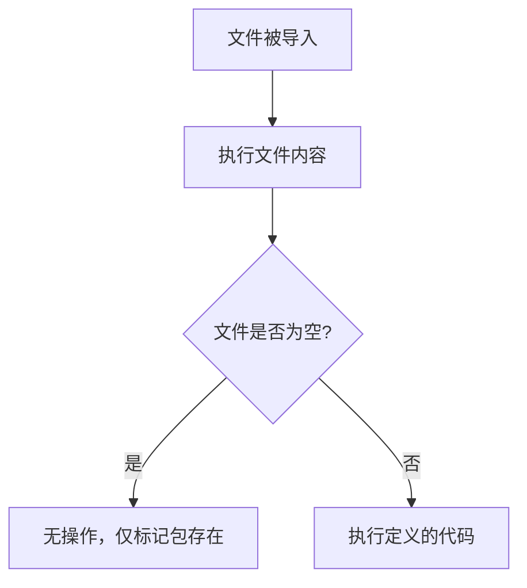

# `.\MetaGPT\metagpt\configs\__init__.py` 详细设计文档

这是一个空的Python包初始化文件，仅包含文件头注释，没有定义任何实际的代码功能。

## 整体流程



## 类结构

```
无类层次结构
```

## 全局变量及字段


    

## 全局函数及方法


## 关键组件


### 代码文件

这是一个空的Python包初始化文件，用于标识当前目录为一个Python包。


## 问题及建议


### 已知问题

-   **空文件问题**：当前 `__init__.py` 文件仅包含元信息注释，未定义任何模块级的变量、函数或类。这可能导致该包（如果这是一个包目录）在导入时无法初始化任何共享状态或暴露其子模块，从而影响包的可用性和功能完整性。

### 优化建议

-   **明确包导出**：如果此目录是一个Python包，建议在 `__init__.py` 文件中使用 `__all__` 列表来明确声明从该包中导入 `*` 时应导出的公共模块、类或函数。这有助于维护清晰的公共API。
-   **包级初始化**：考虑在 `__init__.py` 中执行必要的包级初始化代码，例如配置日志、设置默认值或导入关键的公共组件，以便用户导入包后即可使用核心功能。
-   **添加文档字符串**：为 `__init__.py` 文件添加一个模块级的文档字符串（docstring），简要说明该包的目的、主要功能和用法，提高代码的可读性和可维护性。
-   **移除冗余注释**：考虑移除或更新文件顶部的 `@Time`、`@Author`、`@File` 等注释，因为这些信息通常由版本控制系统（如Git）管理，在代码中保留可能造成信息冗余和同步问题。可以使用标准的模块文档字符串来替代。


## 其它


### 设计目标与约束

该代码文件是一个包的初始化文件（`__init__.py`），其主要设计目标是定义`metagpt`包的公共接口和初始化行为。它遵循Python包的标准结构，旨在作为包的入口点，方便用户导入和使用包内的模块。约束包括必须保持与Python包管理系统的兼容性，以及遵循项目内部的模块组织约定。

### 错误处理与异常设计

当前文件为空，未包含任何自定义的错误处理或异常定义。错误处理依赖于Python解释器的标准异常机制。未来若在此文件中添加初始化逻辑，应考虑捕获并适当处理可能发生的导入错误或初始化异常，以确保包的健壮性。

### 数据流与状态机

由于当前文件为空，不涉及任何数据处理或状态管理逻辑。它仅作为包的命名空间声明存在，不参与具体的数据流或状态转换。

### 外部依赖与接口契约

此文件本身没有显式的外部依赖。然而，它定义了`metagpt`包的根命名空间。其隐含的接口契约是：通过`import metagpt`语句，用户可以访问该包下所有通过`__all__`列表（如果定义）或常规导入方式公开的模块、类、函数和变量。目前未定义`__all__`列表，因此默认导出所有不以下划线开头的顶级名称。

### 安全与合规考虑

当前文件内容不涉及敏感操作、数据或外部资源访问，因此暂无特定的安全风险。作为最佳实践，应确保未来在此文件中添加的任何代码都遵循安全编码规范，避免引入安全漏洞。

### 测试策略

作为一个空的包初始化文件，没有需要单元测试的业务逻辑。测试重点应放在验证通过`import metagpt`能否成功导入包，以及包内预期公开的成员是否可用。这通常通过更上层的集成测试或系统测试来覆盖。

### 部署与运维

此文件是Python源代码的一部分，随包一起分发。部署时无需特殊处理。运维方面，无状态且不依赖外部配置，因此没有特定的运行时运维需求。

    