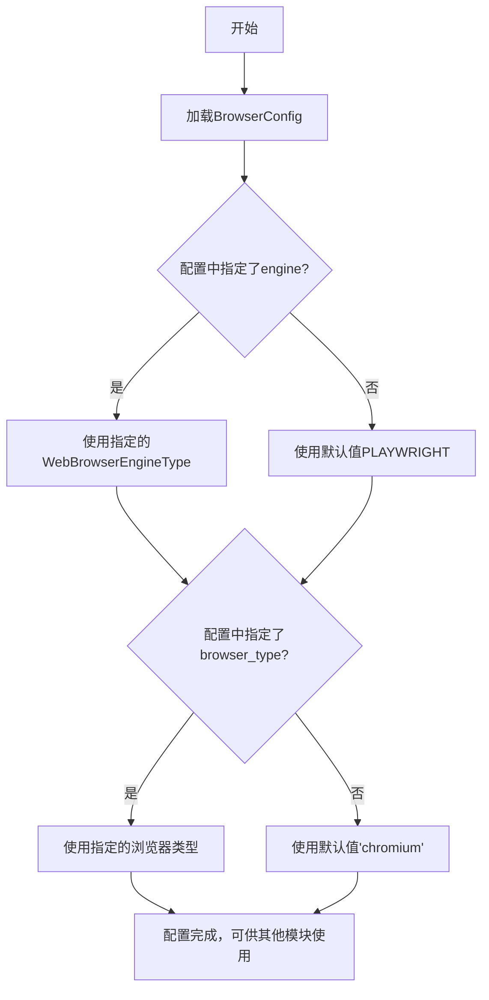

# `.\MetaGPT\metagpt\configs\browser_config.py` 详细设计文档

该文件定义了一个用于配置Web浏览器引擎及其类型的配置类。它通过枚举类定义了可用的浏览器引擎类型（如Playwright、Selenium），并提供了一个可序列化的配置模型，用于指定在自动化任务中使用的具体浏览器引擎和浏览器类型。

## 整体流程



## 类结构

```
WebBrowserEngineType (枚举类)
BrowserConfig (配置模型类)
└── 继承自 YamlModel
```

## 全局变量及字段


### `WebBrowserEngineType.PLAYWRIGHT`
    
枚举值，表示使用 Playwright 作为浏览器引擎。

类型：`WebBrowserEngineType`
    


### `WebBrowserEngineType.SELENIUM`
    
枚举值，表示使用 Selenium 作为浏览器引擎。

类型：`WebBrowserEngineType`
    


### `WebBrowserEngineType.CUSTOM`
    
枚举值，表示使用自定义的浏览器引擎。

类型：`WebBrowserEngineType`
    


### `BrowserConfig.engine`
    
配置项，指定要使用的浏览器引擎类型，默认为 PLAYWRIGHT。

类型：`WebBrowserEngineType`
    


### `BrowserConfig.browser_type`
    
配置项，指定要使用的具体浏览器类型，其有效值取决于 engine 字段的值。

类型：`Literal["chromium", "firefox", "webkit", "chrome", "firefox", "edge", "ie"]`
    
    

## 全局函数及方法


### `WebBrowserEngineType.__missing__`

`WebBrowserEngineType.__missing__` 是 Python 枚举类 `WebBrowserEngineType` 的一个特殊类方法。当尝试通过一个不存在的键（即未在枚举中定义的字符串或值）来访问枚举成员时，Python 会自动调用此方法。它的核心功能是提供一个默认的枚举成员，用于处理未知或未定义的浏览器引擎类型，从而增强代码的健壮性，避免因传入无效参数而引发 `KeyError` 异常。

参数：

-  `key`：`str`，尝试访问枚举时使用的键（名称），该键未在 `WebBrowserEngineType` 枚举中定义。

返回值：`WebBrowserEngineType`，返回 `WebBrowserEngineType.CUSTOM` 枚举成员，作为未知键的默认处理结果。

#### 流程图

```mermaid
flowchart TD
    A[调用 WebBrowserEngineType(key)] --> B{key 是否在<br>枚举定义中?}
    B -- 是 --> C[返回对应的枚举成员]
    B -- 否 --> D[自动触发 __missing__(key) 方法]
    D --> E[返回 WebBrowserEngineType.CUSTOM]
```

#### 带注释源码

```python
    @classmethod
    def __missing__(cls, key):
        """Default type conversion"""
        # 当使用一个未定义的键（如 'unknown_engine'）访问枚举时，
        # 此方法被调用，并始终返回 CUSTOM 枚举成员作为默认值。
        return cls.CUSTOM
```


## 关键组件


### WebBrowserEngineType 枚举

定义了浏览器引擎的类型，包括 PLAYWRIGHT、SELENIUM 和 CUSTOM，并提供了默认的类型转换机制。

### BrowserConfig 配置类

一个基于 YAML 模型的配置类，用于定义浏览器相关的配置项，包括使用的引擎类型和具体的浏览器类型。


## 问题及建议


### 已知问题

-   **枚举值重复**：`browser_type` 字段的 `Literal` 类型注解中，`"firefox"` 被重复定义了两次。这虽然不会导致运行时错误，但会降低代码的可读性和严谨性，可能引起混淆。
-   **枚举默认值逻辑不明确**：`WebBrowserEngineType` 枚举的 `__missing__` 方法将任何未定义的键都映射为 `CUSTOM`。虽然这提供了默认行为，但可能导致意外的类型转换，例如拼写错误（如 `"playwrigt"`）不会被捕获为错误，而是静默地转换为 `CUSTOM`，这可能掩盖了配置错误。
-   **配置验证缺失**：`BrowserConfig` 类目前仅定义了配置的结构，但没有验证 `engine` 和 `browser_type` 之间的组合是否有效（例如，当 `engine` 为 `PLAYWRIGHT` 时，`browser_type` 是否在 `["chromium", "firefox", "webkit"]` 中）。无效的组合可能在运行时导致底层库（如 Playwright 或 Selenium）抛出错误，而不是在配置加载阶段提供清晰的反馈。
-   **文档字符串不准确**：`browser_type` 的文档字符串提到 `"ie"` 是 Selenium 的有效选项。虽然 Selenium 历史上支持 Internet Explorer，但现代 Selenium 版本和 IE 浏览器本身已不再推荐或支持，此信息可能已过时。

### 优化建议

-   **清理类型注解**：移除 `browser_type` 的 `Literal` 类型注解中重复的 `"firefox"` 值。
-   **增强枚举健壮性**：考虑移除 `WebBrowserEngineType.__missing__` 方法，或将其修改为在遇到未知键时引发 `ValueError` 异常，以强制使用预定义的枚举值，提高配置的准确性。
-   **添加配置验证逻辑**：在 `BrowserConfig` 类中添加一个验证方法（例如，利用 Pydantic 的 `@validator` 装饰器，如果基类 `YamlModel` 支持的话），或在初始化后手动调用验证逻辑，以确保 `engine` 和 `browser_type` 的组合是有效的。可以定义一个映射字典（如 `VALID_COMBINATIONS = {WebBrowserEngineType.PLAYWRIGHT: ["chromium", "firefox", "webkit"], ...}`）来进行检查。
-   **更新文档**：更新 `browser_type` 的文档字符串，移除或注明 `"ie"` 是已过时或不推荐的选项，并确保其与当前支持的浏览器列表保持一致。
-   **考虑使用更严格的类型**：如果项目依赖的 Pydantic 版本支持，可以考虑使用 `Literal` 类型与 `engine` 字段进行更精细的联动（例如，使用 `Union` 类型），但这可能会使模型变得复杂。更简单的做法是在验证逻辑中实现。


## 其它


### 设计目标与约束

该模块的设计目标是提供一个灵活且类型安全的浏览器配置管理组件，用于定义和控制Web自动化测试或爬虫任务中使用的浏览器引擎及类型。主要约束包括：1) 必须支持多种浏览器引擎（如Playwright和Selenium）及其对应的浏览器类型；2) 配置应易于通过YAML文件进行序列化和反序列化；3) 类型系统应能防止无效的引擎与浏览器类型组合，并提供良好的IDE提示。

### 错误处理与异常设计

当前代码主要通过类型注解（`typing.Literal`）和枚举类（`WebBrowserEngineType`）在静态类型检查层面约束输入的有效性。`WebBrowserEngineType` 类定义了 `__missing__` 方法，当通过值查找枚举成员失败时，会默认返回 `WebBrowserEngineType.CUSTOM`，这是一种容错设计，避免了 `KeyError` 异常。然而，运行时对于无效的 `browser_type` 字符串输入（例如，为Playwright引擎传入"ie"），目前没有显式的验证或异常抛出，这依赖于上层调用代码或YAML反序列化库（如Pydantic）的行为。这是一个潜在的运行时错误风险点。

### 数据流与状态机

此配置模块本身不管理状态或复杂的数据流。它主要作为一个数据结构（Data Class）使用。典型数据流为：1) 初始化：通过代码直接实例化 `BrowserConfig` 类或从YAML文件加载配置。2) 消费：实例化后的配置对象被传递给浏览器操作类（如Playwright或Selenium的驱动类），后者读取 `engine` 和 `browser_type` 字段来初始化和控制具体的浏览器实例。整个过程中，`BrowserConfig` 对象通常是只读的。

### 外部依赖与接口契约

1.  **内部依赖**:
    *   `metagpt.utils.yaml_model.YamlModel`: 提供YAML序列化与反序列化能力。`BrowserConfig` 通过继承该类获得此功能，这是模块的核心依赖。
    *   `typing.Literal`: 用于定义 `browser_type` 字段允许的字符串字面量集合，是类型安全的关键。
    *   `enum.Enum`: 用于定义 `WebBrowserEngineType`，确保引擎类型的确定性和可读性。

2.  **接口契约**:
    *   **对调用方**：调用方应通过 `BrowserConfig` 的构造函数或 `YamlModel` 的类方法（如`from_yaml_file`）来创建配置对象。调用方需要确保传入的 `browser_type` 字符串与所选的 `engine` 兼容（例如，`engine=PLAYWRIGHT` 时，`browser_type` 应为 `"chromium"`, `"firefox"`, `"webkit"` 之一）。虽然代码注释中进行了说明，但并未在接口层面进行强制约束。
    *   **对被调用方（浏览器驱动）**：`BrowserConfig` 对象作为参数传递给浏览器驱动初始化函数。驱动函数需要能够处理 `WebBrowserEngineType` 枚举值和对应的 `browser_type` 字符串。`WebBrowserEngineType.CUSTOM` 是一个扩展点，要求驱动层能够处理自定义的浏览器引擎逻辑。

    