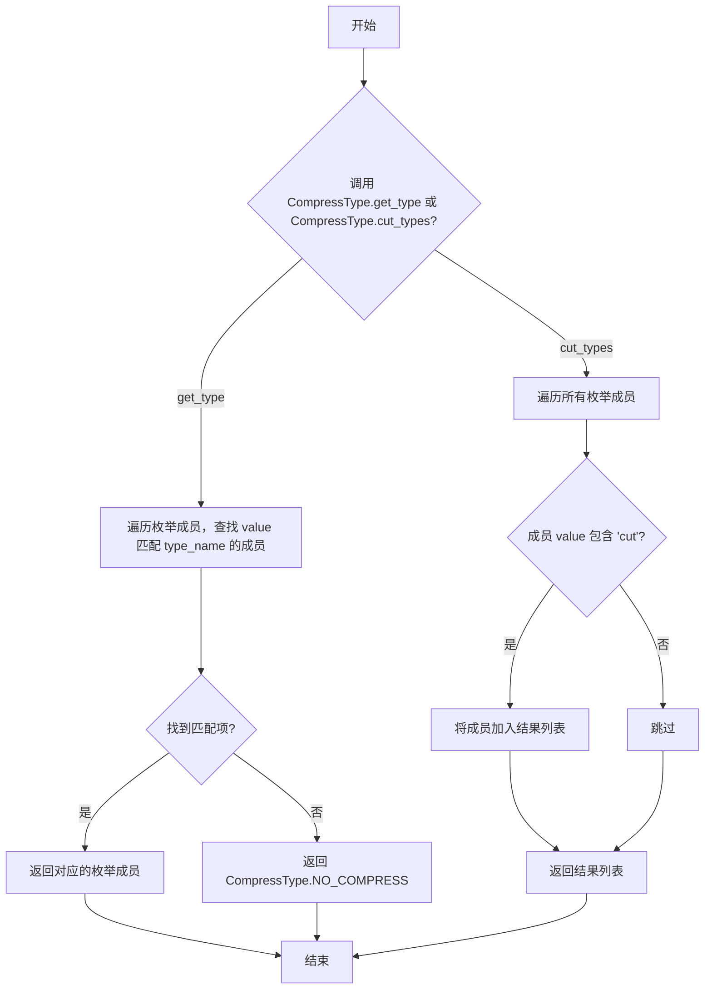
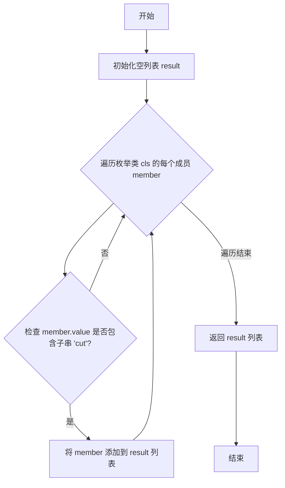

# `.\MetaGPT\metagpt\configs\compress_msg_config.py` 详细设计文档

该代码定义了一个枚举类 `CompressType`，用于表示和管理消息压缩策略的类型。它提供了多种基于消息数量或令牌数量的压缩方式，并包含辅助方法来获取和筛选特定的压缩类型。

## 整体流程



## 类结构

```
CompressType (枚举类)
├── NO_COMPRESS
├── POST_CUT_BY_MSG
├── POST_CUT_BY_TOKEN
├── PRE_CUT_BY_MSG
└── PRE_CUT_BY_TOKEN
```

## 全局变量及字段


### `CompressType.NO_COMPRESS`
    
表示不进行压缩的枚举值，默认的压缩类型。

类型：`CompressType`
    


### `CompressType.POST_CUT_BY_MSG`
    
表示按消息数量从后往前压缩的枚举值，尽可能保留最新的消息。

类型：`CompressType`
    


### `CompressType.POST_CUT_BY_TOKEN`
    
表示按令牌数量从后往前压缩的枚举值，尽可能保留最新的消息并截断最早能容纳的消息。

类型：`CompressType`
    


### `CompressType.PRE_CUT_BY_MSG`
    
表示按消息数量从前往后压缩的枚举值，尽可能保留最早的消息。

类型：`CompressType`
    


### `CompressType.PRE_CUT_BY_TOKEN`
    
表示按令牌数量从前往后压缩的枚举值，尽可能保留最早的消息并截断最新能容纳的消息。

类型：`CompressType`
    
    

## 全局函数及方法


### `CompressType.__missing__`

该方法用于处理当通过 `CompressType[key]` 方式访问枚举时，如果提供的键 `key` 不存在于已定义的枚举成员中时的行为。它是 Python `enum.Enum` 类的一个特殊方法，用于自定义枚举的“缺失键”处理逻辑。在此实现中，它确保任何未知的压缩类型字符串都会被安全地映射到默认的 `NO_COMPRESS` 枚举成员，从而提供健壮性和向后兼容性。

参数：

-  `key`：`str`，尝试访问枚举时使用的键（字符串名称），该键未在 `CompressType` 枚举中明确定义。

返回值：`CompressType`，返回 `CompressType.NO_COMPRESS` 枚举成员实例，作为未知键的默认值。

#### 流程图

```mermaid
flowchart TD
    A[调用 CompressType[key]<br>（key 未定义）] --> B[触发 __missing__(key) 方法]
    B --> C{方法逻辑}
    C --> D[返回 self.NO_COMPRESS]
    D --> E[调用者获得默认枚举值]
```

#### 带注释源码

```python
def __missing__(self, key):
    # 当通过 CompressType[some_key] 访问枚举，
    # 且 some_key 不是有效的枚举成员名称时，此方法被调用。
    # 参数 `key` 是传入的无效键（字符串）。
    # 此实现始终返回默认的“无压缩”枚举成员，
    # 确保代码在遇到未知压缩类型时不会抛出 KeyError，
    # 而是优雅地降级到默认行为。
    return self.NO_COMPRESS
```


### `CompressType.get_type`

这是一个类方法，用于根据给定的压缩类型名称字符串，查找并返回对应的 `CompressType` 枚举成员。如果未找到匹配项，则返回默认的 `CompressType.NO_COMPRESS`。

参数：

-  `type_name`：`str`，表示压缩类型的字符串名称。

返回值：`CompressType`，与输入字符串匹配的枚举成员，若未找到则返回 `CompressType.NO_COMPRESS`。

#### 流程图

```mermaid
flowchart TD
    A[开始: get_type(type_name)] --> B{遍历枚举成员};
    B --> C[获取下一个成员 member];
    C --> D{member.value == type_name?};
    D -- 是 --> E[返回 member];
    D -- 否 --> B;
    B -- 遍历结束 --> F[返回 cls.NO_COMPRESS];
    E --> G[结束];
    F --> G;
```

#### 带注释源码

```python
    @classmethod
    def get_type(cls, type_name):
        # 遍历 CompressType 枚举的所有成员
        for member in cls:
            # 检查当前枚举成员的值（字符串）是否与输入参数 type_name 相等
            if member.value == type_name:
                # 如果相等，则找到匹配项，返回该枚举成员
                return member
        # 如果遍历完所有成员都未找到匹配项，则返回默认的“无压缩”枚举成员
        return cls.NO_COMPRESS
```


### `CompressType.cut_types`

这是一个类方法，用于获取所有包含“cut”字符串的压缩类型枚举成员。它用于筛选出所有支持“裁剪”操作的压缩策略类型。

参数：
-  `cls`：`class`，指向`CompressType`枚举类本身的引用。

返回值：`list[CompressType]`，一个列表，包含所有`value`属性中包含子字符串“cut”的`CompressType`枚举成员。

#### 流程图



#### 带注释源码

```python
    @classmethod
    def cut_types(cls):
        # 使用列表推导式，遍历枚举类 cls 的所有成员 (member)
        # 对于每个成员，检查其值 (member.value) 是否包含子字符串 "cut"
        # 如果包含，则将该成员加入到返回的列表中
        return [member for member in cls if "cut" in member.value]
```


## 关键组件


### CompressType 枚举类

定义了消息压缩策略的类型，用于在超出令牌限制时对消息列表进行压缩，支持无压缩、基于消息数量的前后裁剪以及基于令牌数量的前后裁剪等多种策略。

### 枚举成员 (Enum Members)

定义了具体的压缩类型常量，包括无压缩、后向消息裁剪、后向令牌裁剪、前向消息裁剪和前向令牌裁剪，每个成员都有一个对应的字符串值用于标识。

### `__missing__` 方法

当通过键（如字符串）访问枚举成员失败时，提供默认值 `NO_COMPRESS`，增强了枚举的容错性。

### `get_type` 类方法

根据给定的类型名称（字符串）查找并返回对应的 `CompressType` 枚举成员，如果未找到则返回默认的 `NO_COMPRESS`。

### `cut_types` 类方法

返回一个列表，包含所有值中包含 "cut" 子串的枚举成员，即所有有效的裁剪（压缩）策略类型。


## 问题及建议


### 已知问题

-   **枚举成员 `NO_COMPRESS` 的值与 `__missing__` 方法存在逻辑冲突**：`NO_COMPRESS` 的值为空字符串 `""`。`__missing__` 方法被定义为当通过键（如 `CompressType["invalid_key"]`）访问不存在的枚举成员时，返回 `self.NO_COMPRESS`。然而，`__missing__` 方法在通过值（如 `CompressType("invalid_value")`）访问时不会被调用。这可能导致开发者对错误处理行为的误解，认为通过无效值调用也会返回默认值，但实际会抛出 `ValueError` 异常。
-   **`__missing__` 方法可能引发 `AttributeError`**：在 `__missing__` 方法内部，`self` 指向的是枚举类 `CompressType` 本身。访问 `self.NO_COMPRESS` 在类级别是有效的。然而，标准的 `Enum.__missing__` 方法签名通常接收 `cls` 和 `key` 参数。虽然当前实现能工作，但使用 `cls.NO_COMPRESS` 或 `cls(cls.NO_COMPRESS)` 会更符合惯例且更清晰，避免潜在的混淆。
-   **`get_type` 类方法的效率可以优化**：该方法通过遍历所有枚举成员来查找匹配的值。对于枚举成员数量固定的情况，这通常不是问题。但可以构建一个值到成员的映射缓存（例如在类初始化时），将查找时间复杂度从 O(n) 降低到 O(1)，以提升性能，尤其是在高频调用的场景下。
-   **`cut_types` 类方法的实现存在潜在风险**：该方法通过检查字符串 `"cut"` 是否在成员值中来筛选成员。如果未来新增的压缩类型值包含 `"cut"` 但并非实际的“剪切”类型（例如，一个名为 `"discut"` 的值），它会被错误地包含在结果中。这依赖于命名约定，不够健壮。更好的做法是使用一个明确的属性（如类变量或装饰器）来标记是否为剪切类型。

### 优化建议

-   **重构 `__missing__` 方法并明确错误处理策略**：
    1.  将 `__missing__` 方法改为接收 `cls` 和 `key` 参数，并使用 `cls(cls.NO_COMPRESS)` 返回默认枚举实例。
    2.  考虑是否也需要处理通过无效值访问的情况。如果需要，可以重写 `_missing_` 方法（注意是单下划线），但更常见的做法是提供一个独立的工具函数或修改 `get_type` 方法来统一处理键和值的查找，并返回默认值。
-   **优化 `get_type` 方法的查找性能**：在类中定义一个类变量 `_value_to_member_map`，在类初始化后（例如在模块加载时或使用元类）构建一个从 `value` 到 `member` 的字典。`get_type` 方法可以直接从这个字典中查找，未找到时返回 `cls.NO_COMPRESS`。
-   **增强 `cut_types` 方法的健壮性**：为枚举类定义一个类属性（如 `_CUT_TYPE_VALUES`）来显式列出所有剪切类型的值。`cut_types` 方法可以基于这个列表来生成结果。或者，为每个枚举成员添加一个布尔属性（例如通过自定义枚举类或使用 `enum` 模块的 `flag` 或 `property`），`cut_types` 方法根据该属性进行筛选。
-   **考虑使用 `StrEnum` (Python 3.11+) 或 `auto()`**：如果项目使用 Python 3.11 或更高版本，可以考虑让 `CompressType` 继承自 `enum.StrEnum`，这样可以获得更好的字符串表示和比较支持。对于不需要特定字符串值的成员（如 `NO_COMPRESS`），可以使用 `enum.auto()` 自动生成值，以减少硬编码。
-   **添加类型注解**：为类方法和函数参数、返回值添加类型注解，可以提高代码的可读性和工具支持（如 IDE 自动补全、静态类型检查器 mypy）。
-   **补充文档字符串**：虽然已有基础文档，但可以为 `__missing__`、`get_type`、`cut_types` 方法添加详细的文档字符串，说明其用途、参数、返回值和可能的行为（特别是错误处理）。


## 其它


### 设计目标与约束

该代码的设计目标是定义一个枚举类 `CompressType`，用于表示消息压缩的类型。这些类型主要用于在消息长度超过令牌限制时，提供不同的压缩策略。设计约束包括：必须支持无压缩的默认类型，提供多种基于消息数量或令牌数量的压缩策略，并确保枚举类型能够处理未知的键值，返回默认的无压缩类型。此外，代码需要提供便捷的方法来根据类型名称获取对应的枚举成员，并筛选出所有包含“cut”的压缩类型。

### 错误处理与异常设计

代码中的错误处理主要通过 `__missing__` 方法实现，当访问不存在的枚举键时，自动返回 `NO_COMPRESS` 作为默认值，避免引发 `KeyError` 异常。`get_type` 类方法在未找到匹配的类型名称时，同样返回 `NO_COMPRESS`，确保方法的健壮性。整体设计倾向于静默处理未知类型，而不是抛出异常，这简化了调用方的错误处理逻辑，但可能掩盖了潜在的类型错误。

### 数据流与状态机

`CompressType` 枚举类本身不涉及复杂的数据流或状态机。它主要作为静态的类型定义，供其他模块使用。数据流通常从调用方传入类型名称或枚举键，通过 `get_type` 方法或直接访问枚举成员，返回对应的 `CompressType` 实例。状态机不适用，因为枚举值是固定的，不随程序运行而改变。

### 外部依赖与接口契约

该代码没有外部依赖，完全基于 Python 标准库中的 `enum` 模块。接口契约包括：枚举类提供预定义的压缩类型常量，`__missing__` 方法确保未知键的默认处理，`get_type` 方法允许通过字符串名称获取枚举成员，`cut_types` 类方法返回所有包含“cut”的压缩类型列表。调用方应使用这些接口来安全地操作压缩类型。

### 测试策略与用例

测试应覆盖以下场景：验证所有枚举常量的值和描述是否正确；测试 `__missing__` 方法对未知键的处理，确保返回 `NO_COMPRESS`；测试 `get_type` 方法对已知和未知类型名称的返回结果；验证 `cut_types` 方法返回的列表是否包含所有预期的压缩类型。单元测试应使用 Python 的 `unittest` 或 `pytest` 框架，确保代码的可靠性和可维护性。

### 性能考虑与优化

由于 `CompressType` 是简单的枚举类，性能开销极小。`get_type` 方法使用线性搜索遍历枚举成员，在枚举成员数量较少时效率可接受。如果未来枚举成员大幅增加，可考虑使用字典映射来优化查找性能。`cut_types` 方法每次调用都会生成新列表，若频繁调用且枚举不变，可缓存结果以提升性能。整体上，当前实现已满足性能要求，优化空间有限。

### 安全与合规性

该代码不涉及敏感数据处理、网络通信或文件操作，因此安全风险较低。合规性方面，代码遵循 Python 的编码规范，使用枚举提高可读性和类型安全性。枚举值的定义清晰，避免了魔法字符串的使用，减少了运行时错误。没有外部依赖，避免了第三方库的安全漏洞风险。整体设计符合软件工程的最佳实践。

### 部署与配置

`CompressType` 作为纯 Python 代码，部署简单，无需额外配置。它应作为项目内部模块的一部分，随主代码一起打包和分发。由于没有外部依赖，兼容性高，可在任何支持 Python 3.6+ 的环境中运行。配置方面，压缩类型的选择应由上层业务逻辑决定，该枚举类仅提供类型定义，不涉及运行时配置。

### 监控与日志

该代码本身不包含监控或日志功能。在实际使用中，建议调用方在关键操作（如压缩类型选择、未知类型处理）处添加日志记录，以便跟踪和调试。例如，当 `get_type` 方法返回默认的 `NO_COMPRESS` 时，可记录警告日志，提示可能存在未预期的类型名称。监控应关注使用压缩类型的模块的性能和错误率。

### 扩展性与维护性

`CompressType` 枚举类设计具有良好的扩展性。新增压缩类型只需添加新的枚举成员，并确保 `__missing__` 和 `get_type` 方法能正确处理。`cut_types` 方法自动包含新添加的含“cut”的类型，无需修改。维护性方面，代码结构清晰，注释详细，便于理解和修改。建议在添加新类型时更新类文档字符串，保持文档同步。

### 兼容性与版本管理

代码基于 Python 标准库，兼容性高。枚举类使用 `Enum` 基类，要求 Python 3.4+。`__missing__` 方法在 Python 3.6+ 中行为稳定。版本管理应遵循语义化版本控制，当添加新的压缩类型时，视为小版本更新（如 1.1.0）；修改现有类型的行为或接口时，视为主要版本更新（如 2.0.0）。变更应在 `CHANGELOG` 中记录。

### 文档与示例

类文档字符串已详细描述了每种压缩类型的含义。建议补充使用示例，展示如何获取枚举成员、处理未知类型以及使用 `cut_types` 方法。例如：`CompressType.get_type("post_cut_by_msg")` 返回 `POST_CUT_BY_MSG`；`CompressType["UNKNOWN"]` 返回 `NO_COMPRESS`。文档应作为项目 API 文档的一部分，供开发者参考。

### 国际化与本地化

当前代码不涉及用户界面或文本输出，因此无需国际化（i18n）或本地化（l10n）支持。枚举值的描述为英文，清晰且符合技术文档惯例。如果未来需要支持多语言，可考虑将描述字符串提取为资源文件，但鉴于其技术性，英文描述通常已足够。暂无本地化需求。

### 法律与许可

该代码为原创实现，不包含第三方代码片段，因此无外部许可要求。项目应明确其自身的开源许可证（如 MIT、Apache 2.0），并在文件头或项目根目录的 `LICENSE` 文件中声明。使用该代码的开发者需遵守相应许可证条款。无专利或商标问题。

### 用户培训与支持

由于是内部工具类，用户主要为开发人员。培训应关注枚举的使用方法、压缩类型的含义以及错误处理机制。支持可通过内部文档、代码注释和示例进行。对于常见问题（如未知类型处理），应在文档中明确说明。无需最终用户培训。

### 灾难恢复与备份

`CompressType` 作为代码文件，应随项目代码一起进行版本控制（如 Git），确保有完整的变更历史。备份策略遵循项目的整体备份方案，通常通过版本控制系统和定期服务器备份实现。灾难恢复时，从版本库中恢复代码文件即可。无独立的数据或状态需要备份。

### 成本与资源估算

该代码资源消耗极低，不涉及计算、存储或网络成本。开发成本已包含在项目初期设计中。维护成本低，仅当新增压缩类型时需要少量修改。无需额外的服务器、数据库或云资源。成本可忽略不计。

### 风险评估与缓解

主要风险是调用方错误使用压缩类型，导致未预期的压缩行为。缓解措施包括：提供清晰的文档和示例；在 `get_type` 方法中记录未知类型的警告；上层业务逻辑应验证类型有效性。另一风险是未来扩展时破坏现有接口，可通过完整的单元测试和版本管理来缓解。整体风险较低。

### 技术选型理由

选择 Python 标准库的 `enum` 模块是因为它提供了类型安全的枚举实现，优于使用字符串常量或字典。`Enum` 支持迭代、比较和序列化，且 `__missing__` 方法允许自定义缺失键的处理，非常适合本场景。未选择第三方枚举库，以保持依赖最小化和兼容性。技术选型合理且成熟。

### 代码风格与规范

代码遵循 PEP 8 风格指南：使用 4 空格缩进、类名使用 `CamelCase`、常量使用 `UPPER_CASE`、文档字符串清晰。枚举成员的定义顺序合理，先默认值后具体类型。方法命名具有描述性（如 `get_type`、`cut_types`）。整体代码风格一致，可读性强。建议使用 `black` 或 `flake8` 工具自动化格式化检查。

### 集成与构建

该代码作为独立模块，易于集成到任何 Python 项目中。构建过程无需特殊步骤，只需确保 Python 环境已安装。如果项目使用 `setuptools` 或 `poetry` 打包，该文件应包含在包模块列表中。集成测试应验证其与其他模块（如消息压缩逻辑）的协作。构建和集成简单直接。

### 发布与分发

发布随项目整体版本进行。分发可通过 PyPI（如果项目是库）或内部包仓库。作为纯 Python 文件，兼容性强，无需编译。发布前应运行单元测试确保质量。版本号遵循语义化版本控制。分发渠道取决于项目需求，无特殊要求。

### 社区与生态

`CompressType` 是项目特定枚举，不直接关联外部社区或生态。但基于 Python `enum` 的标准做法，与其他使用枚举的 Python 项目有共通性。可参考 `enum` 官方文档和社区最佳实践来改进。无特定的社区支持需求。

### 未来展望与路线图

未来可能根据业务需求新增压缩类型，如基于语义的压缩或混合策略。路线图可包括：优化 `get_type` 方法的查找性能（如需）；添加更多工具方法，如验证类型是否有效；考虑与配置系统集成，允许动态加载压缩类型。长期保持代码的简洁和可扩展性。


    