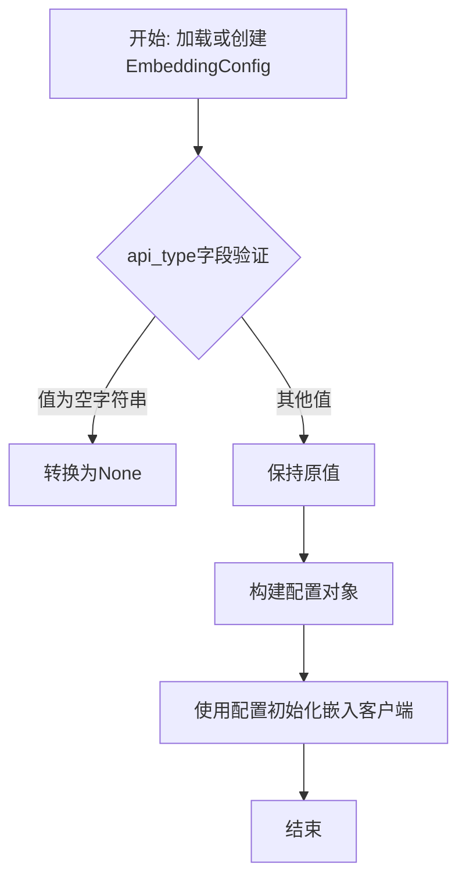
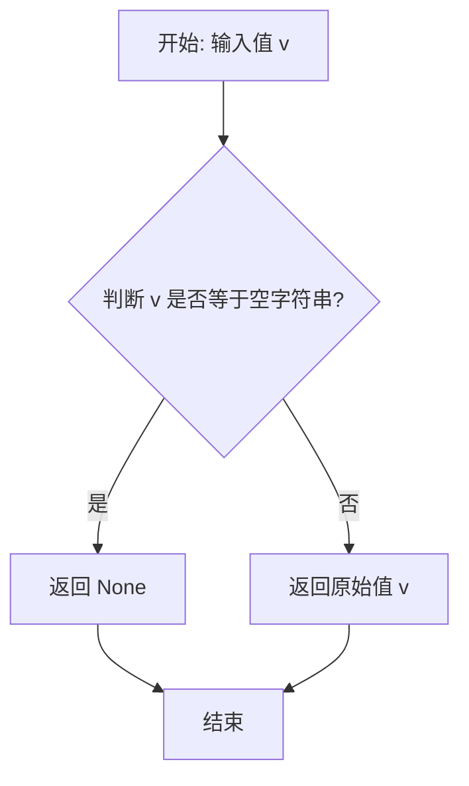

# `.\MetaGPT\metagpt\configs\embedding_config.py` 详细设计文档

该文件定义了一个用于配置不同嵌入模型（如OpenAI、Azure、Gemini、Ollama）的Pydantic数据模型。它通过枚举类型EmbeddingType指定支持的API类型，并通过EmbeddingConfig类封装了各种API所需的通用和特定配置参数（如API密钥、基础URL、模型名称、批次大小和输出维度），同时提供了YAML序列化/反序列化能力和字段验证逻辑。

## 整体流程



## 类结构

```
EmbeddingType (枚举类)
EmbeddingConfig (配置模型类)
└── YamlModel (父类，提供YAML支持)
```

## 全局变量及字段


### `OPENAI`
    
表示使用 OpenAI 的嵌入模型类型

类型：`EmbeddingType`
    


### `AZURE`
    
表示使用 Azure OpenAI 的嵌入模型类型

类型：`EmbeddingType`
    


### `GEMINI`
    
表示使用 Google Gemini 的嵌入模型类型

类型：`EmbeddingType`
    


### `OLLAMA`
    
表示使用 Ollama 本地模型的嵌入模型类型

类型：`EmbeddingType`
    


### `EmbeddingConfig.api_type`
    
指定使用的嵌入服务提供商类型

类型：`Optional[EmbeddingType]`
    


### `EmbeddingConfig.api_key`
    
用于访问嵌入服务的 API 密钥

类型：`Optional[str]`
    


### `EmbeddingConfig.base_url`
    
嵌入服务的 API 基础 URL 地址

类型：`Optional[str]`
    


### `EmbeddingConfig.api_version`
    
API 版本号，主要用于 Azure OpenAI 服务

类型：`Optional[str]`
    


### `EmbeddingConfig.model`
    
指定使用的具体嵌入模型名称

类型：`Optional[str]`
    


### `EmbeddingConfig.embed_batch_size`
    
嵌入处理的批量大小，用于优化性能

类型：`Optional[int]`
    


### `EmbeddingConfig.dimensions`
    
嵌入模型的输出向量维度

类型：`Optional[int]`
    
    

## 全局函数及方法


### `EmbeddingConfig.check_api_type`

这是一个用于验证和预处理 `api_type` 字段的 Pydantic 字段验证器。它在数据被正式验证和赋值给 `api_type` 字段之前运行，主要目的是处理空字符串输入，将其转换为 `None`，以确保数据模型的内部一致性。

参数：
-  `v`：`Any`，待验证的原始输入值。

返回值：`Any`，处理后的值。如果输入是空字符串，则返回 `None`；否则原样返回输入值。

#### 流程图



#### 带注释源码

```
@field_validator("api_type", mode="before")  # 这是一个Pydantic字段验证器，作用于`api_type`字段，模式为`before`（在类型转换和标准验证之前执行）
@classmethod                               # 声明为类方法
def check_api_type(cls, v):                # 定义验证方法，`cls`是类本身，`v`是传入的原始值
    if v == "":                            # 检查传入的值是否为空字符串
        return None                        # 如果是空字符串，则返回None
    return v                               # 如果不是空字符串，则原样返回该值
```


## 关键组件


### EmbeddingType 枚举

定义了支持的嵌入模型服务提供商类型，包括 OpenAI、Azure、Gemini 和 Ollama，用于在配置中明确指定所使用的后端服务。

### EmbeddingConfig 配置类

一个基于 Pydantic 和 YamlModel 的配置数据模型，用于集中管理和验证不同嵌入服务（如 OpenAI, Azure, Gemini, Ollama）的连接与参数配置。

### YamlModel 基类

作为 EmbeddingConfig 的父类，提供了从 YAML 格式文件加载配置数据并序列化为 Python 对象的能力，简化了配置管理。

### field_validator 验证器

用于对 EmbeddingConfig 类中的字段（如 `api_type`）进行输入验证和预处理，确保数据的有效性和一致性，例如将空字符串转换为 None。


## 问题及建议


### 已知问题

-   **字段验证逻辑不完整**：`@field_validator` 仅处理了 `api_type` 字段为空字符串的情况，将其转换为 `None`。然而，对于其他可选字段（如 `api_key`, `base_url` 等），如果传入空字符串，它们将保持为空字符串而非 `None`，这可能与 `Optional` 类型的预期行为不一致，导致下游逻辑需要额外处理空字符串和 `None` 两种“空值”状态。
-   **配置验证缺失**：当前配置模型缺乏对配置项之间依赖关系和有效性的运行时验证。例如，当 `api_type` 为 `azure` 时，`base_url` 和 `api_version` 应为必填项；当 `api_type` 为 `openai` 时，`api_key` 应为必填项。缺少此类验证可能导致创建了无效或不完整的配置对象，从而在后续使用嵌入功能时引发运行时错误。
-   **枚举值映射风险**：`EmbeddingType` 枚举的值（如 `"openai"`）作为字符串被用于配置。`@field_validator` 在 `mode="before"` 下将空字符串转为 `None`，但 Pydantic 可能无法自动将有效的字符串值（如 `"openai"`）正确转换为 `EmbeddingType.OPENAI` 枚举实例，除非有进一步的验证或转换逻辑。这依赖于 Pydantic 的默认行为，可能存在隐式转换失败的风险。
-   **示例文档与实际字段不匹配**：类文档字符串中的示例显示 `dimensions` 字段被引号包围（如 `dimensions: "YOUR_MODEL_DIMENSIONS"`），但 `dimensions` 字段的类型是 `Optional[int]`。这会在用户参考示例时造成误导，可能导致配置错误（传递字符串导致验证失败）。

### 优化建议

-   **增强字段验证**：为所有 `Optional[str]` 类型的字段（如 `api_key`, `base_url`, `model` 等）添加类似的 `@field_validator`，将空字符串统一转换为 `None`，确保数据一致性。例如：
    ```python
    @field_validator("api_key", "base_url", "model", "api_version", mode="before")
    @classmethod
    def empty_str_to_none(cls, v):
        if v == "":
            return None
        return v
    ```
-   **添加配置完整性验证**：实现一个 `@model_validator(mode='after')` 方法来检查配置的完整性和一致性。根据 `api_type` 的值，验证必需字段是否已提供。例如，当 `api_type` 为 `EmbeddingType.AZURE` 时，确保 `api_key`, `base_url`, 和 `api_version` 不为 `None`。
-   **明确枚举转换**：考虑在 `api_type` 的验证器中，除了处理空字符串，也确保传入的字符串能正确转换为 `EmbeddingType` 枚举。或者，依赖 Pydantic 的严格模式（`strict=True`）并确保输入是有效的枚举成员，但这可能要求前端传递枚举实例而非字符串。更务实的做法是在验证器中添加尝试转换的逻辑，并提供清晰的错误信息。
-   **修正示例文档**：更新类文档字符串中的示例，确保 `dimensions` 字段的示例值是一个整数（如 `dimensions: 1536`），而不是字符串，以准确反映其 `int` 类型，避免用户混淆。
-   **考虑使用 `Field` 提供默认值或描述**：使用 Pydantic 的 `Field` 函数为字段提供默认值、描述或约束条件（如 `gt=0` 对于 `dimensions`），这能提升配置模型的自我描述性和健壮性。例如，为 `embed_batch_size` 设置一个合理的默认值。
-   **提取常量或配置映射**：考虑将不同 `api_type` 对应的必需字段列表、默认 `base_url` 等定义为类常量或配置字典，使验证逻辑更清晰、易于维护和扩展。


## 其它


### 设计目标与约束

本模块的设计目标是提供一个灵活、可扩展的配置类，用于管理不同供应商（OpenAI, Azure, Gemini, Ollama）的文本嵌入（Embedding）服务连接参数。其核心约束包括：
1.  **向后兼容性**：作为 `YamlModel` 的子类，必须支持从YAML配置文件进行序列化和反序列化。
2.  **供应商中立性**：通过 `EmbeddingType` 枚举和可选字段，结构上支持多种嵌入服务API，避免与特定供应商的实现强耦合。
3.  **配置灵活性**：所有配置字段均为可选（`Optional`），允许用户仅提供特定供应商所需的参数，并支持运行时动态修改。
4.  **数据验证**：利用 Pydantic 提供基础类型验证，并通过自定义验证器（如 `check_api_type`）处理边界情况（如空字符串）。

### 错误处理与异常设计

当前模块的错误处理主要依赖于 Pydantic 模型的内置验证机制：
1.  **类型验证错误**：如果提供的配置值不符合声明的类型（例如，`dimensions` 字段传入字符串），Pydantic 将抛出 `ValidationError`。
2.  **枚举值验证**：`api_type` 字段被定义为 `EmbeddingType` 枚举，传入非枚举值将触发 `ValidationError`。
3.  **自定义验证器**：`check_api_type` 验证器在“before”模式下运行，将空字符串 `""` 转换为 `None`，这是一种静默处理，旨在提高配置文件的容错性，但可能掩盖配置错误。
**潜在改进**：可增加更严格的业务逻辑验证，例如当 `api_type` 为 `AZURE` 时，强制要求 `base_url` 和 `api_version` 字段非空，并抛出更具描述性的自定义异常。

### 数据流与状态机

本模块作为静态配置模型，不涉及运行时状态机。其数据流是单向的：
1.  **初始化/加载**：数据从外部源（YAML文件、字典、环境变量）流入，通过 Pydantic 解析和验证，填充到 `EmbeddingConfig` 类的实例字段中。
2.  **使用**：初始化后的配置实例作为一个只读（或可修改）的数据容器，被其他组件（如嵌入客户端工厂或具体实现类）访问，以获取连接参数。
3.  **持久化**：配置实例可以通过父类 `YamlModel` 的方法（如 `yaml`/`dict`）序列化，输出到YAML字符串或字典，完成数据的写出。

### 外部依赖与接口契约

1.  **外部依赖**：
    *   **Pydantic**：用于数据模型定义、字段验证和序列化/反序列化。版本需兼容 `field_validator` 装饰器。
    *   **`metagpt.utils.yaml_model.YamlModel`**：项目内部的基类，提供了与YAML格式交互的特定方法。`EmbeddingConfig` 的序列化能力依赖于该父类的实现。
2.  **接口契约**：
    *   **对上游（配置提供者）**：承诺可以接受符合字段定义的字典、YAML字符串或文件路径，并返回一个有效的 `EmbeddingConfig` 实例。
    *   **对下游（配置消费者）**：承诺提供一个包含 `api_type`, `api_key`, `base_url` 等字段的对象。消费者需要检查所需字段是否存在（是否为 `None`），并根据 `api_type` 选择正确的参数组合。文档字符串中的示例是此契约的重要组成部分。

### 安全与合规考虑

1.  **敏感信息处理**：`api_key` 字段用于存储认证密钥，属于敏感信息。当前模型未内置任何混淆或加密逻辑。在实际使用中，应确保：
    *   包含此配置的YAML文件不被提交至版本控制系统。
    *   在日志记录或调试信息中，该字段应被自动脱敏（例如，显示为`***`）。
2.  **配置来源安全**：模块本身不负责验证配置来源的可靠性（如文件权限、网络传输安全）。这应由加载配置的上级调用方保证。

    