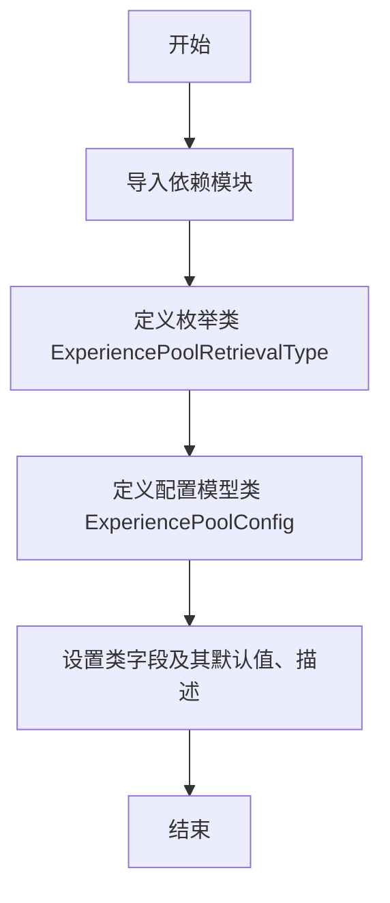

# `.\MetaGPT\metagpt\configs\exp_pool_config.py` 详细设计文档

该代码定义了一个用于配置和管理经验池（Experience Pool）的模块，包含一个枚举类用于指定检索类型，以及一个基于Pydantic和YAML的配置模型类，用于控制经验池的启用状态、读写权限、持久化路径、检索算法等核心参数。

## 整体流程



## 类结构

```
ExperiencePoolRetrievalType (枚举类)
ExperiencePoolConfig (配置模型类，继承自YamlModel)
```

## 全局变量及字段


### `ExperiencePoolRetrievalType.BM25`
    
枚举值，表示使用BM25算法进行经验池检索。

类型：`ExperiencePoolRetrievalType`
    


### `ExperiencePoolRetrievalType.CHROMA`
    
枚举值，表示使用Chroma向量数据库进行经验池检索。

类型：`ExperiencePoolRetrievalType`
    


### `ExperiencePoolConfig.enabled`
    
总开关，用于启用或禁用整个经验池功能。当禁用时，读写操作均无效。

类型：`bool`
    


### `ExperiencePoolConfig.enable_read`
    
控制是否允许从经验池中读取数据。

类型：`bool`
    


### `ExperiencePoolConfig.enable_write`
    
控制是否允许向经验池中写入数据。

类型：`bool`
    


### `ExperiencePoolConfig.persist_path`
    
经验池数据持久化存储的本地文件系统路径。

类型：`str`
    


### `ExperiencePoolConfig.retrieval_type`
    
指定经验池使用的检索算法或后端类型，如BM25或Chroma。

类型：`ExperiencePoolRetrievalType`
    


### `ExperiencePoolConfig.use_llm_ranker`
    
标志位，指示是否使用大语言模型对检索结果进行重排序以提升结果质量。

类型：`bool`
    


### `ExperiencePoolConfig.collection_name`
    
在Chroma向量数据库中用于存储经验池数据的集合名称。

类型：`str`
    
    

## 全局函数及方法


## 关键组件


### ExperiencePoolRetrievalType 枚举

定义了经验池支持的两种检索类型：基于关键词匹配的 BM25 算法和基于向量相似度的 Chroma 向量数据库检索。

### ExperiencePoolConfig 配置类

一个基于 Pydantic 和 YAML 的配置模型，用于集中管理经验池（Experience Pool）的各项功能开关、存储路径、检索策略等运行时参数。


## 问题及建议


### 已知问题

-   **配置项之间存在逻辑依赖，但缺乏验证**：`enabled` 字段控制总开关，`enable_read` 和 `enable_write` 控制读写开关。当 `enabled=False` 时，读写开关理论上应失效，但代码层面没有强制约束或逻辑验证，可能导致配置不一致或误解。
-   **持久化路径默认值可能导致数据丢失或冲突**：`persist_path` 的默认值为 `".chroma_exp_data"`，这是一个相对路径。在不同工作目录下运行程序可能导致数据存储位置不一致，或在部署时无意中覆盖数据。
-   **检索类型与集合名称的潜在不匹配**：`retrieval_type` 默认使用 `BM25`，但 `collection_name` 的默认值 `"experience_pool"` 暗示了与 `CHROMA` 检索类型的关联（ChromaDB 使用集合）。当使用 BM25 检索时，`collection_name` 字段可能未被使用，造成字段冗余或混淆。
-   **枚举值命名可能引起混淆**：`ExperiencePoolRetrievalType.CHROMA` 的命名直接使用了底层数据库名称，而非更通用的检索方法描述（如 `VECTOR` 或 `SIMILARITY`），这降低了抽象层级，将实现细节暴露给了配置。

### 优化建议

-   **增加配置逻辑验证**：在 `ExperiencePoolConfig` 类中添加一个 `@validator` 方法（如果使用 Pydantic v1）或 `@field_validator` 方法（如果使用 Pydantic v2），以确保当 `enabled=False` 时，`enable_read` 和 `enable_write` 自动被设置为 `False`，并在配置加载时给出明确提示或警告。
-   **将持久化路径默认值设为绝对路径或由环境变量控制**：建议将 `persist_path` 的默认值改为基于项目根目录的绝对路径（如 `os.path.join(PROJECT_ROOT, '.chroma_exp_data')`），或允许通过环境变量（如 `METAGPT_EXP_POOL_PATH`）进行覆盖，以提高部署的灵活性和数据安全性。
-   **解耦检索类型与存储配置**：考虑将配置拆分为更独立的模块。例如，可以有一个 `RetrievalConfig` 类专门管理检索相关设置（类型、LLM排序器等），而 `StorageConfig` 类管理持久化路径和集合名称。或者，为 `CHROMA` 类型添加一个嵌套的 `ChromaConfig` 模型来包含 `collection_name` 等专属字段。
-   **优化枚举命名以提高可读性和可维护性**：将 `ExperiencePoolRetrievalType.CHROMA` 重命名为更具语义和通用性的名称，如 `VECTOR` 或 `SEMANTIC`。同时，可以保留一个 `chroma` 作为其值（`VECTOR = "chroma"`），这样既明确了方法类型，又保持了与后端实现的映射关系。
-   **考虑添加配置版本管理**：作为 `YamlModel` 的扩展，可以考虑引入一个 `version` 字段，以便在未来配置结构发生重大变更时，能够平滑地进行迁移和兼容性处理。


## 其它


### 设计目标与约束

本模块的设计目标是提供一个可配置的经验池（Experience Pool）管理组件，用于在智能体系统中存储和检索历史经验。其核心约束包括：1. 提供灵活的启用/禁用开关，以控制经验池的整体行为；2. 支持读写操作的独立控制；3. 支持多种检索后端（如BM25、ChromaDB），并允许配置持久化路径和集合名称；4. 集成LLM重排序器以优化检索结果；5. 通过Pydantic模型和YAML序列化实现配置的强类型定义、验证及持久化。

### 错误处理与异常设计

当前代码主要定义了配置模型，未包含显式的运行时错误处理逻辑。潜在的异常场景包括：1. 当`enabled=False`但尝试进行读写操作时，调用方应处理此无效状态；2. 配置字段（如`persist_path`）的值无效时，Pydantic会在模型实例化时抛出`ValidationError`；3. 依赖的检索后端（如ChromaDB）服务不可用或`persist_path`权限不足时，可能抛出连接或IO异常。建议在调用此配置的客户端代码中，对Pydantic验证错误和外部依赖操作进行适当的`try-except`捕获与处理。

### 数据流与状态机

本模块作为配置定义，不直接管理数据流或实现状态机。其定义的状态由`ExperiencePoolConfig`实例的字段值决定：1. **全局开关**：`enabled`字段控制经验池功能是否激活。2. **读写状态**：`enable_read`和`enable_write`字段在`enabled=True`的前提下，分别独立控制读、写功能的启用。3. **检索模式**：`retrieval_type`字段决定使用BM25（内存检索）或ChromaDB（向量数据库检索）。数据流由使用此配置的外部组件驱动，通常为：写入时，经验数据根据`enable_write`和`persist_path`等设置被存储；读取时，根据`enable_read`、`retrieval_type`和`use_llm_ranker`等设置进行检索与结果重排序。

### 外部依赖与接口契约

1.  **外部依赖**：
    *   `pydantic`: 用于数据验证、序列化及设置管理。
    *   `metagpt.utils.yaml_model.YamlModel`: 项目内部的基类，提供YAML文件的读写能力，依赖于`yaml`库。
    *   `chromadb` (隐含): 当`retrieval_type`设置为`CHROMA`时，需要此客户端库来操作向量数据库。
    *   `rank_bm25` (隐含): 当`retrieval_type`设置为`BM25`时，需要此库进行关键词检索。
    *   LLM服务 (隐含): 当`use_llm_ranker=True`时，需要接入大语言模型API进行结果重排序。

2.  **接口契约**：
    *   对调用者：提供`ExperiencePoolConfig`类，调用者通过实例化并配置此类对象来定义经验池的行为。`YamlModel`基类提供了`load`和`dump`方法用于与YAML文件交互。
    *   对实现者：`ExperiencePoolConfig`定义了经验池子系统所需的全部配置参数，实现者（如`ExperiencePool`类）应严格遵循这些配置项来初始化内部组件（如检索器、写入器、LLM排序器）。

### 配置管理与默认值

本模块的核心功能是配置管理。所有配置项均通过`Field`设置了合理的默认值，确保在未提供外部配置时系统能以标准状态运行。配置支持通过YAML文件进行持久化与加载（继承自`YamlModel`），便于不同环境（开发/生产）的部署与切换。关键默认行为包括：经验池默认禁用(`enabled=False`)，读写默认关闭，默认使用BM25检索并启用LLM重排序器，持久化数据默认保存在`.chroma_exp_data`目录的`experience_pool`集合中。

    