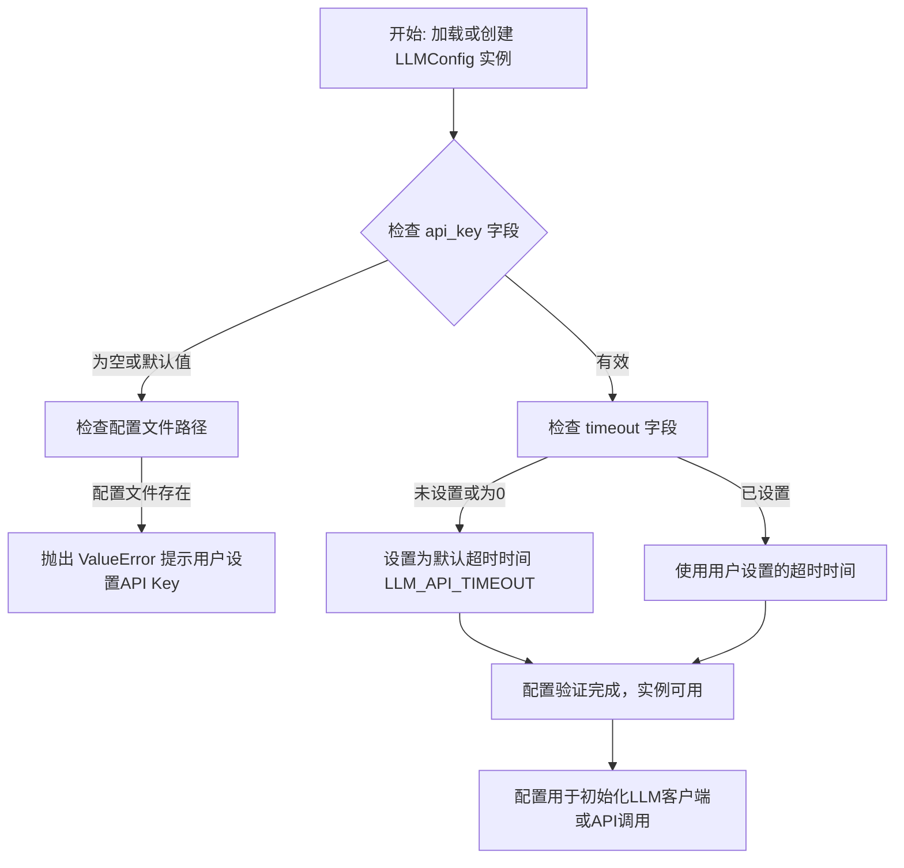
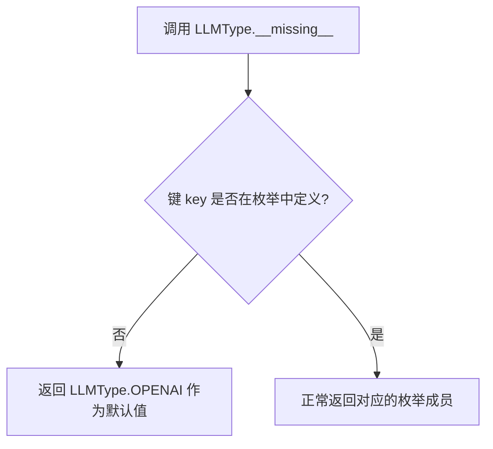
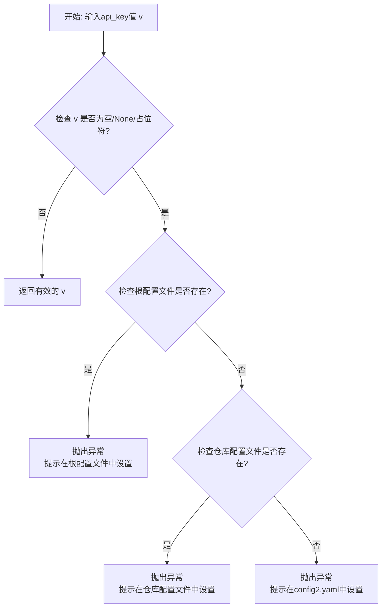
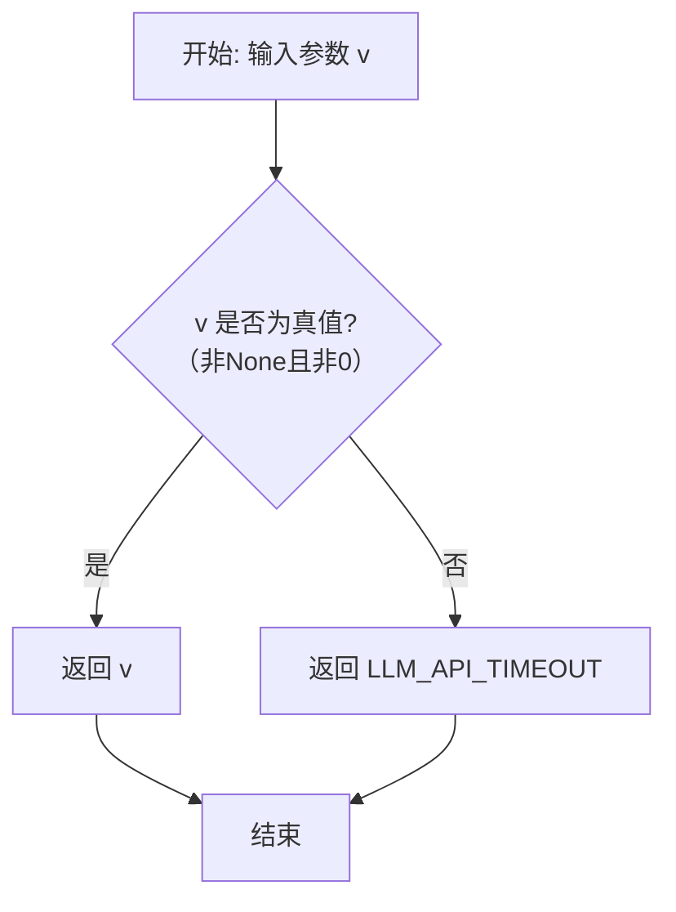

# `.\MetaGPT\metagpt\configs\llm_config.py` 详细设计文档

该文件定义了一个用于配置和管理大语言模型（LLM）连接与调用参数的配置类 `LLMConfig`，以及一个枚举类 `LLMType` 用于标识不同的LLM服务提供商。`LLMConfig` 继承自 `YamlModel`，支持从YAML文件加载配置，并包含了对API密钥、模型参数、网络设置、成本控制等属性的验证和默认值设置。

## 整体流程



## 类结构

```
YamlModel (基类，来自 metagpt.utils.yaml_model)
└── LLMConfig (LLM配置主类)

LLMType (枚举类，独立)
```

## 全局变量及字段


### `LLMConfig.api_key`
    
用于访问LLM API的密钥，默认为'sk-'。

类型：`str`
    


### `LLMConfig.api_type`
    
指定使用的LLM服务提供商类型，默认为OPENAI。

类型：`LLMType`
    


### `LLMConfig.base_url`
    
LLM API的基础URL地址，默认为OpenAI的官方端点。

类型：`str`
    


### `LLMConfig.api_version`
    
特定API的版本号，主要用于Azure等需要版本控制的云服务。

类型：`Optional[str]`
    


### `LLMConfig.model`
    
指定要使用的具体模型名称，在Azure等平台上也代表部署名称。

类型：`Optional[str]`
    


### `LLMConfig.pricing_plan`
    
成本结算计划参数，用于指定计费方案。

类型：`Optional[str]`
    


### `LLMConfig.access_key`
    
云服务提供商（如百度、阿里云）的访问密钥ID。

类型：`Optional[str]`
    


### `LLMConfig.secret_key`
    
云服务提供商（如百度、阿里云）的访问密钥Secret。

类型：`Optional[str]`
    


### `LLMConfig.session_token`
    
用于临时安全凭证的会话令牌。

类型：`Optional[str]`
    


### `LLMConfig.endpoint`
    
云端自部署模型的服务端点地址。

类型：`Optional[str]`
    


### `LLMConfig.app_id`
    
讯飞Spark等特定平台的应用ID。

类型：`Optional[str]`
    


### `LLMConfig.api_secret`
    
讯飞Spark等特定平台的API密钥。

类型：`Optional[str]`
    


### `LLMConfig.domain`
    
讯飞Spark等特定平台的领域参数。

类型：`Optional[str]`
    


### `LLMConfig.max_token`
    
生成内容的最大令牌数限制，默认为4096。

类型：`int`
    


### `LLMConfig.temperature`
    
控制输出随机性的温度参数，值越高越随机，默认为0.0。

类型：`float`
    


### `LLMConfig.top_p`
    
核采样参数，控制从累积概率达到该值的令牌集合中采样，默认为1.0。

类型：`float`
    


### `LLMConfig.top_k`
    
控制从概率最高的k个令牌中采样，默认为0（通常表示禁用）。

类型：`int`
    


### `LLMConfig.repetition_penalty`
    
重复惩罚系数，用于降低重复生成相同内容的概率，默认为1.0（无惩罚）。

类型：`float`
    


### `LLMConfig.stop`
    
指定一个或多个停止序列，生成遇到这些序列时停止。

类型：`Optional[str]`
    


### `LLMConfig.presence_penalty`
    
存在惩罚，降低模型谈论新话题的概率，默认为0.0。

类型：`float`
    


### `LLMConfig.frequency_penalty`
    
频率惩罚，降低模型重复已提及内容的概率，默认为0.0。

类型：`float`
    


### `LLMConfig.best_of`
    
服务器端生成多个候选并返回最佳的一个（按对数概率）。

类型：`Optional[int]`
    


### `LLMConfig.n`
    
为每个输入消息生成多少个聊天完成选项。

类型：`Optional[int]`
    


### `LLMConfig.stream`
    
是否启用流式响应，默认为True。

类型：`bool`
    


### `LLMConfig.seed`
    
指定随机种子，使输出具有确定性。

类型：`Optional[int]`
    


### `LLMConfig.logprobs`
    
是否在输出中包含令牌的对数概率。

类型：`Optional[bool]`
    


### `LLMConfig.top_logprobs`
    
返回每个输出位置最可能的令牌数量及其对数概率。

类型：`Optional[int]`
    


### `LLMConfig.timeout`
    
API请求的超时时间（秒），默认为600。

类型：`int`
    


### `LLMConfig.context_length`
    
模型支持的最大输入令牌数（上下文长度）。

类型：`Optional[int]`
    


### `LLMConfig.region_name`
    
Amazon Bedrock等服务的区域名称。

类型：`str`
    


### `LLMConfig.proxy`
    
网络代理地址。

类型：`Optional[str]`
    


### `LLMConfig.calc_usage`
    
是否计算和记录API使用量（用于成本控制），默认为True。

类型：`bool`
    


### `LLMConfig.compress_type`
    
在令牌数超限时压缩请求消息的策略，默认为NO_COMPRESS。

类型：`CompressType`
    


### `LLMConfig.use_system_prompt`
    
是否在消息中使用系统提示，默认为True。

类型：`bool`
    


### `LLMConfig.reasoning`
    
是否启用推理/思维链功能，默认为False。

类型：`bool`
    


### `LLMConfig.reasoning_max_token`
    
为推理/思维链功能分配的预算令牌数，通常小于max_token，默认为4000。

类型：`int`
    
    

## 全局函数及方法

### `LLMType.__missing__`

该方法用于处理当通过键（key）访问 `LLMType` 枚举成员时，如果该键不存在于枚举定义中，则提供一个默认的枚举成员作为返回值。具体来说，它会返回 `LLMType.OPENAI` 作为默认值，确保代码在遇到未定义的 LLM 类型时不会抛出 `KeyError` 异常，而是回退到使用 OpenAI 配置。

参数：

- `self`：`LLMType`，当前枚举类实例
- `key`：`str`，尝试访问但未在枚举中定义的键名

返回值：`LLMType`，返回默认的枚举成员 `LLMType.OPENAI`

#### 流程图



#### 带注释源码

```python
def __missing__(self, key):
    # 当通过键访问枚举成员时，如果键不存在，则返回 OPENAI 作为默认值
    return self.OPENAI
```


### `LLMConfig.check_llm_key`

这是一个用于验证 `LLMConfig` 类中 `api_key` 字段的 Pydantic 字段验证器。它的核心功能是检查传入的 API 密钥值是否为空、为 `None` 或为占位符 `"YOUR_API_KEY"`。如果检测到无效的 API 密钥，它会根据项目配置文件的存在情况，抛出具有明确指引信息的 `ValueError` 异常，引导用户到正确的配置文件中设置有效的 API 密钥。如果 API 密钥有效，则直接返回该值。

参数：

-  `cls`：`type[LLMConfig]`，指向 `LLMConfig` 类本身的类引用。
-  `v`：`str`，待验证的 `api_key` 字段的值。

返回值：`str`，验证通过后返回的 `api_key` 值。

#### 流程图



#### 带注释源码

```python
    @field_validator("api_key")  # 这是一个Pydantic装饰器，指定此方法用于验证`api_key`字段
    @classmethod  # 声明这是一个类方法，第一个参数是类本身（cls）
    def check_llm_key(cls, v):  # 定义验证方法，`cls`是类，`v`是待验证的字段值
        # 检查传入的API密钥值是否为无效状态：空字符串、None或占位符"YOUR_API_KEY"
        if v in ["", None, "YOUR_API_KEY"]:
            # 定义两个可能的配置文件路径
            repo_config_path = METAGPT_ROOT / "config/config2.yaml"  # 项目仓库内的配置文件路径
            root_config_path = CONFIG_ROOT / "config2.yaml"          # 用户根目录下的配置文件路径

            # 优先检查用户根目录下的配置文件是否存在
            if root_config_path.exists():
                # 如果存在，抛出异常，提示用户在根目录配置文件中设置API密钥，
                # 并警告根目录配置会覆盖仓库配置
                raise ValueError(
                    f"Please set your API key in {root_config_path}. If you also set your config in {repo_config_path}, \n"
                    f"the former will overwrite the latter. This may cause unexpected result.\n"
                )
            # 如果根目录配置文件不存在，则检查仓库内的配置文件
            elif repo_config_path.exists():
                # 如果存在，抛出异常，提示用户在仓库配置文件中设置API密钥
                raise ValueError(f"Please set your API key in {repo_config_path}")
            else:
                # 如果两个配置文件都不存在，抛出通用异常，提示用户在config2.yaml中设置
                raise ValueError("Please set your API key in config2.yaml")
        # 如果API密钥有效（通过了上述检查），则直接返回该值
        return v
```


### `LLMConfig.check_timeout`

这是一个Pydantic模型字段验证器，用于验证和确保`LLMConfig`类中`timeout`字段的值是有效的。如果传入的值为`None`或逻辑假（如0），则使用默认的全局超时常量`LLM_API_TIMEOUT`作为其值。

参数：

-  `v`：`int`，待验证的`timeout`字段值

返回值：`int`，验证并处理后的`timeout`值

#### 流程图



#### 带注释源码

```python
    @field_validator("timeout")  # 指定此验证器应用于`timeout`字段
    @classmethod  # 声明为类方法
    def check_timeout(cls, v):  # 定义验证方法，`cls`为类本身，`v`为字段传入值
        return v or LLM_API_TIMEOUT  # 如果`v`为真值（非None、非0等），则返回`v`；否则返回默认常量`LLM_API_TIMEOUT`
```


## 关键组件


### LLMType 枚举

定义了 MetaGPT 框架支持的所有大语言模型（LLM）服务提供商类型，作为配置项 `api_type` 的枚举值，用于统一管理和识别不同的后端 LLM API。

### LLMConfig 配置类

一个基于 Pydantic 的 YAML 可序列化配置模型，用于集中管理与大语言模型交互所需的所有参数，包括 API 认证信息、模型参数、网络设置、成本控制及高级功能开关等。

### CompressType 压缩类型

定义了消息压缩策略的枚举类型，用于控制当请求消息超出令牌限制时是否以及如何进行压缩，以适配不同模型的上下文长度限制。

### YamlModel 基类

一个提供 YAML 文件序列化与反序列化能力的基类，`LLMConfig` 继承自此类，使得 LLM 配置能够方便地从 YAML 配置文件加载和保存。

### 字段验证器 (Field Validators)

`LLMConfig` 类中定义的 `@field_validator` 装饰的方法，用于在配置加载或更新时对特定字段（如 `api_key`, `timeout`）进行校验和默认值填充，确保配置数据的有效性和完整性。


## 问题及建议

### 已知问题

-   **枚举类 `LLMType` 存在冗余和潜在的混淆**：枚举值 `OPEN_ROUTER` 和 `OPENROUTER` 同时存在，容易导致使用错误。`CLAUDE` 作为 `ANTHROPIC` 的别名，虽然提供了便利，但也增加了维护和理解成本。
-   **字段默认值可能不适用于所有LLM类型**：`base_url` 的默认值 `"https://api.openai.com/v1"` 仅对 OpenAI 有效。对于其他类型的 LLM（如 Ollama、本地部署模型），此默认值不适用，可能导致连接错误。
-   **字段命名和用途存在歧义**：`model` 字段的注释说明它也代表 `DEPLOYMENT_NAME`（通常用于 Azure OpenAI），但字段名本身未能清晰表达这种双重用途，可能引起配置误解。
-   **配置验证逻辑可能过于严格**：`check_llm_key` 验证器在 `api_key` 为特定字符串（如 `"YOUR_API_KEY"`）时会抛出错误。虽然这有助于提醒用户配置，但如果用户确实想使用一个名为 `"YOUR_API_KEY"` 的密钥（尽管可能性极低），此逻辑会错误地阻止。
-   **部分字段缺乏类型注解或默认值**：`region_name` 字段被注释为用于 Amazon Bedrock，但未提供默认值（默认为 `None`），且未使用 `Optional[str]` 明确其可为空，这可能导致类型检查工具（如 mypy）报错或运行时意外行为。
-   **配置项耦合度高**：类中包含了众多特定于某个或某几个LLM提供商的字段（如 `app_id`, `api_secret`, `domain` 对于讯飞星火；`access_key`, `secret_key` 对于百度/阿里云）。这导致配置类臃肿，且每增加一个新的LLM提供商支持都可能需要修改此核心配置类，违反了开闭原则。

### 优化建议

-   **清理和统一 `LLMType` 枚举**：移除重复的枚举项（如合并 `OPEN_ROUTER` 和 `OPENROUTER`），考虑是否真的需要为 `ANTHROPIC` 保留 `CLAUDE` 这个别名，或者通过文档说明而非代码别名来提供指引。
-   **为不同LLM类型提供差异化的默认配置**：可以考虑使用工厂模式或继承机制，为 `LLMType` 中的不同类型提供不同的 `LLMConfig` 子类或默认配置字典，从而避免将 OpenAI 的默认值（如 `base_url`）强加给其他类型。
-   **重构字段以明确用途**：考虑将 `model` 字段拆分为更具体的字段，例如 `model_name` 和 `deployment_name`，或者通过更清晰的注释和文档来阐明其在不同上下文下的含义。
-   **优化密钥验证逻辑**：将 `check_llm_key` 验证器中检查的无效值列表（如 `"YOUR_API_KEY"`）提取为常量或配置项，并考虑提供一个开关允许跳过此检查（例如，用于测试或特定场景），增加灵活性。
-   **完善类型注解和默认值**：为所有字段添加明确的类型注解，特别是对于像 `region_name` 这样的字段，应使用 `Optional[str] = None`。确保所有字段都有合适的默认值或明确标记为必需。
-   **解耦配置，采用插件化或扩展式设计**：
    -   **方案A（插件化）**：将 `LLMConfig` 定义为包含所有通用字段的基类。为每个特定的LLM提供商（如 `OpenAIConfig`, `AnthropicConfig`, `OllamaConfig`）创建独立的配置类，继承基类并添加其特有字段。主配置类通过一个 `provider_config` 字段来引用这些特定配置。
    -   **方案B（扩展式）**：保留当前的扁平结构，但将特定于供应商的字段组织到一个 `Dict[str, Any]` 类型的字段（如 `extra` 或 `provider_specific`）中。这样可以在不修改核心类定义的情况下灵活地添加新供应商的配置参数，由具体的LLM客户端实现负责解析和使用这些额外字段。
    -   **方案C（配置映射）**：维护一个全局的 `LLM_TYPE_TO_CONFIG_MAP` 字典，将 `LLMType` 映射到对应的配置类或默认配置字典。在需要时根据 `api_type` 动态加载或合并配置。
-   **增强配置的序列化/反序列化能力**：作为 `YamlModel` 的子类，确保所有新增的复杂类型（如 `CompressType` 枚举、未来可能有的嵌套配置对象）都能被 Pydantic 和 YAML 库正确处理。考虑为自定义类型编写验证器或序列化器。

## 其它


### 设计目标与约束

本模块的核心设计目标是提供一个统一、可扩展且类型安全的配置模型，用于管理与多种大语言模型（LLM）服务进行交互所需的参数。它旨在：
1.  **统一接口**：通过一个`LLMConfig`类封装不同LLM提供商（如OpenAI、Anthropic、Azure等）的通用和特有配置项，简化上层业务代码的调用。
2.  **配置即代码**：利用Pydantic模型实现数据验证、序列化/反序列化（支持YAML），确保配置数据的完整性和类型安全。
3.  **灵活扩展**：通过`LLMType`枚举支持新的LLM服务提供商，新增类型只需扩展枚举和对应的配置字段（如`app_id`、`endpoint`等）。
4.  **向后兼容**：提供合理的默认值（如`api_type=LLMType.OPENAI`, `max_token=4096`），并允许可选字段（`Optional`），以降低使用门槛。
主要约束包括：必须与Pydantic框架兼容；配置项需覆盖主流LLM API的常见参数；密钥等敏感信息需通过环境变量或配置文件注入，而非硬编码。

### 错误处理与异常设计

模块的错误处理主要围绕配置数据的有效性验证展开：
1.  **API密钥验证**：`check_llm_key`验证器确保`api_key`字段不为空或默认值。若检测到无效值，将抛出清晰的`ValueError`，引导用户到正确的配置文件路径（`config2.yaml`）进行设置。这提供了明确的错误恢复指引。
2.  **超时参数兜底**：`check_timeout`验证器确保`timeout`字段不为`None`，若未设置则使用`LLM_API_TIMEOUT`常量作为默认值，防止因配置缺失导致网络请求无限等待。
3.  **Pydantic内置验证**：利用Pydantic对字段类型的声明（如`int`, `float`, `LLMType`），自动进行类型转换和验证，无效类型会触发`ValidationError`。
4.  **枚举缺失处理**：`LLMType`枚举的`__missing__`方法为未定义的键提供了默认值（`OPENAI`），增强了代码的健壮性，避免因拼写错误或未支持的类型导致程序崩溃。
整体策略是“尽早失败并提供清晰指引”，在配置加载阶段即发现问题。

### 数据流与状态机

本模块是静态配置类，不涉及运行时状态机。其数据流主要体现在配置的加载、验证和使用过程：
1.  **加载源**：配置数据可能来自YAML文件（通过`YamlModel`基类）、环境变量或代码直接实例化。
2.  **验证与初始化**：数据流入`LLMConfig`类构造函数，触发Pydantic的字段验证器（`field_validator`），进行密钥、超时等检查，并填充默认值，最终生成一个有效的配置对象。
3.  **消费端**：生成的`LLMConfig`实例作为参数传递给LLM客户端（如OpenAI Client），用于初始化连接和配置请求参数（如`model`, `temperature`, `max_token`）。
数据流是单向的：从配置源 -> `LLMConfig`对象 -> LLM服务调用。配置对象在创建后通常是只读的。

### 外部依赖与接口契约

1.  **外部库依赖**：
    *   `pydantic`：用于数据模型定义、验证和序列化。
    *   `typing`：用于类型注解（`Optional`, `Enum`）。
    *   `enum`：用于定义`LLMType`枚举。
2.  **项目内部依赖**：
    *   `metagpt.configs.compress_msg_config.CompressType`：枚举，定义消息压缩策略。
    *   `metagpt.const`：导入项目常量（`CONFIG_ROOT`, `METAGPT_ROOT`, `LLM_API_TIMEOUT`）。
    *   `metagpt.utils.yaml_model.YamlModel`：作为基类，提供YAML文件读写能力。
3.  **接口契约**：
    *   **提供方**：`LLMConfig`类为项目其他模块（如LLM客户端包装器）提供了一个标准化的配置数据结构契约。调用方可以依赖其字段名和类型。
    *   **消费方**：本模块依赖调用方按照Pydantic规范传递配置数据，并期望`METAGPT_ROOT`和`CONFIG_ROOT`常量指向有效的目录路径以供配置文件查找。
    *   **隐式契约**：`LLMType`枚举的值（如`"openai"`）需要与下游LLM客户端实现中用于识别服务商的逻辑保持一致。

### 配置管理与部署考量

1.  **多环境配置**：通过`CONFIG_ROOT`和`METAGPT_ROOT`支持不同环境（开发、测试、生产）的配置文件隔离。优先级上，`CONFIG_ROOT`下的配置会覆盖项目内的配置。
2.  **敏感信息管理**：`api_key`、`secret_key`等敏感字段设计为从外部配置源注入，避免硬编码在代码中，符合安全最佳实践。
3.  **配置继承与覆盖**：`LLMConfig`可作为基配置，针对不同任务或模型可以创建子类或实例并覆盖特定字段（如为创意任务设置更高的`temperature`）。
4.  **部署复杂度**：支持众多LLM提供商意味着部署时可能需要为不同的提供商配置不同的网络代理（`proxy`）、区域（`region_name`）或端点（`endpoint`, `base_url`），增加了部署配置的复杂性，但通过本模块得到了统一管理。
5.  **版本兼容性**：`api_version`字段用于支持特定云服务（如Azure OpenAI）的API版本管理。

### 可测试性设计

1.  **单元测试**：`LLMConfig`类易于进行单元测试，可以构造包含合法及非法数据的字典，测试其初始化、验证逻辑（特别是`check_llm_key`和`check_timeout`）以及默认值行为。
2.  **模拟（Mock）**：由于配置类不涉及外部网络调用，测试时无需复杂模拟。但测试依赖`LLMConfig`的模块时，可以轻松创建模拟的配置对象。
3.  **测试用例重点**：
    *   验证各种`LLMType`对应的配置组合是否正确初始化。
    *   测试`api_key`验证器在不同场景下的抛异常行为。
    *   测试从YAML文件加载配置的正确性（依赖`YamlModel`）。
4.  **配置隔离**：测试时可以通过临时环境变量或内存中的配置字典来创建`LLMConfig`实例，避免依赖实际物理配置文件，保证测试的独立性和可重复性。

    