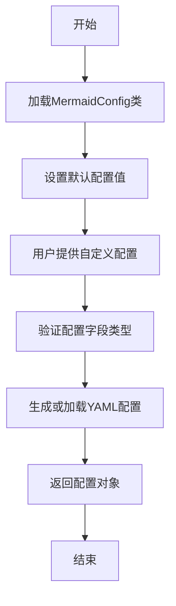

# `.\MetaGPT\metagpt\configs\mermaid_config.py` 详细设计文档

该代码定义了一个用于配置Mermaid图表生成工具的配置类，支持多种渲染引擎（如nodejs、ink、playwright等）的配置参数，并通过YAML模型基类提供序列化和反序列化能力。

## 整体流程



## 类结构

```
YamlModel (基类)
└── MermaidConfig (配置类)
```

## 全局变量及字段


### `MermaidConfig.engine`
    
指定用于渲染Mermaid图表的引擎，默认为'nodejs'。

类型：`Literal['nodejs', 'ink', 'playwright', 'pyppeteer', 'none']`
    


### `MermaidConfig.path`
    
指定Mermaid CLI工具（mmdc）的路径或命令，默认为'mmdc'。

类型：`str`
    


### `MermaidConfig.puppeteer_config`
    
用于配置Puppeteer（当使用nodejs或playwright引擎时）的配置文件路径或配置字符串。

类型：`str`
    


### `MermaidConfig.pyppeteer_path`
    
指定Pyppeteer使用的Chrome或Chromium浏览器的可执行文件路径，默认为'/usr/bin/google-chrome-stable'。

类型：`str`
    
    

## 全局函数及方法


## 关键组件


### MermaidConfig 类

一个用于配置 Mermaid 图表生成工具的 YAML 数据模型类，定义了生成引擎、可执行文件路径等关键参数。

### YamlModel 基类

一个用于支持 YAML 序列化与反序列化的基础模型类，为 `MermaidConfig` 提供了从 YAML 文件加载配置和将配置保存为 YAML 文件的能力。

### 配置字段 (engine)

一个枚举类型的配置字段，用于指定生成 Mermaid 图表所使用的后端引擎，支持 nodejs、ink、playwright、pyppeteer 等多种选项。

### 配置字段 (path)

一个字符串类型的配置字段，用于指定 Mermaid 命令行工具 `mmdc` 的可执行文件路径。

### 配置字段 (puppeteer_config)

一个字符串类型的配置字段，用于为某些基于 Puppeteer 的引擎（如 playwright）提供额外的浏览器配置参数。

### 配置字段 (pyppeteer_path)

一个字符串类型的配置字段，用于为 `pyppeteer` 引擎指定 Chrome 或 Chromium 浏览器的可执行文件路径。


## 问题及建议


### 已知问题

-   **硬编码的浏览器路径**：`pyppeteer_path` 字段的默认值被硬编码为 `/usr/bin/google-chrome-stable`。这在不同操作系统（如 Windows、macOS）或不同安装方式的 Chrome 环境中可能不存在或不正确，导致使用 `pyppeteer` 引擎时失败。
-   **配置验证缺失**：当前模型仅定义了字段类型，但未对字段值进行业务逻辑层面的验证。例如，当 `engine` 为 `"pyppeteer"` 时，`pyppeteer_path` 是否指向一个有效的可执行文件；当 `engine` 为 `"nodejs"` 时，`path` 是否指向有效的 `mmdc` 命令。
-   **配置灵活性不足**：`puppeteer_config` 字段被定义为简单的字符串类型。如果配置内容复杂（例如包含多个键值对或嵌套结构），使用字符串表示不够直观，也难以进行结构化验证和访问。

### 优化建议

-   **使用环境变量或动态路径解析**：建议将 `pyppeteer_path` 的默认值设为 `None` 或空字符串，并在实际使用该引擎的代码中，通过环境变量（如 `PYPPETEER_CHROMIUM_REVISION`）或库自带的自动查找功能（如 `pyppeteer.executablePath()`）来动态获取浏览器路径，提高跨平台兼容性。
-   **增加配置验证逻辑**：可以在 `YamlModel` 的 `__init__` 方法后或通过 Pydantic 的 `@validator` 装饰器添加自定义验证方法。例如，根据 `engine` 的值验证对应路径字段的有效性，或在加载配置后检查关键文件是否存在。
-   **将 `puppeteer_config` 定义为结构化类型**：如果配置内容相对固定，可以将其定义为另一个 Pydantic 模型（如 `PuppeteerConfig`），以利用类型提示和自动验证。如果配置是灵活的 JSON 结构，可将其类型定义为 `Dict` 或 `Any` 并配合 `json.loads` 使用，但这会降低类型安全性。最佳实践是根据实际使用场景定义具体的模型。
-   **提供配置示例或文档**：在类文档字符串或独立的配置示例文件中，说明不同 `engine` 下各字段应如何配置，特别是 `puppeteer_config` 的格式，以降低用户的使用门槛。


## 其它


### 设计目标与约束

该代码的设计目标是提供一个可配置的Mermaid图表生成配置类，用于支持多种渲染引擎和自定义路径。主要约束包括：必须支持YAML格式的配置文件加载与保存，确保类型安全，以及提供默认配置值以简化使用。

### 错误处理与异常设计

当前代码未显式定义错误处理机制。潜在的错误包括：无效的引擎类型、路径不存在或不可执行、YAML文件格式错误。建议在`YamlModel`基类或本类中添加验证逻辑，例如使用Pydantic的`validator`装饰器，或在加载配置时捕获并抛出更具描述性的异常。

### 数据流与状态机

数据流简单直接：用户或系统通过YAML文件或直接实例化提供配置参数，`MermaidConfig`类加载并验证这些参数，然后将其传递给Mermaid渲染组件。由于配置是静态的（一旦加载即不变），不涉及复杂的状态转换。

### 外部依赖与接口契约

1. **外部依赖**：
   - `typing.Literal`：用于类型注解，确保`engine`字段的值来自预定义集合。
   - `metagpt.utils.yaml_model.YamlModel`：基类，提供YAML序列化/反序列化能力。
   - 实际运行时依赖的Mermaid渲染工具（如`mmdc`、Playwright等）。

2. **接口契约**：
   - 作为配置提供者，需提供`engine`、`path`、`puppeteer_config`、`pyppeteer_path`字段的访问。
   - 继承`YamlModel`的接口，支持`from_yaml_file`、`to_yaml_file`等方法。

### 配置管理与扩展性

当前配置通过类字段的默认值提供基础配置，并可通过YAML文件覆盖。扩展性方面，可以轻松添加新的配置字段（如超时设置、图像质量等）。建议将配置分类（如引擎配置、路径配置、浏览器配置）以提升可维护性。

### 安全考虑

当配置涉及路径（如`pyppeteer_path`）或执行命令（如`path`指向可执行文件）时，需防范路径遍历攻击或恶意命令注入。应在使用前验证路径的合法性和安全性，特别是当配置来自不可信的YAML文件时。

### 测试策略

应针对以下场景编写单元测试：
1. 默认配置实例化。
2. 从YAML文件加载有效配置。
3. 从YAML文件加载无效配置（如未知引擎类型）时的错误处理。
4. 配置的序列化与反序列化一致性。
5. 各字段的类型验证。

### 部署与运维

部署时需确保配置中指定的路径（如`mmdc`、Chrome浏览器）在目标环境中存在且可执行。对于Docker容器化部署，这些依赖需包含在镜像中或通过卷挂载。运维中可通过更新YAML配置文件动态调整渲染引擎，无需重启应用。

    