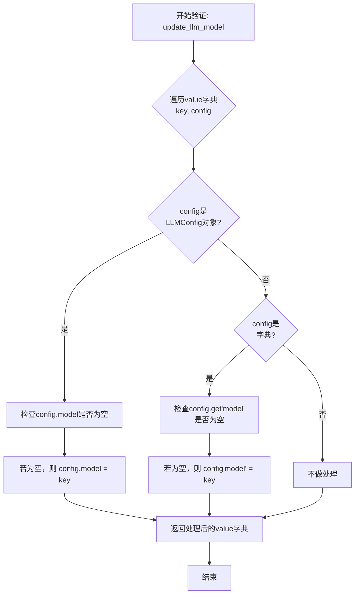
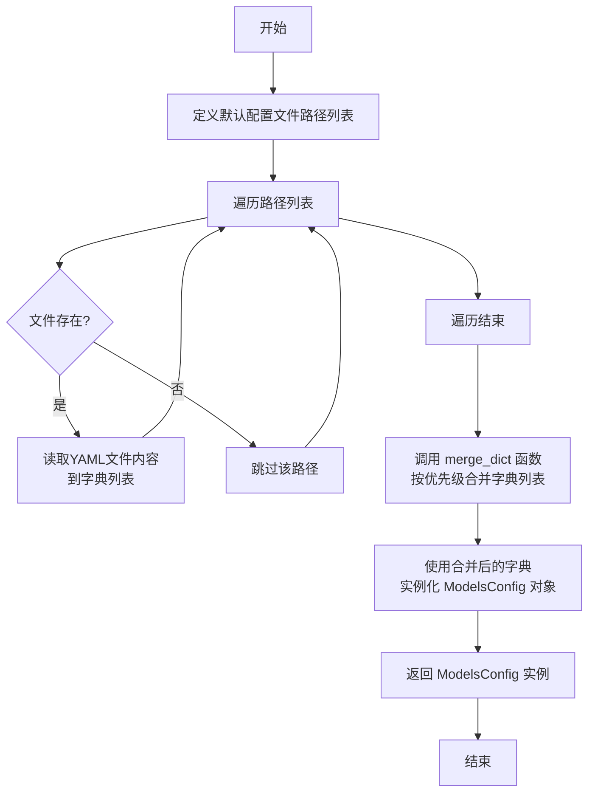

# `.\MetaGPT\metagpt\configs\models_config.py` 详细设计文档

该文件定义了 ModelsConfig 类，用于管理和配置多个大型语言模型（LLM）。它作为配置系统的核心组件，支持从多个YAML配置文件（包括默认配置和用户主目录配置）加载模型设置，并能通过模型名称或API类型检索特定的LLM配置。

## 整体流程

```mermaid
graph TD
    A[开始] --> B{调用 ModelsConfig.default() 或 from_home()}
    B --> C[读取默认配置文件列表]
    C --> D[按顺序读取并解析YAML文件]
    D --> E[使用 merge_dict 合并配置字典]
    E --> F[实例化 ModelsConfig 对象]
    F --> G[触发字段验证器 update_llm_model]
    G --> H[确保每个配置项的 'model' 字段被正确设置]
    H --> I[配置对象准备就绪]
    I --> J{用户调用 get(name_or_type)}
    J --> K{name_or_type 是否为空?}
    K -- 是 --> L[返回 None]
    K -- 否 --> M{是否与 models 字典的键完全匹配?}
    M -- 是 --> N[返回对应的 LLMConfig]
    M -- 否 --> O[遍历所有配置，匹配 api_type]
    O --> P{找到匹配项?}
    P -- 是 --> Q[返回匹配的 LLMConfig]
    P -- 否 --> R[返回 None]
```

## 类结构

```
YamlModel (来自 metagpt.utils.yaml_model)
└── ModelsConfig
    ├── 字段: models
    ├── 方法: update_llm_model (验证器)
    ├── 方法: from_home (类方法)
    ├── 方法: default (类方法)
    └── 方法: get (实例方法)
```

## 全局变量及字段


### `CONFIG_ROOT`
    
Root path for user-specific configuration files, typically located at ~/.metagpt.

类型：`Path`
    


### `METAGPT_ROOT`
    
Root path for the MetaGPT project's internal files and default configurations.

类型：`Path`
    


### `ModelsConfig.models`
    
A dictionary mapping model names or types to their corresponding LLM configuration objects.

类型：`Dict[str, LLMConfig]`
    
    

## 全局函数及方法


### `ModelsConfig.update_llm_model`

这是一个Pydantic字段验证器，用于在`ModelsConfig`类的`models`字段被赋值前进行预处理。它的核心功能是确保配置字典中每个LLM配置项（无论是`LLMConfig`对象还是原始字典）的`model`字段都有一个值。如果`model`字段为空或不存在，则使用该配置项在字典中的键（`key`）作为其`model`值。这保证了每个模型配置都有一个明确的标识符。

参数：

-  `cls`：`type[ModelsConfig]`，指向`ModelsConfig`类本身的类引用。
-  `value`：`Dict[str, Union[LLMConfig, dict]]`，待验证和更新的原始模型配置字典。键为模型名称或类型，值为`LLMConfig`对象或字典。

返回值：`Dict[str, Union[LLMConfig, dict]]`，返回处理后的模型配置字典，其中每个配置项的`model`字段都已确保有值。

#### 流程图



#### 带注释源码

```python
    @field_validator("models", mode="before")
    @classmethod
    def update_llm_model(cls, value):
        """
        Validates and updates LLM model configurations.

        Args:
            value (Dict[str, Union[LLMConfig, dict]]): Dictionary of LLM configurations.

        Returns:
            Dict[str, Union[LLMConfig, dict]]: Updated dictionary of LLM configurations.
        """
        # 遍历传入的配置字典
        for key, config in value.items():
            # 情况1：配置项是LLMConfig对象
            if isinstance(config, LLMConfig):
                # 如果对象的model属性为空，则用字典的键(key)来赋值
                config.model = config.model or key
            # 情况2：配置项是原始字典
            elif isinstance(config, dict):
                # 如果字典中没有'model'键或其值为空，则用字典的键(key)来赋值
                config["model"] = config.get("model") or key
        # 返回处理后的配置字典
        return value
```


### `ModelsConfig.from_home`

这是一个类方法，用于从用户主目录下的指定路径加载 `ModelsConfig` 配置。它检查配置文件是否存在，如果存在则通过 `YamlModel` 基类的 `from_yaml_file` 方法解析并返回一个 `ModelsConfig` 实例；如果文件不存在，则返回 `None`。

参数：

-  `path`：`str`，配置文件的相对路径（相对于 `CONFIG_ROOT` 目录）。

返回值：`Optional[ModelsConfig]`，如果配置文件存在则返回加载的 `ModelsConfig` 对象，否则返回 `None`。

#### 流程图

```mermaid
flowchart TD
    A[开始: from_home(path)] --> B["pathname = CONFIG_ROOT / path"]
    B --> C{"pathname.exists()?"}
    C -- 是 --> D["return ModelsConfig.from_yaml_file(pathname)"]
    C -- 否 --> E["return None"]
    D --> F[结束]
    E --> F
```

#### 带注释源码

```
    @classmethod
    def from_home(cls, path):
        """
        Loads configuration from ~/.metagpt/config2.yaml.

        Args:
            path (str): Relative path to configuration file.

        Returns:
            Optional[ModelsConfig]: Loaded ModelsConfig object or None if file doesn't exist.
        """
        # 将传入的相对路径与配置根目录(CONFIG_ROOT)拼接，得到完整的文件路径
        pathname = CONFIG_ROOT / path
        # 检查拼接后的完整路径对应的文件是否存在
        if not pathname.exists():
            # 如果文件不存在，则返回 None
            return None
        # 如果文件存在，则调用基类 YamlModel 的 from_yaml_file 方法，
        # 从该 YAML 文件加载并解析数据，构造并返回一个 ModelsConfig 实例
        return ModelsConfig.from_yaml_file(pathname)
```


### `ModelsConfig.default`

`ModelsConfig.default` 是一个类方法，用于加载默认的模型配置。它按照预定义的优先级顺序（从项目内置配置到用户主目录配置）读取多个 YAML 配置文件，将它们合并后，实例化并返回一个 `ModelsConfig` 对象。

参数：
-  `cls`：`type[ModelsConfig]`，类方法的隐式参数，指代 `ModelsConfig` 类本身。

返回值：`ModelsConfig`，一个包含了合并后默认配置的 `ModelsConfig` 对象实例。

#### 流程图



#### 带注释源码

```python
    @classmethod
    def default(cls):
        """
        Loads default configuration from predefined paths.

        Returns:
            ModelsConfig: Default ModelsConfig object.
        """
        # 定义默认配置文件的查找路径列表，按优先级从高到低排列。
        # 1. 项目根目录下的内置配置 (METAGPT_ROOT / "config/config2.yaml")
        # 2. 用户主目录下的配置 (CONFIG_ROOT / "config2.yaml")
        default_config_paths: List[Path] = [
            METAGPT_ROOT / "config/config2.yaml",
            CONFIG_ROOT / "config2.yaml",
        ]

        # 遍历所有路径，使用 `read_yaml` 方法（继承自 YamlModel）读取每个 YAML 文件。
        # 如果文件不存在，`read_yaml` 可能返回空字典或抛出异常（取决于其实现）。
        # 此处代码假设 `read_yaml` 能处理不存在的文件，并返回一个可合并的字典（如空字典）。
        dicts = [ModelsConfig.read_yaml(path) for path in default_config_paths]

        # 使用 `merge_dict` 函数合并从所有路径读取到的配置字典。
        # 合并策略通常是：列表中的后续字典（优先级更高）会覆盖前面字典中相同的键。
        # 因此，用户主目录的配置会覆盖项目内置的默认配置。
        final = merge_dict(dicts)

        # 使用合并后的最终字典 `final` 来实例化并返回一个 ModelsConfig 对象。
        return ModelsConfig(**final)
```


### `ModelsConfig.get`

从配置中根据模型名称或API类型检索对应的LLM配置对象。

参数：

- `name_or_type`：`str`，要查找的模型名称或API类型字符串。

返回值：`Optional[LLMConfig]`，如果找到匹配的配置则返回对应的LLMConfig对象，否则返回None。

#### 流程图

```mermaid
flowchart TD
    A[开始: get(name_or_type)] --> B{name_or_type 是否为空?}
    B -->|是| C[返回 None]
    B -->|否| D[从 self.models 中<br>按 key 查找]
    D --> E{是否找到?}
    E -->|是| F[返回找到的 LLMConfig]
    E -->|否| G[遍历所有 LLMConfig<br>检查 api_type]
    G --> H{是否找到匹配的 api_type?}
    H -->|是| I[返回匹配的 LLMConfig]
    H -->|否| J[返回 None]
```

#### 带注释源码

```python
def get(self, name_or_type: str) -> Optional[LLMConfig]:
    """
    检索 LLMConfig 对象，通过模型名称或 API 类型。

    参数:
        name_or_type (str): 要查找的 LLM 模型的名称或 API 类型。

    返回值:
        Optional[LLMConfig]: 如果找到则返回 LLMConfig 对象，否则返回 None。
    """
    # 1. 处理空输入，直接返回 None
    if not name_or_type:
        return None
    # 2. 首先尝试通过字典键（模型名称）直接查找
    model = self.models.get(name_or_type)
    if model:
        return model
    # 3. 如果直接查找失败，则遍历所有配置，通过 api_type 进行匹配
    for m in self.models.values():
        if m.api_type == name_or_type:
            return m
    # 4. 如果以上两种方式都未找到，则返回 None
    return None
```

## 关键组件


### 配置管理组件

负责从多个预定义路径（如项目根目录和用户配置目录）加载、合并和管理LLM模型的配置信息，支持通过模型名称或API类型检索配置。

### 配置验证与更新组件

在配置加载过程中，自动验证并更新LLM配置字典，确保每个配置项都包含正确的`model`字段，如果缺失则使用字典的键名作为默认值。

### 配置检索组件

提供根据模型名称或API类型从已加载的配置字典中查找并返回对应`LLMConfig`对象的功能，支持灵活的配置查询。

### 配置持久化组件

基于`YamlModel`基类，提供从YAML文件加载配置和将配置保存到YAML文件的能力，实现了配置数据的序列化与反序列化。


## 问题及建议


### 已知问题

-   **`update_llm_model` 验证器逻辑不完整**：该验证器在 `mode="before"` 下运行，负责处理传入的原始字典。然而，它仅更新了字典中的值（`config.model` 或 `config["model"]`），但并未将字典值转换为 `LLMConfig` 实例。这意味着如果传入的是字典，`models` 字段最终存储的仍然是字典，而非 `LLMConfig` 对象，可能导致后续使用类型提示不匹配或缺少 `LLMConfig` 的方法/属性。
-   **`from_home` 方法路径参数设计模糊**：`from_home(cls, path)` 方法接收一个 `path` 参数，但其文档描述为从 `~/.metagpt/config2.yaml` 加载，方法内部却将 `CONFIG_ROOT` 与 `path` 拼接。这导致方法名 (`from_home`) 与实际行为（从 `CONFIG_ROOT/path` 加载）不一致，容易造成使用者误解。`path` 参数更像是相对于 `CONFIG_ROOT` 的相对路径，而非主目录下的固定文件名。
-   **`default` 方法异常处理缺失**：`default` 方法在读取预定义路径列表中的 YAML 文件时，直接对每个路径调用 `ModelsConfig.read_yaml(path)`。如果某个路径不存在或文件不可读，`read_yaml` 方法可能会抛出异常（如 `FileNotFoundError`），导致整个 `default` 方法失败，而无法优雅地回退到其他可用配置。
-   **`get` 方法查找逻辑可能返回非预期结果**：`get` 方法首先通过键（`name_or_type`）直接查找，如果未找到，则遍历所有 `LLMConfig` 对象匹配 `api_type`。如果存在多个 `LLMConfig` 具有相同的 `api_type`，该方法将返回第一个匹配项，这可能不是调用者期望的特定模型。此外，如果 `models` 字典中的值因上述验证器问题仍是字典而非 `LLMConfig` 实例，访问 `m.api_type` 将导致 `AttributeError`。

### 优化建议

-   **完善 `update_llm_model` 验证器**：在验证器中，当 `config` 是字典时，应将其转换为 `LLMConfig` 实例。可以使用 `LLMConfig(**config)` 进行转换，确保 `models` 字段最终存储的是类型正确的对象。同时，应考虑处理转换可能失败的异常情况。
-   **重命名或重构 `from_home` 方法**：建议将方法名改为更准确的名称，如 `from_config_root`，并明确参数 `path` 是相对于 `CONFIG_ROOT` 的相对路径。或者，修改方法逻辑，使其真正从用户主目录下的固定路径（如 `~/.metagpt/config2.yaml`）加载，移除 `path` 参数，提高接口的清晰度。
-   **增强 `default` 方法的健壮性**：在遍历 `default_config_paths` 读取 YAML 文件时，应使用 `try-except` 块捕获 `FileNotFoundError` 或其他可能的 I/O 异常。对于不存在的文件，可以跳过或记录警告，而不是导致整个配置加载失败。确保方法能够从存在的第一个有效配置文件中成功加载配置。
-   **改进 `get` 方法的查找策略与健壮性**：考虑引入更明确的查找策略，例如优先按 `name`（即字典的键）查找，其次按 `model` 字段，最后按 `api_type`。对于 `api_type` 重复的情况，可以返回一个列表或引发一个明确的警告。在遍历 `self.models.values()` 时，应添加类型检查，确保遍历的是 `LLMConfig` 实例，避免因存储了字典而导致的运行时错误。
-   **添加配置验证与合并的日志记录**：在 `default` 方法合并多个配置源，以及 `update_llm_model` 验证器处理配置时，添加适当的日志记录（如使用 `logging` 模块）。这有助于调试配置加载过程，了解哪些文件被成功读取、合并时发生了什么，以及验证过程中是否进行了转换。
-   **考虑使用 `@model_validator` 替代 `@field_validator`**：如果验证逻辑需要访问模型的其他字段或进行更复杂的整体验证，可以考虑使用 Pydantic V2 的 `@model_validator`。不过在当前场景下，`@field_validator` 用于单个字段的预处理是合适的。


## 其它


### 设计目标与约束

1.  **设计目标**：
    *   **配置管理**：为 MetaGPT 框架提供统一、灵活的大语言模型（LLM）配置管理能力。
    *   **多源配置**：支持从多个预定义路径（如项目默认配置、用户主目录配置）加载配置，并实现配置的优先级合并。
    *   **类型安全与验证**：利用 Pydantic 模型确保配置数据的结构正确性和类型安全，并在加载时进行自动验证与修正（如补全 `model` 字段）。
    *   **便捷访问**：提供通过模型名称或 API 类型快速检索具体 LLM 配置的方法。

2.  **设计约束**：
    *   **向后兼容性**：`ModelsConfig` 类继承自 `YamlModel`，其序列化/反序列化行为需与 YAML 文件格式兼容。
    *   **配置合并策略**：依赖外部的 `merge_dict` 函数实现配置合并，合并逻辑（如覆盖优先级）由该函数定义。
    *   **文件系统依赖**：类的行为依赖于特定的文件路径（`CONFIG_ROOT`, `METAGPT_ROOT`），要求这些路径在运行时是可访问的。

### 错误处理与异常设计

1.  **静默处理**：
    *   `from_home` 方法在配置文件不存在时返回 `None`，而非抛出异常，将文件是否存在的判断责任交给了调用者。
    *   `get` 方法在未找到匹配配置时返回 `None`，同样由调用者决定后续操作（如使用默认值或抛出业务异常）。

2.  **验证与转换异常**：
    *   `update_llm_model` 验证器作为 Pydantic 模型验证流程的一部分运行。如果输入数据无法转换为有效的 `Dict[str, LLMConfig]` 结构（例如，`LLMConfig` 初始化失败），Pydantic 将抛出 `ValidationError`。这是该类主要的异常抛出点。

3.  **文件读取异常**：
    *   `default` 方法中调用的 `ModelsConfig.read_yaml` 以及 `from_yaml_file` 方法，在 YAML 文件格式错误或无法读取时，可能会抛出 `YAML` 解析异常或 `OSError`。这些异常未在当前类中捕获，会直接传递给上层调用者。

### 数据流与状态机

1.  **数据流**：
    *   **初始化/加载流**：调用 `default()` 或 `from_home()` -> 从磁盘读取 YAML 文件 -> `merge_dict` 合并多个配置源 -> 数据传递给 Pydantic 构造器 -> `update_llm_model` 验证器执行字段补全 -> 生成 `ModelsConfig` 实例。
    *   **查询流**：调用 `get(name_or_type)` -> 先在 `self.models` 字典中按键查找 -> 若未找到，则遍历所有 `LLMConfig` 对象，匹配 `api_type` -> 返回找到的 `LLMConfig` 对象或 `None`。

2.  **状态机**：
    *   该类为**无状态**的配置容器。一旦实例化，其 `models` 字典的内容就是固定的（除非显式地替换整个对象）。它不管理任何运行时状态变迁，仅提供对已加载配置数据的只读访问和查询。

### 外部依赖与接口契约

1.  **外部依赖**：
    *   **Pydantic**：用于数据模型定义、字段验证、类型转换。`YamlModel` 基类可能也依赖于 Pydantic 的序列化能力。
    *   **PyYAML 或类似库**：由 `YamlModel` 基类封装，用于 YAML 文件的解析与生成。
    *   **`metagpt.config2.merge_dict`**：定义了具体的字典合并算法，是本类实现多配置源加载的核心依赖。
    *   **`metagpt.configs.llm_config.LLMConfig`**：作为 `models` 字典的值类型，是其配置数据的详细定义。
    *   **`metagpt.const`**：提供关键的路径常量 `CONFIG_ROOT` 和 `METAGPT_ROOT`。

2.  **接口契约**：
    *   **对调用者**：通过 `default()`、`from_home()` 提供配置加载入口，通过 `get()` 提供配置查询入口。返回 `None` 表示未找到。
    *   **对配置文件**：期望的 YAML 文件结构顶层应包含一个 `models` 键，其值为字典。该字典的每个键值对将被解析为 `LLMConfig` 对象。`LLMConfig` 内部的字段结构需符合其自身的 Pydantic 模型定义。
    *   **对 `YamlModel` 基类**：依赖其提供的 `from_yaml_file`、`read_yaml` 等静态方法来完成 YAML 的读取。`ModelsConfig` 自身也继承了 `YamlModel` 的序列化方法（如 `to_yaml_file`）。

    