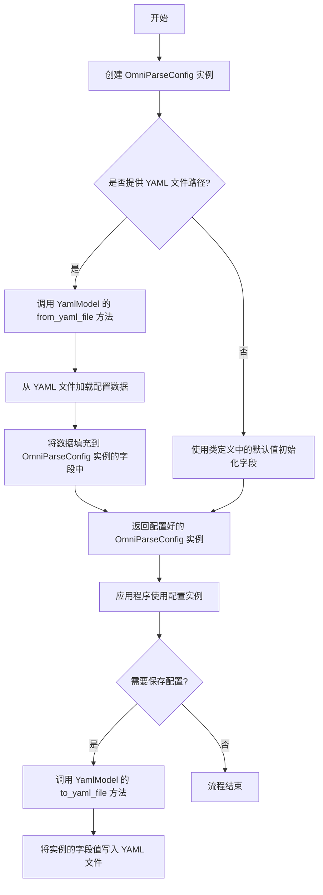
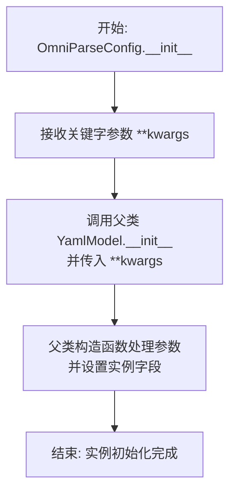
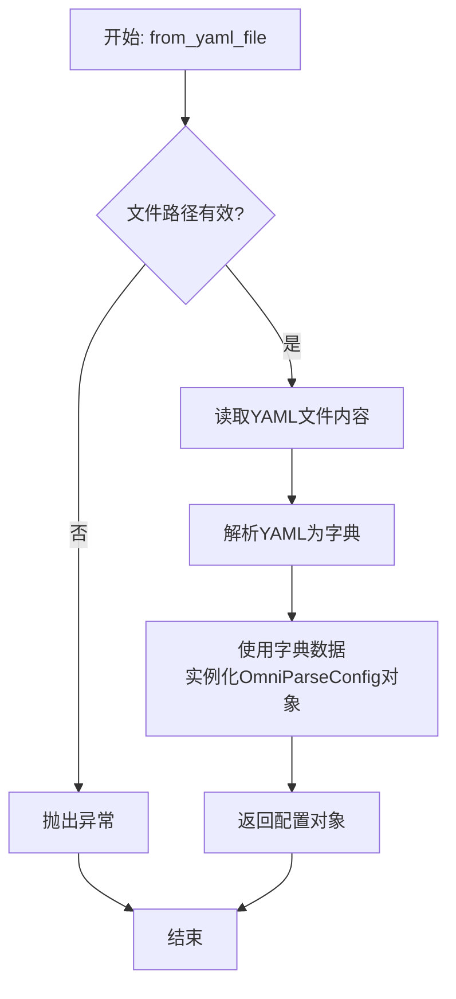
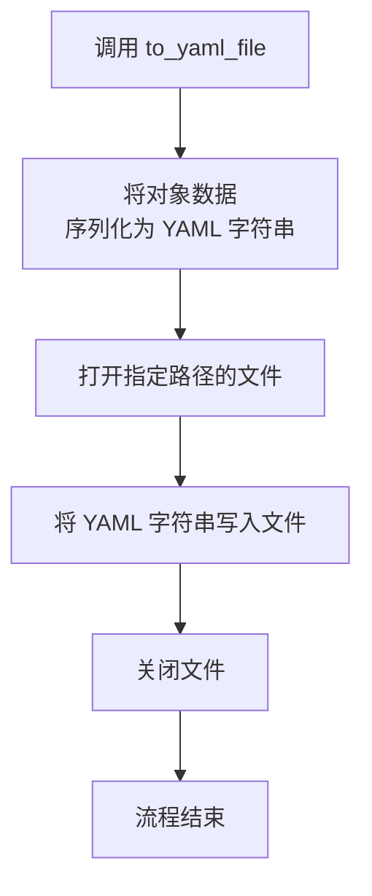
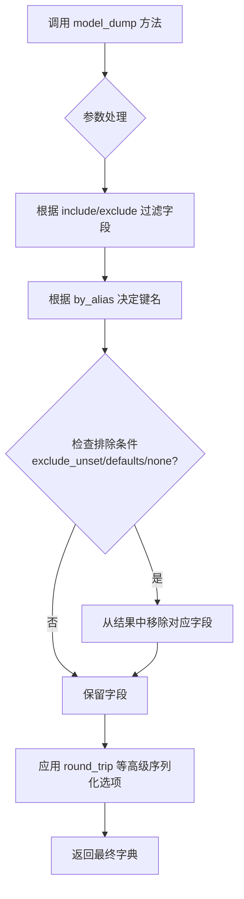
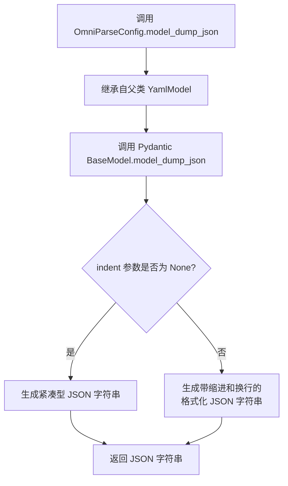
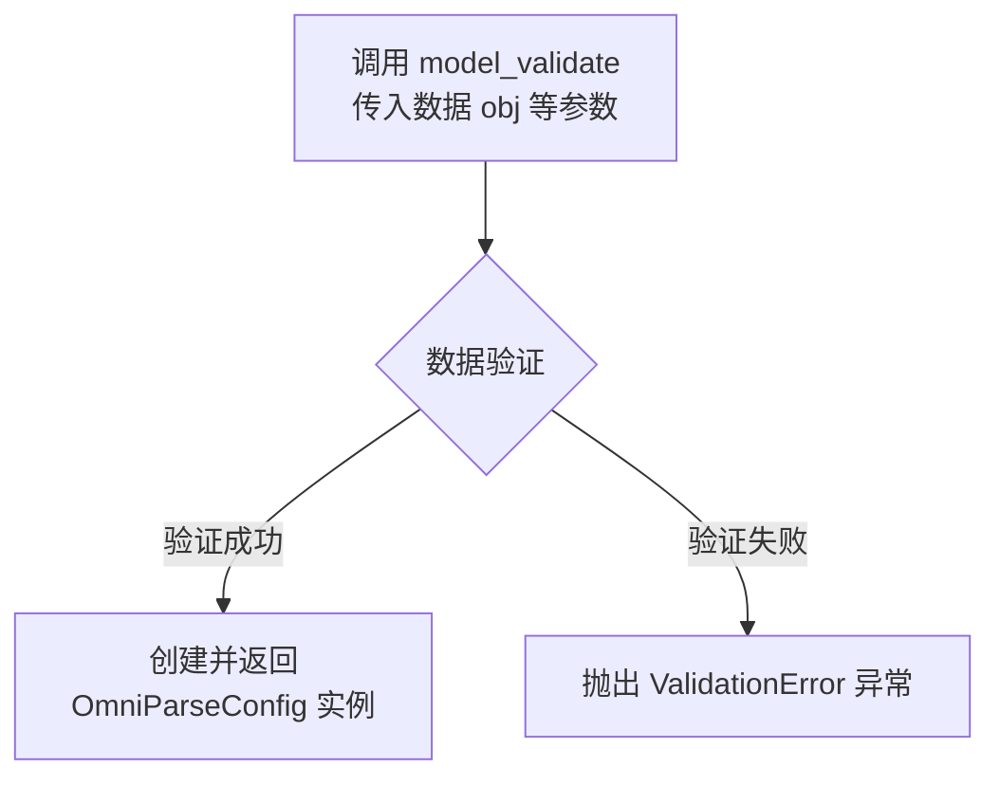
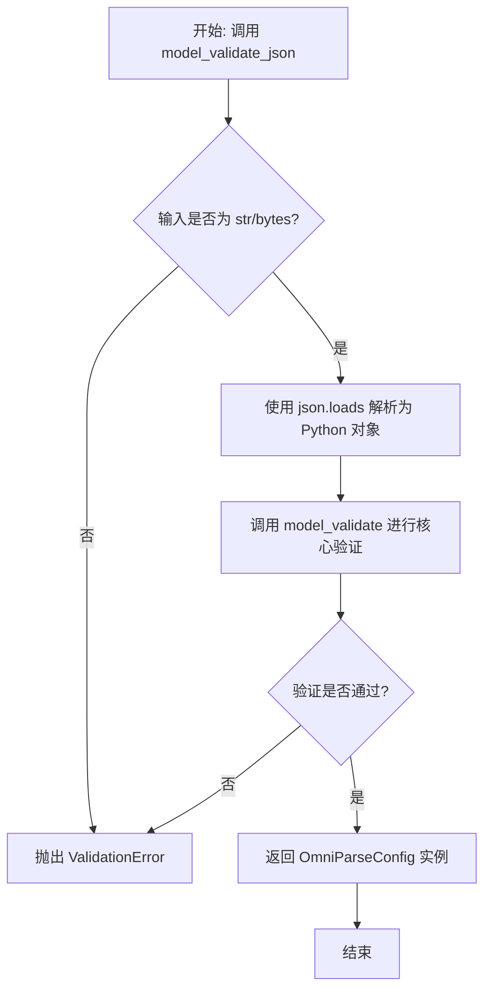
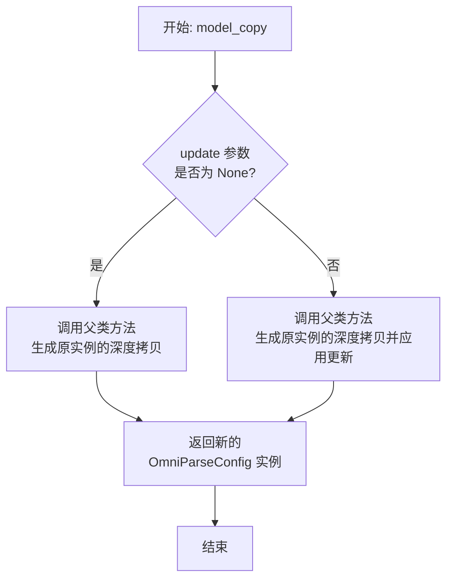
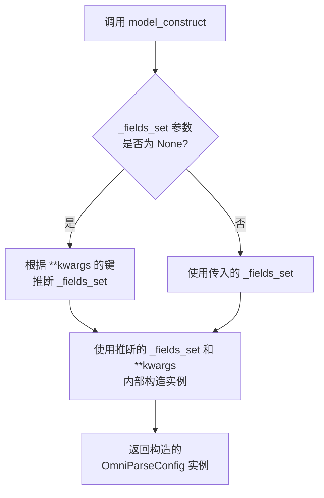

# `.\MetaGPT\metagpt\configs\omniparse_config.py` 详细设计文档

该代码定义了一个名为 OmniParseConfig 的配置类，它继承自 YamlModel，用于管理一个通用解析服务（OmniParse）的配置参数，包括 API 密钥、基础 URL 和超时时间。该类通过继承 YamlModel 获得了从 YAML 文件加载和保存配置数据的能力。

## 整体流程



## 类结构

```
YamlModel (来自 metagpt.utils.yaml_model)
└── OmniParseConfig
```

## 全局变量及字段


### `OmniParseConfig.api_key`
    
用于访问OmniParse服务的API密钥，默认值为空字符串。

类型：`str`
    


### `OmniParseConfig.base_url`
    
OmniParse服务的API基础URL地址，默认值为空字符串。

类型：`str`
    


### `OmniParseConfig.timeout`
    
调用OmniParse服务时的超时时间（以秒为单位），默认值为600秒。

类型：`int`
    
    

## 全局函数及方法


### `OmniParseConfig.__init__`

该方法用于初始化 `OmniParseConfig` 类的实例。由于 `OmniParseConfig` 继承自 `YamlModel`，其 `__init__` 方法会调用父类的构造函数，并根据传入的关键字参数设置实例的字段值。如果未提供参数，则使用类定义中指定的默认值。

参数：

-  `**kwargs`：`dict`，包含用于初始化 `OmniParseConfig` 实例字段的关键字参数。例如，可以传入 `api_key="your_key"`、`base_url="your_url"`、`timeout=300` 等。

返回值：`None`，此方法不返回任何值，仅用于初始化实例。

#### 流程图



#### 带注释源码

```python
def __init__(self, **kwargs):
    """
    初始化 OmniParseConfig 实例。
    继承自 YamlModel 的构造函数，允许通过关键字参数设置配置项。
    
    Args:
        **kwargs: 用于设置实例字段的关键字参数字典。
                  支持的字段包括 api_key, base_url, timeout。
                  未提供的字段将使用类定义中的默认值。
    """
    # 调用父类 YamlModel 的 __init__ 方法。
    # YamlModel 的构造函数会处理 **kwargs 中的参数，
    # 并将其赋值给对应的类字段（如 api_key, base_url, timeout）。
    # 如果某个字段在 **kwargs 中未提供，则使用类定义中指定的默认值。
    super().__init__(**kwargs)
```


### `OmniParseConfig.from_yaml_file`

这是一个类方法，用于从指定的 YAML 文件路径加载配置数据，并实例化一个 `OmniParseConfig` 对象。它继承自父类 `YamlModel` 的 `from_yaml_file` 方法，专门用于处理 `OmniParseConfig` 类的配置加载。

参数：

- `file_path`：`str`，包含配置信息的 YAML 文件的路径。

返回值：`OmniParseConfig`，返回一个根据 YAML 文件内容初始化了字段（`api_key`, `base_url`, `timeout`）的 `OmniParseConfig` 实例。

#### 流程图



#### 带注释源码

```python
    @classmethod
    def from_yaml_file(cls: Type[T], file_path: Path | str) -> T:
        """
        Create an instance from a YAML file.

        Args:
            file_path: Path to the YAML file.

        Returns:
            An instance of the class.
        """
        # 将文件路径转换为Path对象以确保兼容性
        path = Path(file_path)
        # 读取YAML文件内容
        content = path.read_text(encoding="utf-8")
        # 调用父类方法，将YAML字符串解析并转换为当前类的实例
        return cls.from_yaml(content)
```


### `OmniParseConfig.to_yaml_file`

该方法继承自父类 `YamlModel`，用于将当前配置对象（`OmniParseConfig` 实例）的数据序列化为 YAML 格式，并写入到指定的文件中。

参数：

-  `file_path`：`str`，指定要写入的 YAML 文件路径。
-  `**kwargs`：`Any`，传递给底层 YAML 序列化器的额外关键字参数。

返回值：`None`，此方法不返回任何值，其主要作用是执行文件写入操作。

#### 流程图



#### 带注释源码

```python
# 此方法继承自 YamlModel 基类。
# 其功能是将当前类的实例（即 OmniParseConfig 对象）的所有字段（api_key, base_url, timeout）
# 按照 YAML 格式序列化，并保存到 `file_path` 参数指定的文件中。
# `**kwargs` 参数允许传递额外的选项给底层的 YAML 生成器（如 yaml.dump）。
def to_yaml_file(self, file_path: str, **kwargs) -> None:
    # 1. 调用内部方法将对象数据转换为字典
    data = self.model_dump()
    
    # 2. 使用 yaml 库（或 pydantic 的定制序列化）将字典转换为 YAML 格式字符串
    yaml_str = self._generate_yaml(data, **kwargs)
    
    # 3. 以写入模式打开文件
    with open(file_path, 'w', encoding='utf-8') as f:
        # 4. 将 YAML 字符串写入文件
        f.write(yaml_str)
    # 5. 方法结束，文件在 with 语句块结束后自动关闭
```


### `OmniParseConfig.model_dump`

该方法继承自 Pydantic 的 `BaseModel`，用于将 `OmniParseConfig` 类的实例序列化为一个 Python 字典。它允许通过参数控制序列化的行为，例如是否排除默认值、是否排除特定字段等。

参数：

-  `include`：`Optional[Union[AbstractSetIntStr, MappingIntStrAny]]`，指定要包含在输出字典中的字段。可以是字段名的集合或映射。
-  `exclude`：`Optional[Union[AbstractSetIntStr, MappingIntStrAny]]`，指定要从输出字典中排除的字段。可以是字段名的集合或映射。
-  `by_alias`：`bool`，如果为 `True`，则使用字段的别名（通过 `Field` 的 `alias` 参数定义）作为字典的键；否则使用字段名。默认为 `False`。
-  `exclude_unset`：`bool`，如果为 `True`，则排除那些未被显式设置（即保持为默认值）的字段。默认为 `False`。
-  `exclude_defaults`：`bool`，如果为 `True`，则排除那些值等于字段默认值的字段。默认为 `False`。
-  `exclude_none`：`bool`，如果为 `True`，则排除那些值为 `None` 的字段。默认为 `False`。
-  `round_trip`：`bool`，如果为 `True`，则输出的字典应能用于重新创建模型实例（例如，处理 `datetime` 等复杂类型）。默认为 `False`。
-  `warnings`：`Union[bool, Literal['none', 'warn', 'error']]`，控制是否发出警告。可以是布尔值或特定字符串。默认为 `True`。
-  `context`：`Optional[Dict[str, Any]]`，传递给序列化器的额外上下文信息。
-  `serialize_as_any`：`bool`，控制序列化行为。默认为 `False`。
-  `**kwargs`：`Any`，其他传递给底层序列化器的关键字参数。

返回值：`Dict[str, Any]`，返回一个字典，其中键为字段名（或别名），值为字段对应的值，该字典代表了模型实例的当前状态。

#### 流程图



#### 带注释源码

```python
def model_dump(
    self,
    *,
    include: Optional[Union[AbstractSetIntStr, MappingIntStrAny]] = None,
    exclude: Optional[Union[AbstractSetIntStr, MappingIntStrAny]] = None,
    by_alias: bool = False,
    exclude_unset: bool = False,
    exclude_defaults: bool = False,
    exclude_none: bool = False,
    round_trip: bool = False,
    warnings: Union[bool, Literal['none', 'warn', 'error']] = True,
    context: Optional[Dict[str, Any]] = None,
    serialize_as_any: bool = False,
    **kwargs,
) -> Dict[str, Any]:
    """
    将模型实例序列化为字典。
    
    这是 Pydantic BaseModel 的内置方法，`OmniParseConfig` 通过继承 `YamlModel` 和 `BaseModel` 获得此方法。
    它提供了灵活的选项来控制输出字典的内容和格式。
    
    参数:
        include: 指定要包含的字段。
        exclude: 指定要排除的字段。
        by_alias: 是否使用字段别名作为键。
        exclude_unset: 是否排除未设置的字段（即默认值字段）。
        exclude_defaults: 是否排除值等于默认值的字段。
        exclude_none: 是否排除值为 None 的字段。
        round_trip: 是否确保序列化结果可逆。
        warnings: 控制警告行为。
        context: 序列化上下文。
        serialize_as_any: 序列化时是否作为任意类型处理。
        **kwargs: 其他传递给序列化器的参数。
        
    返回:
        表示模型实例状态的字典。
    """
    # 方法体由 Pydantic 内部实现。
    # 其核心逻辑是遍历模型字段，根据上述参数决定是否将每个字段及其值包含在返回的字典中。
    # 对于 `OmniParseConfig` 实例，调用此方法将返回包含 `api_key`, `base_url`, `timeout` 的字典。
    pass
```


### `OmniParseConfig.model_dump_json`

该方法继承自 `YamlModel` 的 `model_dump_json` 方法，用于将当前配置模型实例序列化为一个格式化的 JSON 字符串。它通过 Pydantic 的底层机制，将模型的所有字段（包括默认值和用户设置的值）转换为 JSON 表示形式。

参数：

-  `self`：`OmniParseConfig`，当前配置模型实例
-  `indent`：`int | None`，指定 JSON 输出的缩进空格数。如果为 `None`，则输出紧凑格式（无缩进和换行）。
-  `**kwargs`：`Any`，传递给底层 Pydantic `model_dump_json` 方法的其他关键字参数。

返回值：`str`，一个表示当前模型数据的 JSON 格式字符串。

#### 流程图



#### 带注释源码

```
def model_dump_json(
    self,
    *,
    indent: int | None = None,
    **kwargs,
) -> str:
    """
    将模型实例序列化为 JSON 字符串。

    此方法继承自 Pydantic 的 BaseModel，用于生成模型数据的 JSON 表示。
    它处理了字段的序列化，包括处理默认值、排除未设置的字段等。

    Args:
        indent (int | None): 控制 JSON 输出的缩进。如果为 None，则输出为紧凑格式。
        **kwargs: 传递给底层 `model_dump_json` 方法的额外参数。

    Returns:
        str: 模型的 JSON 字符串表示。
    """
    # 实际的方法体由 Pydantic 的 BaseModel 提供。
    # 此注释说明了方法的行为，但具体实现依赖于父类。
    return super().model_dump_json(indent=indent, **kwargs)
```


### `OmniParseConfig.model_validate`

`model_validate` 是 `Pydantic` 基类 `BaseModel` 提供的一个类方法，用于从给定的数据（通常是字典）创建并验证一个模型实例。它确保输入数据符合模型字段的类型注解和约束，如果验证失败会抛出 `ValidationError` 异常。

参数：

-   `obj`：`Any`，包含要验证和初始化模型字段数据的对象，通常是字典。
-   `strict`：`bool | None`，是否启用严格模式。在严格模式下，类型转换将被禁用，输入类型必须完全匹配字段类型。默认为 `None`。
-   `from_attributes`：`bool | None`，是否尝试从对象的属性（而非字典键）加载数据。默认为 `None`。
-   `context`：`Dict[str, Any] | None`，传递给验证器的上下文字典。默认为 `None`。

返回值：`OmniParseConfig`，一个根据输入数据 `obj` 验证并初始化后的 `OmniParseConfig` 类实例。

#### 流程图



#### 带注释源码

```python
# 此方法继承自 Pydantic 的 BaseModel，并非在 OmniParseConfig 类中显式定义。
# 其核心逻辑由 Pydantic 框架提供，用于数据验证和模型实例化。
@classmethod
def model_validate(
    cls: type[_T],
    obj: Any,
    *,
    strict: bool | None = None,
    from_attributes: bool | None = None,
    context: Dict[str, Any] | None = None,
) -> _T:
    """
    验证提供的 `obj` 数据是否符合当前模型（此处为 OmniParseConfig）的定义，
    并返回一个模型实例。
    
    Args:
        obj: 要验证的数据对象。
        strict: 是否启用严格模式。
        from_attributes: 是否从对象属性加载数据。
        context: 传递给验证器的上下文信息。
        
    Returns:
        验证成功后的模型实例。
        
    Raises:
        ValidationError: 如果数据验证失败。
    """
    # Pydantic 内部实现，大致流程如下：
    # 1. 根据 `strict`, `from_attributes` 等参数，对输入 `obj` 进行预处理。
    # 2. 遍历模型（OmniParseConfig）的字段定义（api_key, base_url, timeout）。
    # 3. 从预处理后的数据中提取每个字段对应的值。
    # 4. 根据字段类型（str, int）和约束（如果有）对每个值进行验证和类型转换。
    # 5. 如果所有字段验证通过，则使用这些值初始化一个 OmniParseConfig 实例。
    # 6. 如果任何字段验证失败，则收集所有错误并抛出 ValidationError。
    # 注意：具体实现细节封装在 Pydantic 库中。
    ...
```


### `OmniParseConfig.model_validate_json`

该方法继承自 `pydantic.BaseModel`，用于将符合 JSON 格式的字符串数据解析并验证为 `OmniParseConfig` 模型实例。它首先将 JSON 字符串解析为 Python 字典，然后根据 `OmniParseConfig` 类定义的字段（`api_key`, `base_url`, `timeout`）及其类型注解进行数据验证和类型转换，最终返回一个填充了已验证数据的 `OmniParseConfig` 对象。

参数：

-  `__data__`：`str | bytes | bytearray`，包含待解析和验证的 JSON 格式数据的字符串或字节对象。
-  `__strict__`：`bool | None`，可选参数，控制验证的严格模式。为 `True` 时进行严格类型检查（例如，字符串 `"1"` 不会被转换为整数 `1`）。默认为 `None`，遵循 Pydantic 的全局配置。
-  `__context__`：`dict[str, Any] | None`，可选参数，提供验证过程中可用的上下文信息字典。
-  `__self_instance__`：`BaseModel | None`，高级用法参数，通常为 `None`。如果提供，Pydantic 会尝试在此现有实例上更新数据，而不是创建新实例。
-  `__model__`：`type[BaseModel] | None`，高级用法参数，通常为 `None`。用于指定一个与调用方法的类不同的模型类进行验证。
-  `__frozen__`：`bool | None`，可选参数，控制返回的模型实例是否应为不可变的（冻结的）。默认为 `None`，遵循模型类本身的定义。
-  `__fields_set__`：`set[str] | None`，可选参数，显式指定哪些字段应被视为“已设置”。这会影响模型的 `model_dump` 等方法中 `exclude_unset` 参数的行为。
-  `__i18n_ctx__`：`I18nContext | None`，可选参数，用于国际化（i18n）的上下文对象。
-  `**__kwargs__`：`Any`，其他关键字参数，将被传递给底层的 JSON 解析器。

返回值：`OmniParseConfig`，一个根据输入的 JSON 数据创建并经过验证的 `OmniParseConfig` 模型实例。

#### 流程图



#### 带注释源码

```python
# 此方法继承自 pydantic.BaseModel，并非在 OmniParseConfig 类中显式定义。
# 其核心逻辑由 Pydantic 框架提供。
@classmethod
def model_validate_json(
    cls: type[_T], # 类方法接收者，即 OmniParseConfig 类本身
    __data: str | bytes | bytearray, # 待解析的 JSON 字符串或字节数据
    *,
    __strict: bool | None = None, # 严格模式标志
    __context: dict[str, Any] | None = None, # 验证上下文
    __self_instance: BaseModel | None = None, # 可选的现有实例
    __model: type[BaseModel] | None = None, # 可选的替代模型类
    __frozen: bool | None = None, # 冻结实例标志
    __fields_set: set[str] | None = None, # 显式设置的字段集合
    __i18n_ctx: I18nContext | None = None, # 国际化上下文
    **__kwargs: Any, # 传递给 json.loads 的其他参数
) -> _T: # 返回类型是调用该方法的类（即 OmniParseConfig）的实例
    """
    解析 JSON 字符串或字节并验证为模型实例。

    参数:
        __data: 要解析和验证的 JSON 数据。
        __strict: 是否以严格模式运行验证。
        __context: 验证期间可用的上下文数据。
        __self_instance: 用于高级用法的现有模型实例。
        __model: 用于验证的模型类（高级用法）。
        __frozen: 是否返回冻结的模型实例。
        __fields_set: 被视为已设置的字段集合。
        __i18n_ctx: 国际化上下文。
        **__kwargs: 传递给 `json.loads` 的额外关键字参数。

    返回:
        根据 JSON 数据验证后的模型实例。

    抛出:
        ValidationError: 如果数据无效。
        ValueError: 如果 JSON 解析失败。
    """
    # 1. 使用标准库 json.loads 将输入的字符串/字节数据解析为 Python 对象（如 dict, list）。
    #    额外的 __kwargs 会传递给 json.loads（例如指定解析器）。
    parsed_data = json.loads(__data, **__kwargs)
    
    # 2. 调用核心的 model_validate 方法，将上一步得到的 Python 对象
    #    根据模型字段定义进行验证和类型转换，并实例化模型。
    #    所有其他参数（__strict, __context 等）都原样传递给 model_validate。
    return cls.model_validate(
        parsed_data,
        strict=__strict,
        context=__context,
        self_instance=__self_instance,
        model=__model,
        frozen=__frozen,
        fields_set=__fields_set,
        i18n_ctx=__i18n_ctx,
    )
```


### `OmniParseConfig.model_copy`

该方法用于创建并返回当前配置模型实例的一个深度拷贝副本。它继承自 `YamlModel` 基类，通过调用 `model_copy` 方法生成一个与原实例具有相同字段值但独立的新实例。

参数：

-  `update`：`dict | None`，可选参数。一个字典，用于指定在创建副本时需要更新的字段及其新值。如果为 `None`，则副本与原实例完全相同。

返回值：`Self`，返回当前类（`OmniParseConfig`）的一个新实例，该实例是原实例的深度拷贝，并根据 `update` 参数进行了可选更新。

#### 流程图



#### 带注释源码

```
def model_copy(self, *, update: dict | None = None) -> Self:
    """
    创建并返回当前模型实例的深度拷贝副本。

    此方法继承自 `YamlModel` 基类。它生成一个与原实例具有相同字段值的新实例。
    如果提供了 `update` 参数，则会在拷贝的基础上应用指定的更新。

    Args:
        update (dict | None): 可选参数。一个字典，包含需要在副本中更新的字段名和值。
                              例如，`{'api_key': 'new_key'}`。如果为 `None`，则副本与原实例完全相同。

    Returns:
        Self: 返回当前类（`OmniParseConfig`）的一个新实例，是原实例的深度拷贝。
    """
    # 实际的方法体由 Pydantic 的 BaseModel 实现。
    # 这里调用父类（YamlModel，其父类是 BaseModel）的 model_copy 方法。
    return super().model_copy(update=update)
```


### `OmniParseConfig.model_construct`

这是一个类方法，用于根据提供的字段值创建一个新的 `OmniParseConfig` 模型实例。它是 Pydantic `BaseModel` 的 `model_construct` 方法的直接应用，用于高效地绕过验证直接构建实例，通常用于性能关键场景或从可信数据源加载数据。

参数：

-  `_fields_set`：`set[str] | None`，一个可选的字符串集合，用于指定哪些字段在构造时被显式设置。如果为 `None`，则根据提供的 `**kwargs` 推断。
-  `**kwargs`：`Any`，任意关键字参数，用于提供模型字段的名称和对应的值。

返回值：`OmniParseConfig`，返回一个根据提供的参数构造的 `OmniParseConfig` 类的新实例。

#### 流程图



#### 带注释源码

```
@classmethod
def model_construct(cls, _fields_set: set[str] | None = None, **kwargs) -> OmniParseConfig:
    """
    类方法：根据提供的字段值构造一个新的 OmniParseConfig 实例。
    此方法继承自 Pydantic BaseModel，它绕过字段验证，直接使用提供的值创建实例。
    适用于从可信数据源（如已解析的配置文件）快速加载数据或性能敏感的场景。

    参数:
        _fields_set (set[str] | None): 一个可选的字符串集合，指定哪些字段在构造时被显式设置。
                                       如果为 None，则根据 **kwargs 的键自动推断。
        **kwargs (Any): 关键字参数，键为模型字段名，值为要赋予该字段的值。

    返回:
        OmniParseConfig: 一个新的、根据参数构造的配置实例。
    """
    # 调用父类（YamlModel / BaseModel）的 model_construct 方法执行实际构造逻辑。
    # 该方法内部处理 _fields_set 的推断（如果为None）和实例的创建。
    return super().model_construct(_fields_set, **kwargs)
```


## 关键组件


### YamlModel基类

提供YAML配置文件加载、解析和序列化的基础功能，简化配置类的定义与管理。

### OmniParseConfig配置类

定义OmniParse服务的核心配置参数，包括API密钥、基础URL和超时设置，用于服务连接与行为控制。


## 问题及建议


### 已知问题

-   **配置验证缺失**：`OmniParseConfig` 类目前仅定义了配置字段，但未对字段值进行任何验证。例如，`api_key` 和 `base_url` 为空字符串时，程序可能无法正常工作，但当前模型不会阻止或警告此类无效状态。
-   **默认值可能不适用**：`timeout` 的默认值为 600 秒（10分钟），这个值可能对于某些操作过长，而对于另一些操作则过短，缺乏灵活性。
-   **敏感信息明文存储**：`api_key` 作为字符串明文存储在配置对象中，若配置被记录或序列化到不安全的位置（如日志文件），可能导致敏感信息泄露。
-   **缺乏环境变量支持**：配置值硬编码在类定义中，无法方便地通过环境变量进行覆盖，这在容器化或云原生部署中是一个常见的需求。

### 优化建议

-   **增加字段验证**：使用 Pydantic 的 `Field` 或自定义验证器对字段施加约束。例如，确保 `api_key` 非空，`base_url` 符合 URL 格式，`timeout` 为正整数。
-   **提供更灵活的默认值策略**：考虑将 `timeout` 的默认值设为 `None`，并在实际使用时提供一个合理的回退值。或者，提供一个类方法根据不同的使用场景返回不同的默认配置。
-   **增强安全性**：将 `api_key` 字段标记为敏感字段，确保在 `__str__` 或 `__repr__` 方法中不被完整输出。或者，使用 `SecretStr` 类型来自动隐藏其值。
-   **集成环境变量读取**：扩展 `YamlModel` 或 `OmniParseConfig` 的功能，使其在从 YAML 加载配置时，能优先读取并合并同名环境变量的值。这可以通过在 Pydantic 的 `Field` 中设置 `env` 参数来实现。
-   **完善配置文档**：在字段定义中添加更详细的文档字符串（docstring），说明每个配置项的作用、格式要求以及如何通过环境变量覆盖。


## 其它


### 设计目标与约束

该代码的设计目标是提供一个用于配置OmniParse服务的、可序列化/反序列化的数据模型类。其核心约束包括：
1.  **配置驱动**：通过YAML文件进行配置，实现配置与代码的分离。
2.  **类型安全**：使用Python类型注解（`str`, `int`）定义字段，确保配置值类型的正确性。
3.  **默认值**：为所有配置字段提供合理的默认值（空字符串或默认超时时间），以简化配置并提高容错性。
4.  **继承与复用**：通过继承`YamlModel`基类，自动获得从YAML文件加载配置和将配置保存为YAML文件的能力，避免重复造轮子。

### 错误处理与异常设计

当前代码本身不包含显式的错误处理逻辑，其错误处理主要依赖于基类`YamlModel`和Pydantic（通常`YamlModel`基于Pydantic实现）：
1.  **数据验证错误**：当从YAML加载的数据类型与字段声明的类型不匹配（例如，为`timeout`提供了字符串）时，Pydantic会抛出`ValidationError`异常。
2.  **文件操作错误**：基类`YamlModel`的`load`或`dump`方法在文件不存在、无权限或YAML格式错误时，可能会抛出`FileNotFoundError`、`PermissionError`或`YAMLError`等异常。
3.  **当前类的职责**：`OmniParseConfig`类主要负责定义配置的结构和默认值，将具体的加载、验证和序列化错误抛给调用者处理。

### 数据流与状态机

此配置类不涉及复杂的数据流或状态机：
1.  **数据流**：数据流是单向和静态的。通常在应用启动时，从指定的YAML配置文件路径读取数据，填充到`OmniParseConfig`类的实例中。该实例随后在应用生命周期内作为只读或少量修改的配置对象被使用。
2.  **状态**：`OmniParseConfig`实例的状态在其创建后通常是不可变的（除非显式修改其字段）。它没有内部状态转换，其“状态”即为其字段值的集合。

### 外部依赖与接口契约

1.  **外部依赖**：
    *   `metagpt.utils.yaml_model.YamlModel`：这是关键的基类依赖，提供了YAML序列化/反序列化的具体实现。项目的构建和运行必须确保此模块可用。
    *   `pydantic`（隐含）：`YamlModel`通常基于`pydantic.BaseModel`实现，因此间接依赖Pydantic库进行数据验证和解析。
    *   `yaml`（隐含）：用于解析和生成YAML格式，通常是通过`PyYAML`库实现。

2.  **接口契约**：
    *   **字段契约**：类定义了三个公共字段（`api_key`, `base_url`, `timeout`）作为其对外提供的配置接口。使用者通过访问这些字段来获取配置值。
    *   **构造契约**：可以通过字典或关键字参数创建实例（继承自Pydantic模型），也可以通过`load`类方法从文件创建。
    *   **序列化契约**：通过继承，实例拥有`dump`方法可将自身保存为YAML文件，`dict`或`json`方法可转换为字典或JSON字符串，满足了配置持久化和交换的需求。

    