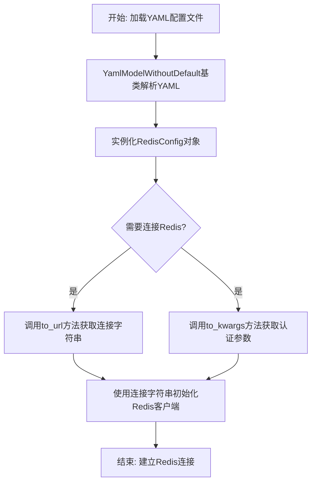
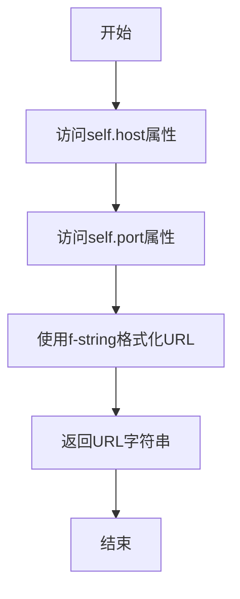

# `.\MetaGPT\metagpt\configs\redis_config.py` 详细设计文档

该代码定义了一个Redis配置类，用于从YAML文件加载Redis连接参数（主机、端口、用户名、密码、数据库），并提供将这些参数转换为连接URL和关键字参数字典的方法，以便于与Redis客户端库集成。

## 整体流程



## 类结构

```
YamlModelWithoutDefault (基类，提供YAML解析能力)
└── RedisConfig (Redis配置模型)
```

## 全局变量及字段


### `RedisConfig.host`
    
Redis服务器的主机地址或域名。

类型：`str`
    


### `RedisConfig.port`
    
Redis服务器监听的端口号。

类型：`int`
    


### `RedisConfig.username`
    
用于连接Redis的用户名，默认为空字符串。

类型：`str`
    


### `RedisConfig.password`
    
用于连接Redis的密码。

类型：`str`
    


### `RedisConfig.db`
    
要连接的Redis数据库编号或标识符。

类型：`str`
    
    

## 全局函数及方法


### `RedisConfig.to_url`

该方法将Redis配置对象转换为一个Redis连接URL字符串。它使用配置中的主机地址（host）和端口号（port）来构建一个标准的Redis URL，格式为 `redis://{host}:{port}`。此URL通常用于建立到Redis服务器的基本连接。

参数：

-  `self`：`RedisConfig`，Redis配置对象实例本身，用于访问其`host`和`port`属性。

返回值：`str`，一个格式为 `redis://{host}:{port}` 的Redis连接URL字符串。

#### 流程图



#### 带注释源码

```python
def to_url(self):
    # 使用f-string格式化，将self.host和self.port的值插入到URL模板中
    return f"redis://{self.host}:{self.port}"
```


### `RedisConfig.to_kwargs`

该方法将 `RedisConfig` 实例中用于连接 Redis 数据库的认证和配置信息（用户名、密码、数据库编号）提取并封装成一个字典（kwargs），以便于传递给 Redis 客户端库的连接函数。

参数：

-  `self`：`RedisConfig`，表示调用该方法的 `RedisConfig` 类实例本身。

返回值：`dict`，返回一个包含键 `"username"`、`"password"` 和 `"db"` 的字典，其对应的值分别来自当前实例的同名字段。

#### 流程图

```mermaid
flowchart TD
    A[开始: to_kwargs()] --> B[构建字典<br>username: self.username]
    B --> C[构建字典<br>password: self.password]
    C --> D[构建字典<br>db: self.db]
    D --> E[返回构建好的字典]
    E --> F[结束]
```

#### 带注释源码

```python
def to_kwargs(self):
    # 返回一个字典，包含用于Redis连接的关键参数。
    # 这些参数通常作为关键字参数（kwargs）传递给Redis客户端。
    return {
        "username": self.username,  # Redis 用户名，可能为空字符串
        "password": self.password,  # Redis 认证密码
        "db": self.db,              # 要连接的Redis数据库编号
    }
```


## 关键组件


### YamlModelWithoutDefault 基类

一个用于从YAML文件加载配置但不提供默认值的基类，简化了配置类的定义。

### RedisConfig 配置类

一个用于封装Redis连接配置（主机、端口、用户名、密码、数据库）的数据类，并提供了转换为连接URL和参数字典的方法。


## 问题及建议


### 已知问题

-   **字段 `db` 的类型定义与实际使用场景不匹配**：代码中将 `db` 字段定义为 `str` 类型，但在 Redis 连接上下文中，数据库索引通常是一个整数（`int`）。这可能导致在调用 `to_kwargs` 方法返回的字典中，`db` 的值是字符串类型，与某些 Redis 客户端库（如 `redis-py`）期望的整数类型不兼容，从而引发运行时错误或类型警告。
-   **缺少关键字段的默认值或验证**：`password` 字段被定义为必需的（没有默认值），但在某些开发或测试环境中，Redis 实例可能没有设置密码。强制要求密码可能导致配置不灵活。此外，`host` 和 `port` 等关键连接字段也缺少默认值，增加了配置的复杂性。
-   **`to_url` 方法生成的连接字符串不完整**：`to_url` 方法生成的 Redis URL (`redis://{host}:{port}`) 没有包含认证信息（用户名和密码）以及数据库选择（`db`）。这是一个不完整的连接字符串，无法直接用于需要完整认证信息的 Redis 客户端连接。
-   **继承的基类 `YamlModelWithoutDefault` 功能不明确**：代码依赖于外部基类 `YamlModelWithoutDefault` 来提供 YAML 序列化/反序列化功能，但该基类的具体行为（例如，如何处理缺失字段、类型转换规则等）未在代码中明确。如果基类的行为与 `RedisConfig` 的预期不符（例如，对 `db` 字段进行严格的字符串类型校验），可能会引入隐藏的错误。

### 优化建议

-   **修正 `db` 字段的类型**：将 `db` 字段的类型从 `str` 改为 `int`，以符合 Redis 数据库索引的通用实践，并确保与下游 Redis 客户端库的兼容性。
-   **为字段提供合理的默认值并增加灵活性**：
    -   为 `host` 和 `port` 提供合理的默认值（例如，`host="localhost"`, `port=6379`），以简化常见场景下的配置。
    -   将 `password` 字段的默认值设为空字符串 (`""`) 或 `None`，并确保 `to_kwargs` 方法能正确处理空密码的情况（例如，当密码为空时，不将 `password` 键加入返回的字典，或者传递空字符串，具体取决于客户端库的要求）。
    -   考虑将 `username` 也设为可选（目前已有默认值 `""`，是好的做法）。
-   **增强 `to_url` 方法**：重构 `to_url` 方法，使其能够生成包含认证信息和数据库选择的完整 Redis 连接 URL。格式通常为 `redis://[username:password@]host:port[/db]`。需要处理用户名、密码为空的情况。
-   **明确基类依赖或实现独立的序列化方法**：如果可能，应审查或明确 `YamlModelWithoutDefault` 基类的行为，确保其满足 `RedisConfig` 的需求。或者，考虑在类中实现独立的 `from_yaml` 和 `to_yaml` 类方法/实例方法，减少对不透明基类的依赖，提高代码的可控性和可读性。
-   **增加数据验证**：可以使用 Pydantic 等数据验证库（如果项目已引入或允许引入）来替代或增强当前的模型定义。Pydantic 能提供强大的类型检查、默认值设置、自定义验证器等功能，能更优雅地解决上述类型和验证问题。
-   **补充文档字符串**：为类和方法添加详细的文档字符串（docstring），说明每个字段的含义、`to_url` 和 `to_kwargs` 方法返回值的具体格式及使用场景，提高代码的可维护性。


## 其它


### 设计目标与约束

该代码的设计目标是提供一个轻量级、类型安全的Redis配置管理类，用于封装Redis连接所需的参数（主机、端口、用户名、密码、数据库），并提供便捷的方法将这些参数转换为连接字符串（URL）和关键字参数字典（kwargs）。主要约束包括：继承自`YamlModelWithoutDefault`以实现YAML配置文件的序列化与反序列化，保持与项目配置管理框架的兼容性；字段定义需使用类型注解以支持运行时类型检查；`username`字段提供默认值以适应非认证场景。

### 错误处理与异常设计

当前代码未显式包含错误处理逻辑。潜在的异常可能来源于：1. 父类`YamlModelWithoutDefault`在从YAML加载配置时，若字段缺失或类型不匹配可能抛出验证异常（如`pydantic.ValidationError`）。2. `to_url`和`to_kwargs`方法在字段值为`None`或无效类型时，可能引发`TypeError`或生成格式错误的字符串。建议的改进是：在`to_url`和`to_kwargs`方法内部添加空值或类型检查，或依赖父类的字段验证确保数据有效性。

### 数据流与状态机

该类为无状态的数据持有类（Data Holder），其生命周期内的典型数据流为：1. **初始化/加载**：通过构造函数传入参数或由父类`YamlModelWithoutDefault`从YAML配置文件解析并实例化，完成各字段的赋值。2. **使用**：外部代码调用`to_url()`获取Redis连接URL，调用`to_kwargs()`获取连接认证参数字典。这两个方法仅读取实例字段，不修改任何状态，是纯函数。不存在复杂的状态变迁。

### 外部依赖与接口契约

1.  **外部依赖**：
    *   `metagpt.utils.yaml_model.YamlModelWithoutDefault`：作为基类，提供YAML序列化/反序列化能力。这隐含依赖了`pydantic`库进行数据验证和可能依赖`yaml`库进行文件解析。
    *   `typing`：用于字段的类型注解（`str`, `int`）。
2.  **接口契约（对外提供的API）**：
    *   `__init__`方法（继承并受父类约束）：用于创建配置实例。
    *   `to_url() -> str`：返回格式为`"redis://{host}:{port}"`的连接字符串。
    *   `to_kwargs() -> dict`：返回包含`username`, `password`, `db`的字典。
    *   通过继承获得的YAML加载/保存方法（如`from_yaml_file`, `to_yaml_file`）。

### 配置管理与序列化

该类核心功能之一是作为配置模型。通过继承`YamlModelWithoutDefault`，它自动获得了从YAML格式配置文件加载配置、以及将配置保存为YAML文件的能力。字段的类型注解（如`host: str`, `port: int`）不仅用于文档和IDE提示，更被`pydantic`（推测是`YamlModelWithoutDefault`的基础）用于在加载时进行数据解析和验证，确保配置数据的类型安全。`username`字段设置了默认值`""`，使其在配置文件中可选。

### 安全考虑

1.  **敏感信息暴露**：`password`字段以明文形式存储。在日志记录、调试信息或`__repr__`/`__str__`方法中，应避免直接输出密码。当前类未重写这些方法，需注意父类的默认行为。
2.  **配置存储安全**：包含密码的YAML配置文件应有严格的文件系统权限控制，避免未授权访问。
3.  **连接安全**：生成的URL（`redis://...`）是明文协议。如果Redis服务配置了SSL/TLS，此类当前不支持生成`rediss://`格式的URL，这是一个安全功能上的缺失。


    