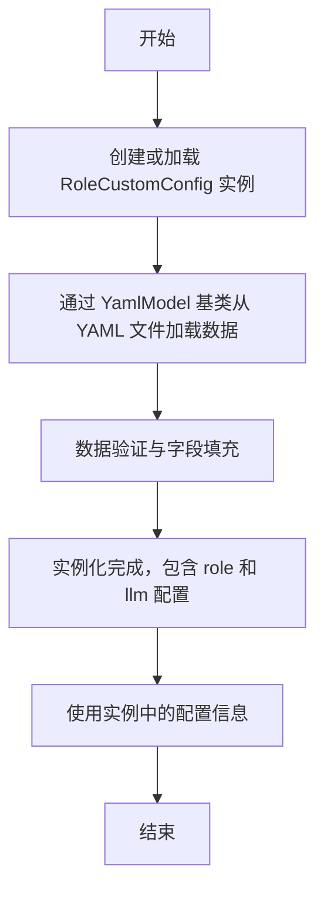

# `.\MetaGPT\metagpt\configs\role_custom_config.py` 详细设计文档

该代码定义了一个用于角色自定义配置的数据模型类 `RoleCustomConfig`。它继承自 `YamlModel`，使其能够方便地从 YAML 文件加载和序列化配置数据。其核心功能是封装特定角色（通过 `role` 字段标识）的配置信息，目前主要包含该角色所使用的语言模型配置（`llm` 字段）。

## 整体流程



## 类结构

```
YamlModel (基类，提供 YAML 序列化/反序列化能力)
└── RoleCustomConfig (角色自定义配置模型)
```

## 全局变量及字段


### `RoleCustomConfig.role`
    
角色的类名或角色ID，用于标识特定的角色配置。

类型：`str`
    


### `RoleCustomConfig.llm`
    
大语言模型（LLM）的配置对象，包含模型参数、API密钥等设置。

类型：`LLMConfig`
    
    

## 全局函数及方法


## 关键组件


### RoleCustomConfig 类

一个用于定义角色自定义配置的YAML数据模型类，支持从YAML文件加载和序列化配置信息。

### LLMConfig 类（外部依赖）

一个用于定义大语言模型（LLM）配置的数据模型类，作为RoleCustomConfig中`llm`字段的类型，用于配置角色所使用的LLM参数。

### YamlModel 基类（外部依赖）

一个提供YAML序列化与反序列化功能的基类，RoleCustomConfig继承自此类，从而获得了从YAML文件加载配置和将配置保存为YAML格式的能力。


## 问题及建议


### 已知问题

-   **字段默认值不明确**：`role` 字段的默认值为空字符串 `""`，这可能导致在未显式设置该字段时，对象处于一个语义上不明确的状态（例如，一个没有角色标识的配置对象）。
-   **缺乏验证逻辑**：类定义中没有对关键字段（如 `role` 和 `llm`）进行有效性验证。例如，`role` 字段为空字符串或 `llm` 字段为 `None` 时，可能导致下游使用该配置的代码出现运行时错误。
-   **扩展性注释模糊**：类文档字符串中提到“To be expanded”，表明这是一个待扩展的类，但当前结构过于简单，可能无法满足未来复杂的角色定制需求，缺乏明确的扩展方向指导。
-   **强耦合于特定配置类型**：`llm` 字段被固定为 `LLMConfig` 类型，这降低了配置的灵活性。如果未来需要支持其他类型的配置（如不同的模型提供商配置），可能需要修改此类的定义。

### 优化建议

-   **明确默认值与必填项**：考虑将 `role` 字段设置为必填项（移除默认值），并在 `__init__` 方法或通过 Pydantic（如果 `YamlModel` 基于它）的 `Field` 进行约束，确保实例化时必须提供有效的角色标识。或者，提供一个更具意义的默认值（如 `"default_role"`）并明确其语义。
-   **增加数据验证**：利用 Pydantic 的验证器（validator）或字段约束（如 `constr`、`Field(..., min_length=1)`）来确保 `role` 非空，并且 `llm` 是一个有效的 `LLMConfig` 实例。这可以在对象创建时尽早发现问题。
-   **设计可扩展的配置结构**：将 `llm` 字段的类型声明为更通用的基类或协议（Protocol），或者使用 `Union` 类型来支持多种配置类型。同时，可以定义一个配置字典字段（如 `extra_config: Dict[str, Any] = {}`）来容纳未来可能出现的、尚未结构化的定制参数，并通过清晰的文档说明其用法。
-   **完善文档与示例**：在类文档字符串中补充更详细的使用示例，并说明扩展此类时应遵循的约定。如果计划支持动态字段，应明确其命名规范和处理逻辑。


## 其它


### 设计目标与约束

本模块的设计目标是提供一个可扩展的、基于YAML配置的角色自定义配置模型。其核心约束包括：
1.  **向后兼容性**：作为`YamlModel`的子类，必须保持与父类序列化/反序列化方法的兼容性。
2.  **可扩展性**：`RoleCustomConfig`类的字段设计应允许未来轻松添加新的配置项（如`prompt_templates`, `memory_config`等），而无需破坏现有结构。
3.  **强类型与验证**：利用Pydantic（通过`YamlModel`）提供运行时类型检查和数据验证，确保配置数据的完整性和正确性。
4.  **最小化依赖**：当前仅依赖项目内部的`LLMConfig`和`YamlModel`，旨在保持模块的轻量和内聚。

### 错误处理与异常设计

当前代码未显式定义自定义异常，错误处理主要依赖于Pydantic模型的基础验证机制：
1.  **数据验证错误**：当从YAML文件加载数据并实例化`RoleCustomConfig`对象时，如果提供的`role`或`llm`字段不符合类型要求（例如`llm`不是有效的`LLMConfig`字典），Pydantic将抛出`ValidationError`异常。调用方需要捕获并处理此异常。
2.  **缺失字段错误**：`role`字段有默认值，但`llm`字段没有。如果YAML配置中缺少`llm`字段，Pydantic同样会抛出`ValidationError`。
3.  **YAML解析错误**：在`YamlModel`的`load`或`loads`方法中，如果YAML格式非法，会抛出YAML解析器相关的异常（如`yaml.YAMLError`）。
**建议的显式错误处理**：可以定义项目级或模块级的自定义异常（如`RoleConfigError`），在配置加载或验证的更高层级封装底层异常，提供更清晰的错误上下文。

### 数据流与状态机

本模块是一个静态配置模型，不涉及运行时状态变化或复杂的数据流。其数据流是单向和一次性的：
1.  **初始化/加载阶段**：数据从外部YAML配置文件或字典，通过`YamlModel`的解析和验证逻辑，流入并初始化`RoleCustomConfig`对象的字段（`role`, `llm`）。
2.  **使用阶段**：初始化后的`RoleCustomConfig`对象作为只读的数据持有者（Data Holder），其字段值被系统的其他部分（如角色初始化逻辑）读取和使用。对象本身在生命周期内状态保持不变，不包含任何状态机。

### 外部依赖与接口契约

1.  **外部依赖**：
    *   `metagpt.configs.llm_config.LLMConfig`：作为`llm`字段的类型，定义了角色所用大语言模型的详细配置。`RoleCustomConfig`依赖于`LLMConfig`的结构和验证逻辑。
    *   `metagpt.utils.yaml_model.YamlModel`：作为父类，提供了从YAML文件或字符串序列化/反序列化对象的能力。这隐式依赖了`pydantic`（用于数据验证和模型定义）和`yaml`（用于YAML解析）库。
2.  **接口契约**：
    *   **提供方契约**：`RoleCustomConfig`类承诺提供一个符合其字段定义的、已验证的配置对象。它通过Pydantic模型公开了`role`（字符串）和`llm`（`LLMConfig`对象）这两个属性。
    *   **消费方契约**：使用`RoleCustomConfig`的代码（消费者）应通过其公共属性（`role`, `llm`）访问配置，并信任这些数据已经过基本验证。消费者不应修改这些属性。
    *   **配置源契约**：提供给`RoleCustomConfig.from_yaml_file`或`RoleCustomConfig.from_dict`的原始数据（YAML文件或字典）必须包含一个能转换为`LLMConfig`对象的`llm`键，以及一个可选的`role`键。

### 配置管理与持久化

1.  **配置源**：配置主要来源于YAML格式的文本文件，通过继承`YamlModel`获得加载（`load`）和保存（`save`）能力。
2.  **持久化格式**：持久化的YAML文件结构应与`RoleCustomConfig`类的字段定义严格对应。例如：
    ```yaml
    role: "SalesAgent"
    llm:
      api_key: "sk-..."
      model: "gpt-4"
      temperature: 0.7
      # ... 其他LLMConfig字段
    ```
3.  **配置生命周期**：配置通常在系统启动时加载，并贯穿对应角色的整个生命周期。目前不支持配置的热重载（Hot Reload），修改配置后需要重启相关服务或重新初始化角色。
4.  **多环境支持**：当前类本身不直接处理多环境（如开发、测试、生产）配置。这通常由更高层的配置管理逻辑负责，例如通过指定不同的YAML文件路径来为不同环境加载不同的`RoleCustomConfig`实例。

    