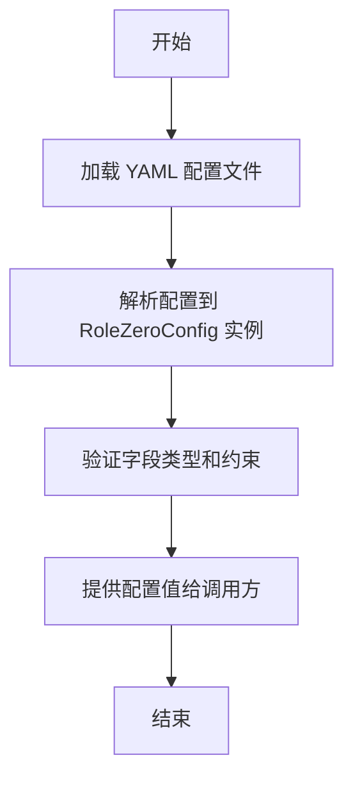

# `.\MetaGPT\metagpt\configs\role_zero_config.py` 详细设计文档

该代码定义了一个名为 RoleZeroConfig 的配置类，它继承自 YamlModel，用于管理角色（Role）的长期记忆和短期记忆相关的配置参数。通过 Pydantic 的 Field 提供默认值和描述，支持从 YAML 文件加载和验证配置。

## 整体流程



## 类结构

```
YamlModel (基类，提供 YAML 序列化/反序列化)
└── RoleZeroConfig (角色零配置类)
```

## 全局变量及字段


### `RoleZeroConfig.enable_longterm_memory`
    
是否启用长期记忆功能。

类型：`bool`
    


### `RoleZeroConfig.longterm_memory_persist_path`
    
用于保存长期记忆数据的目录路径。

类型：`str`
    


### `RoleZeroConfig.memory_k`
    
短期记忆的容量上限。

类型：`int`
    


### `RoleZeroConfig.similarity_top_k`
    
从长期记忆中检索时，返回的最相似记忆条目的数量。

类型：`int`
    


### `RoleZeroConfig.use_llm_ranker`
    
是否使用LLM重排序器来优化检索结果。

类型：`bool`
    
    

## 全局函数及方法


## 关键组件


### 配置管理组件

通过Pydantic模型定义角色配置，支持从YAML文件加载和验证配置项，实现配置的集中管理和类型安全。

### 字段验证与默认值组件

利用Pydantic的Field类为配置字段提供默认值、类型约束和描述性文档，确保配置数据的完整性和可读性。

### 序列化/反序列化组件

继承YamlModel，提供将配置对象与YAML格式相互转换的能力，简化配置的持久化和读取过程。


## 问题及建议


### 已知问题

-   **配置项默认值固化在代码中**：`longterm_memory_persist_path`、`memory_k` 等关键参数的默认值直接硬编码在类定义中。这使得在不修改代码的情况下，难以根据不同的部署环境（如开发、测试、生产）或用户需求调整默认配置，降低了部署的灵活性。
-   **缺乏配置验证与约束**：虽然使用了 Pydantic 进行类型注解，但未对字段值施加更具体的业务逻辑约束。例如，`memory_k` 和 `similarity_top_k` 应为正整数，`longterm_memory_persist_path` 应为一个有效的目录路径字符串。目前缺少此类验证，可能导致运行时出现非预期行为。
-   **配置项描述可能不足**：部分字段的 `description` 可能过于简略。例如，`use_llm_ranker` 的描述“Whether to use LLM Reranker to get better result.”未说明其具体工作原理、性能影响或与 `similarity_top_k` 等参数的交互关系，这可能会增加使用者的理解成本。

### 优化建议

-   **将默认配置外部化**：建议将默认配置值移出代码，存储到配置文件（如 `config.yaml`、环境变量）中。`YamlModel` 基类应支持从这些外部源加载配置，并允许代码中的默认值作为后备（fallback）。这样可以实现环境隔离和更灵活的配置管理。
-   **增强字段验证**：利用 Pydantic 的 `Field` 参数（如 `gt=0` 确保正数）或自定义验证器（`@validator`）来强化字段值的业务规则。例如，确保 `memory_k > 0`，`similarity_top_k > 0`，并可对路径字段进行基本的格式检查或尝试创建目录。
-   **完善配置文档**：在 `description` 中提供更详细的说明，特别是对于功能开关（如 `enable_longterm_memory`, `use_llm_ranker`）和关键参数（如 `similarity_top_k`）。可以补充其用途、典型取值范围、与其他配置的关联以及启用/禁用可能带来的影响，这有助于用户更好地理解和使用配置。
-   **考虑配置的动态性**：评估是否有配置项需要在系统运行时动态调整（例如，根据负载调整 `memory_k`）。如果存在此类需求，可以设计相应的配置热更新机制，但这会增加系统复杂性，需权衡利弊。


## 其它


### 设计目标与约束

该代码的设计目标是提供一个可配置的角色（Role）零配置模型，用于管理角色的长期记忆和短期记忆相关参数。设计约束包括：使用 Pydantic 进行数据验证和序列化，支持 YAML 格式的配置文件，确保配置项具有合理的默认值和清晰的描述。

### 错误处理与异常设计

当前代码主要依赖 Pydantic 进行字段类型验证和默认值设置。如果输入数据不符合字段类型定义，Pydantic 将抛出 `ValidationError` 异常。此外，在从 YAML 文件加载配置时，如果文件格式错误或路径不存在，`YamlModel` 基类可能会抛出相应的异常（如 `YAMLError` 或 `FileNotFoundError`）。建议在调用方进行适当的异常捕获和处理。

### 数据流与状态机

该配置类本身不涉及复杂的数据流或状态机。它主要作为静态配置数据的载体，在系统初始化时被加载，之后作为只读数据供其他组件（如记忆管理模块）使用。配置数据通常从 YAML 文件流入 `RoleZeroConfig` 实例，然后流向使用这些配置的各个服务模块。

### 外部依赖与接口契约

1.  **外部依赖**：
    *   `pydantic.Field`: 用于定义模型的字段，包括默认值和描述。
    *   `metagpt.utils.yaml_model.YamlModel`: 一个基类，提供了从 YAML 文件加载和保存模型实例的能力。这隐含依赖 `yaml` 库（如 PyYAML）。
2.  **接口契约**：
    *   作为配置模型，其契约主要体现在字段定义上。其他代码通过访问 `RoleZeroConfig` 实例的属性（如 `enable_longterm_memory`, `memory_k`）来获取配置值。这些属性应被视为在对象生命周期内是稳定的。
    *   `YamlModel` 基类可能提供了如 `load`、`save` 等方法，用于与 YAML 文件交互，这构成了其持久化接口契约。

### 配置项详细说明

1.  **enable_longterm_memory** (`bool`, 默认 `False`): 总开关，控制是否启用角色的长期记忆功能。
2.  **longterm_memory_persist_path** (`str`, 默认 `".role_memory_data"`): 指定长期记忆数据在磁盘上的存储目录路径。
3.  **memory_k** (`int`, 默认 `200`): 定义短期记忆的容量，即短期记忆中可以保留多少条最近的记忆条目。
4.  **similarity_top_k** (`int`, 默认 `5`): 当从长期记忆中检索时，返回与查询最相似的前 K 条记忆。
5.  **use_llm_ranker** (`bool`, 默认 `False`): 控制是否使用 LLM 对检索到的长期记忆进行重排序，以提升结果相关性。

### 扩展性与维护性

当前设计具有良好的扩展性。如需增加新的角色配置参数，只需在 `RoleZeroConfig` 类中添加新的 `Field` 即可。由于继承了 `YamlModel`，新增的字段会自动支持 YAML 序列化与反序列化。维护性方面，每个字段都配有 `description`，便于开发者理解其用途。建议保持配置类的轻量，仅包含与角色记忆核心功能直接相关的配置。


    