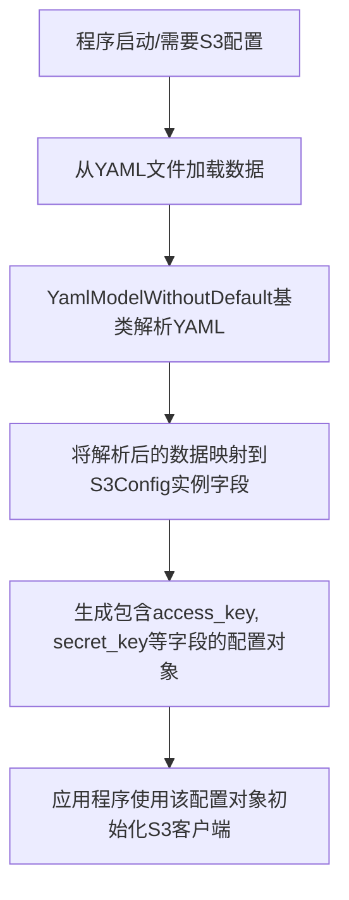

# `.\MetaGPT\metagpt\configs\s3_config.py` 详细设计文档

该代码定义了一个名为 S3Config 的配置类，用于存储和管理访问 Amazon S3 或兼容 S3 协议的对象存储服务（如 MinIO）所需的连接参数。它继承自一个支持 YAML 序列化/反序列化的基础模型，简化了从配置文件加载这些敏感凭证的过程。

## 整体流程



## 类结构

```
YamlModelWithoutDefault (基类，提供YAML序列化能力)
└── S3Config (S3连接配置模型)
```

## 全局变量及字段


### `S3Config.access_key`
    
用于访问S3服务的访问密钥ID。

类型：`str`
    


### `S3Config.secret_key`
    
用于访问S3服务的秘密访问密钥。

类型：`str`
    


### `S3Config.endpoint`
    
S3服务的端点URL。

类型：`str`
    


### `S3Config.bucket`
    
S3存储桶的名称。

类型：`str`
    
    

## 全局函数及方法


## 关键组件


### S3Config 类

一个用于存储和管理 Amazon S3 对象存储服务配置信息的配置类，通过继承 `YamlModelWithoutDefault` 支持从 YAML 文件加载配置数据。

### YamlModelWithoutDefault 基类

一个用于定义无默认值配置模型的基类，提供了从 YAML 文件解析和加载配置数据的基础能力，确保配置字段必须被显式定义。

### 配置字段（access_key, secret_key, endpoint, bucket）

定义了访问 S3 服务所必需的四个核心配置参数，分别用于身份认证、服务端点指定和存储桶定位。


## 问题及建议


### 已知问题

-   **缺少数据验证与默认值**：`S3Config` 类继承自 `YamlModelWithoutDefault`，如其名所示，它可能不提供字段的默认值。当从YAML配置文件加载时，如果 `access_key`、`secret_key`、`endpoint` 或 `bucket` 等关键字段缺失或为空，可能导致运行时错误或配置不完整，且没有明确的验证机制来提前发现这些问题。
-   **敏感信息暴露风险**：该类直接存储了 `access_key` 和 `secret_key` 这样的敏感信息。在日志记录、调试信息或异常堆栈中，如果实例被直接打印或序列化，可能导致密钥泄露。
-   **配置灵活性不足**：当前配置是硬编码的字段列表。如果未来需要支持更多的S3兼容服务的高级配置（如区域、签名版本、路径风格访问等），需要修改类定义，扩展性较差。
-   **依赖特定基类**：该类强依赖于 `YamlModelWithoutDefault` 基类。如果项目需要更换配置管理方式（如使用Pydantic V2、环境变量或数据库），这个类的迁移成本会较高。

### 优化建议

-   **引入数据验证与默认值**：建议使用更强大的数据验证库（如Pydantic）来重构此类。可以为字段添加类型验证、长度验证，并为非关键字段设置合理的默认值（例如，为 `endpoint` 设置一个广泛使用的默认值）。这能确保配置数据的完整性和正确性。
-   **增强敏感信息处理**：对于 `access_key` 和 `secret_key` 字段，应重写 `__str__` 和 `__repr__` 方法，避免在日志中直接输出明文。可以考虑使用属性（property）或描述符（descriptor）在访问时进行掩码处理或从安全存储（如密钥管理系统）动态加载。
-   **提高配置扩展性**：可以将核心必填字段保留在类中，同时添加一个 `extra_config: Dict[str, Any]` 类型的字段，用于容纳未来可能出现的、非核心的配置项。这样可以在不修改类结构的前提下增加配置灵活性。
-   **抽象配置来源**：考虑定义一个配置接口或抽象基类，将配置的加载逻辑（从YAML、环境变量、数据库等）与配置数据的结构解耦。`S3Config` 可以作为一个纯粹的数据容器，通过依赖注入接收配置值，从而降低与 `YamlModelWithoutDefault` 的耦合度。
-   **添加配置文档**：在类或字段级别添加更详细的文档字符串（docstring），说明每个字段的用途、格式要求（例如endpoint的URL格式）以及如何获取（如access_key需要从何处申请），这将极大提升代码的可维护性和团队协作效率。


## 其它


### 设计目标与约束

设计目标：提供一个轻量级、类型安全的配置类，用于封装和管理S3（Simple Storage Service）相关的连接配置信息，包括访问密钥、密钥、终端节点和存储桶名称。该类应支持从YAML配置文件加载配置，并确保配置数据的结构化和验证。

约束：
1. 继承自`YamlModelWithoutDefault`，依赖于父类提供的YAML解析和模型验证功能。
2. 所有字段均为必填项，没有默认值，确保配置的完整性。
3. 代码应保持简洁，专注于数据模型的声明，不包含业务逻辑。

### 错误处理与异常设计

1. **字段缺失错误**：当从YAML文件加载配置时，如果缺少`access_key`、`secret_key`、`endpoint`、`bucket`中的任何一个字段，父类`YamlModelWithoutDefault`的验证机制会抛出验证错误（如`ValidationError`），提示缺少必要的配置项。
2. **类型错误**：如果配置文件中字段的值类型与声明的类型（如`str`）不匹配，同样会触发类型验证错误。
3. **文件读取错误**：如果指定的YAML配置文件不存在或无法读取，由调用方或父类处理文件IO异常。
4. **设计原则**：本类本身不主动捕获或处理这些异常，而是将错误向上层调用者传递，由调用者决定如何处理配置加载失败的情况（如记录日志、使用默认配置或终止程序）。

### 数据流与状态机

1. **数据流**：
   - **输入**：YAML格式的配置文件或符合字段结构的字典数据。
   - **处理**：通过`YamlModelWithoutDefault`的初始化或解析方法，将输入数据映射到`S3Config`类的实例字段。
   - **输出**：一个已初始化的`S3Config`对象，其字段包含了有效的S3配置信息。
2. **状态机**：此类为不可变的数据模型（通过Pydantic基类实现），一旦实例化，其字段值应被视为只读。没有内部状态变迁，从创建到销毁都保持数据一致性。

### 外部依赖与接口契约

1. **外部依赖**：
   - `metagpt.utils.yaml_model.YamlModelWithoutDefault`：作为基类，提供YAML解析、数据验证和模型序列化/反序列化能力。这隐含依赖了`pydantic`库。
   - （间接依赖）`yaml`库：用于解析YAML配置文件。
2. **接口契约**：
   - **提供方**：`S3Config`类为其他模块提供获取S3配置的接口。调用者通过实例化此类（传入配置数据）来获取配置对象。
   - **期望输入**：一个包含所有必需字段（`access_key`, `secret_key`, `endpoint`, `bucket`）且类型正确的字典或YAML文件路径/内容。
   - **承诺输出**：一个有效的、经过验证的`S3Config`实例，其字段可直接用于初始化S3客户端（如boto3）。
   - **不变性**：返回的配置对象在其生命周期内字段值保持不变。

### 配置管理与扩展性

1. **配置管理**：此类是S3配置的集中定义点。所有需要使用S3服务的模块都应通过此配置类获取连接参数，确保配置来源单一、格式统一。
2. **扩展性**：
   - **字段扩展**：如需支持更多S3配置选项（如区域`region`、安全连接`use_ssl`等），可直接在此类中添加新的类型注解字段。
   - **验证扩展**：可通过Pydantic的`Field`装饰器为字段添加更复杂的验证规则（如字符串格式、长度限制）。
   - **来源扩展**：除了从YAML文件加载，可通过继承或组合的方式，支持从环境变量、密钥管理服务等其他来源加载配置，而无需修改现有使用方的代码。

### 安全考虑

1. **敏感信息**：`access_key`和`secret_key`是高度敏感的凭据信息。
   - **存储**：在YAML配置文件中，应确保文件权限严格限制，避免未授权访问。建议配合密钥管理服务或加密存储。
   - **内存与日志**：`S3Config`对象在内存中持有明文密钥。应确保程序日志不会意外记录这些敏感字段的值。Pydantic默认的`__str__`和`__repr__`方法可能会暴露它们，在生产环境中需注意。
2. **传输**：当配置在不同服务间传递时，应使用安全的通信通道。

### 测试策略建议

1. **单元测试**：
   - 测试使用有效字典/YAML数据能成功创建`S3Config`实例。
   - 测试缺少任一必填字段时是否抛出预期的验证错误。
   - 测试字段类型不正确时是否抛出类型错误。
2. **集成测试**：将创建的`S3Config`实例传递给一个真实的或模拟的S3客户端，验证配置是否能成功建立连接。
3. **安全测试**：验证日志输出中是否不包含敏感的`access_key`和`secret_key`信息。

    