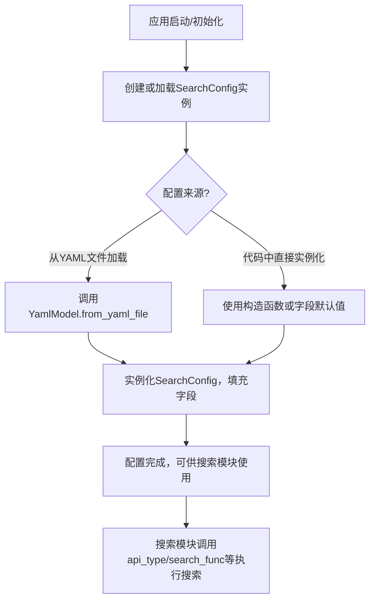
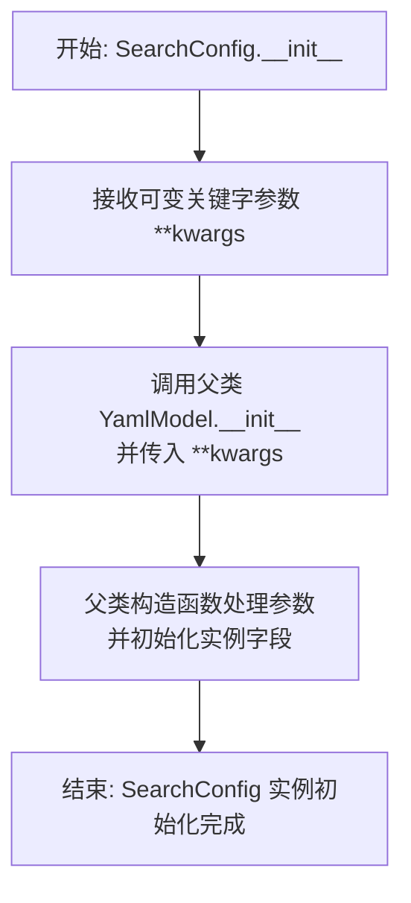
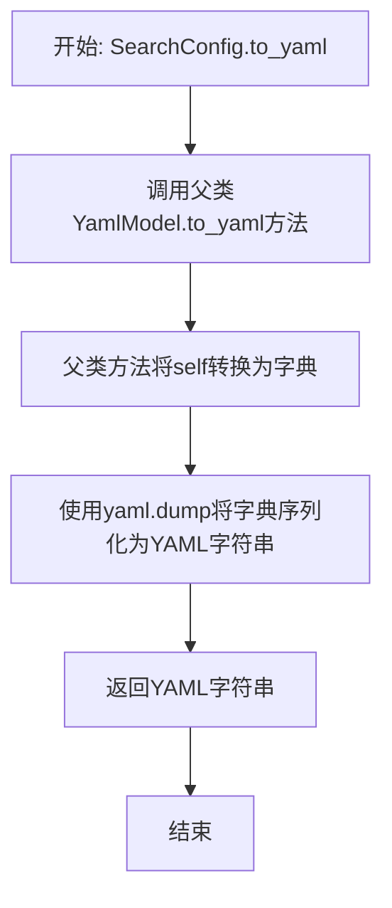
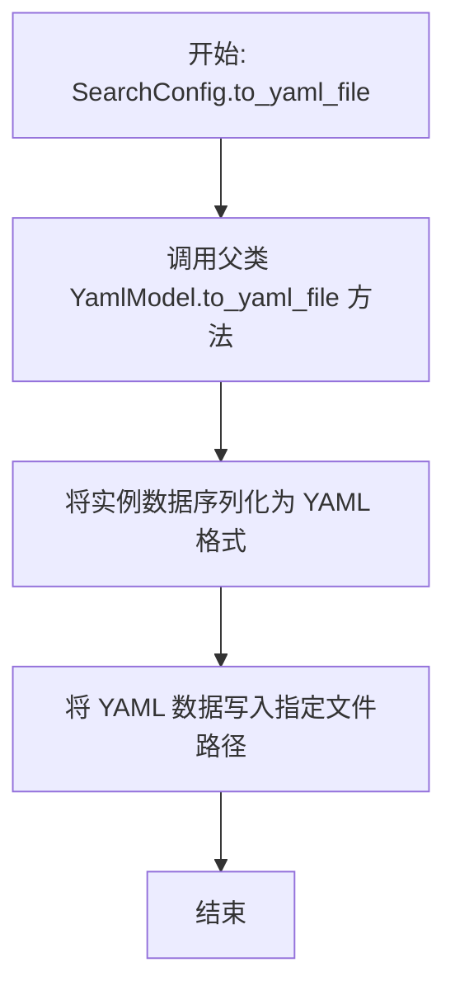
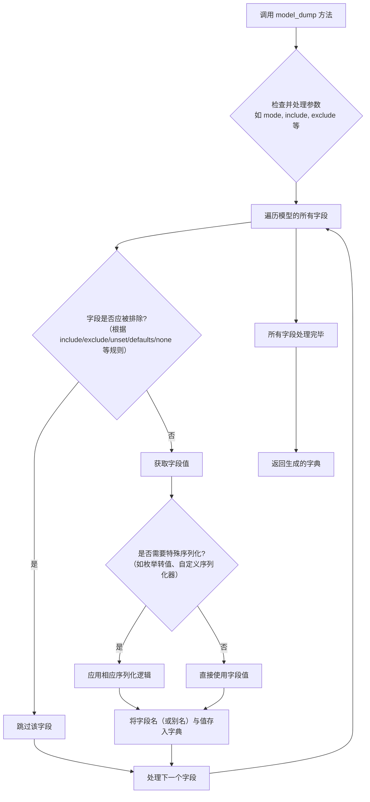
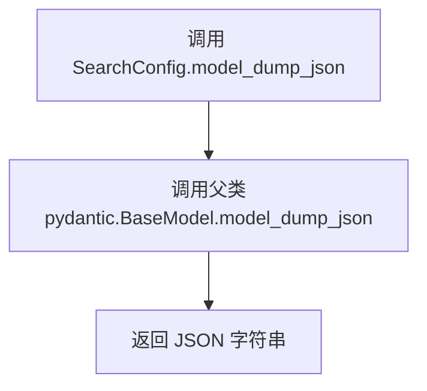
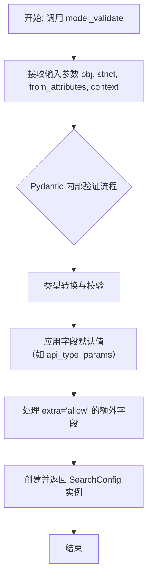
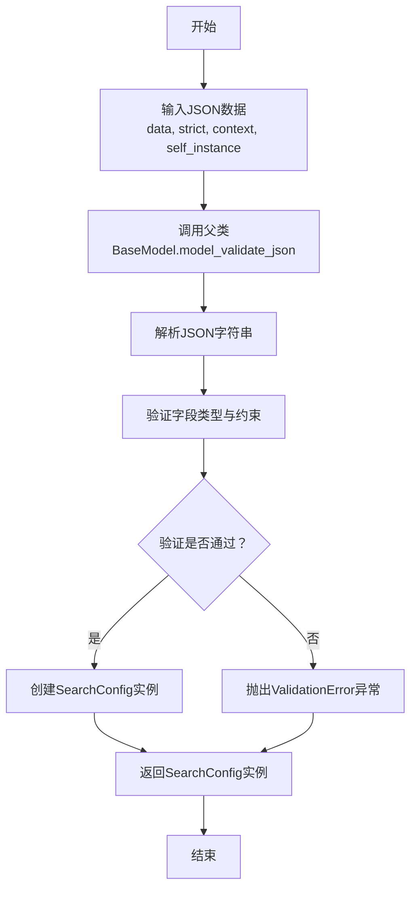
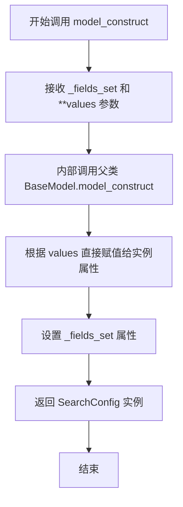
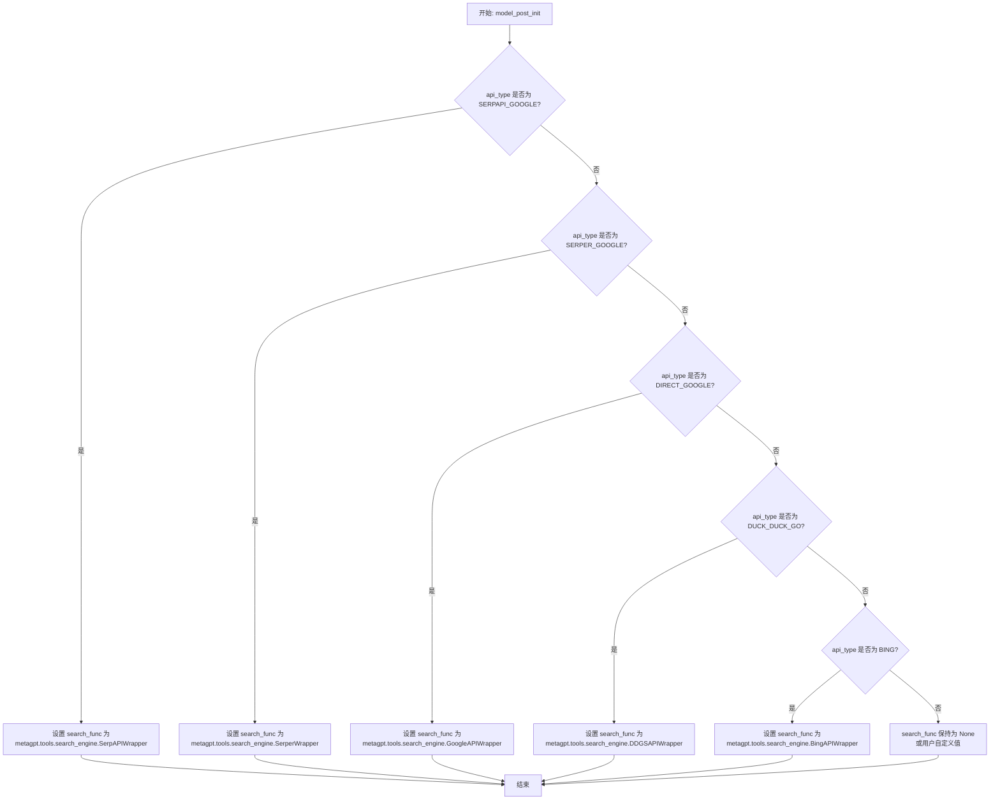

# `.\MetaGPT\metagpt\configs\search_config.py` 详细设计文档

该代码定义了一个用于配置和管理不同搜索引擎的配置类。它通过枚举类型定义了支持的搜索引擎类型，并通过一个基于Pydantic的YAML模型类来封装搜索引擎的API类型、密钥、自定义参数以及可选的搜索函数，为上层应用提供统一的搜索配置接口。

## 整体流程



## 类结构

```
SearchEngineType (枚举类)
SearchConfig (配置模型类)
└── 继承自 YamlModel
```

## 全局变量及字段


### `SearchEngineType.SERPAPI_GOOGLE`
    
枚举值，表示使用 SerpAPI 服务的 Google 搜索引擎。

类型：`SearchEngineType`
    


### `SearchEngineType.SERPER_GOOGLE`
    
枚举值，表示使用 Serper 服务的 Google 搜索引擎。

类型：`SearchEngineType`
    


### `SearchEngineType.DIRECT_GOOGLE`
    
枚举值，表示直接调用 Google 搜索引擎。

类型：`SearchEngineType`
    


### `SearchEngineType.DUCK_DUCK_GO`
    
枚举值，表示使用 DuckDuckGo 搜索引擎。

类型：`SearchEngineType`
    


### `SearchEngineType.CUSTOM_ENGINE`
    
枚举值，表示使用自定义的搜索引擎。

类型：`SearchEngineType`
    


### `SearchEngineType.BING`
    
枚举值，表示使用 Bing 搜索引擎。

类型：`SearchEngineType`
    


### `SearchConfig.model_config`
    
Pydantic 模型的配置字典，用于控制模型的行为，例如允许额外字段。

类型：`pydantic.ConfigDict`
    


### `SearchConfig.api_type`
    
指定要使用的搜索引擎类型，默认为 DUCK_DUCK_GO。

类型：`SearchEngineType`
    


### `SearchConfig.api_key`
    
用于访问搜索引擎 API 的密钥，默认为空字符串。

类型：`str`
    


### `SearchConfig.cse_id`
    
Google 自定义搜索引擎 ID，仅在 api_type 为 Google 相关类型时使用，默认为空字符串。

类型：`str`
    


### `SearchConfig.search_func`
    
可选的搜索函数，当 api_type 为 CUSTOM_ENGINE 时，用于执行自定义搜索逻辑。

类型：`Optional[Callable]`
    


### `SearchConfig.params`
    
搜索引擎的额外参数字典，包含如引擎、域名、地理位置和语言等默认配置。

类型：`dict`
    
    

## 全局函数及方法


### `SearchConfig.__init__`

`SearchConfig.__init__` 是 `SearchConfig` 类的构造函数，用于初始化搜索配置的实例。它通过继承自 `YamlModel` 的基类 `__init__` 方法，处理传入的关键字参数，并设置实例的各个配置字段。

参数：
-  `**kwargs`：`Any`，可变关键字参数，用于接收并设置 `SearchConfig` 实例的各个字段值。

返回值：`None`，构造函数不返回任何值。

#### 流程图



#### 带注释源码

```python
def __init__(self, **kwargs):
    """
    构造函数，初始化 SearchConfig 实例。
    通过关键字参数设置配置项。
    
    参数:
        **kwargs: 可变关键字参数，用于设置实例的字段。
                  例如: api_type=SearchEngineType.SERPAPI_GOOGLE, api_key='your_key'
    """
    # 调用父类 YamlModel 的构造函数，传递所有接收到的关键字参数。
    # 父类的 __init__ 方法会利用 Pydantic 的模型验证和解析功能，
    # 将 kwargs 中的值赋给对应的类字段（如 api_type, api_key 等）。
    super().__init__(**kwargs)
```


### `SearchConfig.from_yaml_file`

这是一个类方法，用于从指定的YAML配置文件中读取数据，并据此创建并返回一个`SearchConfig`类的实例。它继承自父类`YamlModel`，实现了从文件系统加载配置并反序列化为对象模型的核心功能。

参数：

-  `filepath`：`str | Path`，YAML配置文件的路径。可以是字符串或`pathlib.Path`对象。

返回值：`SearchConfig`，返回一个根据YAML文件内容初始化的`SearchConfig`配置对象实例。

#### 流程图

```mermaid
flowchart TD
    A[开始: from_yaml_file(filepath)] --> B{文件路径是否为字符串?};
    B -- 是 --> C[将字符串路径转换为Path对象];
    B -- 否 --> D[直接使用Path对象];
    C --> E;
    D --> E[使用Path对象打开文件];
    E --> F[使用yaml.safe_load解析文件内容];
    F --> G[调用父类方法model_validate<br>将字典数据转换为SearchConfig对象];
    G --> H[返回初始化后的SearchConfig实例];
    H --> I[结束];
```

#### 带注释源码

```python
    @classmethod
    def from_yaml_file(cls, filepath: str | Path) -> Self:
        """
        Read a YAML file and create an instance of the class.

        This method reads the YAML file located at the given filepath, parses its contents,
        and uses the parsed data to create and return an instance of the class.

        Args:
            filepath (str | Path): The path to the YAML file.

        Returns:
            Self: An instance of the class populated with data from the YAML file.
        """
        # 将输入的filepath（可能是字符串）转换为Path对象，确保路径操作的统一性。
        path = Path(filepath)
        # 以只读模式打开指定路径的YAML文件。
        with path.open("r", encoding="utf-8") as file:
            # 使用yaml.safe_load安全地解析YAML文件内容，返回一个Python字典。
            # safe_load可以防止执行任意代码，比load更安全。
            data = yaml.safe_load(file)
        # 调用从BaseModel继承的model_validate方法。
        # 该方法将上一步得到的字典数据验证并转换为当前类（SearchConfig）的一个实例。
        # 这里会利用SearchConfig中定义的字段（如api_type, api_key等）进行类型检查和赋值。
        return cls.model_validate(data)
```


### `SearchConfig.to_yaml`

该方法继承自父类 `YamlModel`，用于将 `SearchConfig` 实例序列化为 YAML 格式的字符串。它通过 Pydantic 的模型能力，将实例的字段（包括继承的字段）转换为一个字典，然后使用 `yaml.dump` 方法将该字典输出为格式化的 YAML 字符串。

参数：
-  `self`：`SearchConfig`，`SearchConfig` 类的实例，包含要序列化的配置数据。

返回值：`str`，返回一个表示当前配置的 YAML 格式字符串。

#### 流程图



#### 带注释源码

```python
    def to_yaml(self) -> str:
        """
        将当前模型实例序列化为 YAML 格式的字符串。
        此方法继承自 `YamlModel` 基类。

        返回:
            str: 表示当前模型实例的 YAML 字符串。
        """
        # 方法体由父类YamlModel实现。
        # 其核心逻辑是：使用self.dict()获取模型数据的字典表示，
        # 然后通过yaml.dump函数将其转换为格式化的YAML字符串。
        return super().to_yaml()
```


### `SearchConfig.to_yaml_file`

该方法继承自父类 `YamlModel`，用于将 `SearchConfig` 实例的配置数据序列化为 YAML 格式并保存到指定的文件中。

参数：

-  `file_path`：`str`，目标 YAML 文件的保存路径。
-  `**kwargs`：`Any`，传递给父类 `to_yaml_file` 方法的额外关键字参数。

返回值：`None`，此方法不返回任何值，其主要作用是执行文件写入操作。

#### 流程图



#### 带注释源码

```python
# 该方法继承自 YamlModel 基类，用于将当前配置实例保存为 YAML 文件。
# 其具体实现逻辑（包括序列化和文件写入）封装在父类中。
def to_yaml_file(self, file_path: str, **kwargs):
    """
    将配置保存到 YAML 文件。

    参数:
        file_path (str): 要保存到的 YAML 文件路径。
        **kwargs: 传递给 `yaml.dump` 的额外关键字参数。
    """
    # 调用父类 YamlModel 的 to_yaml_file 方法执行实际保存操作。
    super().to_yaml_file(file_path, **kwargs)
```


### `SearchConfig.model_dump`

`model_dump` 是 Pydantic 模型 `SearchConfig` 继承自其父类 `YamlModel`（最终继承自 `pydantic.BaseModel`）的一个实例方法。该方法用于将模型实例序列化为一个字典。它处理模型的所有字段（包括通过 `ConfigDict(extra="allow")` 配置允许的额外字段），并根据需要排除默认值或未设置的字段，最终返回一个包含所有配置数据的标准 Python 字典。

参数：

- `mode`：`str`，可选参数，指定序列化模式。例如，`'json'` 模式会返回适合 JSON 序列化的字典（如将枚举转换为值）。默认为 `'python'`。
- `include`：`Union[AbstractSetIntStr, MappingIntStrAny]`，可选参数，指定需要包含在输出字典中的字段。
- `exclude`：`Union[AbstractSetIntStr, MappingIntStrAny]`，可选参数，指定需要从输出字典中排除的字段。
- `by_alias`：`bool`，可选参数，如果为 `True`，则使用字段的别名（通过 `Field(alias=...)` 设置）作为字典的键。默认为 `False`。
- `exclude_unset`：`bool`，可选参数，如果为 `True`，则排除未被显式设置的字段（即保持默认值的字段）。默认为 `False`。
- `exclude_defaults`：`bool`，可选参数，如果为 `True`，则排除值等于其默认值的字段。默认为 `False`。
- `exclude_none`：`bool`，可选参数，如果为 `True`，则排除值为 `None` 的字段。默认为 `False`。
- `round_trip`：`bool`，可选参数，如果为 `True`，则输出字典应能用于重新创建模型实例（例如，处理私有属性）。默认为 `False`。
- `warnings`：`bool`，可选参数，是否在序列化过程中启用警告。默认为 `True`。
- `context`：`Optional[Dict[str, Any]]`，可选参数，传递给序列化器的上下文字典。
- `serialize_as_any`：`bool`，可选参数，如果为 `True`，则绕过智能序列化逻辑，将所有字段视为 `Any` 类型。默认为 `False`。

返回值：`Dict[str, Any]`，返回一个字典，其中键为字段名（或其别名），值为字段序列化后的值。

#### 流程图



#### 带注释源码

```python
def model_dump(
    self,
    mode: str = 'python',
    *,
    include: Optional[Union[AbstractSetIntStr, MappingIntStrAny]] = None,
    exclude: Optional[Union[AbstractSetIntStr, MappingIntStrAny]] = None,
    by_alias: bool = False,
    exclude_unset: bool = False,
    exclude_defaults: bool = False,
    exclude_none: bool = False,
    round_trip: bool = False,
    warnings: bool = True,
    context: Optional[Dict[str, Any]] = None,
    serialize_as_any: bool = False,
) -> Dict[str, Any]:
    """
    将 Pydantic 模型实例序列化为字典。
    
    这是 Pydantic BaseModel 的内置方法，由 SearchConfig 继承。
    它根据提供的参数，将模型的所有字段（包括通过 `extra='allow'` 添加的额外字段）
    转换成一个标准的 Python 字典。
    
    Args:
        mode: 序列化模式，例如 'python' 或 'json'。
        include: 指定要包含的字段。
        exclude: 指定要排除的字段。
        by_alias: 是否使用字段别名作为字典键。
        exclude_unset: 是否排除未显式设置的字段（即使用默认值的字段）。
        exclude_defaults: 是否排除值等于字段默认值的字段。
        exclude_none: 是否排除值为 None 的字段。
        round_trip: 是否确保输出字典可以用于重建模型。
        warnings: 是否在序列化过程中显示警告。
        context: 传递给序列化器的上下文信息。
        serialize_as_any: 是否将所有字段视为 Any 类型进行序列化。
        
    Returns:
        一个包含模型数据的字典。
    """
    # 此方法的实际实现在 Pydantic 内部。
    # 对于 SearchConfig 实例，它会处理以下字段：
    # - api_type: SearchEngineType -> 根据 mode 可能被序列化为字符串（如 'ddg'）
    # - api_key: str
    # - cse_id: str
    # - search_func: Optional[Callable] -> 可能被排除或序列化为 None
    # - params: dict
    # - 以及任何通过 `extra='allow'` 动态添加的额外字段
    pass
```

### `SearchConfig.model_dump_json`

该方法继承自 `pydantic.BaseModel`，用于将 `SearchConfig` 实例序列化为 JSON 格式的字符串。它通过调用父类的 `model_dump_json` 方法实现，确保所有字段（包括通过 `ConfigDict(extra="allow")` 配置允许的额外字段）都被正确序列化。

参数：

-  `self`：`SearchConfig`，`SearchConfig` 类的实例
-  `**kwargs`：`Any`，传递给父类 `model_dump_json` 方法的额外关键字参数

返回值：`str`，表示 `SearchConfig` 实例数据的 JSON 格式字符串

#### 流程图



#### 带注释源码

```
def model_dump_json(self, **kwargs):
    # 调用父类 pydantic.BaseModel 的 model_dump_json 方法
    # 该方法将模型实例序列化为 JSON 字符串
    # **kwargs 允许传递额外的序列化选项给父类方法
    return super().model_dump_json(**kwargs)
```

### `SearchConfig.model_validate`

`model_validate` 是 Pydantic 的 `BaseModel` 类提供的一个类方法，用于验证并解析输入数据（通常是字典）以创建模型实例。它执行类型检查、数据验证，并确保所有字段符合模型定义。

参数：

- `obj`：`Any`，包含要验证的数据的对象，通常是字典。
- `strict`：`bool | None`，是否启用严格模式。在严格模式下，只接受与字段类型完全匹配的数据。
- `from_attributes`：`bool | None`，是否从对象的属性（而非字典键）加载数据。
- `context`：`dict[str, Any] | None`，传递给验证器的上下文信息。

返回值：`Model`，返回根据输入数据创建的 `SearchConfig` 模型实例。

#### 流程图



#### 带注释源码

```python
    @classmethod
    def model_validate(
        cls: type[Model],
        obj: Any,
        *,
        strict: bool | None = None,
        from_attributes: bool | None = None,
        context: dict[str, Any] | None = None
    ) -> Model:
        """
        Validate a pydantic model instance.

        Args:
            obj (Any): The object to validate. Usually a dictionary.
            strict (bool | None): Whether to enforce strict mode.
            from_attributes (bool | None): Whether to extract data from object attributes.
            context (dict[str, Any] | None): Context for the validator.

        Returns:
            Model: A validated instance of the model (SearchConfig).
        """
        # 此方法的具体实现在 Pydantic 的 BaseModel 中。
        # 它会根据 cls（即 SearchConfig）的定义，对传入的 obj 进行验证。
        # 1. 检查 obj 的数据类型（根据 from_attributes 决定是从字典还是对象属性读取）。
        # 2. 根据 strict 模式进行严格的类型检查。
        # 3. 使用字段的注解类型（如 SearchEngineType, str, Callable）进行数据校验和转换。
        # 4. 应用字段的默认值（例如 api_type 默认为 DUCK_DUCK_GO, params 默认为特定字典）。
        # 5. 由于 SearchConfig 的 model_config 中设置了 extra='allow'，任何未在模型中定义的键值对也会被保留在实例的 __pydantic_extra__ 中。
        # 6. 最终，返回一个填充好数据的 SearchConfig 实例。
        # 注意：这是父类 BaseModel 的方法，SearchConfig 继承了它。此处没有重写，因此使用的是 Pydantic 的标准实现。
        return super().model_validate(obj, strict=strict, from_attributes=from_attributes, context=context)
```

### `SearchConfig.model_validate_json`

该方法用于将JSON字符串解析并验证为`SearchConfig`模型实例。它继承自Pydantic的`BaseModel`，通过JSON字符串创建配置对象，确保数据符合定义的字段类型和约束。

参数：

- `data`：`str | bytes | bytearray`，包含JSON数据的字符串或字节序列，用于反序列化为`SearchConfig`实例。
- `strict`：`bool | None`，是否启用严格模式验证（如类型转换限制），默认为`None`。
- `context`：`dict[str, Any] | None`，额外的上下文信息，用于自定义验证逻辑，默认为`None`。
- `self_instance`：`Any | None`，现有模型实例（用于部分更新），默认为`None`。

返回值：`SearchConfig`，返回通过验证的`SearchConfig`类实例。

#### 流程图



#### 带注释源码

```python
@classmethod
def model_validate_json(
    cls: type[_T],
    data: str | bytes | bytearray,
    *,
    strict: bool | None = None,
    context: dict[str, Any] | None = None,
    self_instance: Any | None = None,
) -> _T:
    """
    将JSON字符串解析并验证为模型实例。
    
    继承自Pydantic BaseModel，用于从JSON数据创建SearchConfig对象。
    
    Args:
        data (str | bytes | bytearray): JSON格式的字符串或字节数据。
        strict (bool | None): 是否启用严格模式（禁用类型转换）。
        context (dict[str, Any] | None): 验证上下文信息。
        self_instance (Any | None): 用于部分更新的现有实例。
    
    Returns:
        SearchConfig: 验证后的配置实例。
    
    Raises:
        ValidationError: 当数据不符合模型定义时抛出异常。
    """
    # 调用父类BaseModel的model_validate_json方法
    # 该方法负责JSON解析、数据验证和实例创建
    return super().model_validate_json(
        data,
        strict=strict,
        context=context,
        self_instance=self_instance,
    )
```

### `SearchConfig.model_construct`

`model_construct` 是 Pydantic 的 `BaseModel` 类提供的一个类方法，用于绕过验证器，直接通过提供的字段值构造模型实例。在 `SearchConfig` 类中，它用于快速创建一个配置实例，而无需进行类型检查和数据验证，适用于性能要求高或数据来源可信的场景。

参数：

-  `_fields_set`：`Optional[set[str]]`，指定哪些字段被显式设置，通常用于区分默认值和用户提供的值。
-  `**values`：`Any`，包含模型字段名称和对应值的键值对，用于初始化模型实例。

返回值：`SearchConfig`，返回一个未经验证的 `SearchConfig` 实例。

#### 流程图



#### 带注释源码

```python
    @classmethod
    def model_construct(cls, _fields_set: Optional[set[str]] = None, **values: Any) -> Self:
        """
        绕过验证器，直接使用提供的值构造模型。
        这是一个类方法，用于性能要求高或数据来源可信的场景。

        Args:
            _fields_set (Optional[set[str]]): 被显式设置的字段集合。如果为 None，则根据 values 推断。
            **values (Any): 用于初始化模型字段的键值对。

        Returns:
            Self: 构造的模型实例。
        """
        # 此方法继承自 pydantic.BaseModel，其内部实现直接使用 __dict__ 赋值，
        # 跳过了类型转换和验证步骤。
        return super().model_construct(_fields_set, **values)
```


### `SearchConfig.model_copy`

该方法用于创建并返回当前 `SearchConfig` 实例的一个深度拷贝。它继承自 Pydantic 的 `BaseModel`，用于生成一个包含所有字段值的新实例，确保原始实例与拷贝实例之间的数据独立性。

参数：

-  `update`：`Optional[dict]`，可选参数字典，用于在创建拷贝时更新新实例的字段值。如果提供，新实例的对应字段将被更新为此字典中的值。
-  `deep`：`bool`，指示是否进行深度拷贝。默认为 `True`，确保嵌套的可变对象（如列表、字典）也被递归地复制，而不是共享引用。

返回值：`SearchConfig`，返回一个新的 `SearchConfig` 实例，它是当前实例的拷贝，并根据 `update` 参数进行了可选更新。

#### 流程图

```mermaid
flowchart TD
    A[开始: model_copy(update, deep)] --> B{update 参数<br>是否提供?};
    B -- 是 --> C[使用 update 数据<br>创建新实例];
    B -- 否 --> D[直接创建当前实例的拷贝];
    C --> E{deep 参数<br>是否为 True?};
    D --> E;
    E -- 是 --> F[执行深度拷贝<br>（递归复制嵌套对象）];
    E -- 否 --> G[执行浅拷贝<br>（共享嵌套对象引用）];
    F --> H[返回新的 SearchConfig 实例];
    G --> H;
```

#### 带注释源码

```
def model_copy(
    self,
    *,
    update: Optional[dict] = None,  # 可选，用于更新新实例字段的字典
    deep: bool = True,              # 是否进行深度拷贝，默认为是
) -> "SearchConfig":                # 返回一个新的 SearchConfig 实例
    """
    创建并返回当前模型实例的拷贝。
    
    此方法继承自 Pydantic BaseModel，用于生成当前实例的一个副本。
    如果提供了 `update` 参数，新实例的字段将使用该字典进行更新。
    `deep` 参数控制是否对嵌套的可变对象进行深度拷贝。
    
    Args:
        update (Optional[dict], optional): 用于更新新实例字段的键值对字典。默认为 None。
        deep (bool, optional): 如果为 True，则执行深度拷贝；否则为浅拷贝。默认为 True。
    
    Returns:
        SearchConfig: 当前实例的一个新拷贝（可能根据 `update` 更新过）。
    """
    # 方法体由 Pydantic 的 BaseModel 实现，此处为示意性注释。
    # 实际行为：基于当前实例的数据和提供的 update 参数，构造一个新的 SearchConfig 对象。
    # 根据 deep 参数的值，决定复制嵌套对象的方式。
    return super().model_copy(update=update, deep=deep)
```


### `SearchConfig.model_post_init`

`model_post_init` 是 Pydantic `BaseModel` 的一个特殊方法，在模型实例化完成所有字段的初始化后自动调用。在 `SearchConfig` 类中，此方法用于在实例创建后执行额外的后处理逻辑，具体是根据 `api_type` 字段的值来设置 `search_func` 字段。

参数：

-  `self`：`SearchConfig`，`SearchConfig` 类的当前实例
-  `__context`：`Any`，Pydantic 内部使用的上下文对象，通常无需直接操作

返回值：`None`，此方法不返回任何值，仅用于执行实例的后初始化操作。

#### 流程图



#### 带注释源码

```python
def model_post_init(self, __context: Any) -> None:
    """
    模型后初始化方法。
    根据配置的 api_type 自动设置对应的搜索函数 (search_func)。
    此方法在 Pydantic 模型实例化后自动调用。
    """
    # 根据 api_type 枚举值，将对应的搜索 API 包装器类赋值给 search_func 字段
    if self.api_type == SearchEngineType.SERPAPI_GOOGLE:
        # 使用 SerpAPI 进行 Google 搜索
        self.search_func = SerpAPIWrapper
    elif self.api_type == SearchEngineType.SERPER_GOOGLE:
        # 使用 Serper API 进行 Google 搜索
        self.search_func = SerperWrapper
    elif self.api_type == SearchEngineType.DIRECT_GOOGLE:
        # 使用直接的 Google 自定义搜索 API
        self.search_func = GoogleAPIWrapper
    elif self.api_type == SearchEngineType.DUCK_DUCK_GO:
        # 使用 DuckDuckGo 搜索
        self.search_func = DDGSAPIWrapper
    elif self.api_type == SearchEngineType.BING:
        # 使用 Bing 搜索 API
        self.search_func = BingAPIWrapper
    # 如果 api_type 是 CUSTOM_ENGINE 或其他未明确处理的值，
    # 则 search_func 保持其原有值（可能为 None 或用户自定义的函数）
```


## 关键组件


### SearchEngineType 枚举

定义了支持的搜索引擎类型，包括 SERPAPI_GOOGLE、SERPAPI_GOOGLE、DIRECT_GOOGLE、DUCK_DUCK_GO、CUSTOM_ENGINE 和 BING，用于配置和选择具体的搜索服务提供商。

### SearchConfig 配置类

一个基于 Pydantic 和 YamlModel 的配置数据类，用于集中管理搜索功能所需的各项参数，如搜索引擎类型、API 密钥、自定义搜索函数以及其他搜索引擎特定的配置参数。

### YamlModel 基类

作为 SearchConfig 的基类，提供了从 YAML 文件加载配置和将配置保存到 YAML 文件的能力，实现了配置的序列化与持久化。

### Pydantic 模型配置

通过 `model_config = ConfigDict(extra="allow")` 设置，允许 SearchConfig 实例在初始化时接收并存储未在类字段中明确定义的额外参数，提供了配置的灵活性。


## 问题及建议


### 已知问题

-   **`search_func` 字段类型过于宽泛**：`search_func` 字段的类型为 `Optional[Callable]`，这过于宽泛，无法明确指定搜索函数应接受的参数和返回值类型，降低了代码的类型安全性和可读性，可能导致运行时错误。
-   **`params` 字段默认值与 `api_type` 存在潜在不一致**：`params` 字段的默认值 `{"engine": "google", ...}` 是针对 Google 搜索引擎的配置。当 `api_type` 设置为 `DUCK_DUCK_GO`、`BING` 或 `CUSTOM_ENGINE` 时，此默认配置可能不适用或产生误导，导致配置与实际使用的搜索引擎不匹配。
-   **缺少配置验证逻辑**：当前模型没有对配置的完整性和有效性进行验证。例如，当 `api_type` 为 `SERPAPI_GOOGLE` 或 `SERPER_GOOGLE` 时，`api_key` 应为必填项；当 `api_type` 为 `DIRECT_GOOGLE` 时，`cse_id` 可能为必填项。缺少此类验证可能导致配置错误在运行时才被发现。
-   **`model_config = ConfigDict(extra="allow")` 可能引入风险**：允许额外字段（`extra="allow"`）虽然增加了配置的灵活性，但也可能掩盖拼写错误或引入未预期的配置项，不利于维护和调试。

### 优化建议

-   **为 `search_func` 使用更具体的类型注解**：建议使用 `typing` 模块中的 `Callable[[...], ...]` 来定义 `search_func` 的精确签名。例如，可以定义为 `Callable[[str], list[str]]` 或一个更复杂的自定义协议/类型别名，以明确其输入（查询字符串）和输出（结果列表）的格式。
-   **根据 `api_type` 动态设置 `params` 默认值或提供验证**：建议移除 `params` 的通用默认值，或者提供一个类方法（如 `default_params_for`）来根据 `api_type` 生成合适的默认配置。更好的做法是在 `__init__` 或一个验证器（如 Pydantic 的 `@field_validator`）中，根据 `api_type` 确保 `params` 包含必要的键值对。
-   **添加 Pydantic 字段验证器**：利用 Pydantic V2 的 `@field_validator` 装饰器，为 `api_key`、`cse_id` 等字段添加条件必填验证。例如，验证当 `api_type` 为某些值时，`api_key` 不能为空字符串。
-   **考虑收紧 `extra` 配置或记录允许的额外字段**：除非有明确需求，否则建议将 `model_config` 中的 `extra` 设置为 `"forbid"` 以防止未知字段。如果确实需要灵活性，可以设置为 `"ignore"`，并考虑在文档中明确说明哪些额外字段是被特定搜索引擎支持的，或者使用一个嵌套的 `Dict[str, Any]` 字段来明确收纳这些额外配置。
-   **考虑将 `SearchEngineType` 与配置逻辑更紧密地绑定**：可以创建一个映射关系或基类，将每个 `SearchEngineType` 枚举值与其必需的配置参数（如必需的 `params` 键、是否需要 `api_key` 等）关联起来，使得配置的管理和验证更加集中和清晰。


## 其它


### 设计目标与约束

本模块的设计目标是提供一个灵活、可扩展的搜索配置管理组件，用于统一管理不同搜索引擎的API配置、认证信息和自定义搜索行为。核心约束包括：1) 必须支持多种主流搜索引擎（如Google、Bing、DuckDuckGo）以及自定义引擎；2) 配置模型应支持通过YAML文件进行序列化与反序列化，便于持久化和部署；3) 必须允许通过`Callable`类型字段注入自定义搜索函数，以支持未来扩展或特定业务逻辑；4) 遵循Pydantic模型的数据验证与类型安全规范。

### 错误处理与异常设计

当前代码未显式定义错误处理逻辑。潜在的异常场景包括：1) 在反序列化YAML配置文件时，若字段类型不匹配或缺少必需字段，Pydantic将抛出`ValidationError`；2) 在使用`api_key`或`cse_id`等字段调用外部API时，若凭证无效或缺失，应由调用方处理相应的认证错误（如`KeyError`或API客户端抛出的异常）；3) 当`search_func`被调用但未正确初始化（为`None`）时，可能导致`TypeError`。建议在调用`search_func`前增加空值检查，或提供默认的搜索实现。

### 数据流与状态机

本模块为静态配置类，不涉及运行时状态变化或复杂的数据流。其主要数据流为：1) **初始化/加载流**：通过YAML文件或字典数据加载配置，实例化`SearchConfig`对象，数据经Pydantic验证后填充各字段；2) **配置使用流**：客户端代码获取`SearchConfig`实例后，读取其字段（如`api_type`, `api_key`, `search_func`）来配置或执行具体的搜索操作。模块本身无状态机，其字段在对象生命周期内通常是只读的（除非显式修改）。

### 外部依赖与接口契约

1.  **外部依赖**：
    *   `enum.Enum`：Python标准库，用于定义搜索引擎类型的枚举。
    *   `typing.Callable`, `typing.Optional`：Python标准库，用于类型注解。
    *   `pydantic.ConfigDict`, `pydantic.Field`：用于数据验证、配置管理和字段定义的第三方库。
    *   `metagpt.utils.yaml_model.YamlModel`：项目内部基类，提供YAML序列化/反序列化能力。
2.  **接口契约**：
    *   `SearchEngineType`枚举：定义了模块支持的搜索引擎类型，任何使用`api_type`的代码都应基于此枚举进行判断。
    *   `SearchConfig`类：
        *   `api_type`：指示当前配置使用的搜索引擎。
        *   `api_key` & `cse_id`：提供对应搜索引擎的认证凭证。
        *   `search_func`：一个可调用的函数，其签名应为`Callable[[str, Optional[dict]], str]`（接受查询字符串和可选参数字典，返回搜索结果字符串），调用方需确保传入的函数符合此隐含契约。
        *   `params`：一个字典，用于传递搜索引擎特定的查询参数。
    *   `YamlModel`基类：隐式提供了`load`、`dump`等方法用于YAML文件操作，`SearchConfig`的使用者可以依赖这些方法。

    