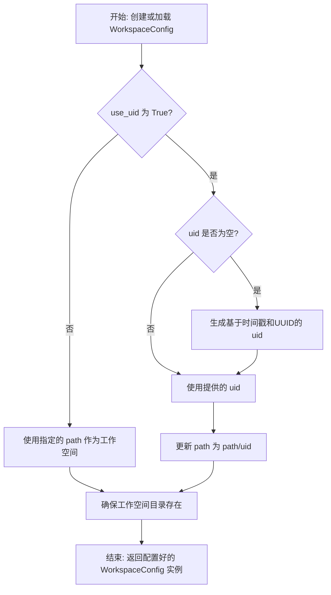
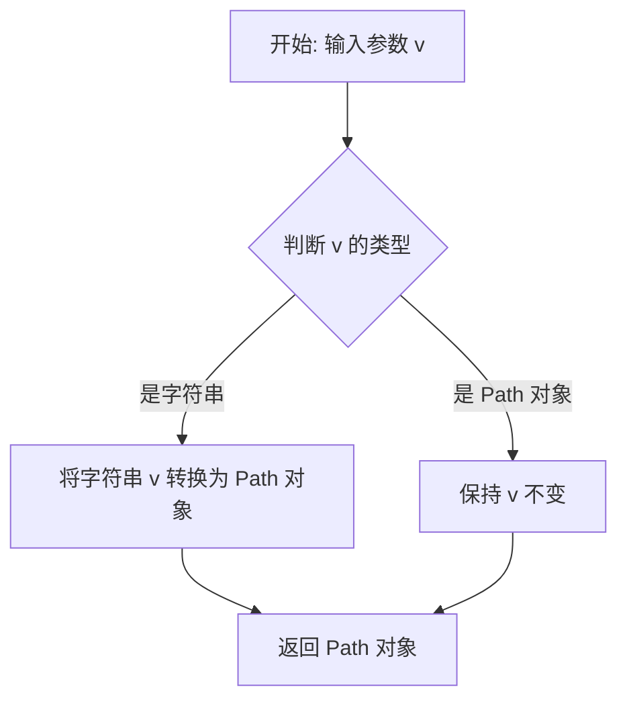
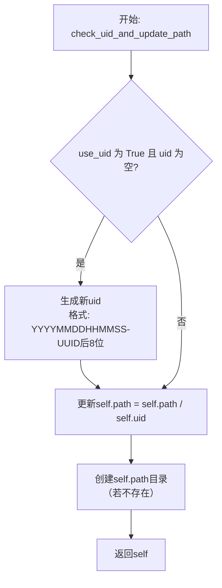

# `.\MetaGPT\metagpt\configs\workspace_config.py` 详细设计文档

该代码定义了一个工作空间配置类 `WorkspaceConfig`，它继承自 `YamlModel`，用于管理和配置项目的工作空间路径。核心功能包括：1) 通过 `path` 字段指定工作空间根目录；2) 通过 `use_uid` 和 `uid` 字段支持为工作空间生成唯一标识符子目录；3) 自动验证和转换路径格式；4) 根据配置自动创建对应的工作空间目录。

## 整体流程



## 类结构

```
YamlModel (来自 metagpt.utils.yaml_model)
└── WorkspaceConfig
```

## 全局变量及字段


### `WorkspaceConfig.path`
    
工作空间的根目录路径，默认为DEFAULT_WORKSPACE_ROOT。

类型：`Path`
    


### `WorkspaceConfig.use_uid`
    
布尔标志，指示是否使用唯一标识符（UID）来创建子目录。

类型：`bool`
    


### `WorkspaceConfig.uid`
    
工作空间的唯一标识符字符串，当use_uid为True时自动生成或手动指定。

类型：`str`
    
    

## 全局函数及方法


### `WorkspaceConfig.check_workspace_path`

这是一个类方法，作为Pydantic模型的字段验证器，用于验证和标准化`WorkspaceConfig`类中`path`字段的值。它的核心功能是确保传入的路径值被正确转换为`pathlib.Path`对象，以便后续进行路径操作。

参数：

-  `v`：`Any`，传入的待验证的`path`字段值。通常预期为字符串或`Path`对象。

返回值：`pathlib.Path`，经过验证和标准化后的路径对象。

#### 流程图



#### 带注释源码

```python
    @field_validator("path")  # 指定此验证器应用于`path`字段
    @classmethod  # 声明为类方法，因为Pydantic字段验证器需要是类方法
    def check_workspace_path(cls, v):  # cls: 类本身，v: 待验证的字段值
        if isinstance(v, str):  # 检查传入的值是否为字符串类型
            v = Path(v)  # 如果是字符串，则使用pathlib.Path将其转换为Path对象
        return v  # 返回处理后的值（可能是新转换的Path对象，也可能是原Path对象）
```


### `WorkspaceConfig.check_uid_and_update_path`

这是一个模型验证器方法，在`WorkspaceConfig`类实例化后自动调用。它的核心功能是：根据配置的`use_uid`标志，决定是否为工作空间路径生成一个唯一的用户标识符（UID），并据此更新最终的工作空间路径。如果启用了UID但未提供，则自动生成一个基于时间戳和UUID的组合作为UID，并将其附加到基础路径后。最后，确保最终的工作空间目录存在。

参数：
-  `self`：`WorkspaceConfig`，当前`WorkspaceConfig`类的实例。

返回值：`WorkspaceConfig`，返回经过验证和更新后的`WorkspaceConfig`实例自身。

#### 流程图



#### 带注释源码

```python
@model_validator(mode="after")
def check_uid_and_update_path(self):
    # 条件判断：如果配置要求使用UID，但当前UID字段为空
    if self.use_uid and not self.uid:
        # 生成一个新的UID。格式为：当前时间戳（精确到秒） + '-' + UUID字符串的最后8位字符
        self.uid = f"{datetime.now().strftime('%Y%m%d%H%M%S')}-{uuid4().hex[-8:]}"
        # 将生成的UID作为子目录名，追加到原始路径后，形成最终的工作空间路径
        self.path = self.path / self.uid

    # 确保最终确定的工作空间路径对应的目录存在。
    # parents=True: 如果父目录不存在，则一并创建。
    # exist_ok=True: 如果目录已存在，不会抛出异常。
    self.path.mkdir(parents=True, exist_ok=True)
    # 返回更新后的实例自身，这是Pydantic模型验证器的要求
    return self
```


## 关键组件


### WorkspaceConfig 类

一个用于管理工作空间配置的Pydantic数据模型，支持从YAML文件加载和验证配置，并能根据配置自动创建和更新工作空间目录路径。

### 路径与UID管理

根据`use_uid`标志和`uid`字段，动态生成或使用指定的唯一标识符，并将其附加到基础工作空间路径上，实现工作空间目录的自动创建和唯一性管理。

### 配置验证与后处理

通过Pydantic的`field_validator`和`model_validator`，在配置加载过程中对路径字段进行类型转换，并在所有字段验证完成后，根据`use_uid`和`uid`的逻辑自动生成UID并更新最终路径，确保配置的完整性和一致性。


## 问题及建议


### 已知问题

-   **路径处理逻辑存在潜在问题**：`check_uid_and_update_path` 方法在 `use_uid` 为 `True` 时，会修改 `self.path` 为 `self.path / self.uid`。然而，如果 `self.path` 在初始化时已经是一个包含 `uid` 的路径（例如，通过外部传入），此逻辑会错误地追加一个新的 `uid` 子目录，导致最终路径与预期不符。
-   **`uid` 字段的默认值与逻辑不匹配**：`uid` 字段的默认值为空字符串 `""`。当 `use_uid` 为 `True` 时，`check_uid_and_update_path` 方法会生成一个新的 `uid`。但是，如果用户显式地将 `uid` 设置为空字符串 `""` 并设置 `use_uid=True`，代码逻辑与用户意图可能产生冲突（是希望自动生成还是明确使用空字符串作为uid？）。目前的逻辑会覆盖用户显式设置的空值。
-   **缺乏输入验证**：`path` 字段通过验证器转换为 `Path` 对象，但未对路径的合法性（如是否包含非法字符、是否为绝对路径等）进行进一步检查。`use_uid` 字段也未验证其类型（应为 `bool`）。

### 优化建议

-   **重构路径生成逻辑**：建议将路径生成逻辑拆分为更清晰的两部分。一是根据 `use_uid` 和 `uid` 计算“工作空间根目录”（`workspace_root`），二是确保该目录存在。可以引入一个计算属性（如 `workspace_root`）来明确这一概念，避免直接修改传入的 `path` 字段。例如，`workspace_root = config.path / (config.uid if config.use_uid else "")`。
-   **明确 `uid` 字段的语义和默认行为**：考虑将 `uid` 的默认值设为 `None`，以更清晰地区分“未设置”和“设置为空字符串”两种情况。在 `check_uid_and_update_path` 中，只有当 `use_uid is True` 且 `uid is None`（或为空）时才自动生成 `uid`。如果用户显式设置了 `uid`（包括空字符串），则尊重用户的设置。
-   **增强数据验证**：在 `field_validator` 中为 `path` 和 `use_uid` 添加更严格的类型和值验证。例如，确保 `path` 是一个有效的路径字符串或 `Path` 对象，`use_uid` 是布尔值。可以考虑使用 Pydantic 的 `Field` 和更丰富的验证器。
-   **提高代码可测试性**：将 `datetime.now()` 和 `uuid4()` 的调用封装为可注入的依赖（例如，通过类方法参数或实例属性），以便在单元测试中能够模拟（mock）这些函数，确保测试的确定性和可重复性。
-   **考虑添加配置持久化方法**：作为 `YamlModel` 的子类，可以添加一个便捷的方法，将当前配置（包括自动生成的 `uid` 和最终确定的 `path`）保存到工作空间内的一个配置文件（如 `.meta/config.yaml`）中，便于后续追溯和复用。


## 其它


### 设计目标与约束

本模块的设计目标是提供一个可配置、可扩展的工作空间管理类，用于在MetaGPT框架中动态创建和管理项目工作目录。核心约束包括：必须支持通过YAML配置文件进行序列化和反序列化；必须能够根据配置（如是否使用唯一标识符）自动生成或使用指定的工作空间路径；必须确保工作空间目录的存在性（自动创建）；必须与项目中的其他组件（如常量定义、工具类）保持松耦合。

### 错误处理与异常设计

模块的错误处理主要依赖于Pydantic模型验证机制。`field_validator`确保`path`字段无论是字符串还是`Path`对象都能被正确转换为`Path`实例。`model_validator`在对象初始化后执行，负责生成UID和创建目录。如果目录创建失败（例如由于权限不足），`path.mkdir(parents=True, exist_ok=True)`会抛出`PermissionError`或`FileNotFoundError`等异常，这些异常会向上传播给调用者。模块本身没有定义自定义异常，依赖于Python和Pydantic的标准异常。

### 数据流与状态机

数据流起始于用户或上层配置传入的初始数据（可能来自YAML文件或直接实例化）。`WorkspaceConfig`对象初始化时，Pydantic首先验证并转换`path`字段。随后，`model_validator`被触发，根据`use_uid`和`uid`的当前状态决定工作空间的最终路径：如果`use_uid`为真且`uid`为空，则生成一个新的时间戳+UUID组合作为`uid`，并将`path`更新为原路径下以该`uid`命名的子目录。最后，无论路径是否更新，都确保该目录被创建。状态变化主要体现在`uid`字段（可能从空值变为生成值）和`path`字段（可能从基础路径变为包含UID的子路径）。

### 外部依赖与接口契约

1.  **Pydantic (`pydantic`)**: 作为数据验证和序列化/反序列化的核心依赖。`WorkspaceConfig`继承自`YamlModel`（其本身基于Pydantic的`BaseModel`），使用了`field_validator`和`model_validator`装饰器。
2.  **Python标准库 (`datetime`, `pathlib`, `uuid`)**: 用于生成时间戳、处理文件路径和生成唯一标识符。
3.  **项目内部依赖 (`metagpt.const`, `metagpt.utils.yaml_model`)**: 依赖于`DEFAULT_WORKSPACE_ROOT`常量提供默认工作空间根路径，并继承`YamlModel`以获得YAML文件处理能力。
4.  **接口契约**: 作为配置模型，其主要契约是提供`path`（最终工作空间路径）、`use_uid`（是否启用UID）、`uid`（UID值）这三个属性。调用者通过实例化此类并访问其`path`属性来获取确定的工作空间目录。

    