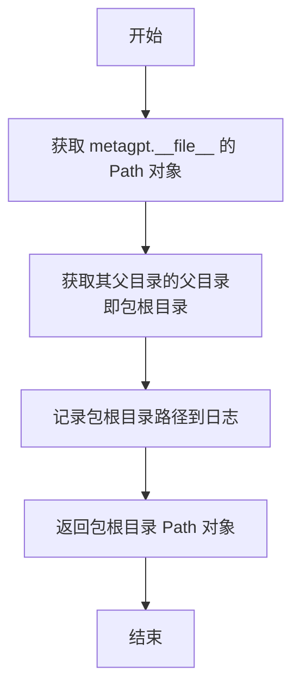

# `.\MetaGPT\metagpt\const.py` 详细设计文档

该文件是MetaGPT项目的核心配置文件，主要功能是定义和管理项目运行所需的各种全局常量、路径配置和环境变量。它通过环境变量和文件系统检测来确定项目根目录，并基于此构建出一系列用于数据存储、模板、文档、测试等功能的标准化文件路径，为整个项目的模块化运行提供统一的配置基础。

## 整体流程

```mermaid
graph TD
    A[开始执行] --> B{环境变量METAGPT_PROJECT_ROOT存在?}
    B -- 是 --> C[使用环境变量值作为项目根目录]
    B -- 否 --> D[调用get_metagpt_package_root获取包根目录]
    D --> E{包根目录下存在.git/.project_root/.gitignore?}
    E -- 是 --> F[确认包根目录为项目根目录]
    E -- 否 --> G[使用当前工作目录作为项目根目录]
    F --> H[返回项目根目录]
    G --> H
    C --> H
    H --> I[基于项目根目录(METAGPT_ROOT)计算并定义所有路径常量]
    I --> J[定义其他非路径相关的全局常量]
    J --> K[常量定义完成，文件加载结束]
```

## 类结构

```
该文件不包含类定义，是一个纯配置和常量定义模块。
```

## 全局变量及字段


### `CONFIG_ROOT`
    
MetaGPT配置文件的根目录，默认位于用户主目录下的.metagpt文件夹。

类型：`pathlib.Path`
    


### `METAGPT_ROOT`
    
MetaGPT项目的根目录，根据环境变量METAGPT_PROJECT_ROOT或项目结构自动确定。

类型：`pathlib.Path`
    


### `DEFAULT_WORKSPACE_ROOT`
    
默认的工作空间根目录，位于项目根目录下的workspace文件夹。

类型：`pathlib.Path`
    


### `EXAMPLE_PATH`
    
示例代码的根目录，位于项目根目录下的examples文件夹。

类型：`pathlib.Path`
    


### `EXAMPLE_DATA_PATH`
    
示例数据目录，位于示例路径下的data文件夹。

类型：`pathlib.Path`
    


### `DATA_PATH`
    
项目数据目录，位于项目根目录下的data文件夹。

类型：`pathlib.Path`
    


### `DABENCH_PATH`
    
DABench数据集的路径，位于示例路径下的di/InfiAgent-DABench/data文件夹。

类型：`pathlib.Path`
    


### `EXAMPLE_BENCHMARK_PATH`
    
示例基准测试数据路径，位于示例路径下的data/rag_bm文件夹。

类型：`pathlib.Path`
    


### `TEST_DATA_PATH`
    
测试数据目录，位于项目根目录下的tests/data文件夹。

类型：`pathlib.Path`
    


### `RESEARCH_PATH`
    
研究数据目录，位于数据路径下的research文件夹。

类型：`pathlib.Path`
    


### `TUTORIAL_PATH`
    
教程文档目录，位于数据路径下的tutorial_docx文件夹。

类型：`pathlib.Path`
    


### `INVOICE_OCR_TABLE_PATH`
    
发票OCR表格数据目录，位于数据路径下的invoice_table文件夹。

类型：`pathlib.Path`
    


### `UT_PATH`
    
单元测试数据目录，位于数据路径下的ut文件夹。

类型：`pathlib.Path`
    


### `SWAGGER_PATH`
    
Swagger API文档路径，位于单元测试路径下的files/api文件夹。

类型：`pathlib.Path`
    


### `UT_PY_PATH`
    
Python单元测试文件路径，位于单元测试路径下的files/ut文件夹。

类型：`pathlib.Path`
    


### `API_QUESTIONS_PATH`
    
API相关问题数据路径，位于单元测试路径下的files/question文件夹。

类型：`pathlib.Path`
    


### `SERDESER_PATH`
    
序列化与反序列化存储路径，位于默认工作空间下的storage文件夹。

类型：`pathlib.Path`
    


### `TMP`
    
临时文件目录，位于项目根目录下的tmp文件夹。

类型：`pathlib.Path`
    


### `SOURCE_ROOT`
    
源代码根目录，位于项目根目录下的metagpt文件夹。

类型：`pathlib.Path`
    


### `PROMPT_PATH`
    
提示词模板目录，位于源代码根目录下的prompts文件夹。

类型：`pathlib.Path`
    


### `SKILL_DIRECTORY`
    
技能定义目录，位于源代码根目录下的skills文件夹。

类型：`pathlib.Path`
    


### `TOOL_SCHEMA_PATH`
    
工具模式定义路径，位于项目根目录下的metagpt/tools/schemas文件夹。

类型：`pathlib.Path`
    


### `TOOL_LIBS_PATH`
    
工具库路径，位于项目根目录下的metagpt/tools/libs文件夹。

类型：`pathlib.Path`
    


### `TEMPLATE_FOLDER_PATH`
    
模板文件夹根目录，位于项目根目录下的template文件夹。

类型：`pathlib.Path`
    


### `VUE_TEMPLATE_PATH`
    
Vue.js前端模板路径，位于模板文件夹下的vue_template文件夹。

类型：`pathlib.Path`
    


### `REACT_TEMPLATE_PATH`
    
React前端模板路径，位于模板文件夹下的react_template文件夹。

类型：`pathlib.Path`
    


### `MEM_TTL`
    
内存中数据的默认生存时间（Time To Live），单位为秒，默认为30天。

类型：`int`
    


### `MESSAGE_ROUTE_FROM`
    
消息路由元数据键，标识消息的发送者。

类型：`str`
    


### `MESSAGE_ROUTE_TO`
    
消息路由元数据键，标识消息的接收者。

类型：`str`
    


### `MESSAGE_ROUTE_CAUSE_BY`
    
消息路由元数据键，标识触发此消息的原因或动作。

类型：`str`
    


### `MESSAGE_META_ROLE`
    
消息元数据键，标识消息发送者的角色。

类型：`str`
    


### `MESSAGE_ROUTE_TO_ALL`
    
特殊的路由目标标识符，表示消息发送给所有接收者。

类型：`str`
    


### `MESSAGE_ROUTE_TO_NONE`
    
特殊的路由目标标识符，表示消息不发送给任何接收者。

类型：`str`
    


### `MESSAGE_ROUTE_TO_SELF`
    
特殊的路由目标标识符，表示消息发送给自己，用于替换ActionOutput。

类型：`str`
    


### `REQUIREMENT_FILENAME`
    
需求文档的标准文件名。

类型：`str`
    


### `BUGFIX_FILENAME`
    
Bug修复文档的标准文件名。

类型：`str`
    


### `PACKAGE_REQUIREMENTS_FILENAME`
    
Python包依赖文件的标准文件名。

类型：`str`
    


### `DOCS_FILE_REPO`
    
文档文件仓库的默认目录名称。

类型：`str`
    


### `PRDS_FILE_REPO`
    
产品需求文档（PRD）文件仓库的默认目录名称。

类型：`str`
    


### `SYSTEM_DESIGN_FILE_REPO`
    
系统设计文档文件仓库的默认目录名称。

类型：`str`
    


### `TASK_FILE_REPO`
    
任务文档文件仓库的默认目录名称。

类型：`str`
    


### `CODE_PLAN_AND_CHANGE_FILE_REPO`
    
代码计划与变更文档文件仓库的默认目录名称。

类型：`str`
    


### `COMPETITIVE_ANALYSIS_FILE_REPO`
    
竞品分析文档文件仓库的默认目录名称。

类型：`str`
    


### `DATA_API_DESIGN_FILE_REPO`
    
数据API设计文档文件仓库的默认目录名称。

类型：`str`
    


### `SEQ_FLOW_FILE_REPO`
    
序列流程图文档文件仓库的默认目录名称。

类型：`str`
    


### `SYSTEM_DESIGN_PDF_FILE_REPO`
    
系统设计PDF文档文件仓库的默认目录名称。

类型：`str`
    


### `PRD_PDF_FILE_REPO`
    
产品需求文档（PRD）PDF文件仓库的默认目录名称。

类型：`str`
    


### `TASK_PDF_FILE_REPO`
    
任务PDF文档文件仓库的默认目录名称。

类型：`str`
    


### `CODE_PLAN_AND_CHANGE_PDF_FILE_REPO`
    
代码计划与变更PDF文档文件仓库的默认目录名称。

类型：`str`
    


### `TEST_CODES_FILE_REPO`
    
测试代码文件仓库的默认目录名称。

类型：`str`
    


### `TEST_OUTPUTS_FILE_REPO`
    
测试输出文件仓库的默认目录名称。

类型：`str`
    


### `CODE_SUMMARIES_FILE_REPO`
    
代码摘要文档文件仓库的默认目录名称。

类型：`str`
    


### `CODE_SUMMARIES_PDF_FILE_REPO`
    
代码摘要PDF文档文件仓库的默认目录名称。

类型：`str`
    


### `RESOURCES_FILE_REPO`
    
资源文件仓库的默认目录名称。

类型：`str`
    


### `SD_OUTPUT_FILE_REPO`
    
系统设计输出文件仓库的默认路径，指向默认工作空间根目录。

类型：`pathlib.Path`
    


### `GRAPH_REPO_FILE_REPO`
    
图数据库仓库文件仓库的默认目录名称。

类型：`str`
    


### `VISUAL_GRAPH_REPO_FILE_REPO`
    
可视化图数据库仓库文件仓库的默认目录名称。

类型：`str`
    


### `CLASS_VIEW_FILE_REPO`
    
类视图文档文件仓库的默认目录名称。

类型：`str`
    


### `YAPI_URL`
    
YAPI接口管理平台的默认URL地址。

类型：`str`
    


### `SD_URL`
    
系统设计服务的默认URL地址。

类型：`str`
    


### `DEFAULT_LANGUAGE`
    
系统默认使用的语言。

类型：`str`
    


### `DEFAULT_MAX_TOKENS`
    
LLM（大语言模型）默认的最大生成令牌数。

类型：`int`
    


### `COMMAND_TOKENS`
    
为命令预留的令牌数量。

类型：`int`
    


### `BRAIN_MEMORY`
    
环境变量键名，用于配置大脑（智能体）的记忆存储。

类型：`str`
    


### `SKILL_PATH`
    
环境变量键名，用于配置技能文件的路径。

类型：`str`
    


### `SERPER_API_KEY`
    
环境变量键名，用于配置Serper API的访问密钥。

类型：`str`
    


### `DEFAULT_TOKEN_SIZE`
    
默认的令牌大小（用于文本处理）。

类型：`int`
    


### `BASE64_FORMAT`
    
Base64编码格式的标识字符串。

类型：`str`
    


### `REDIS_KEY`
    
环境变量键名，用于配置Redis相关的密钥。

类型：`str`
    


### `IGNORED_MESSAGE_ID`
    
被忽略的消息ID标识符。

类型：`str`
    


### `GENERALIZATION`
    
类关系类型：泛化（继承）。

类型：`str`
    


### `COMPOSITION`
    
类关系类型：组合。

类型：`str`
    


### `AGGREGATION`
    
类关系类型：聚合。

类型：`str`
    


### `USE_CONFIG_TIMEOUT`
    
超时配置标志，值为0表示使用LLM配置中的超时设置。

类型：`int`
    


### `LLM_API_TIMEOUT`
    
LLM API调用的默认超时时间（秒）。

类型：`int`
    


### `ASSISTANT_ALIAS`
    
LLM响应中助手的默认别名。

类型：`str`
    


### `MARKDOWN_TITLE_PREFIX`
    
Markdown文档中二级标题的标准前缀。

类型：`str`
    


### `METAGPT_REPORTER_DEFAULT_URL`
    
MetaGPT报告服务的默认URL，从环境变量METAGPT_REPORTER_URL获取。

类型：`str`
    


### `AGENT`
    
元数据定义键，标识代理（智能体）。

类型：`str`
    


### `IMAGES`
    
元数据定义键，标识图像数据。

类型：`str`
    


### `SWE_SETUP_PATH`
    
SWE（软件工程）代理默认设置脚本的路径。

类型：`pathlib.Path`
    


### `EXPERIENCE_MASK`
    
经验池中用于标记经验内容的特殊字符串。

类型：`str`
    


### `TEAMLEADER_NAME`
    
团队领导（TeamLeader）的默认名称。

类型：`str`
    


### `DEFAULT_MIN_TOKEN_COUNT`
    
默认的最小令牌数量阈值。

类型：`int`
    


### `DEFAULT_MAX_TOKEN_COUNT`
    
默认的最大令牌数量阈值。

类型：`int`
    


    

## 全局函数及方法


### `get_metagpt_package_root`

该函数用于获取已安装的 `metagpt` Python 包的根目录路径。它通过定位 `metagpt` 模块的 `__file__` 属性，并向上追溯两级目录来确定包的安装位置，最后记录日志并返回该路径。

参数：
- 无

返回值：`pathlib.Path`，表示已安装的 `metagpt` 包的根目录路径对象。

#### 流程图



#### 带注释源码

```python
def get_metagpt_package_root():
    """Get the root directory of the installed package."""
    # 1. 通过 metagpt.__file__ 获取模块文件的绝对路径，并转换为 Path 对象
    # 2. .parent.parent 向上追溯两级，通常从 `.../site-packages/metagpt/__init__.py`
    #    定位到 `.../site-packages/`，即包的安装根目录
    package_root = Path(metagpt.__file__).parent.parent
    # 3. 使用 logger 记录找到的包根目录路径，便于调试和追踪
    logger.info(f"Package root set to {str(package_root)}")
    # 4. 返回 Path 对象
    return package_root
```


### `get_metagpt_root`

获取 MetaGPT 项目的根目录。该函数首先检查环境变量 `METAGPT_PROJECT_ROOT` 是否被设置，如果设置了则使用该路径作为项目根目录。如果未设置，则回退到使用 `get_metagpt_package_root` 函数获取已安装包的根目录，并检查该目录下是否存在 `.git`、`.project_root` 或 `.gitignore` 等标志性文件。如果存在，则将其作为项目根目录；否则，将当前工作目录作为项目根目录。

参数：
- 无显式参数。

返回值：`pathlib.Path`，表示确定的项目根目录路径。

#### 流程图

```mermaid
flowchart TD
    A[开始] --> B{环境变量<br>METAGPT_PROJECT_ROOT<br>是否设置?}
    B -- 是 --> C[从环境变量获取路径<br>project_root = Path(project_root_env)]
    B -- 否 --> D[调用 get_metagpt_package_root<br>获取包根目录]
    D --> E{包根目录下是否存在<br>.git, .project_root, .gitignore<br>任一文件?}
    E -- 是 --> F[使用包根目录作为项目根目录]
    E -- 否 --> G[使用当前工作目录<br>作为项目根目录]
    C --> H[记录日志并返回 project_root]
    F --> H
    G --> H
```

#### 带注释源码

```python
def get_metagpt_root():
    """Get the project root directory."""
    # 检查环境变量 METAGPT_PROJECT_ROOT 是否被设置
    project_root_env = os.getenv("METAGPT_PROJECT_ROOT")
    if project_root_env:
        # 如果设置了环境变量，则使用该路径作为项目根目录
        project_root = Path(project_root_env)
        logger.info(f"PROJECT_ROOT set from environment variable to {str(project_root)}")
    else:
        # 如果未设置环境变量，则回退到获取已安装包的根目录
        project_root = get_metagpt_package_root()
        # 检查包根目录下是否存在项目标志文件（如 .git）
        for i in (".git", ".project_root", ".gitignore"):
            if (project_root / i).exists():
                break
        else:
            # 如果未找到任何标志文件，则将当前工作目录作为项目根目录
            project_root = Path.cwd()

    # 返回最终确定的项目根目录路径
    return project_root
```

## 关键组件


### 路径与配置管理

定义了项目根目录、包根目录、工作空间、数据目录、模板目录等关键路径的获取逻辑和常量，是项目文件系统访问的基础。

### 环境变量与配置

通过环境变量 `METAGPT_PROJECT_ROOT` 支持自定义项目根目录，并定义了多个配置常量，如内存TTL、消息路由标签、默认语言、超时设置等，用于控制应用行为。

### 消息路由与通信

定义了消息路由的关键常量（如 `MESSAGE_ROUTE_FROM`, `MESSAGE_ROUTE_TO`, `MESSAGE_ROUTE_CAUSE_BY`）和特殊路由目标（如 `MESSAGE_ROUTE_TO_ALL`），构成了Agent间通信协议的基础。

### 文件仓库定义

定义了项目中各类文档（如需求文档、设计文档、测试代码）和资源（如图表、PDF）的存储路径常量，明确了项目的输出结构和组织规范。

### 外部服务与集成

包含了外部服务的URL配置（如 `YAPI_URL`, `SD_URL`）和API密钥的环境变量名（如 `SERPER_API_KEY`），定义了项目与外部系统的集成点。


## 问题及建议


### 已知问题

-   **环境变量依赖的副作用**：`get_metagpt_root` 函数优先读取 `METAGPT_PROJECT_ROOT` 环境变量来确定项目根目录。如果用户无意中设置了此变量，可能导致代码在错误的目录下寻找资源（如 `examples`、`data`），从而引发 `FileNotFoundError` 或加载到错误的配置文件，且错误原因不易排查。
-   **硬编码的路径与外部依赖**：代码中大量路径（如 `YAPI_URL`、`SD_URL`、`SWE_SETUP_PATH`）被硬编码。这些 URL 或路径可能因部署环境（开发、测试、生产）或项目结构调整而失效，缺乏灵活性，增加了维护成本和部署风险。
-   **潜在的循环导入风险**：`METAGPT_ROOT` 等全局变量的定义依赖于 `get_metagpt_root()` 函数的执行结果，而该函数又导入了 `metagpt` 模块。如果其他模块在导入时尝试使用这些尚未完全初始化的全局变量，可能导致初始化顺序问题或难以调试的错误。
-   **`get_metagpt_root` 回退逻辑可能不准确**：当未设置 `METAGPT_PROJECT_ROOT` 且包根目录下不存在 `.git`、`.project_root` 或 `.gitignore` 标记文件时，函数会回退到当前工作目录 (`Path.cwd()`)。如果用户从非项目目录（如 `/tmp`）运行脚本，这会将项目根目录错误地设置为无关路径，导致后续路径解析全部错误。
-   **常量定义与使用场景混杂**：文件同时定义了真正的常量（如 `MEM_TTL`）、路径配置、消息路由标签、业务逻辑相关的文件名等。这种混杂降低了代码的可读性和可维护性，使得定位特定类型的配置变得困难。

### 优化建议

-   **增强配置的灵活性与安全性**：
    -   建议将 `YAPI_URL`、`SD_URL` 等外部服务地址以及可能变化的路径（如各种 `*_PATH`）移至配置文件（如 YAML、JSON）或通过环境变量注入，实现配置与代码分离。
    -   对于 `METAGPT_PROJECT_ROOT`，可在代码中提供清晰的回退提示或警告日志，帮助用户诊断问题。或者，提供一个显式的设置函数，而非完全依赖环境变量。
-   **重构路径获取与常量组织**：
    -   将 `get_metagpt_root` 的逻辑封装到一个类或更健壮的函数中，增加对回退路径有效性的验证（例如，检查预期子目录是否存在）。
    -   考虑将常量按功能模块拆分到不同的配置文件中，例如：`paths_config.py`、`message_constants.py`、`business_constants.py`，提高模块化和可读性。
-   **明确初始化顺序与依赖**：
    -   确保关键路径变量（如 `METAGPT_ROOT`）的初始化在应用启动早期完成，并避免在模块导入时执行复杂的逻辑或产生副作用。可以考虑使用惰性初始化或配置对象来管理这些变量。
-   **代码健壮性与文档**：
    -   在 `get_metagpt_root` 函数中，当回退到当前工作目录时，可以记录一个警告（`logger.warning`），提示用户这可能不是预期的项目根目录。
    -   为关键配置项和函数添加更详细的文档字符串，说明其用途、依赖关系和可能的影响。
-   **移除未使用的常量**：定期审查代码，移除未被引用的常量定义（例如，检查 `DEFAULT_MIN_TOKEN_COUNT`, `DEFAULT_MAX_TOKEN_COUNT` 等是否确实被使用），以保持代码库的整洁。


## 其它


### 设计目标与约束

本模块的设计目标是提供一个集中、可配置的路径和常量定义系统，用于支撑 MetaGPT 项目的运行。其核心约束包括：
1.  **环境感知**：能够根据运行环境（如通过环境变量 `METAGPT_PROJECT_ROOT` 指定）动态确定项目根目录，以支持开发、安装包和自定义部署等多种场景。
2.  **向后兼容与灵活性**：在未明确指定项目根目录时，提供合理的默认回退机制（如查找 `.git` 等标识文件），确保代码在典型场景下能正常工作。
3.  **集中管理**：将项目中分散在各处的文件路径、关键常量（如消息路由标签、文件名、超时设置等）统一在此模块中定义，作为唯一的“事实来源”，便于维护和修改。
4.  **初始化确定性**：模块中的路径变量在导入时即被计算并赋值，确保在整个应用生命周期内其值是确定且一致的。

### 错误处理与异常设计

本模块主要进行路径解析和常量定义，不包含复杂的业务逻辑，因此错误处理相对简单：
1.  **静默失败与默认回退**：在 `get_metagpt_root` 函数中，当环境变量未设置且无法在包根目录找到项目标识文件时，函数会静默地回退到当前工作目录 (`Path.cwd()`)。这是一种防御性设计，避免了因路径问题导致程序启动失败，但可能将潜在的环境配置问题掩盖到后续操作中。
2.  **日志记录**：关键步骤（如从环境变量读取路径、设置包根目录）通过 `logger.info` 进行记录，这有助于在调试时了解模块的初始化状态和决策过程。
3.  **缺乏显式异常**：模块没有定义或抛出任何自定义异常。对于文件系统访问（如 `Path.exists()`）可能引发的 `OSError` 等异常，目前没有进行捕获和处理，依赖调用方或Python解释器处理。

### 数据流与状态机

本模块不涉及复杂的数据流或状态机。其数据流是单向且静态的：
1.  **初始化流程**：
    *   入口：Python解释器导入本模块。
    *   过程：首先执行两个函数定义 (`get_metagpt_package_root`, `get_metagpt_root`)，然后顺序执行顶层的赋值语句。
    *   关键依赖：`METAGPT_ROOT` 的值依赖于 `get_metagpt_root()` 函数的执行结果，而该函数可能依赖环境变量 `METAGPT_PROJECT_ROOT`。
    *   输出：一系列 `Path` 对象和基本类型（字符串、整数）的常量被赋值给相应的全局变量。
2.  **状态**：所有定义的变量（`CONFIG_ROOT`, `METAGPT_ROOT`, `DEFAULT_WORKSPACE_ROOT`, 各种 `*_PATH`, `MEM_TTL` 等）在模块初始化完成后即为常量，在整个应用程序运行期间保持不变，构成应用的静态配置上下文。

### 外部依赖与接口契约

1.  **外部依赖**：
    *   **Python标准库**：`os`, `pathlib.Path`。用于操作系统交互和路径操作。
    *   **第三方库**：`loguru.logger`。用于记录信息日志。
    *   **内部依赖**：`metagpt` 模块。仅用于通过 `metagpt.__file__` 定位已安装包的根目录。
2.  **接口契约（提供的服务）**：
    *   **函数**：
        *   `get_metagpt_package_root()` -> `Path`: 返回MetaGPT Python包的安装根目录。
        *   `get_metagpt_root()` -> `Path`: 返回MetaGPT项目的根目录（逻辑上的项目根，可能不同于包根）。
    *   **常量（全局变量）**：提供了一组只读的配置值，其他模块通过导入（如 `from metagpt.const import METAGPT_ROOT, PROMPT_PATH`）来使用这些值。这些常量定义了项目的基础目录结构、关键文件名、消息协议标签、超时设置等，是项目其他部分运行所依赖的基础配置。
3.  **环境变量契约**：
    *   `METAGPT_PROJECT_ROOT`：用于显式指定项目根目录路径。如果设置，`get_metagpt_root()` 将优先使用此值。
    *   `METAGPT_REPORTER_URL`：用于配置报告器的默认URL。如果未设置，则对应常量值为空字符串。

### 安全考虑

1.  **路径遍历风险**：`get_metagpt_root` 函数直接使用了用户通过环境变量提供的路径 (`os.getenv("METAGPT_PROJECT_ROOT")`)。如果恶意用户能够控制该环境变量，并将其指向一个敏感系统目录，后续基于 `METAGPT_ROOT` 的派生路径操作可能会意外访问或修改系统文件。目前代码没有对该路径进行安全性验证（如检查是否在预期范围内、是否为符号链接等）。
2.  **信息泄露**：通过 `logger.info` 记录的路径信息可能包含用户特定的目录结构，如果日志被不当收集或公开，可能泄露部分环境信息。但这通常不属于高风险。
3.  **配置常量安全**：定义的常量如 `SERPER_API_KEY`（变量名）本身不存储密钥值，但指示了从何处获取密钥。确保密钥实际通过安全的方式（如环境变量、密钥管理服务）注入，并由使用这些常量的模块安全地处理，是使用方的责任。

### 测试策略

1.  **单元测试重点**：
    *   `get_metagpt_package_root`：验证其返回的路径确实包含 `metagpt` 包。
    *   `get_metagpt_root`：需要模拟不同环境进行测试：
        *   环境变量 `METAGPT_PROJECT_ROOT` 被设置时。
        *   环境变量未设置，但在包根目录下存在 `.git` 等标识文件时。
        *   环境变量未设置，且包根目录下无标识文件时（应回退到当前目录）。
    *   **路径拼接正确性**：测试如 `DEFAULT_WORKSPACE_ROOT = METAGPT_ROOT / "workspace"` 等派生路径的生成是否符合预期。
2.  **测试方法**：使用 `unittest.mock` 来模拟 `os.getenv`, `Path.exists`, `Path.cwd` 以及 `metagpt.__file__` 的值，以覆盖各种分支条件。
3.  **常量测试**：确保常量的值符合设计预期（如 `MEM_TTL` 表示30天）。这类测试更接近于静态校验。
4.  **集成测试**：在其他模块的测试中，会间接测试对这些常量的使用是否正确，例如确保某个功能将文件保存到了 `DEFAULT_WORKSPACE_ROOT` 指定的正确位置。

    