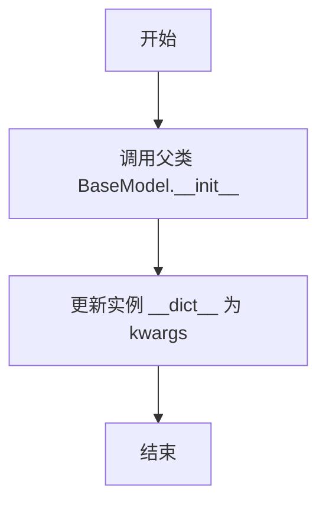
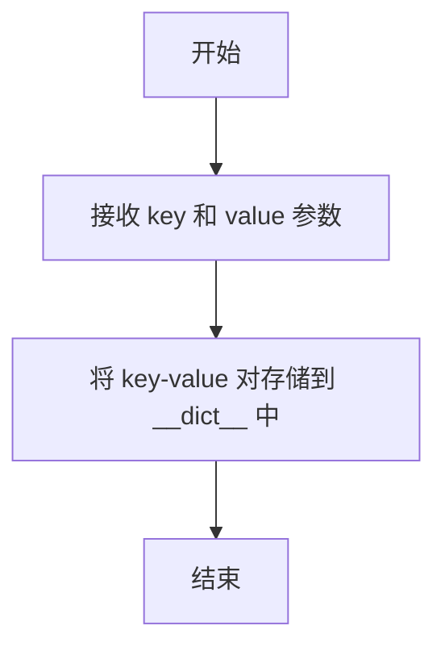
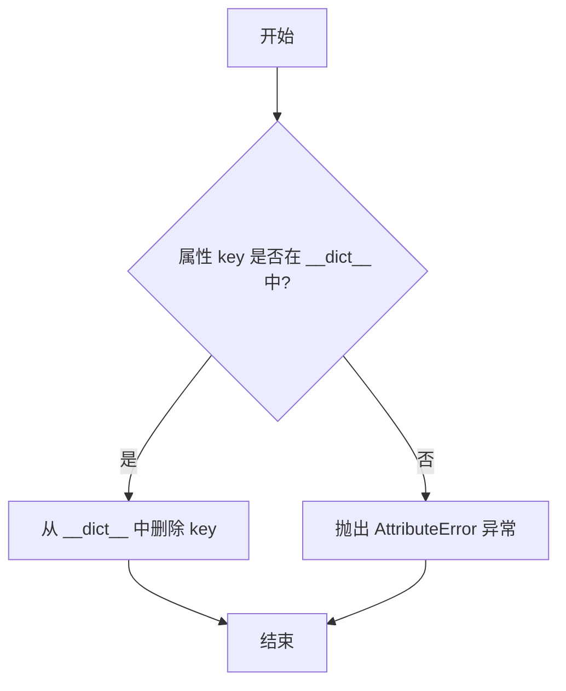
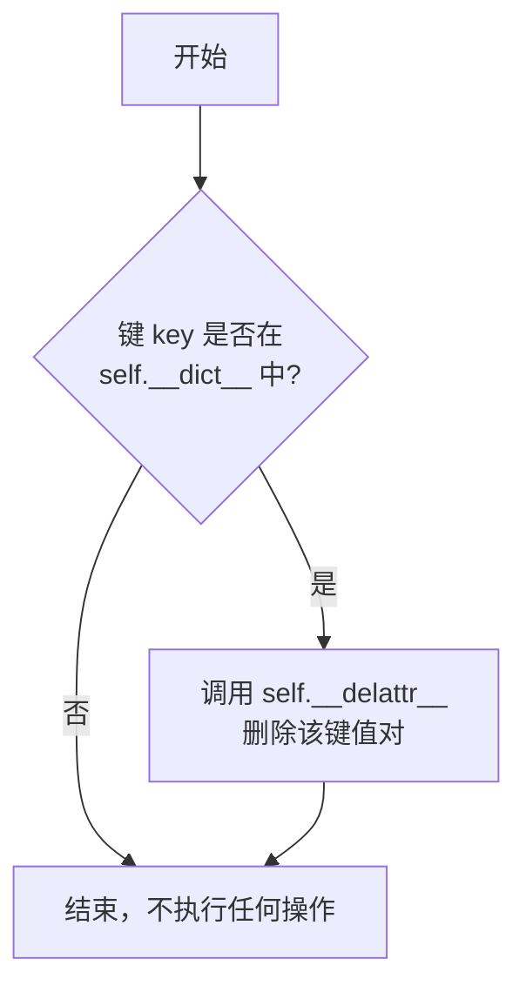
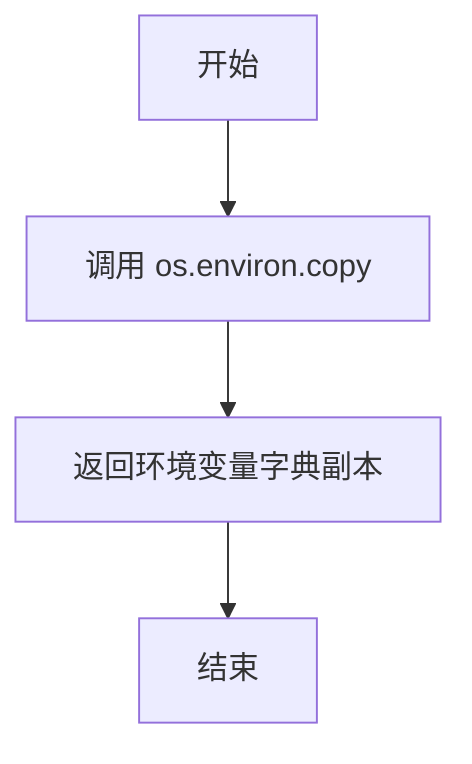
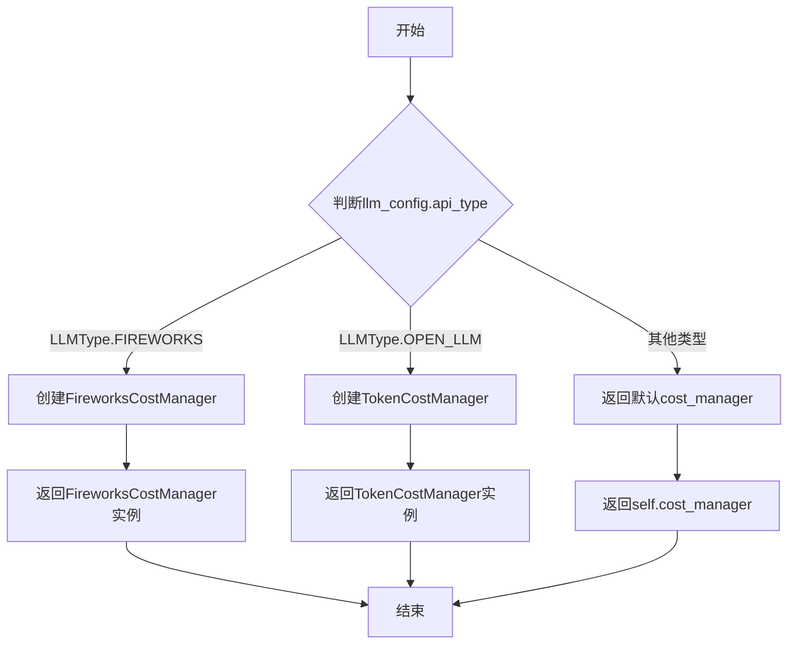
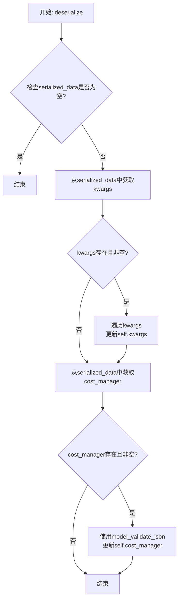

# `.\MetaGPT\metagpt\context.py` 详细设计文档

该文件定义了MetaGPT框架的核心上下文管理类`Context`和一个辅助字典类`AttrDict`。`Context`类作为环境上下文，负责管理配置、LLM实例创建、成本管理器选择以及序列化/反序列化功能，是连接配置系统与LLM提供商的桥梁。

## 整体流程

```mermaid
graph TD
    A[Context初始化] --> B[加载默认Config]
    B --> C[初始化CostManager]
    C --> D[调用.llm()方法]
    D --> E{_llm实例已存在?}
    E -- 否 --> F[调用create_llm_instance]
    F --> G{llm.cost_manager为None?}
    G -- 是 --> H[调用_select_costmanager]
    H --> I[根据LLMConfig.api_type选择CostManager]
    I --> J[将CostManager赋值给llm]
    J --> K[返回LLM实例]
    G -- 否 --> K
    E -- 是 --> K
```

## 类结构

```
BaseModel (Pydantic基类)
├── AttrDict (字典属性访问类)
└── Context (核心上下文类)
```

## 全局变量及字段


### `AttrDict.model_config`
    
Pydantic模型配置，设置为允许额外字段，使AttrDict能够动态存储任意键值对。

类型：`pydantic.ConfigDict`
    


### `Context.kwargs`
    
一个动态的、字典式的属性存储容器，用于存放运行时的上下文参数和配置。

类型：`AttrDict`
    


### `Context.config`
    
应用程序的核心配置对象，包含LLM配置等全局设置。

类型：`metagpt.config2.Config`
    


### `Context.cost_manager`
    
默认的成本管理器，用于跟踪和管理LLM API调用的开销。

类型：`metagpt.utils.cost_manager.CostManager`
    


### `Context._llm`
    
缓存的LLM实例，遵循单例模式，用于避免重复创建LLM客户端。

类型：`Optional[metagpt.provider.base_llm.BaseLLM]`
    
    

## 全局函数及方法

### `AttrDict.__init__`

该方法用于初始化 `AttrDict` 类的实例。它首先调用父类 `BaseModel` 的 `__init__` 方法，然后将传入的关键字参数更新到实例的 `__dict__` 中，使得这些参数可以通过属性方式访问。

参数：

- `**kwargs`：`Any`，可变关键字参数，用于初始化 `AttrDict` 实例的属性。

返回值：`None`，无返回值。

#### 流程图



#### 带注释源码

```python
def __init__(self, **kwargs):
    # 调用父类 BaseModel 的初始化方法，确保 Pydantic 模型的基本行为
    super().__init__(**kwargs)
    # 将传入的关键字参数更新到实例的 __dict__ 中，
    # 使得这些参数可以通过属性方式（如 obj.key）访问
    self.__dict__.update(kwargs)
```

### `AttrDict.__getattr__`

该方法用于在访问 `AttrDict` 对象的属性时，如果属性不存在，则返回 `None` 而不是抛出 `AttributeError` 异常。它通过重写 `__getattr__` 魔术方法，实现了类似字典的键值访问，但以属性的形式进行。

参数：

- `key`：`str`，要访问的属性名称。

返回值：`Any`，返回 `self.__dict__` 中对应键的值，如果键不存在则返回 `None`。

#### 流程图

```mermaid
flowchart TD
    A[开始] --> B[接收属性名 key]
    B --> C{检查 key 是否在 __dict__ 中}
    C -- 是 --> D[返回 __dict__[key]]
    C -- 否 --> E[返回 None]
    D --> F[结束]
    E --> F
```

#### 带注释源码

```python
def __getattr__(self, key):
    # 尝试从对象的 __dict__ 中获取 key 对应的值
    # 如果 key 不存在，则返回 None
    return self.__dict__.get(key, None)
```

### `AttrDict.__setattr__`

该方法用于设置 `AttrDict` 实例的属性。它重写了 Python 内置的 `__setattr__` 方法，允许通过属性赋值的方式直接修改内部字典 `__dict__` 中的键值对，从而实现类似字典的键值访问，但语法上更接近对象属性访问。

参数：

- `key`：`str`，要设置的属性名称
- `value`：`Any`，要设置的属性值

返回值：`None`，无返回值

#### 流程图



#### 带注释源码

```python
def __setattr__(self, key, value):
    # 将传入的 key 作为键，value 作为值，直接存储到实例的 __dict__ 字典中
    # 这使得可以通过 obj.key = value 的方式动态添加或修改属性
    self.__dict__[key] = value
```

### `AttrDict.__delattr__`

该方法用于删除 `AttrDict` 实例中的指定属性。如果属性存在，则从内部字典中删除；如果不存在，则抛出 `AttributeError` 异常。

参数：

- `key`：`str`，要删除的属性名称

返回值：`None`，无返回值

#### 流程图



#### 带注释源码

```python
def __delattr__(self, key):
    # 检查属性是否存在于实例的内部字典 __dict__ 中
    if key in self.__dict__:
        # 如果存在，则从 __dict__ 中删除该属性
        del self.__dict__[key]
    else:
        # 如果不存在，抛出 AttributeError 异常，提示属性不存在
        raise AttributeError(f"No such attribute: {key}")
```


### `AttrDict.set`

该方法用于设置 `AttrDict` 实例中的一个键值对。如果键已存在，则更新其值；如果键不存在，则创建新的键值对。

参数：

-  `key`：`Any`，要设置或更新的键名。
-  `val`：`Any`，要设置或更新的值。

返回值：`None`，此方法不返回任何值，仅修改实例的内部字典。

#### 流程图

```mermaid
flowchart TD
    A[开始: AttrDict.set(key, val)] --> B[将键值对 key: val 存入 self.__dict__]
    B --> C[结束]
```

#### 带注释源码

```python
def set(self, key, val: Any):
    # 将键值对直接存储到实例的 __dict__ 属性中
    # 如果 key 已存在，则更新其值；如果不存在，则创建新的键值对
    self.__dict__[key] = val
```


### `AttrDict.get`

该方法用于安全地从 `AttrDict` 实例的内部字典中获取指定键对应的值。如果键不存在，则返回一个用户指定的默认值，从而避免了直接访问可能引发的 `KeyError` 异常。

参数：

- `key`：`Any`，需要获取值的键。
- `default`：`Any`，可选参数，当键不存在时返回的默认值。默认为 `None`。

返回值：`Any`，返回与键关联的值；如果键不存在，则返回 `default` 参数指定的值。

#### 流程图

```mermaid
flowchart TD
    A[开始: get(key, default=None)] --> B{键 key 是否在 __dict__ 中?}
    B -- 是 --> C[返回 __dict__[key]]
    B -- 否 --> D[返回 default 值]
    C --> E[结束]
    D --> E
```

#### 带注释源码

```python
def get(self, key, default: Any = None):
    # 调用内部字典 __dict__ 的 get 方法
    # 如果 key 存在，返回对应的 value
    # 如果 key 不存在，返回指定的 default 值（默认为 None）
    return self.__dict__.get(key, default)
```


### `AttrDict.remove`

该方法用于从 `AttrDict` 实例中删除一个指定的键值对。它首先检查键是否存在，如果存在则调用 `__delattr__` 方法进行删除，否则不执行任何操作。

参数：

-  `key`：`str`，需要从字典中删除的键名。

返回值：`None`，该方法不返回任何值。

#### 流程图



#### 带注释源码

```python
def remove(self, key):
    # 检查指定的键是否存在于实例的内部字典 `__dict__` 中
    if key in self.__dict__:
        # 如果键存在，则调用 `__delattr__` 魔术方法执行删除操作
        self.__delattr__(key)
    # 如果键不存在，则静默地忽略，不执行任何操作
```


### `Context.new_environ`

该方法用于创建一个新的操作系统环境变量字典副本。它复制当前进程的环境变量，并返回一个可修改的字典副本，而不会影响原始的系统环境。

参数：
-  `self`：`Context`，`Context` 类的实例，代表当前的上下文环境。

返回值：`dict`，一个包含当前进程所有环境变量键值对的字典副本。

#### 流程图



#### 带注释源码

```python
def new_environ(self):
    """Return a new os.environ object"""
    # 使用 os.environ.copy() 创建当前环境变量的一个副本
    env = os.environ.copy()
    # 以下注释掉的代码展示了潜在的扩展点：可以从上下文的其他属性（如 self.options）中
    # 筛选出字符串类型的键值对，并更新到环境变量副本中。
    # i = self.options
    # env.update({k: v for k, v in i.items() if isinstance(v, str)})
    return env
```


### `Context._select_costmanager`

根据传入的LLM配置，选择并返回相应的成本管理器实例。

参数：

- `llm_config`：`LLMConfig`，LLM配置对象，包含API类型等信息

返回值：`CostManager`，根据LLM配置选择的具体成本管理器实例

#### 流程图



#### 带注释源码

```python
def _select_costmanager(self, llm_config: LLMConfig) -> CostManager:
    """Return a CostManager instance"""
    # 如果LLM配置的API类型是FIREWORKS，则返回FireworksCostManager实例
    if llm_config.api_type == LLMType.FIREWORKS:
        return FireworksCostManager()
    # 如果LLM配置的API类型是OPEN_LLM，则返回TokenCostManager实例
    elif llm_config.api_type == LLMType.OPEN_LLM:
        return TokenCostManager()
    # 其他情况返回默认的cost_manager
    else:
        return self.cost_manager
```

### `Context.llm`

该方法用于获取或创建一个配置好的大语言模型（LLM）实例。它会根据`Context`对象中存储的配置信息（`self.config.llm`）来创建LLM实例，并确保该实例关联一个合适的成本管理器（`CostManager`）。如果实例尚未创建或需要更新，则会创建新的实例。

参数：
-  `self`：`Context`，当前`Context`类的实例。

返回值：`BaseLLM`，一个配置好的大语言模型实例。

#### 流程图

```mermaid
flowchart TD
    A[开始调用 llm()] --> B{检查 _llm 是否已存在?};
    B -- 是 --> C[返回已缓存的 _llm];
    B -- 否 --> D[调用 create_llm_instance<br>根据 self.config.llm 创建新实例];
    D --> E{检查新实例的<br>cost_manager 是否为 None?};
    E -- 是 --> F[调用 _select_costmanager<br>根据配置选择合适的成本管理器];
    F --> G[将 cost_manager 赋值给新实例];
    E -- 否 --> G;
    G --> H[将新实例赋值给 self._llm];
    H --> I[返回 self._llm];
```

#### 带注释源码

```python
def llm(self) -> BaseLLM:
    """Return a LLM instance, fixme: support cache"""
    # if self._llm is None: # 注释掉的缓存逻辑
    # 根据当前配置中的LLM配置（self.config.llm）创建一个新的LLM实例
    self._llm = create_llm_instance(self.config.llm)
    # 如果新创建的LLM实例没有关联成本管理器
    if self._llm.cost_manager is None:
        # 根据LLM配置选择一个合适的成本管理器并关联
        self._llm.cost_manager = self._select_costmanager(self.config.llm)
    # 返回配置好的LLM实例
    return self._llm
```


### `Context.llm_with_cost_manager_from_llm_config`

该方法根据传入的 `LLMConfig` 配置对象，创建一个 `BaseLLM` 实例，并为其关联一个合适的成本管理器 (`CostManager`)。它主要用于在需要动态使用不同LLM配置的场景下，获取一个配置完整、可计费的LLM客户端。

参数：

-  `llm_config`：`LLMConfig`，一个包含LLM提供商、API密钥、模型名称等配置信息的对象。

返回值：`BaseLLM`，一个配置了成本管理器的LLM客户端实例。

#### 流程图

```mermaid
flowchart TD
    A[开始: 传入 llm_config] --> B[调用 create_llm_instance(llm_config)]
    B --> C{检查 llm.cost_manager 是否为 None?}
    C -- 是 --> D[调用 _select_costmanager(llm_config)]
    D --> E[将返回的 CostManager 赋值给 llm.cost_manager]
    C -- 否 --> F[直接使用 llm 现有的 cost_manager]
    E --> G[返回配置好的 llm 实例]
    F --> G
```

#### 带注释源码

```python
def llm_with_cost_manager_from_llm_config(self, llm_config: LLMConfig) -> BaseLLM:
    """Return a LLM instance, fixme: support cache"""
    # 根据传入的配置创建LLM实例
    llm = create_llm_instance(llm_config)
    # 如果创建的LLM实例没有成本管理器，则根据配置为其选择一个
    if llm.cost_manager is None:
        llm.cost_manager = self._select_costmanager(llm_config)
    # 返回配置好的LLM实例
    return llm
```


### `Context.serialize`

该方法用于将`Context`对象的特定属性序列化为一个字典，以便于存储或传输。它主要序列化`kwargs`和`cost_manager`字段。

参数：

-  `self`：`Context`，当前`Context`实例

返回值：`Dict[str, Any]`，包含序列化数据的字典，其中`kwargs`被转换为普通字典，`cost_manager`被序列化为JSON字符串。

#### 流程图

```mermaid
graph TD
    A[开始] --> B[初始化空字典 result]
    B --> C[遍历 self.kwargs.__dict__ 的键值对]
    C --> D[将键值对添加到 result['kwargs'] 字典中]
    D --> E[调用 self.cost_manager.model_dump_json 获取JSON字符串]
    E --> F[将JSON字符串赋值给 result['cost_manager']]
    F --> G[返回 result 字典]
    G --> H[结束]
```

#### 带注释源码

```python
def serialize(self) -> Dict[str, Any]:
    """Serialize the object's attributes into a dictionary.

    Returns:
        Dict[str, Any]: A dictionary containing serialized data.
    """
    return {
        # 将 self.kwargs 的 __dict__ 属性（一个字典）转换为一个新的字典，
        # 确保序列化的是原始数据而非 AttrDict 对象本身。
        "kwargs": {k: v for k, v in self.kwargs.__dict__.items()},
        # 使用 Pydantic 的 model_dump_json 方法将 cost_manager 对象序列化为 JSON 字符串。
        "cost_manager": self.cost_manager.model_dump_json(),
    }
```


### `Context.deserialize`

该方法用于将序列化的数据字典反序列化，并更新当前`Context`对象的`kwargs`和`cost_manager`属性。

参数：
-  `serialized_data`：`Dict[str, Any]`，包含序列化数据的字典，通常由`serialize`方法生成。

返回值：`None`，该方法不返回任何值，直接更新当前对象的状态。

#### 流程图



#### 带注释源码

```python
def deserialize(self, serialized_data: Dict[str, Any]):
    """Deserialize the given serialized data and update the object's attributes accordingly.

    Args:
        serialized_data (Dict[str, Any]): A dictionary containing serialized data.
    """
    # 1. 检查输入数据是否为空，为空则直接返回
    if not serialized_data:
        return
    # 2. 从序列化数据中提取kwargs字典
    kwargs = serialized_data.get("kwargs")
    # 3. 如果kwargs存在，则遍历其键值对，更新到self.kwargs中
    if kwargs:
        for k, v in kwargs.items():
            self.kwargs.set(k, v)
    # 4. 从序列化数据中提取cost_manager的JSON字符串
    cost_manager = serialized_data.get("cost_manager")
    # 5. 如果cost_manager存在，则使用Pydantic的model_validate_json方法
    #    将其反序列化并赋值给self.cost_manager
    if cost_manager:
        self.cost_manager.model_validate_json(cost_manager)
```


## 关键组件


### AttrDict

一个类似字典的对象，允许以属性方式访问键值，并与Pydantic兼容，用于灵活存储和访问上下文中的动态配置项。

### Context

MetaGPT的环境上下文，负责管理配置、LLM实例、成本管理器以及提供序列化/反序列化功能，是应用运行的核心环境容器。

### LLM实例创建与成本管理器选择

通过`create_llm_instance`工厂函数创建LLM实例，并根据LLM配置（`LLMConfig`）的类型（如FIREWORKS、OPEN_LLM）动态选择相应的成本管理器（`CostManager`、`FireworksCostManager`、`TokenCostManager`），实现LLM使用成本的差异化管理和计算。

### 序列化与反序列化

提供`serialize`和`deserialize`方法，用于将上下文对象（特别是`kwargs`和`cost_manager`）的状态转换为字典格式进行持久化存储或传输，并能从序列化数据中恢复对象状态。


## 问题及建议


### 已知问题

-   **`_llm` 缓存逻辑缺失**：`Context.llm()` 方法注释中提到“fixme: support cache”，但目前代码每次调用都会创建新的 `BaseLLM` 实例。这可能导致性能开销，尤其是在频繁调用时，且无法复用已建立的连接或会话状态。
-   **`AttrDict` 与 Pydantic 的潜在冲突**：`AttrDict` 继承自 `BaseModel` 但使用 `__dict__` 进行属性管理，并设置了 `extra="allow"`。这种模式可能在某些 Pydantic 验证或序列化场景下产生非预期行为，因为它绕过了 Pydantic 的标准字段声明和类型检查机制。
-   **`new_environ` 方法功能不完整**：该方法目前仅复制了 `os.environ`，注释掉的代码表明其原本意图是从 `self.options`（可能应为 `self.kwargs`）更新环境变量。当前实现与其设计目标不符，功能缺失。
-   **序列化/反序列化方法不完整**：`serialize` 和 `deserialize` 方法只处理了 `kwargs` 和 `cost_manager` 字段，忽略了 `Context` 类的核心 `config` 字段。这可能导致上下文状态在持久化或传输后丢失关键配置信息。
-   **`_select_costmanager` 方法默认回退逻辑可能不当**：当 `llm_config.api_type` 既不是 `FIREWORKS` 也不是 `OPEN_LLM` 时，方法返回 `self.cost_manager`（即实例初始化时的默认 `CostManager`）。这可能不是所有第三方 `LLMType` 的最优或正确选择，缺乏针对未知类型的明确处理策略（如记录警告、抛出异常或提供可配置的默认映射）。

### 优化建议

-   **实现 `_llm` 实例缓存**：在 `Context.llm()` 方法中引入缓存机制。可以检查 `self._llm` 是否为 `None`，或者进一步检查 `self.config.llm` 是否已变更，来决定是返回缓存实例还是创建新实例。这能提升性能并确保 LLM 实例状态的一致性。
-   **重构或明确 `AttrDict` 的职责**：考虑是否真的需要 `AttrDict` 继承 `BaseModel`。如果仅需一个通用的属性字典，使用 `SimpleNamespace` 或自定义一个纯字典包装类可能更清晰。如果需要 Pydantic 的特性，应正确定义字段。同时，应添加 `__repr__` 等方法以改善调试体验。
-   **完善 `new_environ` 方法**：根据注释意图，实现从 `self.kwargs` 中提取字符串键值对并更新返回的环境变量副本。或者，如果此功能不再需要，应更新注释并考虑移除该方法。
-   **完善序列化逻辑**：在 `serialize` 方法中，将 `config` 字段也进行序列化（例如调用其 `model_dump` 方法）。在 `deserialize` 方法中，相应地反序列化并更新 `config` 字段。确保所有需要持久化的状态都被涵盖。
-   **增强 `_select_costmanager` 的健壮性和可扩展性**：为未知的 `LLMType` 定义明确的处理策略，例如记录警告并返回一个通用的 `TokenCostManager` 或通过配置指定默认管理器。可以考虑使用策略模式或注册表模式，使得新的 `LLMType` 与其对应的 `CostManager` 的映射更容易管理和扩展。
-   **考虑线程安全性**：如果 `Context` 实例可能在多线程环境中共享使用，`_llm` 的懒加载缓存可能面临竞态条件。建议使用锁（如 `threading.Lock`）来保护 `_llm` 的创建和赋值过程。
-   **添加类型注解和文档**：为 `AttrDict` 的方法（如 `set`, `get`, `remove`）添加更详细的类型注解和文档字符串。在 `Context` 类中，为 `_llm` 属性添加明确的 `PrivateAttr` 类型注解（如果使用 Pydantic V2），以符合模型字段定义的最佳实践。


## 其它


### 设计目标与约束

本模块的核心设计目标是提供一个统一、可扩展的上下文管理类（`Context`），用于封装和管理MetaGPT运行时的关键配置、状态和资源。主要约束包括：1) 必须与Pydantic模型兼容，以支持数据验证和序列化；2) 需要灵活管理不同类型的LLM实例及其对应的成本管理器；3) 提供类似字典的属性访问方式（通过`AttrDict`）以增强易用性；4) 保持与现有配置系统（`Config`）的无缝集成。

### 错误处理与异常设计

模块中的错误处理相对简单，主要依赖于Python和Pydantic的内置机制。`AttrDict`类在`__delattr__`方法中实现了自定义的`AttributeError`，当尝试删除不存在的属性时会抛出。`Context`类的方法（如`llm`, `serialize`, `deserialize`）目前没有显式的异常处理，潜在的异常可能来自：1) `create_llm_instance`可能因无效的`LLMConfig`而失败；2) `model_dump_json`和`model_validate_json`可能因序列化/反序列化错误而抛出`ValidationError`。建议未来增加更细粒度的异常捕获和日志记录。

### 数据流与状态机

模块管理的数据流主要包括：1) **配置流**：外部的`Config`对象（包含`LLMConfig`）流入`Context`，作为创建LLM实例和成本管理器的依据。2) **LLM实例生命周期**：通过`llm()`方法按需创建或返回缓存的`BaseLLM`实例，并为其装配合适的`CostManager`。3) **动态上下文数据流**：用户可通过`kwargs`（`AttrDict`类型）动态设置和获取任意键值对，用于在运行时传递临时数据。模块本身没有复杂的状态机，其状态主要由`config`, `kwargs`, `cost_manager`和缓存的`_llm`实例共同定义。

### 外部依赖与接口契约

**外部依赖**：
1.  `pydantic.BaseModel`：用于定义数据模型，提供验证和序列化能力。
2.  `metagpt.config2.Config` 和 `metagpt.configs.llm_config.LLMConfig`：作为配置信息的来源。
3.  `metagpt.provider.base_llm.BaseLLM`：所有LLM实例的抽象基类。
4.  `metagpt.provider.llm_provider_registry.create_llm_instance`：工厂函数，用于根据配置创建具体的LLM实例。
5.  `metagpt.utils.cost_manager` 模块下的 `CostManager` 及其子类：用于计算和管理API调用成本。

**接口契约**：
1.  `Context.llm() -> BaseLLM`：调用者期望获得一个已配置好成本管理器的、可用的LLM实例。
2.  `Context.serialize() -> Dict[str, Any]` 和 `Context.deserialize(...)`：调用者可以通过这两个方法对`Context`的关键状态进行持久化和恢复，期望序列化格式稳定。
3.  `AttrDict` 类提供了类似字典的接口（`get`, `set`, `remove`）以及属性访问接口，调用者可以以两种方式操作其中的数据。

### 安全与合规考虑

1.  **配置安全**：`Config`对象可能包含API密钥等敏感信息。`Context`在序列化（`serialize`）时，仅处理了`kwargs`和`cost_manager`，没有直接暴露`config`，这在一定程度上避免了敏感配置的泄露。但在`kwargs`中存储敏感信息仍需谨慎。
2.  **依赖注入**：LLM实例的创建依赖于外部的`create_llm_instance`工厂和配置，需确保配置来源可信，防止恶意代码注入。
3.  **资源管理**：当前`_llm`实例的缓存是简单的单例模式（注释显示暂未启用），未来实现时需考虑线程安全及资源释放问题。

### 测试策略建议

1.  **单元测试**：
    *   `AttrDict`：测试属性访问、设置、删除、`get`/`set`/`remove`方法，以及异常情况（如删除不存在的属性）。
    *   `Context`：
        *   测试`new_environ`方法是否正确复制了环境变量。
        *   测试`_select_costmanager`方法是否能根据不同的`LLMConfig.api_type`返回正确的`CostManager`子类实例。
        *   测试`llm()`和`llm_with_cost_manager_from_llm_config`方法是否能成功创建LLM实例并绑定成本管理器（可使用模拟对象）。
        *   测试`serialize`和`deserialize`方法的正确性与幂等性。
2.  **集成测试**：将`Context`与真实的`Config`和LLM Provider进行集成，测试完整的LLM实例创建和调用流程。
3.  **序列化/反序列化测试**：验证复杂对象（特别是`kwargs`中的各种数据类型）经`serialize`和`deserialize`后的数据一致性。

    