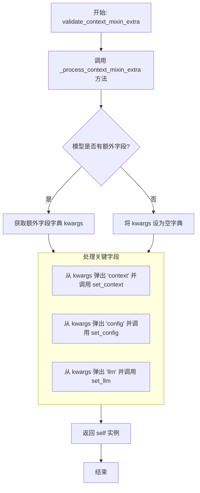
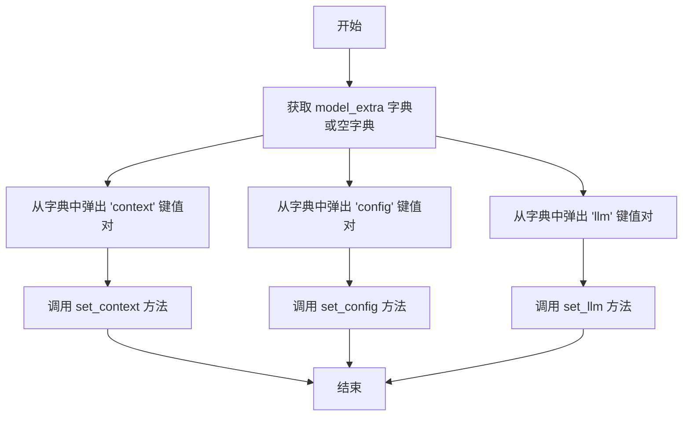
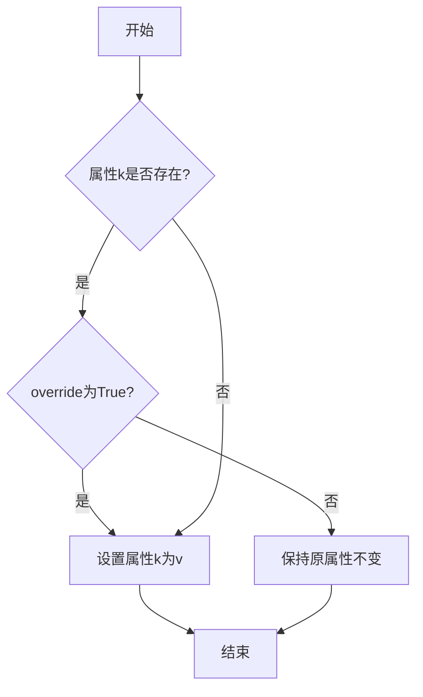
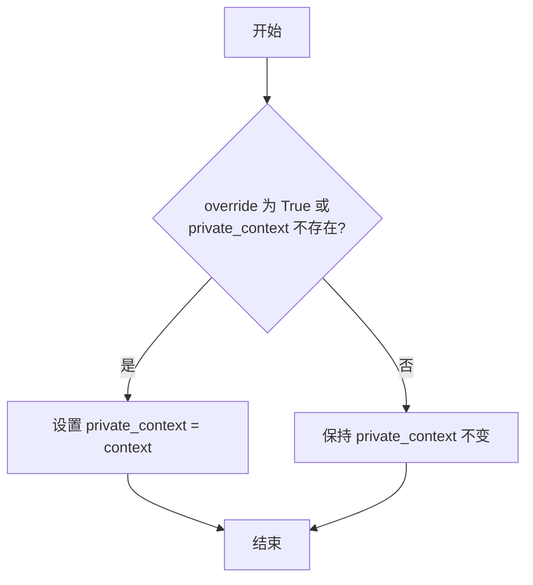
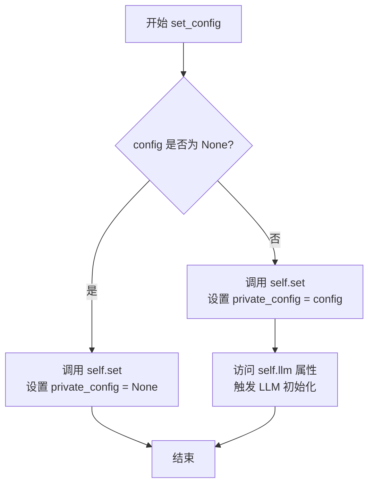
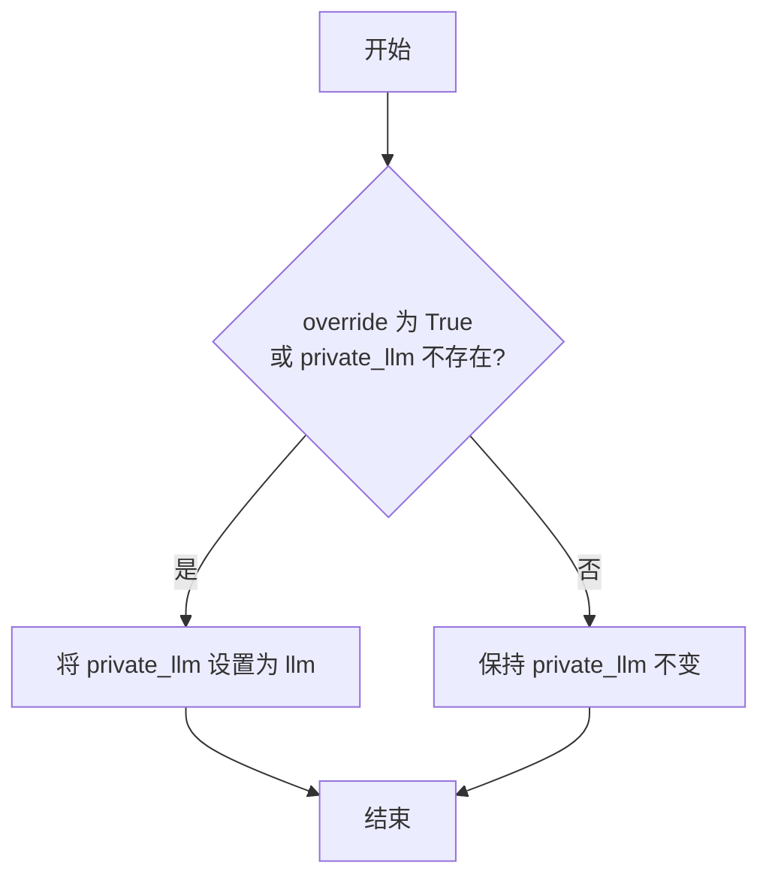
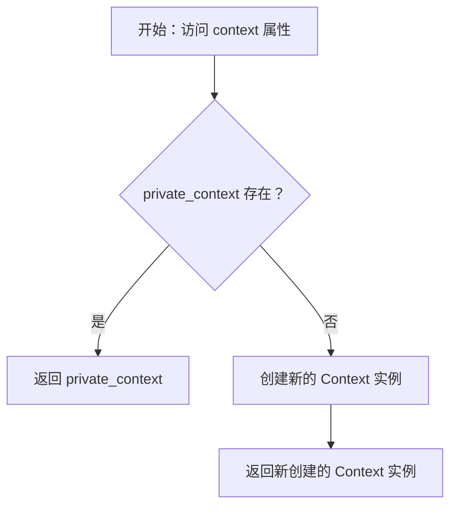
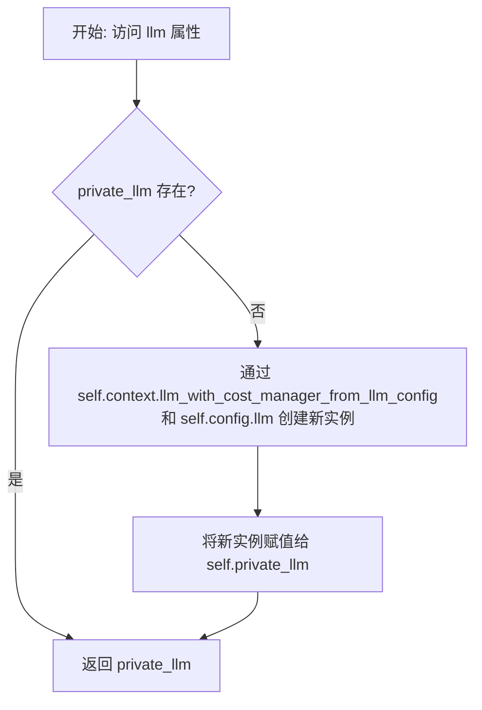

# `.\MetaGPT\metagpt\context_mixin.py` 详细设计文档

该代码定义了一个名为 `ContextMixin` 的 Pydantic 模型，作为其他类（如 Env/Role/Action）的混入类，用于统一管理上下文（Context）、配置（Config）和大型语言模型（BaseLLM）实例。它通过私有字段存储这些组件，并提供属性访问器和设置器，实现了从私有实例到公共上下文的优先级访问逻辑，以及 LLM 的懒加载初始化。

## 整体流程

```mermaid
graph TD
    A[ContextMixin 实例化] --> B[Pydantic 模型验证]
    B --> C{是否有额外字段？}
    C -- 是 --> D[调用 _process_context_mixin_extra]
    D --> E[从额外字段中提取并设置 context, config, llm]
    C -- 否 --> F[验证完成]
    F --> G[外部调用 set_context/set_config/set_llm]
    G --> H[通过 set 方法设置私有字段]
    H --> I[访问 context/config/llm 属性]
    I --> J{私有字段是否存在？}
    J -- context: 是 --> K[返回 private_context]
    J -- context: 否 --> L[返回新的 Context() 实例]
    J -- config: 是 --> M[返回 private_config]
    J -- config: 否 --> N[返回 self.context.config]
    J -- llm: 是 --> O[返回 private_llm]
    J -- llm: 否 --> P[通过 context.llm_with_cost_manager_from_llm_config 初始化]
    P --> Q[设置 private_llm 并返回]
```

## 类结构

```
BaseModel (Pydantic)
└── ContextMixin
    ├── 字段: private_context, private_config, private_llm
    ├── 方法: validate_context_mixin_extra, _process_context_mixin_extra, set, set_context, set_config, set_llm
    └── 属性: config (getter/setter), context (getter/setter), llm (getter/setter)
```

## 全局变量及字段


### `ContextMixin.private_context`
    
用于存储私有上下文对象，优先级高于公共上下文，通过exclude=True在序列化时排除

类型：`Optional[Context]`
    


### `ContextMixin.private_config`
    
用于存储私有配置对象，优先级高于公共配置，通过exclude=True在序列化时排除

类型：`Optional[Config]`
    


### `ContextMixin.private_llm`
    
用于存储私有大语言模型实例，优先级高于公共LLM，通过exclude=True在序列化时排除

类型：`Optional[BaseLLM]`
    


### `ContextMixin.model_config`
    
Pydantic模型配置，允许任意类型和额外字段，用于解决继承时的私有属性问题

类型：`ConfigDict`
    
    

## 全局函数及方法


### `ContextMixin.validate_context_mixin_extra`

这是一个 Pydantic 模型验证器方法，在模型实例化后自动调用。它的核心功能是处理模型初始化时传入的额外关键字参数（`extra` 字段），从中提取并设置 `context`、`config` 和 `llm` 这三个关键组件，从而确保 `ContextMixin` 及其子类能够正确初始化其上下文、配置和语言模型实例。

参数：

-  `self`：`ContextMixin`，`ContextMixin` 类的一个实例。

返回值：`ContextMixin`，返回处理完额外字段后的 `self` 实例本身。

#### 流程图



#### 带注释源码

```python
    @model_validator(mode="after")
    def validate_context_mixin_extra(self):
        # 这是一个 Pydantic 模型验证器，在模型的所有字段验证完成后执行（mode="after"）。
        # 它用于处理模型初始化时传入的、未被明确定义为字段的额外关键字参数。
        self._process_context_mixin_extra()
        # 调用内部方法处理额外字段。
        return self
        # 验证器必须返回模型实例（可以是修改后的实例）。
```


### `ContextMixin._process_context_mixin_extra`

该方法用于处理 `ContextMixin` 类实例化时通过 `model_extra` 传入的额外字段。它从这些额外字段中提取 `context`、`config` 和 `llm` 参数，并调用相应的 `set_context`、`set_config` 和 `set_llm` 方法将它们设置到实例的私有字段中。

参数：
-  `self`：`ContextMixin`，`ContextMixin` 类的实例

返回值：`None`，无返回值

#### 流程图



#### 带注释源码

```python
def _process_context_mixin_extra(self):
    """Process the extra field"""
    # 1. 获取模型初始化时传入的额外字段字典，如果没有则为空字典
    kwargs = self.model_extra or {}
    # 2. 从字典中弹出 'context' 键对应的值，并调用 set_context 方法进行设置
    self.set_context(kwargs.pop("context", None))
    # 3. 从字典中弹出 'config' 键对应的值，并调用 set_config 方法进行设置
    self.set_config(kwargs.pop("config", None))
    # 4. 从字典中弹出 'llm' 键对应的值，并调用 set_llm 方法进行设置
    self.set_llm(kwargs.pop("llm", None))
```


### `ContextMixin.set`

该方法用于设置对象的属性。它接受一个键和一个值，并根据`override`参数决定是否覆盖已存在的属性。如果`override`为`True`或属性不存在，则设置该属性；否则，保持原属性不变。

参数：

- `k`：`str`，要设置的属性名称
- `v`：`Any`，要设置的属性值
- `override`：`bool`，是否覆盖已存在的属性，默认为`False`

返回值：`None`，无返回值

#### 流程图



#### 带注释源码

```python
def set(self, k, v, override=False):
    """Set attribute"""
    # 如果override为True或属性k不存在，则设置属性k为v
    if override or not self.__dict__.get(k):
        self.__dict__[k] = v
```

### `ContextMixin.set_context`

该方法用于设置 `ContextMixin` 实例的私有上下文（`private_context`）。它通过调用内部的 `set` 方法，根据 `override` 参数决定是否覆盖已存在的 `private_context` 值。

参数：

- `context`：`Context`，要设置的上下文对象。
- `override`：`bool`，指示是否覆盖已存在的 `private_context` 值，默认为 `True`。

返回值：`None`，无返回值。

#### 流程图



#### 带注释源码

```python
def set_context(self, context: Context, override=True):
    """Set context"""
    # 调用内部的 set 方法，根据 override 参数决定是否设置 private_context 属性
    self.set("private_context", context, override)
```

### `ContextMixin.set_config`

该方法用于设置`ContextMixin`实例的私有配置（`private_config`）。它接受一个`Config`对象和一个`override`标志。如果`override`为`True`或当前`private_config`为`None`，则设置新的配置。设置配置后，如果配置不为`None`，会通过访问`llm`属性来触发LLM的初始化。

参数：

- `config`：`Config`，要设置的配置对象。
- `override`：`bool`，指示是否覆盖现有配置的标志。默认为`False`。

返回值：`None`，无返回值。

#### 流程图



#### 带注释源码

```python
def set_config(self, config: Config, override=False):
    """Set config"""
    # 调用内部的 set 方法，根据 override 标志和当前 private_config 的值来决定是否设置新的 config
    self.set("private_config", config, override)
    # 如果传入的 config 不为 None，则通过访问 self.llm 属性来触发 LLM 的初始化
    # 这利用了 llm 属性的 getter 方法，该方法会在 private_llm 不存在时根据 config.llm 创建新的 LLM 实例
    if config is not None:
        _ = self.llm  # init llm
```

### `ContextMixin.set_llm`

该方法用于为`ContextMixin`实例设置一个私有的`BaseLLM`对象。它通过调用内部的`set`方法，根据`override`参数决定是否覆盖已存在的`private_llm`字段。

参数：

- `llm`：`BaseLLM`，要设置的`BaseLLM`对象实例。
- `override`：`bool`，指示是否覆盖已存在的`private_llm`字段。默认为`False`，即如果`private_llm`已存在则不进行覆盖。

返回值：`None`，此方法不返回任何值。

#### 流程图



#### 带注释源码

```python
def set_llm(self, llm: BaseLLM, override=False):
    """Set llm"""
    # 调用内部的 set 方法，根据 override 参数决定是否设置 private_llm 字段
    self.set("private_llm", llm, override)
```

### `ContextMixin.config`

`ContextMixin.config` 是一个属性（property），用于获取或设置 `ContextMixin` 实例的配置对象。它实现了配置的优先级逻辑：优先返回实例的私有配置（`private_config`），如果私有配置不存在，则返回其上下文（`context`）中的配置。设置器（setter）则允许通过调用 `set_config` 方法来更新私有配置。

参数：
-  `self`：`ContextMixin`，`ContextMixin` 类的实例。

返回值：`Config`，返回当前实例生效的配置对象。

#### 流程图

```mermaid
flowchart TD
    A[调用 config getter] --> B{private_config 存在?};
    B -- 是 --> C[返回 private_config];
    B -- 否 --> D[返回 self.context.config];
    E[调用 config setter<br>传入 config 参数] --> F[调用 self.set_config(config)];
```

#### 带注释源码

```python
    @property
    def config(self) -> Config:
        """Role config: role config > context config"""
        # 优先检查并返回实例的私有配置
        if self.private_config:
            return self.private_config
        # 如果私有配置不存在，则返回上下文中的配置
        return self.context.config

    @config.setter
    def config(self, config: Config) -> None:
        """Set config"""
        # 设置器通过调用 set_config 方法来更新配置
        self.set_config(config)
```

### `ContextMixin.context`

这是一个属性访问器（getter），用于获取`ContextMixin`实例的上下文（`Context`）对象。它实现了优先级的逻辑：如果实例拥有私有的`private_context`，则返回它；否则，返回一个默认的、新创建的`Context`实例。

参数：
- 无

返回值：`Context`，返回当前实例的上下文对象。优先返回私有上下文`private_context`，若不存在则返回一个新的`Context`实例。

#### 流程图



#### 带注释源码

```python
@property
def context(self) -> Context:
    """Role context: role context > context"""
    # 检查是否存在私有上下文 private_context
    if self.private_context:
        # 如果存在，则直接返回私有上下文
        return self.private_context
    # 如果私有上下文不存在，则创建一个新的 Context 实例并返回
    return Context()
```

### `ContextMixin.llm`

这是一个属性访问器（getter），用于获取或惰性初始化与当前上下文关联的 `BaseLLM` 实例。它遵循一个优先级逻辑：首先检查是否存在私有的 `private_llm` 实例；如果不存在，则通过当前配置（`self.config.llm`）和上下文（`self.context`）来创建一个新的 LLM 实例（附带成本管理器），并将其赋值给 `private_llm` 以供后续使用。

参数：
-  `self`：`ContextMixin`，`ContextMixin` 类的实例。

返回值：`BaseLLM`，返回一个已配置好的大语言模型实例。

#### 流程图



#### 带注释源码

```python
@property
def llm(self) -> BaseLLM:
    """Role llm: if not existed, init from role.config"""
    # 检查私有 llm 实例是否存在
    if not self.private_llm:
        # 如果不存在，则通过上下文方法，使用当前配置中的 llm 配置来创建新的 LLM 实例
        # 该方法还会附加一个成本管理器
        self.private_llm = self.context.llm_with_cost_manager_from_llm_config(self.config.llm)
    # 返回私有 llm 实例（可能是刚创建的）
    return self.private_llm
```

## 关键组件

### ContextMixin类

一个Pydantic数据模型，作为混入类（Mixin），为其他类（如Env、Role、Action）提供统一的上下文（Context）、配置（Config）和大语言模型（BaseLLM）实例的获取、设置与管理能力。它通过属性（property）实现了优先级的访问逻辑（私有实例属性 > 上下文属性），并支持通过构造函数参数或`set_*`方法进行注入。

### 上下文（Context）管理

提供对`Context`对象的封装管理。通过`private_context`字段存储私有上下文，并通过`context`属性提供访问器。该属性实现了访问逻辑：优先返回实例的`private_context`，若不存在则返回一个默认的`Context()`实例。同时提供了`set_context`方法用于设置上下文。

### 配置（Config）管理

提供对`Config`对象的封装管理。通过`private_config`字段存储私有配置，并通过`config`属性提供访问器。该属性实现了访问逻辑：优先返回实例的`private_config`，若不存在则返回其`context`中的`config`。设置配置（`set_config`）时会自动触发大语言模型（LLM）的初始化。

### 大语言模型（BaseLLM）管理

提供对`BaseLLM`实例的封装与惰性初始化。通过`private_llm`字段存储私有LLM实例，并通过`llm`属性提供访问器。该属性实现了惰性加载逻辑：如果`private_llm`不存在，则通过当前配置（`self.config.llm`）和上下文（`self.context`）来创建并初始化一个LLM实例（附带成本管理器）。

### 模型验证与额外字段处理

利用Pydantic的`@model_validator(mode="after")`装饰器，在模型实例化后自动调用`_process_context_mixin_extra`方法。该方法负责从Pydantic模型允许的额外字段（`model_extra`）中提取`context`、`config`、`llm`参数，并调用相应的`set_*`方法进行设置，从而支持通过构造函数关键字参数进行依赖注入。

## 问题及建议


### 已知问题

-   **潜在的无限递归风险**：`_process_context_mixin_extra` 方法在 `model_validator` 中被调用，而 `model_validator` 本身是模型验证的一部分。如果 `set_context`、`set_config` 或 `set_llm` 方法内部触发了额外的模型验证或数据变更，可能会导致无限递归或意外的验证循环。
-   **属性设置逻辑不一致**：`set_context` 方法的 `override` 参数默认值为 `True`，而 `set_config` 和 `set_llm` 的默认值为 `False`。这种不一致性可能导致使用者在设置属性时产生困惑，不清楚默认行为是什么，容易引入错误。
-   **`set` 方法过于通用且脆弱**：`set` 方法直接操作 `self.__dict__`，绕过了 Pydantic 的模型验证和类型检查。这可能导致设置无效或类型错误的属性值，破坏了模型的类型安全性和数据完整性。
-   **`llm` 属性 getter 的副作用**：`llm` 属性的 getter 方法 (`@property def llm`) 在 `private_llm` 为 `None` 时会自动初始化一个 LLM 实例。这种“懒加载”虽然方便，但将初始化逻辑隐藏在属性访问中，可能使调用者难以察觉资源创建的成本和时机，不利于调试和性能分析。
-   **`model_extra` 处理可能不完整**：`_process_context_mixin_extra` 方法只处理了 `context`、`config`、`llm` 这三个特定的 `model_extra` 字段。如果传入其他未声明的字段，它们会被 `extra="allow"` 配置保留在 `model_extra` 中，但此方法不会处理它们，可能导致数据残留或未被正确利用。

### 优化建议

-   **分离验证与初始化逻辑**：考虑将 `_process_context_mixin_extra` 中的初始化逻辑移出 `model_validator`，例如放入一个独立的 `__init__` 后处理钩子或一个显式的 `initialize` 方法中。这样可以避免验证阶段的副作用，使生命周期更清晰。
-   **统一属性设置器的默认行为**：审查并统一 `set_context`、`set_config`、`set_llm` 方法中 `override` 参数的默认值。根据业务逻辑决定是默认覆盖还是默认不覆盖，并在文档中明确说明，保持接口一致性。
-   **强化 `set` 方法或移除它**：如果 `set` 方法仅用于内部这几个属性，建议将其改为私有方法 `_set`，并明确其适用范围。更好的做法是直接在各 `set_xxx` 方法中赋值，避免使用通用的、绕过验证的字典操作，以维护模型的安全性。
-   **显式化 LLM 初始化**：将 `llm` 属性 getter 中的懒加载逻辑提取到一个独立的方法中，例如 `get_or_init_llm()`。或者，在 `set_config` 时（当 config 非 None）就立即初始化 `private_llm`，使初始化时机更明确，避免属性访问时的隐性开销。
-   **完善 `model_extra` 处理策略**：明确设计目标。如果决定只处理特定字段，可以在方法结束时清空或忽略剩余的 `model_extra`。如果需要支持动态字段，应设计更通用的机制来将这些字段安全地设置到实例上（可能仍需使用经过审查的 `set` 方法），并考虑其生命周期和类型安全。
-   **增加类型提示和文档**：为 `set` 方法增加详细的类型提示和文档字符串，说明其设计目的、潜在风险和使用限制。为整个 `ContextMixin` 类添加更全面的文档，解释其作为 Mixin 的用途、`private_*` 字段与公共 `context`/`config`/`llm` 属性之间的关系，以及预期的使用模式。


## 其它


### 设计目标与约束

1.  **设计目标**:
    *   **提供上下文管理能力**: 为 `Env`、`Role`、`Action` 等核心组件提供统一、灵活的方式来访问和管理其运行上下文 (`Context`)、配置 (`Config`) 以及大语言模型 (`BaseLLM`) 实例。
    *   **支持优先级覆盖**: 允许组件拥有私有的上下文、配置和LLM实例，并确保私有实例的优先级高于从公共上下文继承的实例，实现细粒度的配置控制。
    *   **简化初始化**: 通过 `model_validator` 和 `_process_context_mixin_extra` 方法，支持在 Pydantic 模型初始化时通过关键字参数 (`context`, `config`, `llm`) 便捷地设置相关属性。
    *   **保持向后兼容性**: 通过 `extra="allow"` 配置，允许模型接受额外的字段，避免因未知字段导致初始化失败，提高代码的健壮性。
    *   **解决 Pydantic 继承问题**: 通过使用 `private_*` 前缀而非 `_private_*` 来规避 Pydantic 在处理私有属性和继承时的已知缺陷。

2.  **设计约束**:
    *   **依赖 Pydantic**: 该类继承自 `pydantic.BaseModel`，其数据验证、序列化/反序列化行为受 Pydantic 框架约束。
    *   **依赖特定类型**: 强依赖于项目定义的 `Context`、`Config` 和 `BaseLLM` 类型，与项目核心模块紧密耦合。
    *   **惰性初始化 LLM**: `llm` 属性采用惰性初始化策略，仅在首次访问时通过 `context.llm_with_cost_manager_from_llm_config` 方法创建，这要求 `config.llm` 必须包含有效的 LLM 配置。
    *   **属性访问顺序**: `config` 和 `llm` 属性的 getter 逻辑依赖于 `context` 属性。如果 `private_context` 和 `private_config` 均为 `None`，`context` 属性将返回一个新的空 `Context` 实例，这可能导致 `config` 和 `llm` 属性访问时出现意外行为（如配置缺失）。

### 错误处理与异常设计

1.  **显式错误处理**:
    *   该类本身不包含显式的 `try...except` 块。错误主要依赖 Pydantic 的数据验证和底层依赖（如 `Context`、`Config`、`BaseLLM`）的初始化逻辑来抛出。
    *   `set` 方法通过 `override` 参数提供了静默覆盖或保留现有值的策略，这是一种防御性编程，避免意外覆盖。

2.  **潜在异常点**:
    *   **`llm` 属性访问**: 当 `private_llm` 为 `None`，且 `self.context.llm_with_cost_manager_from_llm_config(self.config.llm)` 被调用时，可能抛出多种异常：
        *   `AttributeError`: 如果 `self.context` 返回的 `Context` 实例没有 `llm_with_cost_manager_from_llm_config` 方法。
        *   `KeyError` 或配置相关异常: 如果 `self.config.llm` 为 `None` 或包含无效配置。
        *   网络或供应商特定异常: 在创建 `BaseLLM` 实例过程中。
    *   **`model_validator`**: 在 `validate_context_mixin_extra` 方法中，如果 `_process_context_mixin_extra` 内部逻辑出错，会中断模型的初始化过程。
    *   **类型不匹配**: 虽然 Pydantic 会进行基础类型检查，但如果传入的 `context`、`config`、`llm` 对象类型不符合预期，可能在后续使用中导致 `AttributeError` 或行为异常。

3.  **异常处理建议**:
    *   调用方在使用 `llm` 属性前，应确保相关配置 (`config.llm`) 已正确设置。
    *   考虑在 `llm` 属性的 getter 中添加更明确的错误处理或日志记录，以便在初始化失败时提供更清晰的错误信息。

### 数据流与状态机

1.  **核心数据流**:
    *   **初始化阶段**: 通过构造函数或 `model_validator`，外部传入的 `context`、`config`、`llm` 参数被捕获并存储到 `model_extra` 中，随后由 `_process_context_mixin_extra` 方法提取并调用 `set_context`、`set_config`、`set_llm` 方法，最终设置到 `private_context`、`private_config`、`private_llm` 字段。
    *   **运行时访问**:
        *   `context` 属性: 返回 `private_context` 或一个新的空 `Context` 实例。
        *   `config` 属性: 返回 `private_config` 或 `self.context.config`。
        *   `llm` 属性: 返回 `private_llm`。如果为 `None`，则触发惰性初始化：使用 `self.config.llm` 的配置，通过 `self.context.llm_with_cost_manager_from_llm_config` 方法创建新的 `BaseLLM` 实例并赋值给 `private_llm`。
    *   **状态变更**: 通过 setter 方法 (`context.setter`, `config.setter`, `llm.setter`) 或直接的 `set_*` 方法，可以动态更新 `private_*` 字段，从而改变属性的行为。

2.  **状态机 (简化)**:
    *   **`private_llm` 状态**:
        *   **`None`**: 初始状态或显式清除后。访问 `llm` 属性将触发初始化。
        *   **`BaseLLM Instance`**: 已初始化状态。访问 `llm` 属性直接返回该实例。
    *   **属性解析优先级**:
        *   `context`: `private_context` > 新 `Context()`。
        *   `config`: `private_config` > `self.context.config`。
        *   `llm`: `private_llm` > (惰性创建: `self.context.llm_with_cost_manager_from_llm_config(self.config.llm)`)。

### 外部依赖与接口契约

1.  **外部依赖**:
    *   **`pydantic.BaseModel`**: 提供数据模型基类、字段验证、序列化等功能。
    *   **`metagpt.context.Context`**: 提供运行时上下文，包含公共配置和 LLM 实例工厂方法 (`llm_with_cost_manager_from_llm_config`)。
    *   **`metagpt.config2.Config`**: 提供配置信息，特别是 `llm` 字段用于 LLM 初始化。
    *   **`metagpt.provider.base_llm.BaseLLM`**: 大语言模型抽象接口，`llm` 属性返回和设置的对象类型。

2.  **接口契约 (对使用者)**:
    *   **初始化**: 支持通过关键字参数 `context`, `config`, `llm` 进行初始化。
    *   **属性访问**: 提供 `context`, `config`, `llm` 三个主要属性供读取。`config` 和 `llm` 属性具有 setter。
    *   **方法调用**: 提供 `set_context`, `set_config`, `set_llm` 方法用于显式设置，支持 `override` 参数控制覆盖行为。
    *   **继承要求**: 任何希望获得上下文管理能力的类应继承 `ContextMixin`。继承者需注意 Pydantic 的继承机制以及 `private_*` 字段的命名约定。

3.  **接口契约 (对提供者)**:
    *   `Context` 类需要提供 `config` 属性和 `llm_with_cost_manager_from_llm_config` 方法。
    *   `Config` 类需要提供 `llm` 属性（应为有效的 LLM 配置字典或对象）。
    *   传递给 `set_llm` 或 `llm.setter` 的对象必须是 `BaseLLM` 的实例。

    