# `.\MetaGPT\metagpt\document.py` 详细设计文档

该代码文件定义了一个文档管理系统，核心功能是提供对多种格式文件（如Excel、CSV、JSON、TXT、PDF、DOCX等）的统一读取、解析和结构化处理能力，并构建了文档（Document）、可索引文档（IndexableDocument）和代码仓库（Repo）等数据模型，以支持文档的存储、检索、元数据提取和代码仓库级别的分析与管理。

## 整体流程

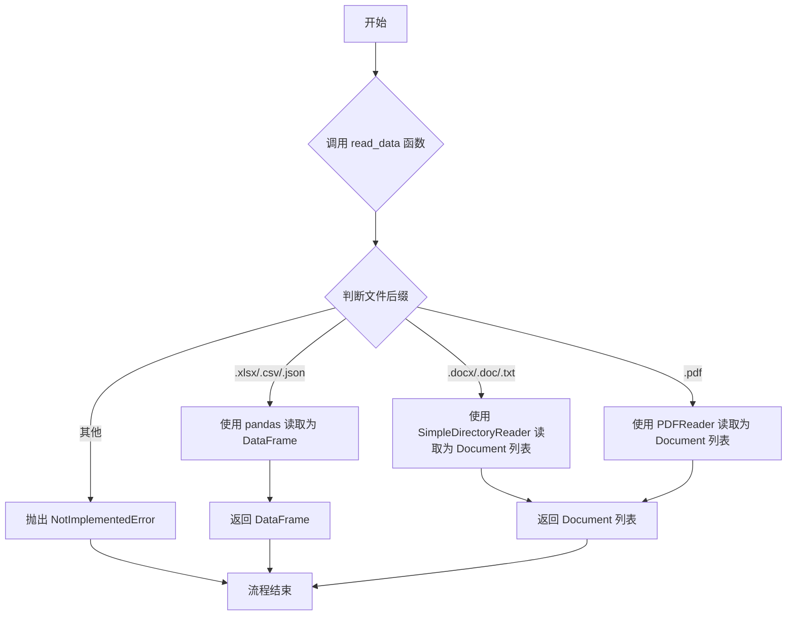

## 类结构

```
BaseModel (Pydantic基类)
├── Document
│   └── IndexableDocument
├── RepoMetadata
└── Repo
```

## 全局变量及字段


### `Document.path`
    
文档在文件系统中的路径。

类型：`Path`
    


### `Document.name`
    
文档的名称。

类型：`str`
    


### `Document.content`
    
文档的文本内容。

类型：`str`
    


### `Document.author`
    
文档的作者。

类型：`str`
    


### `Document.status`
    
文档的当前状态（草稿、审核中、已批准、已完成）。

类型：`DocumentStatus`
    


### `Document.reviews`
    
文档的审阅记录列表。

类型：`list`
    


### `IndexableDocument.data`
    
可索引文档的原始数据，可以是DataFrame或Document列表。

类型：`Union[pd.DataFrame, list]`
    


### `IndexableDocument.content_col`
    
当数据为DataFrame时，指定内容列的列名。

类型：`Optional[str]`
    


### `IndexableDocument.meta_col`
    
当数据为DataFrame时，指定元数据列的列名。

类型：`Optional[str]`
    


### `RepoMetadata.name`
    
代码仓库的名称。

类型：`str`
    


### `RepoMetadata.n_docs`
    
代码仓库中文档的总数量。

类型：`int`
    


### `RepoMetadata.n_chars`
    
代码仓库中所有文档的总字符数。

类型：`int`
    


### `RepoMetadata.symbols`
    
代码仓库中解析出的符号（如类、函数）列表。

类型：`list`
    


### `Repo.name`
    
代码仓库的名称。

类型：`str`
    


### `Repo.docs`
    
存储文档文件的映射，键为路径，值为Document对象。

类型：`dict[Path, Document]`
    


### `Repo.codes`
    
存储代码文件的映射，键为路径，值为Document对象。

类型：`dict[Path, Document]`
    


### `Repo.assets`
    
存储其他资源文件的映射，键为路径，值为Document对象。

类型：`dict[Path, Document]`
    


### `Repo.path`
    
代码仓库在文件系统中的根目录路径。

类型：`Path`
    
    

## 全局函数及方法

### `validate_cols`

验证指定的列名是否存在于给定的Pandas DataFrame中。如果列名不存在，则抛出`ValueError`异常。

参数：
-  `content_col`：`str`，需要验证的列名。
-  `df`：`pandas.DataFrame`，需要被检查的DataFrame。

返回值：`None`，该函数不返回任何值，仅用于验证。

#### 流程图

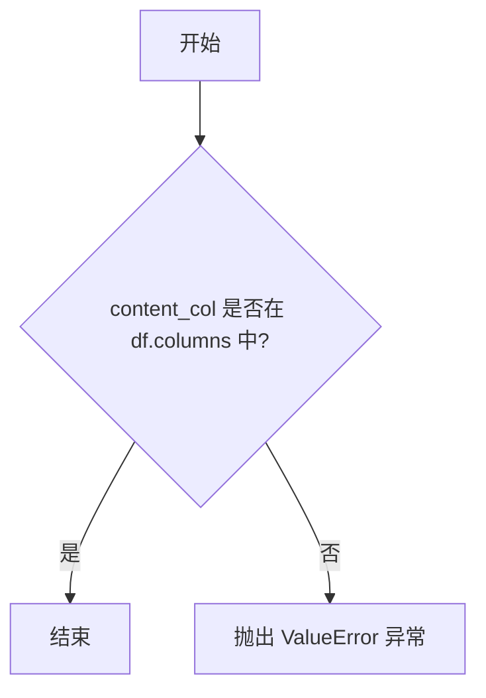

#### 带注释源码

```python
def validate_cols(content_col: str, df: pd.DataFrame):
    # 检查 content_col 是否存在于 DataFrame 的列中
    if content_col not in df.columns:
        # 如果列不存在，抛出 ValueError 异常
        raise ValueError("Content column not found in DataFrame.")
```

### `read_data`

该函数是一个全局函数，用于根据文件路径的后缀名，读取并解析不同类型的文件，返回统一的数据结构。它支持多种常见文件格式，包括Excel、CSV、JSON、Word文档、纯文本和PDF文件，并针对不同格式使用相应的解析库进行处理。

参数：

-  `data_path`：`Path`，输入文件的路径对象，用于指定要读取的文件位置。

返回值：`Union[pd.DataFrame, list[Document]]`，返回解析后的数据。对于表格类文件（如.xlsx, .csv, .json），返回一个`pandas.DataFrame`对象；对于文档类文件（如.docx, .txt, .pdf），返回一个由`llama_index`库定义的`Document`对象组成的列表。

#### 流程图

```mermaid
flowchart TD
    A[开始: read_data(data_path)] --> B{获取文件后缀 suffix}
    B --> C{suffix 判断}
    C -->|.xlsx| D[使用 pd.read_excel 读取]
    C -->|.csv| E[使用 pd.read_csv 读取]
    C -->|.json| F[使用 pd.read_json 读取]
    C -->|.docx 或 .doc| G[使用 SimpleDirectoryReader 加载]
    C -->|.txt| H[使用 SimpleDirectoryReader 加载]
    H --> I[使用 SimpleNodeParser 解析为节点]
    C -->|.pdf| J[使用 PDFReader 加载]
    C -->|其他| K[抛出 NotImplementedError]
    D --> L[返回 DataFrame]
    E --> L
    F --> L
    G --> M[返回 Document 列表]
    I --> M
    J --> M
    K --> N[结束: 异常]
    L --> O[结束: 返回数据]
    M --> O
```

#### 带注释源码

```python
def read_data(data_path: Path) -> Union[pd.DataFrame, list[Document]]:
    # 获取文件路径的后缀名，用于判断文件类型
    suffix = data_path.suffix
    # 根据后缀名选择对应的文件读取和解析方法
    if ".xlsx" == suffix:
        # 读取Excel文件，返回pandas DataFrame
        data = pd.read_excel(data_path)
    elif ".csv" == suffix:
        # 读取CSV文件，返回pandas DataFrame
        data = pd.read_csv(data_path)
    elif ".json" == suffix:
        # 读取JSON文件，返回pandas DataFrame
        data = pd.read_json(data_path)
    elif suffix in (".docx", ".doc"):
        # 读取Word文档，使用llama_index的SimpleDirectoryReader加载为Document列表
        data = SimpleDirectoryReader(input_files=[str(data_path)]).load_data()
    elif ".txt" == suffix:
        # 读取纯文本文件，先加载为Document，再使用节点解析器进行分块处理
        data = SimpleDirectoryReader(input_files=[str(data_path)]).load_data()
        node_parser = SimpleNodeParser.from_defaults(separator="\n", chunk_size=256, chunk_overlap=0)
        data = node_parser.get_nodes_from_documents(data)
    elif ".pdf" == suffix:
        # 读取PDF文件，使用llama_index的PDFReader加载为Document列表
        data = PDFReader.load_data(str(data_path))
    else:
        # 对于不支持的文件格式，抛出未实现错误
        raise NotImplementedError("File format not supported.")
    # 返回解析后的数据（DataFrame 或 Document 列表）
    return data
```

### `Document.from_path`

`Document.from_path` 是一个类方法，用于根据给定的文件路径创建一个 `Document` 实例。它首先检查文件是否存在，然后读取文件内容，最后使用读取到的内容和文件路径初始化并返回一个 `Document` 对象。

参数：

- `path`：`Path`，表示要读取的文件的路径。

返回值：`Document`，返回一个包含文件内容和路径的 `Document` 实例。

#### 流程图

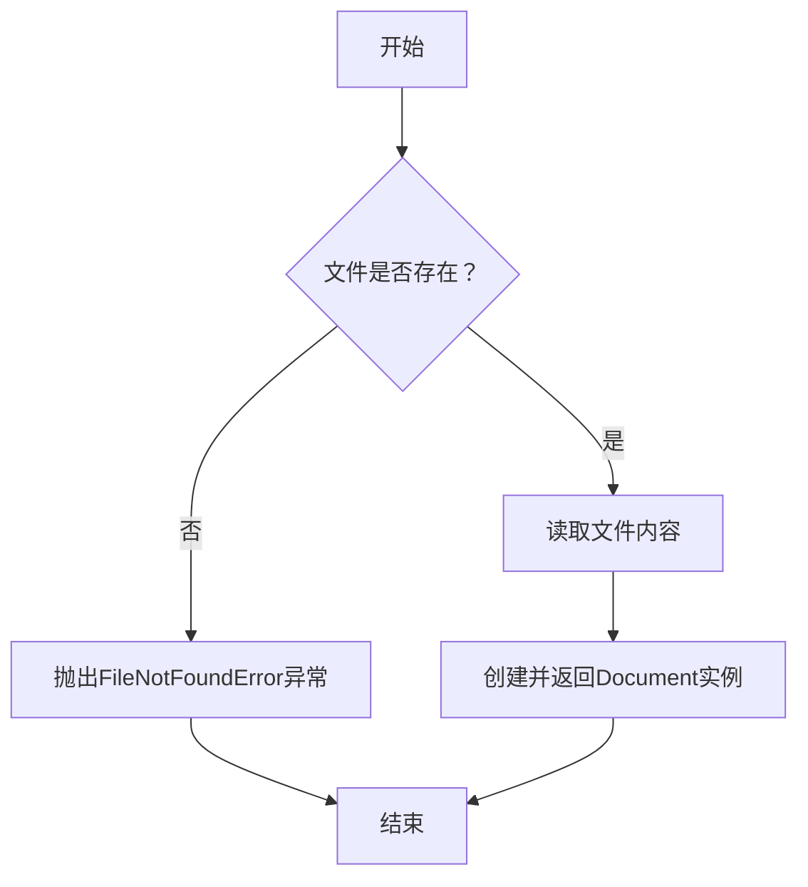

#### 带注释源码

```python
@classmethod
def from_path(cls, path: Path):
    """
    根据文件路径创建Document实例。
    """
    # 检查文件是否存在，如果不存在则抛出FileNotFoundError异常
    if not path.exists():
        raise FileNotFoundError(f"File {path} not found.")
    # 读取文件内容
    content = path.read_text()
    # 使用读取到的内容和文件路径创建并返回Document实例
    return cls(content=content, path=path)
```

### `Document.from_text`

`Document.from_text` 是一个类方法，用于根据提供的文本字符串创建一个 `Document` 类的实例。它允许可选地指定一个文件路径，该路径将作为文档的存储位置。

参数：

- `text`：`str`，用于创建文档的文本内容。
- `path`：`Optional[Path]`，可选参数，指定文档的文件路径。

返回值：`Document`，返回一个初始化了 `content` 和 `path` 字段的 `Document` 实例。

#### 流程图

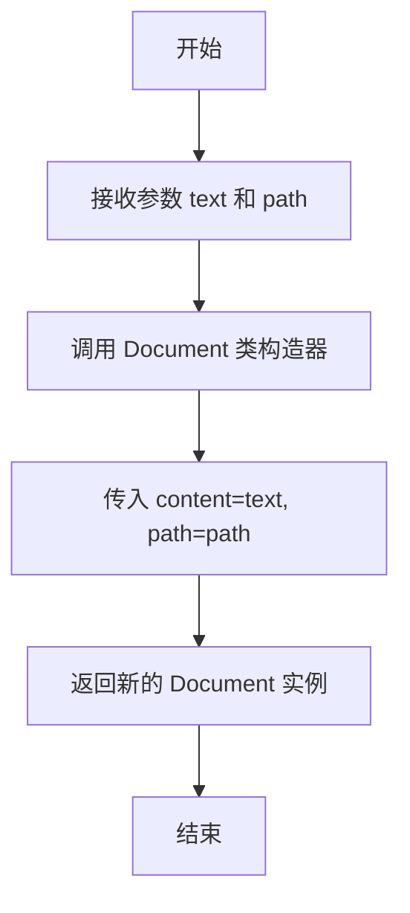

#### 带注释源码

```python
@classmethod
def from_text(cls, text: str, path: Optional[Path] = None):
    """
    Create a Document from a text string.
    """
    # 调用 Document 类的构造器，传入文本内容和可选路径
    return cls(content=text, path=path)
```

### `Document.to_path`

将文档内容保存到指定的文件路径。如果提供了新的路径参数，则更新文档的路径属性，然后将内容以UTF-8编码写入该路径对应的文件。如果路径不存在，会创建必要的父目录。

参数：

-  `self`：`Document`，`Document`类的实例，代表要保存的文档对象。
-  `path`：`Optional[Path]`，可选参数，指定要保存内容的目标文件路径。如果提供，将更新文档的`self.path`属性。

返回值：`None`，此方法不返回任何值，其主要作用是执行文件写入操作。

#### 流程图

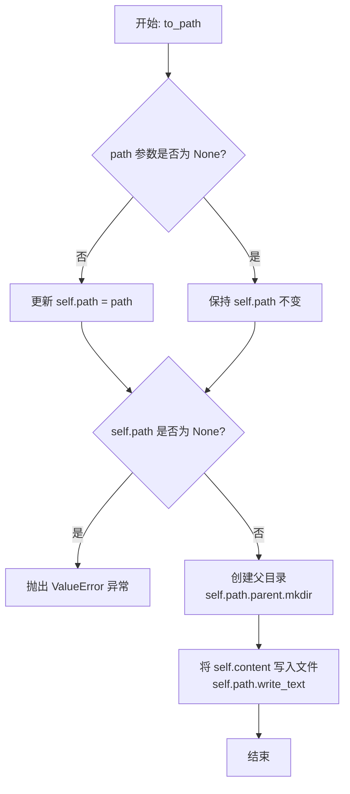

#### 带注释源码

```python
def to_path(self, path: Optional[Path] = None):
    """
    将文档内容保存到指定的文件路径。
    """
    # 如果提供了新的路径参数，则更新文档的路径属性
    if path is not None:
        self.path = path

    # 检查文档的路径属性是否已设置，如果未设置则无法保存
    if self.path is None:
        raise ValueError("File path is not set.")

    # 确保目标文件的父目录存在，如果不存在则创建
    self.path.parent.mkdir(parents=True, exist_ok=True)
    # TODO: 未来扩展功能，支持保存为excel, csv, json等格式
    # 将文档内容以UTF-8编码写入到指定路径的文件中
    self.path.write_text(self.content, encoding="utf-8")
```

### `Document.persist`

该方法用于将文档对象的内容持久化保存到磁盘文件中。它本质上是对 `to_path` 方法的封装，提供了一种更直观的保存操作。

参数：
-  `self`：`Document`，当前 `Document` 类的实例对象。

返回值：`None`，该方法不返回任何值。

#### 流程图

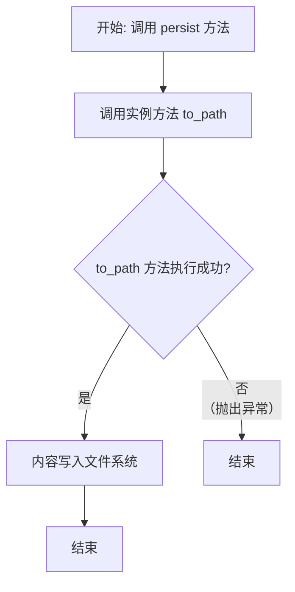

#### 带注释源码

```python
def persist(self):
    """
    将文档持久化到磁盘。
    此方法是对 `to_path` 方法的简单封装，提供更直接的保存语义。
    """
    return self.to_path()  # 调用 to_path 方法执行实际的保存操作
```

### `IndexableDocument.from_path`

`IndexableDocument.from_path` 是一个类方法，用于根据给定的文件路径创建一个 `IndexableDocument` 实例。它首先检查文件是否存在，然后根据文件后缀名调用相应的读取函数加载数据。如果数据是 `pandas.DataFrame` 类型，它会验证指定的内容列是否存在；否则，它会尝试读取文件的文本内容。最后，它返回一个包含加载的数据、内容字符串以及列名配置的 `IndexableDocument` 实例。

参数：

- `data_path`：`Path`，要读取的文件的路径。
- `content_col`：`str`，当文件为表格数据（如 CSV、Excel）时，指定内容列的列名，默认为 "content"。
- `meta_col`：`str`，当文件为表格数据时，指定元数据列的列名，默认为 "metadata"。

返回值：`IndexableDocument`，一个包含从文件加载的数据和元数据的 `IndexableDocument` 实例。

#### 流程图

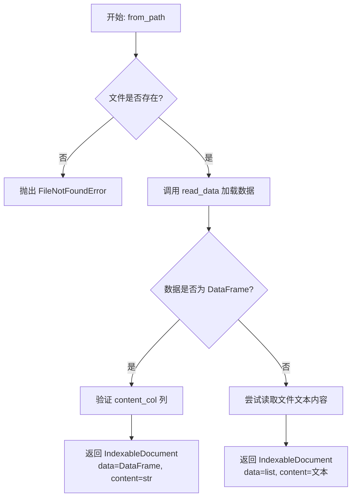

#### 带注释源码

```python
@classmethod
def from_path(cls, data_path: Path, content_col="content", meta_col="metadata"):
    # 检查文件是否存在，不存在则抛出异常
    if not data_path.exists():
        raise FileNotFoundError(f"File {data_path} not found.")
    # 根据文件后缀调用 read_data 函数加载数据
    data = read_data(data_path)
    # 如果数据是 pandas DataFrame 类型
    if isinstance(data, pd.DataFrame):
        # 验证指定的内容列是否存在于 DataFrame 中
        validate_cols(content_col, data)
        # 创建并返回 IndexableDocument 实例，将整个 DataFrame 转换为字符串作为 content
        return cls(data=data, content=str(data), content_col=content_col, meta_col=meta_col)
    # 如果数据是其他类型（如 llama_index Document 列表）
    try:
        # 尝试读取文件的原始文本内容
        content = data_path.read_text()
    except Exception as e:
        # 如果读取失败（如二进制文件），记录调试日志并将内容设为空字符串
        logger.debug(f"Load {str(data_path)} error: {e}")
        content = ""
    # 创建并返回 IndexableDocument 实例，使用读取的文本内容
    return cls(data=data, content=content, content_col=content_col, meta_col=meta_col)
```

### `IndexableDocument._get_docs_and_metadatas_by_df`

该方法用于从`IndexableDocument`实例的`data`字段（一个`pandas.DataFrame`对象）中提取文档内容和元数据。它遍历DataFrame的每一行，将指定内容列（`content_col`）的值作为文档内容，并根据元数据列（`meta_col`）的存在与否构建元数据字典。该方法主要用于为后续的向量化或索引操作准备数据。

参数：

-  `self`：`IndexableDocument`，当前`IndexableDocument`类的实例。

返回值：`(list, list)`，返回一个包含两个列表的元组。第一个列表包含从DataFrame的`content_col`列提取的所有文档内容（字符串）。第二个列表包含对应的元数据字典列表；如果指定了`meta_col`，则每个字典包含该列的值，否则为空字典。

#### 流程图

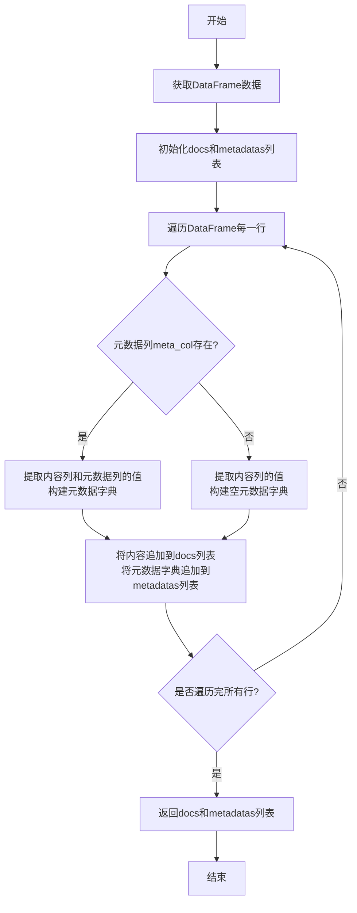

#### 带注释源码

```python
def _get_docs_and_metadatas_by_df(self) -> (list, list):
    # 获取存储在实例中的DataFrame数据
    df = self.data
    # 初始化两个空列表，分别用于存储文档内容和元数据
    docs = []
    metadatas = []
    # 使用tqdm包装迭代过程，提供进度条显示
    for i in tqdm(range(len(df))):
        # 从DataFrame的指定内容列（self.content_col）中获取第i行的值，作为文档内容
        docs.append(df[self.content_col].iloc[i])
        # 检查是否指定了元数据列（self.meta_col）
        if self.meta_col:
            # 如果指定了元数据列，则从该列获取第i行的值，并构建一个字典作为元数据
            metadatas.append({self.meta_col: df[self.meta_col].iloc[i]})
        else:
            # 如果未指定元数据列，则添加一个空字典作为占位符
            metadatas.append({})
    # 返回包含文档内容列表和元数据字典列表的元组
    return docs, metadatas
```

### `IndexableDocument._get_docs_and_metadatas_by_llamaindex`

该方法用于处理当`IndexableDocument`实例的`data`字段为`list`类型（即通过LlamaIndex库加载的文档列表）时，提取文档文本内容和元数据。它遍历列表中的每个元素（假设为LlamaIndex的`Document`对象），提取其`text`属性和`metadata`属性，分别构建文档列表和元数据列表并返回。

参数：
-  `self`：`IndexableDocument`，当前`IndexableDocument`类的实例

返回值：`tuple[list, list]`，返回一个包含两个列表的元组。第一个列表包含所有文档的文本内容（`str`），第二个列表包含每个文档对应的元数据字典（`dict`）。

#### 流程图

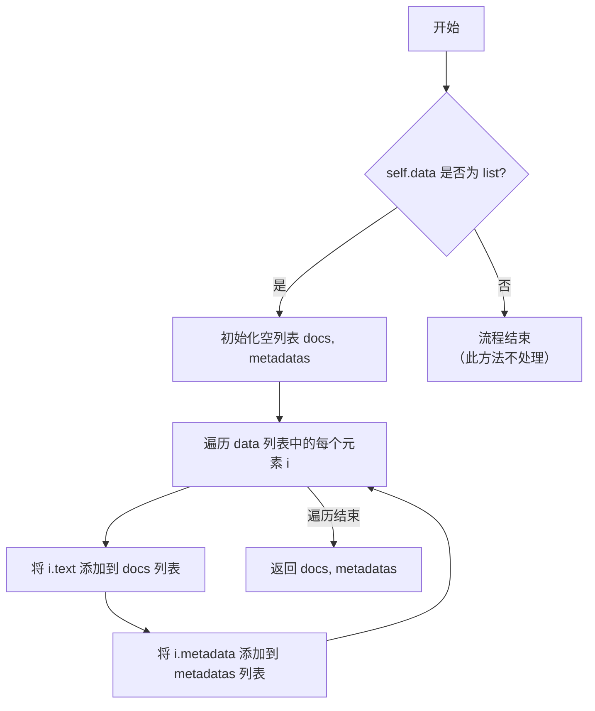

#### 带注释源码

```python
def _get_docs_and_metadatas_by_llamaindex(self) -> (list, list):
    # 获取通过LlamaIndex加载的文档数据列表
    data = self.data
    # 使用列表推导式，遍历data列表中的每个元素i，提取其text属性，构建文档内容列表
    docs = [i.text for i in data]
    # 使用列表推导式，遍历data列表中的每个元素i，提取其metadata属性，构建元数据列表
    metadatas = [i.metadata for i in data]
    # 返回包含文档内容列表和元数据列表的元组
    return docs, metadatas
```

### `IndexableDocument.get_docs_and_metadatas`

该方法用于从`IndexableDocument`实例的`data`字段中提取文档内容和元数据。它会根据`data`的数据类型（`pandas.DataFrame` 或 `list`）调用不同的内部方法进行处理，最终返回一个包含文档列表和元数据列表的元组。

参数：
-  `self`：`IndexableDocument`，当前`IndexableDocument`类的实例。

返回值：`tuple[list, list]`，返回一个包含两个列表的元组。第一个列表是文档内容（字符串列表），第二个列表是对应的元数据（字典列表）。

#### 流程图

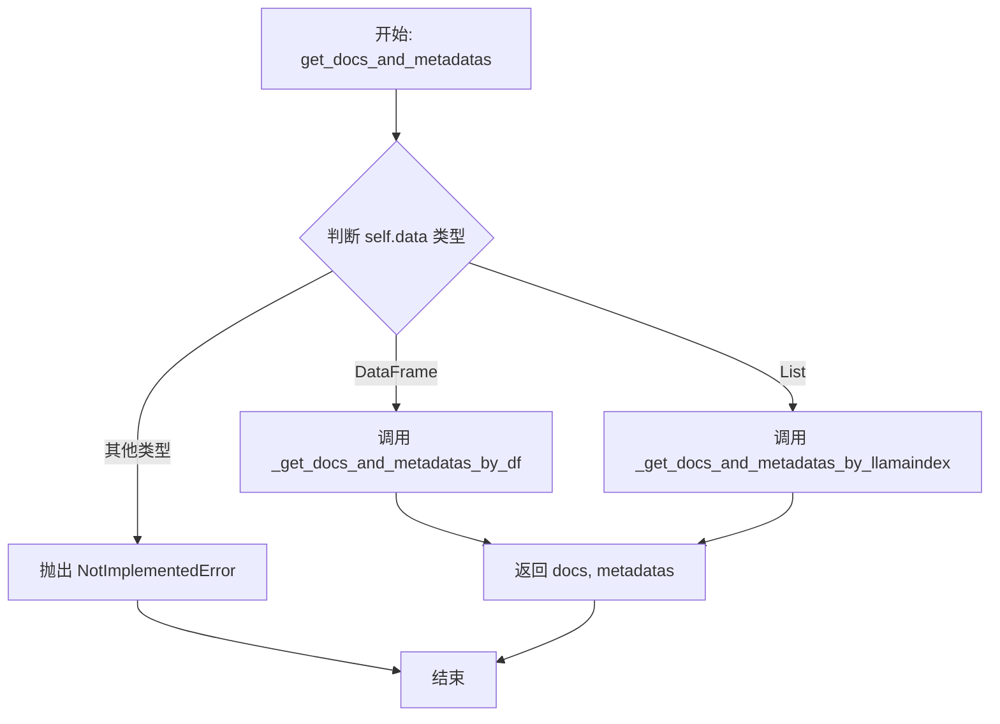

#### 带注释源码

```python
def get_docs_and_metadatas(self) -> (list, list):
    # 根据 self.data 的数据类型，选择相应的处理逻辑
    if isinstance(self.data, pd.DataFrame):
        # 如果数据是 pandas DataFrame，则调用 DataFrame 专用的处理方法
        return self._get_docs_and_metadatas_by_df()
    elif isinstance(self.data, list):
        # 如果数据是列表（通常来自 LlamaIndex 的 Document 对象），则调用列表专用的处理方法
        return self._get_docs_and_metadatas_by_llamaindex()
    else:
        # 如果数据类型不被支持，则抛出未实现错误
        raise NotImplementedError("Data type not supported for metadata extraction.")
```

### `Repo._path`

这是一个私有方法，用于根据给定的文件名，生成相对于当前仓库根目录（`self.path`）的完整文件路径。

参数：

- `filename`：`str`，需要生成完整路径的文件名。

返回值：`Path`，返回一个`pathlib.Path`对象，表示文件在仓库中的完整路径。

#### 流程图

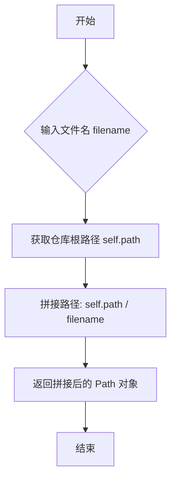

#### 带注释源码

```python
def _path(self, filename):
    # 将仓库根路径 self.path 与传入的文件名 filename 进行拼接
    # 返回一个 pathlib.Path 对象，代表文件在仓库中的绝对或相对路径
    return self.path / filename
```

### `Repo.from_path`

`Repo.from_path` 是一个类方法，用于从指定的文件系统路径加载一个代码仓库。它会遍历该路径下的所有文件，根据文件扩展名将文件内容分类为文档、代码或资源，并构建一个包含这些文件的 `Repo` 对象。

参数：

- `path`：`Path`，表示要加载的仓库根目录的路径。

返回值：`Repo`，返回一个初始化好的 `Repo` 对象，其中包含了从指定路径加载的所有文档、代码和资源。

#### 流程图

```mermaid
flowchart TD
    A[开始: Repo.from_path(path)] --> B{路径是否存在?};
    B -- 否 --> C[创建目录: path.mkdir];
    C --> D;
    B -- 是 --> D[初始化Repo对象: repo];
    D --> E[遍历路径下所有文件: file_path in path.rglob('*')];
    E --> F{是文件且后缀为<br>.json, .txt, .md, .py, .js, .css, .html?};
    F -- 是 --> G[读取文件内容: file_path.read_text];
    G --> H[调用 repo._set 方法分类存储];
    H --> E;
    F -- 否 --> I[跳过此文件];
    I --> E;
    E -- 遍历结束 --> J[返回 repo 对象];
    J --> K[结束];
```

#### 带注释源码

```python
    @classmethod
    def from_path(cls, path: Path):
        """Load documents, code, and assets from a repository path."""
        # 确保目标路径存在，如果不存在则创建
        path.mkdir(parents=True, exist_ok=True)
        # 初始化一个 Repo 对象，设置其路径和名称
        repo = Repo(path=path, name=path.name)
        # 递归遍历路径下的所有文件和子目录
        for file_path in path.rglob("*"):
            # FIXME: 当前的文件类型判断逻辑较为局限，难以支持多种编程语言，需要更通用的方案
            # 判断当前路径是否为文件，并且文件后缀在支持的列表中
            if file_path.is_file() and file_path.suffix in [".json", ".txt", ".md", ".py", ".js", ".css", ".html"]:
                # 读取文件内容，并调用内部方法 _set 将其分类存储到 repo 的相应字典中
                repo._set(file_path.read_text(), file_path)
        # 返回构建好的 Repo 对象
        return repo
```

### `Repo.to_path`

将仓库中的所有文档、代码和资源文件持久化保存到指定的仓库路径中。

参数：

- 无显式参数。该方法操作的是`self`对象（`Repo`实例）的`docs`、`codes`和`assets`字段。

返回值：`None`，该方法不返回任何值，其作用是将内存中的文档内容写入到文件系统中。

#### 流程图

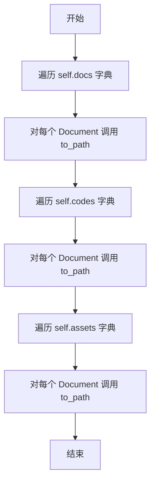

#### 带注释源码

```python
def to_path(self):
    """Persist all documents, code, and assets to the given repository path."""
    # 遍历 docs 字典中的所有 Document 对象
    for doc in self.docs.values():
        # 调用每个 Document 对象的 to_path 方法，将其内容写入文件
        doc.to_path()
    # 遍历 codes 字典中的所有 Document 对象
    for code in self.codes.values():
        # 调用每个 Document 对象的 to_path 方法，将其内容写入文件
        code.to_path()
    # 遍历 assets 字典中的所有 Document 对象
    for asset in self.assets.values():
        # 调用每个 Document 对象的 to_path 方法，将其内容写入文件
        asset.to_path()
```

### `Repo._set`

该方法根据文件扩展名将内容分类存储到仓库的不同字典中（文档、代码、资源），并返回创建的Document对象。

参数：

- `content`：`str`，要存储的文件内容
- `path`：`Path`，文件的完整路径

返回值：`Document`，返回创建的Document对象

#### 流程图

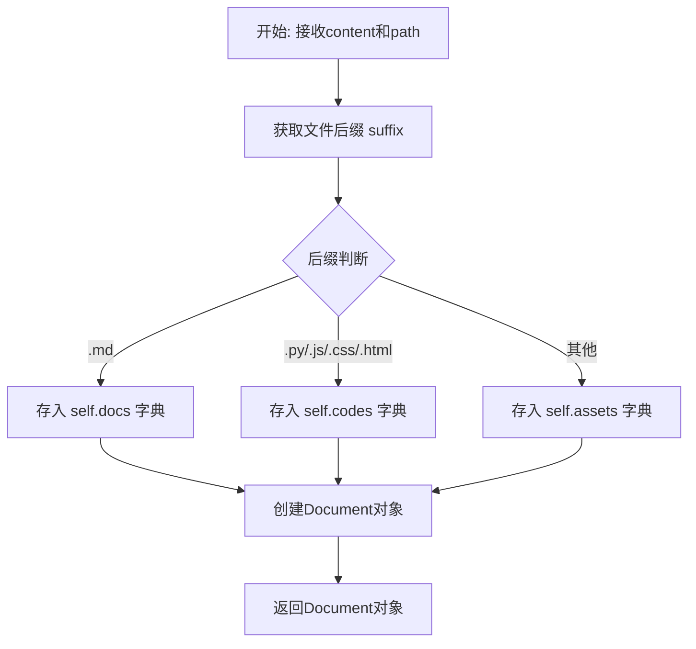

#### 带注释源码

```python
def _set(self, content: str, path: Path):
    """Add a document to the appropriate category based on its file extension."""
    # 获取文件扩展名
    suffix = path.suffix
    # 创建Document对象，包含内容、路径和相对于仓库根目录的名称
    doc = Document(content=content, path=path, name=str(path.relative_to(self.path)))

    # 根据文件扩展名分类存储
    # FIXME: 当前判断逻辑难以支持多种编程语言，需要更通用的方案
    if suffix.lower() == ".md":
        # Markdown文件存入文档字典
        self.docs[path] = doc
    elif suffix.lower() in [".py", ".js", ".css", ".html"]:
        # 代码文件存入代码字典
        self.codes[path] = doc
    else:
        # 其他文件存入资源字典
        self.assets[path] = doc
    # 返回创建的Document对象
    return doc
```

### `Repo.set`

该方法用于在代码仓库中设置一个文档（或代码/资源文件），根据文件扩展名将其分类到`docs`、`codes`或`assets`字典中，并立即将内容持久化到磁盘上的对应路径。

参数：

- `filename`：`str`，相对于仓库根目录的文件名（如 `"docs/readme.md"`）。
- `content`：`str`，要写入文件的文本内容。

返回值：`None`，该方法不返回任何值。

#### 流程图

```mermaid
flowchart TD
    A[开始: Repo.set(filename, content)] --> B[构造完整路径: path = self._path(filename)]
    B --> C[调用内部方法: doc = self._set(content, path)]
    C --> D[根据文件后缀分类<br>并存入对应字典]
    D --> E[调用 doc.to_path() 持久化到磁盘]
    E --> F[结束]
```

#### 带注释源码

```python
def set(self, filename: str, content: str):
    """Set a document and persist it to disk."""
    # 1. 根据传入的文件名，结合仓库根路径，构造出文件的完整路径。
    path = self._path(filename)
    # 2. 调用内部方法 `_set`，该方法会根据文件扩展名将内容创建为 Document 对象，
    #    并分类存储到 `self.docs`, `self.codes` 或 `self.assets` 字典中。
    doc = self._set(content, path)
    # 3. 调用 Document 对象的 `to_path` 方法，将内容立即写入到构造出的文件路径中，完成持久化。
    doc.to_path()
```

### `Repo.get`

根据给定的文件名，从仓库的文档、代码或资源字典中查找并返回对应的`Document`对象。如果未找到，则返回`None`。

参数：

- `filename`：`str`，要查找的文件名（相对于仓库根目录的路径）

返回值：`Optional[Document]`，如果找到则返回对应的`Document`对象，否则返回`None`

#### 流程图

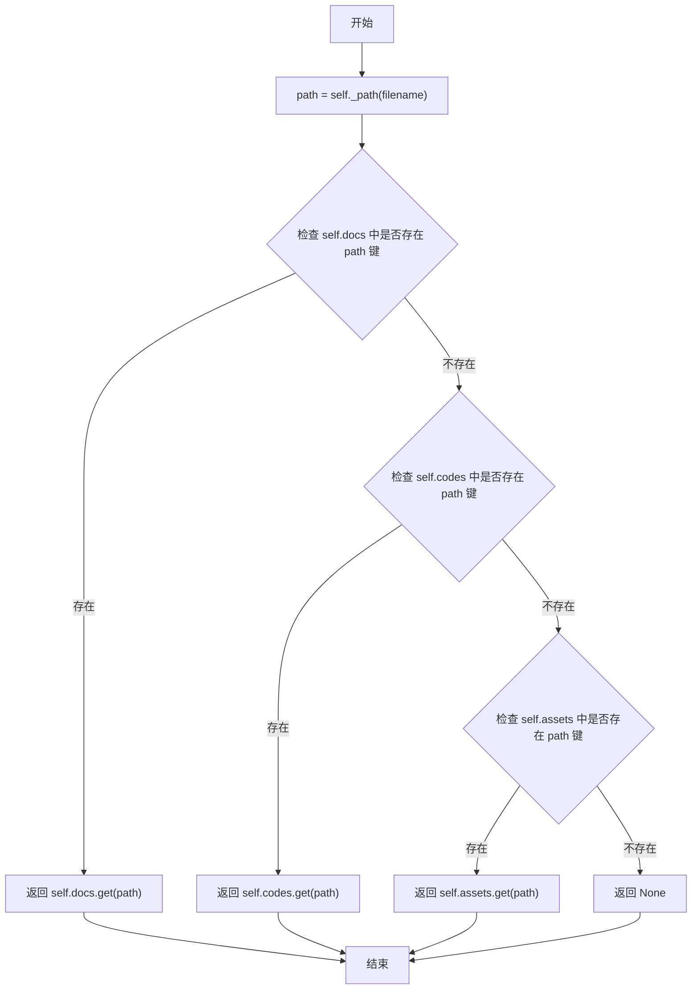

#### 带注释源码

```python
def get(self, filename: str) -> Optional[Document]:
    """Get a document by its filename."""
    # 将相对文件名转换为相对于仓库根目录的完整Path对象
    path = self._path(filename)
    # 依次在docs、codes、assets三个字典中查找对应的Document对象
    # 使用or运算符短路特性，找到第一个非None值即返回
    return self.docs.get(path) or self.codes.get(path) or self.assets.get(path)
```

### `Repo.get_text_documents`

该方法用于获取仓库中所有被归类为“文档”和“代码”的 `Document` 对象列表。它不进行任何过滤或转换，直接返回 `self.docs` 和 `self.codes` 字典中所有值的合并列表。

参数：
- `self`：`Repo`，当前 `Repo` 类的实例。

返回值：`list[Document]`，一个包含所有文本类（文档和代码）`Document` 对象的列表。

#### 流程图

```mermaid
flowchart TD
    A[开始] --> B[获取 docs 字典的所有值<br>list(self.docs.values)]
    A --> C[获取 codes 字典的所有值<br>list(self.codes.values)]
    B --> D[合并两个列表<br>list_a + list_b]
    C --> D
    D --> E[返回合并后的列表]
    E --> F[结束]
```

#### 带注释源码

```python
def get_text_documents(self) -> list[Document]:
    # 返回 self.docs 和 self.codes 字典中所有 Document 对象的合并列表。
    # 这通常用于获取所有可索引或可分析的文本内容。
    return list(self.docs.values()) + list(self.codes.values())
```

### `Repo.eda`

对代码仓库进行探索性数据分析（EDA），统计文档数量、字符总数，并提取代码符号信息。

参数：

-  `self`：`Repo`，当前代码仓库实例

返回值：`RepoMetadata`，包含仓库名称、文档数量、字符总数和符号列表的元数据对象

#### 流程图

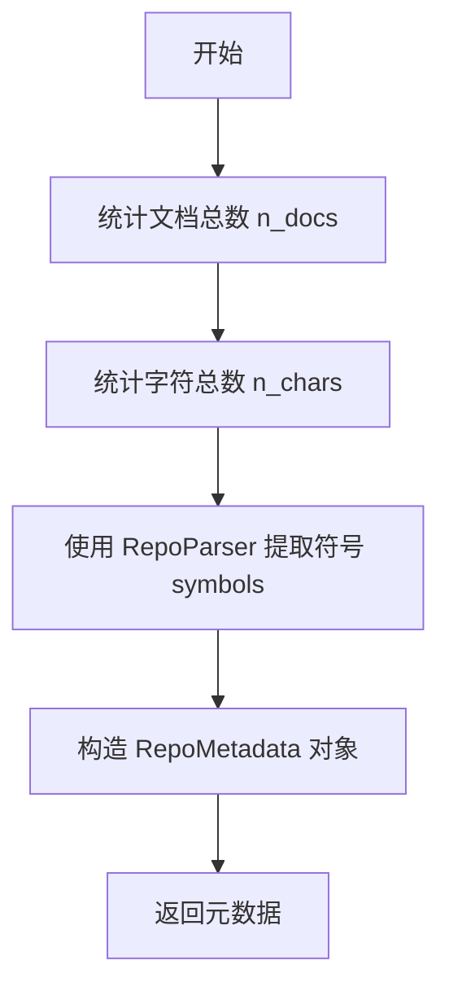

#### 带注释源码

```python
def eda(self) -> RepoMetadata:
    # 统计文档总数：汇总 docs、codes、assets 三个字典中的文档数量
    n_docs = sum(len(i) for i in [self.docs, self.codes, self.assets])
    
    # 统计字符总数：遍历所有文档内容并计算总字符数
    n_chars = sum(sum(len(j.content) for j in i.values()) for i in [self.docs, self.codes, self.assets])
    
    # 使用 RepoParser 解析代码仓库，提取符号信息（如类、函数、变量等）
    symbols = RepoParser(base_directory=self.path).generate_symbols()
    
    # 构造并返回包含统计信息的元数据对象
    return RepoMetadata(name=self.name, n_docs=n_docs, n_chars=n_chars, symbols=symbols)
```

## 关键组件

### Document 类

处理文档文件的基本操作，包括从文件路径或文本创建文档实例，以及将文档内容持久化保存到文件系统。

### IndexableDocument 类

用于高级文档处理的类，特别适用于向量数据库或搜索引擎的索引场景。它能够从多种文件格式（如 Excel、CSV、JSON、PDF、TXT、DOCX）加载数据，并提取文档内容和元数据。

### Repo 类

表示一个代码仓库，能够从指定路径加载文档、代码和资源文件，并提供对这些文件的增删改查操作。它还支持对仓库内容进行探索性数据分析（EDA），生成仓库元数据。

### RepoMetadata 类

用于存储代码仓库的元数据，包括仓库名称、文档数量、字符总数以及从代码中解析出的符号列表。

### read_data 函数

根据文件后缀名，使用不同的库（如 pandas, llama_index, PDFReader）读取文件内容，并返回统一的数据结构（DataFrame 或 Document 列表）。

### validate_cols 函数

验证给定的列名是否存在于 pandas DataFrame 的列中，用于确保数据提取操作的有效性。

## 问题及建议

### 已知问题

-   **文件类型支持有限且判断逻辑分散**：`read_data` 函数和 `Repo._set` 方法中硬编码了支持的文件后缀列表（如 `.py`, `.js`, `.md` 等）。这导致添加对新文件类型的支持需要在代码中多处修改，违反了开闭原则，且难以维护和扩展。
-   **`IndexableDocument` 的 `content` 字段语义模糊**：当 `data` 为 `pd.DataFrame` 时，`content` 字段被赋值为 `str(data)`（即DataFrame的字符串表示），这通常不是有意义的文档内容，与类名“可索引文档”的意图不符，可能导致下游处理错误。
-   **`Repo` 类的职责过重且分类逻辑僵化**：`Repo` 类同时负责文档的存储、分类（docs/codes/assets）、持久化和仓库分析（EDA）。其基于文件后缀的硬编码分类逻辑（如 `.md` 是文档，`.py` 是代码）过于简单，无法适应复杂的项目结构或新的文件类型。
-   **`Document.to_path` 方法功能不完整**：该方法目前仅支持将纯文本内容写入文件，其 `TODO` 注释表明它计划支持如 Excel、CSV、JSON 等格式，但尚未实现。这限制了 `Document` 类处理多种文件格式的实用性。
-   **异常处理不完善**：`IndexableDocument.from_path` 方法在读取非文本文件（如图片）失败时，仅记录调试日志并将 `content` 设为空字符串，这可能掩盖了实际的读取错误，使调用方难以感知和处理故障。
-   **硬编码的解析参数**：在 `read_data` 函数中，处理 `.txt` 文件时使用了固定的 `SimpleNodeParser` 配置（`chunk_size=256, chunk_overlap=0`）。这些参数可能不适用于所有文本内容，缺乏灵活性。
-   **`Repo` 与 `RepoParser` 存在循环依赖风险**：`Repo.eda` 方法内部实例化了 `RepoParser` 来分析代码符号。`RepoParser` 很可能需要解析 `Repo` 中的代码文件，这种设计可能导致模块间的循环依赖或职责边界不清。
-   **`Repo.from_path` 方法可能忽略文件**：该方法仅加载特定后缀的文件（`.json`, `.txt`, `.md`, `.py`, `.js`, `.css`, `.html`），其他文件（如 `.yaml`, `.java`, 图像文件）会被完全忽略，这可能导致仓库内容不完整。

### 优化建议

-   **引入文件类型注册机制**：创建一个中心化的文件类型处理器注册表。可以定义一个 `FileHandler` 接口，并为每种支持的文件类型（如 `.md`, `.py`, `.csv`）注册对应的处理器。`read_data` 和 `Repo` 类通过查询此注册表来执行读写操作，从而将支持新文件类型的修改隔离到单独的处理器类中。
-   **明确 `IndexableDocument` 的数据模型**：重新设计 `IndexableDocument`，将原始数据（`data`）与用于索引的文本内容（`content`）分离。当 `data` 是 `DataFrame` 时，`content` 应基于 `content_col` 列的内容生成（例如，合并所有行），或者移除 `content` 字段，让 `get_docs_and_metadatas` 方法成为获取可索引内容的唯一入口。
-   **重构 `Repo` 类的职责**：考虑将 `Repo` 拆分为更专注的类。例如：
    -   `FileRepository`：负责文件的物理存储和检索。
    -   `ProjectStructure` 或 `Classifier`：负责根据可配置的规则（而非硬编码后缀）对文件进行分类。
    -   `RepoAnalyzer`：负责执行仓库分析（EDA），依赖 `FileRepository` 和 `RepoParser` 等服务。
-   **实现多格式的 `Document.to_path`**：根据文件路径的后缀，在 `to_path` 方法中调用相应的库（如 `pandas.to_excel`, `json.dump`）来写入数据。可以结合上述的文件类型注册机制来实现。
-   **改进异常处理策略**：在 `IndexableDocument.from_path` 中，对于无法以文本形式读取的文件，应考虑抛出更明确的异常（如 `UnsupportedFileFormatError`），或者根据文件类型返回一个包含二进制数据或特定元数据的 `Document` 变体，而不是静默地记录日志。
-   **使解析参数可配置**：将 `SimpleNodeParser` 的配置参数（如 `chunk_size`, `chunk_overlap`）作为 `read_data` 函数的可选参数，或通过配置文件提供，以增加灵活性。
-   **解耦 `Repo` 与 `RepoParser`**：`Repo.eda` 方法不应直接实例化 `RepoParser`。可以考虑将 `RepoParser` 作为依赖注入到 `Repo` 的构造函数中，或者让一个更上层的服务来协调 `Repo`（提供文件）和 `RepoParser`（进行分析）的工作。
-   **完善 `Repo.from_path` 的文件加载策略**：提供更灵活的文件包含/排除规则（例如，通过通配符、正则表达式或回调函数），或者至少记录被忽略的文件，让用户知晓加载过程的不完整性。

## 其它


### 设计目标与约束

本模块旨在提供一个统一、可扩展的文档处理抽象层，用于管理文件系统中的各类文档（如文本、表格、PDF等）和代码仓库。其核心设计目标包括：
1.  **统一接口**：为不同格式的文件（.txt, .md, .csv, .xlsx, .json, .pdf, .docx等）提供一致的读取和创建接口，隐藏底层格式差异。
2.  **分层抽象**：通过`Document`、`IndexableDocument`、`Repo`等类构建从基础文档到复杂仓库管理的层次化模型，支持不同粒度的操作。
3.  **可索引性**：通过`IndexableDocument`类支持将文档内容（特别是结构化数据）转换为适合向量数据库或搜索引擎索引的格式（文档列表和元数据列表）。
4.  **仓库感知**：`Repo`类能够扫描、分类（文档、代码、资源）并管理一个目录结构下的所有文件，支持基本的探索性数据分析（EDA）。
5.  **状态管理**：通过`DocumentStatus`枚举为文档提供简单的生命周期状态跟踪（如草稿、审核中、已批准）。

主要约束包括：
1.  **文件格式支持有限**：当前支持的格式列表是固定的，新增格式需要修改`read_data`函数和`IndexableDocument.from_path`逻辑。
2.  **编程语言支持有限**：`Repo`类中代码文件的识别基于简单的后缀名匹配（.py, .js, .css, .html），难以覆盖所有编程语言。
3.  **内存与性能**：`read_data`函数一次性将整个文件加载到内存（如Pandas DataFrame），对于超大文件可能存在内存压力。`Repo.from_path`也会递归加载整个目录下的文件内容。
4.  **错误处理粒度**：部分错误（如文件不存在、列不存在）通过抛出异常处理，调用方需负责捕获。对于部分读取错误（如PDF解析失败），仅记录调试日志并返回空内容，可能丢失错误上下文。

### 错误处理与异常设计

模块中的错误处理主要采用异常机制，并辅以日志记录：
1.  **输入验证异常**：
    *   `validate_cols`: 当DataFrame中不存在指定的`content_col`时，抛出`ValueError`。
    *   `Document.from_path` / `IndexableDocument.from_path`: 当路径不存在时，抛出`FileNotFoundError`。
    *   `Document.to_path`: 当实例的`path`属性为`None`时，抛出`ValueError`。
2.  **功能支持异常**：
    *   `read_data`: 遇到不支持的文件后缀时，抛出`NotImplementedError`。
    *   `IndexableDocument.get_docs_and_metadatas`: 当`data`字段的数据类型既不是`pd.DataFrame`也不是`list`时，抛出`NotImplementedError`。
3.  **静默处理与日志**：
    *   在`IndexableDocument.from_path`中，如果从非结构化文件（如PDF）读取后尝试`read_text`失败，会捕获异常并记录`logger.debug`信息，然后将`content`设为空字符串。这可能导致内容丢失而不为上层所知。
4.  **缺失的异常**：
    *   文件读写操作（如`path.read_text()`, `path.write_text()`）可能因权限不足、磁盘已满等原因抛出`IOError`或`OSError`，当前代码未显式处理这些异常，将直接向上层传播。
    *   `Repo.to_path`中循环调用`doc.to_path()`，如果中间某个文件保存失败，循环会中断，已保存的文件和未保存的文件状态可能不一致。

### 数据流与状态机

1.  **核心数据流**：
    *   **文件 -> 数据对象**：通过`read_data`函数，根据文件后缀选择对应的库（pandas, llama_index, PDFReader）进行解析，返回`pd.DataFrame`或`list[Document]`。
    *   **数据对象 -> 可索引结构**：`IndexableDocument`的`get_docs_and_metadatas`方法根据内部`data`的类型（DataFrame或llama_index Document列表），将其转换为统一的`(docs: list[str], metadatas: list[dict])`格式，供下游索引构建使用。
    *   **仓库扫描与分类**：`Repo.from_path`遍历指定路径，根据文件后缀将内容加载到`Document`对象，并分类存入`docs`、`codes`、`assets`字典。
2.  **文档状态机**：
    *   由`DocumentStatus`枚举定义了一个简单的线性状态：`DRAFT` -> `UNDERREVIEW` -> `APPROVED` -> `DONE`。
    *   当前代码中并未实现状态间的转换逻辑，`status`字段仅作为元数据存储。状态机的推进需要外部逻辑驱动。

### 外部依赖与接口契约

1.  **显式依赖库**：
    *   `pandas`: 用于处理`.csv`, `.xlsx`, `.json`格式的表格数据。
    *   `llama-index-core` & `llama-index-readers-file`: 用于读取`.txt`, `.docx`, `.pdf`文件，并提供文档分块功能。
    *   `pydantic`: 用于数据验证和设置管理（BaseModel）。
    *   `tqdm`: 在转换DataFrame时提供进度条显示。
    *   `metagpt.logs`: 项目内部日志模块。
    *   `metagpt.repo_parser`: 项目内部模块，用于解析代码仓库生成符号列表。
2.  **隐式依赖/假设**：
    *   文件系统：所有操作都假设在可访问的文件系统上进行。
    *   编码：文本读写默认使用UTF-8编码（`path.write_text(..., encoding='utf-8')`），对于非UTF-8编码的文件可能出错。
    *   内存：大文件处理依赖足够的内存。
3.  **接口契约**：
    *   `read_data`函数：契约要求输入一个`Path`对象，返回`Union[pd.DataFrame, list[Document]]`。调用者必须处理可能抛出的`NotImplementedError`和文件读取异常。
    *   `Document`类：`to_path`方法要求调用前`path`属性必须有效（非None且可写）。
    *   `IndexableDocument.get_docs_and_metadatas`：契约要求`data`字段必须是`pd.DataFrame`或`list`（llama_index Document），否则抛出异常。返回的`metadatas`列表中，每个元素都是一个字典。
    *   `Repo`类：`from_path`假设路径代表一个可读的目录。`set`和`get`方法操作的文件路径是相对于`Repo`实例的`path`属性的。

    