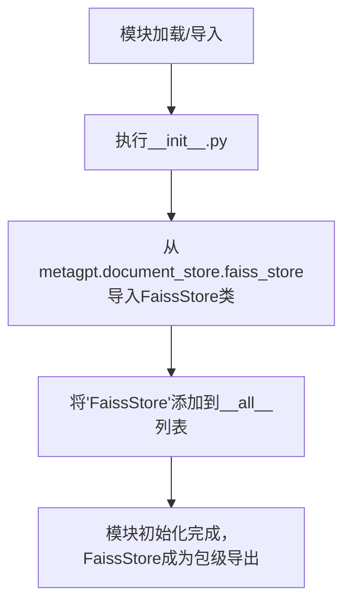

# `.\MetaGPT\metagpt\document_store\__init__.py` 详细设计文档

该文件是一个Python包的初始化模块，主要功能是导入并重新导出FaissStore类，使其成为当前包（document_store）的公共API的一部分。它简化了外部代码对FaissStore的访问，用户可以直接从`metagpt.document_store`导入FaissStore，而无需深入子模块路径。

## 整体流程



## 类结构

```
metagpt.document_store (Python包)
└── __init__.py (包初始化文件)
    └── (重新导出) FaissStore (来自faiss_store子模块)
```

## 全局变量及字段


### `__all__`
    
一个字符串列表，用于定义模块的公共接口，指定了当使用 'from module import *' 时，哪些名称会被导出。

类型：`List[str]`
    


    

## 全局函数及方法


## 关键组件


### FaissStore

一个基于FAISS（Facebook AI Similarity Search）库实现的向量存储与相似性搜索组件，用于高效存储和检索文档的向量表示，支持大规模向量数据的快速最近邻搜索。


## 问题及建议


### 已知问题

-   **模块导出单一**：当前 `__init__.py` 文件仅导出了 `FaissStore` 一个类。如果 `document_store` 包下未来增加了其他重要的组件（如其他类型的文档存储、工具类或辅助函数），外部代码将无法通过 `from metagpt.document_store import ...` 的方式便捷地访问它们，需要显式地从子模块导入，降低了包的易用性和封装性。

### 优化建议

-   **扩展模块导出**：建议定期审查 `document_store` 包下的新增组件。对于稳定且希望公开给外部使用的类、函数或异常，应将其名称添加到 `__all__` 列表中。例如，如果新增了一个 `ElasticsearchStore` 类，应更新 `__all__ = ["FaissStore", "ElasticsearchStore"]`。这遵循了Python的显式导出最佳实践，使包的公共接口清晰明确。
-   **考虑包结构设计**：如果 `document_store` 包未来会包含多种存储后端（如Faiss, Chroma, Pinecone等），可以考虑设计一个统一的抽象基类（如 `BaseDocumentStore`）并在 `__init__.py` 中导出，以提供一致的接口并方便用户进行切换。同时，可以导出一些工厂函数或配置类来简化客户端的初始化过程。


## 其它


### 设计目标与约束

该模块的设计目标是提供一个简单、统一的接口，用于导出 `metagpt.document_store.faiss_store` 模块中的 `FaissStore` 类。其主要约束是保持 `__init__.py` 文件的简洁性，仅负责模块级别的导入和导出，不包含任何业务逻辑、类定义或函数实现。这符合Python包结构的最佳实践，旨在明确包的公共API，并方便用户通过 `from metagpt.document_store import FaissStore` 的方式直接使用核心组件。

### 错误处理与异常设计

当前 `__init__.py` 文件本身不包含任何可能引发错误的逻辑。其唯一操作是执行 `import` 语句。因此，错误处理完全依赖于被导入的 `FaissStore` 类及其所在模块 `faiss_store.py` 的内部实现。如果 `faiss_store` 模块不存在或 `FaissStore` 类无法导入，Python解释器将在导入 `metagpt.document_store` 包时抛出标准的 `ModuleNotFoundError` 或 `ImportError`。模块设计者应确保 `faiss_store.py` 文件存在且语法正确，以保障此入口文件的可用性。

### 数据流与状态机

此 `__init__.py` 文件不涉及任何数据处理或状态管理。它仅作为一个静态的配置和声明文件。数据流和状态机的逻辑完全封装在 `FaissStore` 类内部。当用户代码执行导入语句时，数据流始于Python解释器定位并加载 `faiss_store.py` 模块，然后将其中的 `FaissStore` 类绑定到当前包的命名空间中，供调用方使用。整个过程是瞬时的、无状态的。

### 外部依赖与接口契约

1.  **外部依赖**：
    *   **直接依赖**：`metagpt.document_store.faiss_store` 模块。此文件的存在和正确性是本模块正常工作的前提。
    *   **间接依赖**：`faiss_store` 模块所依赖的所有第三方库（例如 `faiss`、`numpy` 等）和内部模块。这些依赖的安装和版本兼容性需要在项目层面进行管理。

2.  **接口契约**：
    *   **导出契约**：通过 `__all__ = ["FaissStore"]` 明确声明，此包仅对外公开 `FaissStore` 一个名称。这定义了包的公共API边界，承诺用户可以通过 `from metagpt.document_store import FaissStore` 稳定地获取该类。
    *   **导入契约**：此文件假设同级目录下存在 `faiss_store.py` 文件，且该文件中定义了名为 `FaissStore` 的类。这是该文件与内部模块之间的隐式契约。

### 配置与可扩展性

此文件本身不具备配置项。其“配置”体现在 `__all__` 列表中。如需扩展此包的功能，例如新增一个 `ElasticSearchStore` 类并希望对外提供，标准的做法是：
1.  在 `document_store` 目录下创建对应的模块文件（如 `es_store.py`）。
2.  在该模块中实现 `ElasticSearchStore` 类。
3.  修改此 `__init__.py` 文件，更新导入语句和 `__all__` 列表：`from metagpt.document_store.es_store import ElasticSearchStore` 并 `__all__ = ["FaissStore", "ElasticSearchStore"]`。
这种设计使得包的扩展清晰且符合规范。

### 测试策略

由于此文件不包含逻辑，通常不需要为其编写独立的单元测试。其正确性通过以下方式保障：
1.  **集成测试**：在测试 `FaissStore` 类或使用 `metagpt.document_store` 包的上层功能时，导入语句会被间接测试。如果导入失败，相关测试会报错。
2.  **静态检查**：通过代码风格检查工具（如 `flake8`）确保语法正确，通过导入排序工具（如 `isort`）保持整洁。
3.  **包构建测试**：在项目打包（如制作 `wheel` 或 `sdist`）过程中，会验证整个包结构的完整性和可导入性。


    