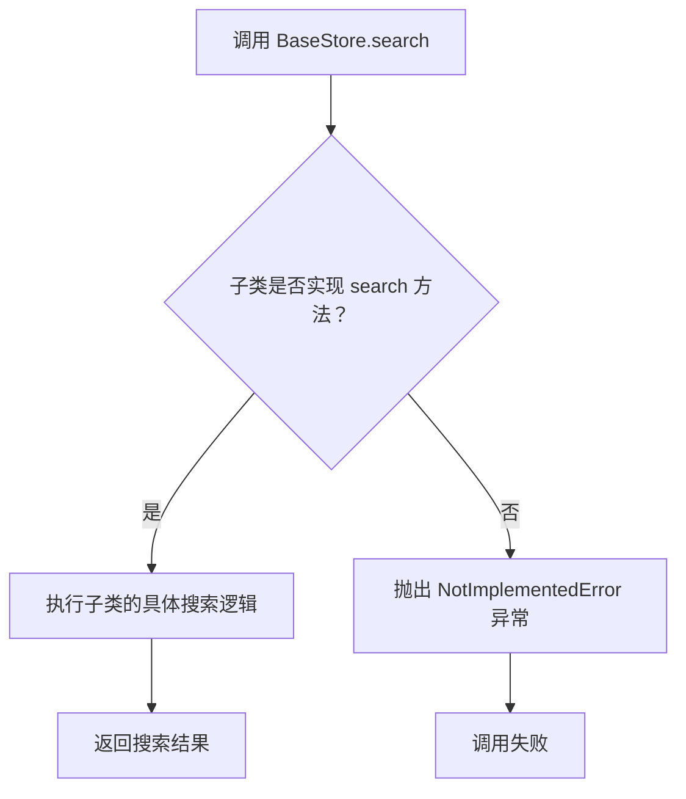
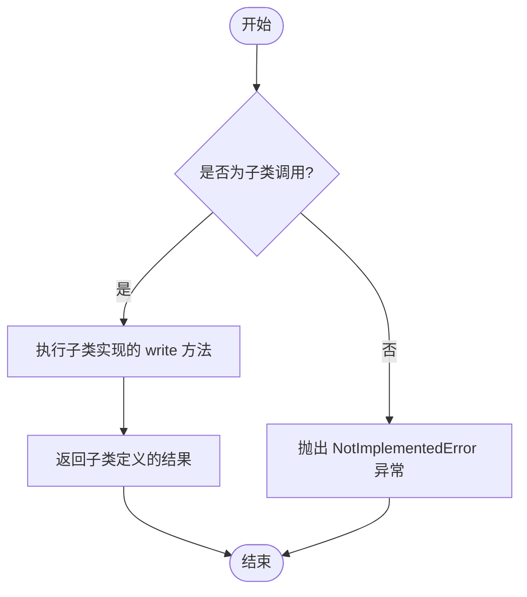
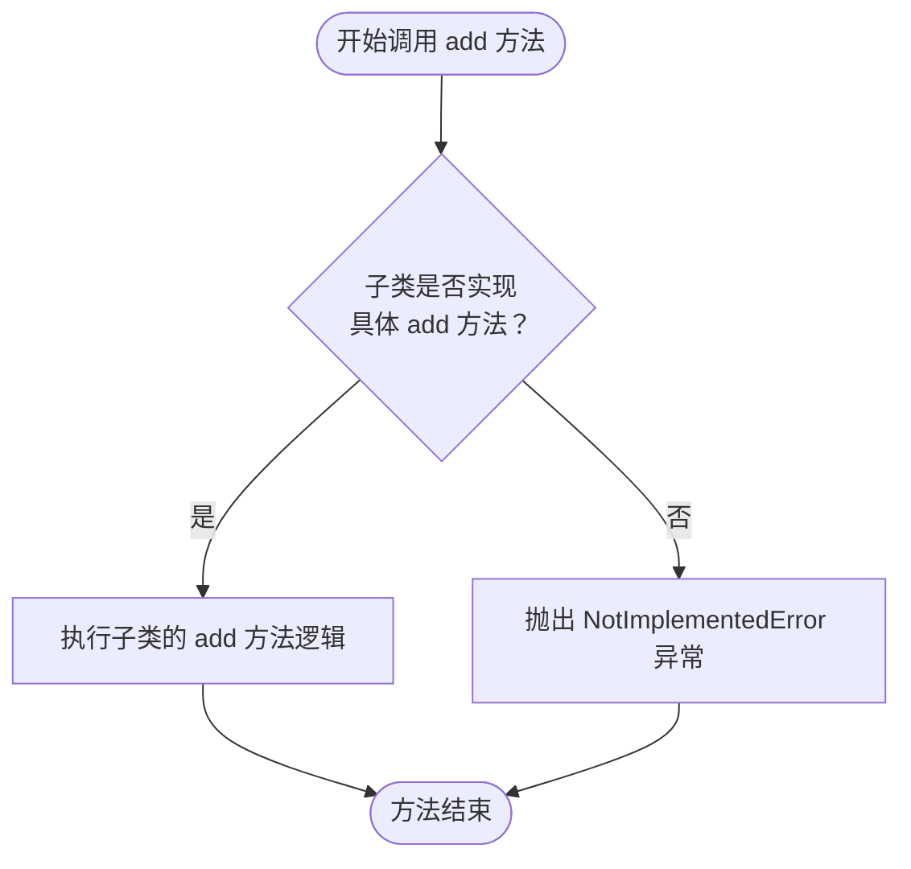
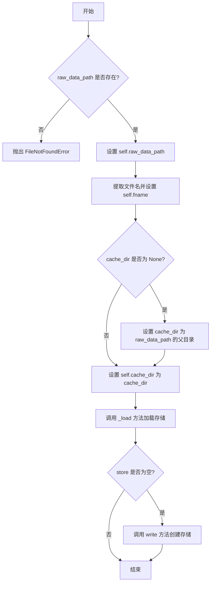
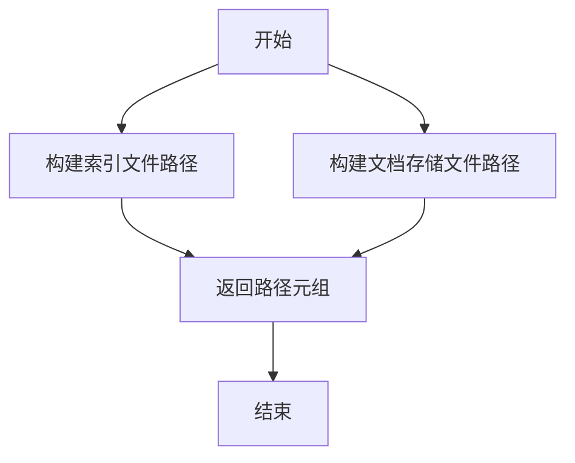
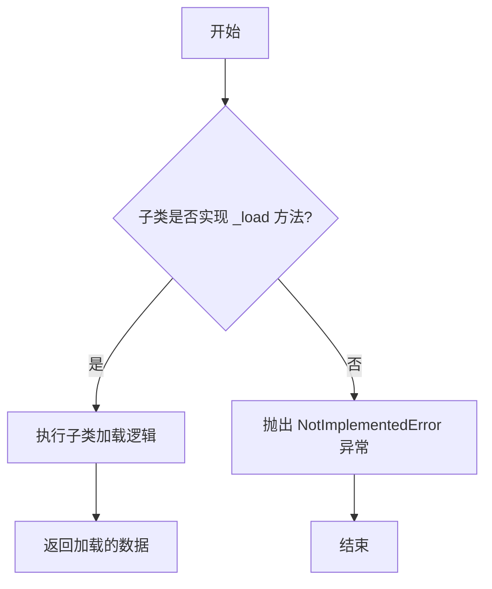
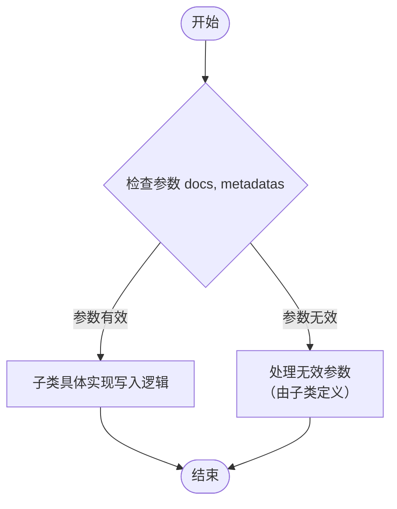

# `.\MetaGPT\metagpt\document_store\base_store.py` 详细设计文档

该代码定义了一个用于数据存储和检索的抽象基类框架。它包含一个顶层抽象基类 `BaseStore`，定义了搜索、写入和添加数据的基本接口。`LocalStore` 作为 `BaseStore` 的一个具体抽象子类，增加了本地文件系统操作的逻辑，包括初始化时加载数据、处理原始数据路径和缓存目录，并提供了获取索引和存储文件路径的辅助方法。整体设计旨在为不同的存储后端（如向量数据库、文档存储等）提供一个统一的接口和本地实现的通用基础。

## 整体流程

```mermaid
graph TD
    A[开始: 初始化 LocalStore] --> B{检查 raw_data_path 是否存在?}
    B -- 否 --> C[抛出 FileNotFoundError]
    B -- 是 --> D[设置 raw_data_path, fname, cache_dir]
    D --> E[调用 _load() 方法]
    E --> F{_load() 成功加载数据?}
    F -- 是 --> G[将数据赋给 self.store]
    F -- 否 --> H[调用 write() 方法]
    H --> I[将 write() 结果赋给 self.store]
    I --> J[初始化完成]
```

## 类结构

```
BaseStore (抽象基类)
├── search (抽象方法)
├── write (抽象方法)
└── add (抽象方法)
LocalStore (抽象类，继承自 BaseStore)
├── __init__ (构造函数)
├── _get_index_and_store_fname (方法)
├── _load (抽象方法)
└── _write (抽象方法)
```

## 全局变量及字段


### `LocalStore.raw_data_path`
    
存储原始数据文件的路径对象。

类型：`pathlib.Path`
    


### `LocalStore.fname`
    
原始数据文件的文件名（不含扩展名）。

类型：`str`
    


### `LocalStore.cache_dir`
    
用于存储缓存文件（如索引和文档存储）的目录路径对象。

类型：`pathlib.Path`
    


### `LocalStore.store`
    
存储加载或写入的数据对象，具体类型由子类实现决定。

类型：`Any`
    
    

## 全局函数及方法

### `BaseStore.search`

`BaseStore.search` 是 `BaseStore` 抽象基类中定义的一个抽象方法，用于声明一个搜索功能。它要求所有继承自 `BaseStore` 的子类必须实现自己的 `search` 方法，以提供具体的搜索逻辑。该方法本身不包含实现，直接抛出 `NotImplementedError` 异常。

参数：
- `*args`：`tuple`，可变位置参数，用于接收任意数量的位置参数。
- `**kwargs`：`dict`，可变关键字参数，用于接收任意数量的关键字参数。

返回值：`NotImplementedError`，该方法不返回有效值，调用时会抛出 `NotImplementedError` 异常。

#### 流程图



#### 带注释源码

```python
    @abstractmethod
    def search(self, *args, **kwargs):
        # 这是一个抽象方法，使用 @abstractmethod 装饰器标记。
        # 它声明了 search 方法的接口，但不提供具体实现。
        # 参数 *args 和 **kwargs 允许子类在实现时定义任意数量和类型的参数。
        # 如果子类没有重写此方法，直接调用时会抛出 NotImplementedError 异常。
        raise NotImplementedError
```

### `BaseStore.write`

`BaseStore.write` 是 `BaseStore` 抽象基类中定义的一个抽象方法。它规定了所有继承自 `BaseStore` 的存储类都必须实现一个名为 `write` 的方法，用于将数据写入到存储介质中。该方法的具体实现（如写入文件、数据库等）由子类完成。

参数：
-  `*args`：`tuple`，可变位置参数，用于接收任意数量的位置参数，具体含义由子类实现定义。
-  `**kwargs`：`dict`，可变关键字参数，用于接收任意数量的关键字参数，具体含义由子类实现定义。

返回值：`Any`，返回值类型和描述由具体的子类实现决定。

#### 流程图



#### 带注释源码

```python
    @abstractmethod
    def write(self, *args, **kwargs):
        # 这是一个抽象方法，使用 @abstractmethod 装饰器标记。
        # 它要求所有 BaseStore 的子类必须实现自己的 write 方法。
        # 参数 *args 和 **kwargs 提供了灵活性，允许子类根据需求定义具体的参数。
        # 当在未实现此方法的子类实例上调用时，会抛出 NotImplementedError。
        raise NotImplementedError
```


### `BaseStore.add`

`BaseStore.add` 是 `BaseStore` 抽象基类中定义的一个抽象方法。它规定了所有继承自 `BaseStore` 的存储类必须实现一个名为 `add` 的方法，用于向存储中添加数据。该方法的具体实现（如添加单个文档、批量添加、如何处理索引等）由子类根据其存储类型（如本地文件、向量数据库、内存缓存等）自行定义。

参数：
-  `*args`：`tuple`，可变位置参数，用于接收传递给 `add` 方法的位置参数。具体含义由子类实现决定。
-  `**kwargs`：`dict`，可变关键字参数，用于接收传递给 `add` 方法的关键字参数。具体含义由子类实现决定。

返回值：`None`，此抽象方法本身不返回任何值，但子类实现的方法可以定义自己的返回值。

#### 流程图



#### 带注释源码

```python
    @abstractmethod
    def add(self, *args, **kwargs):
        # 这是一个抽象方法装饰器，表示该方法必须在子类中被具体实现。
        # *args 和 **kwargs 提供了灵活的接口，允许子类根据需求定义不同的参数。
        raise NotImplementedError
        # 如果子类没有实现此方法而直接调用，将抛出 NotImplementedError 异常。
```


### `LocalStore.__init__`

初始化 `LocalStore` 实例，设置原始数据路径和缓存目录，并加载或创建存储。

参数：

- `raw_data_path`：`Path`，原始数据文件的路径
- `cache_dir`：`Path`，缓存目录的路径，默认为 `None`

返回值：`None`，无返回值

#### 流程图



#### 带注释源码

```python
def __init__(self, raw_data_path: Path, cache_dir: Path = None):
    # 检查 raw_data_path 是否存在，如果不存在则抛出 FileNotFoundError 异常
    if not raw_data_path:
        raise FileNotFoundError
    # 设置实例变量 raw_data_path 为传入的原始数据路径
    self.raw_data_path = raw_data_path
    # 从 raw_data_path 中提取文件名（不含扩展名）并设置为实例变量 fname
    self.fname = self.raw_data_path.stem
    # 如果 cache_dir 为 None，则将其设置为 raw_data_path 的父目录
    if not cache_dir:
        cache_dir = raw_data_path.parent
    # 设置实例变量 cache_dir 为缓存目录路径
    self.cache_dir = cache_dir
    # 调用 _load 方法加载存储，并将结果设置为实例变量 store
    self.store = self._load()
    # 如果 store 为空（即加载失败），则调用 write 方法创建存储
    if not self.store:
        self.store = self.write()
```

### `LocalStore._get_index_and_store_fname`

该方法用于根据给定的文件扩展名，生成并返回索引文件和文档存储文件的完整路径。它不依赖于实例的特定状态（除了`self.cache_dir`），主要用于构建缓存文件的存储路径。

参数：

- `index_ext`：`str`，索引文件的扩展名，默认为`.json`。
- `docstore_ext`：`str`，文档存储文件的扩展名，默认为`.json`。

返回值：`tuple[Path, Path]`，返回一个包含两个`Path`对象的元组，第一个是索引文件的路径，第二个是文档存储文件的路径。

#### 流程图



#### 带注释源码

```python
def _get_index_and_store_fname(self, index_ext=".json", docstore_ext=".json"):
    # 构建索引文件的完整路径：缓存目录下的 'default__vector_store' 子目录，加上指定的扩展名
    index_file = self.cache_dir / "default__vector_store" / index_ext
    # 构建文档存储文件的完整路径：缓存目录下的 'docstore' 子目录，加上指定的扩展名
    store_file = self.cache_dir / "docstore" / docstore_ext
    # 返回包含两个路径的元组
    return index_file, store_file
```

### `LocalStore._load`

该方法是一个抽象方法，用于从本地存储中加载数据。具体的加载逻辑由子类实现，以支持不同的数据格式和存储方式。

参数：
- 无

返回值：`Any`，返回加载的数据，具体类型和结构由子类实现决定。

#### 流程图



#### 带注释源码

```python
@abstractmethod
def _load(self):
    """
    抽象方法：从本地存储加载数据。
    此方法必须由子类实现，以定义具体的加载逻辑。
    如果子类未实现此方法，调用时将抛出 NotImplementedError 异常。
    """
    raise NotImplementedError
```


### `LocalStore._write`

这是一个抽象方法，用于将文档数据及其元数据写入到本地存储中。作为抽象方法，它定义了子类必须实现的接口，但具体的写入逻辑（如格式、存储位置）由子类决定。

参数：
- `docs`：`Any`，需要存储的文档数据，具体类型和结构由子类定义。
- `metadatas`：`Any`，与文档相关联的元数据，具体类型和结构由子类定义。

返回值：`Any`，具体的返回值类型和含义由实现该方法的子类定义。可能表示操作是否成功、写入的数据量或其他状态信息。

#### 流程图



#### 带注释源码

```python
    @abstractmethod
    def _write(self, docs, metadatas):
        # 这是一个抽象方法，用于将文档和元数据写入存储。
        # 参数 docs: 需要存储的文档数据，具体类型由子类实现决定。
        # 参数 metadatas: 与文档关联的元数据，具体类型由子类实现决定。
        # 返回值: 由具体子类实现定义，可能表示写入结果或状态。
        raise NotImplementedError
```


## 关键组件


### BaseStore

一个定义了存储系统核心操作的抽象基类，为具体的存储实现（如本地存储、向量存储等）提供了统一的接口契约，包括搜索、写入和添加数据等基本功能。

### LocalStore

BaseStore的一个具体抽象子类，专门用于处理本地文件系统的存储操作。它封装了原始数据路径、缓存目录的管理，并提供了构建索引和文档存储文件路径的默认实现，要求子类实现具体的加载和写入逻辑。

### 抽象方法（Abstract Methods）

定义了存储系统必须实现的核心行为接口，包括`search`、`write`、`add`、`_load`和`_write`，确保了不同存储实现的一致性，同时将具体实现细节留给子类。

### 路径与文件管理

负责管理原始数据文件路径、缓存目录以及自动生成索引文件和文档存储文件的路径，是LocalStore实现数据持久化和缓存机制的基础组件。


## 问题及建议


### 已知问题

-   **抽象类设计不完整**：`BaseStore` 类作为顶层抽象，其抽象方法（`search`, `write`, `add`）的参数签名过于宽泛（`*args, **kwargs`），这违反了接口隔离原则，导致子类在实现时无法获得明确的契约指导，增加了实现的不确定性和错误风险。
-   **初始化逻辑与抽象方法耦合**：`LocalStore.__init__` 方法中直接调用了抽象方法 `self._load()` 和 `self.write()`。在子类实例化时，如果这些抽象方法尚未被正确实现，将导致运行时错误，这破坏了面向对象设计中构造函数应避免调用可覆盖方法的最佳实践。
-   **硬编码的路径结构**：`LocalStore._get_index_and_store_fname` 方法中硬编码了 `"default__vector_store"` 和 `"docstore"` 作为子目录名，以及 `.json` 作为默认扩展名。这降低了代码的灵活性和可配置性，使得存储结构的变更成本较高。
-   **错误处理不精确**：`LocalStore.__init__` 中检查 `raw_data_path` 时，若其为空，抛出 `FileNotFoundError`。然而，`raw_data_path` 为空（如 `None` 或空字符串）与文件不存在是两种不同的错误情况，此处错误类型使用不准确，可能误导调用方的异常处理逻辑。
-   **缓存目录默认逻辑可能导致意外覆盖**：当未提供 `cache_dir` 时，默认使用 `raw_data_path.parent`。如果多个不同的 `LocalStore` 实例使用同一原始文件目录但期望独立的缓存，此默认行为将导致它们共享或意外覆盖彼此的缓存文件。
-   **缺乏资源管理与线程安全考虑**：代码未体现出对存储连接或文件句柄等资源的管理（如 `__enter__`/`__exit__` 或 `close` 方法）。在多线程或异步环境下，对 `self.store` 的并发访问可能导致数据不一致或竞态条件，当前设计未考虑此类并发安全。

### 优化建议

-   **明确定义抽象方法接口**：重构 `BaseStore` 的抽象方法，使用具体的参数名和类型注解来定义清晰的接口契约。例如，`search(query: str, top_k: int = 5) -> List[Document]`。这能提高代码的可读性、可维护性，并利于静态类型检查。
-   **解耦初始化与数据加载**：将 `LocalStore` 的数据加载逻辑从 `__init__` 中分离。可以采用显式的 `load()` 或 `initialize()` 方法，或者使用工厂模式来创建并初始化实例。确保对象在完全构造完成（即所有依赖的抽象方法已实现）后才执行业务逻辑。
-   **参数化路径配置**：将 `_get_index_and_store_fname` 方法中的硬编码目录名和扩展名提取为类属性或实例变量（如 `index_subdir`, `store_subdir`, `index_ext`, `store_ext`），并通过 `__init__` 参数提供默认值，允许用户在实例化时进行自定义。
-   **细化错误处理**：在 `LocalStore.__init__` 中，对 `raw_data_path` 的检查应分两步：首先检查其是否为有效路径对象或字符串（非空），可抛出 `ValueError`；其次，如果需要验证文件存在，再抛出 `FileNotFoundError`。使异常类型更精确地反映问题根源。
-   **提供更安全的缓存目录默认策略**：考虑为默认缓存目录引入更具区分度的命名，例如结合原始文件名(`self.fname`)和存储类类型来生成子目录名，以避免不同实例间的冲突。或者，强烈建议调用方显式提供 `cache_dir` 参数。
-   **增强资源管理与并发控制**：
    -   为需要管理资源的存储后端（如数据库连接）实现上下文管理器协议（`__enter__`, `__exit__`）。
    -   在类文档中明确说明其是否线程安全。若非线程安全，应考虑引入锁机制（如 `threading.Lock`）保护 `self.store` 等共享状态，或明确声明该实例不应在多个线程间共享。
-   **补充文档与类型注解**：为所有类、方法、参数和返回值添加详细的文档字符串（docstring）和完整的类型注解（Type Hints）。特别是 `_load` 和 `_write` 等抽象方法，应明确说明其预期的行为、返回值格式及可能抛出的异常。
-   **考虑引入配置对象**：随着配置项（如路径、扩展名、索引参数）增多，可考虑引入一个 `StoreConfig` 数据类或 Pydantic Model 来集中管理所有配置，使 `__init__` 方法更简洁，并便于配置的序列化/反序列化。


## 其它


### 设计目标与约束

设计目标：提供一个可扩展的存储基类，支持本地存储和缓存机制，便于子类实现具体的搜索、写入和添加功能。
约束：必须继承自 `BaseStore` 抽象基类，实现 `search`、`write` 和 `add` 方法；本地存储类需处理文件路径和缓存目录。

### 错误处理与异常设计

错误处理：在 `LocalStore` 的初始化中，若 `raw_data_path` 为空，抛出 `FileNotFoundError` 异常。
异常设计：抽象方法 `search`、`write`、`add`、`_load` 和 `_write` 在未实现时抛出 `NotImplementedError` 异常。

### 数据流与状态机

数据流：从 `raw_data_path` 加载原始数据，通过 `_load` 方法初始化存储，若加载失败则调用 `write` 方法写入数据。
状态机：初始状态为加载存储，若存储为空则转为写入状态，写入完成后转为就绪状态。

### 外部依赖与接口契约

外部依赖：依赖于 `pathlib.Path` 处理文件路径，无其他外部库依赖。
接口契约：子类必须实现 `search`、`write`、`add`、`_load` 和 `_write` 方法，遵循基类定义的参数和返回值约定。

### 性能与扩展性考虑

性能：通过缓存机制减少重复加载，提高数据访问效率。
扩展性：通过抽象基类设计，支持多种存储后端（如数据库、云存储）的实现，便于系统扩展。

### 安全与合规性

安全：文件路径验证，防止路径遍历攻击；数据存储和传输需考虑加密需求。
合规性：遵循数据存储和访问的相关法律法规，确保数据隐私和安全。

### 测试与维护策略

测试：需编写单元测试覆盖基类和子类的所有方法，特别是错误处理和边界条件。
维护：提供清晰的文档和示例代码，便于后续开发和维护；定期更新依赖库，修复安全漏洞。

### 部署与配置管理

部署：支持通过环境变量或配置文件设置 `raw_data_path` 和 `cache_dir`，便于不同环境部署。
配置管理：提供默认配置，允许用户自定义缓存目录和文件扩展名，增强灵活性。

    