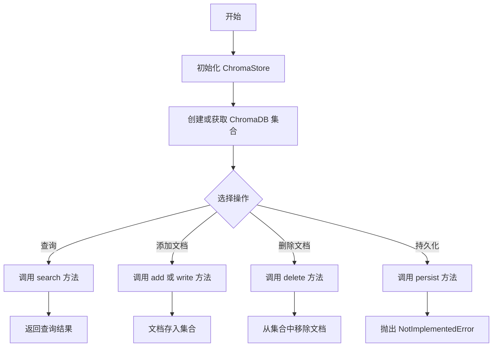
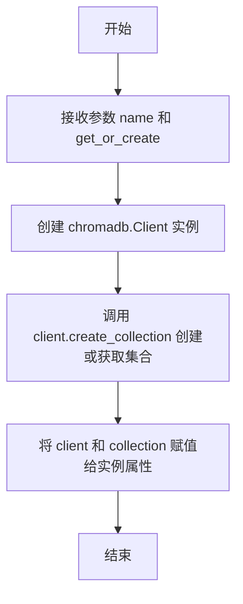
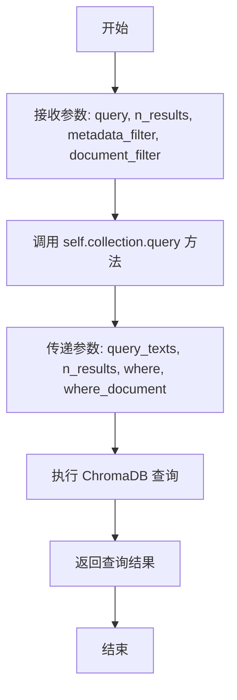
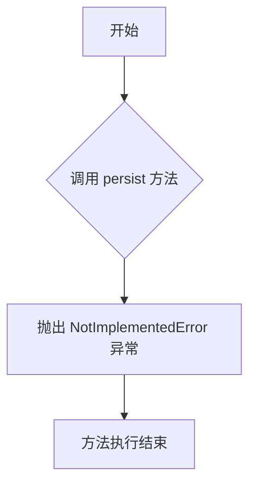
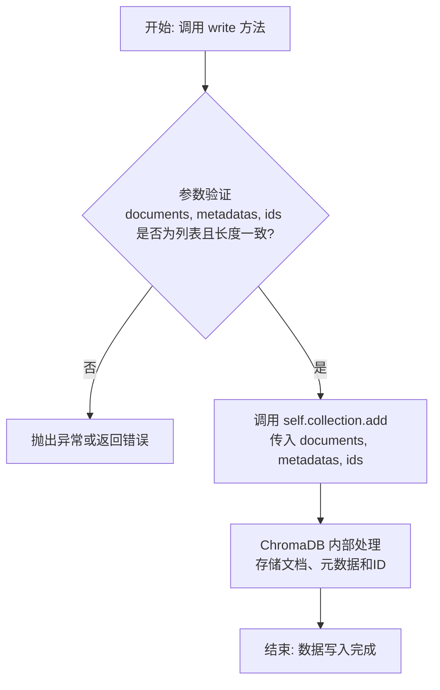

# `.\MetaGPT\metagpt\document_store\chromadb_store.py` 详细设计文档

该代码实现了一个基于 ChromaDB 的向量存储客户端类，用于创建和管理文档集合，支持文档的添加、查询、删除等基本操作，为上层应用提供简单的向量检索功能。

## 整体流程



## 类结构

```
ChromaStore
├── __init__
├── search
├── persist
├── write
├── add
└── delete
```

## 全局变量及字段


### `ChromaStore.client`
    
ChromaDB客户端实例，用于与向量数据库进行通信和操作。

类型：`chromadb.Client`
    


### `ChromaStore.collection`
    
ChromaDB集合实例，代表一个具体的向量数据集合，用于执行查询、添加、删除等操作。

类型：`chromadb.Collection`
    
    

## 全局函数及方法

### `ChromaStore.__init__`

初始化 `ChromaStore` 类的实例，创建一个 ChromaDB 客户端并建立或获取一个指定名称的集合（collection）。

参数：

- `name`：`str`，要创建或获取的集合的名称。
- `get_or_create`：`bool`，默认为 `False`。如果为 `True`，当集合不存在时会创建它；如果为 `False`，则仅在集合存在时获取它，否则可能引发异常。

返回值：`None`，此方法为构造函数，不返回任何值。

#### 流程图



#### 带注释源码

```python
def __init__(self, name: str, get_or_create: bool = False):
    # 创建一个 ChromaDB 客户端实例
    client = chromadb.Client()
    # 使用客户端创建或获取一个指定名称的集合
    # get_or_create 参数控制集合不存在时的行为
    collection = client.create_collection(name, get_or_create=get_or_create)
    # 将客户端和集合保存为实例属性，供其他方法使用
    self.client = client
    self.collection = collection
```

### `ChromaStore.search`

该方法用于在 ChromaDB 集合中执行语义搜索，根据查询文本、结果数量以及可选的元数据和文档过滤器来检索最相关的文档。

参数：

- `query`：`str`，查询文本，用于在集合中搜索相关文档。
- `n_results`：`int`，可选，默认值为 2，指定返回的搜索结果数量。
- `metadata_filter`：`dict`，可选，用于根据文档的元数据字段进行过滤的字典。
- `document_filter`：`dict`，可选，用于根据文档内容进行过滤的字典。

返回值：`dict`，返回一个字典，包含查询结果，通常包括匹配的文档、元数据、距离（相似度分数）和 ID 等信息。

#### 流程图



#### 带注释源码

```python
def search(self, query, n_results=2, metadata_filter=None, document_filter=None):
    # kwargs can be used for optional filtering
    # 调用 ChromaDB 集合的 query 方法执行搜索
    results = self.collection.query(
        query_texts=[query],          # 查询文本列表，这里将单个查询包装成列表
        n_results=n_results,          # 指定返回的搜索结果数量
        where=metadata_filter,        # 可选的元数据过滤器，用于筛选特定元数据的文档
        where_document=document_filter, # 可选的文档内容过滤器，用于筛选包含特定内容的文档
    )
    return results  # 返回查询结果，通常是一个包含文档、元数据、距离和ID的字典
```


### `ChromaStore.persist`

该方法旨在实现 ChromaDB 存储的持久化操作，但当前版本仅作为占位符存在，明确表示 ChromaDB 官方推荐使用服务器模式而非本地持久化，因此直接抛出 `NotImplementedError` 异常。

参数：
- 无

返回值：`None`，该方法不返回任何值，而是直接抛出异常。

#### 流程图



#### 带注释源码

```python
def persist(self):
    """Chroma recommends using server mode and not persisting locally."""
    # 该方法当前未实现任何持久化逻辑。
    # 根据 ChromaDB 的官方建议，推荐使用其服务器模式进行数据管理，
    # 而非在客户端进行本地文件持久化。因此，当调用此方法时，
    # 会直接抛出一个 NotImplementedError 异常，提示开发者此功能不可用。
    raise NotImplementedError
```


### `ChromaStore.write`

该方法用于向 ChromaDB 集合中批量写入文档及其关联的元数据和唯一标识符。它是对底层 `chromadb.Collection.add` 方法的封装，适用于需要一次性添加多个文档的场景。

参数：

- `documents`：`list`，一个包含多个文档文本的列表。
- `metadatas`：`list`，一个包含多个元数据字典的列表，每个字典对应一个文档的元信息。
- `ids`：`list`，一个包含多个唯一标识符的列表，每个标识符对应一个文档。

返回值：`None`，该方法不直接返回数据，而是将数据写入底层的 ChromaDB 集合。底层 `collection.add` 方法可能返回一个空值或操作状态。

#### 流程图



#### 带注释源码

```python
def write(self, documents, metadatas, ids):
    # 此方法类似于 add()，但它用于更通用的批量更新操作
    # 它假设您传入的是文档列表、元数据列表和ID列表
    return self.collection.add(
        documents=documents,   # 将文档列表传递给底层集合
        metadatas=metadatas,   # 将元数据列表传递给底层集合
        ids=ids,               # 将ID列表传递给底层集合
    )
```

### `ChromaStore.add`

该方法用于向ChromaDB集合中添加单个文档及其元数据，并分配唯一标识符。

参数：

- `document`：`str`，要添加的单个文档内容
- `metadata`：`dict`，与文档关联的元数据信息
- `_id`：`str`，文档的唯一标识符

返回值：`None`，该方法不返回任何值，直接调用底层ChromaDB的add方法

#### 流程图

```mermaid
graph TD
    A[开始: ChromaStore.add] --> B[接收参数: document, metadata, _id]
    B --> C[将单个参数包装为列表]
    C --> D[调用self.collection.add<br/>documents=[document]<br/>metadatas=[metadata]<br/>ids=[_id]]
    D --> E[结束]
```

#### 带注释源码

```python
def add(self, document, metadata, _id):
    # This function is for adding individual documents
    # It assumes you're passing in a single doc, metadata, and id
    return self.collection.add(
        documents=[document],      # 将单个文档包装为列表
        metadatas=[metadata],      # 将单个元数据包装为列表
        ids=[_id],                 # 将单个ID包装为列表
    )
```


### `ChromaStore.delete`

该方法用于从ChromaDB集合中删除指定ID的文档。

参数：

- `_id`：`str`，要删除的文档的唯一标识符

返回值：`None`，该方法不返回任何值，但会从集合中删除指定的文档

#### 流程图

```mermaid
graph TD
    A[开始] --> B[接收文档ID _id]
    B --> C[调用 self.collection.delete<br/>传入列表 [_id]]
    C --> D[ChromaDB内部执行删除操作]
    D --> E[结束]
```

#### 带注释源码

```python
def delete(self, _id):
    # 调用底层ChromaDB集合的delete方法，传入包含单个ID的列表
    # 该方法会从集合中移除与给定ID匹配的文档
    return self.collection.delete([_id])
```


## 关键组件


### ChromaDB 客户端与集合管理

封装了 ChromaDB 客户端（`chromadb.Client`）的初始化和集合（`chromadb.Collection`）的创建与获取逻辑，是进行所有向量存储操作的基础。

### 向量相似性搜索

提供基于查询文本的向量相似性搜索功能，支持通过 `n_results` 参数控制返回结果数量，并可通过 `metadata_filter` 和 `document_filter` 进行元数据和文档内容的过滤。

### 文档写入与更新

提供两种层级的文档写入接口：`add` 方法用于添加单个文档及其元数据，`write` 方法用于批量添加文档列表、元数据列表和ID列表，支持数据的初始化和批量更新。

### 文档删除

提供基于文档ID的删除功能，用于从集合中移除指定的文档。

### 持久化接口（占位）

定义了 `persist` 方法作为持久化操作的接口，但目前仅抛出 `NotImplementedError`，表明本地持久化功能尚未实现，遵循了 ChromaDB 官方推荐的使用服务端模式的建议。


## 问题及建议


### 已知问题

-   **客户端初始化方式单一且不可配置**：`__init__` 方法中直接使用 `chromadb.Client()` 进行初始化，没有提供任何配置选项（如主机地址、端口、认证信息等）。这导致代码只能连接到默认的本地 ChromaDB 实例，无法适配远程服务器或进行自定义配置，极大地限制了部署灵活性。
-   **缺乏持久化支持**：`persist` 方法直接抛出 `NotImplementedError` 异常。根据注释，ChromaDB 推荐使用服务器模式而非本地持久化，但当前实现完全没有提供任何持久化方案。如果客户端进程重启，所有存储在内存中的数据将会丢失，这对于生产环境是不可接受的。
-   **错误处理机制缺失**：代码中没有对 ChromaDB 客户端操作（如 `create_collection`, `add`, `query`, `delete`）进行任何异常捕获和处理。网络问题、服务不可用、无效参数或重复ID等都会导致未处理的异常向上层传播，使得程序健壮性差。
-   **资源管理不当**：`__init__` 方法创建了 `chromadb.Client` 实例，但类没有提供 `close` 或 `__del__` 方法来显式关闭客户端连接。在长期运行或频繁创建 `ChromaStore` 实例的场景下，可能会导致连接泄漏或资源未正确释放。
-   **`write` 与 `add` 方法功能重叠且命名不清晰**：`write` 方法用于批量写入，`add` 方法用于单条写入。两者功能高度重叠，`add` 完全可以作为 `write` 的一个特例（列表长度为1）来实现。同时，`write` 这个名字过于通用，未能清晰表达其“批量添加”的语义。
-   **搜索结果返回格式未封装**：`search` 方法直接返回 ChromaDB 原生的 `query` 方法结果。这个结果是一个复杂的字典结构，包含了 `ids`、`documents`、`metadatas`、`distances` 等多个键。上层调用者需要了解 ChromaDB 的具体响应格式，增加了耦合度。

### 优化建议

-   **重构客户端初始化，支持灵活配置**：修改 `__init__` 方法，接受一个可选的 `client` 参数或配置字典。允许传入一个已配置好的 `chromadb.Client` 实例，或者通过参数来指定连接地址、设置等。这样可以支持连接远程 ChromaDB 服务器、使用持久化客户端或进行其他自定义。
-   **实现或明确持久化策略**：如果确定使用 ChromaDB 的服务器模式，应移除 `persist` 方法或将其改为一个提示性的方法（例如记录日志）。同时，在文档或 `__init__` 中明确说明数据持久化依赖于后端 ChromaDB 服务的配置。如果支持本地模式，则需要实现正确的持久化逻辑。
-   **增加全面的异常处理**：在所有与 ChromaDB 交互的方法（`__init__`, `search`, `write`, `add`, `delete`）中，使用 `try-except` 块捕获 `chromadb` 可能抛出的异常（如 `chromadb.errors.*`），并转换为更友好的业务异常或进行日志记录和错误恢复，避免程序因底层存储问题而崩溃。
-   **实现上下文管理器或显式关闭方法**：为 `ChromaStore` 类实现 `__enter__` 和 `__exit__` 方法，使其支持 `with` 语句，确保连接在使用后能被正确关闭。或者，至少提供一个 `close()` 方法，并在文档中强调调用者在使用完毕后需要调用它来清理资源。
-   **重构数据写入接口，统一并清晰命名**：考虑将 `add` 方法作为 `write` 方法的便捷封装。可以保留 `add` 但内部调用 `write`。或者，将方法重命名为更具表达性的名字，例如 `insert_one` 和 `insert_many`，使其意图一目了然。
-   **封装搜索结果，提供领域对象**：在 `search` 方法内部，将 ChromaDB 返回的原始字典解析并封装成一个自定义的 `SearchResult` 类或简单的命名元组（`namedtuple`）。这个类可以包含 `id`, `document`, `metadata`, `score` 等属性。这样将内部数据表示与外部接口解耦，提高代码的可维护性和易用性。
-   **增加类型注解和文档字符串的完整性**：为类方法和函数参数补充更详细的类型注解（例如 `documents: List[str]`）。同时，完善 `search`、`write`、`add` 等方法的文档字符串，说明参数的具体期望格式、返回值的结构以及可能抛出的异常。
-   **考虑添加集合存在性检查**：在 `__init__` 中，如果 `get_or_create` 为 `False` 但集合已存在，或者为 `True` 但创建过程失败，当前逻辑可能不够健壮。可以增加更明确的检查或状态反馈机制。


## 其它


### 设计目标与约束

1.  **设计目标**：
    *   提供一个轻量级、面向对象的接口，用于与ChromaDB向量数据库进行交互，封装底层API调用。
    *   支持核心的向量存储操作，包括创建集合、添加/写入文档、基于文本查询相似文档以及删除文档。
    *   保持代码简洁，避免引入不必要的依赖或复杂的抽象，以解决当前因继承`BaseStore`或导入其他模块导致的异常问题。

2.  **设计约束**：
    *   **兼容性约束**：由于未知的兼容性问题，当前类不能继承自项目中原有的`BaseStore`基类或导入`metagpt`的其他模块。
    *   **持久化约束**：根据ChromaDB官方建议，本地持久化模式不被推荐，因此`persist`方法仅抛出`NotImplementedError`作为占位符，实际持久化需依赖ChromaDB的Server模式。
    *   **功能范围约束**：当前实现聚焦于单机客户端模式下的基本CRUD操作，不涉及分布式、高级索引管理、复杂条件查询（如基于向量距离的范围查询）或数据更新（`update`）功能。

### 错误处理与异常设计

1.  **显式异常**：
    *   `persist`方法明确抛出`NotImplementedError`，以指示该功能在当前设计约束下不可用，引导用户使用Server模式。
2.  **隐式异常传播**：
    *   类中绝大多数方法（如`__init__`, `search`, `write`, `add`, `delete`）未包含显式的`try-except`块。这意味着ChromaDB客户端库（`chromadb`）可能抛出的各种异常（如连接错误、参数验证错误、查询语法错误等）将直接传递给调用者。调用方需要负责捕获和处理这些异常。
3.  **错误处理建议**：
    *   调用代码应预期并处理`chromadb`可能引发的异常，例如`chromadb.errors.InvalidDimensionException`、`chromadb.errors.DuplicateIDError`等。
    *   对于`add`和`write`方法，建议调用者确保`ids`的唯一性，否则可能引发重复ID错误。

### 数据流与状态机

1.  **主要数据流**：
    *   **初始化流程**：输入集合名称 -> 创建ChromaDB客户端 -> 创建或获取集合 -> 初始化`self.client`和`self.collection`。
    *   **写入流程**：输入文档、元数据、ID -> 调用`add`（单条）或`write`（批量） -> 委托给`self.collection.add` -> 数据存入ChromaDB集合。
    *   **查询流程**：输入查询文本、结果数量、过滤条件 -> 调用`search` -> 委托给`self.collection.query` -> 返回包含匹配文档、元数据、ID和距离的结果字典。
    *   **删除流程**：输入文档ID -> 调用`delete` -> 委托给`self.collection.delete` -> 从集合中移除指定ID的文档。
2.  **状态机**：
    *   类的状态相对简单，主要由`self.client`（ChromaDB客户端连接）和`self.collection`（当前操作的集合对象）两个内部状态构成。
    *   生命周期：对象创建后即进入“就绪”状态，可执行所有操作。当`self.client`连接失效或`self.collection`被意外关闭时，对象进入“失效”状态，后续操作将失败。当前代码未提供状态检查或重连机制。

### 外部依赖与接口契约

1.  **外部依赖**：
    *   **核心依赖**：`chromadb`库。这是与ChromaDB向量数据库交互的唯一必需第三方库。版本兼容性未在代码中指定。
    *   **无其他项目模块依赖**：由于设计约束，刻意避免了从本项目（如`metagpt`）内部导入任何其他模块。
2.  **接口契约**：
    *   **`__init__(name: str, get_or_create: bool = False)`**：
        *   契约：根据给定的`name`创建或获取一个ChromaDB集合。`get_or_create`为`True`时，如果集合已存在则获取，否则创建。
        *   前置条件：`chromadb`库已正确安装；ChromaDB服务可访问（若为Server模式）或本地环境正常（若为嵌入式模式）。
    *   **`search(query, n_results=2, metadata_filter=None, document_filter=None)`**：
        *   契约：在集合中执行相似性搜索。`metadata_filter`和`document_filter`用于对结果进行筛选。
        *   前置条件：集合已成功初始化且包含数据；`query`应为字符串。
    *   **`write(documents, metadatas, ids)`** 与 **`add(document, metadata, _id)`**：
        *   契约：向集合中添加文档。`write`用于批量添加，`add`用于单条添加。要求`documents`、`metadatas`、`ids`列表长度一致（对于`write`）或均为单值（对于`add`）。
        *   前置条件：`ids`在集合中应唯一（除非允许覆盖，但当前未体现）；`documents`应为字符串列表或字符串。
    *   **`delete(_id)`**：
        *   契约：从集合中删除指定`_id`的文档。
        *   前置条件：`_id`存在于集合中。
    *   **`persist()`**：
        *   契约：显式声明不支持。调用此方法将始终引发`NotImplementedError`。

    