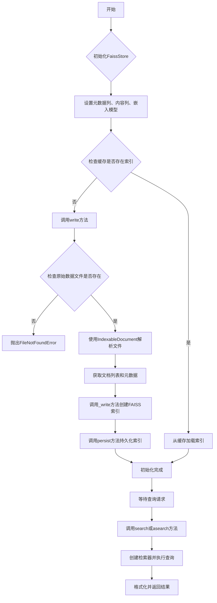
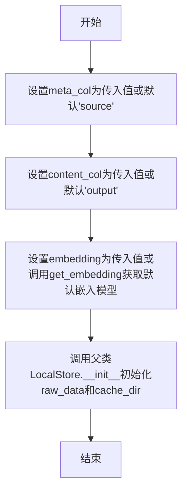
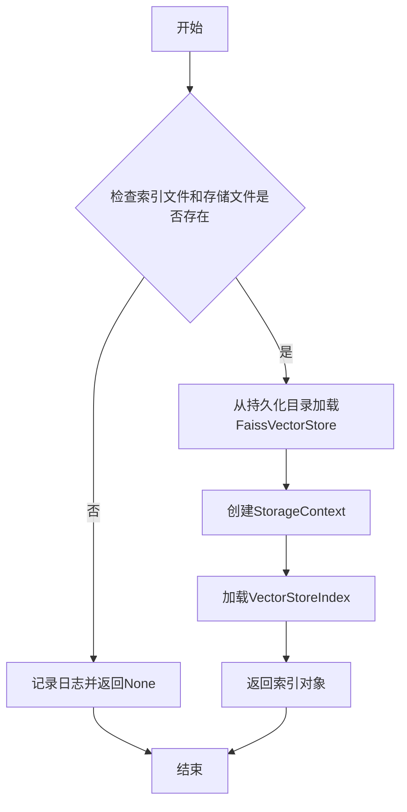
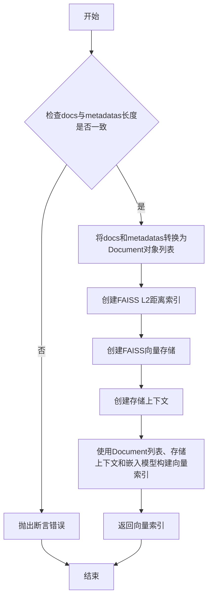
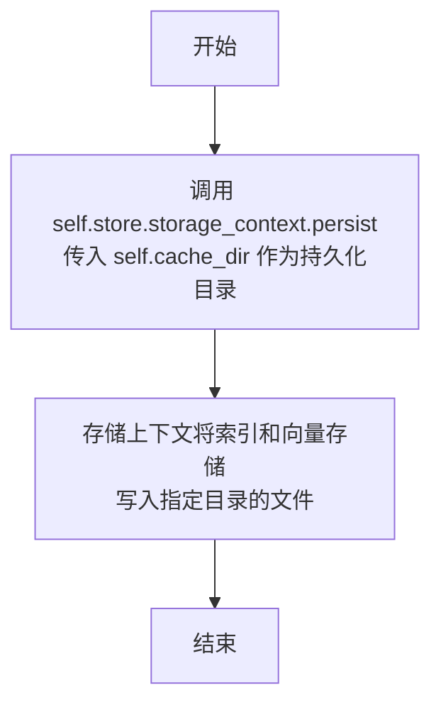
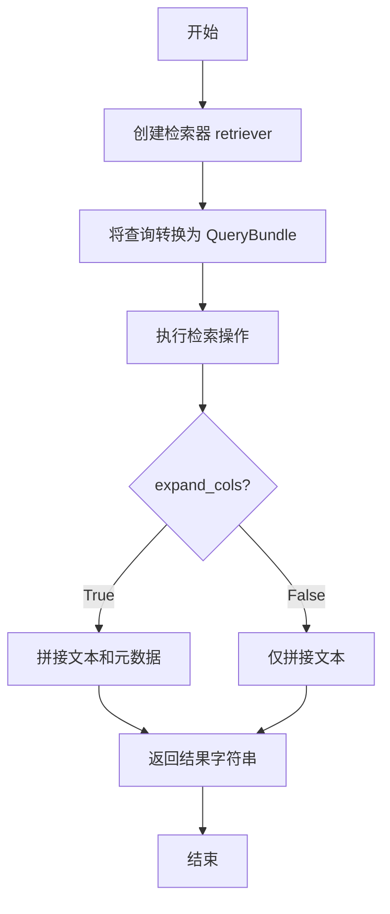
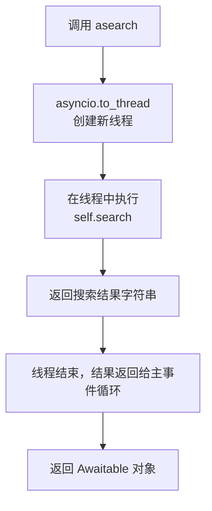
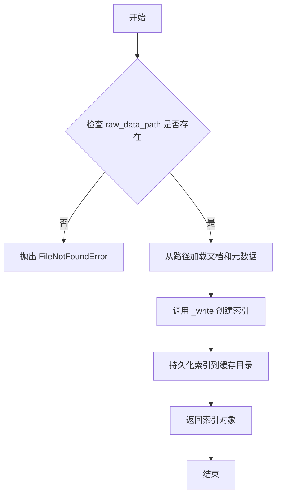
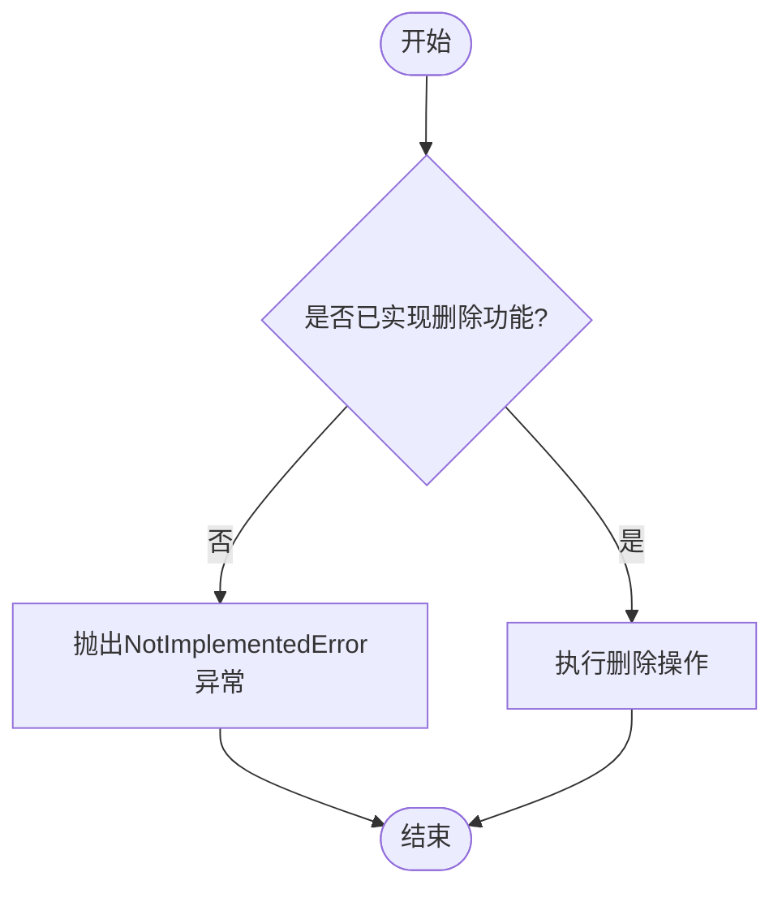

# `.\MetaGPT\metagpt\document_store\faiss_store.py` 详细设计文档

该代码实现了一个基于FAISS向量数据库的本地文档存储与检索系统。它继承自LocalStore，核心功能包括：从原始数据文件（如JSON/XLSX）构建向量索引、将索引持久化到本地缓存、支持基于语义相似度的文档检索（同步/异步）、以及向现有索引添加新文档。它封装了LlamaIndex和FAISS的底层操作，为上层应用提供了简单的文档管理接口。

## 整体流程



## 类结构

```
LocalStore (基类)
└── FaissStore (FAISS向量存储实现类)
```

## 全局变量及字段


### `FaissStore.meta_col`
    
用于指定文档元数据中表示来源的列名。

类型：`str`
    


### `FaissStore.content_col`
    
用于指定文档中表示实际文本内容的列名。

类型：`str`
    


### `FaissStore.embedding`
    
用于将文本转换为向量表示的嵌入模型实例。

类型：`BaseEmbedding`
    


### `FaissStore.store`
    
存储向量索引和文档数据的主要数据结构。

类型：`VectorStoreIndex`
    
    

## 全局函数及方法

### `FaissStore.__init__`

初始化FaissStore实例，设置元数据列、内容列、嵌入模型，并调用父类LocalStore的初始化方法。

参数：

- `raw_data`：`Path`，原始数据文件的路径
- `cache_dir`：`Any`，缓存目录，默认为None
- `meta_col`：`str`，元数据列名，默认为"source"
- `content_col`：`str`，内容列名，默认为"output"
- `embedding`：`BaseEmbedding`，嵌入模型实例，默认为None

返回值：`None`，无返回值

#### 流程图



#### 带注释源码

```python
def __init__(
    self, raw_data: Path, cache_dir=None, meta_col="source", content_col="output", embedding: BaseEmbedding = None
):
    # 设置元数据列名，默认为"source"
    self.meta_col = meta_col
    # 设置内容列名，默认为"output"
    self.content_col = content_col
    # 设置嵌入模型，如果未提供则使用默认嵌入模型
    self.embedding = embedding or get_embedding()
    # 初始化store属性，类型为VectorStoreIndex
    self.store: VectorStoreIndex
    # 调用父类LocalStore的初始化方法，传入raw_data和cache_dir
    super().__init__(raw_data, cache_dir)
```

### `FaissStore._load`

该方法负责从持久化存储中加载已存在的FAISS向量索引。它会检查索引文件和存储文件是否存在，如果存在则加载并返回`VectorStoreIndex`对象，否则返回`None`。

参数：

-  `self`：`FaissStore`，当前FaissStore实例

返回值：`Optional[VectorStoreIndex]`，加载成功的向量索引对象，如果加载失败则返回`None`

#### 流程图



#### 带注释源码

```python
def _load(self) -> Optional["VectorStoreIndex"]:
    # 获取索引文件和存储文件的路径
    index_file, store_file = self._get_index_and_store_fname()

    # 检查两个文件是否都存在
    if not (index_file.exists() and store_file.exists()):
        # 如果至少有一个文件不存在，记录日志并返回None
        logger.info("Missing at least one of index_file/store_file, load failed and return None")
        return None
    
    # 从持久化目录加载FaissVectorStore
    vector_store = FaissVectorStore.from_persist_dir(persist_dir=self.cache_dir)
    
    # 创建存储上下文，包含持久化目录和向量存储
    storage_context = StorageContext.from_defaults(persist_dir=self.cache_dir, vector_store=vector_store)
    
    # 从存储上下文加载索引，使用指定的嵌入模型
    index = load_index_from_storage(storage_context, embed_model=self.embedding)

    # 返回加载的索引对象
    return index
```

### `FaissStore._write`

该方法用于将一组文档及其元数据写入到FAISS向量存储中，并构建一个向量索引。

参数：

- `docs`：`list[str]`，包含文档文本内容的列表。
- `metadatas`：`list[dict[str, Any]]`，包含与每个文档对应的元数据字典的列表。

返回值：`VectorStoreIndex`，返回构建好的向量索引对象。

#### 流程图



#### 带注释源码

```python
def _write(self, docs: list[str], metadatas: list[dict[str, Any]]) -> VectorStoreIndex:
    # 1. 验证输入参数：确保文档列表和元数据列表长度一致
    assert len(docs) == len(metadatas)
    
    # 2. 数据转换：将文档文本和元数据组合成LlamaIndex的Document对象列表
    documents = [Document(text=doc, metadata=metadatas[idx]) for idx, doc in enumerate(docs)]

    # 3. 初始化FAISS向量存储：创建一个使用L2距离的FAISS平面索引
    vector_store = FaissVectorStore(faiss_index=faiss.IndexFlatL2(1536))
    
    # 4. 创建存储上下文：将向量存储包装到存储上下文中
    storage_context = StorageContext.from_defaults(vector_store=vector_store)
    
    # 5. 构建向量索引：使用Document列表、存储上下文和嵌入模型创建向量索引
    index = VectorStoreIndex.from_documents(
        documents=documents, storage_context=storage_context, embed_model=self.embedding
    )

    # 6. 返回结果：返回构建好的向量索引
    return index
```

### `FaissStore.persist`

该方法用于将当前向量索引（`VectorStoreIndex`）及其关联的存储上下文（`StorageContext`）持久化到本地磁盘的缓存目录中。它不执行任何数据转换或索引构建，仅负责将内存中的索引状态保存到文件。

参数：
-  `self`：`FaissStore`，`FaissStore`类的实例，包含需要持久化的`store`属性。

返回值：`None`，该方法没有返回值。

#### 流程图



#### 带注释源码

```python
def persist(self):
    # 调用当前存储对象（self.store）的存储上下文（storage_context）的persist方法。
    # 该方法将向量索引和相关的存储结构序列化并保存到self.cache_dir指定的目录中。
    self.store.storage_context.persist(self.cache_dir)
```

### `FaissStore.search`

该方法用于在Faiss向量存储中执行相似性搜索。它接收一个查询字符串，通过嵌入模型将其转换为向量，然后在索引中查找最相似的k个文档。根据参数`expand_cols`的值，返回结果可以仅包含文档文本，或同时包含文本和元数据。

参数：

- `query`：`str`，查询字符串，用于在向量存储中搜索相似文档。
- `expand_cols`：`bool`，默认为`False`，控制返回结果是否包含元数据。若为`True`，则返回文本和元数据；否则仅返回文本。
- `sep`：`str`，默认为`"\n"`，用于分隔多个返回结果的字符串。
- `*args`：可变位置参数，当前未使用，保留用于未来扩展。
- `k`：`int`，默认为`5`，指定返回的相似文档数量。
- `**kwargs`：可变关键字参数，当前未使用，保留用于未来扩展。

返回值：`str`，返回一个字符串，其中包含搜索到的文档文本（或文本与元数据），多个结果之间用`sep`分隔。

#### 流程图



#### 带注释源码

```python
def search(self, query: str, expand_cols=False, sep="\n", *args, k=5, **kwargs):
    # 创建检索器，设置返回的相似文档数量为k
    retriever = self.store.as_retriever(similarity_top_k=k)
    
    # 将查询字符串转换为QueryBundle，包含查询文本和其嵌入向量
    rsp = retriever.retrieve(QueryBundle(query_str=query, embedding=self.embedding.get_text_embedding(query)))
    
    # 记录检索结果，用于调试
    logger.debug(rsp)
    
    # 根据expand_cols参数决定返回格式
    if expand_cols:
        # 若expand_cols为True，返回文本和元数据的组合字符串
        return str(sep.join([f"{x.node.text}: {x.node.metadata}" for x in rsp]))
    else:
        # 若expand_cols为False，仅返回文本字符串
        return str(sep.join([f"{x.node.text}" for x in rsp]))
```

### `FaissStore.asearch`

`FaissStore.asearch` 是 `FaissStore` 类的异步搜索方法。它通过将同步的 `search` 方法包装到异步线程中，实现了对向量存储的异步查询功能。该方法接受与 `search` 方法相同的参数，并返回相同的搜索结果，但以异步方式执行，避免阻塞主事件循环。

参数：

-  `*args`：`tuple`，可变位置参数，将传递给底层的同步 `search` 方法。
-  `**kwargs`：`dict`，可变关键字参数，将传递给底层的同步 `search` 方法。

返回值：`Awaitable[Any]`，一个可等待对象，其最终结果与同步 `search` 方法的返回值相同，即一个格式化的搜索结果字符串。

#### 流程图



#### 带注释源码

```python
async def asearch(self, *args, **kwargs):
    # 使用 asyncio.to_thread 将同步的 self.search 方法放入一个单独的线程中执行
    # 这允许同步的 I/O 操作（如向量搜索）在异步环境中运行而不阻塞事件循环
    # *args 和 **kwargs 被原样传递给 self.search 方法
    return await asyncio.to_thread(self.search, *args, **kwargs)
```

### `FaissStore.write`

该方法用于初始化基于用户提供的文档文件（如JSON、XLSX等）的索引和向量库。它首先检查原始数据文件是否存在，然后使用`IndexableDocument`从文件路径加载文档和元数据，接着调用内部`_write`方法创建向量存储索引，最后持久化索引到缓存目录并返回索引对象。

参数：
- 无显式参数，但依赖于实例属性`self.raw_data_path`、`self.content_col`、`self.meta_col`。

返回值：`VectorStoreIndex`，返回创建的向量存储索引对象。

#### 流程图



#### 带注释源码

```python
def write(self):
    """Initialize the index and library based on the Document (JSON / XLSX, etc.) file provided by the user."""
    # 检查原始数据文件是否存在，若不存在则抛出异常
    if not self.raw_data_path.exists():
        raise FileNotFoundError
    # 使用 IndexableDocument 从文件路径加载文档，指定内容列和元数据列
    doc = IndexableDocument.from_path(self.raw_data_path, self.content_col, self.meta_col)
    # 获取文档内容和对应的元数据列表
    docs, metadatas = doc.get_docs_and_metadatas()

    # 调用内部 _write 方法，传入文档和元数据创建向量存储索引
    self.store = self._write(docs, metadatas)
    # 将创建的索引持久化到缓存目录
    self.persist()
    # 返回创建的向量存储索引对象
    return self.store
```

### `FaissStore.add`

该方法用于向Faiss向量存储中添加新的文本节点。它接收一个文本列表，为每个文本生成嵌入向量，创建对应的`TextNode`对象，并将这些节点插入到现有的向量索引中。目前，该方法存在一个已知问题：添加节点后，存储（持久化文件）不会自动更新。

参数：

- `texts`：`list[str]`，要添加到向量存储中的文本列表
- `*args`：可变位置参数，当前未使用
- `**kwargs`：可变关键字参数，当前未使用

返回值：`list[str]`，始终返回空列表（当前实现中未返回实际添加的节点ID或其他信息）

#### 流程图

```mermaid
flowchart TD
    A[开始: add(texts)] --> B[批量生成文本嵌入向量]
    B --> C[为每个文本创建TextNode]
    C --> D[将节点插入向量索引]
    D --> E[返回空列表]
    E --> F[结束]
```

#### 带注释源码

```python
def add(self, texts: list[str], *args, **kwargs) -> list[str]:
    """FIXME: Currently, the store is not updated after adding."""
    # 批量生成文本的嵌入向量
    texts_embeds = self.embedding.get_text_embedding_batch(texts)
    
    # 为每个文本和对应的嵌入向量创建TextNode对象
    nodes = [TextNode(text=texts[idx], embedding=embed) for idx, embed in enumerate(texts_embeds)]
    
    # 将创建的节点插入到向量索引中
    self.store.insert_nodes(nodes)

    # 返回空列表（当前实现中未返回实际添加的节点ID）
    return []
```

### `FaissStore.delete`

该方法旨在从FAISS向量存储中删除文档或节点，但目前尚未实现，因为底层的FAISS库没有提供直接的删除接口。

参数：

- `*args`：`Any`，可变位置参数，当前未使用
- `**kwargs`：`Any`，可变关键字参数，当前未使用

返回值：`None`，该方法不返回任何值，但会抛出`NotImplementedError`异常

#### 流程图



#### 带注释源码

```python
def delete(self, *args, **kwargs):
    """Currently, faiss does not provide a delete interface."""
    raise NotImplementedError
```

## 关键组件


### Faiss向量存储

基于Faiss库实现的高效向量相似性搜索组件，用于存储和检索文档的向量化表示。

### LlamaIndex集成

利用LlamaIndex框架进行文档索引、向量化、存储和检索的抽象层，提供了高级的文档管理接口。

### 异步搜索支持

通过`asyncio.to_thread`实现的异步搜索功能，允许在非阻塞模式下执行耗时的向量相似性查询。

### 持久化存储

支持将向量索引和元数据持久化到本地文件系统，以便在程序重启后快速恢复索引状态。

### 文档加载与处理

从原始数据文件（如JSON/XLSX）加载文档，提取文本内容和元数据，并转换为LlamaIndex可处理的格式。

### 嵌入模型集成

集成外部嵌入模型（如OpenAI Embeddings）用于将文本转换为向量表示，支持自定义嵌入模型配置。

### 索引管理

提供索引的创建、加载、更新和持久化功能，支持增量添加文档到现有索引。


## 问题及建议


### 已知问题

-   **`add` 方法功能不完整**：`add` 方法的文档字符串明确指出“目前，添加后存储未更新”，这意味着新添加的节点（文本）没有被持久化到磁盘。调用 `add` 后，如果程序重启，新增内容将会丢失。
-   **`delete` 方法未实现**：`delete` 方法直接抛出 `NotImplementedError`，表明该向量存储目前不支持删除操作。这是一个重要的功能缺失，限制了数据管理的灵活性。
-   **硬编码的向量维度**：在 `_write` 方法中，创建 FAISS 索引时使用了固定的维度 `1536` (`faiss.IndexFlatL2(1536)`)。这假设嵌入模型输出的向量维度始终为 1536，缺乏灵活性，如果更换嵌入模型，此处代码需要同步修改。
-   **异步搜索的潜在性能瓶颈**：`asearch` 方法使用 `asyncio.to_thread` 将同步的 `search` 方法放入线程池执行。虽然这避免了阻塞事件循环，但如果 `search` 操作本身是 CPU 密集型或涉及大量 I/O，线程池可能成为瓶颈，且错误处理和上下文管理不如原生异步清晰。
-   **错误处理不完善**：`write` 方法在文件不存在时抛出 `FileNotFoundError`，但其他方法（如 `_load`, `_write`）中的潜在异常（如文件读写错误、FAISS 操作失败）没有被显式捕获和处理，可能导致程序意外崩溃。
-   **索引加载逻辑可能不一致**：`_load` 方法从缓存目录加载索引和存储上下文。如果缓存目录中存在旧的或不完整的索引文件，加载过程可能失败或产生不一致的状态，但当前逻辑仅在文件不存在时返回 `None`，对其他错误情况处理不足。

### 优化建议

-   **完善 `add` 方法的持久化**：在 `add` 方法中插入节点后，应调用 `self.persist()` 方法将更新后的索引持久化到磁盘，确保数据不会丢失。同时，考虑批量添加的性能，可以设计一个缓冲区或提供显式的 `save` 方法。
-   **实现或规划 `delete` 方法**：需要调研 FAISS 或 `llama-index` 的 `FaissVectorStore` 是否支持删除操作。如果不支持，可以考虑使用标记删除（软删除）或定期重建索引的策略作为替代方案，并在文档中明确说明。
-   **使向量维度可配置化**：将 FAISS 索引的维度作为类初始化参数（如 `embedding_dim`），或者从 `self.embedding` 对象中动态获取其输出维度（如果接口支持），以提高代码的适应性和可维护性。
-   **评估并优化异步策略**：如果搜索性能是关键，可以考虑使用真正的异步数据库驱动或向量库。如果当前方案足够，建议在 `asearch` 方法中添加更详细的日志和错误处理，将线程池中的异常传播回异步上下文。
-   **增强错误处理与健壮性**：
    -   在 `_load` 和 `_write` 等关键方法中使用 `try-except` 块，捕获并记录可能出现的异常（如 `IOError`, `faiss.FaissException`），提供更友好的错误信息或回退行为。
    -   在 `write` 方法中，验证 `raw_data_path` 的文件格式是否被 `IndexableDocument.from_path` 支持，可以提前抛出更有意义的异常。
-   **改进索引状态管理**：在 `_load` 方法中，可以增加对加载到的 `index` 对象的基本健康检查。考虑在类中引入一个状态标志，明确指示存储是已加载、已修改未保存还是空状态。
-   **代码清晰度与文档**：
    -   `add` 方法的返回值是空列表 `[]`，其意义不明。应明确其设计意图（例如，返回添加的节点ID），或修改为返回 `None` 并更新文档。
    -   为类和方法添加更详细的类型注解（例如，`search` 方法中 `*args, **kwargs` 的具体用途）。
    -   考虑将 `FaissVectorStore` 的初始化参数（如 `faiss_index` 的配置）暴露给 `FaissStore` 的构造函数，以提供更高级的定制能力。


## 其它


### 设计目标与约束

本模块旨在提供一个基于FAISS向量数据库的本地文档存储与检索解决方案。核心设计目标包括：1) 封装FAISS和LlamaIndex的复杂性，提供简洁的文档写入、持久化、检索接口；2) 支持同步和异步检索操作；3) 能够从结构化文件（如JSON/XLSX）初始化索引。主要约束包括：1) 依赖`llama-index`和`faiss`第三方库；2) 当前版本不支持文档的删除操作；3) `add`方法存在已知问题，添加文档后索引未正确持久化更新。

### 错误处理与异常设计

模块中的错误处理主要包括：1) 在`_load`方法中，当持久化文件缺失时，记录日志并返回`None`，由调用方决定后续行为（如重新构建索引）。2) 在`write`方法中，如果用户提供的原始数据文件不存在，直接抛出`FileNotFoundError`异常。3) 在`delete`方法中，由于FAISS未提供删除接口，直接抛出`NotImplementedError`异常。整体错误处理策略偏向于“快速失败”，在关键依赖缺失或功能未实现时明确报错，但在索引加载等可恢复场景下则采用柔性处理（返回None并记录日志）。

### 数据流与状态机

模块的核心数据流始于用户提供的原始数据文件（`raw_data`）。通过`write`方法，数据被`IndexableDocument`解析为文档列表和元数据列表，进而调用`_write`方法创建初始的`VectorStoreIndex`并持久化到缓存目录。此后，系统进入可检索状态。`search`/`asearch`方法接受查询字符串，利用已构建的索引进行相似性检索并返回结果。`add`方法旨在实现增量更新，但当前存在缺陷，添加节点后未触发索引的重新持久化，导致更改可能丢失。模块没有复杂的状态转换，主要状态为“未初始化”和“已初始化/可检索”。

### 外部依赖与接口契约

1.  **核心库依赖**：
    *   `faiss`: 用于构建和操作高效的向量索引（此处使用`IndexFlatL2`）。
    *   `llama-index-core` 及 `llama-index-vector-stores-faiss`: 提供高层级的文档索引、存储上下文管理、检索器抽象以及与FAISS集成的`FaissVectorStore`。
2.  **项目内部依赖**：
    *   `metagpt.document.IndexableDocument`: 契约要求提供`from_path`类方法和`get_docs_and_metadatas`实例方法，用于从文件路径解析内容。
    *   `metagpt.document_store.base_store.LocalStore`: 作为基类，定义了`raw_data`, `cache_dir`等属性及`_load`, `_write`等抽象方法的契约。
    *   `metagpt.utils.embedding.get_embedding`: 契约要求返回一个`BaseEmbedding`实例，用于文本向量化。
3.  **接口契约**：
    *   继承自`LocalStore`，需实现其定义的抽象方法（`_load`, `_write`, `write`, `add`, `delete`, `search`）。
    *   `search`方法需支持`k`（返回结果数量）、`expand_cols`（是否扩展元数据）、`sep`（结果分隔符）等参数。

    