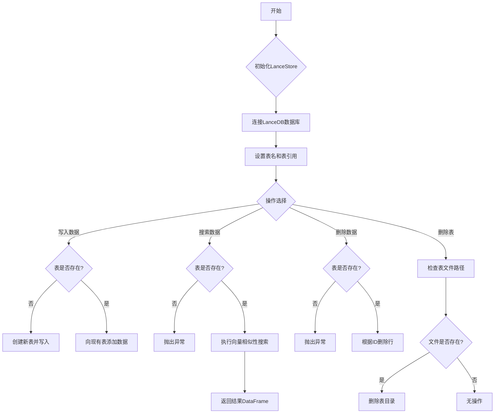
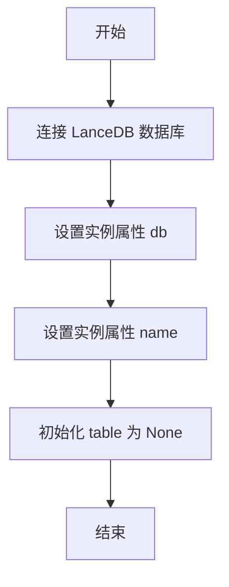
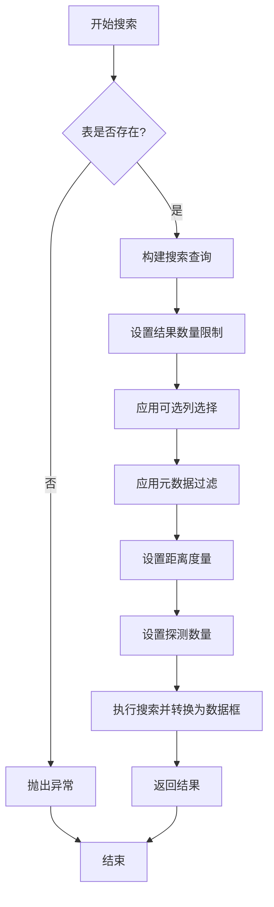
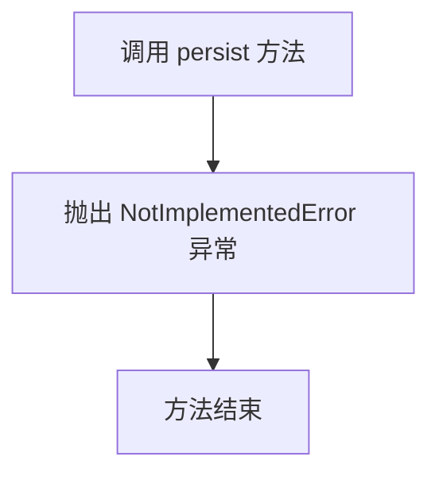
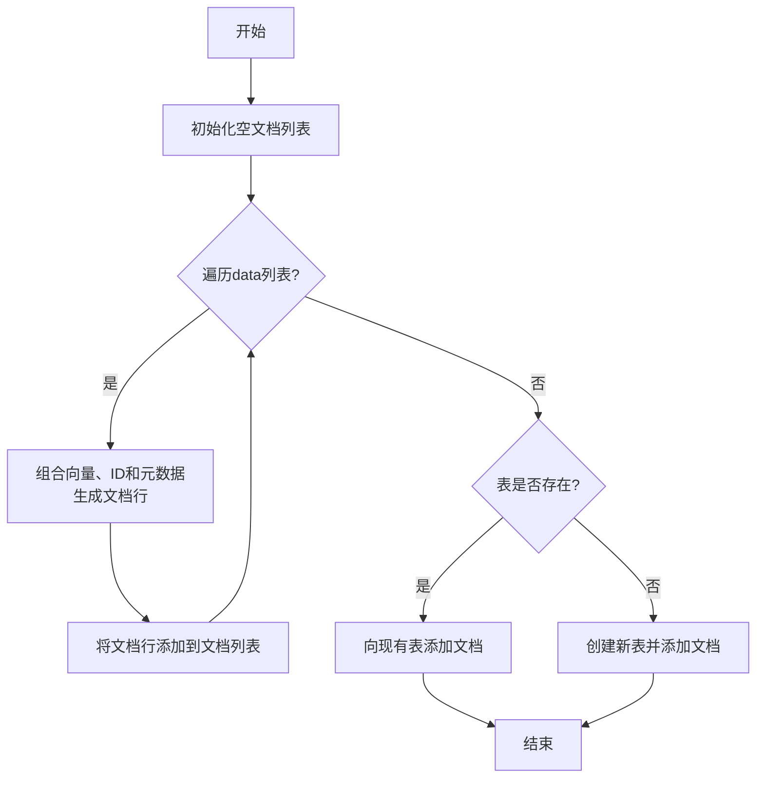
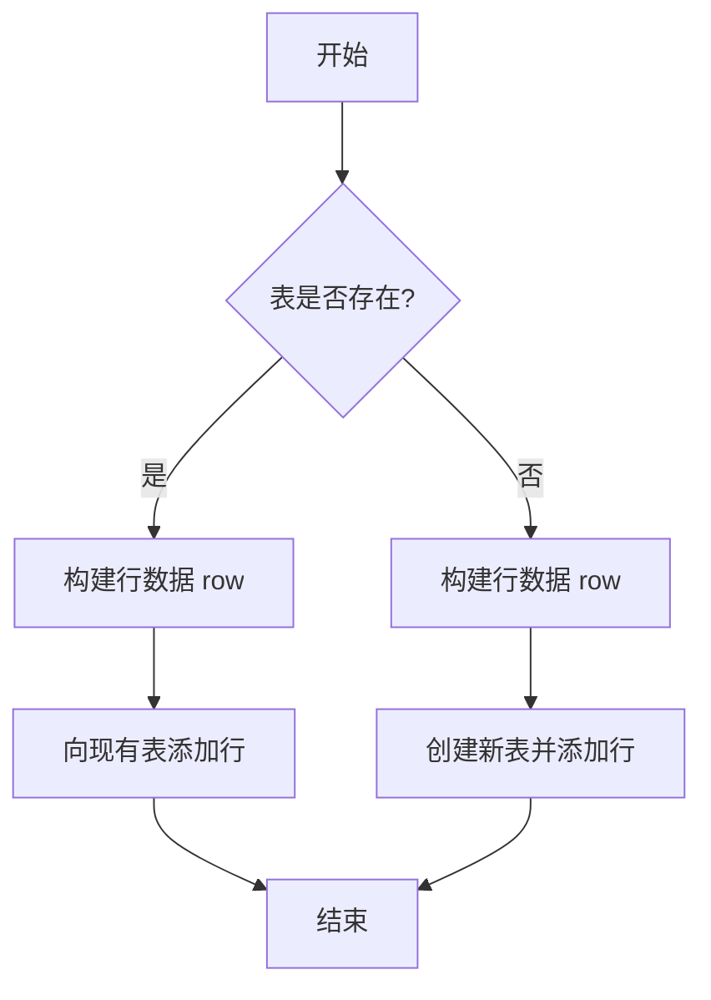
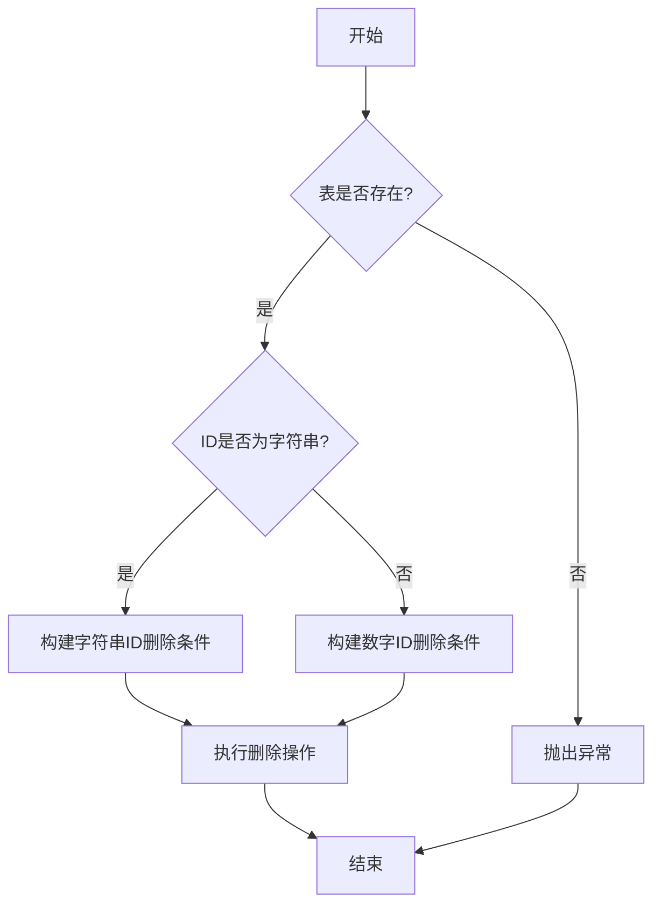
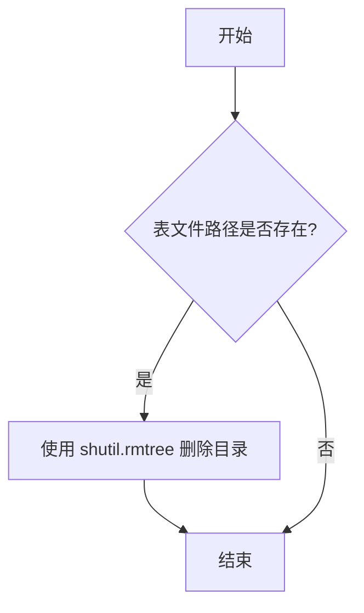

# `.\MetaGPT\metagpt\document_store\lancedb_store.py` 详细设计文档

该代码实现了一个基于LanceDB向量数据库的存储类，提供了向量数据的写入、搜索、删除和表管理功能，主要用于存储和检索带有元数据的向量嵌入。

## 整体流程



## 类结构

```
LanceStore (向量存储类)
├── __init__ (构造函数)
├── search (向量搜索)
├── write (批量写入数据)
├── add (单条数据写入)
├── delete (按ID删除数据)
└── drop (删除表)
```

## 全局变量及字段


### `LanceStore.db`
    
LanceDB数据库连接对象，用于执行数据库操作。

类型：`lancedb.db.DBConnection`
    


### `LanceStore.name`
    
当前存储实例关联的LanceDB表名称。

类型：`str`
    


### `LanceStore.table`
    
LanceDB表对象，用于执行向量数据的增删改查操作。

类型：`lancedb.table.Table`
    
    

## 全局函数及方法

### `LanceStore.__init__`

初始化 LanceStore 实例，连接到 LanceDB 数据库并设置表名。

参数：

- `name`：`str`，要创建或连接的 LanceDB 表名。

返回值：`None`，无返回值。

#### 流程图



#### 带注释源码

```python
def __init__(self, name):
    # 连接到 LanceDB 数据库，数据库路径为 "./data/lancedb"
    db = lancedb.connect("./data/lancedb")
    # 将数据库连接对象保存到实例属性 self.db
    self.db = db
    # 将传入的表名保存到实例属性 self.name
    self.name = name
    # 初始化表对象为 None，表示表尚未创建或加载
    self.table = None
```

### `LanceStore.search`

该方法用于在LanceDB表中执行向量相似性搜索，支持多种搜索参数和可选的元数据过滤。

参数：

- `query`：`list` 或 `numpy.ndarray`，查询向量嵌入，用于在表中查找最相似的向量。
- `n_results`：`int`，默认值为2，指定返回的最相似结果数量。
- `metric`：`str`，默认值为"L2"，指定距离度量标准，如"L2"（欧氏距离）、"cosine"（余弦相似度）等。
- `nprobes`：`int`，默认值为20，指定搜索时探测的聚类数量，值越大召回率越高但延迟也越高。
- `**kwargs`：`dict`，可选参数，用于传递额外的搜索选项，如`select`（指定返回的列）和`where`（SQL语法过滤元数据）。

返回值：`pandas.DataFrame`，返回一个包含搜索结果的数据框，每一行对应一个匹配的向量及其元数据。

#### 流程图



#### 带注释源码

```python
def search(self, query, n_results=2, metric="L2", nprobes=20, **kwargs):
    # 此方法假设query是一个向量嵌入
    # kwargs可用于可选的过滤
    # .select - 仅搜索指定的列
    # .where - 使用SQL语法过滤元数据（例如 where("price > 100")）
    # .metric - 指定使用的距离度量标准
    # .nprobes - 值越大，召回率越高（更可能找到存在的向量），但延迟也越高

    # 检查表是否已创建，若未创建则抛出异常
    if self.table is None:
        raise Exception("Table not created yet, please add data first.")

    # 构建搜索查询链：
    # 1. 使用查询向量开始搜索
    # 2. 限制返回结果数量
    # 3. 可选：指定返回的列（通过kwargs中的'select'）
    # 4. 可选：应用元数据过滤（通过kwargs中的'where'）
    # 5. 设置距离度量标准
    # 6. 设置探测数量以平衡召回率和延迟
    # 7. 将结果转换为pandas DataFrame
    results = (
        self.table.search(query)
        .limit(n_results)
        .select(kwargs.get("select"))
        .where(kwargs.get("where"))
        .metric(metric)
        .nprobes(nprobes)
        .to_df()
    )
    # 返回搜索结果数据框
    return results
```

### `LanceStore.persist`

该方法当前未实现，直接抛出 `NotImplementedError` 异常。根据类名 `LanceStore` 推断，其设计目标可能是将内存中的向量数据表持久化到磁盘，但具体实现逻辑尚未定义。

参数：
- 无

返回值：`None`，该方法不返回任何值，直接抛出异常。

#### 流程图



#### 带注释源码

```
    def persist(self):
        # 当前方法未实现，直接抛出 NotImplementedError 异常。
        # 根据设计，此方法应负责将内存中的向量数据表（self.table）持久化到磁盘。
        raise NotImplementedError
```

### `LanceStore.write`

该方法用于向LanceDB表中批量写入数据，将向量数据、元数据和ID组合成文档格式，并根据表是否存在决定是创建新表还是向现有表添加数据。

参数：

- `data`：`list`，包含向量数据的列表，每个元素是一个向量
- `metadatas`：`list`，包含元数据的列表，每个元素是一个字典，对应一个向量的元数据
- `ids`：`list`，包含ID的列表，每个元素是一个字符串或数值，用于唯一标识每个向量

返回值：`None`，该方法没有返回值，直接操作数据库表

#### 流程图



#### 带注释源码

```python
def write(self, data, metadatas, ids):
    # 此函数类似于add()，但用于更通用的更新操作
    # "data"是嵌入向量的列表
    # 通过将元数据扩展为数据框插入表中：[{'vector', 'id', 'meta', 'meta2'}, ...]

    documents = []  # 初始化文档列表，用于存储组合后的数据
    for i in range(len(data)):  # 遍历data列表中的每个向量
        row = {"vector": data[i], "id": ids[i]}  # 创建基础行，包含向量和ID
        row.update(metadatas[i])  # 将对应索引的元数据字典合并到行中
        documents.append(row)  # 将完整的文档行添加到文档列表

    if self.table is not None:  # 检查表是否已存在
        self.table.add(documents)  # 如果表存在，向表中添加文档
    else:
        # 如果表不存在，创建新表
        # 使用数据库连接、表名和文档列表创建表
        self.table = self.db.create_table(self.name, documents)
```

### `LanceStore.add`

该方法用于向LanceDB表中添加单个文档，包含向量嵌入、元数据和唯一标识符。如果表不存在，则创建新表；如果表已存在，则将文档添加到现有表中。

参数：

- `data`：`list` 或 `array-like`，单个文档的向量嵌入数据
- `metadata`：`dict`，与文档关联的元数据字典
- `_id`：`str` 或 `int`，文档的唯一标识符

返回值：`None`，无返回值，方法执行添加操作但不返回结果

#### 流程图



#### 带注释源码

```python
def add(self, data, metadata, _id):
    # 构建单行数据字典，包含向量、ID和元数据
    row = {"vector": data, "id": _id}
    row.update(metadata)  # 将元数据合并到行字典中

    # 检查表是否已存在
    if self.table is not None:
        # 表已存在，将行数据作为列表添加到现有表
        self.table.add([row])
    else:
        # 表不存在，创建新表并添加行数据
        self.table = self.db.create_table(self.name, [row])
```

### `LanceStore.delete`

该方法用于从LanceDB表中删除指定ID的数据行。它首先检查表是否存在，然后根据ID的类型（字符串或数字）构建相应的SQL删除语句，并执行删除操作。

参数：

- `_id`：`str` 或 `int`，要删除的数据行的唯一标识符。

返回值：`None`，无返回值。

#### 流程图



#### 带注释源码

```python
def delete(self, _id):
    # 检查表是否已创建，若未创建则抛出异常
    if self.table is None:
        raise Exception("Table not created yet, please add data first")

    # 根据ID的类型（字符串或数字）构建相应的SQL删除条件
    if isinstance(_id, str):
        # 如果ID是字符串类型，使用单引号包裹ID值
        return self.table.delete(f"id = '{_id}'")
    else:
        # 如果ID是数字类型，直接使用ID值
        return self.table.delete(f"id = {_id}")
```

### `LanceStore.drop`

该方法用于删除指定的 LanceDB 表（如果存在）。它通过检查表对应的物理文件路径是否存在，如果存在则使用 `shutil.rmtree` 递归删除整个目录，从而移除该表。

参数：

- `name`：`str`，要删除的表的名称。

返回值：`None`，无返回值。

#### 流程图



#### 带注释源码

```python
def drop(self, name):
    # 此函数删除一个表（如果它存在）。
    # 根据数据库URI和表名构建表对应的.lance文件的完整路径
    path = os.path.join(self.db.uri, name + ".lance")
    # 检查该路径是否存在（即表文件是否存在）
    if os.path.exists(path):
        # 如果存在，则递归删除整个目录，从而删除该表
        shutil.rmtree(path)
```

## 关键组件


### LanceDB 连接与表管理

该类封装了与 LanceDB 数据库的连接，并管理特定名称的向量数据表。它负责表的创建（首次写入时）、连接状态的维护以及表的删除操作。

### 向量数据写入与更新

提供两种方法将向量数据及其关联的元数据和唯一标识符写入数据库：`add` 方法用于写入单个文档，`write` 方法用于批量写入多个文档。两者都自动处理表的初始化。

### 向量相似性搜索

提供 `search` 方法，支持基于向量相似性的近似最近邻搜索。该方法允许指定返回结果数量、距离度量标准、搜索精度参数，并支持通过 SQL 语法对元数据进行过滤。

### 数据删除操作

提供 `delete` 方法，支持通过唯一标识符删除表中的特定行。该方法使用 SQL 语法构建删除条件。

### 表级操作

提供 `drop` 方法，用于物理删除指定的 LanceDB 表文件，实现表级别的清理。


## 问题及建议


### 已知问题

-   **硬编码的数据库路径**：`__init__` 方法中直接使用 `"./data/lancedb"` 作为数据库连接路径。这缺乏灵活性，使得在不同环境（如测试、生产）中切换配置变得困难，并且路径依赖于当前工作目录，可能导致意外行为。
-   **缺乏持久化方法实现**：`persist` 方法直接抛出 `NotImplementedError`。如果这是类设计的一部分，调用此方法将导致运行时错误，影响代码的可用性和完整性。
-   **`write` 和 `add` 方法功能重叠且命名不清晰**：`write` 方法用于批量写入，`add` 方法用于单条写入，两者功能高度重叠。`write` 方法的命名过于通用，未能清晰反映其批量操作的本质，容易与 `add` 混淆。
-   **`delete` 方法存在潜在的 SQL 注入风险**：该方法通过字符串拼接方式构造 SQL 条件（如 `f"id = '{_id}'"`）。如果 `_id` 参数来自不可信的用户输入，可能引入 SQL 注入漏洞，尽管 LanceDB 的上下文可能限制了攻击面，但这仍是不良实践。
-   **`drop` 方法设计不一致且存在风险**：该方法接受一个 `name` 参数来删除指定表，但操作的是类实例关联的数据库 (`self.db.uri`)。这可能导致意外删除其他表，且与类实例自身管理的 `self.name` 和 `self.table` 状态无关，设计上存在不一致性。
-   **错误处理不完善**：`search` 和 `delete` 方法在 `self.table` 为 `None` 时抛出通用的 `Exception`。这不利于调用者进行精确的异常捕获和处理。其他方法（如 `write`, `add`）在 `self.table` 为 `None` 时会创建新表，但未考虑表已存在但无法连接等异常情况。
-   **类型提示缺失**：代码中没有使用 Python 类型提示（Type Hints），这降低了代码的可读性、可维护性，并使得静态类型检查工具（如 mypy）无法发挥作用，不利于在大型项目或团队协作中使用。

### 优化建议

-   **将数据库路径参数化**：建议修改 `__init__` 方法，接受一个 `db_uri` 或 `db_path` 参数，并提供默认值（如 `"./data/lancedb"`）。这样可以在不同环境中灵活配置。
-   **实现或移除 `persist` 方法**：如果 `persist` 方法是接口契约的一部分（例如，继承自某个基类），应提供具体实现（例如，调用 LanceDB 的提交或刷新机制）。如果暂无用途，应考虑将其移除，或将其实现为 `pass` 并添加文档说明（如 `# TODO: 待实现持久化逻辑`）。
-   **重构 `write` 和 `add` 方法，明确职责**：
    -   将 `add` 方法重命名为 `add_one` 或 `insert`，使其单条操作的意图更明确。
    -   将 `write` 方法重命名为 `add_batch` 或 `insert_many`，清晰表达其批量操作功能。
    -   考虑让 `add`（或 `add_one`）内部调用 `add_batch`（或 `insert_many`）以复用逻辑，减少代码重复。
-   **使用参数化查询或安全函数来避免 SQL 注入**：修改 `delete` 方法，避免直接拼接字符串。应查阅 LanceDB 官方文档，使用其提供的参数化查询接口或安全的标识符转义方法来构造条件。
-   **重新设计 `drop` 方法，使其与实例状态一致**：建议将 `drop` 方法改为无参数，直接删除当前实例管理的表（即 `self.name` 对应的表）。如果确实需要删除任意表，应将其设计为类方法或静态方法，并明确其作用范围，避免与实例状态混淆。同时，删除前应增加确认或日志记录。
-   **定义和使用自定义异常类**：创建特定的异常类（如 `TableNotInitializedError`, `InvalidOperationError`）来代替通用的 `Exception`。这能让调用者更清晰地区分和处理不同错误场景。
-   **为所有方法和函数添加类型提示**：为 `__init__`、`search`、`write`、`add`、`delete`、`drop` 等方法以及 `row` 字典等内部数据结构添加完整的类型提示。这能极大提升代码的清晰度和工具支持度。
-   **增加输入验证和健壮性检查**：在 `write` 和 `add` 方法中，验证 `data`、`metadatas`、`ids` 等输入参数的长度是否一致，类型是否符合预期。在 `search` 方法中，可以验证 `query` 是否为预期的向量格式。
-   **考虑添加上下文管理器支持**：可以实现 `__enter__` 和 `__exit__` 方法，以支持 `with` 语句，确保资源（如数据库连接）的正确初始化和清理。
-   **完善文档字符串**：为每个公有方法添加详细的文档字符串，说明其用途、参数、返回值、可能抛出的异常以及使用示例。


## 其它


### 设计目标与约束

本模块旨在提供一个基于 LanceDB 的向量数据存储与检索的轻量级封装。核心设计目标包括：1) 提供对向量数据的增、删、查基础操作；2) 支持通过向量相似性进行高效检索；3) 简化 LanceDB API 的使用，提供更符合常见语义的接口（如 `add`, `write`, `search`）。主要约束包括：1) 依赖 LanceDB 作为底层存储引擎；2) 数据持久化路径固定为 `./data/lancedb`；3) 当前 `persist` 方法未实现，数据通过 LanceDB 自动管理。

### 错误处理与异常设计

模块中的错误处理较为基础，主要依赖于 Python 内置异常和 LanceDB 库抛出的异常。在 `search` 和 `delete` 方法中，当表尚未创建时，会抛出通用的 `Exception`，建议未来可自定义更具体的异常类（如 `TableNotExistError`）。`write` 和 `add` 方法假设输入参数（`data`, `metadatas`, `ids`）的长度一致，若不一致可能导致运行时错误或数据错乱，此处缺乏参数校验。`delete` 方法对 `_id` 参数进行了简单的类型判断以构建 SQL 字符串，但未对 SQL 注入风险进行防护，尽管在受控环境下风险较低。

### 数据流与状态机

模块的核心数据流围绕 `LanceStore` 类的实例状态展开。初始状态：`self.table` 为 `None`。状态转换：1) 首次调用 `write` 或 `add` 方法时，创建表并将 `self.table` 指向该表，进入“表已存在”状态；2) 在“表已存在”状态下，后续的 `write`、`add`、`search`、`delete` 操作均在该表上进行；3) 调用 `drop` 方法会物理删除表文件，但实例内的 `self.table` 引用不会自动置为 `None`，可能导致后续操作失败。数据流入：`add`/`write` 方法接收向量数据、元数据和 ID。数据流出：`search` 方法返回包含检索结果的 Pandas DataFrame。

### 外部依赖与接口契约

**外部依赖：**
1.  `lancedb`: 核心向量数据库库，提供底层存储、索引和查询能力。版本兼容性未指定。
2.  `os`, `shutil`: Python 标准库，用于文件路径操作和目录删除（`drop` 方法）。

**接口契约：**
*   `__init__(self, name: str)`: 初始化存储实例，连接到本地 `./data/lancedb` 目录，并指定表名。
*   `search(...) -> pd.DataFrame`: 执行向量相似性搜索。调用者需确保 `query` 为向量；`kwargs` 可传递 `select` 和 `where` 子句。
*   `write(data: List[List[float]], metadatas: List[dict], ids: List[Any]) -> None`: 批量写入数据。调用者需保证三个列表长度一致。
*   `add(data: List[float], metadata: dict, _id: Any) -> None`: 写入单条数据。
*   `delete(_id: Any) -> None`: 根据 ID 删除记录。ID 类型需可转换为 SQL 字符串。
*   `drop(name: str) -> None`: 物理删除指定表的数据文件。

### 配置管理与环境假设

模块硬编码了数据库连接路径 (`./data/lancedb`)，缺乏配置灵活性。假设运行环境对该路径具有读写权限。表名通过 `__init__` 方法参数指定，并作为 LanceDB 中表的标识。模块未处理数据库连接失败、磁盘空间不足等运维相关异常。`drop` 方法直接操作文件系统，假设 `self.db.uri` 是有效的本地文件路径。

### 安全考量

1.  **SQL 注入**：`delete` 方法通过字符串拼接构造 SQL `WHERE` 子句。虽然 `_id` 通常为内部生成的标识符，但若其值来源于不可信的用户输入，则存在潜在风险。建议使用参数化查询或严格校验输入。
2.  **数据泄露**：模块本身不涉及加密。向量数据和元数据以明文形式存储在 LanceDB 文件中。
3.  **权限控制**：无内置的访问控制或认证机制。依赖文件系统权限来保护 `./data/lancedb` 目录。
4.  `drop` 方法直接使用 `shutil.rmtree` 删除目录，若 `name` 参数被恶意构造（如 `../../../some/path`），可能导致任意文件删除。应校验 `name` 参数的合法性。

### 测试策略建议

1.  **单元测试**：
    *   测试 `__init__` 是否正确创建连接和设置表名。
    *   测试 `add`/`write` 在表不存在和已存在两种情况下的行为。
    *   测试 `search` 在不同参数（`metric`, `nprobes`, `where` 条件）下的返回结果。
    *   测试 `delete` 对字符串和数字 ID 的处理，以及删除不存在的 ID 时的行为。
    *   测试 `drop` 方法，验证表文件是否被删除。
2.  **集成测试**：
    *   模拟完整的 CRUD 流程，验证数据一致性。
    *   测试并发写入和查询场景（需注意 LanceDB 的并发支持程度）。
3.  **异常测试**：
    *   测试在表未创建时调用 `search` 和 `delete` 是否抛出预期异常。
    *   测试向 `write` 方法传入长度不一致的列表时的行为。
    *   测试数据库连接失败时的处理。

    