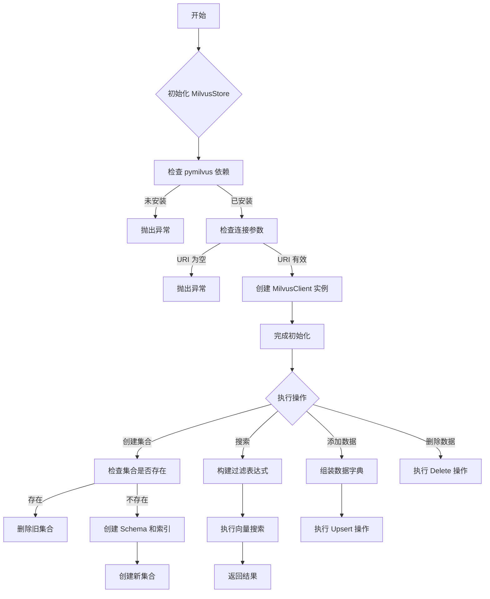
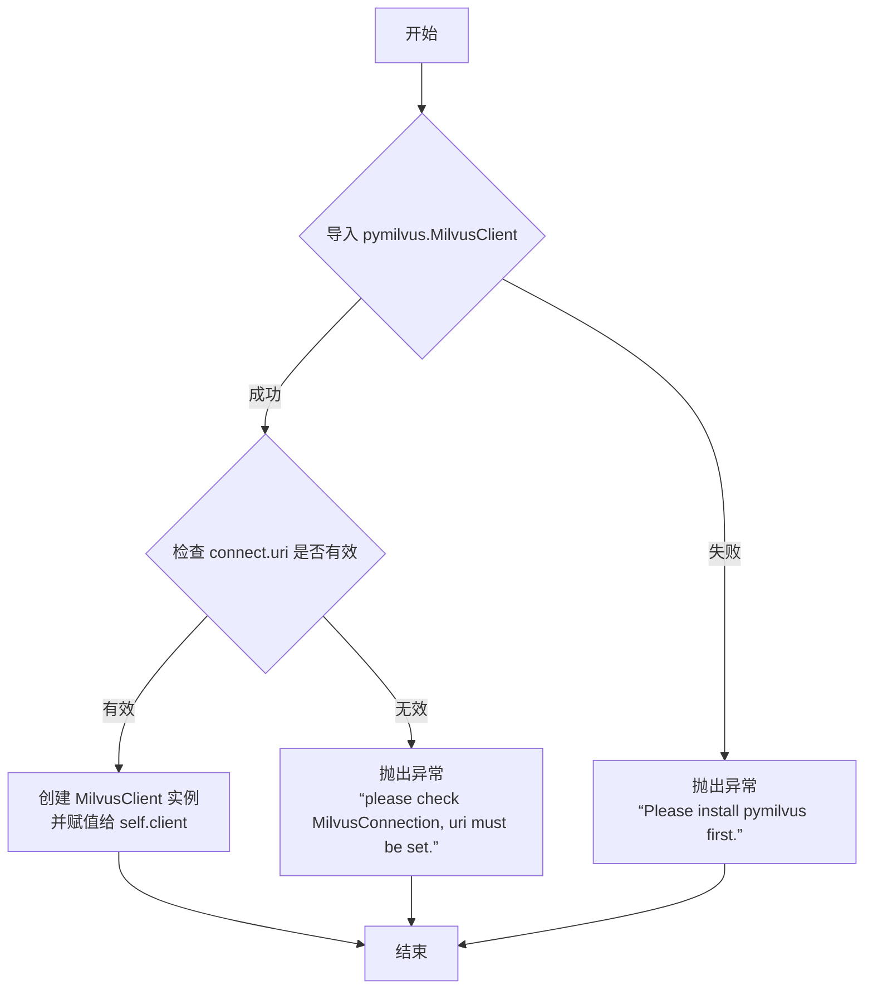
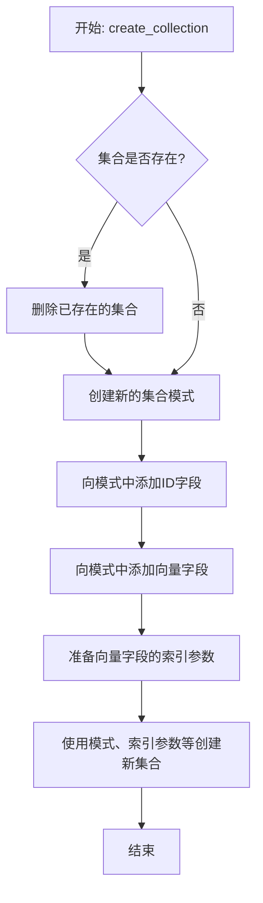
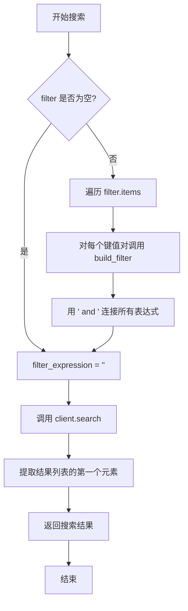
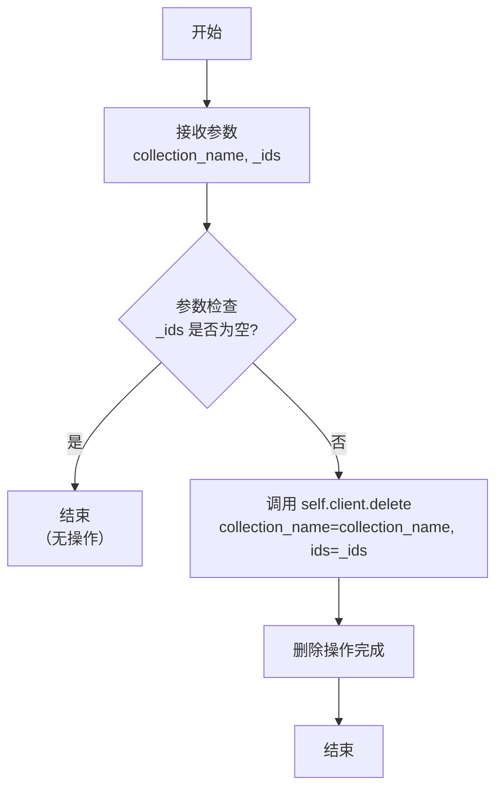
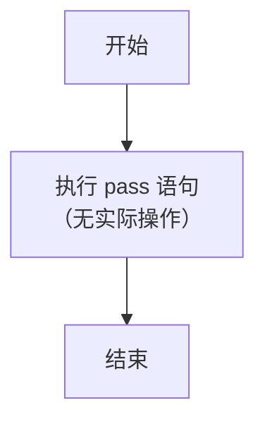

# `.\MetaGPT\metagpt\document_store\milvus_store.py` 详细设计文档

该代码实现了一个基于 Milvus 向量数据库的存储类 `MilvusStore`，它继承自 `BaseStore` 抽象基类，提供了创建集合、构建查询过滤器、向量相似性搜索、添加/删除数据等核心功能，用于管理向量化数据的存储与检索。

## 整体流程



## 类结构

```
BaseStore (抽象基类)
└── MilvusStore (Milvus 存储实现类)

MilvusConnection (数据类)
```

## 全局变量及字段


### `MilvusConnection.uri`
    
Milvus数据库的连接URL地址，用于建立与Milvus服务的连接。

类型：`str`
    


### `MilvusConnection.token`
    
用于身份验证的访问令牌，连接到Milvus服务时可能需要提供。

类型：`str`
    


### `MilvusStore.client`
    
pymilvus库的MilvusClient实例，用于执行所有与Milvus数据库交互的核心操作。

类型：`MilvusClient`
    
    

## 全局函数及方法

### `MilvusStore.__init__`

该方法用于初始化 `MilvusStore` 类的实例，主要功能是检查必要的依赖和连接参数，并创建与 Milvus 数据库的连接客户端。

参数：

- `connect`：`MilvusConnection`，包含 Milvus 数据库的连接信息（URI 和 Token）。

返回值：`None`，无返回值。

#### 流程图



#### 带注释源码

```python
def __init__(self, connect: MilvusConnection):
    # 尝试导入 pymilvus 库中的 MilvusClient 类
    try:
        from pymilvus import MilvusClient
    except ImportError:
        # 如果导入失败，说明 pymilvus 库未安装，抛出异常提示用户安装
        raise Exception("Please install pymilvus first.")
    
    # 检查传入的连接对象中的 URI 是否已设置
    if not connect.uri:
        # 如果 URI 为空或未设置，抛出异常提示用户检查连接配置
        raise Exception("please check MilvusConnection, uri must be set.")
    
    # 使用提供的 URI 和 Token 创建 MilvusClient 实例，并将其赋值给实例变量 self.client
    self.client = MilvusClient(uri=connect.uri, token=connect.token)
```

### `MilvusStore.create_collection`

该方法用于在Milvus向量数据库中创建一个新的集合（Collection）。如果指定的集合已存在，则会先删除旧集合再创建新集合。它会为集合定义一个包含主键ID字段和向量字段的固定模式，并为向量字段创建索引。

参数：

- `collection_name`：`str`，要创建或重建的集合的名称。
- `dim`：`int`，向量字段的维度。
- `enable_dynamic_schema`：`bool`，默认为`True`，是否启用动态模式以允许插入未在模式中定义的字段。

返回值：`None`，该方法不返回任何值，其作用是在Milvus中创建或重建集合。

#### 流程图



#### 带注释源码

```python
def create_collection(self, collection_name: str, dim: int, enable_dynamic_schema: bool = True):
    # 导入Milvus的数据类型定义
    from pymilvus import DataType

    # 检查指定名称的集合是否已存在
    if self.client.has_collection(collection_name=collection_name):
        # 如果存在，则删除该集合，确保后续创建的是全新的集合
        self.client.drop_collection(collection_name=collection_name)

    # 创建一个新的集合模式（Schema）
    # auto_id=False: 禁用自动生成ID，由用户提供
    # enable_dynamic_field=False: 禁用动态字段，模式是固定的
    schema = self.client.create_schema(
        auto_id=False,
        enable_dynamic_field=False,
    )
    # 向模式中添加一个主键字段，用于存储文档的唯一标识符
    # 数据类型为可变长度字符串，最大长度36（例如UUID）
    schema.add_field(field_name="id", datatype=DataType.VARCHAR, is_primary=True, max_length=36)
    # 向模式中添加一个向量字段，用于存储向量数据
    # 数据类型为浮点向量，维度由参数dim指定
    schema.add_field(field_name="vector", datatype=DataType.FLOAT_VECTOR, dim=dim)

    # 准备索引参数
    index_params = self.client.prepare_index_params()
    # 为向量字段添加索引
    # index_type="AUTOINDEX": 使用自动索引（Milvus根据数据自动选择索引类型）
    # metric_type="COSINE": 使用余弦相似度作为距离度量标准
    index_params.add_index(field_name="vector", index_type="AUTOINDEX", metric_type="COSINE")

    # 使用定义好的模式、索引参数等创建新的集合
    self.client.create_collection(
        collection_name=collection_name,
        schema=schema,
        index_params=index_params,
        enable_dynamic_schema=enable_dynamic_schema, # 是否允许动态模式
    )
```

### `MilvusStore.build_filter`

`MilvusStore.build_filter` 是一个静态方法，用于根据给定的键值对构建一个适用于 Milvus 向量数据库查询的过滤表达式字符串。它智能地处理不同类型的值（字符串、列表、其他类型），生成正确的语法格式。

参数：

- `key`：`Any`，过滤条件中的字段名。
- `value`：`Any`，过滤条件中字段对应的值。

返回值：`str`，一个格式化的 Milvus 过滤表达式字符串。

#### 流程图

```mermaid
flowchart TD
    A[开始: build_filter(key, value)] --> B{value 是否为字符串?};
    B -- 是 --> C[生成表达式: key == "value"];
    B -- 否 --> D{value 是否为列表?};
    D -- 是 --> E[生成表达式: key in value];
    D -- 否 --> F[生成表达式: key == value];
    C --> G[返回 filter_expression];
    E --> G;
    F --> G;
    G --> H[结束];
```

#### 带注释源码

```python
    @staticmethod
    def build_filter(key, value) -> str:
        # 判断值的类型是否为字符串
        if isinstance(value, str):
            # 如果是字符串，需要用双引号包裹值
            filter_expression = f'{key} == "{value}"'
        else:
            # 如果不是字符串，判断是否为列表
            if isinstance(value, list):
                # 如果是列表，使用 'in' 操作符
                filter_expression = f"{key} in {value}"
            else:
                # 如果是其他类型（如数字、布尔值），直接使用等号
                filter_expression = f"{key} == {value}"

        # 返回构建好的过滤表达式字符串
        return filter_expression
```

### `MilvusStore.search`

该方法用于在指定的Milvus集合中进行向量相似性搜索，并可根据提供的过滤条件对结果进行筛选。

参数：

- `collection_name`：`str`，指定要搜索的Milvus集合的名称。
- `query`：`List[float]`，查询向量，用于在集合中查找最相似的向量。
- `filter`：`Dict`，可选的过滤条件字典，用于在搜索前筛选集合中的文档。默认为`None`。
- `limit`：`int`，指定返回的最相似结果的数量。默认为10。
- `output_fields`：`Optional[List[str]]`，可选的字段列表，指定返回结果中应包含的元数据字段。默认为`None`。

返回值：`List[dict]`，返回一个字典列表，每个字典代表一个搜索结果，包含匹配向量的ID、相似度分数以及请求的元数据字段。

#### 流程图



#### 带注释源码

```python
def search(
    self,
    collection_name: str,
    query: List[float],
    filter: Dict = None,
    limit: int = 10,
    output_fields: Optional[List[str]] = None,
) -> List[dict]:
    # 1. 构建过滤表达式字符串
    # 如果提供了filter字典，则遍历其键值对，为每个对生成一个Milvus过滤表达式，
    # 然后用逻辑运算符"and"将它们连接起来。
    # 如果filter为None或空，则filter_expression将为空字符串。
    filter_expression = " and ".join([self.build_filter(key, value) for key, value in filter.items()])
    # 打印构建的过滤表达式，便于调试（生产环境中应考虑使用日志）
    print(filter_expression)

    # 2. 执行搜索
    # 调用底层的MilvusClient进行搜索。
    # 注意：client.search返回一个列表，其中第一个元素（索引0）是针对第一个查询向量（本例中只有一个）的结果列表。
    res = self.client.search(
        collection_name=collection_name,
        data=[query],  # 将单个查询向量包装成列表
        filter=filter_expression,
        limit=limit,
        output_fields=output_fields,
    )[0]  # 提取第一个（也是唯一一个）查询向量的结果

    # 3. 返回搜索结果
    # res是一个字典列表，每个字典包含匹配向量的信息（如id, distance, 以及请求的output_fields）。
    return res
```

### `MilvusStore.add`

该方法用于向指定的Milvus集合（collection）中批量添加或更新数据。它接收一组ID、向量和元数据，将它们组合成Milvus客户端所需的格式，然后调用`upsert`操作将数据写入集合。如果集合中已存在相同ID的记录，则进行更新；否则，执行插入操作。

参数：

- `collection_name`：`str`，目标Milvus集合的名称。
- `_ids`：`List[str]`，要添加或更新的数据条目的唯一标识符列表。
- `vector`：`List[List[float]]`，与每个ID对应的向量数据列表，每个向量是一个浮点数列表。
- `metadata`：`List[Dict[str, Any]]`，与每个ID对应的元数据字典列表，用于存储额外的结构化信息。

返回值：`None`，该方法不返回任何值，执行成功或失败将通过潜在的异常抛出。

#### 流程图

```mermaid
graph TD
    A[开始: MilvusStore.add] --> B[初始化空字典 data]
    B --> C{遍历 _ids, vector, metadata?}
    C -->|是| D[将 id, vector[i], metadata[i] 组合到 data 中]
    D --> C
    C -->|遍历结束| E[调用 client.upsert 写入数据]
    E --> F[结束]
```

#### 带注释源码

```python
def add(self, collection_name: str, _ids: List[str], vector: List[List[float]], metadata: List[Dict[str, Any]]):
    # 初始化一个空字典，用于存储将要上传的数据。
    data = dict()

    # 遍历提供的ID列表、向量列表和元数据列表。
    # 假设这三个列表的长度是相等的，并且索引位置一一对应。
    for i, id in enumerate(_ids):
        # 为当前索引i对应的数据条目构建字典。
        # 键名“id”、“vector”、“metadata”是Milvus集合schema中定义的字段名。
        data["id"] = id
        data["vector"] = vector[i]
        data["metadata"] = metadata[i]

    # 调用Milvus客户端的upsert方法，将组合好的数据写入指定的集合。
    # upsert操作：如果集合中已存在相同id的记录，则更新该记录；否则，插入新记录。
    self.client.upsert(collection_name=collection_name, data=data)
```

### `MilvusStore.delete`

该方法用于从指定的 Milvus 集合中删除一个或多个文档。它通过调用底层 Milvus 客户端的 `delete` 方法，根据提供的文档 ID 列表执行删除操作。

参数：

- `collection_name`：`str`，指定要从中删除文档的 Milvus 集合的名称。
- `_ids`：`List[str]`，包含要删除的文档的唯一标识符（ID）的列表。

返回值：`None`，该方法不返回任何值。

#### 流程图



#### 带注释源码

```python
def delete(self, collection_name: str, _ids: List[str]):
    """
    从指定的 Milvus 集合中删除一个或多个文档。

    该方法将给定的文档 ID 列表传递给底层的 Milvus 客户端，执行批量删除操作。
    如果 `_ids` 列表为空，则不会执行任何操作。

    Args:
        collection_name (str): 要操作的 Milvus 集合的名称。
        _ids (List[str]): 要删除的文档的唯一标识符列表。
    """
    # 调用 pymilvus 客户端的 delete 方法，执行删除操作。
    # 该方法会处理与 Milvus 服务器的通信，并根据提供的 ID 列表删除对应的向量数据点。
    self.client.delete(collection_name=collection_name, ids=_ids)
```

### `MilvusStore.write`

该方法是一个占位符方法，当前未实现任何功能。根据其父类 `BaseStore` 的设计意图，它可能用于执行数据写入操作，但当前版本仅包含一个 `pass` 语句，表示该方法有待后续实现。

参数：

-  `*args`：`tuple`，可变位置参数，当前未定义具体用途。
-  `**kwargs`：`dict`，可变关键字参数，当前未定义具体用途。

返回值：`None`，当前方法不返回任何值。

#### 流程图



#### 带注释源码

```python
def write(self, *args, **kwargs):
    # 这是一个占位符方法，当前未实现任何功能。
    # 根据其父类 `BaseStore` 的设计意图，它可能用于执行数据写入操作。
    # 参数 *args 和 **kwargs 为可变参数，允许未来扩展时传入不同的参数。
    # 当前版本仅包含一个 pass 语句，表示该方法有待后续实现。
    pass
```

## 关键组件


### MilvusConnection

一个数据类，用于封装连接Milvus数据库所需的配置信息，包括服务器URI和认证令牌。

### MilvusStore

一个具体的文档存储实现类，继承自`BaseStore`，封装了与Milvus向量数据库进行交互的核心操作，包括集合管理、数据增删改查等。

### 集合管理 (Collection Management)

`MilvusStore`类中用于创建和配置Milvus集合（Collection）的功能模块，包括定义集合的Schema（如主键ID字段和向量字段）以及创建索引。

### 查询构建器 (Query Builder)

`MilvusStore`类中的`build_filter`静态方法，负责将Python字典形式的过滤条件转换为Milvus查询引擎能够识别的过滤表达式字符串。

### 向量相似性搜索 (Vector Similarity Search)

`MilvusStore`类中的`search`方法，是核心功能之一，用于在指定集合中执行基于向量相似度的检索，并支持通过过滤条件进行结果筛选。

### 数据操作 (Data Operations)

`MilvusStore`类中用于处理集合内数据的方法集合，包括`add`方法（用于插入或更新向量及元数据）和`delete`方法（用于根据ID删除数据）。

### 外部依赖 (External Dependency)

代码运行所依赖的`pymilvus`库，它是与Milvus数据库进行交互的Python客户端SDK，是`MilvusStore`类功能实现的基础。


## 问题及建议


### 已知问题

-   **`add` 方法存在逻辑错误**：`data` 变量被定义为字典，但在循环中不断覆盖其键值，导致最终只有最后一组 `id`、`vector` 和 `metadata` 被保留。这会导致调用 `upsert` 时只写入最后一条数据，造成数据丢失。
-   **`write` 方法未实现**：`MilvusStore` 继承自 `BaseStore`，但 `write` 方法仅有一个 `pass` 占位符，未实现任何功能。这违反了接口契约，可能导致调用方出现意外行为或错误。
-   **`search` 方法中的 `filter` 参数处理不健壮**：当传入的 `filter` 参数为 `None` 或空字典时，`filter_expression` 的构建逻辑 `" and ".join(...)` 会生成空字符串。虽然 Milvus 客户端可能接受空字符串作为无过滤条件，但代码逻辑不够清晰，且未对 `filter` 参数进行显式的有效性检查。
-   **`create_collection` 方法强制删除已存在的集合**：无论集合是否为空或是否包含重要数据，只要集合存在，该方法都会先删除再创建。这可能导致数据丢失，且行为过于激进，缺乏灵活性。
-   **异常处理不完整**：`__init__` 方法中检查了 `connect.uri` 是否存在，但未检查 `connect` 参数本身是否为 `None`。此外，`pymilvus` 客户端操作（如 `search`、`upsert`、`delete`）可能抛出多种异常（如连接错误、参数错误），但代码中未进行捕获和处理，可能导致程序崩溃。
-   **`build_filter` 方法对复杂值类型支持不足**：当前方法仅处理了 `str`、`list` 和 `其他`（视为数值）类型。对于更复杂的过滤条件（如范围查询 `>`、`<`，布尔值 `True`/`False`，嵌套字典等）无法正确构建表达式，限制了查询的灵活性。

### 优化建议

-   **修复 `add` 方法的数据结构**：应将 `data` 改为列表，列表中的每个元素是一个字典，代表一条记录。循环内将每条记录的数据构造成字典并添加到列表中。最后将整个列表传递给 `client.upsert` 方法。
-   **实现 `write` 方法或明确其用途**：根据 `BaseStore` 的契约，实现 `write` 方法的功能（例如，作为 `add` 方法的别名或处理不同的数据格式）。如果确定不需要此方法，应考虑从基类中移除对该方法的依赖，或在子类中明确抛出 `NotImplementedError` 并说明原因。
-   **增强 `search` 方法的 `filter` 参数处理**：在构建 `filter_expression` 之前，先检查 `filter` 是否为 `None` 或空字典。如果是，则直接将 `filter_expression` 设为 `None` 或空字符串，并添加清晰的注释。这可以提高代码的可读性和健壮性。
-   **为 `create_collection` 方法增加存在性检查选项**：可以添加一个参数（如 `force_recreate: bool = False`）来控制行为。当集合已存在且 `force_recreate` 为 `False` 时，可以跳过创建步骤或抛出提示性异常；只有当 `force_recreate` 为 `True` 时才执行删除并重建的操作。
-   **完善异常处理**：
    -   在 `__init__` 中增加对 `connect` 参数为 `None` 的检查。
    -   在关键方法（如 `search`, `add`, `delete`, `create_collection`）中使用 `try-except` 块捕获 `pymilvus` 可能抛出的异常，并将其转换为更友好的业务异常或记录日志后重新抛出，避免底层细节直接暴露给调用方。
-   **增强 `build_filter` 方法或提供更灵活的过滤接口**：
    -   可以扩展 `build_filter` 以支持更多操作符（如 `>`, `<`, `>=`, `<=`, `!=`）和值类型（如布尔值、`None`）。
    -   或者，考虑允许调用方直接传入一个符合 Milvus 语法规则的过滤表达式字符串，为高级用户提供更大的灵活性。同时保留当前简易的字典构建方式作为便捷选项。
-   **考虑添加连接管理和健康检查**：可以增加方法来检查与 Milvus 服务器的连接状态，或在操作失败时尝试重连。这对于生产环境的稳定性很重要。
-   **改进 `add` 方法的参数验证**：在方法开始处验证 `_ids`、`vector` 和 `metadata` 三个列表的长度是否一致，如果不一致应尽早抛出清晰的异常，避免将错误数据传入 Milvus 服务器。
-   **添加类型注解和文档字符串的完整性**：确保所有公共方法的参数和返回值都有完整的类型注解。为类和方法添加更详细的文档字符串，说明其用途、参数含义、返回值格式以及可能抛出的异常。


## 其它


### 设计目标与约束

本模块旨在为上层应用提供一个基于Milvus向量数据库的、符合`BaseStore`接口规范的向量存储实现。核心设计目标包括：1) 封装Milvus客户端的复杂操作，提供简洁的集合管理、数据增删查接口；2) 支持动态字段（`enable_dynamic_schema`）以适应灵活的元数据存储需求；3) 提供基础的过滤查询能力。主要约束包括：1) 强依赖`pymilvus`库；2) 当前实现中`add`方法的数据组装逻辑存在缺陷，可能导致数据覆盖；3) `write`方法仅为占位符，未实现功能。

### 错误处理与异常设计

模块采用防御性编程和异常抛出相结合的策略。在`__init__`中，通过`try-except`捕获`pymilvus`导入失败，并抛出明确的异常信息；同时校验连接参数`uri`是否为空。在`create_collection`等方法中，依赖`pymilvus`客户端库自身的异常处理机制，将底层错误（如连接失败、参数错误）向上层传递。`build_filter`和`search`方法内部未显式处理异常，依赖于调用方处理可能的数据格式错误或查询失败。整体上，错误处理较为基础，缺乏细粒度的自定义异常和错误恢复机制。

### 数据流与状态机

模块的核心数据流围绕向量和关联的元数据展开。`add`方法接收`_ids`, `vector`, `metadata`三个列表，旨在将它们组合成字典后写入Milvus集合。`search`方法接收查询向量和过滤条件，在指定集合中执行相似性搜索并返回结果。`delete`方法根据ID列表删除数据。`create_collection`方法负责集合的创建与重建，其执行会改变Milvus服务端的持久化状态（删除旧集合、创建新集合）。模块自身不维护复杂的内部状态，状态主要存在于Milvus服务端的集合和数据中。

### 外部依赖与接口契约

1.  **外部库依赖**：强依赖于`pymilvus`库，用于与Milvus服务进行通信。这是模块运行的必要条件。
2.  **父类契约**：继承自`BaseStore`（假设来自`metagpt.document_store.base_store`），需实现其定义的接口。当前`write`方法未实现，违反了此契约。
3.  **服务依赖**：依赖于外部的Milvus数据库服务，通过`MilvusConnection`配置的URI和Token进行连接。
4.  **数据格式契约**：`add`方法要求输入的`_ids`, `vector`, `metadata`三个列表长度一致；`search`方法的`filter`参数期望一个字典，其值会被`build_filter`转换为查询表达式字符串。这些是模块与调用方之间隐含的契约。

### 安全与合规考量

1.  **连接安全**：支持通过`token`进行认证，保障与Milvus服务连接的安全性。需确保`MilvusConnection`中的敏感信息（如token）在配置和存储过程中得到妥善管理。
2.  **数据安全**：模块本身不涉及数据加密，依赖Milvus服务端及网络传输的安全配置（如TLS/SSL）。
3.  **操作安全**：`create_collection`方法在创建新集合前会无条件删除已存在的同名集合，这是一个具有破坏性的操作，需确保调用方明确知晓此行为，避免生产环境数据误删。
4.  **输入验证**：对输入数据的验证不足，例如`add`方法未检查列表长度一致性及数据格式，可能引发运行时错误或数据不一致。

    