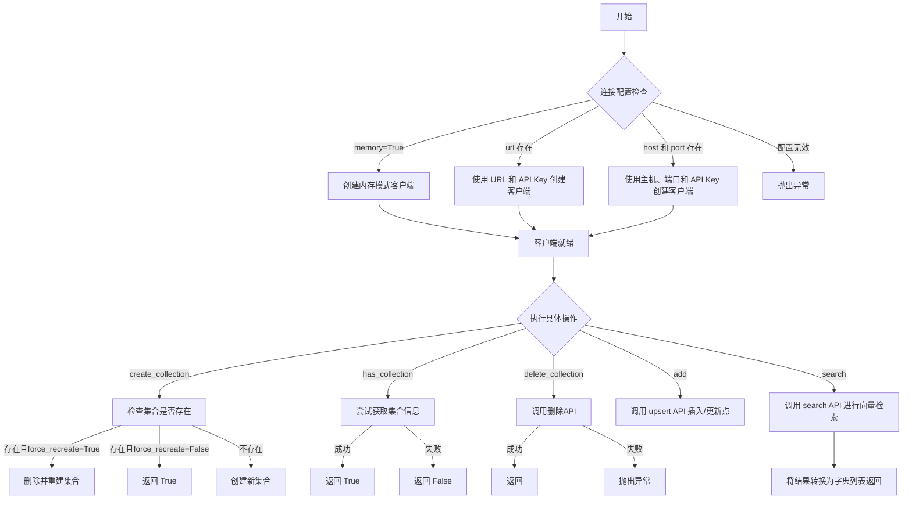
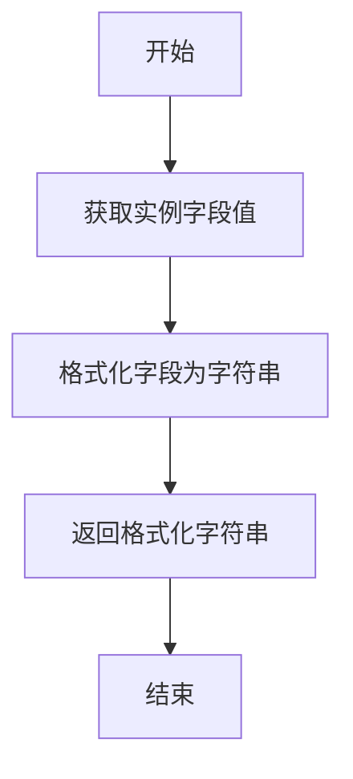
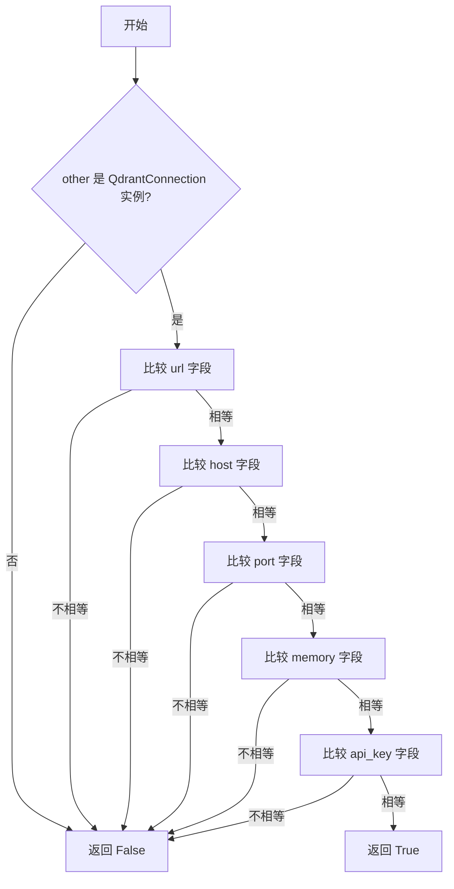
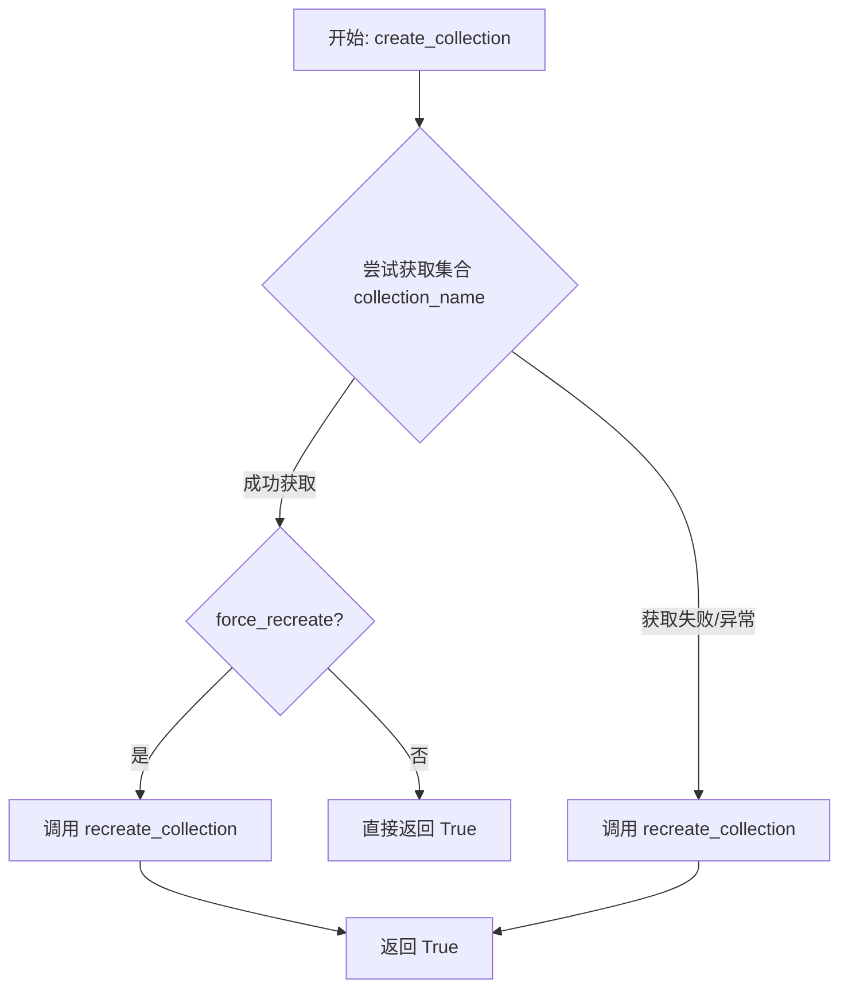
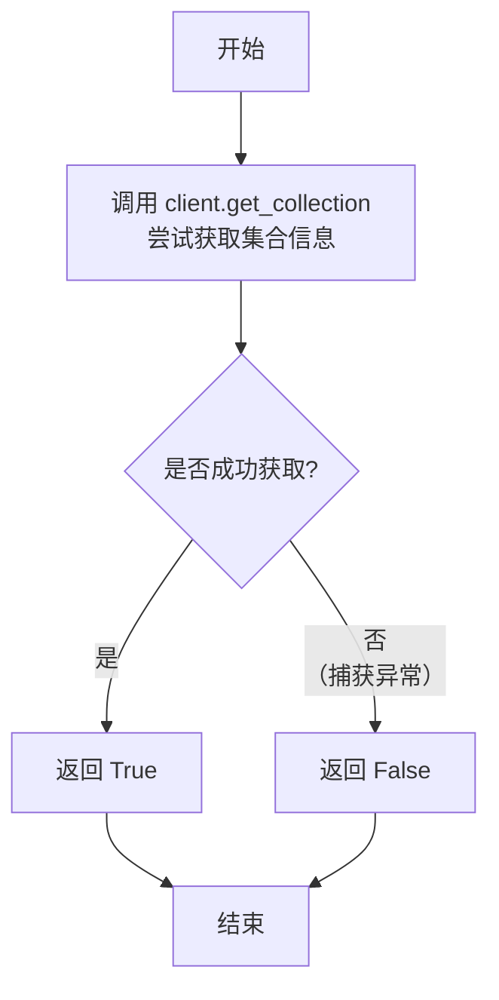
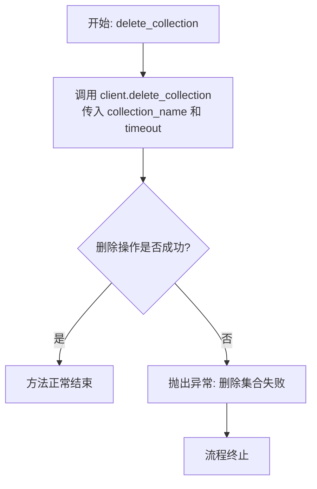
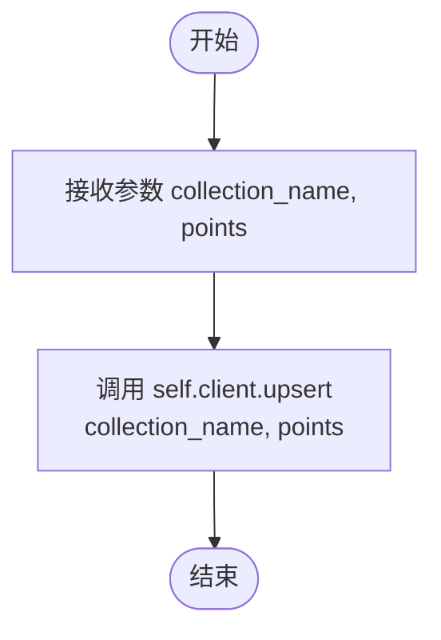
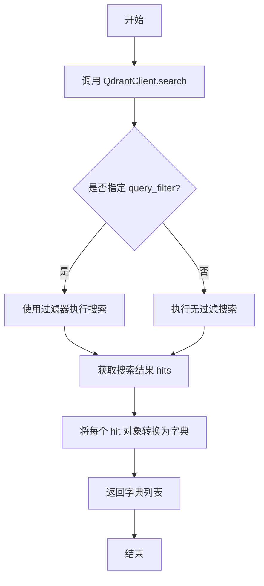
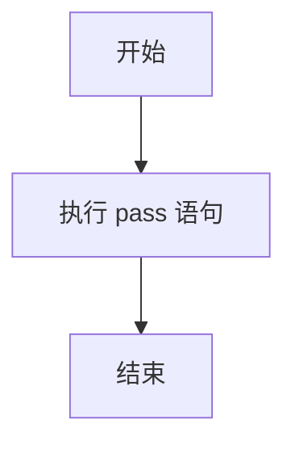

# `.\MetaGPT\metagpt\document_store\qdrant_store.py` 详细设计文档

该代码实现了一个基于 Qdrant 向量数据库的存储适配器，作为 `BaseStore` 的派生类，提供了集合（collection）的创建、删除、存在性检查，以及向量数据的添加和相似性搜索等核心功能。它通过 `QdrantConnection` 数据类来灵活配置与 Qdrant 服务的连接方式（内存模式、URL 或主机/端口）。

## 整体流程



## 类结构

```
BaseStore (抽象基类，来自 metagpt.document_store.base_store)
└── QdrantStore (Qdrant 向量数据库存储实现)

QdrantConnection (数据类，用于连接配置)
```

## 全局变量及字段


### `QdrantConnection.url`
    
Qdrant服务的URL地址，用于通过URL方式连接。

类型：`str`
    


### `QdrantConnection.host`
    
Qdrant服务的主机名，用于通过主机和端口方式连接。

类型：`str`
    


### `QdrantConnection.port`
    
Qdrant服务的端口号，用于通过主机和端口方式连接。

类型：`int`
    


### `QdrantConnection.memory`
    
指示是否使用内存模式运行Qdrant服务。

类型：`bool`
    


### `QdrantConnection.api_key`
    
用于访问Qdrant云服务的API密钥。

类型：`str`
    


### `QdrantStore.client`
    
Qdrant客户端实例，用于执行所有向量数据库操作。

类型：`QdrantClient`
    
    

## 全局函数及方法

### `QdrantStore.__init__`

该方法用于初始化 `QdrantStore` 类的实例，根据传入的 `QdrantConnection` 配置对象，创建并配置一个 `QdrantClient` 客户端实例。它支持三种连接模式：内存模式、通过 URL 连接以及通过主机和端口连接。

参数：

- `connect`：`QdrantConnection`，一个包含 Qdrant 服务连接信息的配置对象。

返回值：`None`，此方法不返回任何值，其作用是为 `self.client` 属性赋值。

#### 流程图

```mermaid
flowchart TD
    A[开始: QdrantStore.__init__] --> B{检查 connect.memory?}
    B -- 是 --> C[创建内存模式客户端<br>self.client = QdrantClient(':memory:')]
    B -- 否 --> D{检查 connect.url?}
    D -- 是 --> E[创建 URL 模式客户端<br>self.client = QdrantClient(url=connect.url, api_key=connect.api_key)]
    D -- 否 --> F{检查 connect.host 与 connect.port?}
    F -- 是 --> G[创建主机端口模式客户端<br>self.client = QdrantClient(host=connect.host, port=connect.port, api_key=connect.api_key)]
    F -- 否 --> H[抛出异常: “please check QdrantConnection.”]
    C --> I[结束: 客户端初始化完成]
    E --> I
    G --> I
    H --> I
```

#### 带注释源码

```python
def __init__(self, connect: QdrantConnection):
    # 检查连接配置是否为内存模式
    if connect.memory:
        # 创建内存模式的 Qdrant 客户端
        self.client = QdrantClient(":memory:")
    # 如果配置了 URL，则使用 URL 模式连接
    elif connect.url:
        # 创建 URL 模式的 Qdrant 客户端，并传入可选的 API 密钥
        self.client = QdrantClient(url=connect.url, api_key=connect.api_key)
    # 如果配置了主机和端口，则使用主机端口模式连接
    elif connect.host and connect.port:
        # 创建主机端口模式的 Qdrant 客户端，并传入可选的 API 密钥
        self.client = QdrantClient(host=connect.host, port=connect.port, api_key=connect.api_key)
    # 如果以上条件均不满足，说明连接配置无效
    else:
        # 抛出异常，提示用户检查 QdrantConnection 配置
        raise Exception("please check QdrantConnection.")
```

### `QdrantConnection.__repr__`

该方法用于生成 `QdrantConnection` 数据类的字符串表示形式，便于调试和日志记录。由于 `QdrantConnection` 使用了 `@dataclass` 装饰器，`__repr__` 方法会自动生成，返回一个包含所有字段及其值的格式化字符串。

参数：

-  `self`：`QdrantConnection`，当前 `QdrantConnection` 实例

返回值：`str`，表示 `QdrantConnection` 实例的字符串，格式为 `QdrantConnection(url='...', host='...', port=..., memory=..., api_key='...')`

#### 流程图



#### 带注释源码

```python
# 由于使用了 @dataclass 装饰器，__repr__ 方法由 dataclasses 模块自动生成。
# 其功能是返回一个字符串，表示该数据类的实例，包含所有字段的名称和值。
# 例如：QdrantConnection(url='http://localhost', host='localhost', port=6333, memory=False, api_key=None)
def __repr__(self) -> str:
    # 自动生成的代码逻辑大致如下：
    # 1. 获取类名 'QdrantConnection'
    # 2. 获取所有字段及其对应的值
    # 3. 将字段和值格式化为 `字段名=值` 的形式
    # 4. 将所有 `字段名=值` 用逗号连接，并放在类名后的括号内
    # 5. 返回最终的格式化字符串
    pass  # 实际实现由 dataclasses 模块提供
```

### `QdrantConnection.__eq__`

该方法用于比较两个`QdrantConnection`实例是否相等。它通过比较两个实例的所有字段（`url`、`host`、`port`、`memory`、`api_key`）的值来判断它们是否相同。如果所有字段的值都相等，则返回`True`，否则返回`False`。

参数：

-  `self`：`QdrantConnection`，当前实例
-  `other`：`object`，要比较的另一个对象

返回值：`bool`，如果两个实例的所有字段值都相等则返回`True`，否则返回`False`

#### 流程图



#### 带注释源码

```python
def __eq__(self, other):
    # 检查 other 是否为 QdrantConnection 的实例
    if not isinstance(other, QdrantConnection):
        return False
    # 比较所有字段的值是否相等
    return (self.url == other.url and
            self.host == other.host and
            self.port == other.port and
            self.memory == other.memory and
            self.api_key == other.api_key)
```

### `QdrantStore.__init__`

该方法用于初始化 `QdrantStore` 类，根据传入的 `QdrantConnection` 配置对象，创建并配置一个 `QdrantClient` 客户端实例。它支持三种连接模式：内存模式、通过 URL 连接、通过主机和端口连接。如果配置不满足任何模式，则会抛出异常。

参数：

- `connect`：`QdrantConnection`，一个包含 Qdrant 服务连接信息的配置对象。

返回值：`None`，此方法不返回任何值，其作用是为 `self.client` 字段赋值。

#### 流程图

```mermaid
flowchart TD
    A[开始: QdrantStore.__init__] --> B{检查 connect.memory?}
    B -- 是 --> C[创建内存模式客户端<br>self.client = QdrantClient(':memory:')]
    B -- 否 --> D{检查 connect.url?}
    D -- 是 --> E[创建URL模式客户端<br>self.client = QdrantClient(url=..., api_key=...)]
    D -- 否 --> F{检查 connect.host 且 connect.port?}
    F -- 是 --> G[创建主机端口模式客户端<br>self.client = QdrantClient(host=..., port=..., api_key=...)]
    F -- 否 --> H[抛出异常<br>“please check QdrantConnection.”]
    C --> I[结束]
    E --> I
    G --> I
    H --> I
```

#### 带注释源码

```python
def __init__(self, connect: QdrantConnection):
    # 检查是否为内存模式
    if connect.memory:
        # 创建内存模式的 Qdrant 客户端
        self.client = QdrantClient(":memory:")
    # 检查是否提供了 URL
    elif connect.url:
        # 使用 URL 和可选的 API 密钥创建客户端
        self.client = QdrantClient(url=connect.url, api_key=connect.api_key)
    # 检查是否同时提供了主机和端口
    elif connect.host and connect.port:
        # 使用主机、端口和可选的 API 密钥创建客户端
        self.client = QdrantClient(host=connect.host, port=connect.port, api_key=connect.api_key)
    else:
        # 如果以上条件均不满足，说明连接配置无效，抛出异常
        raise Exception("please check QdrantConnection.")
```

### `QdrantStore.create_collection`

该方法用于在Qdrant向量数据库中创建一个集合（Collection）。它首先检查指定名称的集合是否已存在。如果存在且`force_recreate`参数为`True`，则删除并重新创建该集合；如果不存在，则直接创建。该方法封装了Qdrant客户端的集合创建逻辑，提供了简单的错误处理和条件重创建功能。

参数：

- `collection_name`：`str`，要创建或重新创建的集合名称。
- `vectors_config`：`VectorParams`，向量配置对象，定义了集合中向量的维度、距离度量等参数。
- `force_recreate`：`bool`，默认为`False`。如果为`True`，当集合已存在时会先删除再重新创建；如果为`False`，集合已存在则直接返回`True`。
- `**kwargs`：`Any`，其他传递给Qdrant客户端`recreate_collection`方法的可选参数。

返回值：`bool`，如果集合创建或重新创建成功，返回`True`；如果集合已存在且`force_recreate`为`False`，也返回`True`。如果过程中发生异常，返回`False`。

#### 流程图



#### 带注释源码

```python
def create_collection(
    self,
    collection_name: str,
    vectors_config: VectorParams,
    force_recreate=False,
    **kwargs,
):
    """
    create a collection
    Args:
        collection_name: collection name
        vectors_config: VectorParams object,detail in https://github.com/qdrant/qdrant-client
        force_recreate: default is False, if True, will delete exists collection,then create it
        **kwargs:

    Returns:

    """
    try:
        # 尝试获取指定名称的集合，以检查其是否存在
        self.client.get_collection(collection_name)
        # 如果集合存在
        if force_recreate:
            # 如果 force_recreate 为 True，则强制重新创建集合（先删除后创建）
            res = self.client.recreate_collection(collection_name, vectors_config=vectors_config, **kwargs)
            return res # 返回重新创建操作的结果（通常为True）
        # 如果集合存在但 force_recreate 为 False，则直接返回 True
        return True
    except:  # noqa: E722
        # 如果获取集合失败（即集合不存在），则直接创建集合
        # 这里使用了 recreate_collection，对于不存在的集合，其行为等同于 create_collection
        return self.client.recreate_collection(collection_name, vectors_config=vectors_config, **kwargs)
```

### `QdrantStore.has_collection`

该方法用于检查指定的集合（collection）是否存在于 Qdrant 向量数据库中。它通过尝试获取集合信息来判断集合是否存在，如果获取成功则返回 `True`，否则返回 `False`。

参数：

- `collection_name`：`str`，要检查的集合名称。

返回值：`bool`，如果集合存在则返回 `True`，否则返回 `False`。

#### 流程图



#### 带注释源码

```python
def has_collection(self, collection_name: str):
    try:
        # 尝试通过 Qdrant 客户端获取指定名称的集合信息
        self.client.get_collection(collection_name)
        # 如果获取成功，说明集合存在，返回 True
        return True
    except:  # noqa: E722
        # 如果获取失败（例如集合不存在），捕获异常并返回 False
        return False
```

### `QdrantStore.delete_collection`

该方法用于删除Qdrant向量数据库中的一个指定集合（collection）。它通过调用底层Qdrant客户端的`delete_collection`方法执行删除操作，并检查操作结果。如果删除失败（即返回结果为假），则会抛出一个异常。

参数：

- `collection_name`：`str`，要删除的集合的名称。
- `timeout`：`int`，删除操作的超时时间（秒），默认值为60。

返回值：`None`，该方法没有返回值。如果删除失败，会抛出异常。

#### 流程图



#### 带注释源码

```python
def delete_collection(self, collection_name: str, timeout=60):
    # 调用底层Qdrant客户端的delete_collection方法尝试删除指定集合
    res = self.client.delete_collection(collection_name, timeout=timeout)
    # 检查删除操作的结果，如果结果为False（表示失败），则抛出异常
    if not res:
        raise Exception(f"Delete collection {collection_name} failed.")
```

### `QdrantStore.add`

该方法用于向指定的 Qdrant 集合（collection）中添加一批向量数据点（points）。它封装了 Qdrant 客户端的 `upsert` 操作，用于插入或更新向量数据。

参数：

- `collection_name`：`str`，目标集合的名称。
- `points`：`List[PointStruct]`，要添加的向量数据点列表，每个点是一个 `PointStruct` 对象。

返回值：`None`，该方法不返回任何值。

#### 流程图



#### 带注释源码

```python
def add(self, collection_name: str, points: List[PointStruct]):
    """
    add some vector data to qdrant
    Args:
        collection_name: collection name
        points: list of PointStruct object, about PointStruct detail in https://github.com/qdrant/qdrant-client

    Returns: None

    """
    # self.client.upload_records()
    self.client.upsert(
        collection_name,
        points,
    )
```

### `QdrantStore.search`

该方法在指定的 Qdrant 集合中执行向量相似性搜索，根据查询向量返回最相似的 `k` 个结果，并支持通过过滤器进行条件筛选。

参数：

- `collection_name`：`str`，要执行搜索的 Qdrant 集合名称。
- `query`：`List[float]`，用于搜索的查询向量。
- `query_filter`：`Filter`，可选的过滤器对象，用于在搜索时添加元数据过滤条件。
- `k`：`int`，返回的最相似结果数量，默认为 10。
- `return_vector`：`bool`，是否在返回结果中包含向量数据，默认为 False。

返回值：`List[dict]`，一个字典列表，每个字典代表一个搜索结果（命中点），包含点的 ID、分数、向量（如果 `return_vector` 为 True）和有效载荷等属性。

#### 流程图



#### 带注释源码

```python
def search(
    self,
    collection_name: str,
    query: List[float],
    query_filter: Filter = None,
    k=10,
    return_vector=False,
):
    """
    vector search
    Args:
        collection_name: qdrant collection name
        query: input vector
        query_filter: Filter object, detail in https://github.com/qdrant/qdrant-client
        k: return the most similar k pieces of data
        return_vector: whether return vector

    Returns: list of dict

    """
    # 调用 Qdrant 客户端的 search 方法执行向量相似性搜索
    hits = self.client.search(
        collection_name=collection_name,
        query_vector=query,
        query_filter=query_filter,
        limit=k,
        with_vectors=return_vector,
    )
    # 将搜索结果中的每个 ScoredPoint 对象转换为字典，并返回字典列表
    return [hit.__dict__ for hit in hits]
```

### `QdrantStore.write`

该方法是一个占位符方法，当前未实现任何具体功能。根据其父类 `BaseStore` 的设计意图，它可能旨在提供一种通用的数据写入接口，但在此 `QdrantStore` 实现中，具体的写入操作已由 `add` 方法完成。因此，`write` 方法目前仅包含一个 `pass` 语句，表示其功能有待后续实现或由子类重写。

参数：

-  `*args`：`tuple`，可变位置参数，当前未使用。
-  `**kwargs`：`dict`，可变关键字参数，当前未使用。

返回值：`None`，无返回值。

#### 流程图



#### 带注释源码

```python
def write(self, *args, **kwargs):
    # 这是一个占位符方法，当前未实现任何功能。
    # 根据设计，它可能用于提供一个通用的写入接口，
    # 但在此 QdrantStore 中，具体的写入操作由 `add` 方法处理。
    pass
```

## 关键组件


### QdrantConnection 数据类

用于封装连接 Qdrant 向量数据库所需的各种配置参数，包括 URL、主机、端口、内存模式标志和 API 密钥，简化了连接信息的传递和管理。

### QdrantStore 类

作为 `BaseStore` 抽象基类的具体实现，封装了与 Qdrant 向量数据库交互的核心操作，包括集合（Collection）的创建、删除、存在性检查，以及向量的添加和相似性搜索。

### 集合管理组件

包含 `create_collection`、`has_collection` 和 `delete_collection` 方法，负责 Qdrant 中向量集合的生命周期管理，支持检查存在性、强制重建和删除操作。

### 数据操作组件

包含 `add` 和 `search` 方法，负责向指定集合中插入向量数据点（`PointStruct`）以及根据查询向量进行相似性搜索，是向量存储和检索的核心功能。

### 客户端连接管理

在 `QdrantStore` 类的 `__init__` 方法中，根据 `QdrantConnection` 提供的不同配置（内存模式、URL、主机+端口）来初始化底层的 `QdrantClient` 实例，是建立与数据库服务连接的关键环节。


## 问题及建议


### 已知问题

-   **异常处理过于宽泛**：`create_collection` 和 `has_collection` 方法中使用了裸的 `except:` 语句，这会捕获所有异常，包括 `KeyboardInterrupt` 和 `SystemExit`，可能导致程序无法正常终止或掩盖了真正的错误原因，不利于调试和维护。
-   **错误信息不明确**：`delete_collection` 方法在操作失败时仅抛出通用的 `Exception`，没有提供来自底层 `QdrantClient` 的具体错误信息，使得问题定位困难。
-   **方法实现不完整**：`write` 方法仅有一个 `pass` 占位符，没有实际功能，这违反了接口契约（`BaseStore`），可能导致调用方出现未预期的行为或错误。
-   **连接参数验证逻辑不严谨**：`__init__` 方法中，当 `connect.memory` 为 `False` 时，对 `url` 和 `host/port` 的检查是互斥的，但未验证 `api_key` 是否在非内存模式下与 `url` 或 `host/port` 正确配对（例如，使用云服务时可能需要 `api_key`，而本地部署则不需要）。当前逻辑可能允许无效的参数组合通过。
-   **方法签名与基类可能不匹配**：`add` 方法的参数签名是 `(self, collection_name: str, points: List[PointStruct])`，而 `BaseStore` 中的对应方法签名未知。如果基类定义了不同的参数（例如，通用的 `ids`, `metadatas`, `documents` 等），则此实现无法被多态地正确调用，破坏了继承的“里氏替换原则”。

### 优化建议

-   **细化异常捕获**：将 `except:` 替换为 `except Exception:` 或更具体的异常类型（如 `qdrant_client.http.exceptions.UnexpectedResponse`），并考虑记录或重新抛出更有意义的异常信息。
-   **增强错误反馈**：在 `delete_collection` 等方法中，捕获底层客户端抛出的异常，并将其信息包装到自定义异常中再抛出，例如 `StoreOperationError(f”Delete collection failed: {str(e)}”)`。
-   **实现或移除占位方法**：根据 `BaseStore` 的契约，完整实现 `write` 方法的功能，或者如果该方法不应在此子类中支持，应抛出 `NotImplementedError` 并明确说明原因，而不是静默地 `pass`。
-   **完善连接参数校验**：在 `__init__` 中增加更严格的参数验证逻辑。例如，检查当 `api_key` 提供时是否与有效的远程连接方式（`url` 或 `host/port`）配对；为不同的连接模式提供更清晰的错误提示。
-   **确保接口一致性**：审查 `BaseStore` 基类的抽象方法定义，确保 `QdrantStore` 中重写的方法（尤其是 `add`, `search`, `write`）在参数名称、类型和返回值上与基类定义严格一致。如果不一致，需要调整本类的实现以符合基类契约。
-   **增加类型注解和文档**：为所有方法参数和返回值添加更详细的类型注解（例如，`search` 方法的返回类型应为 `List[Dict]`）。同时，完善 `add` 和 `search` 等方法返回值的描述。
-   **考虑配置管理**：`QdrantConnection` 作为数据类，可以进一步集成到配置管理系统中，支持从环境变量或配置文件中加载连接参数，提高灵活性。
-   **引入连接池或客户端复用**：对于高频操作，考虑实现客户端的复用或连接池机制，以避免频繁创建和销毁连接带来的开销。当前每次实例化都会创建一个新的 `QdrantClient`。


## 其它


### 设计目标与约束

该模块的设计目标是提供一个基于 Qdrant 向量数据库的、符合 `BaseStore` 接口规范的文档存储实现。其核心约束包括：
1.  **接口兼容性**：必须实现 `BaseStore` 抽象基类定义的所有方法（如 `write`），即使部分方法在当前版本中为占位符。
2.  **配置灵活性**：通过 `QdrantConnection` 数据类支持多种 Qdrant 部署模式（内存模式、HTTP URL、主机+端口）和云端认证（API Key）。
3.  **操作幂等性**：`create_collection` 方法通过 `force_recreate` 参数和异常处理，确保集合创建操作的幂等性，避免重复创建错误。
4.  **依赖最小化**：核心功能完全依赖于 `qdrant-client` 库，不引入额外的中间件或复杂抽象。

### 错误处理与异常设计

模块的错误处理策略如下：
1.  **初始化阶段**：`__init__` 方法在提供的 `QdrantConnection` 参数无法构成有效连接配置时，抛出通用的 `Exception` 异常，提示用户检查配置。
2.  **集合操作**：
    *   `create_collection` 和 `has_collection` 方法通过捕获所有异常（`except: # noqa: E722`）来静默处理“集合不存在”等场景，将异常转换为布尔返回值。这种“宽捕获”策略简化了调用逻辑，但可能掩盖其他潜在错误。
    *   `delete_collection` 方法在 Qdrant 客户端返回失败时，抛出带详细信息的 `Exception` 异常。
3.  **数据操作**：`add` 和 `search` 方法将操作委托给 `qdrant-client`，其内部抛出的异常（如连接错误、参数错误）会直接向上传播给调用者处理。
4.  **待完善方法**：`write` 方法当前为 `pass` 占位符，调用时不会产生错误，但功能未实现，这本身是一种待处理的技术债务。

### 数据流与状态机

模块的数据流和状态转换相对简单：
1.  **初始化数据流**：用户提供 `QdrantConnection` 配置 -> `QdrantStore.__init__` 根据配置实例化 `QdrantClient` -> 客户端连接建立，`QdrantStore` 对象就绪。
2.  **集合生命周期状态**：
    *   **不存在** -> **创建**：通过 `create_collection` 方法，集合被创建。
    *   **存在** -> **查询/写入**：通过 `has_collection` 确认存在后，可执行 `add` 或 `search`。
    *   **存在** -> **删除**：通过 `delete_collection` 方法，集合被删除，状态回到“不存在”。
    *   **存在** -> **重建**：通过 `create_collection(force_recreate=True)`，集合先被删除然后立即新建。
3.  **向量数据流**：
    *   **写入流**：外部数据 -> 封装为 `List[PointStruct]` -> `add` 方法 -> `QdrantClient.upsert` -> 持久化至 Qdrant 集合。
    *   **查询流**：查询向量 `List[float]` + 可选过滤条件 `Filter` -> `search` 方法 -> `QdrantClient.search` -> 返回的 `ScoredPoint` 对象列表转换为字典列表 -> 返回给调用者。

### 外部依赖与接口契约

1.  **外部库依赖**：
    *   **qdrant-client**：核心依赖，用于所有与 Qdrant 服务端的通信。版本兼容性需遵循该库的发布说明。
    *   **typing, dataclasses**：Python 标准库，用于类型注解和数据类定义。
2.  **接口契约**：
    *   **继承契约**：`QdrantStore` 类继承自 `metagpt.document_store.base_store.BaseStore`。它必须实现该基类定义的所有抽象或约定方法。当前 `write` 方法未实现，违反了此契约。
    *   **客户端契约**：`self.client` (`QdrantClient`) 的所有方法调用都隐含了与 Qdrant 服务端的网络通信契约，包括请求/响应格式、超时和错误码。
    *   **参数对象契约**：`VectorParams`, `PointStruct`, `Filter` 等参数需符合 `qdrant-client` 库定义的模型结构，这是与 Qdrant 服务 API 契约的本地映射。

    