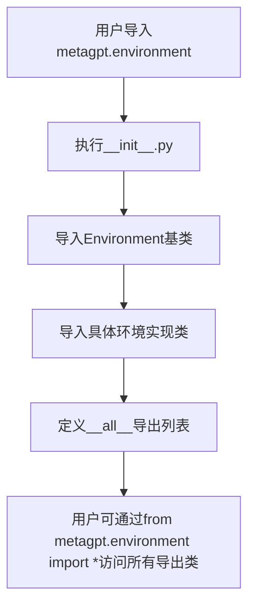

# `.\MetaGPT\metagpt\environment\__init__.py` 详细设计文档

该文件是metagpt.environment包的初始化模块，主要功能是集中导出和暴露该包下的各种环境实现类，为上层应用提供统一的环境接口访问入口。它通过导入具体的环境类并定义__all__列表来控制包的公开接口。

## 整体流程



## 类结构

```
metagpt.environment包结构
├── __init__.py (当前文件)
├── base_env.py
│   └── Environment (基类)
├── android/
│   └── android_env.py
│       └── AndroidEnv
├── werewolf/
│   └── werewolf_env.py
│       └── WerewolfEnv
├── stanford_town/
│   └── stanford_town_env.py
│       └── StanfordTownEnv
└── software/
    └── software_env.py
        └── SoftwareEnv
```

## 全局变量及字段


### `__all__`
    
定义模块的公共接口，控制使用 from metagpt.environment import * 时导入哪些类。

类型：`List[str]`
    


    

## 全局函数及方法


## 关键组件


### Environment

一个抽象基类，定义了环境的基本接口，为不同具体环境（如Android、狼人杀、斯坦福小镇、软件环境）提供统一的交互基础。

### AndroidEnv

一个具体的环境类，用于模拟或连接Android设备环境，支持与Android应用进行交互。

### WerewolfEnv

一个具体的环境类，用于模拟狼人杀游戏环境，管理游戏状态并处理玩家与游戏世界的交互。

### StanfordTownEnv

一个具体的环境类，用于模拟斯坦福小镇环境，支持智能体在虚拟小镇中进行社交、探索等行为。

### SoftwareEnv

一个具体的环境类，用于模拟软件操作环境，支持与软件界面或命令行进行交互以执行任务。


## 问题及建议


### 已知问题

-   **导入语句被注释**：代码中 `from metagpt.environment.android.android_env import AndroidEnv` 这一行被注释掉了，但 `__all__` 列表中仍然包含了 `"AndroidEnv"`。这会导致其他模块尝试从本模块导入 `AndroidEnv` 时引发 `ImportError`，因为该名称实际上并未被导出。
-   **潜在的循环导入风险**：该文件作为环境模块的集中导出点，如果各个环境类（如 `WerewolfEnv`, `StanfordTownEnv`）之间存在复杂的相互依赖关系，或者它们都引用了本文件中的某些定义，可能会引发循环导入问题，尤其是在大型项目中。
-   **维护性风险**：随着新环境类型的增加，需要手动更新 `__all__` 列表和导入语句。如果忘记同步更新，会导致导出不一致，增加维护负担。

### 优化建议

-   **修复不一致的导出**：取消对 `AndroidEnv` 导入语句的注释，或者将其从 `__all__` 列表中移除，以确保导出的名称与实际可用的对象保持一致。
-   **采用动态导出或重构结构**：考虑使用 `__init__.py` 文件的特性进行更灵活的导出，或者重构项目结构，将不同环境的导出分散到各自的子模块中，由上层统一管理，以降低耦合度和维护成本。
-   **添加明确的依赖说明**：在模块或项目文档中，明确说明各个环境类之间的依赖关系和约束，帮助开发者理解潜在的导入限制，避免在扩展时引入循环依赖。
-   **考虑使用工具进行静态检查**：引入代码质量工具（如 `flake8`, `pylint`）或编写特定的导入检查脚本，在持续集成流程中自动检测 `__all__` 列表与真实导出对象之间的不一致问题。


## 其它


### 设计目标与约束

该模块的设计目标是提供一个灵活、可扩展的环境基类（`Environment`）以及一系列针对特定场景（如狼人杀、斯坦福小镇、软件环境等）的具体环境实现。其核心约束包括：1) 所有具体环境必须继承自 `Environment` 基类，遵循统一的接口契约；2) 模块应支持动态导入和注册新的环境类型，以方便扩展；3) 代码结构应清晰，便于维护和理解不同环境间的差异。

### 错误处理与异常设计

当前代码主要为导入和导出声明，未包含显式的错误处理逻辑。错误处理主要依赖于Python的默认导入机制（如 `ImportError`）和基类 `Environment` 中可能定义的相关异常。建议在具体环境类的实现中，针对环境初始化、状态更新、动作执行等关键操作定义明确的异常类型（如 `EnvironmentInitializationError`, `InvalidActionError`），并实现相应的异常处理逻辑，以提高系统的健壮性和可调试性。

### 数据流与状态机

模块本身不直接定义数据流或状态机。数据流和状态机的逻辑应由各个具体环境类（如 `WerewolfEnv`, `StanfordTownEnv`）在其内部实现。通常，一个环境类会维护内部状态，并提供方法（如 `step`, `reset`）来接收外部动作，更新状态，并返回新的观察结果、奖励和完成标志。`Environment` 基类应定义这些核心方法的接口，由子类具体实现其特定的状态转移逻辑。

### 外部依赖与接口契约

1.  **外部依赖**：
    *   **内部依赖**：依赖 `metagpt.environment.base_env` 模块中的 `Environment` 基类。
    *   **潜在外部依赖**：具体环境实现（如 `WerewolfEnv`, `SoftwareEnv`）可能依赖额外的第三方库或框架（如模拟器、游戏引擎、特定SDK），这些依赖应在各自的子模块中声明和管理。
2.  **接口契约**：
    *   **导出契约**：通过 `__all__` 列表明确导出了 `AndroidEnv`（尽管当前被注释）、`WerewolfEnv`、`StanfordTownEnv`、`SoftwareEnv` 和 `Environment`。这向使用者承诺了本模块公开可用的类和接口。
    *   **基类契约**：所有导出的具体环境类都应继承自 `Environment`，并实现其定义的抽象方法（如 `step`, `reset`, `get_observation` 等），确保它们可以被统一的方式使用。

### 配置管理与初始化

当前模块未显示环境配置的加载或初始化逻辑。建议在具体环境类中设计清晰的配置参数（如游戏规则、地图大小、角色属性等），并通过构造函数、配置文件或环境变量等方式进行初始化。`Environment` 基类可以定义一个通用的配置接口或基类，子类可以扩展它以适应特定需求。模块级别的初始化（如环境注册表）可能在未来扩展时需要考虑。

### 测试策略

测试应针对各个具体环境类分别进行，重点验证：
1.  **环境初始化**：能否根据给定配置正确创建环境实例。
2.  **核心方法**：`step` 方法能否正确处理有效/无效动作，并正确更新状态和返回结果；`reset` 方法能否将环境重置到初始状态。
3.  **状态一致性**：环境内部状态在多次 `step` 操作后是否保持一致性和正确性。
4.  **接口合规性**：所有具体环境类是否完全遵守 `Environment` 基类定义的接口契约。
   由于环境可能涉及复杂交互或外部依赖，测试可能需要使用模拟（Mock）或桩（Stub）技术。

    