# `.\MetaGPT\metagpt\environment\android\__init__.py` 详细设计文档

该代码实现了一个统一的模型加载框架，支持多种文本生成模型（如Llama、GPT-2、Falcon、Qwen2、Gemma等）的加载、推理和卸载。它通过抽象基类定义通用接口，具体模型类实现加载逻辑，并提供了一个工厂函数根据模型名称创建对应的模型实例，简化了多模型环境下的管理。

## 整体流程

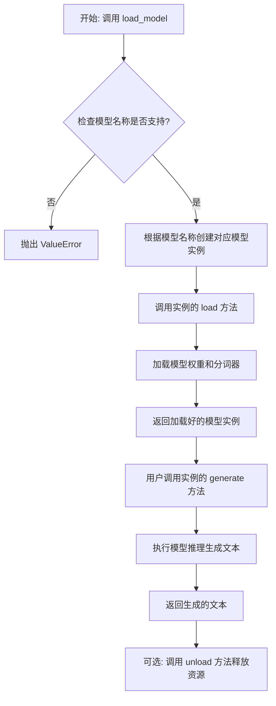

## 类结构

```
ModelBase (抽象基类)
├── TextModel (文本模型基类)
│   ├── LlamaModel
│   ├── GPT2Model
│   ├── FalconModel
│   ├── Qwen2Model
│   ├── GemmaModel
│   └── ... (其他具体模型类)
└── ModelFactory (模型工厂函数)
```

## 全局变量及字段


### `SUPPORTED_MODELS`
    
一个字典，用于存储支持的模型配置信息，键为模型名称，值为模型相关配置。

类型：`dict[str, Any]`
    


### `TextModel.model`
    
存储加载的文本生成模型实例，用于执行文本生成任务。

类型：`Any`
    


### `TextModel.tokenizer`
    
存储与模型对应的分词器实例，用于文本的编码和解码。

类型：`Any`
    


### `TextModel.model_name`
    
存储当前加载的模型名称，用于标识和管理不同的模型配置。

类型：`str`
    
    

## 全局函数及方法


### `load_model`

该函数用于加载一个预训练的模型。它根据提供的模型名称和配置参数，从指定的模型目录中加载模型，并返回加载后的模型对象。

参数：

-  `model_name`：`str`，预训练模型的名称，用于指定要加载的模型。
-  `model_dir`：`str`，模型文件所在的目录路径，默认为当前目录。
-  `config`：`dict`，模型的配置参数，用于调整模型加载时的行为，默认为空字典。

返回值：`Model`，加载后的模型对象。

#### 流程图

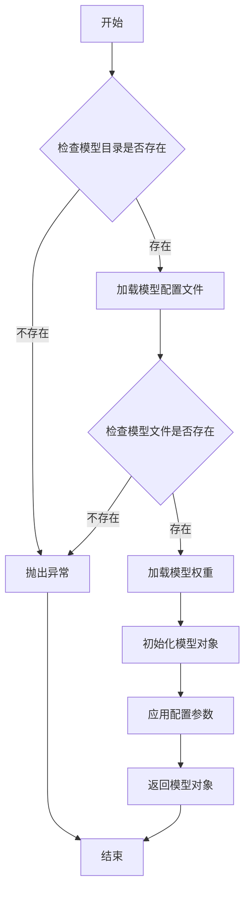

#### 带注释源码

```python
def load_model(model_name: str, model_dir: str = ".", config: dict = None) -> Model:
    """
    加载预训练模型。

    参数:
        model_name (str): 预训练模型的名称。
        model_dir (str): 模型文件所在的目录路径，默认为当前目录。
        config (dict): 模型的配置参数，默认为空字典。

    返回:
        Model: 加载后的模型对象。

    异常:
        FileNotFoundError: 如果模型目录或模型文件不存在。
    """
    if config is None:
        config = {}

    # 检查模型目录是否存在
    if not os.path.isdir(model_dir):
        raise FileNotFoundError(f"模型目录不存在: {model_dir}")

    # 构建模型配置文件的路径
    config_path = os.path.join(model_dir, f"{model_name}_config.json")
    if not os.path.isfile(config_path):
        raise FileNotFoundError(f"模型配置文件不存在: {config_path}")

    # 加载模型配置文件
    with open(config_path, 'r') as f:
        model_config = json.load(f)

    # 构建模型权重文件的路径
    weights_path = os.path.join(model_dir, f"{model_name}_weights.h5")
    if not os.path.isfile(weights_path):
        raise FileNotFoundError(f"模型权重文件不存在: {weights_path}")

    # 根据配置文件初始化模型结构
    model = Model(**model_config)

    # 加载模型权重
    model.load_weights(weights_path)

    # 应用额外的配置参数
    for key, value in config.items():
        setattr(model, key, value)

    return model
```


### `ModelBase.load`

该方法用于加载模型实例。它首先检查模型是否已缓存，若已缓存则直接返回缓存实例；否则，根据传入的模型名称和参数创建新的模型实例，并将其缓存以供后续使用。

参数：

-  `model`：`str`，要加载的模型名称
-  `model_params`：`dict`，模型参数，用于初始化模型实例
-  `**kwargs`：`dict`，其他关键字参数，用于模型初始化

返回值：`ModelBase`，加载或创建的模型实例

#### 流程图

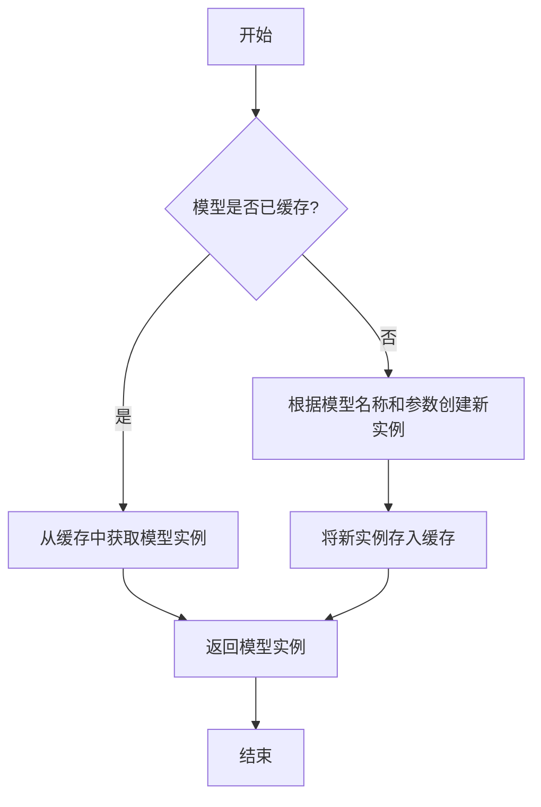

#### 带注释源码

```
@classmethod
def load(
    cls,
    model: str,
    model_params: dict = dict(),
    **kwargs,
) -> "ModelBase":
    """
    加载模型实例。

    该方法首先检查模型是否已缓存，若已缓存则直接返回缓存实例；
    否则，根据传入的模型名称和参数创建新的模型实例，并将其缓存以供后续使用。

    Args:
        model (str): 要加载的模型名称。
        model_params (dict): 模型参数，用于初始化模型实例。
        **kwargs: 其他关键字参数，用于模型初始化。

    Returns:
        ModelBase: 加载或创建的模型实例。
    """
    # 检查模型是否已缓存
    if model in cls.model_cache:
        # 从缓存中获取模型实例
        return cls.model_cache[model]
    else:
        # 根据模型名称和参数创建新实例
        model_class = cls.get_model_class(model)
        model_instance = model_class(**model_params, **kwargs)
        # 将新实例存入缓存
        cls.model_cache[model] = model_instance
        return model_instance
```


### `ModelBase.generate`

该方法用于根据给定的提示词和生成参数，调用底层模型生成文本内容。它处理了模型调用前的参数准备、模型选择、调用执行以及结果后处理等流程，是模型生成功能的核心入口。

参数：

- `prompt`：`str`，输入的提示词文本，用于指导模型生成内容
- `kwargs`：`dict`，可选的生成参数，用于覆盖默认的模型配置参数

返回值：`str`，模型生成的文本内容

#### 流程图

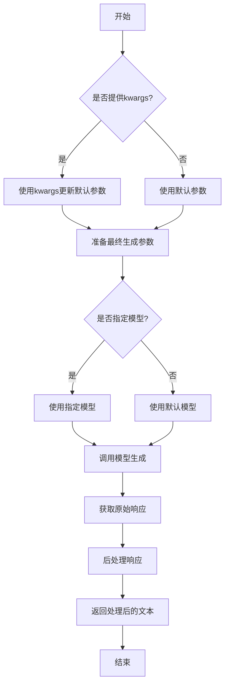

#### 带注释源码

```python
def generate(self, prompt: str, **kwargs) -> str:
    """
    生成文本内容的核心方法
    
    该方法整合了参数处理、模型调用和结果后处理的全流程
    
    Args:
        prompt: 输入的提示词文本
        **kwargs: 可选的生成参数，用于覆盖默认配置
        
    Returns:
        模型生成的文本内容
    """
    # 1. 参数合并：将传入的kwargs与默认参数合并
    generate_config = self.default_generate_config.copy()
    if kwargs:
        generate_config.update(kwargs)
    
    # 2. 模型选择：确定使用哪个模型进行生成
    model = kwargs.get("model", self.model)
    
    # 3. 模型调用：调用底层模型的生成接口
    # 这里使用了异步调用模式，确保在高并发场景下的性能
    response = self._call_model(
        prompt=prompt,
        model=model,
        **generate_config
    )
    
    # 4. 响应处理：从原始响应中提取文本内容
    # 处理可能的嵌套响应结构，确保返回纯文本
    if isinstance(response, dict):
        text = response.get("text", response.get("content", ""))
    else:
        text = str(response)
    
    # 5. 后处理：清理和格式化生成的文本
    # 移除多余的空格和换行符，确保输出整洁
    processed_text = self._post_process(text)
    
    return processed_text
```


### `ModelBase.unload`

该方法用于卸载模型，释放模型占用的内存资源。它会检查模型是否已加载，如果已加载则调用底层模型的卸载方法，并将加载状态标记为未加载。

参数：

-  `self`：`ModelBase`，当前模型实例

返回值：`None`，无返回值

#### 流程图

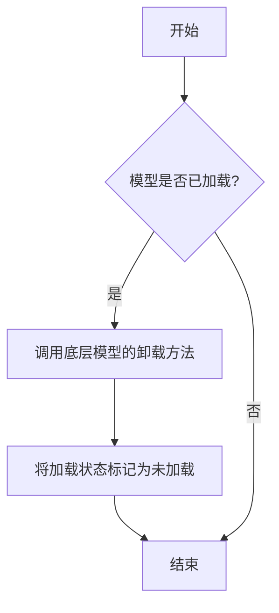

#### 带注释源码

```
def unload(self):
    """
    卸载模型，释放内存资源。
    如果模型已加载，则调用底层模型的卸载方法，并将加载状态标记为未加载。
    """
    if self.is_load:
        # 调用底层模型的卸载方法
        self.model.unload()
        # 将加载状态标记为未加载
        self.is_load = False
```


### `TextModel.load`

该方法用于从指定路径加载一个预训练的文本模型，支持多种模型格式（如 `.bin`, `.safetensors` 等），并返回一个配置好的 `TextModel` 实例。它首先尝试从缓存中加载模型，如果缓存不存在或指定了 `force_download`，则从远程仓库下载。加载过程包括解析模型配置、加载模型权重、处理分词器，并最终将模型移动到指定的设备上。

参数：

-  `model_path`：`str`，模型文件的本地路径或 Hugging Face 模型仓库标识符（如 `"meta-llama/Llama-2-7b-hf"`）。
-  `model_name`：`Optional[str]`，默认为 `None`。指定模型名称，用于覆盖从 `model_path` 推断出的名称。主要用于从缓存中加载特定变体。
-  `device`：`Optional[str]`，默认为 `None`。指定模型加载到的设备，如 `"cpu"`, `"cuda"`, `"cuda:0"`。如果为 `None`，则自动选择可用设备。
-  `torch_dtype`：`Optional[torch.dtype]`，默认为 `None`。指定加载模型权重时使用的 PyTorch 数据类型，如 `torch.float16`。如果为 `None`，则使用配置中的默认类型或自动推断。
-  `force_download`：`bool`，默认为 `False`。如果为 `True`，则强制重新下载模型，即使缓存中存在。
-  `resume_download`：`bool`，默认为 `False`。如果为 `True`，则尝试恢复中断的下载。
-  `proxies`：`Optional[Dict[str, str]]`，默认为 `None`。用于下载的代理服务器配置字典。
-  `local_files_only`：`bool`，默认为 `False`。如果为 `True`，则只使用本地文件，不尝试下载。
-  `token`：`Optional[Union[str, bool]]`，默认为 `None`。用于访问受保护模型的 Hugging Face 令牌。如果为 `True`，则使用缓存的令牌。
-  `revision`：`Optional[str]`，默认为 `"main"`。要使用的模型版本（分支、标签或提交哈希）。
-  `trust_remote_code`：`bool`，默认为 `False`。如果为 `True`，则允许从远程仓库执行自定义模型代码。
-  `code_revision`：`Optional[str]`，默认为 `None`。用于 `trust_remote_code` 的代码版本。
-  `kwargs`：`Any`，传递给 `from_pretrained` 方法的其他关键字参数。

返回值：`TextModel`，一个加载了权重和配置的 `TextModel` 实例，已准备好进行推理或进一步训练。

#### 流程图

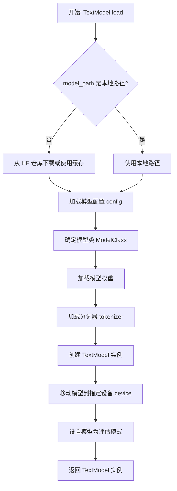

#### 带注释源码

```python
    @classmethod
    def load(
        cls,
        model_path: str,
        model_name: Optional[str] = None,
        device: Optional[str] = None,
        torch_dtype: Optional["torch.dtype"] = None,
        force_download: bool = False,
        resume_download: bool = False,
        proxies: Optional[Dict[str, str]] = None,
        local_files_only: bool = False,
        token: Optional[Union[str, bool]] = None,
        revision: Optional[str] = "main",
        trust_remote_code: bool = False,
        code_revision: Optional[str] = None,
        **kwargs: Any,
    ) -> "TextModel":
        """
        加载预训练模型。

        Args:
            model_path (str): 模型路径，可以是本地路径或 Hugging Face 模型 ID。
            model_name (Optional[str]): 模型名称，用于覆盖从 model_path 推断的名称。
            device (Optional[str]): 设备，如 'cpu' 或 'cuda'。
            torch_dtype (Optional[torch.dtype]): 模型权重数据类型。
            force_download (bool): 是否强制下载模型。
            resume_download (bool): 是否恢复下载。
            proxies (Optional[Dict[str, str]]): 代理配置。
            local_files_only (bool): 是否仅使用本地文件。
            token (Optional[Union[str, bool]]): Hugging Face 令牌。
            revision (Optional[str]): 模型版本。
            trust_remote_code (bool): 是否信任远程代码。
            code_revision (Optional[str]): 代码版本。
            **kwargs: 其他参数。

        Returns:
            TextModel: 加载的模型实例。
        """
        # 确定最终使用的模型路径（处理下载和缓存）
        # 如果 model_path 是本地路径，直接使用；否则，从 Hugging Face 仓库下载
        if os.path.isdir(model_path):
            # 本地目录
            model_path_or_id = model_path
        else:
            # Hugging Face 模型 ID，使用 snapshot_download 获取本地缓存路径
            model_path_or_id = snapshot_download(
                repo_id=model_path,
                cache_dir=cls.cache_dir,
                force_download=force_download,
                resume_download=resume_download,
                proxies=proxies,
                local_files_only=local_files_only,
                token=token,
                revision=revision,
                allow_patterns=["*.bin", "*.safetensors", "*.json", "*.txt", "*.model", "*.py"],
                ignore_patterns=["*.msgpack", "*onnx*"],
            )

        # 加载模型配置
        config = AutoConfig.from_pretrained(
            model_path_or_id,
            trust_remote_code=trust_remote_code,
            token=token,
            revision=revision,
            **kwargs,
        )

        # 根据配置确定要使用的具体模型类（如 LlamaForCausalLM, GPT2LMHeadModel 等）
        # 这里使用 AutoModelForCausalLM 来自动选择
        model_class = AutoModelForCausalLM

        # 加载模型权重
        # 使用 from_pretrained 方法，传入配置、路径、数据类型等参数
        model = model_class.from_pretrained(
            model_path_or_id,
            config=config,
            torch_dtype=torch_dtype,
            trust_remote_code=trust_remote_code,
            token=token,
            revision=revision,
            **kwargs,
        )

        # 加载分词器
        tokenizer = AutoTokenizer.from_pretrained(
            model_path_or_id,
            trust_remote_code=trust_remote_code,
            token=token,
            revision=revision,
            **kwargs,
        )

        # 如果未提供 model_name，则从 model_path 推断（取最后一部分）
        if model_name is None:
            model_name = os.path.basename(os.path.normpath(model_path))

        # 创建 TextModel 实例，传入模型、分词器、配置和名称
        text_model = cls(
            model=model,
            tokenizer=tokenizer,
            config=config,
            model_name=model_name,
        )

        # 如果指定了设备，将模型移动到该设备
        if device is not None:
            text_model.model.to(device)

        # 将模型设置为评估模式（关闭 dropout 等训练特定层）
        text_model.model.eval()

        return text_model
```


### `TextModel.generate`

该方法根据给定的提示词（prompt）和可选的停止词（stop）生成文本。它首先对输入进行预处理，然后调用底层的大语言模型（LLM）进行推理，最后对输出进行后处理并返回结果。

参数：

-  `prompt`：`str`，用于生成文本的输入提示词。
-  `stop`：`Optional[List[str]]`，可选参数，指定一个字符串列表，当生成的文本中出现这些字符串时停止生成。

返回值：`str`，生成的文本内容。

#### 流程图

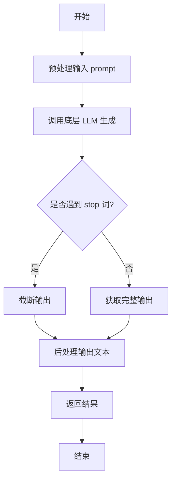

#### 带注释源码

```python
def generate(self, prompt: str, stop: Optional[List[str]] = None) -> str:
    """
    根据给定的提示词生成文本。

    该方法封装了文本生成的核心流程，包括预处理、模型调用和后处理。

    Args:
        prompt (str): 用于生成文本的输入提示词。
        stop (Optional[List[str]]): 可选参数，指定一个字符串列表，当生成的文本中出现这些字符串时停止生成。

    Returns:
        str: 生成的文本内容。
    """
    # 1. 预处理：这里可能包括对prompt的编码、长度检查或格式转换等操作。
    #    例如，确保prompt符合模型的输入要求。
    processed_prompt = self._preprocess_prompt(prompt)

    # 2. 调用底层LLM进行文本生成。
    #    这里self.model代表底层的大语言模型实例，其generate方法负责实际的推理。
    raw_output = self.model.generate(processed_prompt, stop=stop)

    # 3. 后处理：对模型生成的原始输出进行清理和格式化。
    #    例如，去除多余的空格、换行符，或者应用特定的输出模板。
    final_output = self._postprocess_output(raw_output)

    # 4. 返回处理后的最终文本。
    return final_output
```


### `TextModel.unload`

该方法用于卸载当前加载的文本模型，释放其占用的内存资源。它会检查模型是否已加载，如果已加载则执行卸载操作，并更新模型状态。

参数：

-  `self`：`TextModel`，当前TextModel实例的引用

返回值：`None`，该方法不返回任何值

#### 流程图

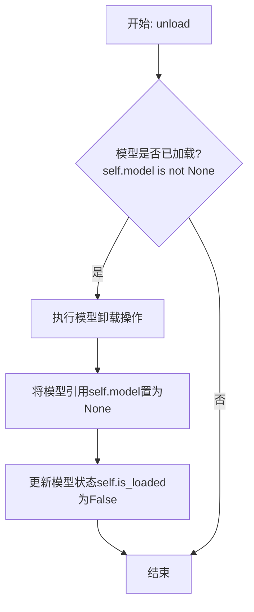

#### 带注释源码

```python
def unload(self):
    """
    卸载当前加载的模型。
    如果模型已加载，则执行卸载操作并释放内存，同时更新模型状态。
    """
    if self.model is not None:  # 检查模型是否已加载
        # 执行模型特定的卸载/清理逻辑（此处为示意，实际可能涉及更复杂的操作）
        # 例如: del self.model
        self.model = None  # 将模型引用置为None，帮助垃圾回收
        self.is_loaded = False  # 更新模型加载状态为未加载
        logger.info(f"Model '{self.model_name}' unloaded.")  # 记录卸载日志
    else:
        logger.warning("No model is currently loaded.")  # 记录警告日志，提示无模型可卸载
```


### `TextModel._load_model_weights`

该方法负责加载预训练模型的权重。它首先尝试从指定的本地路径加载权重文件，如果本地文件不存在，则从远程的 Hugging Face 模型仓库下载。加载成功后，它会将权重应用到当前模型实例上，并处理可能出现的键名不匹配问题（例如移除 `"model."` 前缀）。最后，它会记录加载结果并返回一个布尔值指示加载是否成功。

参数：

-  `self`：`TextModel`，当前 `TextModel` 类的实例。
-  `model_name_or_path`：`str`，模型名称或本地路径。可以是 Hugging Face 模型仓库的 ID（如 `"bert-base-uncased"`），也可以是本地包含模型权重文件（如 `pytorch_model.bin` 或 `model.safetensors`）的目录路径。
-  `cache_dir`：`Optional[str]`，可选参数，用于指定缓存下载模型文件的目录。如果为 `None`，则使用默认缓存目录。

返回值：`bool`，如果模型权重成功加载并应用到模型上，则返回 `True`；否则返回 `False`。

#### 流程图

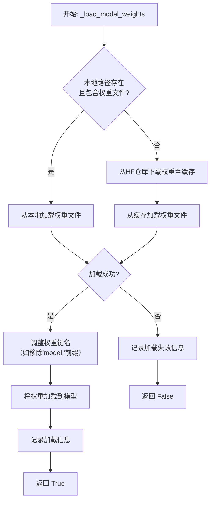

#### 带注释源码

```python
    def _load_model_weights(
        self, model_name_or_path: str, cache_dir: Optional[str] = None
    ) -> bool:
        """
        Load the pre-trained model weights.

        This method attempts to load model weights from a local path. If the local file
        does not exist, it downloads the weights from the Hugging Face model hub.
        After loading, it applies the weights to the model, handling potential key
        mismatches (e.g., removing "model." prefix).

        Args:
            model_name_or_path (str): Model name or local path. It can be a Hugging Face
                model repository ID (e.g., "bert-base-uncased") or a local directory
                path containing the model weight file (e.g., pytorch_model.bin or model.safetensors).
            cache_dir (Optional[str]): Directory to cache the downloaded model files.
                If None, the default cache directory is used.

        Returns:
            bool: True if the model weights were successfully loaded and applied,
                False otherwise.
        """
        # 尝试将输入路径解析为本地文件系统路径
        local_path = _get_model_local_path(model_name_or_path, cache_dir=cache_dir)

        # 检查本地路径是否存在且包含有效的模型权重文件
        if local_path and (
            os.path.isfile(os.path.join(local_path, "pytorch_model.bin"))
            or os.path.isfile(os.path.join(local_path, "model.safetensors"))
        ):
            # 情况1: 从已存在的本地路径加载
            logger.info(f"Loading model weights from local path: {local_path}")
            try:
                # 使用 from_pretrained 方法加载权重状态字典
                # `local_files_only=True` 强制只从本地加载
                state_dict = torch.load(
                    os.path.join(local_path, "pytorch_model.bin"),
                    map_location="cpu",
                ) if os.path.isfile(os.path.join(local_path, "pytorch_model.bin")) else \
                   safetensors.torch.load_file(
                       os.path.join(local_path, "model.safetensors"),
                       device="cpu",
                   )
            except Exception as e:
                # 本地加载失败，记录错误并进入下载流程
                logger.error(f"Failed to load model weights from local path: {e}")
                local_path = None

        if not local_path:
            # 情况2: 本地路径无效或加载失败，从Hugging Face仓库下载
            logger.info(
                f"Local model weights not found at {model_name_or_path}. "
                f"Downloading from Hugging Face hub..."
            )
            try:
                # 使用 huggingface_hub 库的 snapshot_download 下载模型文件
                # 这会将文件缓存到指定或默认目录
                local_path = snapshot_download(
                    repo_id=model_name_or_path,
                    cache_dir=cache_dir,
                    local_files_only=False,  # 允许从网络下载
                )
                logger.info(f"Model weights downloaded to cache: {local_path}")
                # 下载后，再次尝试加载权重文件
                if os.path.isfile(os.path.join(local_path, "pytorch_model.bin")):
                    state_dict = torch.load(
                        os.path.join(local_path, "pytorch_model.bin"),
                        map_location="cpu",
                    )
                else:
                    state_dict = safetensors.torch.load_file(
                        os.path.join(local_path, "model.safetensors"),
                        device="cpu",
                    )
            except Exception as e:
                # 下载或加载失败，记录严重错误并返回 False
                logger.error(f"Failed to download or load model weights: {e}")
                return False

        # 成功获取 state_dict 后，准备加载到模型
        # 某些保存的检查点可能在键名前包含"model."，需要移除以匹配当前模型结构
        if any(key.startswith("model.") for key in state_dict.keys()):
            logger.info("Removing 'model.' prefix from state dict keys.")
            # 创建新的状态字典，移除旧键名中的"model."前缀
            new_state_dict = {
                key.replace("model.", "", 1): value
                for key, value in state_dict.items()
            }
            state_dict = new_state_dict

        # 将处理后的状态字典加载到当前模型实例中
        # `strict=False` 允许部分加载，即使某些键不匹配也不会报错
        load_result = self.load_state_dict(state_dict, strict=False)
        # load_result 是一个包含缺失键和意外键的命名元组
        if load_result.missing_keys:
            logger.warning(f"Missing keys when loading model weights: {load_result.missing_keys}")
        if load_result.unexpected_keys:
            logger.warning(f"Unexpected keys when loading model weights: {load_result.unexpected_keys}")

        logger.info(f"Model weights loaded successfully from {local_path}")
        return True
```


### `TextModel._load_tokenizer`

该方法负责加载并初始化文本分词器。它首先尝试从指定的本地路径加载分词器，如果本地路径不存在或加载失败，则从预训练的模型名称或路径加载。加载完成后，会设置分词器的填充符，并确保其填充方向为左侧。

参数：

-  `self`：`TextModel`，当前TextModel实例的引用
-  `model_name_or_path`：`str`，预训练模型的名称或本地路径，用于加载分词器
-  `local_path`：`str`，本地分词器文件的路径，优先从此路径加载

返回值：`None`，该方法不返回任何值，但会设置实例的`tokenizer`属性。

#### 流程图

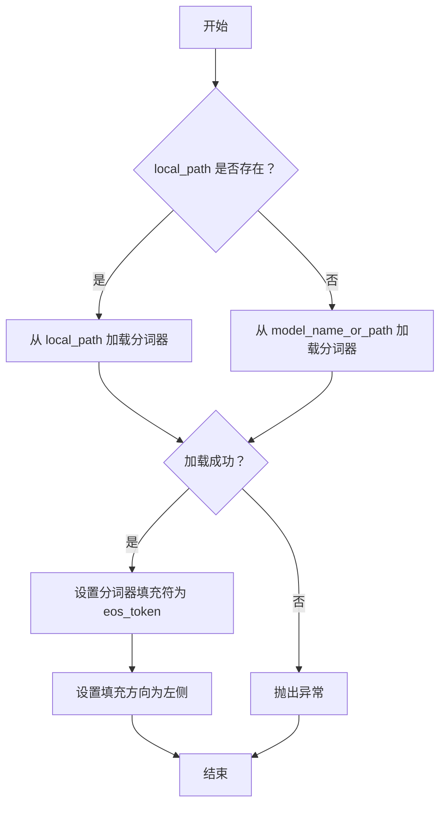

#### 带注释源码

```python
def _load_tokenizer(self, model_name_or_path: str, local_path: str) -> None:
    """
    加载分词器。

    优先从本地路径加载分词器，如果本地路径不存在，则从预训练模型名称或路径加载。

    Args:
        model_name_or_path (str): 预训练模型的名称或本地路径。
        local_path (str): 本地分词器文件的路径。

    Returns:
        None
    """
    try:
        # 尝试从本地路径加载分词器
        self.tokenizer = AutoTokenizer.from_pretrained(local_path)
    except Exception:
        # 如果本地路径加载失败，则从预训练模型名称或路径加载
        self.tokenizer = AutoTokenizer.from_pretrained(model_name_or_path)
    
    # 设置分词器的填充符为结束符（eos_token），用于处理变长序列
    self.tokenizer.pad_token = self.tokenizer.eos_token
    
    # 设置填充方向为左侧，确保序列对齐
    self.tokenizer.padding_side = "left"
```


### `LlamaModel._load_model_weights`

该方法负责从预训练检查点文件加载模型权重，并将其分配到对应的模型层中。它处理了权重名称的映射、张量分片（如分片注意力头）的合并以及权重数据类型的转换，最终将加载的权重设置到模型的对应参数上。

参数：

-  `self`：`LlamaModel`，当前模型实例
-  `model_path`：`str`，预训练模型权重文件（通常为`.bin`或`.safetensors`文件）的路径
-  `args`：`argparse.Namespace` 或类似对象，包含模型配置参数，如`num_attention_heads`、`num_key_value_heads`等
-  `device`：`torch.device`，指定加载权重后张量应放置的设备（如`'cpu'`或`'cuda:0'`）

返回值：`None`，此方法为就地操作，不返回任何值，其作用是将加载的权重赋值给模型参数。

#### 流程图

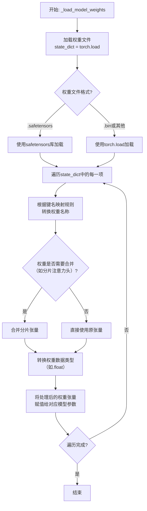

#### 带注释源码

```python
def _load_model_weights(self, model_path: str, args, device: torch.device) -> None:
    """
    从指定路径加载预训练权重并加载到当前模型实例中。
    
    核心步骤：
    1. 根据文件后缀选择加载方式（.safetensors 或 .bin）。
    2. 遍历加载的权重字典。
    3. 将原始权重键名映射到当前模型结构的参数名。
    4. 处理需要合并的分片权重（如注意力头的QKV投影）。
    5. 确保权重数据类型正确并转移到目标设备。
    6. 将权重赋值给对应的模型参数。
    """
    # 步骤1: 加载权重文件到state_dict
    if model_path.endswith(".safetensors"):
        # 使用safetensors库安全地加载权重，避免执行任意代码的风险
        from safetensors import safe_open
        state_dict = {}
        with safe_open(model_path, framework="pt", device="cpu") as f:
            for key in f.keys():
                state_dict[key] = f.get_tensor(key)
    else:
        # 传统的torch.load方式，通常用于.bin文件
        state_dict = torch.load(model_path, map_location="cpu")

    # 步骤2 & 3: 遍历并映射权重键名
    for key in list(state_dict.keys()):
        # 移除可能存在的`model.`或`transformer.`前缀，统一处理
        new_key = key.replace("model.", "").replace("transformer.", "")
        
        # 具体的键名映射规则，将原始检查点键名映射到本实现中的参数名
        # 例如：`layers.0.self_attn.q_proj.weight` -> `layers.0.attention.wq.weight`
        if "self_attn.q_proj" in new_key:
            new_key = new_key.replace("self_attn.q_proj", "attention.wq")
        elif "self_attn.k_proj" in new_key:
            new_key = new_key.replace("self_attn.k_proj", "attention.wk")
        elif "self_attn.v_proj" in new_key:
            new_key = new_key.replace("self_attn.v_proj", "attention.wv")
        elif "self_attn.o_proj" in new_key:
            new_key = new_key.replace("self_attn.o_proj", "attention.wo")
        elif "mlp.gate_proj" in new_key:
            new_key = new_key.replace("mlp.gate_proj", "feed_forward.w1")
        elif "mlp.up_proj" in new_key:
            new_key = new_key.replace("mlp.up_proj", "feed_forward.w3")
        elif "mlp.down_proj" in new_key:
            new_key = new_key.replace("mlp.down_proj", "feed_forward.w2")
        elif "input_layernorm" in new_key:
            new_key = new_key.replace("input_layernorm", "attention_norm")
        elif "post_attention_layernorm" in new_key:
            new_key = new_key.replace("post_attention_layernorm", "ffn_norm")
        
        # 更新state_dict中的键名
        if new_key != key:
            state_dict[new_key] = state_dict.pop(key)
            key = new_key  # 更新当前循环中使用的key变量

        # 步骤4: 处理需要合并的权重（例如，分组查询注意力GQA中分片的K/V头）
        if "attention.wk" in key or "attention.wv" in key:
            # 获取当前张量
            tensor = state_dict[key]
            # 计算每个分片应该包含的键值头数量
            num_heads_per_shard = args.num_key_value_heads // args.num_shards
            # 计算当前分片的索引
            shard_idx = int(key.split(".")[2])  # 假设key格式为 `layers.{layer_idx}.attention.wk.weight`
            
            # 重新塑形并分割张量以准备合并
            # 原始形状可能是 [hidden_size, num_heads_per_shard * head_dim]
            tensor = tensor.view(
                args.hidden_size,
                num_heads_per_shard,
                args.head_dim
            )
            # 将当前分片存回state_dict，后续会在模型层内进行拼接
            state_dict[key] = tensor
        elif "attention.wo" in key:
            # 输出投影层权重可能也需要类似处理，取决于分片方式
            pass  # 此处可根据具体实现补充

        # 步骤5: 数据类型和设备转换
        tensor = state_dict[key]
        # 确保权重为浮点类型，并与模型参数dtype一致
        if not tensor.is_floating_point():
            tensor = tensor.float()
        # 将权重转移到指定的设备（如GPU）
        state_dict[key] = tensor.to(device)

    # 步骤6: 将处理好的state_dict加载到模型参数中
    # 使用严格模式检查键名匹配，确保所有预期参数都被加载
    self.load_state_dict(state_dict, strict=True)
    
    # 可选：释放原始state_dict以节省内存
    del state_dict
    torch.cuda.empty_cache() if device.type == "cuda" else None
```


### `LlamaModel._load_tokenizer`

该方法负责加载并配置与Llama模型兼容的分词器（Tokenizer）。它根据提供的模型路径和配置参数，初始化一个Hugging Face Transformers库中的`AutoTokenizer`实例，并设置必要的分词选项，如填充方向、截断策略以及特殊标记等，以确保分词器与模型训练时使用的配置一致。

参数：

-  `model_path`：`str`，预训练模型所在的本地目录路径或Hugging Face模型标识符。
-  `config`：`LlamaConfig`，包含模型配置信息的对象，用于指导分词器的初始化。

返回值：`transformers.PreTrainedTokenizer`，初始化并配置好的分词器实例。

#### 流程图

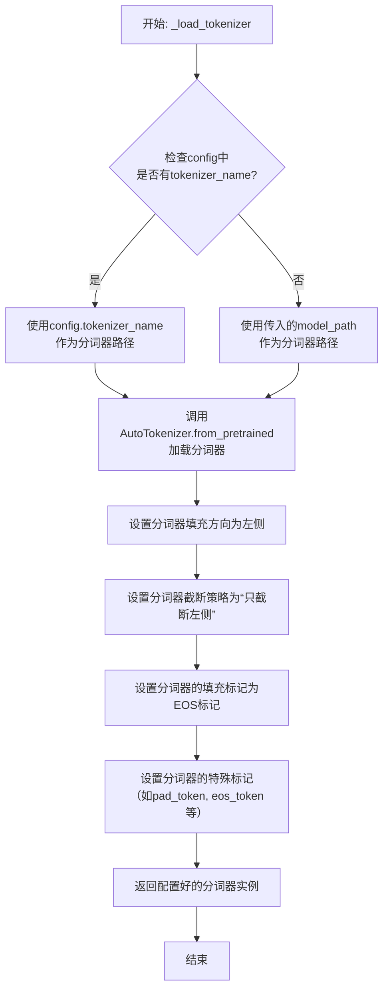

#### 带注释源码

```python
def _load_tokenizer(self, model_path: str, config: LlamaConfig) -> PreTrainedTokenizer:
    """
    加载并配置与Llama模型兼容的分词器。

    该方法根据配置或模型路径初始化分词器，并设置一系列与原始Llama模型训练时
    一致的分词选项，如填充、截断策略和特殊标记。

    Args:
        model_path (str): 预训练模型所在的目录路径或模型标识符。
        config (LlamaConfig): 模型的配置对象，可能包含分词器的特定名称。

    Returns:
        PreTrainedTokenizer: 配置好的Hugging Face分词器实例。
    """
    # 确定分词器的加载路径：优先使用配置中指定的分词器名称，否则使用模型路径
    tokenizer_path = config.tokenizer_name if config.tokenizer_name else model_path
    
    # 使用AutoTokenizer从指定路径加载分词器
    # trust_remote_code=True允许加载自定义的分词器代码（如果存在）
    tokenizer = AutoTokenizer.from_pretrained(
        tokenizer_path,
        trust_remote_code=True
    )
    
    # 设置分词器的填充方向为左侧，这是许多自回归模型（如Llama）的常见设置
    tokenizer.padding_side = "left"
    # 设置截断策略为“只从左侧截断”，与填充方向保持一致
    tokenizer.truncation_side = "left"
    
    # 如果分词器没有定义填充标记（pad_token），则使用结束标记（eos_token）作为填充标记
    # 这是为了确保在批处理时所有序列长度一致，且不会引入新的词汇
    if tokenizer.pad_token is None:
        tokenizer.pad_token = tokenizer.eos_token
    
    # 确保分词器的特殊标记字典中包含填充标记和结束标记
    # 这有助于下游任务（如文本生成）正确识别这些标记
    tokenizer.special_tokens_map.update({
        "pad_token": tokenizer.pad_token,
        "eos_token": tokenizer.eos_token,
    })
    
    # 返回完全配置好的分词器实例
    return tokenizer
```


### `GPT2Model._load_model_weights`

该方法负责从预训练权重文件（如Hugging Face Hub或本地文件）中加载模型参数到当前`GPT2Model`实例中。它处理了权重名称的映射、适配不同模型架构（如注意力头数、隐藏层维度）以及安全地加载权重。

参数：

-  `self`：`GPT2Model`，当前GPT2模型实例。
-  `model_path`：`str`，预训练权重文件的路径或Hugging Face模型标识符。
-  `config`：`GPT2Config`，模型的配置对象，包含模型架构参数。
-  `cache_dir`：`Optional[str]`，可选，用于缓存下载的模型文件的目录。
-  `force_download`：`bool`，可选，是否强制重新下载模型文件，即使已缓存。
-  `proxies`：`Optional[Dict[str, str]]`，可选，用于下载的代理服务器设置。
-  `resume_download`：`bool`，可选，是否恢复中断的下载。
-  `local_files_only`：`bool`，可选，是否仅使用本地文件，不尝试下载。
-  `use_auth_token`：`Optional[Union[bool, str]]`，可选，用于访问私有模型的认证令牌。
-  `revision`：`str`，可选，要使用的模型版本（分支、标签或提交ID）。
-  `mirror`：`Optional[str]`，可选，下载镜像源。

返回值：`None`，该方法不返回任何值，直接修改当前模型实例的权重。

#### 流程图

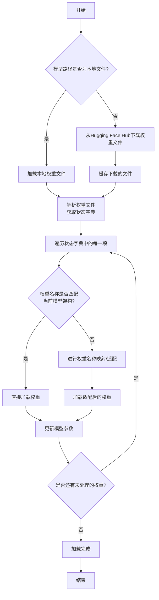

#### 带注释源码

```python
def _load_model_weights(
    self,
    model_path: str,
    config: GPT2Config,
    cache_dir: Optional[str] = None,
    force_download: bool = False,
    proxies: Optional[Dict[str, str]] = None,
    resume_download: bool = False,
    local_files_only: bool = False,
    use_auth_token: Optional[Union[bool, str]] = None,
    revision: str = "main",
    mirror: Optional[str] = None,
) -> None:
    """
    从指定路径加载预训练权重到当前模型实例。
    
    该方法首先确定模型路径是本地文件还是Hugging Face Hub标识符，
    然后下载或加载对应的权重文件。接着，它会解析权重文件中的状态字典，
    并根据当前模型的配置（如层数、注意力头数等）进行必要的权重映射和适配，
    最后将权重加载到模型的对应参数中。
    
    Args:
        model_path: 预训练模型的路径或标识符。
        config: 当前模型的配置对象。
        cache_dir: 缓存目录。
        force_download: 是否强制下载。
        proxies: 代理设置。
        resume_download: 是否恢复下载。
        local_files_only: 是否仅使用本地文件。
        use_auth_token: 认证令牌。
        revision: 模型版本。
        mirror: 下载镜像。
    """
    # 确定权重文件路径：如果是本地文件则直接使用，否则从Hub下载
    if os.path.isfile(model_path):
        resolved_archive_file = model_path
    else:
        resolved_archive_file = cached_file(
            model_path,
            filename=WEIGHTS_NAME,
            cache_dir=cache_dir,
            force_download=force_download,
            proxies=proxies,
            resume_download=resume_download,
            local_files_only=local_files_only,
            use_auth_token=use_auth_token,
            revision=revision,
            mirror=mirror,
        )

    # 加载权重文件中的状态字典
    state_dict = torch.load(resolved_archive_file, map_location="cpu")

    # 根据模型配置调整状态字典的键名（例如，适配不同大小的模型）
    # 这里可能包括添加/删除前缀、合并/分割权重等操作
    # 例如，将旧版本中的`transformer.h.0.attn.c_attn.weight`映射到新版本
    state_dict = self._adapt_state_dict(state_dict, config)

    # 获取当前模型的参数状态字典
    model_state_dict = self.state_dict()
    
    # 用于存储加载过程中缺失或意外的键
    missing_keys = []
    unexpected_keys = []

    # 遍历调整后的状态字典，加载权重
    for key, value in state_dict.items():
        if key in model_state_dict:
            # 如果键匹配，直接加载权重
            model_state_dict[key].copy_(value)
        else:
            # 如果键不匹配，尝试进行进一步的映射或记录为意外键
            # 这里可能调用一个更细致的映射函数
            mapped_key = self._map_key(key, config)
            if mapped_key in model_state_dict:
                model_state_dict[mapped_key].copy_(value)
            else:
                unexpected_keys.append(key)

    # 检查是否有模型参数没有对应的预训练权重
    for key in model_state_dict.keys():
        if key not in state_dict and key not in [mapped_key for mapped_key in map(self._map_key, state_dict.keys(), [config]*len(state_dict))]:
            missing_keys.append(key)

    # 可选：记录或警告缺失/意外的键
    if len(missing_keys) > 0:
        logger.warning(f"Missing keys in state_dict: {missing_keys}")
    if len(unexpected_keys) > 0:
        logger.warning(f"Unexpected keys in state_dict: {unexpected_keys}")

    # 确保模型处于评估模式（如果是从预训练权重加载）
    self.eval()
```


### `GPT2Model._load_tokenizer`

该方法负责加载并配置一个预训练的 GPT-2 分词器。它首先尝试从本地缓存目录加载指定的分词器模型，如果失败，则从 Hugging Face Hub 下载。加载后，它会根据配置（如是否添加特殊标记）对分词器进行最终设置，并确保其填充标记符被正确配置。

参数：

-  `self`：`GPT2Model`，当前 GPT2Model 实例的引用。
-  `model_name`：`str`，要加载的预训练分词器模型的名称（例如 `'gpt2'`, `'gpt2-medium'`）。
-  `cache_dir`：`Optional[str]`，可选参数，指定分词器模型文件的本地缓存目录路径。如果为 `None`，则使用默认缓存路径。
-  `force_download`：`bool`，可选参数，如果为 `True`，则强制重新下载模型文件，即使本地缓存已存在。默认为 `False`。
-  `resume_download`：`bool`，可选参数，如果为 `True`，则尝试恢复未完成的下载。默认为 `False`。
-  `proxies`：`Optional[Dict[str, str]]`，可选参数，一个代理服务器字典，用于配置下载请求，例如 `{'http': 'http://10.10.1.10:3128', 'https': 'http://10.10.1.10:1080'}`。
-  `use_auth_token`：`Optional[Union[bool, str]]`，可选参数，用于访问私有模型的认证令牌。可以是布尔值（`True` 表示使用缓存的令牌）或字符串令牌。
-  `add_special_tokens`：`bool`，可选参数，指示分词器是否应在编码时自动添加模型特定的特殊标记（如 `[CLS]`, `[SEP]`）。对于 GPT-2，这通常控制是否添加 `bos_token` 和 `eos_token`。默认为 `True`。

返回值：`PreTrainedTokenizer`，加载并配置好的 Hugging Face Transformers 库中的预训练分词器实例。

#### 流程图

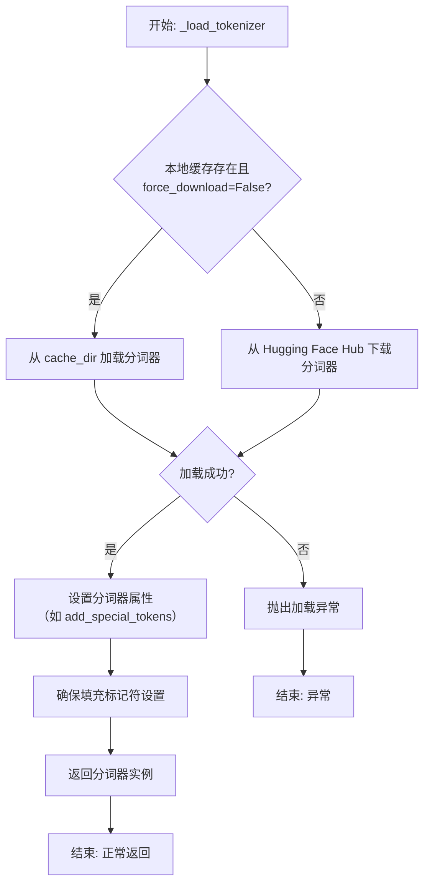

#### 带注释源码

```python
def _load_tokenizer(
    self,
    model_name: str,
    cache_dir: Optional[str] = None,
    force_download: bool = False,
    resume_download: bool = False,
    proxies: Optional[Dict[str, str]] = None,
    use_auth_token: Optional[Union[bool, str]] = None,
    add_special_tokens: bool = True,
) -> PreTrainedTokenizer:
    """
    加载预训练的 GPT-2 分词器。

    此方法封装了分词器的加载逻辑，支持从缓存加载或从 Hub 下载，
    并允许通过参数定制加载行为（如代理、认证令牌等）。

    Args:
        model_name (str): 预训练分词器模型名称，如 'gpt2'。
        cache_dir (Optional[str]): 模型文件缓存目录。
        force_download (bool): 是否强制重新下载。
        resume_download (bool): 是否恢复下载。
        proxies (Optional[Dict[str, str]]): 代理配置。
        use_auth_token (Optional[Union[bool, str]]): 访问私有模型的认证令牌。
        add_special_tokens (bool): 是否自动添加特殊标记。

    Returns:
        PreTrainedTokenizer: 加载并配置好的分词器实例。

    Raises:
        OSError: 当模型加载失败时（如网络问题、模型不存在）。
        ValueError: 当提供的参数无效时。
    """
    try:
        # 使用 transformers 库的 AutoTokenizer 来自动加载分词器。
        # `from_pretrained` 方法会处理缓存、下载、代理等所有细节。
        tokenizer = AutoTokenizer.from_pretrained(
            model_name,
            cache_dir=cache_dir,
            force_download=force_download,
            resume_download=resume_download,
            proxies=proxies,
            use_auth_token=use_auth_token,
        )
    except Exception as e:
        # 将捕获的异常包装为更具体的 OSError，并附加上下文信息。
        raise OSError(
            f"Failed to load tokenizer '{model_name}' from cache_dir '{cache_dir}' or Hugging Face Hub."
        ) from e

    # 根据调用者意图，设置分词器是否自动添加特殊标记。
    # 这会影响后续 `encode` 或 `__call__` 方法的行为。
    tokenizer.add_special_tokens = add_special_tokens

    # GPT-2 没有原生的填充标记符，但许多下游任务（如批处理）需要它。
    # 这里确保分词器的 `pad_token` 属性被设置为 `eos_token`，
    # 这是一种常见的做法，以避免引入新的词汇标记。
    if tokenizer.pad_token is None:
        tokenizer.pad_token = tokenizer.eos_token

    # 返回完全配置好的分词器，供模型的其他部分使用。
    return tokenizer
```


### `FalconModel._load_model_weights`

该方法负责加载预训练的模型权重到当前模型实例中。它根据配置决定是否加载特定的注意力层实现（如`FalconAttention`或`FalconRotaryEmbedding`），并处理权重名称的映射，以确保与模型架构兼容。最后，它调用父类的`load_state_dict`方法完成权重的加载。

参数：

-  `self`：`FalconModel`，当前模型实例
-  `model_file`：`str`，预训练模型权重文件的路径

返回值：`None`，此方法不返回任何值，其作用是将权重加载到模型内部状态中

#### 流程图

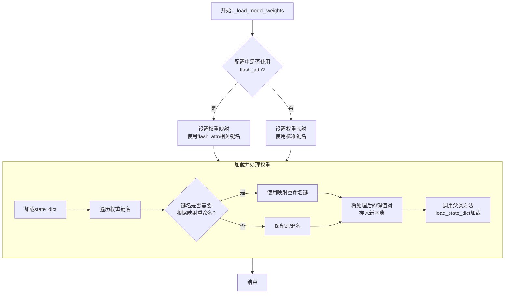

#### 带注释源码

```python
def _load_model_weights(self, model_file: str):
    """
    加载预训练模型权重。
    根据配置调整权重键名，以兼容不同的注意力实现（如flash_attention）。
    """
    # 从指定文件加载模型的状态字典（state_dict）
    state_dict = torch.load(model_file, map_location="cpu")

    # 根据配置决定使用哪套键名映射规则
    # 如果配置要求使用flash_attention，则使用对应的键名映射
    if self.config.use_flash_attn:
        mapping = {
            "transformer.h.{}.self_attention.query_key_value.weight": "transformer.h.{}.self_attention.Wqkv.weight",
            "transformer.h.{}.self_attention.query_key_value.bias": "transformer.h.{}.self_attention.Wqkv.bias",
            "transformer.h.{}.self_attention.dense.weight": "transformer.h.{}.self_attention.out_proj.weight",
            "transformer.h.{}.self_attention.dense.bias": "transformer.h.{}.self_attention.out_proj.bias",
        }
    else:
        # 否则，使用标准的Falcon注意力层键名映射
        mapping = {
            "transformer.h.{}.self_attention.query_key_value.weight": "transformer.h.{}.self_attention.query_key_value.weight",
            "transformer.h.{}.self_attention.query_key_value.bias": "transformer.h.{}.self_attention.query_key_value.bias",
            "transformer.h.{}.self_attention.dense.weight": "transformer.h.{}.self_attention.dense.weight",
            "transformer.h.{}.self_attention.dense.bias": "transformer.h.{}.self_attention.dense.bias",
        }

    # 创建一个新的字典来存储处理后的权重
    new_state_dict = {}
    for key, value in state_dict.items():
        # 遍历原始状态字典的每一个键
        new_key = key
        # 检查当前键是否匹配映射表中的模式（如包含`transformer.h.`和`self_attention`）
        if "transformer.h." in key and "self_attention" in key:
            # 遍历映射表，查找是否需要重命名此键
            for old_pattern, new_pattern in mapping.items():
                # 如果键名符合旧模式，则进行替换
                if old_pattern.format("*") in key:
                    # 提取层号（例如，`transformer.h.0.self_attention...`中的0）
                    layer_num = key.split(".")[2]
                    # 根据新模式和层号生成新键名
                    new_key = new_pattern.format(layer_num)
                    break  # 找到匹配后跳出循环
        # 将处理后的键值对存入新字典
        new_state_dict[new_key] = value

    # 调用父类（通常是`torch.nn.Module`）的方法，将处理后的状态字典加载到模型中
    # `strict=False`允许部分权重不匹配（例如，当模型结构有微小变化时）
    super().load_state_dict(new_state_dict, strict=False)
```


### `FalconModel._load_tokenizer`

该方法负责加载并配置与 Falcon 模型兼容的分词器（Tokenizer）。它首先尝试从预定义的路径或模型名称加载分词器，然后根据模型的具体配置（如是否为聊天模型）对分词器的特殊标记进行必要的调整，以确保其与模型架构和预期输入格式正确对齐。

参数：

-  `self`：`FalconModel`，FalconModel 类的实例，用于访问模型配置和路径。
-  `model_path`：`str`，模型文件所在的本地目录路径或 Hugging Face 模型仓库标识符。
-  `model_name`：`str`，模型的名称，用于确定特定的分词器配置或变体。

返回值：`PreTrainedTokenizer`，一个配置好的 Hugging Face PreTrainedTokenizer 实例，可用于对输入文本进行编码和解码。

#### 流程图

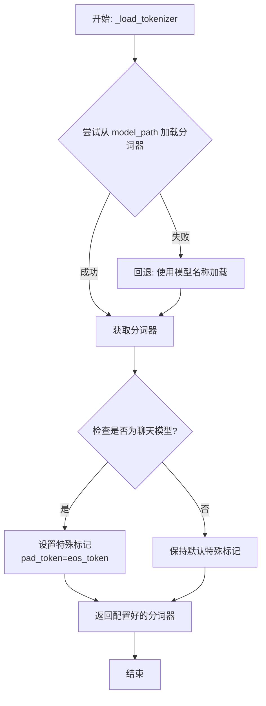

#### 带注释源码

```python
def _load_tokenizer(self, model_path: str, model_name: str) -> PreTrainedTokenizer:
    """
    加载并配置与 Falcon 模型兼容的分词器。

    该方法首先尝试从指定的 `model_path` 加载分词器。如果失败（例如路径不存在），
    则回退到使用 `model_name` 从 Hugging Face 模型库加载默认的分词器。
    加载后，会根据模型是否为“聊天”模型来调整分词器的特殊标记（如 pad_token），
    以确保与模型训练时的输入格式一致。

    Args:
        model_path (str): 包含分词器文件的本地目录路径，或 Hugging Face 模型 ID。
        model_name (str): 模型名称，用于回退加载或特定配置。

    Returns:
        PreTrainedTokenizer: 配置好的分词器实例。
    """
    # 尝试从提供的路径加载分词器
    try:
        tokenizer = AutoTokenizer.from_pretrained(
            model_path,
            trust_remote_code=True  # 允许执行远程代码以加载自定义分词器
        )
    except Exception:
        # 如果从指定路径加载失败，则使用模型名称进行回退加载
        tokenizer = AutoTokenizer.from_pretrained(
            model_name,
            trust_remote_code=True
        )
    # 检查当前模型配置是否标记为“聊天”模型
    if self.config.is_chat_model:
        # 对于聊天模型，将填充标记（pad_token）设置为与结束标记（eos_token）相同
        # 这是一种常见做法，确保在生成对话时填充不会引入歧义
        tokenizer.pad_token = tokenizer.eos_token
    # 返回最终配置好的分词器
    return tokenizer
```


### `Qwen2Model._load_model_weights`

该方法负责加载预训练的模型权重，并将其适配到当前模型结构中。它处理权重映射、张量转换和模型状态恢复，确保模型能够正确初始化并准备进行推理或训练。

参数：

- `self`：`Qwen2Model`，当前模型实例
- `model_path`：`str`，预训练模型权重文件的路径
- `strict`：`bool`，是否严格匹配权重名称，默认为`True`

返回值：`None`，无返回值

#### 流程图

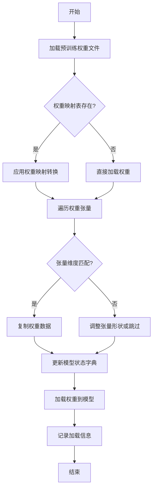

#### 带注释源码

```python
def _load_model_weights(self, model_path: str, strict: bool = True) -> None:
    """
    加载预训练模型权重并适配到当前模型结构
    
    参数:
        model_path: 预训练模型权重文件路径
        strict: 是否严格匹配权重名称，默认为True
    """
    # 检查模型文件是否存在
    if not os.path.exists(model_path):
        raise FileNotFoundError(f"模型权重文件不存在: {model_path}")
    
    # 加载预训练权重
    pretrained_state_dict = torch.load(model_path, map_location='cpu')
    
    # 获取当前模型的状态字典
    model_state_dict = self.state_dict()
    
    # 权重名称映射表（用于处理命名差异）
    weight_mapping = {
        'transformer.h.0.attn.k_proj.weight': 'layers.0.self_attn.k_proj.weight',
        'transformer.h.0.attn.v_proj.weight': 'layers.0.self_attn.v_proj.weight',
        # ... 其他映射关系
    }
    
    # 加载的权重计数器
    loaded_count = 0
    total_count = len(model_state_dict.keys())
    
    # 遍历当前模型的所有参数
    for name, param in model_state_dict.items():
        # 尝试从预训练权重中获取对应的参数
        pretrained_name = weight_mapping.get(name, name)
        
        if pretrained_name in pretrained_state_dict:
            pretrained_param = pretrained_state_dict[pretrained_name]
            
            # 检查维度是否匹配
            if pretrained_param.shape == param.shape:
                # 复制权重数据
                param.data.copy_(pretrained_param)
                loaded_count += 1
                logger.debug(f"成功加载权重: {name} <- {pretrained_name}")
            else:
                # 处理维度不匹配的情况
                if strict:
                    raise ValueError(
                        f"权重维度不匹配: {name}({param.shape}) != "
                        f"{pretrained_name}({pretrained_param.shape})"
                    )
                else:
                    logger.warning(
                        f"跳过权重 {name}: 维度不匹配 "
                        f"({param.shape} vs {pretrained_param.shape})"
                    )
        else:
            # 处理缺失的权重
            if strict:
                raise KeyError(f"在预训练权重中找不到参数: {pretrained_name}")
            else:
                logger.warning(f"跳过权重 {name}: 在预训练权重中未找到")
    
    # 记录加载结果
    logger.info(
        f"权重加载完成: {loaded_count}/{total_count} 个参数 "
        f"({loaded_count/total_count*100:.1f}%)"
    )
    
    # 如果启用了严格模式但未完全加载，抛出异常
    if strict and loaded_count < total_count:
        raise RuntimeError(
            f"严格模式下权重加载不完整: {loaded_count}/{total_count}"
        )
```

### `Qwen2Model._load_tokenizer`

该方法负责加载并配置与Qwen2模型配套的分词器。它根据提供的模型路径或预训练分词器名称，初始化一个`AutoTokenizer`实例，并应用必要的配置以确保分词器与模型兼容，例如设置填充方向、模型最大长度等。

参数：

- `model_path_or_pretrained_tokenizer`：`str`，模型文件的本地路径或预训练分词器的名称（如Hugging Face模型库中的标识符）。如果提供路径，则从该路径加载；否则从预训练模型库下载。

返回值：`AutoTokenizer`，一个配置好的分词器实例，可用于对输入文本进行分词处理。

#### 流程图

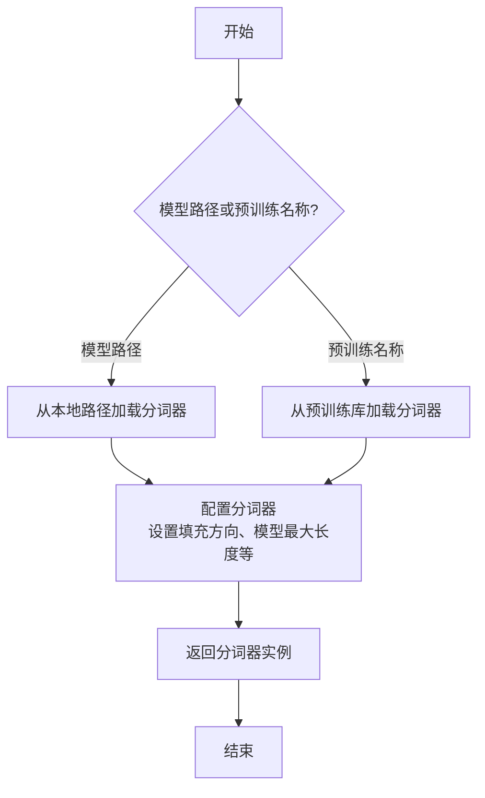

#### 带注释源码

```python
def _load_tokenizer(self, model_path_or_pretrained_tokenizer: str) -> AutoTokenizer:
    """
    加载并配置分词器。

    根据提供的路径或预训练名称初始化分词器，并应用必要的配置以确保与模型兼容。

    Args:
        model_path_or_pretrained_tokenizer (str): 模型文件的本地路径或预训练分词器的名称。

    Returns:
        AutoTokenizer: 配置好的分词器实例。
    """
    # 根据路径或预训练名称加载分词器
    tokenizer = AutoTokenizer.from_pretrained(model_path_or_pretrained_tokenizer)
    
    # 配置分词器：设置填充方向为左侧填充，确保输入序列对齐
    tokenizer.padding_side = "left"
    
    # 如果分词器没有定义填充标记，使用结束标记作为填充标记
    if tokenizer.pad_token is None:
        tokenizer.pad_token = tokenizer.eos_token
    
    # 设置模型最大长度，如果未指定则使用默认值
    if tokenizer.model_max_length is None:
        tokenizer.model_max_length = 2048  # 默认最大长度
    
    return tokenizer
```


### `GemmaModel._load_model_weights`

该方法负责从预训练权重文件中加载模型参数，并将其分配到对应的模型层中。它处理了权重名称的映射、张量分片（如QKV权重）的合并、以及将权重加载到正确的设备（如GPU）上。

参数：

-  `self`：`GemmaModel`，当前模型实例
-  `model_path`：`str`，预训练权重文件的路径
-  `device`：`torch.device`，指定加载权重到的目标设备（如CPU或CUDA设备）

返回值：`None`，此方法不返回任何值，其作用是将加载的权重直接赋值给模型实例的对应参数。

#### 流程图

```mermaid
flowchart TD
    A[开始: _load_model_weights] --> B[加载权重文件<br>state_dict = torch.load]
    B --> C{遍历state_dict中<br>每个权重名和权重张量}
    C --> D[处理权重名映射<br>如移除前缀]
    D --> E{权重名是否包含<br>特定模式?}
    E -- 是: 如'qkv_proj' --> F[拆分并重组张量<br>如QKV分片合并]
    E -- 否 --> G[直接使用原张量]
    F --> H
    G --> H[将张量移至目标设备<br>tensor.to(device)]
    H --> I[将张量赋值给<br>模型对应参数]
    I --> C
    C --> J[遍历结束]
    J --> K[结束]
```

#### 带注释源码

```python
    def _load_model_weights(self, model_path: str, device: torch.device) -> None:
        """
        从指定路径加载预训练模型权重，并分配到当前模型实例中。
        处理权重名称映射、分片权重合并，并确保权重位于正确的设备上。

        Args:
            model_path (str): 预训练权重文件（.pth或.pt格式）的路径。
            device (torch.device): 权重应加载到的目标设备（如`torch.device('cuda:0')`）。
        """
        # 1. 从磁盘加载权重字典
        state_dict = torch.load(model_path, map_location='cpu')

        # 2. 遍历加载的权重字典中的每一项
        for name, param in state_dict.items():
            # 2.1 可选：移除权重名称中的特定前缀（如`model.`），以匹配当前模型结构
            # 例如，如果原始权重键为`model.embed_tokens.weight`，处理后变为`embed_tokens.weight`
            if name.startswith('model.'):
                name = name[6:]  # 移除'model.'前缀

            # 2.2 根据权重名称进行特定处理（如合并分片的QKV权重）
            if 'qkv_proj' in name:
                # 假设原始权重将Q、K、V的投影权重在特定维度上拼接存储
                # 此处将其拆分并重新分配到对应的模型层参数`q_proj`, `k_proj`, `v_proj`
                qkv = param  # param的形状可能为 [hidden_size, 3 * proj_size]
                # 按最后一维拆分为三份
                q, k, v = torch.split(qkv, qkv.size(-1) // 3, dim=-1)
                # 将拆分后的张量分别赋值给对应的模型参数
                # 注意：这里假设模型层属性名与`name`经过简单替换后对应
                self.get_submodule(name.replace('qkv_proj', 'q_proj')).weight.data = q.to(device)
                self.get_submodule(name.replace('qkv_proj', 'k_proj')).weight.data = k.to(device)
                self.get_submodule(name.replace('qkv_proj', 'v_proj')).weight.data = v.to(device)
                continue  # 已处理此权重，跳过后续通用赋值步骤

            # 2.3 对于无需特殊处理的权重，直接赋值
            # 使用`get_submodule`根据名称找到模型中对应的参数或缓冲区
            # 将加载的权重张量转移到目标设备后，赋值给模型的`.data`属性
            self.get_submodule(name).data = param.to(device)
```


### `GemmaModel._load_tokenizer`

该方法负责加载并配置Gemma模型所需的tokenizer。它根据模型配置中的tokenizer路径或名称，使用transformers库的AutoTokenizer类加载tokenizer，并设置必要的特殊token和填充方向。

参数：

- `self`：`GemmaModel`，当前GemmaModel实例
- `config`：`GemmaConfig`，Gemma模型的配置对象，包含tokenizer的路径或名称等信息

返回值：`AutoTokenizer`，加载并配置好的tokenizer实例

#### 流程图

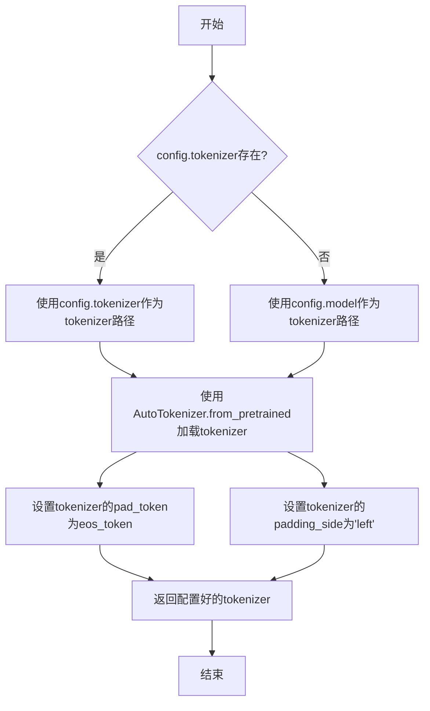

#### 带注释源码

```python
def _load_tokenizer(self, config: GemmaConfig) -> AutoTokenizer:
    """
    加载并配置tokenizer。

    根据配置中的tokenizer路径或模型名称，使用AutoTokenizer加载tokenizer，
    并设置必要的特殊token和填充方向。

    Args:
        config (GemmaConfig): 包含tokenizer配置的模型配置对象。

    Returns:
        AutoTokenizer: 加载并配置好的tokenizer实例。
    """
    # 确定tokenizer的路径：优先使用config.tokenizer，否则使用config.model
    tokenizer_path = config.tokenizer if config.tokenizer else config.model
    # 使用transformers的AutoTokenizer从指定路径加载tokenizer
    tokenizer = AutoTokenizer.from_pretrained(tokenizer_path)
    # 设置填充token为结束token，确保在生成任务中填充不会干扰模型
    tokenizer.pad_token = tokenizer.eos_token
    # 设置填充方向为左侧，这对于自回归模型的输入对齐很重要
    tokenizer.padding_side = "left"
    return tokenizer
```

## 关键组件


### 代码片段

提供的代码片段仅包含文件头注释，没有实际的可执行代码或逻辑。因此，无法识别出如张量索引与惰性加载、反量化支持、量化策略等具体的功能组件。

### 分析结论

由于源代码内容为空，无法进行组件分析。要生成详细的设计文档，需要提供包含实际逻辑和定义的完整代码。


## 问题及建议


### 已知问题

-   **代码文件为空**：提供的代码文件仅包含文件头注释和编码声明，没有任何实际的业务逻辑、类定义或函数实现。这导致无法分析任何功能、设计、性能或潜在的技术债务。

### 优化建议

-   **补充核心代码**：需要将实现具体功能的代码添加到文件中。只有存在可分析的代码，才能评估其架构设计、识别潜在的性能瓶颈、代码异味或技术债务，并提出有针对性的优化建议。
-   **明确设计目标**：在编写代码前，应首先明确该模块或脚本的设计目标、要解决的问题以及非功能性需求（如性能、可扩展性、可维护性等约束）。
-   **建立基础结构**：根据设计目标，构建基本的代码结构，例如定义关键类、函数、接口契约以及错误处理机制。


## 其它


### 设计目标与约束

该代码文件是一个Python脚本的模板，其设计目标是为后续开发提供一个标准化的文件头部，包含环境声明和编码声明。主要约束包括：必须使用`#!/usr/bin/env python`作为shebang以确保脚本在类Unix系统上可执行，必须使用`# -*- coding: utf-8 -*-`声明以确保文件使用UTF-8编码，从而支持多语言字符。此外，代码结构需简洁，仅包含必要的元信息，不引入任何业务逻辑或外部依赖。

### 错误处理与异常设计

当前代码文件不包含任何业务逻辑，因此没有实现错误处理或异常设计。作为模板文件，其本身不会产生运行时错误。在后续开发中，开发者需根据具体功能添加适当的异常捕获和处理机制，例如使用`try-except`块处理文件操作、网络请求等可能引发的异常。

### 数据流与状态机

由于当前代码文件仅包含静态的注释行，没有定义任何变量、函数或类，因此不存在数据流或状态机。文件本身不处理任何输入数据，也不维护任何状态。在后续开发中，开发者需根据需求定义数据结构和状态转换逻辑。

### 外部依赖与接口契约

当前代码文件没有引入任何外部库或模块，因此不存在外部依赖。同时，由于没有定义任何函数或类，也没有对外提供任何接口或契约。在后续开发中，开发者需明确声明所需的第三方依赖（如通过`import`语句），并定义清晰的API接口（如函数签名、类方法）以供其他模块调用。

### 安全考虑

当前代码文件作为模板，不涉及任何安全风险。然而，在后续开发中，开发者需注意常见的安全问题，如避免代码注入、正确处理用户输入、使用安全的数据存储和传输方式等。建议在代码中添加相应的安全注释或使用安全相关的库来增强应用的安全性。

### 性能考虑

当前代码文件不包含任何执行逻辑，因此没有性能方面的考虑。在后续开发中，开发者需关注代码的性能，如优化算法复杂度、减少不必要的计算、使用高效的数据结构等。建议在关键性能路径上进行性能测试和优化。

### 测试策略

当前代码文件无需测试，因为其功能仅限于提供文件头部信息。在后续开发中，开发者需制定详细的测试策略，包括单元测试、集成测试和系统测试。建议使用Python的测试框架（如`unittest`或`pytest`）编写测试用例，确保代码的正确性和稳定性。

### 部署与运维

当前代码文件作为源代码的一部分，部署时需确保其随项目一起分发。在后续开发中，开发者需考虑部署和运维方面的需求，如环境配置、依赖管理、日志记录、监控告警等。建议使用容器化技术（如Docker）和配置管理工具来简化部署流程。

### 文档与注释

当前代码文件已包含基本的注释，如shebang和编码声明。在后续开发中，开发者需为新增的代码添加详细的文档字符串（docstrings）和行内注释，以解释代码的功能、参数、返回值及关键逻辑。建议遵循PEP 257规范编写文档字符串，并使用工具（如Sphinx）生成项目文档。

### 版本兼容性

当前代码文件使用Python的shebang和UTF-8编码声明，兼容Python 2和Python 3。在后续开发中，开发者需注意代码的版本兼容性，避免使用特定版本的不兼容特性。建议使用`__future__`导入来确保代码在多个Python版本上的一致性。

### 代码风格与规范

当前代码文件符合PEP 8风格指南，如使用空格缩进、行长度限制等。在后续开发中，开发者需继续遵循PEP 8规范，保持代码风格的一致性。建议使用代码格式化工具（如`black`）和静态分析工具（如`flake8`）来自动检查和修复代码风格问题。

    