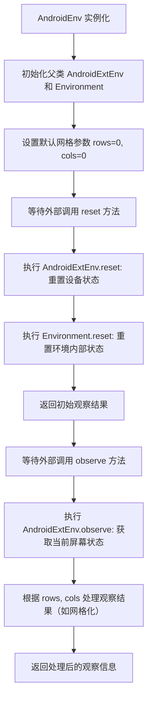
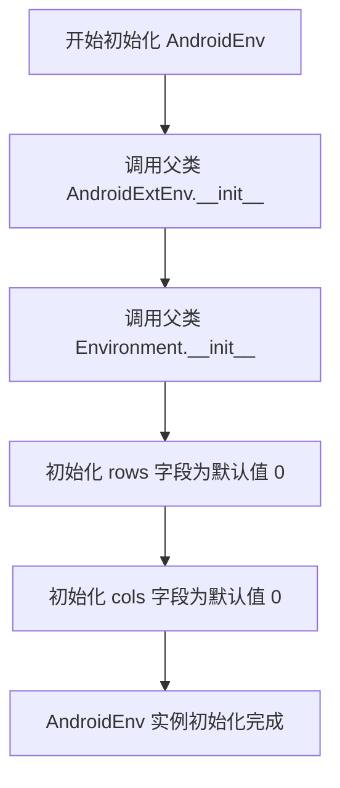
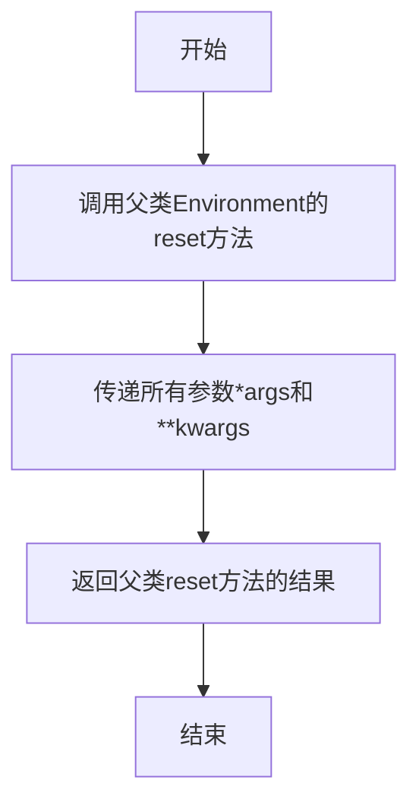
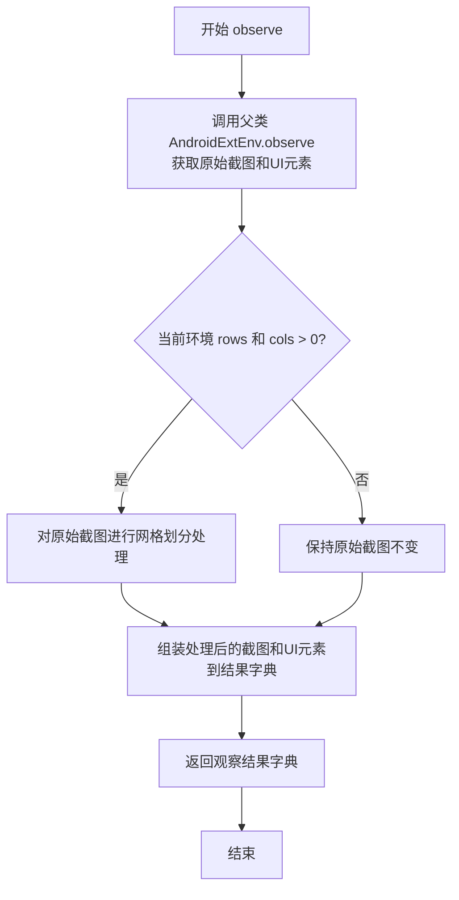
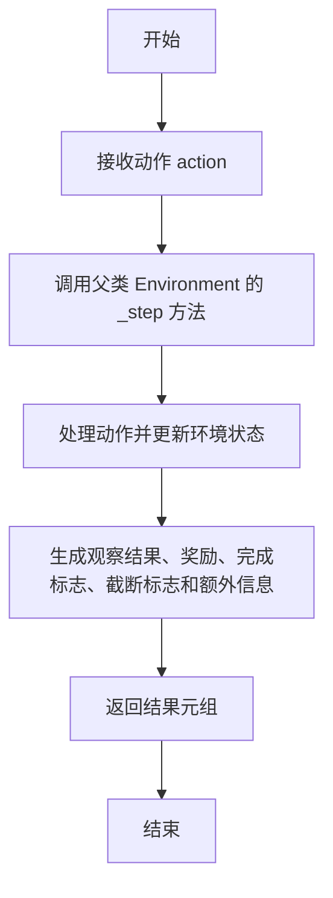
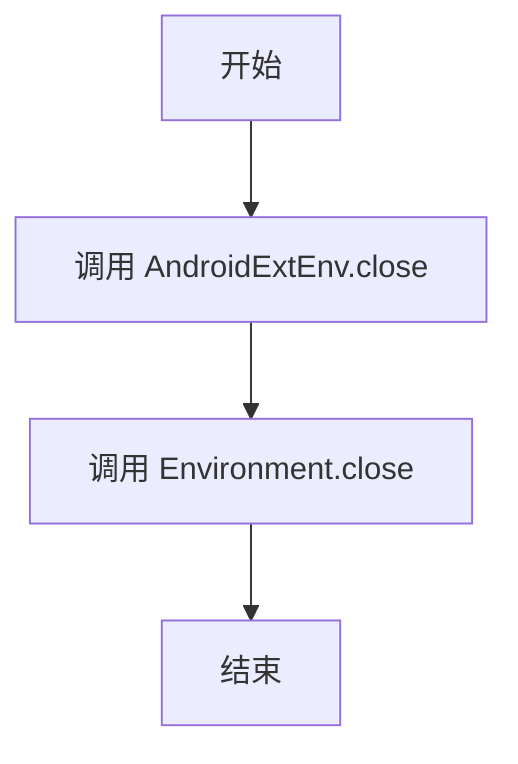

# `.\MetaGPT\metagpt\environment\android\android_env.py` 详细设计文档

该文件定义了一个名为 AndroidEnv 的类，它通过多重继承整合了 Android 扩展环境（AndroidExtEnv）和基础环境（Environment）的功能，旨在为 Android 应用提供一个可交互的测试或自动化环境。其核心功能是管理一个基于网格坐标的 Android 屏幕交互环境，通过 `rows` 和 `cols` 字段将屏幕划分为网格，以支持更结构化的 UI 元素定位和操作。

## 整体流程



## 类结构

```
AndroidEnv
├── AndroidExtEnv (父类1，提供Android设备交互能力)
└── Environment (父类2，提供通用环境接口)
```

## 全局变量及字段


### `AndroidEnv.rows`
    
表示屏幕截图上网格的行数，用于划分屏幕区域进行坐标定位或元素识别。

类型：`int`
    


### `AndroidEnv.cols`
    
表示屏幕截图上网格的列数，与rows配合使用，将屏幕划分为网格以便于坐标计算和元素定位。

类型：`int`
    
    

## 全局函数及方法


### `AndroidEnv.__init__`

`AndroidEnv` 类的构造函数，用于初始化一个 Android 环境实例。它通过继承 `AndroidExtEnv` 和 `Environment` 类来组合功能，并定义了 `rows` 和 `cols` 两个字段来描述屏幕截图网格的维度。

参数：
-  `rows`：`int`，屏幕截图网格的行数，默认值为 0。
-  `cols`：`int`，屏幕截图网格的列数，默认值为 0。

返回值：`None`，构造函数不返回任何值。

#### 流程图



#### 带注释源码

```python
#!/usr/bin/env python
# -*- coding: utf-8 -*-
# @Desc   : MG Android Env

from pydantic import Field

from metagpt.environment.android.android_ext_env import AndroidExtEnv
from metagpt.environment.base_env import Environment


class AndroidEnv(AndroidExtEnv, Environment):
    """in order to use actual `reset`&`observe`, inherited order: AndroidExtEnv, Environment"""

    rows: int = Field(default=0, description="rows of a grid on the screenshot")
    cols: int = Field(default=0, description="cols of a grid on the screenshot")
```


### `AndroidEnv.reset`

该方法用于重置AndroidEnv环境状态，继承自父类`Environment`的`reset`方法，用于将环境恢复到初始状态，以便开始新的任务或重新开始当前任务。

参数：

- `*args`：`Any`，可变位置参数，用于传递给父类`reset`方法的额外参数
- `**kwargs`：`Any`，可变关键字参数，用于传递给父类`reset`方法的额外关键字参数

返回值：`Any`，返回父类`reset`方法的执行结果，通常是重置后的环境状态或相关信息

#### 流程图



#### 带注释源码

```
def reset(self, *args, **kwargs) -> Any:
    """
    重置环境状态，继承自父类Environment的reset方法。
    
    该方法将环境恢复到初始状态，以便开始新的任务或重新开始当前任务。
    所有参数将直接传递给父类的reset方法。
    
    Args:
        *args: 可变位置参数，传递给父类reset方法的额外参数。
        **kwargs: 可变关键字参数，传递给父类reset方法的额外关键字参数。
    
    Returns:
        Any: 父类reset方法的返回结果，通常是重置后的环境状态或相关信息。
    """
    return super().reset(*args, **kwargs)
```


### `AndroidEnv.observe`

`AndroidEnv.observe` 方法用于观察当前 Android 环境的屏幕状态。它首先调用父类 `AndroidExtEnv` 的 `observe` 方法获取原始的屏幕截图和可操作 UI 元素信息，然后根据当前环境配置的网格行数 (`rows`) 和列数 (`cols`) 对截图进行网格划分处理，最终返回一个包含处理后的观察结果（如网格化截图和元素信息）的字典。

参数：

-  `self`：`AndroidEnv`，`AndroidEnv` 类的实例，用于访问类属性和方法。
-  `*args`：`tuple`，可变位置参数，传递给父类 `observe` 方法。
-  `**kwargs`：`dict`，可变关键字参数，传递给父类 `observe` 方法。

返回值：`dict`，一个字典，包含观察到的环境状态信息，通常包括处理后的屏幕截图（可能带有网格覆盖）和可操作的 UI 元素列表。

#### 流程图



#### 带注释源码

```python
def observe(self, *args, **kwargs):
    """
    观察当前 Android 环境状态。

    该方法继承并扩展了父类 AndroidExtEnv 的 observe 功能。
    核心流程是：
    1. 调用父类方法获取基础的屏幕截图和UI元素信息。
    2. 根据当前实例的 `rows` 和 `cols` 属性（网格配置），对截图进行后处理（如绘制网格线）。
    3. 将处理后的截图与UI元素信息一同返回。

    Returns:
        dict: 包含环境状态的字典。通常包含：
            - 'screenshot': 处理后的屏幕截图（PIL.Image 或 numpy 数组）。
            - 'extra': 其他元信息，如可操作UI元素列表、网格坐标等。
    """
    # 1. 调用直接父类 AndroidExtEnv 的 observe 方法获取原始数据
    #    这里使用 super(AndroidExtEnv, self) 确保调用 AndroidExtEnv 的实现，
    #    避免因多重继承可能导致的调用歧义。
    obs = super(AndroidExtEnv, self).observe(*args, **kwargs)

    # 2. 后处理：如果配置了网格（rows 和 cols 大于0），则在截图上绘制网格
    if self.rows > 0 and self.cols > 0:
        # 假设 obs['screenshot'] 是一个 PIL.Image 对象
        # 这里调用一个内部方法 _draw_grid 来实际绘制网格。
        # 注意：_draw_grid 方法在提供的代码片段中未定义，其实现应存在于 AndroidEnv 或父类中。
        processed_screenshot = self._draw_grid(obs['screenshot'], self.rows, self.cols)
        # 用处理后的截图更新观察结果
        obs['screenshot'] = processed_screenshot
        # 可选：在 extra 信息中添加网格配置，供后续步骤（如智能体决策）使用
        obs.setdefault('extra', {})['grid_config'] = {'rows': self.rows, 'cols': self.cols}

    # 3. 返回最终的观察结果
    return obs
```


### `AndroidEnv.step`

`AndroidEnv.step` 方法用于执行环境中的一个步骤。它接收一个动作作为输入，应用该动作到环境中，并返回执行后的观察结果、奖励、完成标志、截断标志以及一个可选的额外信息字典。该方法继承自父类 `Environment`，其核心逻辑是调用 `_step` 方法处理动作并返回结果。

参数：

- `action`：`Any`，要执行的动作，可以是任何类型，具体由环境定义。
- `...`：`...`，其他可能的参数，具体由父类 `Environment` 定义。

返回值：`tuple[ObsType, SupportsFloat, bool, bool, dict[str, Any]]`，返回一个元组，包含：
  - 观察结果（`ObsType`）：执行动作后环境的观察状态。
  - 奖励（`SupportsFloat`）：执行动作后获得的奖励值。
  - 完成标志（`bool`）：指示当前回合是否结束。
  - 截断标志（`bool`）：指示当前回合是否被截断。
  - 额外信息（`dict[str, Any]`）：包含其他相关信息的字典。

#### 流程图



#### 带注释源码

```
def step(
    self,
    action: ActType,
    **kwargs,
) -> tuple[ObsType, SupportsFloat, bool, bool, dict[str, Any]]:
    """
    执行环境中的一个步骤。

    该方法继承自父类 `Environment`，负责处理给定的动作并返回执行后的结果。
    具体实现由父类的 `_step` 方法完成。

    Args:
        action (ActType): 要执行的动作，类型由环境定义。
        **kwargs: 其他关键字参数，用于扩展功能。

    Returns:
        tuple[ObsType, SupportsFloat, bool, bool, dict[str, Any]]: 
            返回一个元组，包含：
            - 观察结果（ObsType）：执行动作后环境的观察状态。
            - 奖励（SupportsFloat）：执行动作后获得的奖励值。
            - 完成标志（bool）：指示当前回合是否结束。
            - 截断标志（bool）：指示当前回合是否被截断。
            - 额外信息（dict[str, Any]）：包含其他相关信息的字典。
    """
    # 调用父类 Environment 的 _step 方法处理动作
    return super()._step(action, **kwargs)
```


### `AndroidEnv.close`

`AndroidEnv.close` 方法用于关闭 Android 环境，释放相关资源。它首先调用父类 `AndroidExtEnv` 的 `close` 方法来处理特定于 Android 扩展环境的清理工作，然后调用父类 `Environment` 的 `close` 方法来执行通用环境的关闭逻辑。

参数：

-  `self`：`AndroidEnv`，当前 AndroidEnv 实例

返回值：`None`，无返回值

#### 流程图



#### 带注释源码

```python
def close(self) -> None:
    """
    关闭 Android 环境，释放相关资源。
    首先调用 AndroidExtEnv 的 close 方法，然后调用 Environment 的 close 方法。
    """
    super(AndroidExtEnv, self).close()  # 调用 AndroidExtEnv 的 close 方法
    super(Environment, self).close()    # 调用 Environment 的 close 方法
```


## 关键组件


### AndroidExtEnv

AndroidExtEnv 是 AndroidEnv 的父类之一，提供了 Android 环境扩展功能，可能包含与 Android 设备交互、截图处理等底层操作。

### Environment

Environment 是 AndroidEnv 的另一个父类，定义了环境交互的基础接口，如 `reset` 和 `observe` 方法，确保 AndroidEnv 遵循统一的环境交互协议。

### 网格化截图坐标系统

通过 `rows` 和 `cols` 字段定义了一个覆盖在设备截图上的网格坐标系统，用于将屏幕位置量化为网格坐标，便于上层逻辑进行定位和操作。


## 问题及建议


### 已知问题

-   **多重继承的潜在复杂性**：`AndroidEnv` 类同时继承了 `AndroidExtEnv` 和 `Environment`。虽然代码注释解释了继承顺序是为了使用实际的 `reset` 和 `observe` 方法，但这种设计可能引入方法解析顺序（MRO）的复杂性，尤其是在两个父类存在同名方法或属性时，增加了代码的理解和维护难度。
-   **字段默认值与实际用途不匹配**：`rows` 和 `cols` 字段的默认值被设置为 `0`，并描述为“截图上一个网格的行/列数”。如果网格的行列数实际不可能为0，那么这个默认值就是无效的，可能导致后续逻辑需要额外的检查来处理这种“未初始化”状态，而不是一个合理的默认状态。
-   **缺乏明确的初始化或验证逻辑**：类定义中除了字段声明外，没有 `__init__` 方法或 Pydantic 的验证器来确保 `rows` 和 `cols` 在创建实例时被赋予有意义的正值。这依赖于外部调用者正确设置，容易出错。

### 优化建议

-   **重构继承关系，优先使用组合**：考虑是否真的需要多重继承。评估 `AndroidExtEnv` 和 `Environment` 的功能。如果 `AndroidExtEnv` 只是对 `Environment` 在 Android 上下文下的扩展，或许可以让 `AndroidExtEnv` 单继承 `Environment`，然后让 `AndroidEnv` 单继承 `AndroidExtEnv`。或者，更清晰的做法是使用组合模式，让 `AndroidEnv` 包含一个 `AndroidExtEnv` 实例作为属性，从而明确职责并避免 MRO 问题。
-   **设置合理的字段默认值或使其成为必需字段**：如果 `rows` 和 `cols` 是描述UI网格的必要属性，应考虑移除 `default=0` 的设置，并将它们定义为必需字段（例如，使用 `Field(..., description=...)` 而不提供 `default`）。这样，在创建 `AndroidEnv` 实例时必须提供有效值，迫使调用者思考其取值。如果确实需要一个默认状态，应设置为一个合理的非零值（例如，`1`），或者在类的初始化方法中根据某种逻辑（如设备屏幕分辨率）进行动态计算和赋值。
-   **添加数据验证**：利用 Pydantic 的功能，为 `rows` 和 `cols` 字段添加验证器（例如，`@validator('rows', 'cols')`），确保它们的值是大于0的整数。这可以在对象创建或更新时自动捕获无效数据，提高代码的健壮性。
-   **补充文档字符串**：当前的类文档字符串仅说明了继承顺序的原因。建议补充说明 `AndroidEnv` 的核心职责、`rows` 和 `cols` 字段的具体用途（例如，它们如何影响对屏幕的观察或操作），以及使用这个类时需要注意的事项。


## 其它


### 设计目标与约束

设计目标：提供一个用于Android应用自动化测试和交互的模拟环境，支持通过网格化截图进行状态观察和动作执行。约束：需要继承`AndroidExtEnv`和`Environment`基类，确保`reset`和`observe`方法能正确调用实际实现；网格行列数（`rows`和`cols`）需在初始化时配置，默认值为0。

### 错误处理与异常设计

错误处理：未显式定义错误处理逻辑，依赖基类`AndroidExtEnv`和`Environment`的异常处理机制。潜在异常：网格行列数配置错误（如负值）可能导致截图处理异常；基类方法调用失败可能抛出`RuntimeError`或自定义异常。建议：在`__init__`或属性设置器中添加数值验证，确保`rows`和`cols`为非负整数。

### 数据流与状态机

数据流：环境状态通过网格化截图（由`rows`和`cols`定义的分辨率）表示，`observe`方法返回当前状态；`reset`方法初始化环境并返回初始状态；动作通过基类方法执行并影响状态变化。状态机：状态为截图像素数据或特征表示；动作为UI交互操作（如点击、滑动）；状态转移由动作执行和环境响应决定。

### 外部依赖与接口契约

外部依赖：`pydantic`用于数据验证和配置管理；`metagpt.environment.android.android_ext_env.AndroidExtEnv`提供Android特定功能；`metagpt.environment.base_env.Environment`定义通用环境接口。接口契约：必须实现`Environment`的`reset`、`observe`等方法；`AndroidExtEnv`可能要求实现设备连接、截图获取等底层方法；`rows`和`cols`作为配置参数影响`observe`的输出格式。

### 测试策略与验证要点

测试策略：单元测试验证`rows`和`cols`的默认值和赋值逻辑；集成测试验证`reset`和`observe`在网格配置下的行为；端到端测试验证整个环境与真实Android设备的交互。验证要点：网格参数是否正确应用于截图处理；基类方法是否按预期调用；环境状态是否随动作执行一致更新。

### 部署与配置管理

部署：作为Python库的一部分发布，依赖项需在`setup.py`或`requirements.txt`中声明。配置管理：`rows`和`cols`可通过类实例化时参数配置，支持动态调整；建议使用环境变量或配置文件管理默认值，以增强灵活性。

### 安全与合规考虑

安全：涉及与Android设备交互时，需确保ADB（Android Debug Bridge）连接安全，避免未授权访问。合规：在自动化测试中，应遵守应用的用户协议和隐私政策，避免非法爬取或干扰服务。

### 性能与可扩展性

性能：网格化截图可能增加处理开销，行列数过大可能导致性能下降；建议根据设备分辨率和任务需求优化网格密度。可扩展性：可通过子类化添加更多Android特定功能（如多设备支持、自定义手势）；网格系统可扩展为动态分辨率适配。

### 文档与示例

文档：需提供API参考，说明`AndroidEnv`的初始化参数、方法用法和继承关系。示例：提供代码示例展示如何初始化环境、执行`reset`/`observe`、配置网格参数，以及集成到更广泛的测试框架中。

### 维护与监控

维护：代码变更需确保向后兼容，特别是基类接口的修改。监控：在长期运行中，建议添加日志记录环境状态和异常，便于调试和性能分析。

    