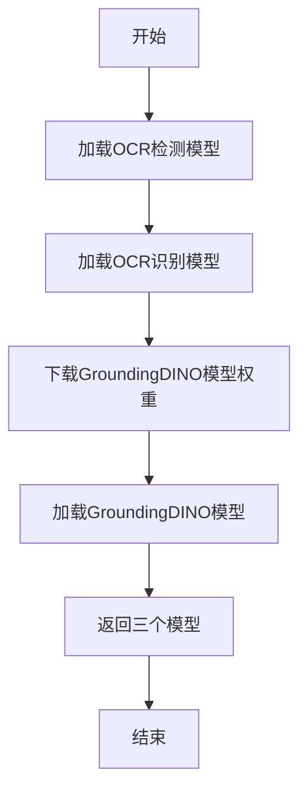
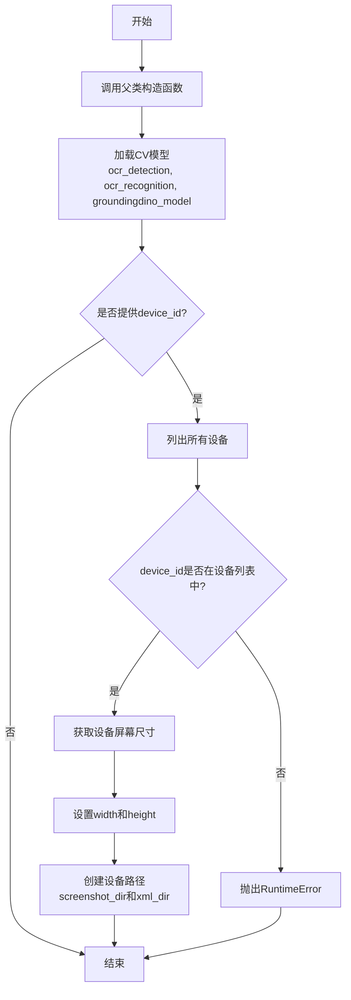
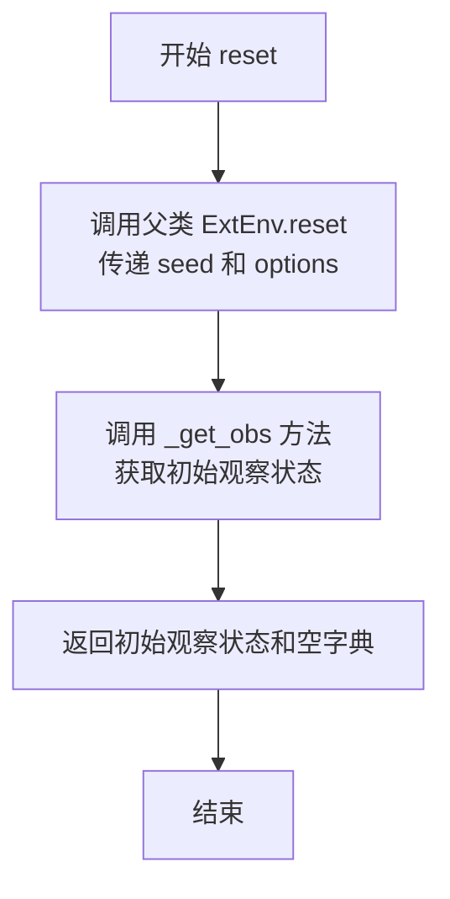
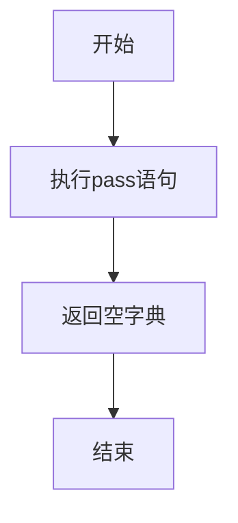
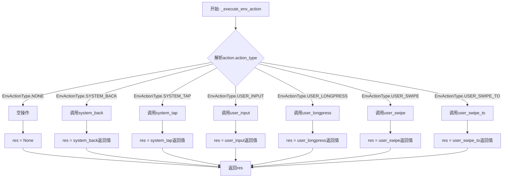
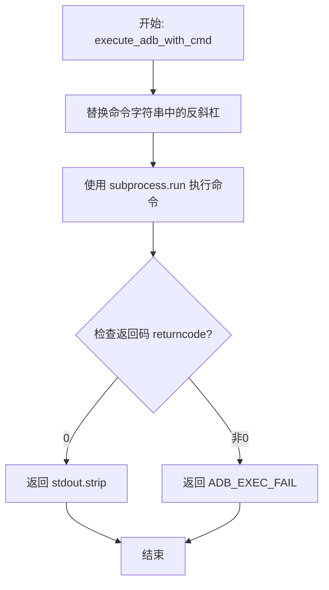
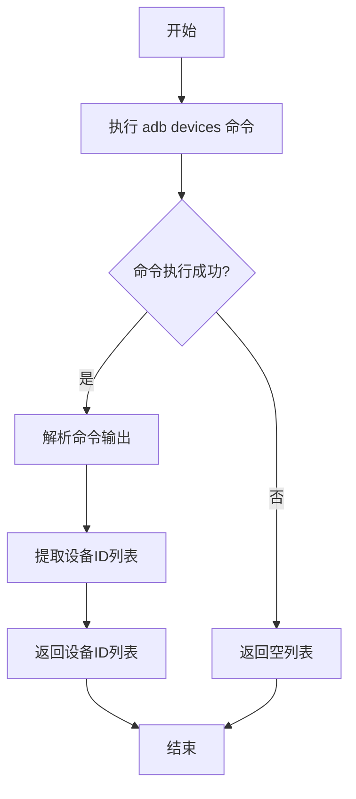
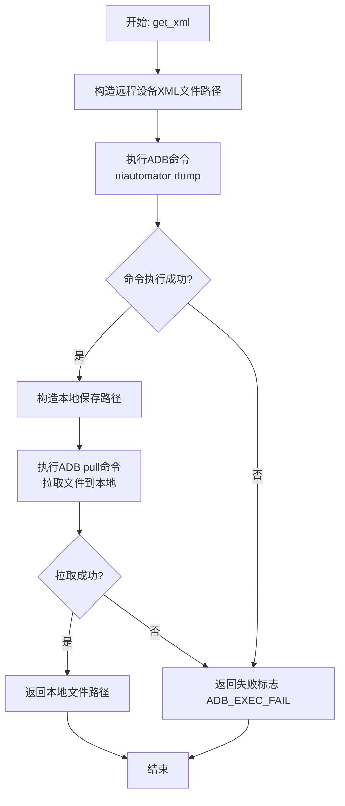

# `.\MetaGPT\metagpt\environment\android\android_ext_env.py` 详细设计文档

该文件定义了一个Android外部环境类（AndroidExtEnv），用于与Android设备进行交互。它通过ADB命令执行屏幕截图、获取UI布局XML、模拟用户输入（如点击、滑动、文本输入）等操作，并集成了OCR文本检测/识别以及基于GroundingDINO的图标检测模型，以实现对Android应用界面的自动化感知与控制。

## 整体流程

```mermaid
graph TD
    A[初始化AndroidExtEnv] --> B[加载CV模型(OCR, GroundingDINO)]
    B --> C{是否指定device_id?}
    C -- 是 --> D[检查设备存在性并获取屏幕尺寸]
    C -- 否 --> E[完成初始化]
    D --> F[在设备上创建存储路径]
    F --> E
    E --> G[等待外部调用]
    G --> H{调用observe方法?}
    H -- 是 --> I[根据obs_type执行截图或获取XML]
    I --> J[返回观察结果(文件路径)]
    H -- 否 --> K{调用step方法?}
    K -- 是 --> L[解析EnvAction，执行对应操作]
    L --> M[执行ADB命令(点击、滑动、输入等)]
    M --> N[返回执行结果和状态]
    K -- 否 --> G
```

## 类结构

```
ExtEnv (基础环境类)
└── AndroidExtEnv (Android外部环境实现类)
```

## 全局变量及字段


### `ADB_EXEC_FAIL`
    
表示ADB命令执行失败的常量字符串

类型：`str`
    


### `AndroidExtEnv.device_id`
    
连接的Android设备的唯一标识符

类型：`Optional[str]`
    


### `AndroidExtEnv.screenshot_dir`
    
设备上存储截图的目录路径

类型：`Optional[Path]`
    


### `AndroidExtEnv.xml_dir`
    
设备上存储UI布局XML文件的目录路径

类型：`Optional[Path]`
    


### `AndroidExtEnv.width`
    
设备屏幕的宽度（像素）

类型：`int`
    


### `AndroidExtEnv.height`
    
设备屏幕的高度（像素）

类型：`int`
    


### `AndroidExtEnv.ocr_detection`
    
用于文本检测的OCR模型

类型：`any`
    


### `AndroidExtEnv.ocr_recognition`
    
用于文本识别的OCR模型

类型：`any`
    


### `AndroidExtEnv.groundingdino_model`
    
用于图标检测的GroundingDINO模型

类型：`any`
    
    

## 全局函数及方法


### `load_cv_model`

该函数负责加载计算机视觉（CV）模型，用于Android环境中的OCR（光学字符识别）和图标检测任务。它初始化了三个模型：一个用于OCR文本检测，一个用于OCR文本识别，以及一个用于图标检测的GroundingDINO模型。

参数：

-  `device`：`str`，指定模型运行的设备，默认为"cpu"。

返回值：`tuple[any, any, any]`，返回一个包含三个模型的元组，分别是OCR检测模型、OCR识别模型和GroundingDINO模型。

#### 流程图



#### 带注释源码

```python
def load_cv_model(device: str = "cpu") -> any:
    # 加载OCR文本检测模型，使用ModelScope的pipeline接口，指定任务和模型名称
    ocr_detection = pipeline(Tasks.ocr_detection, model="damo/cv_resnet18_ocr-detection-line-level_damo")
    
    # 加载OCR文本识别模型，同样使用ModelScope的pipeline接口
    ocr_recognition = pipeline(Tasks.ocr_recognition, model="damo/cv_convnextTiny_ocr-recognition-document_damo")
    
    # 定义GroundingDINO模型权重的下载URL
    file_url = "https://huggingface.co/ShilongLiu/GroundingDINO/blob/main/groundingdino_swint_ogc.pth"
    
    # 指定模型权重下载的目标文件夹路径
    target_folder = Path(f"{DEFAULT_WORKSPACE_ROOT}/weights")
    
    # 下载模型权重文件，并返回本地文件路径
    file_path = download_model(file_url, target_folder)
    
    # 加载GroundingDINO模型，指定运行设备，并将模型设置为评估模式
    groundingdino_model = load_model(file_path, device=device).eval()
    
    # 返回加载的三个模型
    return ocr_detection, ocr_recognition, groundingdino_model
```


### `AndroidExtEnv.__init__`

AndroidExtEnv类的构造函数，用于初始化Android外部环境。它首先调用父类的构造函数，然后加载计算机视觉模型（OCR检测、OCR识别和GroundingDINO模型）。如果提供了设备ID，它会检查设备是否存在，获取设备屏幕尺寸，并创建设备上的存储路径（截图和XML目录）。

参数：

- `**data`：`Any`，包含初始化参数的字典，可能包括device_id、width、height等字段。

返回值：`None`，构造函数不返回任何值。

#### 流程图



#### 带注释源码

```python
def __init__(self, **data: Any):
    # 调用父类ExtEnv的构造函数，传入所有关键字参数
    super().__init__(**data)
    
    # 从参数中获取device_id，如果没有提供则为None
    device_id = data.get("device_id")
    
    # 加载计算机视觉模型：OCR检测、OCR识别和GroundingDINO模型
    self.ocr_detection, self.ocr_recognition, self.groundingdino_model = load_cv_model()
    
    # 如果提供了device_id，则进行设备相关的初始化
    if device_id:
        # 获取当前连接的设备列表
        devices = self.list_devices()
        
        # 检查提供的device_id是否在设备列表中，如果不在则抛出异常
        if device_id not in devices:
            raise RuntimeError(f"device-id: {device_id} not found")
        
        # 获取设备的屏幕尺寸（宽度和高度）
        (width, height) = self.device_shape
        
        # 设置实例的width和height属性，如果data中提供了则使用提供的值，否则使用设备实际尺寸
        self.width = data.get("width", width)
        self.height = data.get("height", height)
        
        # 在设备上创建存储截图和XML文件的目录
        self.create_device_path(self.screenshot_dir)
        self.create_device_path(self.xml_dir)
```


### `AndroidExtEnv.reset`

`AndroidExtEnv.reset` 方法是 Android 外部环境（`AndroidExtEnv`）的初始化方法。它继承自父类 `ExtEnv` 的 `reset` 方法，并在此基础上执行 Android 环境特定的重置逻辑。该方法的主要功能是调用 `_get_obs` 方法来获取环境的初始观察状态，并返回该状态以及一个空的额外信息字典。这通常用于在强化学习或自动化任务开始时，将环境重置到一个已知的初始状态。

参数：

- `seed`：`Optional[int]`，可选的随机数种子，用于确保环境重置的可重复性。在本方法中，它被传递给父类的 `reset` 方法。
- `options`：`Optional[dict[str, Any]]`，可选的配置字典，用于传递额外的重置选项。在本方法中，它被传递给父类的 `reset` 方法。

返回值：`tuple[dict[str, Any], dict[str, Any]]`，返回一个元组，包含两个字典。第一个字典是环境的初始观察状态（`obs`），第二个字典是空的额外信息字典（`{}`）。

#### 流程图



#### 带注释源码

```python
    def reset(
        self,
        *,
        seed: Optional[int] = None,
        options: Optional[dict[str, Any]] = None,
    ) -> tuple[dict[str, Any], dict[str, Any]]:
        # 调用父类 ExtEnv 的 reset 方法，传递种子和选项参数。
        # 这确保了父类中定义的基础重置逻辑（如果有的话）得以执行。
        super().reset(seed=seed, options=options)

        # 调用内部方法 _get_obs 来获取 Android 环境的初始观察状态。
        # 这通常包括获取当前屏幕截图、UI 布局 XML 等信息。
        obs = self._get_obs()

        # 返回一个元组，包含初始观察状态 `obs` 和一个空的额外信息字典 `{}`。
        # 这种格式符合常见的强化学习环境接口规范（如 Gymnasium）。
        return obs, {}
```


### `AndroidExtEnv._get_obs`

该方法旨在获取Android环境的当前观察状态。根据提供的代码，该方法目前仅包含一个`pass`语句，表明其功能尚未实现或是一个占位符，等待后续开发以返回具体的观察数据字典。

参数：
-  `self`：`AndroidExtEnv`，表示AndroidExtEnv类的实例

返回值：`dict[str, EnvObsValType]`，返回一个字典，其中键为字符串类型，值为EnvObsValType类型，描述环境的观察状态。

#### 流程图



#### 带注释源码

```
def _get_obs(self) -> dict[str, EnvObsValType]:
    pass  # 该方法目前未实现，仅作为占位符，后续应返回环境的观察状态
```


### `AndroidExtEnv.observe`

该方法根据传入的观察参数（`EnvObsParams`）执行特定的观察操作，例如获取设备屏幕截图或UI布局XML文件。它是Android外部环境（`AndroidExtEnv`）与设备交互的核心观察接口，用于感知设备当前状态。

参数：

- `obs_params`：`Optional[EnvObsParams]`，可选的观察参数对象。如果为`None`，则执行默认的`EnvObsType.NONE`操作（即无操作）。该参数指定了观察的类型（如截图、XML）以及相关的文件名和保存路径。

返回值：`Any`，返回值类型取决于具体的观察类型。对于`EnvObsType.GET_SCREENSHOT`，返回一个`Path`对象，指向本地保存的截图文件；对于`EnvObsType.GET_XML`，返回一个`Path`对象，指向本地保存的XML文件；对于`EnvObsType.NONE`，返回`None`。

#### 流程图

```mermaid
flowchart TD
    A[开始: observe(obs_params)] --> B{obs_params 是否为 None?};
    B -- 是 --> C[设置 obs_type = EnvObsType.NONE];
    B -- 否 --> D[设置 obs_type = obs_params.obs_type];
    C --> E{根据 obs_type 选择分支};
    D --> E;
    E -- NONE --> F[pass<br>无操作];
    F --> G[返回 None];
    E -- GET_SCREENSHOT --> H[调用 self.get_screenshot<br>传入 ss_name 和 local_save_dir];
    H --> I[返回 Path 对象];
    E -- GET_XML --> J[调用 self.get_xml<br>传入 xml_name 和 local_save_dir];
    J --> K[返回 Path 对象];
```

#### 带注释源码

```python
def observe(self, obs_params: Optional[EnvObsParams] = None) -> Any:
    # 确定观察类型：如果参数为None，则使用默认的NONE类型；否则使用参数中指定的类型。
    obs_type = obs_params.obs_type if obs_params else EnvObsType.NONE
    
    # 根据观察类型执行相应的操作
    if obs_type == EnvObsType.NONE:
        # 无操作类型，直接跳过
        pass
    elif obs_type == EnvObsType.GET_SCREENSHOT:
        # 获取屏幕截图：调用get_screenshot方法，传入截图文件名和本地保存目录。
        obs = self.get_screenshot(ss_name=obs_params.ss_name, local_save_dir=obs_params.local_save_dir)
    elif obs_type == EnvObsType.GET_XML:
        # 获取UI布局XML：调用get_xml方法，传入XML文件名和本地保存目录。
        obs = self.get_xml(xml_name=obs_params.xml_name, local_save_dir=obs_params.local_save_dir)
    
    # 返回观察结果（可能是Path对象或None）
    return obs
```


### `AndroidExtEnv.step`

该方法用于执行一个环境动作（EnvAction），并返回执行后的环境状态、奖励、终止标志、截断标志和额外信息。它是Android外部环境（AndroidExtEnv）的核心交互接口，负责将高级动作指令（如点击、滑动、输入等）转换为具体的ADB命令并执行，然后返回执行结果。

参数：

- `action`：`EnvAction`，一个包含动作类型和必要参数（如坐标、文本、方向等）的数据对象，用于描述要在Android设备上执行的具体操作。

返回值：`tuple[dict[str, Any], float, bool, bool, dict[str, Any]]`，返回一个五元组，包含：
    1. `obs`：`dict[str, Any]`，执行动作后观察到的环境状态（当前实现中返回空字典）。
    2. `reward`：`float`，执行动作后获得的奖励（当前实现中固定返回1.0）。
    3. `done`：`bool`，指示当前episode是否结束（当前实现中固定返回False）。
    4. `truncated`：`bool`，指示当前episode是否因步数限制而被截断（当前实现中固定返回False）。
    5. `info`：`dict[str, Any]`，包含额外信息的字典，例如动作执行结果（`res`）。

#### 流程图

```mermaid
flowchart TD
    A[开始: step(action)] --> B[调用 _execute_env_action(action)]
    B --> C{根据 action.action_type 分支}
    C -->|EnvActionType.NONE| D[pass]
    C -->|EnvActionType.SYSTEM_BACK| E[调用 system_back()]
    C -->|EnvActionType.SYSTEM_TAP| F[调用 system_tap(x, y)]
    C -->|EnvActionType.USER_INPUT| G[调用 user_input(input_txt)]
    C -->|EnvActionType.USER_LONGPRESS| H[调用 user_longpress(x, y)]
    C -->|EnvActionType.USER_SWIPE| I[调用 user_swipe(x, y, orient, dist)]
    C -->|EnvActionType.USER_SWIPE_TO| J[调用 user_swipe_to(start, end)]
    D --> K[res = None]
    E --> K
    F --> K
    G --> K
    H --> K
    I --> K
    J --> K
    K --> L[obs = {}]
    L --> M[返回 (obs, 1.0, False, False, {'res': res})]
```

#### 带注释源码

```python
def step(self, action: EnvAction) -> tuple[dict[str, Any], float, bool, bool, dict[str, Any]]:
    # 1. 执行传入的环境动作，获取执行结果（如ADB命令的输出）
    res = self._execute_env_action(action)

    # 2. 初始化观察值（当前版本未实现，返回空字典）
    obs = {}

    # 3. 构造并返回标准的Gymnasium环境step返回值
    #    obs: 观察值
    #    1.0: 固定奖励值
    #    False: 当前episode未结束
    #    False: 当前episode未被截断
    #    {'res': res}: 额外信息，包含动作执行结果
    ret = (obs, 1.0, False, False, {"res": res})
    return ret
```


### `AndroidExtEnv._execute_env_action`

该方法根据传入的`EnvAction`对象执行对应的Android设备操作，如点击、滑动、输入文本等。它通过解析`action_type`来调用相应的底层ADB命令执行方法。

参数：

- `action`：`EnvAction`，包含要执行的操作类型和必要参数（如坐标、文本、方向等）

返回值：`Any`，返回底层ADB命令执行的结果，通常是字符串形式的命令输出或错误标识

#### 流程图



#### 带注释源码

```python
def _execute_env_action(self, action: EnvAction):
    # 获取操作类型
    action_type = action.action_type
    res = None
    
    # 根据操作类型调用对应的底层方法
    if action_type == EnvActionType.NONE:
        # 空操作，不执行任何命令
        pass
    elif action_type == EnvActionType.SYSTEM_BACK:
        # 执行系统返回键操作
        res = self.system_back()
    elif action_type == EnvActionType.SYSTEM_TAP:
        # 执行点击操作，从action.coord获取坐标
        res = self.system_tap(x=action.coord[0], y=action.coord[1])
    elif action_type == EnvActionType.USER_INPUT:
        # 执行文本输入操作，从action.input_txt获取文本
        res = self.user_input(input_txt=action.input_txt)
    elif action_type == EnvActionType.USER_LONGPRESS:
        # 执行长按操作，从action.coord获取坐标
        res = self.user_longpress(x=action.coord[0], y=action.coord[1])
    elif action_type == EnvActionType.USER_SWIPE:
        # 执行滑动操作，从action.coord获取起始坐标，从action.orient和action.dist获取方向和距离
        res = self.user_swipe(x=action.coord[0], y=action.coord[1], orient=action.orient, dist=action.dist)
    elif action_type == EnvActionType.USER_SWIPE_TO:
        # 执行滑动到指定位置操作，从action.coord获取起始坐标，从action.tgt_coord获取目标坐标
        res = self.user_swipe_to(start=action.coord, end=action.tgt_coord)
    
    # 返回操作结果
    return res
```

### `AndroidExtEnv.adb_prefix_si`

这是一个只读属性（property），用于生成一个ADB命令前缀字符串。该前缀包含了指定的Android设备ID和`shell input`子命令，用于后续构建通过ADB向Android设备发送输入事件（如点击、滑动、文本输入等）的完整命令。

参数：
- 无显式参数。该属性通过`self`访问类实例的内部状态。

返回值：`str`，一个格式为`"adb -s {self.device_id} shell input "`的字符串，其中`{self.device_id}`是当前`AndroidExtEnv`实例绑定的Android设备标识符。

#### 流程图

```mermaid
flowchart TD
    A[调用 adb_prefix_si 属性] --> B[读取 self.device_id 字段]
    B --> C[拼接字符串<br>“adb -s {device_id} shell input ”]
    C --> D[返回拼接后的字符串]
```

#### 带注释源码

```python
    @property
    def adb_prefix_si(self):
        """adb cmd prefix with `device_id` and `shell input`"""
        # 使用 f-string 格式化，将实例的 device_id 字段值插入到命令模板中。
        # 返回的字符串是执行ADB输入命令的基础前缀。
        return f"adb -s {self.device_id} shell input "
```

### `AndroidExtEnv.adb_prefix_shell`

这是一个只读属性，用于生成一个ADB命令前缀字符串。该前缀包含了设备ID和`shell`关键字，用于执行Android设备的shell命令。

参数：无

返回值：`str`，返回一个格式为`"adb -s {self.device_id} shell "`的字符串，其中`{self.device_id}`是当前Android设备的ID。

#### 流程图

```mermaid
graph TD
    A[开始] --> B[获取设备ID self.device_id]
    B --> C[拼接字符串 'adb -s {device_id} shell ']
    C --> D[返回拼接后的字符串]
    D --> E[结束]
```

#### 带注释源码

```python
    @property
    def adb_prefix_shell(self):
        """adb cmd prefix with `device_id` and `shell`"""
        # 使用属性装饰器@property定义只读属性
        # 返回一个字符串，格式为 'adb -s {self.device_id} shell '
        # 其中{self.device_id}是当前AndroidExtEnv实例关联的设备ID
        # 这个字符串用作执行ADB shell命令的前缀
        return f"adb -s {self.device_id} shell "
```


### `AndroidExtEnv.adb_prefix`

这是一个只读属性（property），用于生成一个ADB命令前缀字符串。该前缀包含了当前Android设备的ID，用于在后续的ADB命令中指定目标设备。

参数：
- 无

返回值：`str`，一个格式为 `"adb -s {self.device_id} "` 的字符串，其中 `{self.device_id}` 是当前 `AndroidExtEnv` 实例关联的Android设备ID。

#### 流程图

```mermaid
flowchart TD
    A[调用 adb_prefix 属性] --> B[读取 self.device_id 字段]
    B --> C[格式化字符串<br>f"adb -s {self.device_id} "]
    C --> D[返回格式化后的字符串]
```

#### 带注释源码

```
    @property
    def adb_prefix(self):
        """adb cmd prefix with `device_id`"""
        # 使用 f-string 格式化，将设备ID嵌入到标准的 adb 命令前缀中。
        # 这个前缀用于后续构建完整的 adb 命令，确保命令在正确的设备上执行。
        return f"adb -s {self.device_id} "
```


### `AndroidExtEnv.execute_adb_with_cmd`

该方法用于执行一个给定的 ADB (Android Debug Bridge) 命令。它通过 Python 的 `subprocess` 模块运行命令，并处理命令执行结果。如果命令执行成功（返回码为0），则返回标准输出；否则，返回一个预定义的失败常量 `ADB_EXEC_FAIL`。

参数：

-  `adb_cmd`：`str`，要执行的完整 ADB 命令字符串。

返回值：`str`，命令执行结果。成功时为命令的标准输出（去除首尾空白字符），失败时为常量 `ADB_EXEC_FAIL`。

#### 流程图



#### 带注释源码

```python
def execute_adb_with_cmd(self, adb_cmd: str) -> str:
    # 1. 路径规范化：将命令字符串中的反斜杠替换为正斜杠，确保在不同操作系统下的兼容性。
    adb_cmd = adb_cmd.replace("\\", "/")
    
    # 2. 执行命令：使用 subprocess.run 同步执行命令。
    #    - `shell=True`: 通过系统的 shell 执行命令。
    #    - `stdout=subprocess.PIPE`: 捕获标准输出。
    #    - `stderr=subprocess.PIPE`: 捕获标准错误。
    #    - `text=True`: 以文本模式（字符串）返回输出，而非字节。
    res = subprocess.run(adb_cmd, shell=True, stdout=subprocess.PIPE, stderr=subprocess.PIPE, text=True)
    
    # 3. 初始化结果为失败常量。
    exec_res = ADB_EXEC_FAIL
    
    # 4. 判断执行结果：如果返回码为0，表示命令成功执行。
    if not res.returncode:
        # 5. 获取成功结果：去除标准输出内容的首尾空白字符。
        exec_res = res.stdout.strip()
    
    # 6. 返回执行结果。
    return exec_res
```


### `AndroidExtEnv.create_device_path`

该方法用于在连接的Android设备上创建一个目录路径。它通过ADB命令执行`mkdir -p`操作，确保指定的目录路径存在。如果创建失败，会抛出运行时异常。

参数：

- `folder_path`：`Path`，需要在Android设备上创建的目录路径

返回值：`None`，无返回值。如果创建失败，会抛出`RuntimeError`异常。

#### 流程图

```mermaid
flowchart TD
    A[开始] --> B[构造ADB命令<br>adb -s {device_id} shell mkdir {folder_path} -p]
    B --> C[执行ADB命令]
    C --> D{执行结果是否等于<br>ADB_EXEC_FAIL?}
    D -- 是 --> E[抛出RuntimeError异常]
    D -- 否 --> F[方法结束]
    E --> F
```

#### 带注释源码

```python
def create_device_path(self, folder_path: Path):
    # 构造ADB命令，使用`-p`参数确保父目录不存在时一并创建
    adb_cmd = f"{self.adb_prefix_shell} mkdir {folder_path} -p"
    # 执行ADB命令
    res = self.execute_adb_with_cmd(adb_cmd)
    # 检查命令执行结果，如果失败则抛出异常
    if res == ADB_EXEC_FAIL:
        raise RuntimeError(f"create device path: {folder_path} failed")
```


### `AndroidExtEnv.device_shape`

`device_shape` 是 `AndroidExtEnv` 类的一个只读属性（property）。它的核心功能是通过执行 ADB 命令 `wm size` 来查询并返回当前连接的 Android 设备的屏幕分辨率（宽度和高度）。如果命令执行失败，则返回默认值 `(0, 0)`。

参数：
-  `self`：`AndroidExtEnv`，`AndroidExtEnv` 类的实例，用于访问 `device_id` 和 `adb_prefix_shell` 属性以构造 ADB 命令。

返回值：`tuple[int, int]`，一个包含两个整数的元组，格式为 `(width, height)`，代表设备的屏幕分辨率。如果 ADB 命令执行失败，则返回 `(0, 0)`。

#### 流程图

```mermaid
flowchart TD
    A[开始] --> B[构造ADB命令<br>adb -s {device_id} shell wm size]
    B --> C[执行ADB命令]
    C --> D{命令执行成功?}
    D -- 是 --> E[解析命令输出<br>提取'Physical size: WxH'中的W和H]
    E --> F[将W和H转换为整数]
    F --> G[返回元组 (W, H)]
    D -- 否 --> H[返回默认值 (0, 0)]
    G --> I[结束]
    H --> I
```

#### 带注释源码

```python
    @property
    def device_shape(self) -> tuple[int, int]:
        # 构造ADB命令，使用当前实例的device_id，查询设备屏幕尺寸
        adb_cmd = f"{self.adb_prefix_shell} wm size"
        # 初始化返回值为 (0, 0)，用于命令执行失败的情况
        shape = (0, 0)
        # 执行构造好的ADB命令
        shape_res = self.execute_adb_with_cmd(adb_cmd)
        # 检查命令执行结果是否不是失败标志
        if shape_res != ADB_EXEC_FAIL:
            # 命令输出格式通常为: "Physical size: 1080x2340"
            # 1. 用 ": " 分割字符串，取第二部分 "1080x2340"
            # 2. 用 "x" 分割 "1080x2340"，得到 ["1080", "2340"]
            # 3. 使用 map(int, ...) 将列表中的字符串转换为整数
            # 4. 用 tuple(...) 将结果转换为元组，例如 (1080, 2340)
            shape = tuple(map(int, shape_res.split(": ")[1].split("x")))
        # 返回解析后的屏幕尺寸元组，或在失败时返回 (0, 0)
        return shape
```


### `AndroidExtEnv.list_devices`

该方法用于获取当前通过ADB连接的Android设备列表。它通过执行`adb devices`命令来获取设备信息，并解析输出以提取设备ID列表。

参数：
- 无显式参数（`self` 参数为类实例引用）

返回值：`list`，返回一个字符串列表，每个字符串代表一个已连接的Android设备的设备ID。如果执行失败或没有设备连接，则返回空列表。

#### 流程图



#### 带注释源码

```python
def list_devices(self):
    # 构建 adb devices 命令字符串，用于列出所有连接的设备
    adb_cmd = "adb devices"
    # 调用 execute_adb_with_cmd 方法执行命令，并获取原始输出结果
    res = self.execute_adb_with_cmd(adb_cmd)
    # 初始化一个空列表，用于存储解析后的设备ID
    devices = []
    # 检查命令执行是否成功（即返回值不是 ADB_EXEC_FAIL）
    if res != ADB_EXEC_FAIL:
        # 将命令输出按换行符分割成多行
        # 第一行是标题行（如 "List of devices attached"），从第二行开始是设备信息
        devices = res.split("\n")[1:]
        # 遍历每一行设备信息，按空白字符分割，取第一个元素（即设备ID）
        devices = [device.split()[0] for device in devices]
    # 返回解析后的设备ID列表（如果失败或没有设备，则返回空列表）
    return devices
```


### `AndroidExtEnv.get_screenshot`

该方法用于从连接的Android设备获取屏幕截图，并将其保存到指定的本地目录。它首先尝试在设备的`screenshot_dir`路径下截屏并拉取到本地，如果失败，则回退到使用设备的`sdcard`目录作为中转。

参数：

- `ss_name`：`str`，截图文件的名称（不包含扩展名）。
- `local_save_dir`：`Path`，本地目录的路径，用于保存从设备拉取的截图文件。

返回值：`Path`，返回保存到本地的截图文件的完整路径。如果操作失败，返回`ADB_EXEC_FAIL`常量对应的路径。

#### 流程图

```mermaid
flowchart TD
    A[开始: get_screenshot] --> B{设备screenshot_dir<br>是否已定义?}
    B -- 是 --> C[构建远程截图路径<br>ss_remote_path]
    C --> D[执行ADB截图命令<br>保存到ss_remote_path]
    D --> E{截图命令<br>是否成功?}
    E -- 是 --> F[等待0.1秒]
    F --> G[构建本地保存路径<br>ss_local_path]
    G --> H[执行ADB pull命令<br>拉取截图到本地]
    H --> I{拉取命令<br>是否成功?}
    I -- 是 --> J[返回本地文件路径<br>Path(ss_local_path)]
    I -- 否 --> K[返回失败标志<br>Path(ADB_EXEC_FAIL)]
    E -- 否 --> L[回退方案: 清理sdcard旧文件]
    L --> M[执行ADB截图命令<br>保存到/sdcard/]
    M --> N[执行ADB pull命令<br>从/sdcard/拉取到<br>self.screenshot_dir]
    N --> O[返回回退方案得到的<br>本地文件路径]
```

#### 带注释源码

```python
    @mark_as_readable
    def get_screenshot(self, ss_name: str, local_save_dir: Path) -> Path:
        """
        ss_name: screenshot file name
        local_save_dir: local dir to store image from virtual machine
        """
        # 1. 断言确保设备截图目录已配置
        assert self.screenshot_dir
        # 2. 构建设备上的远程截图文件路径
        ss_remote_path = Path(self.screenshot_dir).joinpath(f"{ss_name}.png")
        # 3. 构建并执行ADB截图命令，将截图保存到设备指定路径
        ss_cmd = f"{self.adb_prefix_shell} screencap -p {ss_remote_path}"
        ss_res = self.execute_adb_with_cmd(ss_cmd)
        # 4. 短暂等待，确保文件操作完成
        time.sleep(0.1)
        # 5. 初始化结果为失败常量
        res = ADB_EXEC_FAIL
        # 6. 判断截图命令是否执行成功
        if ss_res != ADB_EXEC_FAIL:
            # 6.1 成功：构建本地保存路径
            ss_local_path = Path(local_save_dir).joinpath(f"{ss_name}.png")
            # 6.2 构建并执行ADB pull命令，将截图从设备拉取到本地
            pull_cmd = f"{self.adb_prefix} pull {ss_remote_path} {ss_local_path}"
            pull_res = self.execute_adb_with_cmd(pull_cmd)
            time.sleep(0.1)
            # 6.3 判断拉取命令是否成功，成功则返回本地路径
            if pull_res != ADB_EXEC_FAIL:
                res = ss_local_path
        else:
            # 7. 失败：执行回退方案
            # 7.1 尝试清理sdcard上可能存在的旧截图文件
            ss_cmd = f"{self.adb_prefix_shell} rm /sdcard/{ss_name}.png"
            ss_res = self.execute_adb_with_cmd(ss_cmd)
            time.sleep(0.1)
            # 7.2 在sdcard目录下执行截图
            ss_cmd = f"{self.adb_prefix_shell} screencap -p /sdcard/{ss_name}.png"
            ss_res = self.execute_adb_with_cmd(ss_cmd)
            time.sleep(0.1)
            # 7.3 将sdcard上的截图拉取到类的screenshot_dir属性指定的目录
            ss_cmd = f"{self.adb_prefix} pull /sdcard/{ss_name}.png {self.screenshot_dir}"
            ss_res = self.execute_adb_with_cmd(ss_cmd)
            # 7.4 构建并返回回退方案得到的文件路径
            image_path = Path(f"{self.screenshot_dir}/{ss_name}.png")
            res = image_path
        # 8. 将结果转换为Path对象返回
        return Path(res)
```


### `AndroidExtEnv.get_xml`

该方法用于从连接的Android设备上获取当前界面的UI层次结构XML文件，并将其拉取到本地指定目录。

参数：

-  `xml_name`：`str`，要保存的XML文件的名称（不含扩展名）
-  `local_save_dir`：`Path`，本地目录的路径，用于存储从设备拉取下来的XML文件

返回值：`Path`，返回成功拉取到本地的XML文件的完整路径；如果操作失败，则返回一个表示失败的常量路径 `ADB_EXEC_FAIL`。

#### 流程图



#### 带注释源码

```python
@mark_as_readable  # 装饰器，标记此方法为“可读”操作，通常用于环境观察
def get_xml(self, xml_name: str, local_save_dir: Path) -> Path:
    # 1. 在设备端构造XML文件的存储路径
    xml_remote_path = Path(self.xml_dir).joinpath(f"{xml_name}.xml")
    # 2. 执行ADB命令，使用uiautomator工具dump当前UI层次结构到设备文件
    dump_cmd = f"{self.adb_prefix_shell} uiautomator dump {xml_remote_path}"
    xml_res = self.execute_adb_with_cmd(dump_cmd)

    # 3. 初始化返回结果为失败标志
    res = ADB_EXEC_FAIL
    # 4. 检查dump命令是否执行成功
    if xml_res != ADB_EXEC_FAIL:
        # 5. 构造文件在本地机器上的保存路径
        xml_local_path = Path(local_save_dir).joinpath(f"{xml_name}.xml")
        # 6. 执行ADB pull命令，将设备上的XML文件拉取到本地
        pull_cmd = f"{self.adb_prefix} pull {xml_remote_path} {xml_local_path}"
        pull_res = self.execute_adb_with_cmd(pull_cmd)
        # 7. 检查pull命令是否执行成功
        if pull_res != ADB_EXEC_FAIL:
            # 8. 成功则返回本地文件路径
            res = xml_local_path
    # 9. 返回结果（成功为Path对象，失败为ADB_EXEC_FAIL常量）
    return Path(res)
```


### `AndroidExtEnv.system_back`

该方法用于模拟Android设备的“返回”按键操作。它通过ADB（Android Debug Bridge）向指定的Android设备发送一个`KEYCODE_BACK`按键事件，从而触发系统级的返回操作，通常用于退出当前活动或返回上一级界面。

参数：
-  `self`：`AndroidExtEnv`，当前AndroidExtEnv类的实例，用于访问设备ID和ADB命令前缀。

返回值：`str`，返回ADB命令执行的结果。如果执行成功，返回命令的标准输出（通常为空字符串）；如果执行失败，返回常量`ADB_EXEC_FAIL`。

#### 流程图

```mermaid
flowchart TD
    A[开始] --> B[构造ADB命令<br>adb -s {device_id} shell input keyevent KEYCODE_BACK]
    B --> C[执行ADB命令]
    C --> D{执行成功?}
    D -- 是 --> E[返回命令输出]
    D -- 否 --> F[返回ADB_EXEC_FAIL]
    E --> G[结束]
    F --> G
```

#### 带注释源码

```python
@mark_as_writeable  # 装饰器，标记该方法为可写入操作（可能用于权限或日志记录）
def system_back(self) -> str:
    # 构造ADB命令字符串，使用设备ID和'shell input keyevent'前缀来发送按键事件
    adb_cmd = f"{self.adb_prefix_si} keyevent KEYCODE_BACK"
    # 调用execute_adb_with_cmd方法执行构造好的ADB命令
    back_res = self.execute_adb_with_cmd(adb_cmd)
    # 返回ADB命令的执行结果
    return back_res
```


### `AndroidExtEnv.system_tap`

该方法用于在连接的Android设备上模拟点击屏幕指定坐标的操作。它通过ADB（Android Debug Bridge）发送`input tap`命令到设备，执行点击动作。

参数：

- `x`：`int`，点击位置的X坐标（以像素为单位）
- `y`：`int`，点击位置的Y坐标（以像素为单位）

返回值：`str`，返回ADB命令执行的结果。如果执行成功，返回命令的标准输出（通常为空字符串）；如果执行失败，返回常量`ADB_EXEC_FAIL`（表示ADB执行失败）。

#### 流程图

```mermaid
flowchart TD
    A[开始: system_tap(x, y)] --> B[构造ADB命令<br>adb -s {device_id} shell input tap x y]
    B --> C[调用 execute_adb_with_cmd 执行命令]
    C --> D{命令执行成功?}
    D -- 是 --> E[返回命令输出 stdout]
    D -- 否 --> F[返回 ADB_EXEC_FAIL]
    E --> G[结束]
    F --> G
```

#### 带注释源码

```python
@mark_as_writeable  # 装饰器，标记该方法为可写入操作（可能用于权限或日志记录）
def system_tap(self, x: int, y: int) -> str:
    # 构造ADB命令字符串，使用设备ID（self.device_id）和提供的坐标(x, y)
    adb_cmd = f"{self.adb_prefix_si} tap {x} {y}"
    # 调用内部方法执行ADB命令
    tap_res = self.execute_adb_with_cmd(adb_cmd)
    # 返回命令执行结果
    return tap_res
```


### `AndroidExtEnv.user_input`

该方法用于在连接的Android设备上模拟用户文本输入操作。它通过ADB（Android Debug Bridge）命令将指定的文本输入到当前获得焦点的UI元素中，例如文本框或搜索栏。该方法会对输入文本进行简单的格式化处理，以确保ADB命令的正确执行。

参数：

-  `input_txt`：`str`，需要输入的文本内容。方法内部会处理空格和单引号，以适应ADB `input text`命令的格式要求。

返回值：`str`，返回ADB命令的执行结果。如果命令执行成功，通常返回空字符串或命令的标准输出；如果执行失败，则返回常量`ADB_EXEC_FAIL`（通常是一个表示失败的特定字符串）。

#### 流程图

```mermaid
flowchart TD
    A[开始: user_input] --> B[格式化输入文本<br>替换空格为'%s'，移除单引号]
    B --> C[构造ADB命令<br>adb -s {device_id} shell input text {formatted_text}]
    C --> D[调用execute_adb_with_cmd执行命令]
    D --> E{命令执行成功?}
    E -- 是 --> F[返回命令输出结果]
    E -- 否 --> G[返回ADB_EXEC_FAIL]
    F --> H[结束]
    G --> H
```

#### 带注释源码

```python
@mark_as_writeable  # 装饰器，可能用于标记该方法为可写入操作（如日志、权限控制等）
def user_input(self, input_txt: str) -> str:
    # 对输入文本进行格式化，以适应ADB命令。
    # ADB的`input text`命令中，空格需要用`%s`表示，单引号可能导致命令解析错误，因此移除。
    input_txt = input_txt.replace(" ", "%s").replace("'", "")
    
    # 使用实例属性`adb_prefix_si`（已包含设备ID和'shell input'前缀）构造完整的ADB命令。
    adb_cmd = f"{self.adb_prefix_si} text {input_txt}"
    
    # 调用内部方法执行ADB命令，并返回执行结果。
    input_res = self.execute_adb_with_cmd(adb_cmd)
    return input_res
```


### `AndroidExtEnv.user_longpress`

该方法用于在Android设备屏幕上执行长按操作，通过ADB命令模拟用户在指定坐标位置进行长按手势。

参数：

- `x`：`int`，长按操作在屏幕上的X坐标。
- `y`：`int`，长按操作在屏幕上的Y坐标。
- `duration`：`int`，长按的持续时间（毫秒），默认值为500毫秒。

返回值：`str`，返回ADB命令执行的结果。如果执行成功，返回命令的标准输出；如果执行失败，返回常量`ADB_EXEC_FAIL`。

#### 流程图

```mermaid
flowchart TD
    A[开始] --> B[构造ADB命令<br>adb -s {device_id} shell input swipe x y x y duration]
    B --> C[执行ADB命令]
    C --> D{执行成功?}
    D -- 是 --> E[返回命令输出]
    D -- 否 --> F[返回ADB_EXEC_FAIL]
    E --> G[结束]
    F --> G
```

#### 带注释源码

```python
@mark_as_writeable
def user_longpress(self, x: int, y: int, duration: int = 500) -> str:
    """
    在Android设备屏幕上执行长按操作。
    通过ADB命令模拟用户在指定坐标(x, y)处进行长按，持续时间为duration毫秒。
    
    Args:
        x (int): 长按操作的X坐标。
        y (int): 长按操作的Y坐标。
        duration (int, optional): 长按的持续时间（毫秒）。默认为500。
    
    Returns:
        str: ADB命令执行的结果。成功时返回命令输出，失败时返回ADB_EXEC_FAIL。
    """
    # 构造ADB命令，使用swipe命令模拟长按（起点和终点相同，指定持续时间）
    adb_cmd = f"{self.adb_prefix_si} swipe {x} {y} {x} {y} {duration}"
    # 执行ADB命令并获取结果
    press_res = self.execute_adb_with_cmd(adb_cmd)
    return press_res
```


### `AndroidExtEnv.user_swipe`

该方法用于在Android设备上模拟用户滑动操作。它根据指定的起始坐标、滑动方向和距离，通过ADB命令执行滑动操作。

参数：

-  `x`：`int`，滑动起始点的X坐标
-  `y`：`int`，滑动起始点的Y坐标
-  `orient`：`str`，滑动方向，可选值为"up"、"down"、"left"、"right"
-  `dist`：`str`，滑动距离，可选值为"long"、"medium"，默认为"medium"
-  `if_quick`：`bool`，是否快速滑动，默认为False

返回值：`str`，返回ADB命令执行结果，如果执行失败则返回`ADB_EXEC_FAIL`

#### 流程图

```mermaid
flowchart TD
    A[开始] --> B[计算滑动距离单位]
    B --> C{判断滑动距离}
    C -->|long| D[距离单位乘以3]
    C -->|medium| E[距离单位乘以2]
    C -->|其他| F[保持原距离单位]
    D --> G{判断滑动方向}
    E --> G
    F --> G
    G -->|up| H[设置垂直向上偏移]
    G -->|down| I[设置垂直向下偏移]
    G -->|left| J[设置水平向左偏移]
    G -->|right| K[设置水平向右偏移]
    G -->|其他| L[返回ADB_EXEC_FAIL]
    H --> M[设置滑动持续时间]
    I --> M
    J --> M
    K --> M
    M --> N[构建ADB命令]
    N --> O[执行ADB命令]
    O --> P[返回执行结果]
    L --> P
```

#### 带注释源码

```python
@mark_as_writeable
def user_swipe(self, x: int, y: int, orient: str = "up", dist: str = "medium", if_quick: bool = False) -> str:
    # 计算滑动距离单位，基于设备宽度的1/10
    dist_unit = int(self.width / 10)
    
    # 根据滑动距离参数调整距离单位
    if dist == "long":
        dist_unit *= 3
    elif dist == "medium":
        dist_unit *= 2

    # 根据滑动方向计算偏移量
    if orient == "up":
        offset = 0, -2 * dist_unit
    elif orient == "down":
        offset = 0, 2 * dist_unit
    elif orient == "left":
        offset = -1 * dist_unit, 0
    elif orient == "right":
        offset = dist_unit, 0
    else:
        # 如果方向参数无效，返回失败标志
        return ADB_EXEC_FAIL

    # 根据是否快速滑动设置持续时间
    duration = 100 if if_quick else 400
    
    # 构建ADB滑动命令
    adb_cmd = f"{self.adb_prefix_si} swipe {x} {y} {x + offset[0]} {y + offset[1]} {duration}"
    
    # 执行ADB命令并返回结果
    swipe_res = self.execute_adb_with_cmd(adb_cmd)
    return swipe_res
```


### `AndroidExtEnv.user_swipe_to`

该方法用于在连接的Android设备屏幕上执行一个从指定起点坐标滑动到指定终点坐标的手势操作。它通过构造并执行一个ADB（Android Debug Bridge）命令来实现。

参数：

- `start`：`tuple[int, int]`，滑动手势的起始点坐标，格式为 (x, y)。
- `end`：`tuple[int, int]`，滑动手势的终点坐标，格式为 (x, y)。
- `duration`：`int`，可选参数，默认为400。滑动手势的持续时间，单位为毫秒。值越大，滑动速度越慢。

返回值：`str`，返回ADB命令的执行结果。如果执行成功，通常返回空字符串或命令的标准输出；如果执行失败，则返回常量 `ADB_EXEC_FAIL`。

#### 流程图

```mermaid
flowchart TD
    A[开始: user_swipe_to(start, end, duration)] --> B[构造ADB命令字符串<br/>adb_cmd = f“{adb_prefix_si} swipe {start[0]} {start[1]} {end[0]} {end[1]} {duration}”]
    B --> C[调用 execute_adb_with_cmd(adb_cmd)]
    C --> D{执行ADB命令}
    D -- 成功 --> E[返回命令输出 (stdout)]
    D -- 失败 --> F[返回 ADB_EXEC_FAIL]
    E --> G[结束]
    F --> G
```

#### 带注释源码

```python
    @mark_as_writeable  # 装饰器，标记此方法为可写入操作（可能用于权限或日志记录）
    def user_swipe_to(self, start: tuple[int, int], end: tuple[int, int], duration: int = 400) -> str:
        # 使用设备的ADB前缀（包含设备ID和'shell input'）构造完整的swipe命令。
        # 命令格式: `adb -s <device_id> shell input swipe <start_x> <start_y> <end_x> <end_y> <duration_ms>`
        adb_cmd = f"{self.adb_prefix_si} swipe {start[0]} {start[1]} {end[0]} {end[1]} {duration}"
        # 调用内部方法执行构造好的ADB命令
        swipe_res = self.execute_adb_with_cmd(adb_cmd)
        # 返回命令执行结果
        return swipe_res
```


### `AndroidExtEnv.user_exit`

该方法用于模拟用户点击Android设备的“主页”按钮，将当前应用切换到后台并返回设备主屏幕。

参数：
- 无

返回值：`str`，执行ADB命令后的输出结果。如果命令执行成功，返回命令的标准输出（去除首尾空白字符）；如果执行失败，返回常量`ADB_EXEC_FAIL`（通常表示失败）。

#### 流程图

```mermaid
flowchart TD
    A[开始] --> B[构造ADB命令<br/>`adb -s {device_id} shell am start -a android.intent.action.MAIN -c android.intent.category.HOME`]
    B --> C[调用`execute_adb_with_cmd`方法执行命令]
    C --> D{命令执行成功?}
    D -- 是 --> E[返回命令的标准输出<br/>`res.stdout.strip()`]
    D -- 否 --> F[返回失败常量<br/>`ADB_EXEC_FAIL`]
    E --> G[结束]
    F --> G
```

#### 带注释源码

```python
@mark_as_writeable  # 装饰器，标记该方法为可写入操作（通常用于环境交互）
def user_exit(self) -> str:
    # 构造ADB命令，启动Android的主页（HOME）Activity。
    # `am start` 用于启动一个Activity。
    # `-a android.intent.action.MAIN` 指定动作为MAIN。
    # `-c android.intent.category.HOME` 指定类别为HOME，这通常对应设备的桌面。
    adb_cmd = f"{self.adb_prefix_shell} am start -a android.intent.action.MAIN -c android.intent.category.HOME"
    # 调用内部方法执行ADB命令，并返回执行结果。
    exit_res = self.execute_adb_with_cmd(adb_cmd)
    return exit_res
```


### `AndroidExtEnv._ocr_text`

该方法用于在Android设备截图中通过OCR技术定位指定文本的位置。它首先获取当前屏幕截图，然后调用OCR模型检测和识别指定文本，最后返回文本的坐标信息、设备屏幕尺寸、截图尺寸以及截图路径。

参数：

- `text`：`str`，需要定位的文本内容

返回值：`list`，包含以下元素的列表：
  - `in_coordinate`：文本在截图中的坐标（像素单位）
  - `out_coordinate`：文本在设备屏幕中的坐标（像素单位）
  - `x`：设备屏幕宽度
  - `y`：设备屏幕高度
  - `iw`：截图宽度
  - `ih`：截图高度
  - `image`：截图文件路径

#### 流程图

```mermaid
flowchart TD
    A[开始] --> B[获取屏幕截图]
    B --> C[获取截图尺寸]
    C --> D[获取设备屏幕尺寸]
    D --> E{截图方向判断}
    E -->|横屏| F[交换宽高值]
    E -->|竖屏| G[保持宽高值]
    F --> H[调用OCR模型定位文本]
    G --> H
    H --> I[返回坐标和尺寸信息]
    I --> J[结束]
```

#### 带注释源码

```python
def _ocr_text(self, text: str) -> list:
    # 获取当前屏幕截图，保存到指定目录
    image = self.get_screenshot("screenshot", self.screenshot_dir)
    
    # 获取截图的宽度和高度
    iw, ih = Image.open(image).size
    
    # 获取设备屏幕的宽度和高度
    x, y = self.device_shape
    
    # 判断截图方向，如果是横屏则交换宽高值
    if iw > ih:
        x, y = y, x
        iw, ih = ih, iw
    
    # 调用OCR模型检测和识别文本，返回文本在截图和设备中的坐标
    in_coordinate, out_coordinate = ocr(image, text, self.ocr_detection, self.ocr_recognition, iw, ih)
    
    # 构建返回列表，包含坐标信息、设备尺寸、截图尺寸和截图路径
    output_list = [in_coordinate, out_coordinate, x, y, iw, ih, image]
    
    return output_list
```


### `AndroidExtEnv.user_open_app`

该方法用于在Android设备上打开指定名称的应用程序。它首先通过OCR技术识别屏幕上的文本，定位目标应用名称，然后计算其中心坐标并模拟点击操作。

参数：

-  `app_name`：`str`，要打开的应用程序的名称。

返回值：`str`，执行结果。如果成功点击应用图标，返回点击操作的执行结果；如果未找到应用，返回字符串"no app here"。

#### 流程图

```mermaid
flowchart TD
    A[开始] --> B[调用 _ocr_text 方法<br>获取OCR识别结果]
    B --> C{检查 in_coordinate 长度}
    C -- 长度为0 --> D[记录日志<br>未找到应用]
    D --> E[返回 "no app here"]
    C -- 长度大于0 --> F[计算点击坐标<br>（应用图标中心）]
    F --> G[坐标归一化处理]
    G --> H[调用 system_tap 方法<br>执行点击操作]
    H --> I[返回点击操作结果]
```

#### 带注释源码

```python
@mark_as_writeable
def user_open_app(self, app_name: str) -> str:
    # 调用内部方法 _ocr_text 对屏幕截图进行OCR识别，寻找 app_name 文本
    ocr_result = self._ocr_text(app_name)
    # 解构OCR结果：包含文本的坐标框、设备分辨率、截图分辨率等信息
    in_coordinate, _, x, y, iw, ih = (
        ocr_result[0],
        ocr_result[1],
        ocr_result[2],
        ocr_result[3],
        ocr_result[4],
        ocr_result[5],
    )
    # 判断是否识别到目标文本
    if len(in_coordinate) == 0:
        # 未找到应用，记录日志并返回提示信息
        logger.info(f"No App named {app_name}.")
        return "no app here"
    else:
        # 计算第一个识别到的文本区域（假设为应用图标）的中心坐标
        tap_coordinate = [
            (in_coordinate[0][0] + in_coordinate[0][2]) / 2,
            (in_coordinate[0][1] + in_coordinate[0][3]) / 2,
        ]
        # 将像素坐标归一化为比例坐标（相对于截图尺寸）
        tap_coordinate = [round(tap_coordinate[0] / iw, 2), round(tap_coordinate[1] / ih, 2)]
        # 将比例坐标转换为设备实际像素坐标并执行点击操作
        # 注意：y坐标进行了微调（减去 50/设备高度），可能是为了避开状态栏或导航栏
        return self.system_tap(tap_coordinate[0] * x, (tap_coordinate[1] - round(50 / y, 2)) * y)
```


### `AndroidExtEnv.user_click_text`

该方法用于在Android设备屏幕上查找并点击指定的文本。它首先通过OCR（光学字符识别）在屏幕截图中定位目标文本，然后计算文本的中心坐标，最后通过ADB命令模拟点击该坐标。如果文本未找到或找到多个匹配项，会记录相应的日志信息。

参数：

-  `text`：`str`，需要点击的文本内容。

返回值：`str`，返回ADB命令执行的结果字符串。如果文本未找到或找到多个匹配项，则返回`None`（隐式返回）。

#### 流程图

```mermaid
flowchart TD
    A[开始: user_click_text(text)] --> B[调用 _ocr_text(text) 获取OCR结果]
    B --> C{检查 out_coordinate 长度}
    C -->|长度为0| D[记录日志: 文本未找到]
    D --> E[结束: 隐式返回None]
    C -->|长度为1| F[计算文本中心坐标]
    F --> G[坐标归一化<br>（相对于截图尺寸）]
    G --> H[坐标映射到设备屏幕]
    H --> I[调用 system_tap 执行点击]
    I --> J[结束: 返回点击结果]
    C -->|长度>1| K[记录日志: 找到多个文本]
    K --> L[结束: 隐式返回None]
```

#### 带注释源码

```python
@mark_as_writeable
def user_click_text(self, text: str) -> str:
    # 1. 通过OCR在屏幕截图中定位文本，获取坐标和设备信息
    ocr_result = self._ocr_text(text)
    # 解包OCR结果：文本内坐标、文本外坐标、设备宽高、截图宽高、截图路径
    in_coordinate, out_coordinate, x, y, iw, ih, _ = (
        ocr_result[0],
        ocr_result[1],
        ocr_result[2],
        ocr_result[3],
        ocr_result[4],
        ocr_result[5],
        ocr_result[6],
    )
    
    # 2. 判断OCR结果
    if len(out_coordinate) == 0:
        # 情况A: 未检测到目标文本
        logger.info(
            f'Failed to execute action click text ({text}). The text "{text}" is not detected in the screenshot.'
        )
        # 隐式返回 None
    elif len(out_coordinate) == 1:
        # 情况B: 精确找到一个目标文本
        # 2.1 计算文本区域的中心点坐标（基于截图像素）
        tap_coordinate = [
            (in_coordinate[0][0] + in_coordinate[0][2]) / 2,
            (in_coordinate[0][1] + in_coordinate[0][3]) / 2,
        ]
        # 2.2 将像素坐标归一化为比例坐标（相对于截图尺寸）
        tap_coordinate = [round(tap_coordinate[0] / iw, 2), round(tap_coordinate[1] / ih, 2)]
        # 2.3 将比例坐标映射回设备物理坐标，并执行点击
        return self.system_tap(tap_coordinate[0] * x, tap_coordinate[1] * y)
    else:
        # 情况C: 检测到多个目标文本，无法确定点击哪一个
        logger.info(
            f'Failed to execute action click text ({text}). There are too many text "{text}" in the screenshot.'
        )
        # 隐式返回 None
```


### `AndroidExtEnv.user_stop`

该方法用于标记任务成功执行完成。它是一个简单的日志记录方法，当外部调用者（如自动化脚本或测试框架）需要明确表示一个任务序列已成功结束时调用。方法内部不执行任何设备操作，仅记录一条信息级别的日志。

参数：
-  `self`：`AndroidExtEnv`，当前AndroidExtEnv类的实例

返回值：`None`，无返回值

#### 流程图

```mermaid
flowchart TD
    A[开始] --> B[记录日志<br>“Successful execution of tasks”]
    B --> C[结束]
```

#### 带注释源码

```python
    @mark_as_writeable  # 装饰器，标记该方法为可写入操作（在环境交互上下文中）
    def user_stop(self):
        logger.info("Successful execution of tasks")  # 使用logger记录信息级别的日志，表明任务已成功执行
```


### `AndroidExtEnv.user_click_icon`

该方法用于在Android设备屏幕上点击一个指定的图标。它首先通过目标检测模型定位屏幕上的所有图标，如果只有一个图标则直接点击其中心点；如果有多个图标，则使用CLIP模型根据提供的图标形状和颜色描述进行筛选，最终点击最匹配的那个图标。

参数：

-  `icon_shape_color`：`str`，描述目标图标的形状和颜色，用于在多个图标中筛选出正确的目标（例如，“红色圆形图标”）。

返回值：`str`，返回ADB命令的执行结果字符串。如果成功执行点击操作，则返回ADB命令的标准输出；如果执行失败，则返回预定义的失败常量`ADB_EXEC_FAIL`。

#### 流程图

```mermaid
flowchart TD
    A[开始: user_click_icon] --> B[获取屏幕截图];
    B --> C{检测图标数量};
    C -- 只有一个图标 --> D[计算该图标中心坐标];
    D --> E[执行点击操作];
    E --> F[返回ADB执行结果];
    C -- 有多个图标 --> G[为每个检测到的图标区域截图];
    G --> H[使用CLIP模型根据描述筛选图标];
    H --> I[计算筛选后图标的中心坐标];
    I --> E;
```

#### 带注释源码

```python
@mark_as_writeable
def user_click_icon(self, icon_shape_color: str) -> str:
    # 1. 获取当前设备屏幕截图
    screenshot_path = self.get_screenshot("screenshot", self.screenshot_dir)
    image = screenshot_path
    # 获取截图和设备的尺寸，用于坐标转换
    iw, ih = Image.open(image).size
    x, y = self.device_shape
    if iw > ih:
        x, y = y, x
        iw, ih = ih, iw

    # 2. 使用目标检测模型检测屏幕上的所有“图标”
    in_coordinate, out_coordinate = det(image, "icon", self.groundingdino_model)  # 检测icon

    # 3. 判断检测到的图标数量
    if len(out_coordinate) == 1:  # only one icon
        # 3.1 如果只有一个图标，直接计算其中心点坐标（相对于截图尺寸）
        tap_coordinate = [
            (in_coordinate[0][0] + in_coordinate[0][2]) / 2,
            (in_coordinate[0][1] + in_coordinate[0][3]) / 2,
        ]
        # 将截图坐标转换为设备屏幕坐标
        tap_coordinate = [round(tap_coordinate[0] / iw, 2), round(tap_coordinate[1] / ih, 2)]
        # 执行点击操作
        return self.system_tap(tap_coordinate[0] * x, tap_coordinate[1] * y)

    else:
        # 3.2 如果有多个图标，需要进行筛选
        # 创建临时目录存放图标裁剪图
        temp_file = Path(f"{DEFAULT_WORKSPACE_ROOT}/temp")
        temp_file.mkdir(parents=True, exist_ok=True)
        hash_table, clip_filter = [], []
        # 遍历每个检测到的图标区域
        for i, (td, box) in enumerate(zip(in_coordinate, out_coordinate)):
            # 将图标区域从原图中裁剪出来并保存
            if crop_for_clip(image, td, i, temp_file):
                hash_table.append(td)
                crop_image = f"{i}.png"
                clip_filter.append(temp_file.joinpath(crop_image))
        # 加载CLIP模型
        clip_model, clip_preprocess = clip.load("ViT-B/32")  # FIXME: device=device
        # 使用CLIP模型，根据`icon_shape_color`描述筛选出最匹配的图标
        clip_filter = clip_for_icon(clip_model, clip_preprocess, clip_filter, icon_shape_color)
        # 获取最终匹配图标的坐标
        final_box = hash_table[clip_filter]
        # 计算最终图标的中心点坐标（相对于截图尺寸）
        tap_coordinate = [(final_box[0] + final_box[2]) / 2, (final_box[1] + final_box[3]) / 2]
        # 将截图坐标转换为设备屏幕坐标
        tap_coordinate = [round(tap_coordinate[0] / iw, 2), round(tap_coordinate[1] / ih, 2)]
        # 调试打印（生产环境可移除）
        print(tap_coordinate[0] * x, tap_coordinate[1] * y)
        # 执行点击操作
        return self.system_tap(tap_coordinate[0] * x, tap_coordinate[1] * y)
```


## 关键组件


### ADB命令执行与设备交互

通过`subprocess`执行ADB命令，实现与Android设备的底层交互，包括屏幕截图、UI布局获取、模拟点击、滑动、文本输入等核心操作。

### 计算机视觉模型集成

集成OCR（光学字符识别）和GroundingDINO目标检测模型，用于从设备屏幕截图中识别文本和图标元素，支持基于文本和视觉的UI元素定位。

### 环境观察与动作执行框架

定义了`EnvObsType`和`EnvActionType`枚举，构建了标准化的环境观察（`observe`）和动作执行（`step`）流程，将高级指令映射到具体的ADB命令。

### 屏幕坐标与分辨率适配

处理设备原始分辨率与截图分辨率之间的差异，进行坐标转换和比例计算，确保UI交互动作（如点击、滑动）能准确映射到屏幕的正确位置。

### 图标识别与精确定位

结合目标检测（GroundingDINO）和图像语义匹配（CLIP），在检测到多个相似图标时，通过CLIP模型根据形状和颜色描述进行筛选，实现图标的精确定位与点击。


## 问题及建议


### 已知问题

-   **模型加载与初始化耦合过紧**：`AndroidExtEnv` 的 `__init__` 方法直接调用了 `load_cv_model()` 来加载 OCR 和 GroundingDINO 模型。这导致环境初始化耗时较长，且无法灵活配置模型加载参数（如设备类型 `device`）。如果初始化失败，整个环境对象创建也会失败。
-   **硬编码的模型路径与配置**：`load_cv_model` 函数中，模型名称（如 `"damo/cv_resnet18_ocr-detection-line-level_damo"`）和下载 URL 是硬编码的。这降低了代码的可配置性和可维护性，更换模型或版本时需要修改源码。
-   **`any` 类型滥用**：类字段 `ocr_detection`、`ocr_recognition`、`groundingdino_model` 以及函数 `load_cv_model` 的返回值类型被标注为 `any`。这破坏了类型安全，使得 IDE 无法提供有效的代码提示和静态类型检查，增加了运行时错误的风险。
-   **错误处理不完善**：`execute_adb_with_cmd` 方法仅通过返回码判断成功，但未对 `stderr` 进行充分处理或记录。在 `get_screenshot` 等方法中，当 ADB 命令执行失败时，虽然有备选方案，但错误信息未充分记录或传递，不利于调试。
-   **潜在的资源泄漏与竞争条件**：`get_screenshot` 方法中，在尝试备用方案前，会先执行 `rm` 命令删除可能不存在的文件。此外，方法内部使用了多个 `time.sleep(0.1)` 来等待 ADB 操作，这是一种脆弱的时间控制，在慢速设备上可能导致失败，且未处理并发访问时的文件冲突问题。
-   **代码重复与逻辑冗余**：`user_open_app`、`user_click_text`、`user_click_icon` 等方法中都包含了从截图到坐标计算的相似流程，存在大量重复代码。`_ocr_text` 方法的部分逻辑也与这些方法重复。
-   **CLIP 模型加载位置不当**：在 `user_click_icon` 方法中，每次调用时都会加载 CLIP 模型 (`clip.load("ViT-B/32")`)，这会造成严重的性能开销。该模型应在环境初始化时与其它模型一同加载并缓存。
-   **魔法数字与硬编码参数**：代码中存在多处魔法数字，例如 `user_swipe` 中的 `dist_unit` 计算、`user_open_app` 中的 `round(50 / y, 2)` 偏移量、`user_longpress` 中的默认 `duration=500` 等。这些值缺乏解释，且难以根据设备特性调整。
-   **`_get_obs` 方法未实现**：`_get_obs` 方法目前仅有一个 `pass` 语句，这是一个明显的功能缺失，会影响到 `reset` 方法的正常功能。
-   **`step` 方法返回值固定**：`step` 方法返回的奖励值固定为 `1.0`，终止和截断标志固定为 `False`，这不符合强化学习环境接口的通用约定，限制了其作为通用环境的使用场景。

### 优化建议

-   **解耦模型加载**：将模型加载逻辑从 `AndroidExtEnv.__init__` 中分离。可以提供一个独立的初始化函数或工厂方法，允许在创建环境对象前预加载模型，并通过参数传入。同时，将模型配置（路径、名称）提取到配置文件或环境变量中。
-   **使用精确的类型注解**：为 `ocr_detection`、`ocr_recognition`、`groundingdino_model` 等字段以及相关函数定义具体的类型（例如使用 `Pipeline` 或自定义的 `Model` 类型），或至少使用 `typing.Any` 替代 `any`。这能显著提升代码的清晰度和工具链支持。
-   **增强错误处理与日志记录**：在 `execute_adb_with_cmd` 中，除了检查返回码，还应记录 `stderr` 的内容。在所有 ADB 操作相关的方法中，提供更详细的错误上下文和日志。考虑定义更丰富的异常类型来区分不同的失败场景。
-   **重构重复代码，提取公共逻辑**：将截图获取、坐标转换（如像素坐标到设备坐标的映射）、OCR/图标检测结果处理等公共逻辑提取为独立的辅助函数或类方法。例如，可以创建一个 `CoordinateTransformer` 类或 `extract_and_tap` 函数。
-   **预加载并缓存所有模型**：在环境初始化阶段，将 CLIP 模型与 OCR、GroundingDINO 模型一同加载，并作为类字段缓存。避免在每次执行 `user_click_icon` 时重复加载。
-   **消除魔法数字，使用命名常量**：将分散在代码中的魔法数字（如滑动距离单位、长按时长、坐标偏移量）提取为类级别的常量（如 `DEFAULT_SWIPE_DURATION`, `STATUS_BAR_HEIGHT_OFFSET`），并添加清晰的注释说明其用途。
-   **实现 `_get_obs` 方法**：根据环境的设计目标，实现 `_get_obs` 方法，使其能返回有意义的观察值字典，供 `reset` 和 `step` 方法使用。
-   **设计合理的 `step` 方法返回值**：根据实际任务，设计 `step` 方法的返回值。奖励值应反映动作的效果，终止和截断标志应能根据环境状态（如任务完成、出现错误）进行设置。
-   **改进文件操作与同步机制**：移除 `get_screenshot` 中不可靠的 `time.sleep`，考虑使用更确定性的等待方式（如检查文件是否存在且非空）。为临时文件使用唯一名称（如加入时间戳或UUID），以防止并发操作下的冲突。
-   **考虑异步执行**：对于耗时的 ADB 命令或模型推理操作，可以考虑使用异步编程（`asyncio`）来避免阻塞主线程，提高环境在交互式或模拟循环中的响应速度。


## 其它


### 设计目标与约束

该代码旨在构建一个与Android设备交互的外部环境，用于自动化测试或智能体控制。核心设计目标包括：1) 提供一套标准化的环境接口（`reset`, `step`, `observe`），以适配强化学习或自动化框架；2) 封装底层ADB命令，提供更高级、语义化的操作（如点击文本、滑动、打开应用）；3) 集成计算机视觉模型（OCR、目标检测）以实现基于屏幕内容的智能交互。主要约束包括：依赖ADB工具和已连接的Android设备；部分CV模型（如GroundingDINO）需要从网络下载，可能影响初始化速度；屏幕操作精度受设备分辨率和ADB执行延迟影响。

### 错误处理与异常设计

代码中的错误处理主要采用以下策略：1) **ADB命令执行**：通过`execute_adb_with_cmd`函数统一执行，检查`subprocess`的返回码，失败时返回常量`ADB_EXEC_FAIL`。上层方法（如`get_screenshot`）根据该返回值判断成功与否，并尝试备用方案或抛出`RuntimeError`。2) **初始化验证**：在`__init__`中检查提供的`device_id`是否在已连接设备列表中，不存在则抛出`RuntimeError`。3) **资源创建**：如`create_device_path`在设备端创建目录失败会抛出`RuntimeError`。4) **逻辑错误**：在`user_click_text`等方法中，当OCR未检测到目标文本或检测到多个时，通过日志记录信息并优雅返回，而非抛出异常，保持环境可继续运行。5) **断言**：在`get_screenshot`中使用`assert`确保`screenshot_dir`已设置，这更适用于开发阶段的内部检查。

### 数据流与状态机

1.  **环境生命周期数据流**：
    *   **初始化**：输入`device_id`等配置 -> 验证设备 -> 加载CV模型 -> 设置设备路径。
    *   **观察（Observe）**：接收`EnvObsParams`（指定观察类型如截图、XML）-> 调用对应方法（`get_screenshot`/`get_xml`）-> 执行ADB命令捕获设备状态 -> 将文件拉取到本地 -> 返回本地文件路径。
    *   **动作执行（Step）**：接收`EnvAction`（指定动作类型和参数）-> `_execute_env_action`路由到具体方法（如`system_tap`, `user_input`）-> 构造并执行ADB命令 -> 返回执行结果。
    *   **状态表示**：当前环境的核心“状态”由设备屏幕的视觉内容（截图）和UI层次结构（XML）共同定义，通过`observe`方法获取。`step`方法执行后，环境状态因用户操作而改变。

2.  **动作-观察循环**：该环境遵循经典的智能体-环境交互循环：智能体调用`observe`获取当前状态（`obs`），基于`obs`决策生成`EnvAction`，然后调用`step(action)`执行动作并获取新的`obs`、奖励等信息。`reset`方法用于开始一个新的交互回合。

3.  **内部状态机**：环境本身没有复杂的离散状态机。其“状态”是连续的（屏幕像素）。`EnvActionType`和`EnvObsType`枚举定义了所有可能的操作和观察类型，构成了一个简单的、基于类型的路由状态机。

### 外部依赖与接口契约

1.  **硬依赖**：
    *   **ADB (Android Debug Bridge)**：必须安装并配置在系统PATH中，用于所有与Android设备的底层通信。
    *   **Android设备**：必须通过USB或网络连接，并启用开发者选项和USB调试。
    *   **Python库**：
        *   `pydantic`: 用于数据验证和设置管理。
        *   `modelscope`: 用于加载和运行OCR模型。
        *   `torch` (通过`clip`和`groundingdino`间接依赖): 用于运行CLIP和GroundingDINO模型。
        *   `PIL`/`pillow`: 用于图像处理。
        *   `clip`: 用于图标特征的提取与匹配。
        *   `metagpt`: 项目内部框架，提供基类(`ExtEnv`)、常量、装饰器(`mark_as_readable/writeable`)和工具函数(`download_model`)。

2.  **接口契约**：
    *   **父类契约**：继承自`ExtEnv`，需实现`reset`、`step`、`observe`（或其变体）等核心方法，并遵循其预期的输入输出格式。
    *   **动作空间**：通过`EnvAction` Pydantic模型定义，调用者必须提供合法的`action_type`和相应的参数（如`coord`, `input_txt`）。
    *   **观察空间**：通过`EnvObsParams`和`EnvObsType`定义，调用者指定需要观察的内容类型。
    *   **文件系统契约**：`screenshot_dir`和`xml_dir`需指向设备上可写入的路径；`local_save_dir`需指向本地可写入的路径。
    *   **模型契约**：`load_cv_model`函数返回的模型对象需符合`ocr`、`det`等函数预期的输入格式。

3.  **网络依赖**：初始化时，`load_cv_model`中的`download_model`会从Hugging Face下载GroundingDINO模型权重文件，要求网络连通。

    