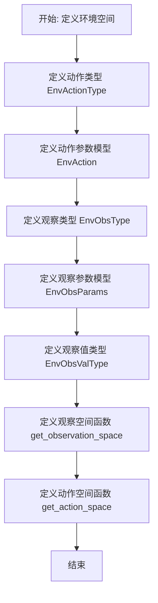
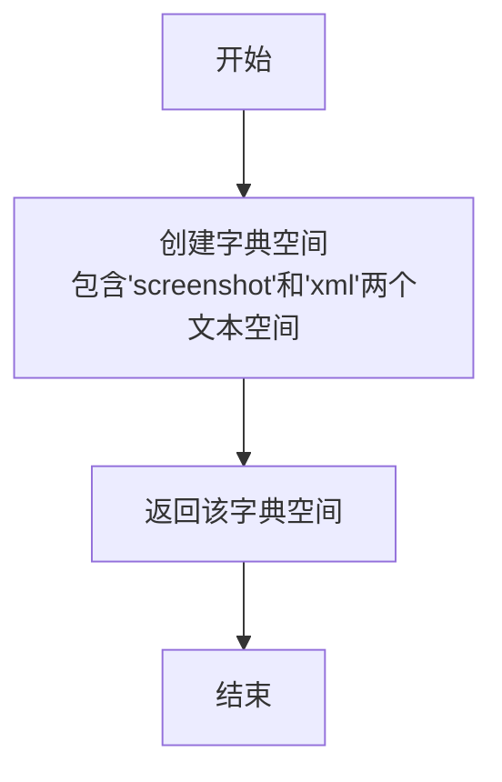

# `.\MetaGPT\metagpt\environment\android\env_space.py` 详细设计文档

该代码定义了一个用于移动设备自动化交互的环境空间，包括动作（Action）和观察（Observation）的类型、参数结构以及对应的Gymnasium空间定义。它通过Pydantic模型封装了系统操作（如返回、点击）和用户交互（如输入、滑动）的动作参数，以及获取屏幕截图和XML布局的观察参数，为强化学习或自动化测试提供了标准化的接口。

## 整体流程



## 类结构

```
BaseEnvActionType (基类)
└── EnvActionType (动作类型枚举)
BaseEnvAction (基类)
└── EnvAction (动作参数模型)
BaseEnvObsType (基类)
└── EnvObsType (观察类型枚举)
BaseEnvObsParams (基类)
└── EnvObsParams (观察参数模型)
```

## 全局变量及字段


### `EnvObsValType`
    
定义环境观测值的类型别名，表示观测值可以是字符串类型

类型：`TypeAlias[str]`
    


### `EnvActionType.NONE`
    
表示无操作的动作类型，仅用于获取观测值

类型：`int`
    


### `EnvActionType.SYSTEM_BACK`
    
表示系统返回键操作的动作类型

类型：`int`
    


### `EnvActionType.SYSTEM_TAP`
    
表示系统点击操作的动作类型

类型：`int`
    


### `EnvActionType.USER_INPUT`
    
表示用户文本输入操作的动作类型

类型：`int`
    


### `EnvActionType.USER_LONGPRESS`
    
表示用户长按操作的动作类型

类型：`int`
    


### `EnvActionType.USER_SWIPE`
    
表示用户滑动操作的动作类型

类型：`int`
    


### `EnvActionType.USER_SWIPE_TO`
    
表示用户滑动到指定位置操作的动作类型

类型：`int`
    


### `EnvAction.model_config`
    
Pydantic模型配置，允许任意类型以支持numpy数组等特殊类型

类型：`pydantic.ConfigDict`
    


### `EnvAction.action_type`
    
动作类型，指定要执行的具体操作类型

类型：`int`
    


### `EnvAction.coord`
    
操作坐标，表示动作发生的二维位置坐标

类型：`npt.NDArray[np.int64]`
    


### `EnvAction.tgt_coord`
    
目标操作坐标，表示滑动动作的目标位置坐标

类型：`npt.NDArray[np.int64]`
    


### `EnvAction.input_txt`
    
用户输入的文本内容

类型：`str`
    


### `EnvAction.orient`
    
滑动方向，指定滑动操作的方向

类型：`str`
    


### `EnvAction.dist`
    
滑动距离，指定滑动操作的距离大小

类型：`str`
    


### `EnvObsType.NONE`
    
表示无特定类型的观测，获取环境的完整观测

类型：`int`
    


### `EnvObsType.GET_SCREENSHOT`
    
表示获取屏幕截图类型的观测

类型：`int`
    


### `EnvObsType.GET_XML`
    
表示获取XML布局类型的观测

类型：`int`
    


### `EnvObsParams.model_config`
    
Pydantic模型配置，允许任意类型以支持路径等特殊类型

类型：`pydantic.ConfigDict`
    


### `EnvObsParams.obs_type`
    
观测类型，指定要获取的观测数据类型

类型：`int`
    


### `EnvObsParams.ss_name`
    
截图文件名，指定保存屏幕截图时的文件名称

类型：`str`
    


### `EnvObsParams.xml_name`
    
XML文件名，指定保存XML布局时的文件名称

类型：`str`
    


### `EnvObsParams.local_save_dir`
    
本地保存目录，指定观测数据保存的本地路径

类型：`Union[str, Path]`
    
    

## 全局函数及方法

### `get_observation_space`

该函数用于定义并返回一个Gymnasium环境中的观测空间（observation space）。观测空间是一个字典空间（`spaces.Dict`），包含两个键值对：`"screenshot"`和`"xml"`，每个键对应的值都是一个文本空间（`spaces.Text`），最大长度为256个字符。这表示观测结果是一个包含截图路径和XML文件路径的字典。

参数：无

返回值：`spaces.Dict`，返回一个Gymnasium字典空间，定义了观测数据的结构。

#### 流程图



#### 带注释源码

```python
def get_observation_space() -> spaces.Dict:
    # 创建一个Gymnasium的字典空间（spaces.Dict）
    # 该空间包含两个键：
    # 1. "screenshot": 一个文本空间（spaces.Text），最大长度为256个字符，用于存储截图文件的路径或内容。
    # 2. "xml": 一个文本空间（spaces.Text），最大长度为256个字符，用于存储XML文件的路径或内容。
    space = spaces.Dict({"screenshot": spaces.Text(256), "xml": spaces.Text(256)})
    # 返回定义好的观测空间
    return space
```


### `get_action_space`

该函数用于创建一个描述智能体在环境中可执行动作的Gymnasium空间字典。它根据给定的设备屏幕形状（宽度和高度），定义了一个包含多种动作类型及其参数的离散和连续空间，用于模拟移动设备上的用户交互操作。

参数：

- `device_shape`：`tuple[int, int]`，表示设备屏幕的尺寸，通常为 (宽度, 高度) 或 (高度, 宽度)，用于定义坐标操作的有效范围。

返回值：`spaces.Dict`，返回一个Gymnasium的字典空间，其中包含了动作类型、操作坐标、目标坐标、输入文本、滑动方向和滑动距离等动作参数的子空间定义。

#### 流程图

```mermaid
flowchart TD
    A[开始: get_action_space(device_shape)] --> B[创建字典空间<br>定义动作类型离散空间]
    B --> C[定义操作坐标连续空间<br>基于device_shape]
    C --> D[定义目标坐标连续空间<br>基于device_shape]
    D --> E[定义输入文本空间]
    E --> F[定义滑动方向文本空间]
    F --> G[定义滑动距离文本空间]
    G --> H[返回组合的字典空间]
    H --> I[结束]
```

#### 带注释源码

```python
def get_action_space(device_shape: tuple[int, int]) -> spaces.Dict:
    # 创建一个Gymnasium的字典空间，用于定义动作的各个组成部分
    space = spaces.Dict(
        {
            # 动作类型：使用Discrete空间，范围是0到EnvActionType枚举的长度-1
            "action_type": spaces.Discrete(len(EnvActionType)),
            # 操作坐标：使用Box空间（连续空间），定义二维坐标的有效范围。
            # 下限为(0, 0)，上限由device_shape参数决定，数据类型为np.int64。
            # 这模拟了在设备屏幕上的点击或长按位置。
            "coord": spaces.Box(
                np.array([0, 0], dtype=np.int64), np.array([device_shape[0], device_shape[1]], dtype=np.int64)
            ),
            # 目标坐标：同样使用Box空间，定义另一个二维坐标的有效范围。
            # 用于需要目标位置的动作，如滑动到某点(USER_SWIPE_TO)。
            "tgt_coord": spaces.Box(
                np.array([0, 0], dtype=np.int64), np.array([device_shape[0], device_shape[1]], dtype=np.int64)
            ),
            # 输入文本：使用Text空间，限制最大长度为256个字符。
            # 用于模拟用户文本输入(USER_INPUT)动作。
            "input_txt": spaces.Text(256),
            # 滑动方向：使用Text空间，限制最大长度为16个字符。
            # 用于描述滑动的方向(如'up', 'down', 'left', 'right')。
            "orient": spaces.Text(16),
            # 滑动距离：使用Text空间，限制最大长度为16个字符。
            # 用于描述滑动的距离(如'short', 'medium', 'long')。
            "dist": spaces.Text(16),
        }
    )
    return space
```


### `EnvAction.check_coord`

`EnvAction.check_coord` 是一个 Pydantic 模型验证器（field_validator），用于在将数据赋值给 `EnvAction` 类的 `coord` 或 `tgt_coord` 字段之前，对输入值进行预处理和验证。它的核心功能是确保无论输入的数据类型是什么（例如列表、元组或其他可迭代对象），最终存储到模型字段中的值都是一个 `numpy.ndarray` 类型的数组。如果输入值本身已经是 `numpy.ndarray` 类型，则直接返回；否则，使用 `numpy.array()` 函数将其转换为 `numpy.ndarray`。

参数：

-  `cls`：`type[EnvAction]`，指向 `EnvAction` 类本身的类引用。
-  `coord`：`Any`，待验证和转换的坐标数据，可以是列表、元组、`numpy.ndarray` 或其他可迭代对象。

返回值：`npt.NDArray[np.int64]`，转换后的 `numpy.ndarray` 数组，其数据类型为 `np.int64`。

#### 流程图

```mermaid
flowchart TD
    A[开始验证: check_coord(cls, coord)] --> B{coord 是否为<br>numpy.ndarray 实例?};
    B -- 是 --> C[直接返回 coord];
    B -- 否 --> D[使用 np.array(coord) 进行转换];
    D --> E[返回转换后的 numpy.ndarray];
    C --> E;
    E --> F[结束];
```

#### 带注释源码

```
    @field_validator("coord", "tgt_coord", mode="before")  # 装饰器：声明这是一个字段验证器，作用于'coord'和'tgt_coord'字段，模式为'before'（在Pydantic内部验证前执行）
    @classmethod  # 装饰器：声明这是一个类方法，第一个参数是类本身(cls)
    def check_coord(cls, coord) -> npt.NDArray[np.int64]:  # 方法定义：接收类引用cls和待验证值coord，返回指定类型的numpy数组
        if not isinstance(coord, np.ndarray):  # 条件判断：如果输入值coord不是numpy.ndarray类型
            return np.array(coord)  # 则使用numpy.array()函数将其转换为numpy数组并返回
        # 注意：如果coord已经是numpy.ndarray，函数会隐式返回None，Pydantic会使用原始值。
        # 更严谨的写法可以显式返回coord: `return coord`
```


## 关键组件


### 环境动作类型 (EnvActionType)

定义了与特定环境（如移动设备模拟）交互时可执行的操作类型枚举，包括无操作、系统返回、点击、用户输入、长按、滑动等。

### 环境动作 (EnvAction)

一个数据类，用于封装执行一个环境动作所需的所有参数，包括动作类型、操作坐标、目标坐标、输入文本、滑动方向和距离。

### 环境观察类型 (EnvObsType)

定义了从环境中获取观察结果的类型枚举，包括无操作、获取屏幕截图和获取XML。

### 环境观察参数 (EnvObsParams)

一个数据类，用于封装请求特定类型观察结果所需的参数，包括观察类型、截图文件名、XML文件名和本地保存目录。

### 观察空间生成函数 (get_observation_space)

定义并返回一个Gymnasium兼容的观察空间字典，用于描述智能体可以接收到的观察结果（截图和XML）的数据结构。

### 动作空间生成函数 (get_action_space)

根据给定的设备屏幕尺寸，定义并返回一个Gymnasium兼容的动作空间字典，用于描述智能体可以执行的所有动作及其参数的有效范围。


## 问题及建议


### 已知问题

-   **坐标验证不完整**：`EnvAction` 类中的 `check_coord` 验证器仅检查输入是否为 `np.ndarray` 类型，如果不是则进行转换。它缺少对转换后数组的形状、数据类型（如确保是 `np.int64`）以及值范围（如是否在设备屏幕边界内）的有效性验证，可能导致后续操作出现意外行为或错误。
-   **硬编码的文本空间限制**：`get_action_space` 和 `get_observation_space` 函数中，`spaces.Text` 的长度（如256、16）是硬编码的。这限制了输入文本和文件路径的长度，可能无法适应所有实际场景（例如，非常长的用户输入或复杂的文件路径），导致数据被截断或空间定义不准确。
-   **`EnvObsValType` 类型定义过于宽泛**：`EnvObsValType` 被简单地定义为 `str` 类型。这种定义过于宽泛，没有明确说明观察值的具体结构或格式（例如，是文件路径、XML内容字符串还是Base64编码的图像数据），降低了代码的可读性和类型安全性，可能在使用时引起混淆。
-   **`EnvObsParams` 字段默认值可能引发歧义**：`EnvObsParams` 中的 `local_save_dir` 字段默认值为空字符串 `""`。当需要保存文件时，空字符串可能不是一个有效的路径，这可能导致运行时错误或文件保存到非预期位置，缺乏清晰的无效值处理逻辑。

### 优化建议

-   **增强坐标验证逻辑**：在 `EnvAction.check_coord` 验证器中，增加对转换后数组的维度（确保是二维坐标）、数据类型（强制转换为 `np.int64`）以及值范围（可结合 `device_shape` 参数进行边界检查，尽管此参数在动作空间创建时已知，但验证器内无法直接访问，可考虑在动作执行前进行最终验证）的检查。或者，将设备形状信息传递给动作类，或在执行环境中进行最终验证。
-   **使文本空间长度可配置或自适应**：将 `get_action_space` 和 `get_observation_space` 函数中的文本长度参数化，允许通过函数参数或配置传入。例如，可以为 `input_txt`、`ss_name` 等字段定义最大长度常量或从配置中读取，使空间定义更灵活，适应不同需求。
-   **细化 `EnvObsValType` 类型定义**：使用 `TypedDict` 或更具体的字符串字面量类型（如 `Literal`）来定义 `EnvObsValType`，以明确观察值的具体含义和格式。例如，可以定义为 `Union[str, Dict[str, str]]` 或为不同的观察类型（截图、XML）定义不同的类型别名，提高代码的清晰度和类型检查的准确性。
-   **明确 `EnvObsParams` 的路径处理逻辑**：为 `EnvObsParams` 的 `local_save_dir` 字段设置一个更合理的默认值（如 `Path.cwd()` 表示当前目录），或在该字段的验证器中确保当需要保存文件时（`obs_type` 不是 `NONE` 且 `ss_name`/`xml_name` 非空），`local_save_dir` 必须是一个有效的、已存在的目录路径。同时，在代码使用该字段时，添加明确的路径存在性检查和创建逻辑。
-   **考虑使用枚举成员而非整数值**：在 `EnvAction` 和 `EnvObsParams` 模型中，`action_type` 和 `obs_type` 字段直接使用 `int` 类型。虽然它们与 `EnvActionType` 和 `EnvObsType` 枚举关联，但直接使用 `int` 类型可能绕过枚举的类型安全。建议将这些字段的类型声明为对应的枚举类型（如 `EnvActionType`），以利用枚举的成员检查和自动完成功能，提高代码的健壮性和可读性。Pydantic 能够很好地处理枚举类型的序列化和验证。


## 其它


### 设计目标与约束

本模块的设计目标是定义一个与特定环境（推测为移动设备模拟环境）交互的动作和观测空间。它继承自一个通用的基础环境空间框架（`BaseEnvAction`, `BaseEnvObsParams`），旨在提供类型化的动作指令和观测参数，以支持强化学习智能体在该环境中的训练与交互。主要约束包括：1) 必须与Gymnasium的`spaces` API兼容，以定义强化学习所需的状态和动作空间；2) 动作和观测的定义需能覆盖目标环境（如移动设备）的核心交互操作（如点击、滑动、输入）和状态获取方式（如截图、XML布局）；3) 使用Pydantic进行数据验证和序列化，确保数据结构的正确性。

### 错误处理与异常设计

模块中的错误处理主要通过Pydantic的字段验证器（`field_validator`）实现。在`EnvAction`类中，`check_coord`验证器确保`coord`和`tgt_coord`字段在赋值前被转换为`numpy.ndarray`类型，这有助于处理传入的列表或元组等可迭代对象，保证内部数据格式的一致性。如果转换失败，Pydantic将抛出`ValidationError`。对于全局函数`get_action_space`，其输入参数`device_shape`应为一个包含两个整数的元组，代表设备屏幕的尺寸（如`(height, width)`）。如果传入无效的`device_shape`（例如非整数、长度不为2），后续创建`spaces.Box`时可能会引发异常。模块本身未定义自定义异常，依赖调用方进行前置参数校验或处理Pydantic及Gymnasium可能抛出的标准异常。

### 数据流与状态机

本模块定义了环境交互的核心数据结构，但不直接管理状态机。其数据流围绕`EnvAction`和`EnvObsParams`两个数据容器展开：
1.  **动作流**：强化学习智能体或外部控制器生成一个`EnvAction`实例，其中包含`action_type`（如`USER_TAP`）及相应的参数（如`coord`）。此实例被序列化后传递给环境执行引擎，引擎解析动作类型和参数，在模拟设备上执行相应操作（如点击指定坐标）。
2.  **观测流**：当需要获取环境状态时，会创建一个`EnvObsParams`实例，指定`obs_type`（如`GET_SCREENSHOT`）及保存参数（如`ss_name`, `local_save_dir`）。此实例被传递给环境，环境根据参数生成观测值（如图片文件路径或XML内容字符串），并作为`EnvObsValType`（即`str`类型）返回。
模块通过`get_observation_space`和`get_action_space`函数定义了Gymnasium规范下的观测和动作空间，这些空间描述了智能体输入（动作）和输出（观测）的数据形状与范围，是强化学习算法与环境交互的契约。

### 外部依赖与接口契约

1.  **外部库依赖**：
    *   `numpy` & `numpy.typing`：用于定义和操作数值数组（`npt.NDArray[np.int64]`），特别是坐标数据。
    *   `gymnasium`：使用其`spaces`模块（`spaces.Dict`, `spaces.Discrete`, `spaces.Box`, `spaces.Text`）来定义强化学习所需的标准化动作和观测空间。
    *   `pydantic`：用于定义数据模型（`BaseModel`），提供字段类型声明、默认值、描述以及数据验证功能（通过`Field`和`field_validator`）。
    *   `pathlib` / `typing`：用于类型提示（`Union[str, Path]`）。

2.  **内部项目依赖**：
    *   `metagpt.base.base_env_space`：从中继承基类`BaseEnvAction`, `BaseEnvActionType`, `BaseEnvObsParams`, `BaseEnvObsType`。这构成了模块的核心抽象，约定了动作和观测类型的枚举以及数据模型的基类。

3.  **接口契约**：
    *   **对上游（智能体/算法）的契约**：通过`get_action_space`和`get_observation_space`函数提供Gymnasium兼容的空间对象。智能体应在此空间内采样动作（符合`EnvAction`字段定义）并接收对应格式的观测。
    *   **对下游（环境实现）的契约**：环境实现需要能够理解并处理`EnvAction`中定义的所有`action_type`及其关联字段，并能够根据`EnvObsParams`的指令生成相应的观测值（`EnvObsValType`）。`EnvAction`和`EnvObsParams`的Pydantic模型定义是双方交换数据的标准格式。

    