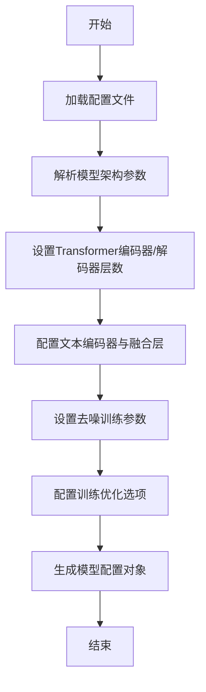

# `.\MetaGPT\metagpt\environment\android\grounding_dino_config.py` 详细设计文档

该代码定义了一个用于配置 GroundingDINO 模型的参数集合，包含了模型架构、训练策略、数据增强、文本编码器、Transformer 参数以及各种超参数，用于实例化或初始化一个基于 Transformer 的视觉-语言目标检测模型。

## 整体流程



## 类结构

```
无显式类定义
├── 全局配置参数集合
│   ├── 模型架构参数
│   ├── Transformer参数
│   ├── 文本编码参数
│   ├── 训练策略参数
│   └── 杂项参数
```

## 全局变量及字段


### `batch_size`
    
训练或推理时的批次大小，用于控制每次处理的数据量。

类型：`int`
    


### `modelname`
    
模型名称，标识当前使用的模型为GroundingDINO。

类型：`str`
    


### `backbone`
    
主干网络类型，指定为Swin Transformer的特定配置（Swin-T，输入224x224，在1K数据集上预训练）。

类型：`str`
    


### `position_embedding`
    
位置编码类型，指定为正弦（sine）编码。

类型：`str`
    


### `pe_temperatureH`
    
位置编码在高度方向上的温度参数，用于调整编码的频率。

类型：`int`
    


### `pe_temperatureW`
    
位置编码在宽度方向上的温度参数，用于调整编码的频率。

类型：`int`
    


### `return_interm_indices`
    
指定从主干网络中返回的中间层索引列表，用于多尺度特征提取。

类型：`list[int]`
    


### `backbone_freeze_keywords`
    
用于冻结主干网络特定层的关键词列表，当前为None表示不冻结。

类型：`NoneType`
    


### `enc_layers`
    
Transformer编码器的层数。

类型：`int`
    


### `dec_layers`
    
Transformer解码器的层数。

类型：`int`
    


### `pre_norm`
    
是否在Transformer层中使用前置层归一化（Pre-Layer Normalization）。

类型：`bool`
    


### `dim_feedforward`
    
Transformer前馈网络（FFN）的隐藏层维度。

类型：`int`
    


### `hidden_dim`
    
Transformer模型中的隐藏维度，即特征向量的维度。

类型：`int`
    


### `dropout`
    
Transformer模型中的基础Dropout率，用于防止过拟合。

类型：`float`
    


### `nheads`
    
Transformer中多头注意力机制的头数。

类型：`int`
    


### `num_queries`
    
解码器生成的查询（object queries）数量，对应模型预测的最大目标数。

类型：`int`
    


### `query_dim`
    
每个查询向量的维度。

类型：`int`
    


### `num_patterns`
    
用于解码器的模式嵌入（pattern embeddings）数量，当前为0表示未使用。

类型：`int`
    


### `num_feature_levels`
    
多尺度特征金字塔的层级数量。

类型：`int`
    


### `enc_n_points`
    
编码器中可变形注意力机制（Deformable Attention）的参考点数量。

类型：`int`
    


### `dec_n_points`
    
解码器中可变形注意力机制的参考点数量。

类型：`int`
    


### `two_stage_type`
    
两阶段检测器的类型，当前为标准（standard）模式。

类型：`str`
    


### `two_stage_bbox_embed_share`
    
是否在两阶段中共享边界框预测的嵌入层。

类型：`bool`
    


### `two_stage_class_embed_share`
    
是否在两阶段中共享类别预测的嵌入层。

类型：`bool`
    


### `transformer_activation`
    
Transformer中前馈网络使用的激活函数类型，当前为ReLU。

类型：`str`
    


### `dec_pred_bbox_embed_share`
    
是否在解码器的不同层之间共享边界框预测的嵌入层。

类型：`bool`
    


### `dn_box_noise_scale`
    
去噪训练（Denoising Training）中边界框噪声的缩放因子。

类型：`float`
    


### `dn_label_noise_ratio`
    
去噪训练中标签噪声的比例。

类型：`float`
    


### `dn_label_coef`
    
去噪训练中标签损失的权重系数。

类型：`float`
    


### `dn_bbox_coef`
    
去噪训练中边界框损失的权重系数。

类型：`float`
    


### `embed_init_tgt`
    
是否使用嵌入初始化目标（embedding initialization target），可能用于查询向量的初始化。

类型：`bool`
    


### `dn_labelbook_size`
    
去噪训练中标签簿（label book）的大小，用于噪声标签的生成。

类型：`int`
    


### `max_text_len`
    
文本输入的最大长度（token数）。

类型：`int`
    


### `text_encoder_type`
    
文本编码器的类型，指定为BERT基础未编码版本。

类型：`str`
    


### `use_text_enhancer`
    
是否使用文本增强器（Text Enhancer）模块来增强文本特征。

类型：`bool`
    


### `use_fusion_layer`
    
是否使用融合层（Fusion Layer）来融合视觉和文本特征。

类型：`bool`
    


### `use_checkpoint`
    
是否在训练时使用梯度检查点（Gradient Checkpointing）以节省内存。

类型：`bool`
    


### `use_transformer_ckpt`
    
是否对Transformer层使用梯度检查点。

类型：`bool`
    


### `use_text_cross_attention`
    
是否在解码器中使用文本交叉注意力（Text Cross-Attention）机制。

类型：`bool`
    


### `text_dropout`
    
文本编码器或相关模块的Dropout率。

类型：`float`
    


### `fusion_dropout`
    
特征融合层的Dropout率。

类型：`float`
    


### `fusion_droppath`
    
特征融合层使用的DropPath（Stochastic Depth）率。

类型：`float`
    


### `sub_sentence_present`
    
是否在文本处理中考虑子句（sub-sentence）级别的表示。

类型：`bool`
    


    

## 全局函数及方法


## 关键组件


### 模型配置与超参数

定义了GroundingDINO模型的完整配置参数，包括模型架构、Transformer设置、训练策略和文本处理相关的超参数。

### 骨干网络配置

指定了视觉骨干网络类型（Swin Transformer）及其具体配置（swin_T_224_1k），并支持冻结部分骨干网络层。

### 位置编码配置

配置了Transformer中使用的正弦位置编码，并引入了可调节的温度参数（pe_temperatureH/W）以控制位置编码的尺度。

### Transformer架构配置

详细定义了编码器-解码器Transformer的层数、注意力头数、前馈网络维度、激活函数、Dropout率以及多尺度特征融合的配置。

### 查询与解码配置

定义了目标检测查询的数量、维度、解码器预测头的共享策略，以及两阶段检测器的具体实现方式。

### 去噪训练策略

配置了用于稳定Transformer检测器训练的“去噪”（DN）策略的相关参数，包括噪声比例和损失系数。

### 文本编码与融合模块

配置了文本编码器的类型（BERT）、文本增强器、跨注意力融合层的使用，以及相关的Dropout和DropPath参数，用于实现视觉-语言的对齐与融合。

### 计算优化策略

启用了梯度检查点（checkpoint）技术，以在训练时节省显存，支持更大模型或批次的训练。


## 问题及建议


### 已知问题

-   **硬编码配置**：所有模型和训练的超参数都以硬编码的全局变量形式存在。这使得在不同环境（如开发、测试、生产）或针对不同任务（如不同数据集、不同目标类别）下复用和调整配置变得非常困难，容易出错。
-   **缺乏配置管理**：没有使用配置文件（如 YAML、JSON）或配置类来集中管理这些参数。这导致代码的可维护性差，当参数数量增加或需要版本控制时，管理将变得混乱。
-   **魔法数字**：代码中存在大量未加解释的“魔法数字”（如 `num_queries = 900`, `dn_labelbook_size = 2000`）。这些数字的含义和选择依据对于其他开发者或未来的维护者来说不明确，降低了代码的可读性和可理解性。
-   **潜在的配置错误风险**：由于参数分散且直接赋值，在复制、修改或共享配置时，容易遗漏或错误修改某些关键参数，且难以通过工具进行验证。
-   **不利于实验管理**：在机器学习项目中，跟踪不同超参数组合对应的实验结果至关重要。当前的硬编码方式使得系统化地记录和复现实验配置变得非常麻烦。

### 优化建议

-   **引入配置文件**：将所有这些配置参数移入一个结构化的配置文件（如 `config.yaml` 或 `config.json`）中。这允许将配置与代码逻辑分离，便于管理、版本控制和环境切换。
-   **使用配置类**：创建一个 `Config` 类，使用 `dataclasses` 或 `pydantic` 库来定义配置结构。这可以提供类型检查、默认值设置、配置验证（如确保某些值为正数）以及从文件加载配置的功能，大大增强鲁棒性。
-   **添加配置说明**：为每个配置参数添加注释或文档字符串，说明其用途、取值范围和影响。如果使用配置类或配置文件，可以将描述作为字段的元数据。
-   **实现配置覆盖机制**：支持通过命令行参数或环境变量来覆盖配置文件中的默认值。这在快速实验和容器化部署时非常有用。
-   **建立配置版本控制**：将配置文件纳入版本控制系统（如 Git），并考虑为重要实验生成配置快照，以确保实验的可复现性。


## 其它


### 设计目标与约束

本代码定义了一个用于配置“GroundingDINO”模型超参数的系统。其核心设计目标是提供一个集中、可读的配置模块，用于实例化一个基于Transformer架构的、结合视觉与文本信息的对象检测模型。主要约束包括：必须与下游模型构建代码的接口兼容；配置项需覆盖从骨干网络、Transformer编码器/解码器到去噪训练等复杂组件的所有关键参数；部分参数（如`use_checkpoint`）旨在平衡训练时的内存使用与计算效率。

### 错误处理与异常设计

当前代码片段未包含任何运行时错误处理或验证逻辑。所有配置均以硬编码的全局变量形式存在。潜在的风险包括：输入无效的参数值（如负的`dropout`率、不存在的`backbone`类型）会导致下游模型初始化失败；参数间依赖关系（例如，`num_feature_levels`与`return_interm_indices`的长度可能需要匹配）未被显式检查。改进方向是在使用这些配置创建模型前，增加一个参数验证层，对值的范围、类型以及逻辑一致性进行检查并抛出清晰的异常信息。

### 数据流与状态机

此代码模块本身不涉及运行时数据流或状态机。它定义的是静态的配置参数。这些参数在程序启动时被加载，并作为输入流向后续的模型构建函数。模型构建函数将消费这些配置，初始化对应的神经网络模块（如视觉骨干网络、文本编码器、Transformer层），从而确定一个固定结构的计算图。在训练或推理过程中，真正的数据流（图像张量、文本标记）将在由这些配置定义的模型计算图中流动。

### 外部依赖与接口契约

该配置模块隐式地定义了与多个外部库和组件的强依赖关系：
1.  **模型实现库**：依赖于一个实现了“GroundingDINO”模型的库，该库需能解析这些特定命名的参数。
2.  **PyTorch/TensorFlow**：作为基础的深度学习框架。
3.  **Hugging Face Transformers**：因为`text_encoder_type`指定为`"bert-base-uncased"`，所以需要依赖该库来加载预训练的BERT文本编码器。
4.  **预训练权重**：`backbone`和`text_encoder_type`等参数暗示需要从特定来源（如Torchvision、Hugging Face Hub）下载对应的预训练权重文件。
接口契约表现为：任何使用此配置字典的模型构建器，都期望这些变量名和数据类型是固定的，修改变量名或类型会破坏契约。

### 配置管理与可维护性

当前将所有配置以扁平化的全局变量形式呈现，在参数数量众多时（如本例）会降低可读性和可维护性。它缺乏分组（如模型结构、训练策略、文本处理）、注释、默认值管理以及环境特定的覆盖机制（如开发/生产环境）。建议重构为使用配置类（如dataclass）或配置文件（如YAML/JSON），并可能引入分层配置和环境变量注入，以提升管理效率。

### 性能与资源考量

多个配置参数直接影响到模型的性能和资源消耗：
*   **计算复杂度**：`hidden_dim`， `nheads`， `enc_layers`， `dec_layers`， `num_queries` 决定了Transformer核心部分的计算量。
*   **内存消耗**：`batch_size`， `num_queries`， `max_text_len`， `num_feature_levels` 以及 `use_checkpoint` 和 `use_transformer_ckpt`（激活检查点技术）共同影响训练期间的内存峰值使用量。
*   **模型容量**：`dim_feedforward`， `hidden_dim` 与模型表征能力相关。
这些参数需要根据可用的硬件资源（GPU内存）和任务需求（速度 vs. 精度）进行仔细权衡和调优。

    