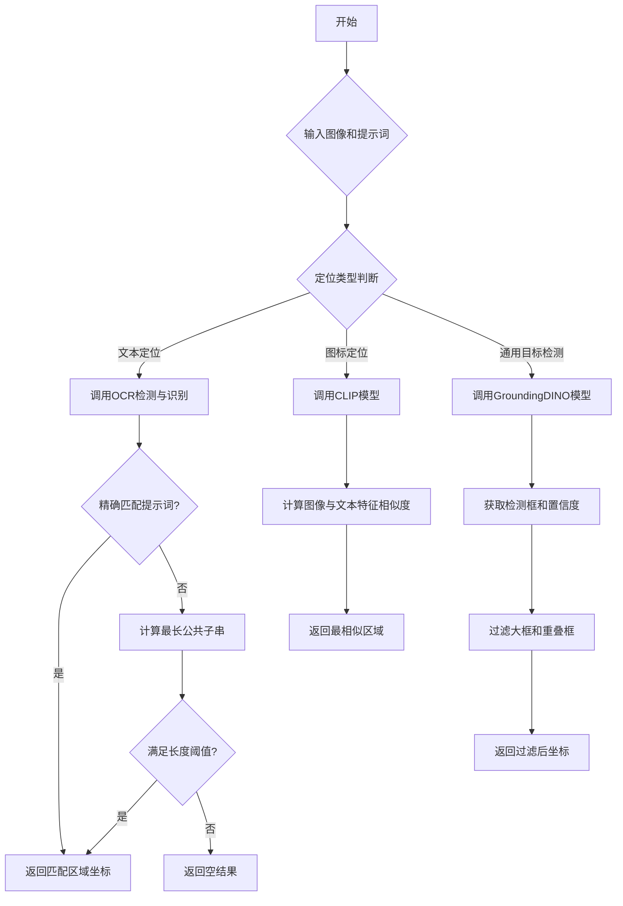
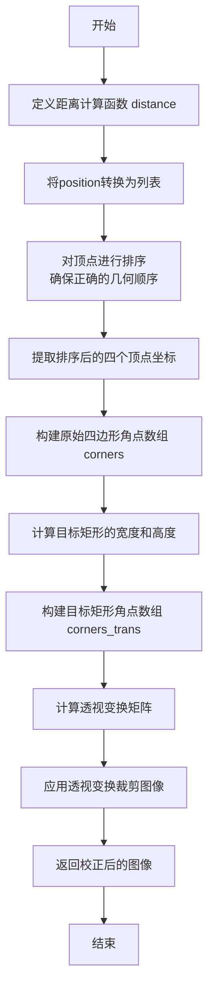
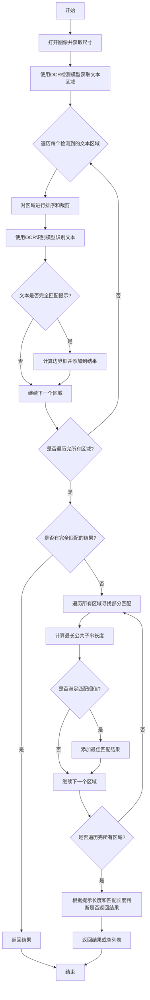
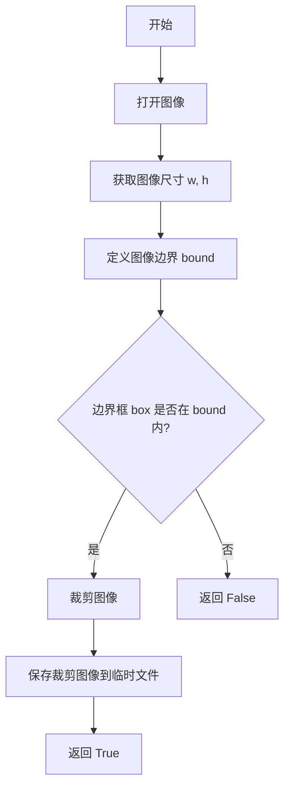
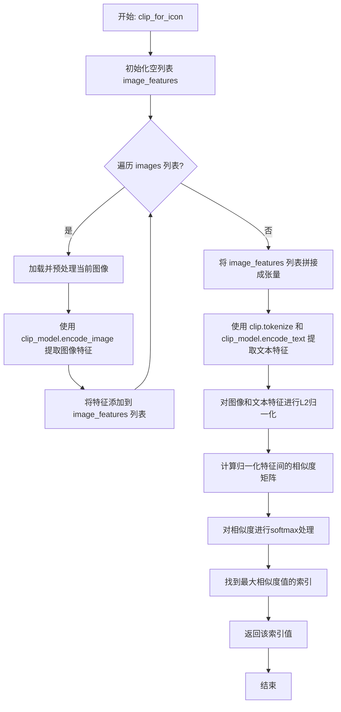
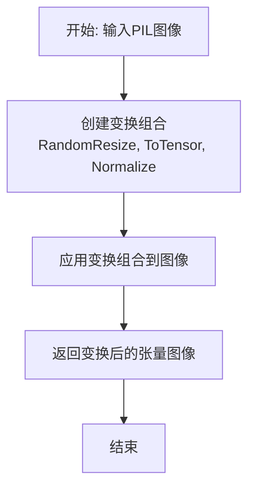
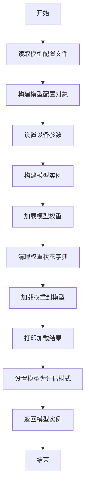
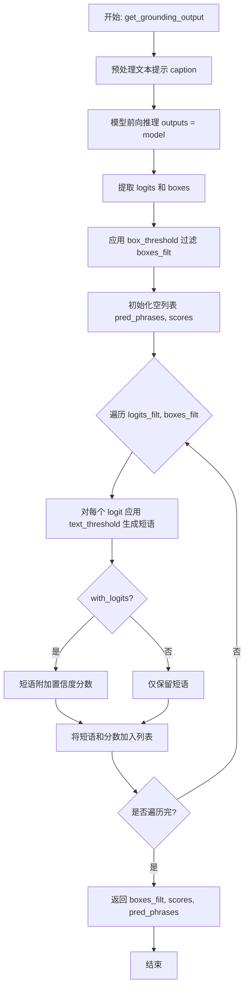
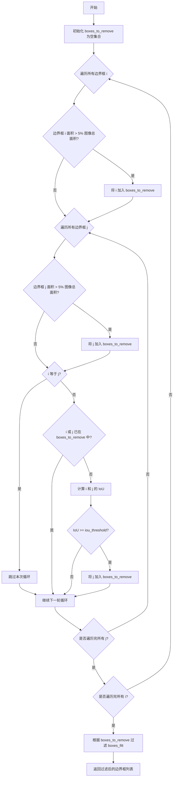
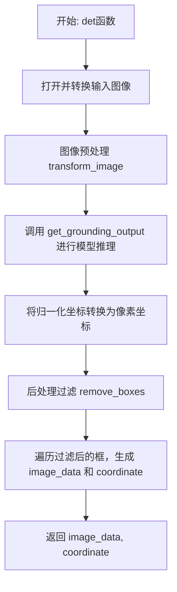

# `.\MetaGPT\metagpt\environment\android\text_icon_localization.py` 详细设计文档

该代码文件是MobileAgent项目的一部分，主要功能是结合OCR（光学字符识别）和视觉-语言模型（CLIP、GroundingDINO）在图像中定位文本和图标元素。它通过OCR检测和识别文本区域，通过CLIP进行图标相似度匹配，并通过GroundingDINO进行开放词汇的目标检测，最终返回目标元素在图像中的坐标位置。

## 整体流程



## 类结构

```
无显式类结构
├── 全局函数 (文本定位相关)
│   ├── crop_image
│   ├── calculate_size
│   ├── order_point
│   ├── longest_common_substring_length
│   └── ocr
├── 全局函数 (图标定位相关)
│   ├── calculate_iou
│   ├── in_box
│   ├── crop_for_clip
│   └── clip_for_icon
├── 全局函数 (通用目标检测相关)
│   ├── transform_image
│   ├── load_model
│   ├── get_grounding_output
│   ├── remove_boxes
│   └── det
```

## 全局变量及字段


    

## 全局函数及方法


### `crop_image`

该函数接收一个图像和一个四边形顶点坐标列表，通过透视变换将四边形区域校正并裁剪为一个矩形图像。它首先对顶点进行排序以确保正确的几何顺序，然后计算目标矩形的宽度和高度，最后使用OpenCV的透视变换函数进行图像校正。

参数：

- `img`：`any`，输入图像，通常是一个NumPy数组（OpenCV图像格式）
- `position`：`any`，一个包含4个点坐标的列表或数组，每个点是一个[x, y]坐标，表示要裁剪的四边形区域

返回值：`any`，经过透视变换校正后的矩形图像（NumPy数组）

#### 流程图



#### 带注释源码

```python
def crop_image(img: any, position: any) -> any:
    # 定义辅助函数：计算两点之间的欧几里得距离
    def distance(x1, y1, x2, y2):
        return math.sqrt(pow(x1 - x2, 2) + pow(y1 - y2, 2))

    # 将输入的位置数据转换为列表格式以便处理
    position = position.tolist()
    
    # 对四个顶点进行排序：首先按x坐标排序
    for i in range(4):
        for j in range(i + 1, 4):
            if position[i][0] > position[j][0]:
                tmp = position[j]
                position[j] = position[i]
                position[i] = tmp
    
    # 调整前两个点的y坐标顺序（左上和左下）
    if position[0][1] > position[1][1]:
        tmp = position[0]
        position[0] = position[1]
        position[1] = tmp

    # 调整后两个点的y坐标顺序（右上和右下）
    if position[2][1] > position[3][1]:
        tmp = position[2]
        position[2] = position[3]
        position[3] = tmp

    # 提取排序后的四个顶点坐标
    x1, y1 = position[0][0], position[0][1]
    x2, y2 = position[2][0], position[2][1]
    x3, y3 = position[3][0], position[3][1]
    x4, y4 = position[1][0], position[1][1]

    # 构建原始四边形的角点数组
    corners = np.zeros((4, 2), np.float32)
    corners[0] = [x1, y1]
    corners[1] = [x2, y2]
    corners[2] = [x4, y4]
    corners[3] = [x3, y3]

    # 计算目标矩形的宽度（左右边中点距离）和高度（上下边中点距离）
    img_width = distance((x1 + x4) / 2, (y1 + y4) / 2, (x2 + x3) / 2, (y2 + y3) / 2)
    img_height = distance((x1 + x2) / 2, (y1 + y2) / 2, (x4 + x3) / 2, (y4 + y3) / 2)

    # 构建目标矩形的角点数组（一个正矩形）
    corners_trans = np.zeros((4, 2), np.float32)
    corners_trans[0] = [0, 0]
    corners_trans[1] = [img_width - 1, 0]
    corners_trans[2] = [0, img_height - 1]
    corners_trans[3] = [img_width - 1, img_height - 1]

    # 计算从原始四边形到目标矩形的透视变换矩阵
    transform = cv2.getPerspectiveTransform(corners, corners_trans)
    # 应用透视变换，将四边形区域校正为矩形
    dst = cv2.warpPerspective(img, transform, (int(img_width), int(img_height)))
    # 返回校正后的图像
    return dst
```


### `calculate_size`

计算一个矩形框的面积。该函数接收一个表示矩形框的列表或数组（格式为 `[x1, y1, x2, y2]`，其中 `(x1, y1)` 是左上角坐标，`(x2, y2)` 是右下角坐标），并返回其面积（宽度乘以高度）。

参数：

-  `box`：`any`，一个包含四个数值的序列（如列表、元组或数组），代表矩形框的坐标 `[x1, y1, x2, y2]`。

返回值：`any`，矩形框的面积，通常是一个数值（整数或浮点数）。

#### 流程图

```mermaid
graph TD
    A[开始] --> B[接收矩形框坐标 box]
    B --> C[计算宽度: box[2] - box[0]]
    C --> D[计算高度: box[3] - box[1]]
    D --> E[计算面积: 宽度 * 高度]
    E --> F[返回面积]
    F --> G[结束]
```

#### 带注释源码

```
def calculate_size(box: any) -> any:
    # 计算矩形框的面积
    # 参数 box: 一个包含四个元素的序列，格式为 [x1, y1, x2, y2]
    # 返回值: 矩形框的面积 (宽度 * 高度)
    return (box[2] - box[0]) * (box[3] - box[1])
```


### `order_point`

该函数用于对输入的四边形的四个顶点进行排序，使其按照顺时针或逆时针的顺序排列。它首先计算四个点的质心，然后根据每个点相对于质心的极角进行排序，最后调整顺序以确保第一个点位于质心的左侧。

参数：

- `cooperation`：`any`，一个包含四个点坐标的列表或数组，每个点由两个坐标值（x, y）表示。

返回值：`any`，一个形状为 (4, 2) 的 NumPy 数组，包含排序后的四个点坐标，数据类型为 `float32`。

#### 流程图

```mermaid
flowchart TD
    A[开始] --> B[将输入数组重塑为 (4, 2) 形状]
    B --> C[计算四个点的质心]
    C --> D[计算每个点相对于质心的极角]
    D --> E[根据极角对点进行排序]
    E --> F{第一个点的 x 坐标 > 质心的 x 坐标?}
    F -- 是 --> G[调整点的顺序]
    F -- 否 --> H[保持当前顺序]
    G --> I[将结果重塑为 (4, 2) 并转换为 float32]
    H --> I
    I --> J[返回排序后的点]
```

#### 带注释源码

```python
def order_point(cooperation: any) -> any:
    # 将输入数组重塑为 (4, 2) 形状，表示四个点的坐标
    arr = np.array(cooperation).reshape([4, 2])
    
    # 计算四个点的坐标和，用于后续计算质心
    sum_ = np.sum(arr, 0)
    
    # 计算质心坐标
    centroid = sum_ / arr.shape[0]
    
    # 计算每个点相对于质心的极角（角度）
    theta = np.arctan2(arr[:, 1] - centroid[1], arr[:, 0] - centroid[0])
    
    # 根据极角对点进行排序，得到按角度排序的点
    sort_points = arr[np.argsort(theta)]
    
    # 将排序后的点重塑为 (4, 2) 形状
    sort_points = sort_points.reshape([4, -1])
    
    # 如果排序后的第一个点的 x 坐标大于质心的 x 坐标，调整点的顺序
    if sort_points[0][0] > centroid[0]:
        sort_points = np.concatenate([sort_points[3:], sort_points[:3]])
    
    # 将结果重塑为 (4, 2) 形状，并转换为 float32 数据类型
    sort_points = sort_points.reshape([4, 2]).astype("float32")
    
    # 返回排序后的点坐标
    return sort_points
```

### `longest_common_substring_length`

该函数计算两个字符串的最长公共子序列（Longest Common Subsequence, LCS）的长度。它使用动态规划方法，通过构建一个二维数组来存储子问题的解，最终返回两个字符串的最长公共子序列的长度。

参数：
- `str1`：`str`，第一个输入字符串
- `str2`：`str`，第二个输入字符串

返回值：`int`，两个字符串的最长公共子序列的长度

#### 流程图

```mermaid
flowchart TD
    A[开始] --> B[初始化动态规划表 dp<br>大小为 (m+1) x (n+1)]
    B --> C[遍历 str1 的每个字符 i]
    C --> D[遍历 str2 的每个字符 j]
    D --> E{str1[i-1] == str2[j-1]?}
    E -- 是 --> F[dp[i][j] = dp[i-1][j-1] + 1]
    E -- 否 --> G[dp[i][j] = max(dp[i-1][j], dp[i][j-1])]
    F --> H
    G --> H
    H --> I{是否遍历完所有字符?}
    I -- 否 --> D
    I -- 是 --> J[返回 dp[m][n]]
    J --> K[结束]
```

#### 带注释源码

```python
def longest_common_substring_length(str1: str, str2: str) -> int:
    # 获取两个字符串的长度
    m = len(str1)
    n = len(str2)
    
    # 初始化动态规划表 dp，大小为 (m+1) x (n+1)，所有元素初始化为 0
    dp = [[0] * (n + 1) for _ in range(m + 1)]
    
    # 遍历 str1 的每个字符
    for i in range(1, m + 1):
        # 遍历 str2 的每个字符
        for j in range(1, n + 1):
            # 如果当前字符相等，则 LCS 长度加 1
            if str1[i - 1] == str2[j - 1]:
                dp[i][j] = dp[i - 1][j - 1] + 1
            else:
                # 如果当前字符不相等，则取左侧或上侧的最大值
                dp[i][j] = max(dp[i - 1][j], dp[i][j - 1])
    
    # 返回 dp 表的最后一个元素，即整个字符串的 LCS 长度
    return dp[m][n]
```

### `ocr`

该函数使用OCR（光学字符识别）技术，在给定图像中定位并识别与指定提示文本匹配的文本区域。它首先尝试找到与提示文本完全匹配的文本，如果未找到，则通过计算最长公共子串长度来寻找部分匹配的文本。函数返回匹配文本的边界框坐标以及扩展后的坐标区域。

参数：

- `image_path`：`Path`，输入图像的文件路径。
- `prompt`：`str`，要搜索的文本提示。
- `ocr_detection`：`any`，OCR检测模型或函数，用于检测图像中的文本区域。
- `ocr_recognition`：`any`，OCR识别模型或函数，用于识别裁剪图像中的文本内容。
- `x`：`int`，输出坐标的宽度缩放因子。
- `y`：`int`，输出坐标的高度缩放因子。

返回值：`any`，返回两个列表：`text_data`（匹配文本的边界框坐标）和`coordinate`（扩展后的坐标区域）。如果未找到匹配的文本，则返回空列表。

#### 流程图



#### 带注释源码

```python
def ocr(image_path: Path, prompt: str, ocr_detection: any, ocr_recognition: any, x: int, y: int) -> any:
    # 初始化存储文本数据和坐标的列表
    text_data = []
    coordinate = []

    # 打开图像并获取原始尺寸
    image = Image.open(image_path)
    iw, ih = image.size

    # 使用OpenCV读取图像以进行OCR检测
    image_full = cv2.imread(str(image_path))
    # 使用OCR检测模型获取文本区域的多边形坐标
    det_result = ocr_detection(image_full)
    det_result = det_result["polygons"]

    # 遍历每个检测到的文本区域
    for i in range(det_result.shape[0]):
        # 对多边形坐标进行排序，以便后续裁剪
        pts = order_point(det_result[i])
        # 根据排序后的坐标裁剪图像
        image_crop = crop_image(image_full, pts)
        # 使用OCR识别模型识别裁剪图像中的文本
        result = ocr_recognition(image_crop)["text"][0]

        # 如果识别结果与提示文本完全匹配
        if result == prompt:
            # 将多边形坐标转换为边界框坐标 [x1, y1, x2, y2]
            box = [int(e) for e in list(pts.reshape(-1))]
            box = [box[0], box[1], box[4], box[5]]

            # 如果边界框面积过大（超过图像面积的5%），则跳过
            if calculate_size(box) > 0.05 * iw * ih:
                continue

            # 将边界框坐标按缩放因子调整，并添加到结果列表
            text_data.append(
                [
                    int(max(0, box[0] - 10) * x / iw),
                    int(max(0, box[1] - 10) * y / ih),
                    int(min(box[2] + 10, iw) * x / iw),
                    int(min(box[3] + 10, ih) * y / ih),
                ]
            )
            # 添加扩展后的坐标区域（用于后续处理）
            coordinate.append(
                [
                    int(max(0, box[0] - 300) * x / iw),
                    int(max(0, box[1] - 400) * y / ih),
                    int(min(box[2] + 300, iw) * x / iw),
                    int(min(box[3] + 400, ih) * y / ih),
                ]
            )

    # 如果没有找到完全匹配的文本，则尝试部分匹配
    max_length = 0
    if len(text_data) == 0:
        for i in range(det_result.shape[0]):
            pts = order_point(det_result[i])
            image_crop = crop_image(image_full, pts)
            result = ocr_recognition(image_crop)["text"][0]

            # 如果识别结果长度小于提示文本长度的30%，则跳过
            if len(result) < 0.3 * len(prompt):
                continue

            # 计算识别结果与提示文本的最长公共子串长度
            if result in prompt:
                now_length = len(result)
            else:
                now_length = longest_common_substring_length(result, prompt)

            # 更新最大匹配长度和对应的边界框
            if now_length > max_length:
                max_length = now_length
                box = [int(e) for e in list(pts.reshape(-1))]
                box = [box[0], box[1], box[4], box[5]]

                # 更新结果列表为当前最佳匹配
                text_data = [
                    [
                        int(max(0, box[0] - 10) * x / iw),
                        int(max(0, box[1] - 10) * y / ih),
                        int(min(box[2] + 10, iw) * x / iw),
                        int(min(box[3] + 10, ih) * y / ih),
                    ]
                ]
                coordinate = [
                    [
                        int(max(0, box[0] - 300) * x / iw),
                        int(max(0, box[1] - 400) * y / ih),
                        int(min(box[2] + 300, iw) * x / iw),
                        int(min(box[3] + 400, ih) * y / ih),
                    ]
                ]

        # 根据提示文本长度和最大匹配长度判断是否返回结果
        if len(prompt) <= 10:
            if max_length >= 0.8 * len(prompt):
                return text_data, coordinate
            else:
                return [], []
        elif (len(prompt) > 10) and (len(prompt) <= 20):
            if max_length >= 0.5 * len(prompt):
                return text_data, coordinate
            else:
                return [], []
        else:
            if max_length >= 0.4 * len(prompt):
                return text_data, coordinate
            else:
                return [], []
    else:
        # 如果找到了完全匹配的文本，直接返回结果
        return text_data, coordinate
```


### `calculate_iou`

计算两个矩形框的交并比（Intersection over Union, IoU），用于衡量两个矩形区域的重叠程度。

参数：

- `box1`：`list`，第一个矩形框，格式为 `[x1, y1, x2, y2]`，其中 `(x1, y1)` 是左上角坐标，`(x2, y2)` 是右下角坐标
- `box2`：`list`，第二个矩形框，格式与 `box1` 相同

返回值：`float`，两个矩形框的交并比，范围在 `[0, 1]` 之间。值为 `0` 表示没有重叠，值为 `1` 表示完全重叠。

#### 流程图

```mermaid
flowchart TD
    A[开始] --> B[计算交集区域左上角坐标<br/>x_a = max(box1[0], box2[0])<br/>y_a = max(box1[1], box2[1])]
    B --> C[计算交集区域右下角坐标<br/>x_b = min(box1[2], box2[2])<br/>y_b = min(box1[3], box2[3])]
    C --> D{交集区域是否存在?<br/>x_b > x_a 且 y_b > y_a?}
    D -- 是 --> E[计算交集面积<br/>inter_area = (x_b - x_a) * (y_b - y_a)]
    D -- 否 --> F[交集面积为0<br/>inter_area = 0]
    F --> G
    E --> G[计算两个矩形框各自的面积<br/>box1_area = (box1[2]-box1[0])*(box1[3]-box1[1])<br/>box2_area = (box2[2]-box2[0])*(box2[3]-box2[1])]
    G --> H[计算并集面积<br/>union_area = box1_area + box2_area - inter_area]
    H --> I[计算交并比<br/>iou = inter_area / union_area]
    I --> J[返回 iou]
```

#### 带注释源码

```python
def calculate_iou(box1: list, box2: list) -> float:
    # 计算两个矩形框交集区域的左上角和右下角坐标
    x_a = max(box1[0], box2[0])
    y_a = max(box1[1], box2[1])
    x_b = min(box1[2], box2[2])
    y_b = min(box1[3], box2[3])

    # 计算交集区域的面积。如果 x_b <= x_a 或 y_b <= y_a，说明没有交集，面积为0。
    inter_area = max(0, x_b - x_a) * max(0, y_b - y_a)

    # 分别计算两个矩形框的面积
    box1_area = (box1[2] - box1[0]) * (box1[3] - box1[1])
    box2_area = (box2[2] - box2[0]) * (box2[3] - box2[1])

    # 计算并集面积：两个矩形面积之和减去交集面积
    union_area = box1_area + box2_area - inter_area

    # 计算交并比（IoU）：交集面积除以并集面积
    iou = inter_area / union_area

    # 返回计算结果
    return iou
```


### `in_box`

判断一个边界框是否完全位于另一个边界框内部。

参数：

- `box`：`list`，待判断的边界框，格式为 `[x1, y1, x2, y2]`，其中 `(x1, y1)` 是左上角坐标，`(x2, y2)` 是右下角坐标。
- `target`：`list`，目标边界框，格式与 `box` 相同。

返回值：`bool`，如果 `box` 完全位于 `target` 内部则返回 `True`，否则返回 `False`。

#### 流程图

```mermaid
flowchart TD
    A[开始] --> B{判断条件}
    B -->|box[0] > target[0]| C
    B -->|不满足| F[返回 False]
    C -->|box[1] > target[1]| D
    C -->|不满足| F
    D -->|box[2] < target[2]| E
    D -->|不满足| F
    E -->|box[3] < target[3]| G[返回 True]
    E -->|不满足| F
```

#### 带注释源码

```python
def in_box(box: list, target: list) -> bool:
    # 检查 box 的左上角 x 坐标是否大于 target 的左上角 x 坐标
    # 检查 box 的左上角 y 坐标是否大于 target 的左上角 y 坐标
    # 检查 box 的右下角 x 坐标是否小于 target 的右下角 x 坐标
    # 检查 box 的右下角 y 坐标是否小于 target 的右下角 y 坐标
    # 如果所有条件都满足，说明 box 完全在 target 内部
    if (box[0] > target[0]) and (box[1] > target[1]) and (box[2] < target[2]) and (box[3] < target[3]):
        return True
    else:
        return False
```


### `crop_for_clip`

该函数用于根据给定的边界框从图像中裁剪出一个子区域，并将其保存为临时文件。它首先检查边界框是否完全位于图像边界内，如果是，则执行裁剪并保存；否则，返回失败标志。

参数：

- `image`：`any`，输入图像的路径或图像对象，用于打开并裁剪。
- `box`：`any`，一个包含四个整数的列表或元组，表示裁剪区域的边界框，格式为 `[x_min, y_min, x_max, y_max]`。
- `i`：`int`，一个整数，用于生成保存裁剪图像的文件名，例如 `{i}.png`。
- `temp_file`：`Path`，一个 `Path` 对象，表示临时文件保存的目录路径。

返回值：`bool`，如果裁剪成功并保存文件，则返回 `True`；如果边界框不在图像边界内，则返回 `False`。

#### 流程图



#### 带注释源码

```python
def crop_for_clip(image: any, box: any, i: int, temp_file: Path) -> bool:
    # 打开输入图像
    image = Image.open(image)
    # 获取图像的宽度和高度
    w, h = image.size
    # 定义图像的完整边界，从 (0,0) 到 (w,h)
    bound = [0, 0, w, h]
    # 检查给定的边界框是否完全位于图像边界内
    if in_box(box, bound):
        # 如果边界框在图像内，则裁剪图像
        cropped_image = image.crop(box)
        # 将裁剪后的图像保存到临时目录，文件名为 {i}.png
        cropped_image.save(temp_file.joinpath(f"{i}.png"))
        # 返回成功标志
        return True
    else:
        # 如果边界框不在图像内，返回失败标志
        return False
```


### `clip_for_icon`

该函数使用预训练的CLIP模型，计算一组图像与一个文本提示（prompt）之间的相似度，并返回与文本最相似的图像在输入列表中的索引位置。它通过提取图像和文本的特征向量，计算余弦相似度，并选择相似度最高的图像来实现。

参数：

-  `clip_model`：`any`，预加载的CLIP模型实例，用于编码图像和文本。
-  `clip_preprocess`：`any`，CLIP模型对应的图像预处理函数，用于将PIL图像转换为模型输入张量。
-  `images`：`any`，一个包含图像文件路径的列表（或可迭代对象），这些图像将与文本提示进行比较。
-  `prompt`：`str`，一个文本字符串，作为查询条件，用于与图像进行相似度匹配。

返回值：`any`，返回一个整数，表示在`images`列表中与`prompt`最相似的图像的索引位置。

#### 流程图



#### 带注释源码

```python
def clip_for_icon(clip_model: any, clip_preprocess: any, images: any, prompt: str) -> any:
    # 步骤1: 提取所有输入图像的特征
    image_features = []
    for image_file in images:
        # 1.1 加载图像并使用CLIP预处理函数进行预处理
        image = clip_preprocess(Image.open(image_file)).unsqueeze(0).to(next(clip_model.parameters()).device)
        # 1.2 使用CLIP模型的图像编码器提取特征
        image_feature = clip_model.encode_image(image)
        # 1.3 将特征向量添加到列表中
        image_features.append(image_feature)
    # 1.4 将列表中的所有特征张量在批次维度上拼接起来
    image_features = torch.cat(image_features)

    # 步骤2: 提取文本提示的特征
    # 2.1 对文本进行分词并转换为模型输入张量，移动到与模型相同的设备
    text = clip.tokenize([prompt]).to(next(clip_model.parameters()).device)
    # 2.2 使用CLIP模型的文本编码器提取特征
    text_features = clip_model.encode_text(text)

    # 步骤3: 计算相似度
    # 3.1 对图像和文本特征向量进行L2归一化，以便计算余弦相似度
    image_features /= image_features.norm(dim=-1, keepdim=True)
    text_features /= text_features.norm(dim=-1, keepdim=True)
    # 3.2 计算归一化特征的点积（即余弦相似度），缩放100倍后应用softmax
    similarity = (100.0 * image_features @ text_features.T).softmax(dim=0).squeeze(0)
    # 3.3 找到相似度最高的位置
    _, max_pos = torch.max(similarity, dim=0)
    pos = max_pos.item()

    # 步骤4: 返回最相似图像的索引
    return pos
```


### `transform_image`

该函数用于对输入的PIL图像进行预处理转换，使其符合Grounding DINO模型的输入要求。它应用了一系列图像变换，包括调整大小、转换为张量以及归一化。

参数：

-  `image_pil`：`any`，输入的PIL图像对象。

返回值：`any`，一个经过变换的、符合模型输入格式的张量图像。

#### 流程图



#### 带注释源码

```
def transform_image(image_pil: any) -> any:
    # 定义一个图像变换的组合管道
    transform = T.Compose(
        [
            # 1. 调整图像大小：将图像的短边缩放到800像素，长边不超过1333像素
            T.RandomResize([800], max_size=1333),
            # 2. 将PIL图像或numpy数组转换为PyTorch张量，并调整通道顺序为(C, H, W)
            T.ToTensor(),
            # 3. 使用ImageNet数据集的均值和标准差对张量进行归一化
            T.Normalize([0.485, 0.456, 0.406], [0.229, 0.224, 0.225]),
        ]
    )
    # 应用变换。由于`T.RandomResize`需要目标尺寸参数，这里传入None。
    # 函数返回变换后的图像和一个占位符（通常为目标信息，此处为None）。
    image, _ = transform(image_pil, None)  # 返回形状为 (3, h, w) 的张量
    # 返回处理后的图像张量
    return image
```


### `load_model`

该函数用于加载并初始化 GroundingDINO 模型。它从指定的配置文件读取模型配置，加载预训练的模型权重，并将模型设置为评估模式。

参数：

- `model_checkpoint_path`：`Path`，预训练模型权重文件的路径
- `device`：`str`，指定模型加载的设备（如 "cpu" 或 "cuda"）

返回值：`any`，返回加载并初始化后的 GroundingDINO 模型实例

#### 流程图



#### 带注释源码

```python
def load_model(model_checkpoint_path: Path, device: str) -> any:
    # 模型配置文件的路径
    model_config_path = "grounding_dino_config.py"
    
    # 从配置文件读取模型配置
    args = SLConfig.fromfile(model_config_path)
    
    # 设置设备参数
    args.device = device
    
    # 根据配置构建模型实例
    model = build_model(args)
    
    # 加载预训练模型权重
    checkpoint = torch.load(model_checkpoint_path, map_location="cpu")
    
    # 清理权重状态字典，移除不必要的键
    load_res = model.load_state_dict(clean_state_dict(checkpoint["model"]), strict=False)
    
    # 打印权重加载结果
    print(load_res)
    
    # 将模型设置为评估模式
    _ = model.eval()
    
    # 返回加载好的模型
    return model
```


### `get_grounding_output`

该函数是 Grounding DINO 模型的核心推理接口，负责处理图像和文本提示，执行开放词汇目标检测。它接收一个图像张量和文本描述，通过模型前向传播得到预测的边界框、置信度分数以及对应的文本短语。函数内部会应用置信度阈值过滤低质量预测，并利用模型的分词器将预测的 logits 映射回可读的文本描述。

参数：

-  `model`：`any`，加载好的 Grounding DINO 模型实例，用于执行前向推理。
-  `image`：`any`，经过预处理的图像张量，形状通常为 `[C, H, W]`，是模型的输入。
-  `caption`：`str`，文本提示或描述，用于指导模型在图像中寻找相关的物体或区域。
-  `box_threshold`：`any`，边界框的置信度阈值，用于过滤掉模型预测置信度低于此值的框。
-  `text_threshold`：`any`，文本短语的置信度阈值，用于从预测的 logits 中生成文本短语时过滤低置信度的 token。
-  `with_logits`：`bool`，可选参数，默认为 `True`。决定返回的预测短语是否附带其最大 logit 值（置信度分数）。

返回值：`tuple`，一个包含三个元素的元组 `(boxes_filt, scores, pred_phrases)`。
- `boxes_filt`：`torch.Tensor`，过滤后保留下来的预测边界框坐标，形状为 `[num_filt, 4]`，格式通常为 `[x_center, y_center, width, height]` 或 `[x1, y1, x2, y2]`（取决于模型输出）。
- `scores`：`torch.Tensor`，与 `boxes_filt` 中每个边界框对应的最大置信度分数。
- `pred_phrases`：`list`，与 `boxes_filt` 中每个边界框对应的文本短语列表。如果 `with_logits` 为 `True`，则短语字符串末尾会附加置信度分数。

#### 流程图



#### 带注释源码

```python
def get_grounding_output(
    model: any, # Grounding DINO 模型实例
    image: any, # 预处理后的图像张量 [C, H, W]
    caption: str, # 文本提示，用于指导检测
    box_threshold: any, # 边界框置信度过滤阈值
    text_threshold: any, # 文本短语生成阈值
    with_logits: bool = True # 是否在返回短语中包含置信度分数
) -> any: # 返回 (boxes_filt, scores, pred_phrases)
    # 1. 文本预处理：转为小写，去除首尾空格，确保以句点结尾。
    caption = caption.lower()
    caption = caption.strip()
    if not caption.endswith("."):
        caption = caption + "."

    # 2. 模型推理：在无梯度计算模式下进行前向传播。
    with torch.no_grad():
        outputs = model(image[None], captions=[caption]) # 增加批次维度
    # 3. 提取原始输出：logits经过sigmoid激活，boxes为原始坐标。
    logits = outputs["pred_logits"].cpu().sigmoid()[0]  # (nq, 256)
    boxes = outputs["pred_boxes"].cpu()[0]  # (nq, 4)
    # logits.shape[0] 此行无实际作用，可能是调试遗留。

    # 4. 根据 box_threshold 进行初步过滤。
    logits_filt = logits.clone()
    boxes_filt = boxes.clone()
    # 创建掩码：保留每个预测框中最大置信度超过阈值的框。
    filt_mask = logits_filt.max(dim=1)[0] > box_threshold
    logits_filt = logits_filt[filt_mask]  # num_filt, 256
    boxes_filt = boxes_filt[filt_mask]  # num_filt, 4
    # logits_filt.shape[0] 此行无实际作用，可能是调试遗留。

    # 5. 获取模型的分词器，并对文本提示进行分词。
    tokenlizer = model.tokenizer
    tokenized = tokenlizer(caption)

    # 6. 初始化存储预测短语和分数的列表。
    pred_phrases = []
    scores = []
    # 7. 遍历过滤后的每一个预测框及其logits。
    for logit, box in zip(logits_filt, boxes_filt):
        # 8. 根据 text_threshold 和分词结果，将logits映射为文本短语。
        pred_phrase = get_phrases_from_posmap(logit > text_threshold, tokenized, tokenlizer)
        # 9. 根据 with_logits 参数决定是否在短语后附加置信度分数。
        if with_logits:
            pred_phrases.append(pred_phrase + f"({str(logit.max().item())[:4]})")
        else:
            pred_phrases.append(pred_phrase)
        # 10. 记录当前框的最大置信度分数。
        scores.append(logit.max().item())

    # 11. 返回过滤后的边界框、分数和对应的文本短语。
    return boxes_filt, torch.Tensor(scores), pred_phrases
```


### `remove_boxes`

该函数用于过滤一组边界框。它首先移除面积过大的边界框（超过图像总面积的5%），然后移除与其他边界框重叠度过高（IoU大于等于指定阈值）的边界框，最终返回过滤后的边界框列表。

参数：

-  `boxes_filt`：`any`，待过滤的边界框列表，每个边界框应为包含四个元素的列表或数组，格式为 `[x1, y1, x2, y2]`。
-  `size`：`any`，图像的尺寸，应为包含两个元素的元组或列表，格式为 `(width, height)` 或 `[width, height]`。
-  `iou_threshold`：`float`，IoU（交并比）阈值，默认值为0.5。当两个边界框的IoU大于等于此值时，其中一个将被移除。

返回值：`any`，过滤后的边界框列表。

#### 流程图



#### 带注释源码

```python
def remove_boxes(boxes_filt: any, size: any, iou_threshold: float = 0.5) -> any:
    # 初始化一个集合，用于存储需要移除的边界框的索引
    boxes_to_remove = set()

    # 第一层循环：遍历所有边界框
    for i in range(len(boxes_filt)):
        # 规则1：如果当前边界框的面积超过图像总面积的5%，则标记为需要移除
        if calculate_size(boxes_filt[i]) > 0.05 * size[0] * size[1]:
            boxes_to_remove.add(i)
        # 第二层循环：再次遍历所有边界框，用于计算IoU
        for j in range(len(boxes_filt)):
            # 规则1（对j）：同样检查边界框j的面积是否过大
            if calculate_size(boxes_filt[j]) > 0.05 * size[0] * size[1]:
                boxes_to_remove.add(j)
            # 跳过自身比较
            if i == j:
                continue
            # 如果i或j已经被标记为需要移除，则跳过当前比较
            if i in boxes_to_remove or j in boxes_to_remove:
                continue
            # 计算边界框i和j之间的IoU
            iou = calculate_iou(boxes_filt[i], boxes_filt[j])
            # 规则2：如果IoU大于等于阈值，则将边界框j标记为需要移除
            if iou >= iou_threshold:
                boxes_to_remove.add(j)

    # 使用列表推导式，过滤掉所有被标记为需要移除的边界框
    boxes_filt = [box for idx, box in enumerate(boxes_filt) if idx not in boxes_to_remove]

    # 返回过滤后的边界框列表
    return boxes_filt
```


### `det`

`det` 函数是图像目标检测流程的核心入口。它接收一张输入图像和一个文本提示，利用预训练的 GroundingDINO 模型进行开放词汇目标检测，识别出图像中与文本提示语义匹配的区域，并返回这些区域的边界框坐标。函数内部完成了图像预处理、模型推理、后处理（包括坐标转换、边界框过滤和尺寸调整）等一系列步骤。

参数：

- `input_image`：`any`，输入图像的路径或文件对象，函数将使用 `PIL.Image.open` 打开它。
- `text_prompt`：`str`，用于指导检测的文本描述，模型将寻找图像中与该描述语义匹配的物体或区域。
- `groundingdino_model`：`any`，已加载并处于评估模式的 GroundingDINO 模型实例。
- `box_threshold`：`float`，默认值为 `0.05`。模型预测的置信度阈值，高于此阈值的预测框才会被保留。
- `text_threshold`：`float`，默认值为 `0.5`。文本-区域关联度的阈值，用于从模型的输出中提取与文本对应的短语。

返回值：`tuple[list, list]`，返回一个包含两个列表的元组。
- 第一个列表 (`image_data`) 包含检测到的目标区域的精确边界框，格式为 `[x_min, y_min, x_max, y_max]`，并进行了小幅扩展（各边扩展10像素）。
- 第二个列表 (`coordinate`) 包含与 `image_data` 对应的、更大范围的坐标区域（各边扩展25像素），可能用于后续的上下文分析或展示。

#### 流程图



#### 带注释源码

```python
def det(
    input_image: any, # 输入图像路径或对象
    text_prompt: str, # 文本检测提示
    groundingdino_model: any, # 已加载的GroundingDINO模型
    box_threshold: float = 0.05, # 框置信度阈值
    text_threshold: float = 0.5, # 文本关联度阈值
) -> any: # 返回两个列表：精确框和扩展框
    # 1. 加载并准备图像
    image = Image.open(input_image) # 打开图像文件
    size = image.size # 获取原始图像尺寸 (宽, 高)

    image_pil = image.convert("RGB") # 转换为RGB格式，确保通道正确
    image = np.array(image_pil) # 转换为numpy数组（可能用于其他用途，此处未直接使用）

    # 2. 图像预处理，使其符合模型输入要求
    transformed_image = transform_image(image_pil)

    # 3. 调用GroundingDINO模型进行推理，获取初始预测框、分数和关联短语
    boxes_filt, scores, pred_phrases = get_grounding_output(
        groundingdino_model, transformed_image, text_prompt, box_threshold, text_threshold
    )

    # 4. 后处理：将模型输出的归一化坐标(0-1)转换为图像上的像素坐标
    H, W = size[1], size[0] # 图像高度和宽度
    for i in range(boxes_filt.size(0)):
        boxes_filt[i] = boxes_filt[i] * torch.Tensor([W, H, W, H]) # 缩放至图像尺寸
        boxes_filt[i][:2] -= boxes_filt[i][2:] / 2 # 将中心点坐标格式转换为角点坐标格式 (cx, cy, w, h) -> (x1, y1, x2, y2)
        boxes_filt[i][2:] += boxes_filt[i][:2]

    # 5. 将张量转换为CPU上的整数列表，并进行过滤（移除过大或重叠度过高的框）
    boxes_filt = boxes_filt.cpu().int().tolist()
    filtered_boxes = remove_boxes(boxes_filt, size)  # [:9] # 注释显示可限制最大返回框数

    # 6. 生成最终返回的坐标列表
    coordinate = []
    image_data = []
    for box in filtered_boxes:
        # image_data: 精确目标框，并向外扩展10像素
        image_data.append(
            [max(0, box[0] - 10), max(0, box[1] - 10), min(box[2] + 10, size[0]), min(box[3] + 10, size[1])]
        )
        # coordinate: 扩展的目标区域，向外扩展25像素，用于提供更多上下文
        coordinate.append(
            [max(0, box[0] - 25), max(0, box[1] - 25), min(box[2] + 25, size[0]), min(box[3] + 25, size[1])]
        )

    # 7. 返回结果
    return image_data, coordinate
```


## 关键组件


### 文本定位 (OCR)

基于OCR（光学字符识别）技术，在图像中定位并提取与给定文本提示（prompt）匹配的文本区域。该组件首先通过OCR检测模型识别图像中的所有文本区域，然后通过OCR识别模型获取文本内容，最后通过字符串匹配算法（如精确匹配或最长公共子序列）筛选出与目标提示最相关的区域，并返回其边界框坐标。

### 图标定位 (CLIP)

利用CLIP（Contrastive Language-Image Pre-training）模型的跨模态理解能力，在图像中定位与文本描述匹配的图标或视觉元素。该组件通过裁剪候选区域图像，使用CLIP模型分别计算图像特征和文本特征的相似度，选择相似度最高的区域作为目标图标的位置。

### 通用目标检测 (Grounding DINO)

使用Grounding DINO模型进行开放词汇的目标检测，能够根据自然语言描述在图像中定位任意物体。该组件将图像和文本提示输入模型，获取预测的边界框和置信度，并通过非极大值抑制（NMS）和面积过滤等后处理步骤，筛选出高质量的检测结果。

### 图像处理与变换

包含一系列基础的图像处理函数，用于支持上述定位任务。核心功能包括：透视变换矫正（`crop_image`）、边界框排序（`order_point`）、交并比计算（`calculate_iou`）、以及为Grounding DINO模型准备的图像预处理流程（`transform_image`）。

### 模型加载与推理

负责加载预训练模型（如Grounding DINO）并进行推理。`load_model`函数负责从配置文件和检查点加载模型。`get_grounding_output`函数封装了模型的前向传播过程，将图像和文本提示转换为预测的边界框、置信度和对应的文本短语。

### 后处理与过滤

对原始检测结果进行清洗和优化，以提高定位的准确性和实用性。主要操作包括：基于置信度阈值（`box_threshold`, `text_threshold`）的初步过滤、移除过大区域（避免误检整个屏幕）、以及基于交并比（IoU）的非极大值抑制（在`remove_boxes`中实现），以消除重叠的冗余框。


## 问题及建议


### 已知问题

-   **代码重复与硬编码**：`ocr` 函数中存在大量重复的边界框坐标计算和缩放逻辑（例如 `int(max(0, box[0] - 10) * x / iw)`），这些代码在多个分支中重复出现，增加了维护成本和出错风险。同时，用于扩展边界框的偏移量（如 `-10`, `-300`, `-400`, `+10`, `+300`, `+400`）是硬编码的，缺乏灵活性。
-   **函数职责不单一**：`ocr` 函数过于庞大，承担了文本检测、识别、结果过滤、相似度匹配、边界框后处理（缩放、扩展）等多个职责，违反了单一职责原则，导致函数逻辑复杂，难以理解和测试。
-   **魔法数字与经验阈值**：代码中充斥着未经解释的“魔法数字”，例如用于过滤过大文本框的 `0.05`，用于判断文本匹配度的 `0.3`、`0.8`、`0.5`、`0.4` 等阈值，以及 `remove_boxes` 函数中的 `0.05` 和 `0.5`。这些值缺乏上下文说明，难以调整和优化。
-   **潜在的性能瓶颈**：`ocr` 函数中，当未找到完全匹配的文本时，会为每个检测到的文本框计算其与提示词的最长公共子序列（LCS）。这是一个 O(m*n) 的操作，如果检测到的文本框很多或提示词很长，可能成为性能瓶颈。此外，`clip_for_icon` 函数中逐个编码图像特征的方式可能不是最高效的。
-   **错误处理不足**：代码中缺乏对输入参数有效性（如 `image_path` 是否存在、`prompt` 是否为空）、模型加载失败、图像处理失败（如 `crop_image` 中的透视变换可能失败）等情况的健壮错误处理。
-   **类型提示不完整**：虽然部分函数有类型提示，但许多地方使用了 `any` 类型，这降低了代码的可读性和静态类型检查工具（如 mypy）的效用。例如，多个函数的参数和返回值类型为 `any`。
-   **全局依赖与配置硬编码**：`load_model` 函数中模型配置文件路径 `"grounding_dino_config.py"` 是硬编码的，这限制了代码的可移植性和配置灵活性。
-   **资源管理**：`crop_for_clip` 函数将裁剪的图片保存到文件系统，但未考虑临时文件的清理，可能导致磁盘空间被占用。同时，在 `ocr` 函数中，`Image.open` 和 `cv2.imread` 被多次调用，可能不是最优的资源使用方式。

### 优化建议

-   **重构与抽象**：
    -   将 `ocr` 函数拆分为多个职责单一的小函数，例如：`detect_text_boxes`, `recognize_text`, `filter_boxes_by_exact_match`, `filter_boxes_by_similarity`, `postprocess_box_coordinates`。
    -   将硬编码的偏移量和阈值提取为模块级常量或配置参数，并为其添加注释说明其用途。
    -   创建一个通用的边界框后处理函数，用于处理缩放、扩展和坐标限制，消除重复代码。
-   **性能优化**：
    -   考虑优化 LCS 计算，例如对于过短的识别结果提前跳过，或者使用更高效的字符串相似度算法（如编辑距离的某种变体，如果适用）。
    -   在 `clip_for_icon` 中，如果可以，尝试批量处理图像以利用 GPU 的并行计算能力，而不是循环编码。
-   **增强健壮性**：
    -   为关键函数添加参数验证（使用 `assert` 或抛出明确的异常）。
    -   在文件操作（`Image.open`, `cv2.imread`）、模型加载和推理步骤周围添加 `try-except` 块，以优雅地处理潜在错误。
    -   在 `crop_for_clip` 中实现临时文件管理机制，或考虑使用内存中的图像数据流（如 `BytesIO`）来避免磁盘 I/O。
-   **改进类型注解**：
    -   使用具体的类型（如 `List[Tuple[int, int]]`, `np.ndarray`, `torch.Tensor`, `PIL.Image.Image`）替换 `any`，提高代码清晰度和工具支持。
-   **提升可配置性**：
    -   将硬编码的配置路径（如模型配置文件）改为通过函数参数或配置文件传入。
    -   将关键阈值（如 IoU 阈值、尺寸过滤阈值、文本匹配阈值）参数化，允许调用者根据场景调整。
-   **代码清晰度**：
    -   为复杂的逻辑块（如 `order_point` 中的点排序逻辑，`ocr` 中的多级过滤逻辑）添加更详细的注释。
    -   考虑使用更具描述性的变量名，例如将 `x`, `y` 改为 `target_width`, `target_height`。


## 其它


### 设计目标与约束

本模块的设计目标是为移动端智能体（MobileAgent）提供视觉定位能力，核心是**在给定的屏幕截图或图像中，精准定位用户文本提示（prompt）所描述的UI元素**。它通过融合OCR文本检测与识别、CLIP视觉-语言模型以及Grounding DINO开放词汇目标检测三种技术，实现对图标（icon）和文本（text）两类UI元素的定位。主要约束包括：1) **运行环境**：需在移动设备或资源受限的边缘设备上运行，对计算效率和内存占用敏感；2) **精度与召回平衡**：需在复杂、多样的UI背景下（如文字密集、图标相似）实现高精度定位，同时避免漏检；3) **外部模型依赖**：严重依赖预训练的Grounding DINO、CLIP和OCR模型，其性能、大小和加载速度直接影响本模块；4) **输入输出接口**：输入为图像路径和文本提示，输出为定位框坐标，需与上游任务规划器和下游动作执行器无缝集成。

### 错误处理与异常设计

当前代码的错误处理较为薄弱，主要依赖Python解释器的默认异常抛出。缺乏对关键环节的显式检查和容错设计，例如：1) **文件I/O错误**：`Image.open(image_path)` 和 `cv2.imread` 未处理文件不存在、损坏或权限问题；2) **模型加载与运行错误**：`load_model` 函数中加载检查点文件、构建模型时未捕获可能异常（如模型文件损坏、配置不匹配、GPU内存不足）；3) **外部服务/模型错误**：`ocr_detection` 和 `ocr_recognition` 是传入的函数对象，其内部可能出错，但未在 `ocr` 函数中进行`try-catch`；4) **数值计算错误**：在 `crop_image`、`calculate_size` 等函数中进行除法、开方等运算，未考虑除零、无效坐标等边界情况；5) **资源清理**：使用临时文件（`temp_file`）时，未确保异常发生后资源的正确释放。建议增加结构化异常处理，记录错误上下文，并向上层返回明确的错误状态或默认值（如空列表），而非直接崩溃。

### 数据流与状态机

本模块的数据流是**单向的、分阶段的管道**，无复杂的内部状态循环。核心数据流如下：
1.  **输入**：`(image_path: Path, prompt: str)` 以及必要的模型对象。
2.  **文本定位流** (`ocr`函数):
    *   **数据**：原始图像 -> OCR检测多边形 -> 透视校正裁剪图 -> 识别文本 -> 过滤与匹配（精确匹配或最长公共子串）-> 计算并缩放坐标 -> 输出 `(text_data, coordinate)`。
    *   **状态**：本质是过滤流水线，决策点在于是否找到精确匹配。若无，则进入“模糊匹配”状态，根据匹配长度与阈值决定最终输出。
3.  **图标定位流** (`det`函数 及 相关辅助函数):
    *   **数据**：原始图像 -> Grounding DINO检测 -> 坐标后处理与过滤（基于面积和IoU）-> 输出 `(image_data, coordinate)`。
    *   **CLIP精化流** (`clip_for_icon`): 当需要从多个候选框中精选时，裁剪区域 -> CLIP编码 -> 与文本提示计算相似度 -> 选择最相似索引。
4.  **输出**：两个流程均输出两个列表：`*_data` (精确元素框) 和 `coordinate` (扩展的上下文区域框)。**模块内部没有持久化的状态机**，每次调用都是独立的。流程图可概括为根据`prompt`类型（隐含）选择或并行执行文本流或图标流。

### 外部依赖与接口契约

本模块高度依赖外部库和预训练模型，接口契约如下：
1.  **深度学习框架**：`torch` (PyTorch)。契约：需正确安装并配置（如CUDA版本）。
2.  **视觉库**：`cv2` (OpenCV, 用于图像读取和透视变换)、`PIL` (Pillow, 用于图像处理)。
3.  **核心模型库**：
    *   `clip` (OpenAI CLIP): 契约：需通过`clip.load()`加载预训练模型和预处理函数，并传入`clip_for_icon`函数。
    *   `groundingdino` (Grounding DINO): 契约：需提供配置文件路径(`grounding_dino_config.py`)和模型检查点路径。`load_model`函数封装了加载逻辑，返回模型对象供`det`函数使用。
    *   `ocr_detection` 与 `ocr_recognition`: 契约：这两个是**函数参数**，其调用签名必须符合`ocr`函数中的使用方式（如`ocr_detection(image) -> dict with 'polygons' key`）。这通常对应如PaddleOCR等第三方OCR服务的接口。
4.  **数值计算与工具**：`numpy`, `math`。
5.  **接口契约**：
    *   **输入契约**：调用者必须提供有效的图像文件路径、非空文本提示、以及已初始化的模型函数/对象。
    *   **输出契约**：返回两个列表（可能为空），列表内元素为包含4个整数的列表，分别表示`[x_min, y_min, x_max, y_max]`。第一个列表是目标元素的紧致边界框，第二个是扩大后的上下文区域框。
    *   **隐式契约**：代码假设图像坐标系统以左上角为原点(0,0)。临时文件目录(`temp_file`)由调用者提供并确保可写。

    