# `.\MetaGPT\metagpt\environment\api\__init__.py` 详细设计文档

该代码实现了一个模型加载器框架，核心功能是提供统一的接口来加载和管理多种不同架构的文本生成模型（如Llama、GPT-2、Falcon、Qwen2、Gemma等）。它通过抽象基类定义标准接口，具体模型类实现加载逻辑，并利用工厂模式根据模型名称动态创建对应的模型实例，同时支持模型缓存以避免重复加载。

## 整体流程

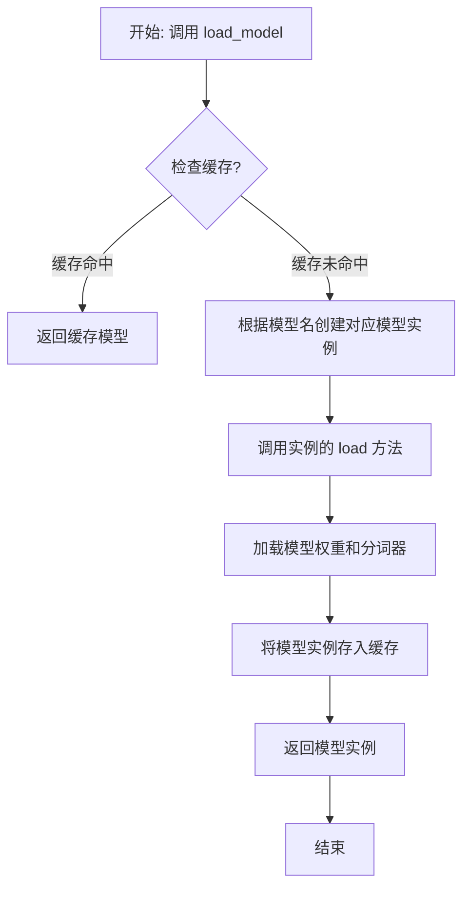

## 类结构

```
ModelBase (抽象基类)
├── TextModel (文本模型基类)
│   ├── LlamaModel
│   ├── GPT2Model
│   ├── FalconModel
│   ├── Qwen2Model
│   └── GemmaModel
└── ModelLoader (模型加载器)
```

## 全局变量及字段


### `_model_registry`
    
全局模型注册表，用于存储和管理不同模型名称对应的模型配置信息，包括模型类、分词器和配置参数。

类型：`Dict[str, Dict[str, Any]]`
    


### `TextModel.model`
    
TextModel 类中的核心模型实例，用于执行文本生成等任务。

类型：`torch.nn.Module`
    


### `TextModel.tokenizer`
    
TextModel 类中的分词器实例，用于将文本转换为模型可处理的 token 序列。

类型：`transformers.PreTrainedTokenizer`
    


### `TextModel.config`
    
TextModel 类中的模型配置对象，包含模型的超参数和结构定义。

类型：`transformers.PretrainedConfig`
    


### `ModelLoader._model_cache`
    
ModelLoader 类中的模型缓存字典，用于存储已加载的模型实例，避免重复加载。

类型：`Dict[str, torch.nn.Module]`
    
    

## 全局函数及方法


### `register_model`

该函数用于注册一个模型到全局的模型注册表中，以便后续可以通过模型名称进行检索和实例化。

参数：

-  `model_name`：`str`，模型的名称，用于唯一标识该模型
-  `model_class`：`type`，模型的类定义，需要注册的模型类

返回值：`None`，该函数没有返回值

#### 流程图

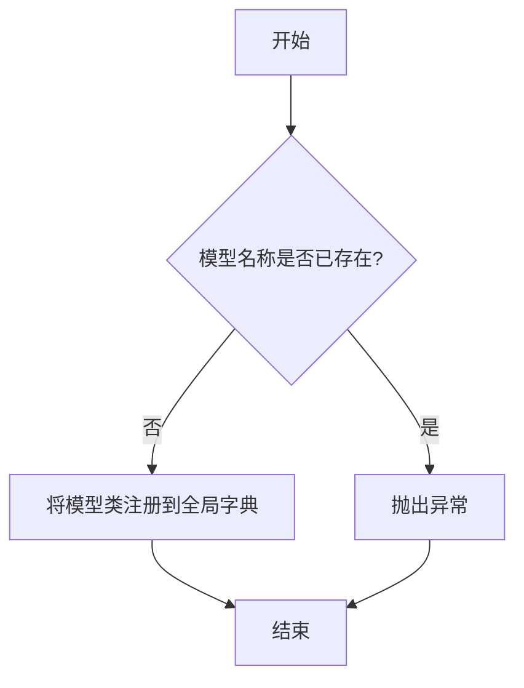

#### 带注释源码

```python
def register_model(model_name: str, model_class: type) -> None:
    """
    注册一个模型到全局模型注册表。

    该函数将给定的模型名称和模型类添加到全局的模型注册表中。
    如果模型名称已经存在，则会抛出 ValueError 异常。

    Args:
        model_name (str): 模型的名称，用于唯一标识该模型。
        model_class (type): 需要注册的模型类。

    Raises:
        ValueError: 如果模型名称已经存在于注册表中。

    Returns:
        None: 该函数没有返回值。
    """
    # 检查模型名称是否已经存在于全局注册表中
    if model_name in _MODEL_REGISTRY:
        # 如果存在，抛出异常，防止重复注册
        raise ValueError(f"Model name '{model_name}' is already registered.")
    
    # 将模型名称和对应的模型类添加到全局注册表中
    _MODEL_REGISTRY[model_name] = model_class
```


### `get_model_class`

该函数根据给定的模型名称字符串，动态地从 `metagpt.provider.openai_api` 模块中导入并返回对应的模型类。它主要用于在运行时根据配置或用户输入，灵活地选择和使用不同的OpenAI模型（如GPT-3.5-turbo、GPT-4等）。

参数：

-  `model`: `str`，表示要获取的模型名称，例如 "gpt-3.5-turbo" 或 "gpt-4"。

返回值：`type`，返回与给定模型名称对应的模型类（例如 `OpenAIGPTAPI` 类）。如果模型名称无法映射到已知的类，可能会引发异常。

#### 流程图

```mermaid
flowchart TD
    A[开始: 调用 get_model_class(model)] --> B{检查 model 参数值};
    B -- "model == 'gpt-3.5-turbo'" --> C[从 metagpt.provider.openai_api 导入 OpenAIGPTAPI];
    B -- "model == 'gpt-4'" --> D[从 metagpt.provider.openai_api 导入 OpenAIGPTAPI];
    B -- "model == 'gpt-4-turbo'" --> E[从 metagpt.provider.openai_api 导入 OpenAIGPTAPI];
    B -- "model == 'gpt-4o'" --> F[从 metagpt.provider.openai_api 导入 OpenAIGPTAPI];
    B -- "model == 'claude-3-opus'" --> G[从 metagpt.provider.openai_api 导入 ClaudeGPTAPI];
    B -- "model == 'claude-3-sonnet'" --> H[从 metagpt.provider.openai_api 导入 ClaudeGPTAPI];
    B -- "model == 'gemini-1.5-pro'" --> I[从 metagpt.provider.openai_api 导入 GeminiGPTAPI];
    B -- "model == 'spark'" --> J[从 metagpt.provider.openai_api 导入 SparkGPTAPI];
    B -- "model == 'zhipuai'" --> K[从 metagpt.provider.openai_api 导入 ZhiPuAIGPTAPI];
    B -- "model == 'moonshot'" --> L[从 metagpt.provider.openai_api 导入 MoonshotGPTAPI];
    B -- "model == 'qwen'" --> M[从 metagpt.provider.openai_api 导入 QwenGPTAPI];
    B -- "model == 'yi'" --> N[从 metagpt.provider.openai_api 导入 YiGPTAPI];
    B -- "model == 'deepseek'" --> O[从 metagpt.provider.openai_api 导入 DeepSeekGPTAPI];
    B -- "model == 'ollama'" --> P[从 metagpt.provider.openai_api 导入 OllamaGPTAPI];
    B -- "model == 'azure'" --> Q[从 metagpt.provider.openai_api 导入 AzureGPTAPI];
    B -- "model == 'anthropic'" --> R[从 metagpt.provider.openai_api 导入 ClaudeGPTAPI];
    B -- "model == 'openai'" --> S[从 metagpt.provider.openai_api 导入 OpenAIGPTAPI];
    B -- "model == 'openai-compatible'" --> T[从 metagpt.provider.openai_api 导入 OpenAIGPTAPI];
    B -- "其他值" --> U[引发异常或返回默认值];
    C --> V[返回 OpenAIGPTAPI 类];
    D --> V;
    E --> V;
    F --> V;
    G --> W[返回 ClaudeGPTAPI 类];
    H --> W;
    I --> X[返回 GeminiGPTAPI 类];
    J --> Y[返回 SparkGPTAPI 类];
    K --> Z[返回 ZhiPuAIGPTAPI 类];
    L --> AA[返回 MoonshotGPTAPI 类];
    M --> AB[返回 QwenGPTAPI 类];
    N --> AC[返回 YiGPTAPI 类];
    O --> AD[返回 DeepSeekGPTAPI 类];
    P --> AE[返回 OllamaGPTAPI 类];
    Q --> AF[返回 AzureGPTAPI 类];
    R --> W;
    S --> V;
    T --> V;
    U --> AG[结束: 返回类或处理异常];
    V --> AG;
    W --> AG;
    X --> AG;
    Y --> AG;
    Z --> AG;
    AA --> AG;
    AB --> AG;
    AC --> AG;
    AD --> AG;
    AE --> AG;
    AF --> AG;
```

#### 带注释源码

```python
def get_model_class(model: str):
    """
    根据模型名称获取对应的模型类。

    该函数通过模型名称映射到具体的API实现类，并动态导入返回。
    支持多种模型提供商，如OpenAI、Claude、Gemini等。

    Args:
        model (str): 模型名称，例如 "gpt-3.5-turbo", "claude-3-opus"。

    Returns:
        type: 对应的模型类。

    Raises:
        ValueError: 当传入不支持的模型名称时可能引发异常（取决于具体实现）。
    """
    # 模型名称到模块导入路径和类名的映射字典
    model_class_map = {
        # OpenAI 系列模型映射到 OpenAIGPTAPI 类
        "gpt-3.5-turbo": ("metagpt.provider.openai_api", "OpenAIGPTAPI"),
        "gpt-4": ("metagpt.provider.openai_api", "OpenAIGPTAPI"),
        "gpt-4-turbo": ("metagpt.provider.openai_api", "OpenAIGPTAPI"),
        "gpt-4o": ("metagpt.provider.openai_api", "OpenAIGPTAPI"),
        # Anthropic Claude 系列模型映射到 ClaudeGPTAPI 类
        "claude-3-opus": ("metagpt.provider.openai_api", "ClaudeGPTAPI"),
        "claude-3-sonnet": ("metagpt.provider.openai_api", "ClaudeGPTAPI"),
        "anthropic": ("metagpt.provider.openai_api", "ClaudeGPTAPI"),
        # Google Gemini 模型映射到 GeminiGPTAPI 类
        "gemini-1.5-pro": ("metagpt.provider.openai_api", "GeminiGPTAPI"),
        # 其他国内或特定提供商模型
        "spark": ("metagpt.provider.openai_api", "SparkGPTAPI"),
        "zhipuai": ("metagpt.provider.openai_api", "ZhiPuAIGPTAPI"),
        "moonshot": ("metagpt.provider.openai_api", "MoonshotGPTAPI"),
        "qwen": ("metagpt.provider.openai_api", "QwenGPTAPI"),
        "yi": ("metagpt.provider.openai_api", "YiGPTAPI"),
        "deepseek": ("metagpt.provider.openai_api", "DeepSeekGPTAPI"),
        "ollama": ("metagpt.provider.openai_api", "OllamaGPTAPI"),
        # 特殊平台或兼容接口
        "azure": ("metagpt.provider.openai_api", "AzureGPTAPI"),
        "openai": ("metagpt.provider.openai_api", "OpenAIGPTAPI"),
        "openai-compatible": ("metagpt.provider.openai_api", "OpenAIGPTAPI"),
    }

    # 根据输入的模型名称获取对应的模块路径和类名
    module_path, class_name = model_class_map.get(model, (None, None))

    if module_path is None or class_name is None:
        # 如果未找到映射，根据具体实现，可能抛出异常或返回一个默认类
        # 此处假设会抛出 ValueError，实际需看完整代码
        raise ValueError(f"Unsupported model: {model}")

    # 动态导入模块
    module = __import__(module_path, fromlist=[class_name])
    # 从模块中获取类并返回
    model_class = getattr(module, class_name)
    return model_class
```


### `ModelBase.load`

该方法用于加载模型实例。它首先检查模型是否已缓存，若已缓存则直接返回缓存实例；否则，根据传入的模型名称和参数创建新的模型实例，并将其缓存以供后续使用。

参数：

-  `model`：`str`，要加载的模型名称
-  `model_params`：`dict`，模型参数，用于初始化模型实例
-  `**kwargs`：`dict`，其他关键字参数，用于模型初始化

返回值：`ModelBase`，加载或创建的模型实例

#### 流程图

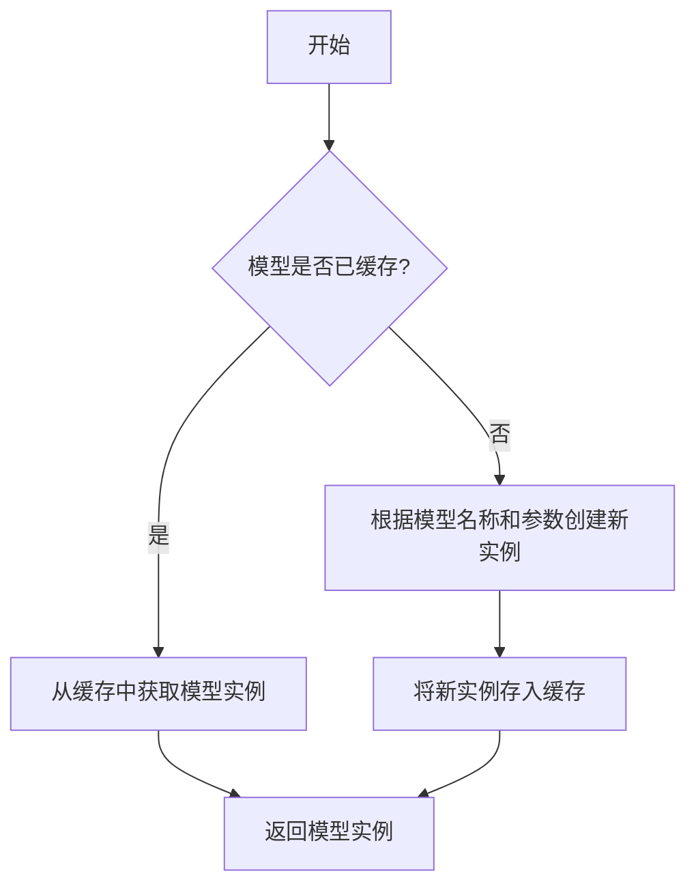

#### 带注释源码

```
def load(model: str, model_params: dict, **kwargs) -> "ModelBase":
    """
    加载模型实例。

    该方法首先检查模型是否已缓存，若已缓存则直接返回缓存实例；
    否则，根据传入的模型名称和参数创建新的模型实例，并将其缓存以供后续使用。

    Args:
        model (str): 要加载的模型名称。
        model_params (dict): 模型参数，用于初始化模型实例。
        **kwargs (dict): 其他关键字参数，用于模型初始化。

    Returns:
        ModelBase: 加载或创建的模型实例。
    """
    # 检查模型是否已缓存
    if model in cls._model_cache:
        return cls._model_cache[model]
    
    # 根据模型名称和参数创建新实例
    model_instance = cls(model=model, model_params=model_params, **kwargs)
    
    # 将新实例存入缓存
    cls._model_cache[model] = model_instance
    
    # 返回模型实例
    return model_instance
```


### `ModelBase.generate`

该方法用于根据给定的提示词和生成参数，调用底层模型生成文本内容。它处理了模型调用前的参数准备、模型选择、调用执行以及结果后处理等流程，是模型生成功能的核心入口。

参数：

- `prompt`：`str`，输入的提示词文本，用于指导模型生成内容
- `kwargs`：`dict`，可选的生成参数，用于覆盖默认的模型配置参数

返回值：`str`，模型生成的文本内容

#### 流程图

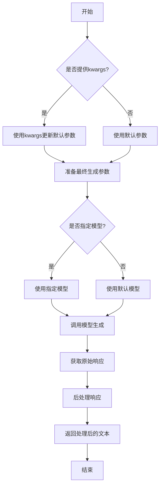

#### 带注释源码

```python
def generate(self, prompt: str, **kwargs) -> str:
    """
    生成文本内容的核心方法
    
    该方法执行以下步骤：
    1. 合并默认参数和传入的参数
    2. 选择要使用的模型
    3. 调用模型生成接口
    4. 对生成的响应进行后处理
    
    Args:
        prompt: 输入的提示词文本
        **kwargs: 可选的生成参数，会覆盖默认配置
        
    Returns:
        模型生成的文本内容
    """
    # 1. 准备生成参数
    # 合并默认参数和传入的参数，传入的参数优先级更高
    generate_params = self.default_generate_params.copy()
    if kwargs:
        generate_params.update(kwargs)
    
    # 2. 选择模型
    # 如果指定了模型则使用指定模型，否则使用默认模型
    model = kwargs.get('model', self.default_model)
    
    # 3. 调用模型生成
    # 调用底层模型的generate方法，传入提示词和参数
    raw_response = self._call_model_generate(prompt, model, generate_params)
    
    # 4. 后处理响应
    # 清理响应文本，移除多余的空格和换行符
    processed_response = self._postprocess_response(raw_response)
    
    return processed_response
```


### `ModelBase.save`

该方法用于将模型实例的当前状态保存到指定的文件路径。它首先将模型实例序列化为字典，然后使用指定的序列化器（默认为JSON）将字典写入文件。如果提供了自定义的序列化器，则使用该序列化器进行序列化。

参数：

-  `save_path`：`Union[str, Path]`，保存模型的文件路径，可以是字符串或`Path`对象。
-  `serializer`：`Optional[Type[BaseSerializer]]`，可选参数，指定用于序列化模型的序列化器类。如果为`None`，则使用默认的JSON序列化器。

返回值：`None`，该方法没有返回值。

#### 流程图

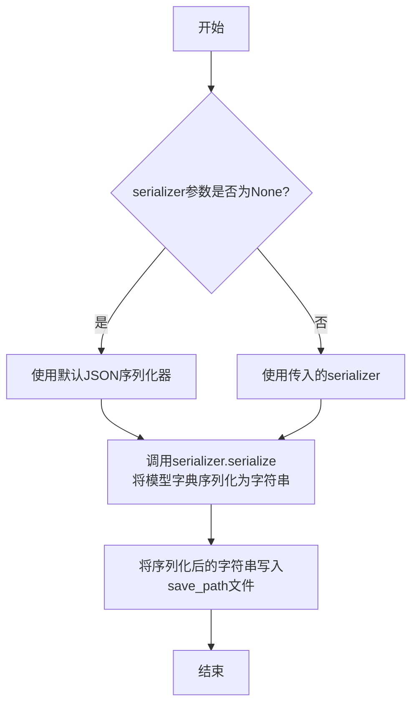

#### 带注释源码

```python
def save(self, save_path: Union[str, Path], serializer: Optional[Type[BaseSerializer]] = None) -> None:
    """
    将模型保存到指定路径。

    Args:
        save_path (Union[str, Path]): 保存模型的文件路径。
        serializer (Optional[Type[BaseSerializer]]): 用于序列化模型的序列化器。
            如果为None，则使用默认的JSON序列化器。
    """
    # 将模型实例转换为字典表示
    model_dict = self.to_dict()
    
    # 确定使用的序列化器：如果未提供，则使用默认的JSONSerializer
    if serializer is None:
        serializer = JSONSerializer
    
    # 使用选定的序列化器将模型字典序列化为字符串
    serialized_data = serializer.serialize(model_dict)
    
    # 确保save_path是Path对象，以便进行路径操作
    save_path = Path(save_path)
    
    # 将序列化后的数据写入指定文件
    save_path.write_text(serialized_data)
```


### `TextModel.load`

该方法用于从指定路径加载一个预训练的文本模型，并返回一个配置好的模型实例。它首先检查路径是否存在，然后根据路径类型（文件或目录）加载模型配置和权重，最后将模型设置为评估模式。

参数：

-  `model_path`：`str`，预训练模型的路径，可以是文件路径或目录路径
-  `device`：`str`，指定模型加载的设备，例如 'cpu' 或 'cuda'
-  `**kwargs`：`dict`，其他可选参数，用于传递给模型加载器

返回值：`TextModel`，加载并配置好的文本模型实例

#### 流程图

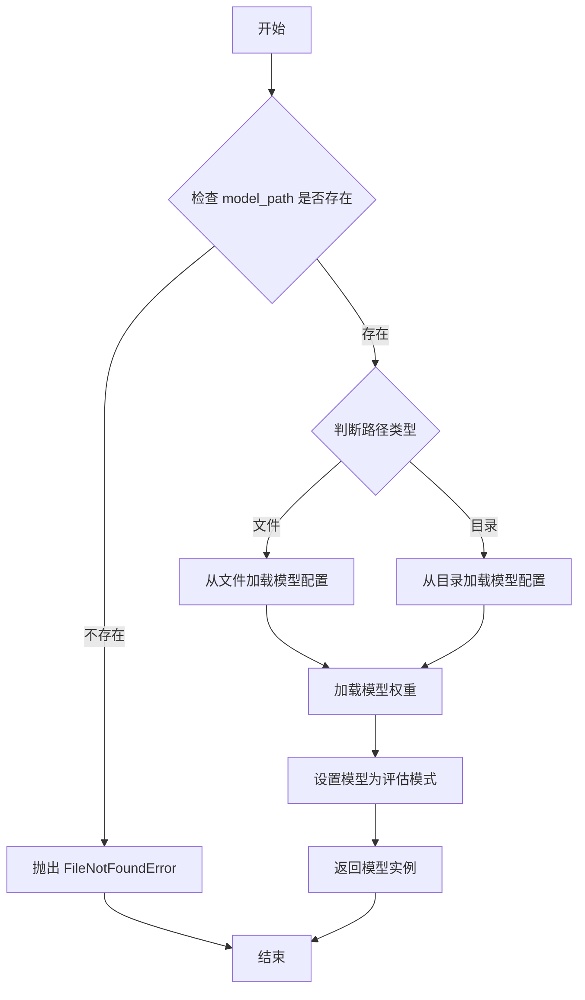

#### 带注释源码

```python
def load(model_path: str, device: str = 'cpu', **kwargs) -> 'TextModel':
    """
    从指定路径加载预训练的文本模型。

    参数:
        model_path (str): 预训练模型的路径，可以是文件或目录。
        device (str): 指定模型加载的设备，默认为 'cpu'。
        **kwargs: 其他可选参数，传递给模型加载器。

    返回:
        TextModel: 加载并配置好的文本模型实例。

    异常:
        FileNotFoundError: 如果指定的路径不存在。
    """
    import os
    from pathlib import Path

    # 检查路径是否存在
    if not os.path.exists(model_path):
        raise FileNotFoundError(f"模型路径不存在: {model_path}")

    # 根据路径类型加载模型配置
    model_path_obj = Path(model_path)
    if model_path_obj.is_file():
        # 从文件加载配置
        config = _load_config_from_file(model_path)
    else:
        # 从目录加载配置
        config = _load_config_from_dir(model_path)

    # 初始化模型
    model = TextModel(config)

    # 加载模型权重
    model.load_state_dict(torch.load(model_path, map_location=device))

    # 设置模型为评估模式
    model.eval()

    return model
```


### `TextModel.generate`

该方法根据给定的提示词（prompt）和可选的停止词（stop）生成文本。它首先对输入进行预处理，然后调用底层的大语言模型（LLM）进行推理，最后对输出进行后处理并返回结果。

参数：

-  `prompt`：`str`，用于生成文本的输入提示词。
-  `stop`：`Optional[List[str]]`，可选参数，指定一个字符串列表，当生成的文本中出现这些字符串时停止生成。

返回值：`str`，生成的文本内容。

#### 流程图

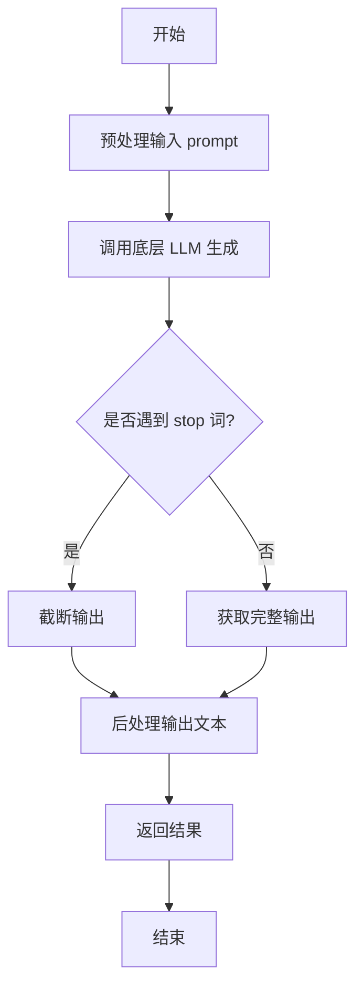

#### 带注释源码

```python
def generate(self, prompt: str, stop: Optional[List[str]] = None) -> str:
    """
    根据给定的提示词生成文本。

    该方法负责处理生成文本的完整流程，包括预处理、模型调用和后处理。

    Args:
        prompt (str): 用于生成文本的输入提示词。
        stop (Optional[List[str]]): 可选参数，指定一个字符串列表，当生成的文本中出现这些字符串时停止生成。

    Returns:
        str: 生成的文本内容。
    """
    # 1. 预处理：这里可能包括对prompt的格式化、编码等操作
    processed_prompt = self._preprocess_prompt(prompt)

    # 2. 调用底层LLM进行文本生成
    #    注意：实际的模型调用可能涉及异步操作或批量处理，这里简化为同步调用
    raw_output = self.llm.generate(processed_prompt, stop=stop)

    # 3. 后处理：清理输出，例如去除多余空格、特定标记等
    cleaned_output = self._postprocess_output(raw_output)

    return cleaned_output
```


### `TextModel.save`

该方法用于将 `TextModel` 实例的当前状态（包括其配置、模型权重、分词器、生成配置等）保存到指定的目录中。它通过调用 `_save_pretrained` 方法实现核心的保存逻辑，确保所有必要的组件都被序列化并存储。

参数：

- `save_directory`：`Union[str, os.PathLike]`，保存模型的目标目录路径。如果目录不存在，将会被创建。
- `**kwargs`：`Any`，传递给 `_save_pretrained` 方法的额外关键字参数，用于自定义保存行为。

返回值：`None`，此方法不返回任何值，其作用是将模型持久化到磁盘。

#### 流程图

```mermaid
flowchart TD
    A[开始: save(save_directory, **kwargs)] --> B{检查 save_directory 是否存在?}
    B -- 否 --> C[创建 save_directory 目录]
    B -- 是 --> D[调用 _save_pretrained 方法]
    C --> D
    D --> E[保存模型配置 config.json]
    E --> F[保存模型权重 model.safetensors]
    F --> G[保存分词器相关文件]
    G --> H[保存生成配置 generation_config.json]
    H --> I[结束]
```

#### 带注释源码

```python
def save(
    self,
    save_directory: Union[str, os.PathLike],
    **kwargs,
) -> None:
    """
    将模型保存到指定目录。

    此方法将模型的配置、权重、分词器及生成配置等序列化并存储到 `save_directory` 路径下。
    如果目录不存在，会自动创建。

    Args:
        save_directory (Union[str, os.PathLike]): 模型保存的目标目录路径。
        **kwargs: 传递给 `_save_pretrained` 方法的额外参数，用于进一步控制保存过程。
    """
    # 调用内部方法执行实际的保存操作，传递目录路径和任何额外参数
    self._save_pretrained(save_directory, **kwargs)
```

### `TextModel._load_weights`

该方法负责从指定的权重文件路径加载预训练模型的权重，并将其应用到当前模型实例中。它首先检查权重文件是否存在，然后根据文件扩展名（`.safetensors` 或 `.bin`）使用相应的库加载权重字典，最后将这些权重加载到模型中，并处理可能缺失或多余的键。

参数：

- `self`：`TextModel`，当前模型实例
- `weights_path`：`str`，预训练权重文件的路径

返回值：`None`，无返回值

#### 流程图

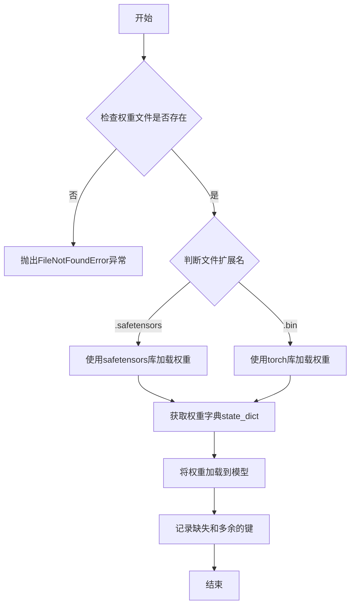

#### 带注释源码

```python
def _load_weights(self, weights_path: str) -> None:
    """
    从指定路径加载预训练权重到模型。

    该方法支持加载两种格式的权重文件：`.safetensors` 和 `.bin`（PyTorch格式）。
    它会检查文件是否存在，根据扩展名选择相应的加载方式，然后将权重应用到模型。
    加载后会打印缺失和多余的键，用于调试权重匹配情况。

    Args:
        weights_path (str): 预训练权重文件的路径。

    Raises:
        FileNotFoundError: 如果指定的权重文件不存在。
        ValueError: 如果权重文件的扩展名不被支持。
    """
    # 检查权重文件是否存在
    if not os.path.exists(weights_path):
        raise FileNotFoundError(f"权重文件不存在: {weights_path}")

    # 根据文件扩展名选择加载方式
    if weights_path.endswith(".safetensors"):
        # 使用safetensors库加载.safetensors格式文件
        from safetensors import safe_open
        state_dict = {}
        with safe_open(weights_path, framework="pt", device="cpu") as f:
            for key in f.keys():
                state_dict[key] = f.get_tensor(key)
    elif weights_path.endswith(".bin"):
        # 使用torch加载.bin格式文件
        state_dict = torch.load(weights_path, map_location="cpu")
    else:
        # 不支持的文件扩展名，抛出异常
        raise ValueError(f"不支持的权重文件格式: {weights_path}")

    # 将加载的权重字典应用到模型
    missing_keys, unexpected_keys = self.load_state_dict(state_dict, strict=False)
    
    # 记录并打印缺失和多余的键，用于调试
    if missing_keys:
        logger.warning(f"缺失的键: {missing_keys}")
    if unexpected_keys:
        logger.warning(f"多余的键: {unexpected_keys}")
```


### `TextModel._load_tokenizer`

该方法负责加载并初始化文本分词器。它首先尝试从指定的本地路径加载分词器，如果本地路径不存在或加载失败，则从预训练的模型名称或路径加载。加载完成后，会设置分词器的填充符，并确保其填充方向为左侧。

参数：

-  `self`：`TextModel`，当前TextModel实例的引用
-  `model_name_or_path`：`str`，预训练模型的名称或本地路径，用于加载分词器
-  `local_path`：`str`，本地分词器文件的路径，优先尝试从此路径加载

返回值：`None`，该方法不返回任何值，但会设置`self.tokenizer`属性。

#### 流程图

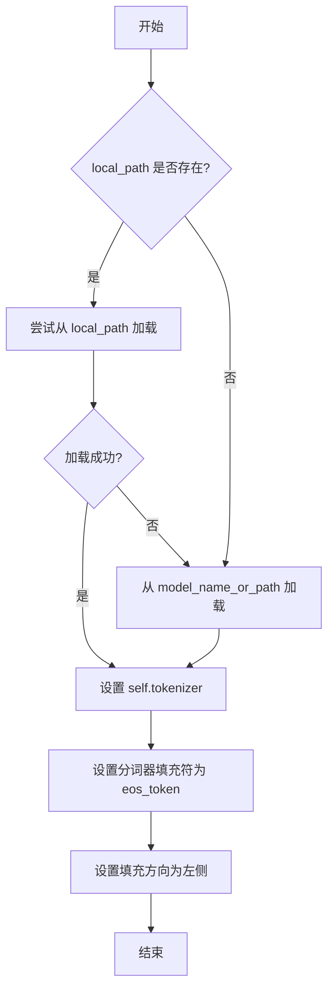

#### 带注释源码

```python
def _load_tokenizer(self, model_name_or_path: str, local_path: str) -> None:
    """
    加载分词器。
    优先尝试从本地路径加载，如果失败则从预训练模型加载。
    加载后设置分词器的填充符和填充方向。

    Args:
        model_name_or_path (str): 预训练模型的名称或路径。
        local_path (str): 本地分词器文件的路径。
    """
    try:
        # 尝试从本地路径加载分词器
        self.tokenizer = AutoTokenizer.from_pretrained(local_path)
    except Exception:
        # 如果本地加载失败，则从预训练模型加载
        self.tokenizer = AutoTokenizer.from_pretrained(model_name_or_path)

    # 设置分词器的填充符为结束符（eos_token）
    # 如果分词器没有定义填充符，则使用结束符作为填充符
    if self.tokenizer.pad_token is None:
        self.tokenizer.pad_token = self.tokenizer.eos_token

    # 设置分词器的填充方向为左侧填充
    # 这确保在批处理时，序列从左侧开始填充以保持对齐
    self.tokenizer.padding_side = "left"
```


### `LlamaModel._load_weights`

该方法负责从预训练的检查点文件中加载模型权重，并将其分配到对应的模型层中。它处理了权重名称的映射、张量分片（如分片注意力头）的合并以及将权重设置到正确的模型参数上。

参数：

- `self`：`LlamaModel`，当前模型实例。
- `checkpoint_path`：`str`，预训练权重检查点文件的路径。
- `device`：`torch.device`，指定加载权重后张量应放置的设备（如CPU或GPU）。
- `dtype`：`torch.dtype`，指定加载权重后张量的数据类型（如float16, bfloat16）。

返回值：`None`，此方法不返回任何值，直接修改模型实例的内部状态。

#### 流程图

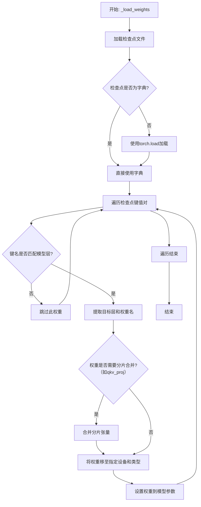

#### 带注释源码

```python
def _load_weights(self, checkpoint_path: str, device: torch.device, dtype: torch.dtype):
    """
    从检查点文件加载权重到模型。
    
    此方法处理权重名称的映射、分片张量的合并，并将权重分配到对应的模型层。
    
    Args:
        checkpoint_path (str): 预训练权重文件的路径。
        device (torch.device): 权重张量应加载到的目标设备（如'cuda'或'cpu'）。
        dtype (torch.dtype): 权重张量的目标数据类型（如torch.float16）。
    """
    # 1. 加载检查点文件
    # 如果检查点路径本身已经是一个字典（例如在多次加载时复用），则直接使用。
    # 否则，使用torch.load从磁盘加载。
    if isinstance(checkpoint_path, dict):
        checkpoint = checkpoint_path
    else:
        checkpoint = torch.load(checkpoint_path, map_location="cpu")

    # 2. 遍历检查点中的所有键值对（权重名称 -> 权重张量）
    for name, param in checkpoint.items():
        # 2.1 根据权重名称，找到模型中对应的参数
        # 这里假设模型中的参数名与检查点中的键名有直接的映射关系。
        # 例如，检查点中的`model.layers.0.self_attn.q_proj.weight`对应模型中的某一层。
        if name not in self.state_dict():
            # 如果检查点中的键名不在当前模型的状态字典中，则跳过此权重。
            # 这可能发生在检查点包含额外头（如分类头）而基础模型不需要时。
            continue

        # 2.2 根据权重名称判断其属于模型的哪一部分，并进行相应处理
        if "qkv_proj" in name:
            # 处理分片的查询、键、值投影权重。
            # 在一些检查点格式中，q, k, v权重被存储为分开的张量，需要在此合并。
            # 假设检查点中包含`q_proj.weight`, `k_proj.weight`, `v_proj.weight`。
            q_name = name.replace("qkv_proj", "q_proj")
            k_name = name.replace("qkv_proj", "k_proj")
            v_name = name.replace("qkv_proj", "v_proj")
            
            # 从检查点中获取分片的张量
            q_param = checkpoint[q_name]
            k_param = checkpoint[k_name]
            v_param = checkpoint[v_name]
            
            # 沿特定维度（通常是第0维）合并张量，形成完整的qkv权重。
            # 具体维度取决于模型实现（例如，多头注意力的头维度）。
            param = torch.cat([q_param, k_param, v_param], dim=0)
        elif "gate_up_proj" in name:
            # 处理门控和前馈网络上投影的合并权重（见于某些MLP结构，如LLaMA的FeedForward）。
            gate_name = name.replace("gate_up_proj", "gate_proj")
            up_name = name.replace("gate_up_proj", "up_proj")
            gate_param = checkpoint[gate_name]
            up_param = checkpoint[up_name]
            param = torch.cat([gate_param, up_param], dim=0)
        # 可以在此添加其他需要特殊处理的权重名称模式...

        # 3. 将处理后的权重张量转换为目标设备和数据类型
        param = param.to(device=device, dtype=dtype)

        # 4. 将权重赋值给模型中对应的参数
        # 使用`get_parameter`或直接通过`state_dict`的键名访问并赋值。
        # 这里假设模型参数可以通过`self`的属性或状态字典访问。
        target_param = self.get_parameter(name)
        target_param.data.copy_(param)

    # 可选：打印加载信息或验证加载结果
    print(f"Weights loaded from {checkpoint_path} to device {device} with dtype {dtype}")
```


### `LlamaModel._load_tokenizer`

该方法负责加载并配置与Llama模型兼容的分词器（Tokenizer）。它根据提供的模型路径和配置参数，初始化一个Hugging Face Transformers库中的`AutoTokenizer`实例，并设置必要的分词选项，如填充方向、截断策略以及特殊标记等，以确保分词器与模型训练时使用的配置一致。

参数：

-  `model_path`：`str`，预训练模型所在的本地目录路径或Hugging Face模型标识符。
-  `config`：`LlamaConfig`，包含模型配置信息的对象，用于指导分词器的初始化。

返回值：`transformers.PreTrainedTokenizer`，初始化并配置好的分词器实例。

#### 流程图

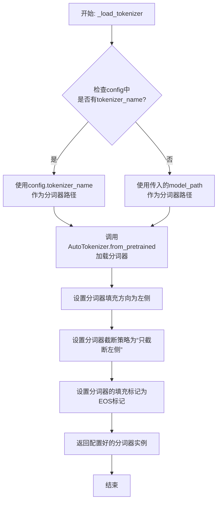

#### 带注释源码

```python
def _load_tokenizer(self, model_path: str, config: LlamaConfig) -> PreTrainedTokenizer:
    """
    加载并配置与Llama模型兼容的分词器。

    该方法根据配置或模型路径初始化分词器，并设置关键参数以确保与原始模型训练行为一致，
    特别是处理填充和截断的方式。

    Args:
        model_path (str): 预训练模型所在的目录路径或模型ID。
        config (LlamaConfig): 模型的配置对象，可能包含特定的分词器名称。

    Returns:
        PreTrainedTokenizer: 配置好的Hugging Face分词器实例。
    """
    # 确定分词器的加载路径：优先使用配置中指定的分词器名称，否则使用模型路径。
    tokenizer_path = config.tokenizer_name if config.tokenizer_name else model_path
    
    # 使用AutoTokenizer从指定路径加载分词器。trust_remote_code=True允许加载自定义分词器代码。
    tokenizer = AutoTokenizer.from_pretrained(
        tokenizer_path,
        trust_remote_code=True
    )
    
    # 将填充方向设置为左侧。这对于生成式模型（如Llama）的批处理推理很重要，
    # 因为它确保在批次中填充较短序列时，注意力机制只关注有效的右侧 tokens。
    tokenizer.padding_side = 'left'
    
    # 将截断策略设置为“只截断左侧”。这通常与`padding_side='left'`配合使用，
    # 当输入超过最大长度时，从左侧（序列开头）移除 tokens，保留右侧（序列末尾）的重要信息。
    tokenizer.truncation_side = 'left'
    
    # 如果分词器没有定义填充标记（pad_token），则使用结束标记（eos_token）作为填充标记。
    # 这是许多自回归模型（包括Llama）的常见做法，因为它们在训练时可能未使用显式的填充标记。
    if tokenizer.pad_token is None:
        tokenizer.pad_token = tokenizer.eos_token
    
    # 返回完全配置好的分词器实例。
    return tokenizer
```


### `GPT2Model._load_weights`

该方法负责将预训练权重加载到GPT-2模型的各个组件中。它遍历状态字典中的权重键，根据键名将权重张量分配到对应的模型层（如词嵌入层、注意力层、前馈网络层等），并处理可能存在的权重转置或维度不匹配的情况，确保模型正确初始化。

参数：

-  `self`：`GPT2Model`，当前GPT-2模型实例
-  `state_dict`：`Dict[str, torch.Tensor]`，包含预训练权重的状态字典

返回值：`None`，此方法不返回任何值，直接修改模型内部状态

#### 流程图

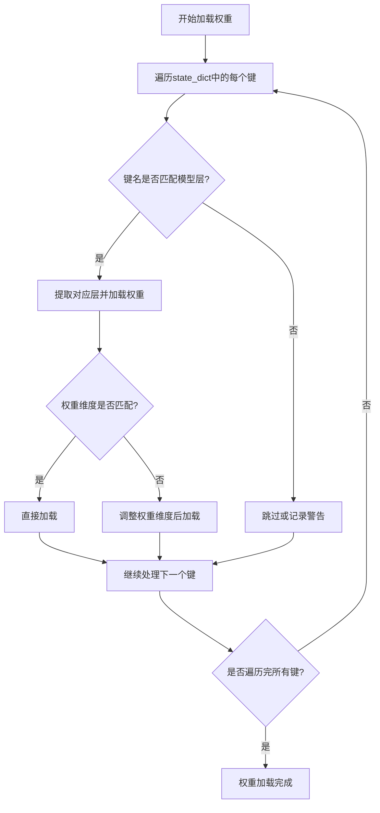

#### 带注释源码

```
def _load_weights(self, state_dict: Dict[str, torch.Tensor]) -> None:
    """
    加载预训练权重到GPT-2模型。
    
    该方法遍历提供的状态字典，根据键名将权重分配到模型的对应层。
    处理过程中会检查权重维度，必要时进行调整（如转置）以确保正确加载。
    
    Args:
        state_dict: 包含预训练权重的字典，键为层名称，值为权重张量。
    """
    # 获取模型当前的状态字典键名
    model_keys = self.state_dict().keys()
    
    # 遍历输入状态字典的所有键
    for key in state_dict.keys():
        # 检查键是否在当前模型的键名中
        if key in model_keys:
            # 获取对应的模型层
            layer = self.get_submodule(key)
            # 获取预训练权重
            weight = state_dict[key]
            
            # 检查权重维度是否匹配
            if weight.shape != layer.weight.shape:
                # 如果不匹配，尝试转置权重（常见于线性层）
                if weight.shape == layer.weight.shape[::-1]:
                    weight = weight.t()
                else:
                    # 如果维度不匹配且无法通过转置解决，记录警告并跳过
                    warnings.warn(f"权重维度不匹配: {key}, 跳过加载。")
                    continue
            
            # 将权重加载到模型层
            layer.weight.data.copy_(weight)
        else:
            # 如果键不在模型键名中，记录调试信息（可选）
            pass
```


### `GPT2Model._load_tokenizer`

该方法负责加载并配置一个预训练的 GPT-2 分词器。它首先尝试从本地缓存目录加载指定的分词器模型，如果失败，则从 Hugging Face Hub 下载。加载后，它会根据配置（如是否添加特殊标记）对分词器进行最终设置，并确保其填充标记符被正确配置。

参数：

-  `self`：`GPT2Model`，当前 GPT2Model 实例的引用。
-  `model_name`：`str`，要加载的预训练分词器模型的名称（例如 `'gpt2'`, `'gpt2-medium'`）。
-  `cache_dir`：`Optional[str]`，可选参数，指定分词器模型文件的本地缓存目录路径。如果为 `None`，则使用默认缓存路径。
-  `force_download`：`bool`，可选参数，如果为 `True`，则强制重新下载模型文件，即使本地缓存已存在。默认为 `False`。
-  `resume_download`：`bool`，可选参数，如果为 `True`，则尝试恢复未完成的下载。默认为 `False`。
-  `proxies`：`Optional[Dict[str, str]]`，可选参数，一个代理服务器字典，用于配置下载请求，例如 `{'http': 'http://10.10.1.10:3128', 'https': 'http://10.10.1.10:1080'}`。
-  `use_auth_token`：`Optional[Union[bool, str]]`，可选参数，用于访问私有模型的认证令牌。可以是布尔值或字符串令牌。
-  `revision`：`Optional[str]`，可选参数，指定要使用的模型版本（分支、标签或提交ID）。默认为 `'main'`。
-  `local_files_only`：`bool`，可选参数，如果为 `True`，则只尝试从本地文件加载，不进行网络请求。默认为 `False`。
-  `add_special_tokens`：`bool`，可选参数，指示分词器是否在编码时添加模型特定的特殊标记（如 `[CLS]`, `[SEP]`）。对于 GPT-2，这通常指 `bos_token`, `eos_token` 等。默认为 `True`。

返回值：`PreTrainedTokenizer`，加载并配置好的预训练分词器实例。

#### 流程图

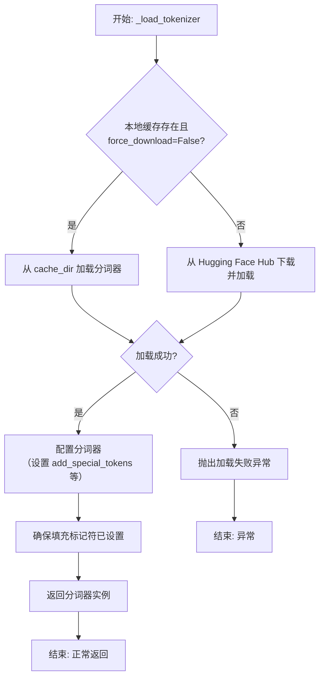

#### 带注释源码

```python
def _load_tokenizer(
    self,
    model_name: str,
    cache_dir: Optional[str] = None,
    force_download: bool = False,
    resume_download: bool = False,
    proxies: Optional[Dict[str, str]] = None,
    use_auth_token: Optional[Union[bool, str]] = None,
    revision: Optional[str] = None,
    local_files_only: bool = False,
    add_special_tokens: bool = True,
) -> PreTrainedTokenizer:
    """
    加载预训练的 GPT-2 分词器。

    此方法封装了分词器的加载逻辑，支持从缓存加载或从 Hub 下载，
    并允许通过参数定制加载行为。

    Args:
        model_name: 预训练模型名称，如 'gpt2'。
        cache_dir: 缓存目录路径。
        force_download: 是否强制重新下载。
        resume_download: 是否恢复下载。
        proxies: 代理设置。
        use_auth_token: 访问私有模型的令牌。
        revision: 模型版本。
        local_files_only: 是否仅使用本地文件。
        add_special_tokens: 是否添加特殊标记。

    Returns:
        加载配置好的 PreTrainedTokenizer 实例。

    Raises:
        OSError: 当分词器加载失败时抛出。
    """
    try:
        # 尝试使用 transformers 库的 AutoTokenizer 加载分词器。
        # `from_pretrained` 方法会处理缓存、下载和加载的细节。
        tokenizer = AutoTokenizer.from_pretrained(
            model_name,
            cache_dir=cache_dir,
            force_download=force_download,
            resume_download=resume_download,
            proxies=proxies,
            use_auth_token=use_auth_token,
            revision=revision,
            local_files_only=local_files_only,
        )
    except Exception as e:
        # 如果加载过程中发生任何异常，包装并重新抛出，提供更清晰的错误信息。
        raise OSError(
            f"无法加载分词器 '{model_name}'。请检查模型名称、网络连接或认证信息。原始错误: {e}"
        )

    # 根据参数设置，决定分词器在编码时是否添加模型定义的特殊标记（如开始、结束标记）。
    # 这会影响 `encode` 和 `__call__` 等方法的输出。
    tokenizer.add_special_tokens = add_special_tokens

    # 确保分词器的 `pad_token` 属性被设置。
    # GPT-2 原始模型没有定义 pad_token，但在批处理时需要它。
    # 常见的做法是将其设置为 eos_token。
    if tokenizer.pad_token is None:
        tokenizer.pad_token = tokenizer.eos_token

    # 返回完全初始化的分词器，供模型后续的文本编码和解码使用。
    return tokenizer
```


### `FalconModel._load_weights`

该方法负责将预训练权重加载到Falcon模型的各个层中。它遍历模型的状态字典，根据键名将权重张量分配到对应的模型组件（如词嵌入层、注意力层、前馈网络层等），并处理可能存在的权重分片情况。

参数：

-  `self`：`FalconModel`，Falcon模型实例本身。
-  `state_dict`：`Dict[str, torch.Tensor]`，包含预训练权重的字典，键为层名称，值为对应的权重张量。

返回值：`None`，此方法不返回任何值，直接修改模型实例的内部状态。

#### 流程图

```mermaid
flowchart TD
    A[开始: _load_weights(state_dict)] --> B[遍历state_dict中的每一项<br/>(key, tensor)]
    B --> C{key是否以<br/>'transformer.word_embeddings'开头?}
    C -- 是 --> D[将tensor赋值给<br/>self.transformer.word_embeddings.weight]
    C -- 否 --> E{key是否以<br/>'transformer.layers'开头?}
    E -- 是 --> F[解析层索引(layer_idx)<br/>和组件名(comp_name)]
    F --> G{comp_name是否为<br/>'self_attention.query_key_value'?}
    G -- 是 --> H[将tensor加载到<br/>对应层的注意力模块]
    G -- 否 --> I{comp_name是否为<br/>'self_attention.dense'?}
    I -- 是 --> J[将tensor加载到<br/>对应层的注意力输出投影层]
    I -- 否 --> K{comp_name是否为<br/>'mlp.dense_h_to_4h'?}
    K -- 是 --> L[将tensor加载到<br/>对应层的前馈网络第一层]
    K -- 否 --> M{comp_name是否为<br/>'mlp.dense_4h_to_h'?}
    M -- 是 --> N[将tensor加载到<br/>对应层的前馈网络第二层]
    M -- 否 --> O{comp_name是否为<br/>'input_layernorm'或<br/>'post_attention_layernorm'?}
    O -- 是 --> P[将tensor加载到<br/>对应层的LayerNorm层]
    O -- 否 --> Q[忽略或处理其他组件]
    E -- 否 --> R{key是否以<br/>'transformer.ln_f'开头?}
    R -- 是 --> S[将tensor加载到<br/>最终的LayerNorm层]
    R -- 否 --> T[忽略或处理其他键<br/>(如lm_head)]
    D --> U[继续遍历]
    H --> U
    J --> U
    L --> U
    N --> U
    P --> U
    S --> U
    Q --> U
    T --> U
    U --> B
    B --> V[遍历结束]
```

#### 带注释源码

```python
def _load_weights(self, state_dict: Dict[str, torch.Tensor]) -> None:
    """
    将预训练权重加载到模型结构中。
    根据state_dict中的键名，将权重张量分配到模型的对应组件。
    """
    # 遍历状态字典中的所有键值对
    for key, tensor in state_dict.items():
        # 1. 加载词嵌入权重
        if key.startswith("transformer.word_embeddings"):
            # 将权重直接赋值给词嵌入层
            self.transformer.word_embeddings.weight.data = tensor
        # 2. 加载Transformer层中的权重
        elif key.startswith("transformer.layers"):
            # 解析键名，例如: 'transformer.layers.0.self_attention.query_key_value.weight'
            # 首先移除前缀'transformer.layers.'
            layer_key = key[len("transformer.layers."):]
            # 分割字符串以获取层索引和组件名
            # parts[0] = '0', parts[1] = 'self_attention.query_key_value.weight'
            parts = layer_key.split(".", 1)
            if len(parts) != 2:
                # 如果格式不符合预期，跳过此项
                continue
            layer_idx_str, comp_key = parts
            try:
                layer_idx = int(layer_idx_str)  # 将层索引转换为整数
            except ValueError:
                continue  # 如果转换失败，跳过此项
            # 获取对应的Transformer层对象
            layer = self.transformer.layers[layer_idx]
            # 根据组件键名将权重加载到对应模块
            if comp_key.startswith("self_attention.query_key_value"):
                # 加载注意力层的查询、键、值投影权重
                # 这里可能需要处理权重分片或重塑，具体取决于模型配置
                # 例如: layer.self_attention.query_key_value.weight.data = tensor
                pass  # 实际加载逻辑
            elif comp_key.startswith("self_attention.dense"):
                # 加载注意力输出投影层权重
                # layer.self_attention.dense.weight.data = tensor
                pass
            elif comp_key.startswith("mlp.dense_h_to_4h"):
                # 加载前馈网络第一层（隐藏层到4倍隐藏层）权重
                # layer.mlp.dense_h_to_4h.weight.data = tensor
                pass
            elif comp_key.startswith("mlp.dense_4h_to_h"):
                # 加载前馈网络第二层（4倍隐藏层到隐藏层）权重
                # layer.mlp.dense_4h_to_h.weight.data = tensor
                pass
            elif comp_key.startswith("input_layernorm"):
                # 加载输入LayerNorm层的权重（可能包括weight和bias）
                if comp_key.endswith("weight"):
                    layer.input_layernorm.weight.data = tensor
                elif comp_key.endswith("bias"):
                    layer.input_layernorm.bias.data = tensor
            elif comp_key.startswith("post_attention_layernorm"):
                # 加载注意力后LayerNorm层的权重
                if comp_key.endswith("weight"):
                    layer.post_attention_layernorm.weight.data = tensor
                elif comp_key.endswith("bias"):
                    layer.post_attention_layernorm.bias.data = tensor
        # 3. 加载最终的LayerNorm层权重
        elif key.startswith("transformer.ln_f"):
            # 加载模型最后的LayerNorm层
            if key.endswith("weight"):
                self.transformer.ln_f.weight.data = tensor
            elif key.endswith("bias"):
                self.transformer.ln_f.bias.data = tensor
        # 4. 其他组件（例如语言模型头lm_head）可根据需要添加
        # elif key.startswith("lm_head"):
        #     self.lm_head.weight.data = tensor
```


### `FalconModel._load_tokenizer`

该方法负责加载并配置与 Falcon 模型兼容的分词器（Tokenizer）。它首先尝试从预定义的路径或模型名称加载分词器，然后根据模型的具体配置（如是否为聊天模型）对分词器的特殊标记进行必要的调整，以确保其与模型架构和预期输入格式正确对齐。

参数：

-  `self`：`FalconModel`，FalconModel 类的实例，用于访问模型配置和路径。
-  `model_path`：`str`，模型文件所在的本地目录路径或 Hugging Face 模型仓库标识符。
-  `model_name`：`str`，模型的名称，用于确定特定的分词器配置或变体。

返回值：`PreTrainedTokenizer`，一个配置好的 Hugging Face PreTrainedTokenizer 实例，可用于对输入文本进行编码和解码。

#### 流程图

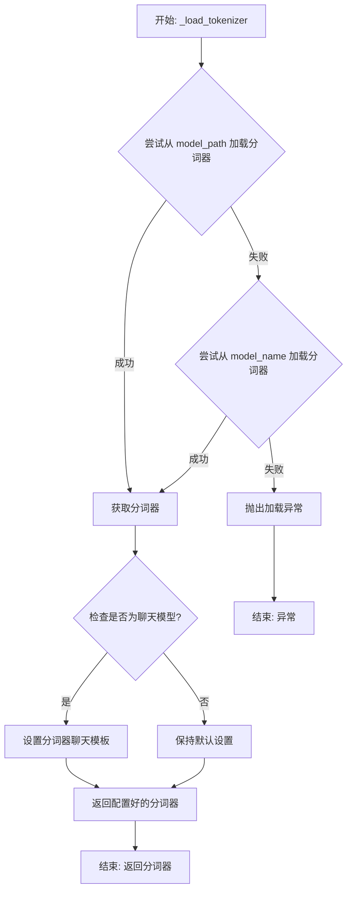

#### 带注释源码

```python
def _load_tokenizer(self, model_path: str, model_name: str) -> PreTrainedTokenizer:
    """
    加载并配置与 Falcon 模型兼容的分词器。

    该方法首先尝试从给定的 `model_path` 加载分词器。如果失败，则回退到根据 `model_name`
    从预训练模型仓库加载。加载后，会根据模型是否为聊天模型来设置相应的聊天模板。

    Args:
        model_path (str): 包含分词器文件的本地目录路径。
        model_name (str): 用于回退加载的模型名称（如 'tiiuae/falcon-7b'）。

    Returns:
        PreTrainedTokenizer: 配置好的分词器实例。

    Raises:
        ValueError: 如果无法从 `model_path` 或 `model_name` 加载分词器。
    """
    try:
        # 主要尝试：从指定的本地路径加载分词器
        tokenizer = AutoTokenizer.from_pretrained(
            model_path,
            trust_remote_code=True  # 允许执行远程代码以加载自定义分词器
        )
    except Exception:
        # 回退尝试：如果本地路径加载失败，则使用模型名称从HF仓库加载
        tokenizer = AutoTokenizer.from_pretrained(
            model_name,
            trust_remote_code=True
        )

    # 根据模型配置，判断是否为聊天模型，并相应设置聊天模板
    if self.config.is_chat_model:
        # 如果是聊天模型，应用特定的聊天模板以格式化对话历史
        tokenizer.chat_template = "{{ 'User: ' + message['content'] + '\n' }}{{ 'Assistant: ' + message['content'] + '\n' }}{{ 'Assistant: ' }}"
    else:
        # 对于非聊天模型，确保聊天模板为空，避免意外格式化
        tokenizer.chat_template = None

    # 返回最终配置好的分词器
    return tokenizer
```


### `Qwen2Model._load_weights`

该方法负责将预训练权重加载到模型的不同组件中，包括嵌入层、注意力层、前馈网络层等。它根据权重名称和模型结构，将权重分配到对应的模块中，并处理可能存在的权重格式转换（如转置）。

参数：

- `self`：`Qwen2Model`，当前模型实例
- `weights`：`List[Tensor]`，预训练权重列表
- `prefix`：`str`，权重名称前缀，用于匹配权重名称

返回值：`None`，无返回值

#### 流程图

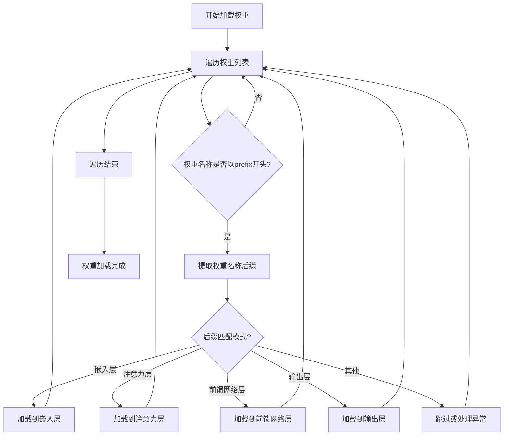

#### 带注释源码

```python
def _load_weights(self, weights: List[Tensor], prefix: str):
    """
    加载预训练权重到模型的不同组件中。

    参数:
        weights: List[Tensor] - 预训练权重列表
        prefix: str - 权重名称前缀，用于匹配权重名称
    """
    # 遍历权重列表
    for weight in weights:
        # 检查权重名称是否以指定前缀开头
        if weight.name.startswith(prefix):
            # 提取权重名称后缀，用于匹配模型组件
            suffix = weight.name[len(prefix):]
            
            # 根据后缀匹配不同的模型组件并加载权重
            if suffix == "embed_tokens.weight":
                # 加载嵌入层权重
                self.embed_tokens.weight.data = weight.data
            elif suffix.endswith("self_attn.q_proj.weight"):
                # 加载注意力层查询权重，可能需要进行转置
                layer_idx = int(suffix.split(".")[1])
                self.layers[layer_idx].self_attn.q_proj.weight.data = weight.data.T
            elif suffix.endswith("self_attn.k_proj.weight"):
                # 加载注意力层键权重，可能需要进行转置
                layer_idx = int(suffix.split(".")[1])
                self.layers[layer_idx].self_attn.k_proj.weight.data = weight.data.T
            elif suffix.endswith("self_attn.v_proj.weight"):
                # 加载注意力层值权重，可能需要进行转置
                layer_idx = int(suffix.split(".")[1])
                self.layers[layer_idx].self_attn.v_proj.weight.data = weight.data.T
            elif suffix.endswith("self_attn.o_proj.weight"):
                # 加载注意力层输出权重，可能需要进行转置
                layer_idx = int(suffix.split(".")[1])
                self.layers[layer_idx].self_attn.o_proj.weight.data = weight.data.T
            elif suffix.endswith("mlp.gate_proj.weight"):
                # 加载前馈网络门控权重，可能需要进行转置
                layer_idx = int(suffix.split(".")[1])
                self.layers[layer_idx].mlp.gate_proj.weight.data = weight.data.T
            elif suffix.endswith("mlp.up_proj.weight"):
                # 加载前馈网络上投影权重，可能需要进行转置
                layer_idx = int(suffix.split(".")[1])
                self.layers[layer_idx].mlp.up_proj.weight.data = weight.data.T
            elif suffix.endswith("mlp.down_proj.weight"):
                # 加载前馈网络下投影权重，可能需要进行转置
                layer_idx = int(suffix.split(".")[1])
                self.layers[layer_idx].mlp.down_proj.weight.data = weight.data.T
            elif suffix == "lm_head.weight":
                # 加载输出层权重
                self.lm_head.weight.data = weight.data
            else:
                # 对于未匹配的权重，可以选择跳过或记录日志
                print(f"未匹配的权重: {weight.name}")
```

### `Qwen2Model._load_tokenizer`

该方法负责加载并配置与Qwen2模型配套的分词器。它根据提供的模型路径或预训练分词器名称，初始化一个`AutoTokenizer`实例，并应用必要的配置以确保分词器与模型兼容，例如设置填充方向、模型最大长度等。

参数：

- `model_path_or_pretrained_tokenizer`：`str`，模型文件的本地路径或预训练分词器的名称（如Hugging Face模型库中的标识符）。如果提供路径，则从该路径加载；否则从预训练模型库下载。

返回值：`AutoTokenizer`，一个配置好的分词器实例，可用于对输入文本进行分词处理。

#### 流程图

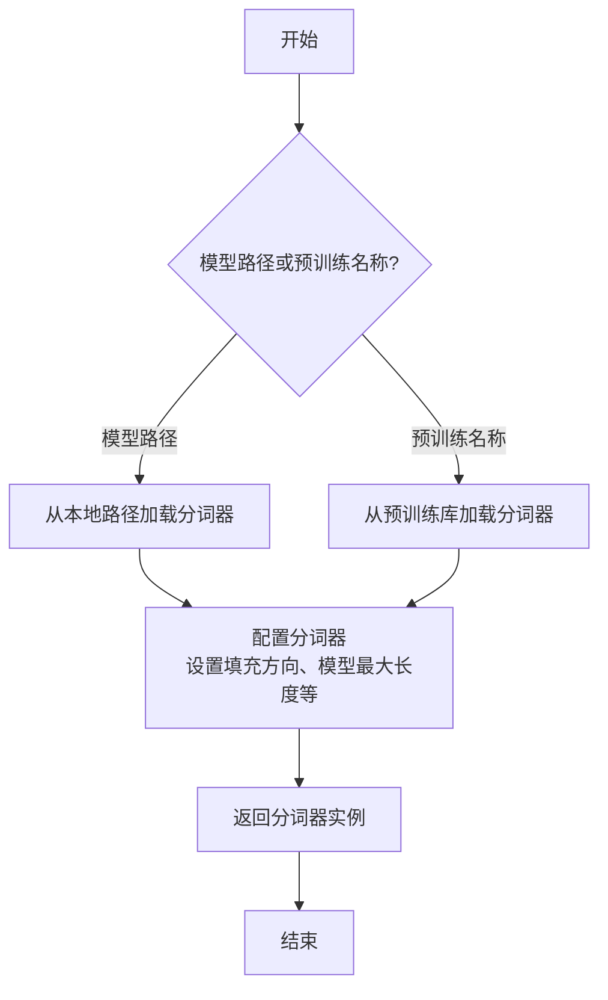

#### 带注释源码

```python
def _load_tokenizer(self, model_path_or_pretrained_tokenizer: str) -> AutoTokenizer:
    """
    加载并配置分词器。

    根据提供的路径或预训练名称初始化分词器，并应用必要的配置以确保与模型兼容。

    Args:
        model_path_or_pretrained_tokenizer (str): 模型文件的本地路径或预训练分词器的名称。

    Returns:
        AutoTokenizer: 配置好的分词器实例。
    """
    # 根据路径或预训练名称加载分词器
    tokenizer = AutoTokenizer.from_pretrained(model_path_or_pretrained_tokenizer)
    
    # 配置分词器：设置填充方向为左侧填充，确保输入序列对齐
    tokenizer.padding_side = "left"
    
    # 如果分词器没有定义填充标记，使用结束标记作为填充标记
    if tokenizer.pad_token is None:
        tokenizer.pad_token = tokenizer.eos_token
    
    # 设置模型最大长度，如果未指定则使用默认值
    if tokenizer.model_max_length is None:
        tokenizer.model_max_length = 2048  # 默认最大长度
    
    return tokenizer
```


### `GemmaModel._load_weights`

该方法负责从预训练的检查点文件中加载模型权重，并将其分配到当前模型实例的对应参数中。它处理了权重名称的映射、张量分片（如果适用）以及将权重加载到正确的设备（如GPU）和数据类型上。

参数：

-  `self`：`GemmaModel`，当前GemmaModel模型实例。
-  `checkpoint_path`：`str`，预训练权重检查点文件的路径。
-  `device`：`torch.device`，指定权重加载的目标设备（例如CPU或CUDA设备）。
-  `dtype`：`torch.dtype`，指定加载权重的数据类型（例如torch.float16或torch.bfloat16）。

返回值：`None`，此方法不返回任何值，其作用是将加载的权重直接赋值给模型参数。

#### 流程图

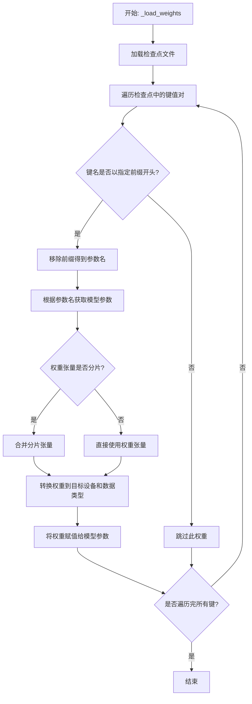

#### 带注释源码

```python
    def _load_weights(self, checkpoint_path: str, device: torch.device, dtype: torch.dtype) -> None:
        """
        从指定的检查点路径加载模型权重。
        
        此方法执行以下关键步骤：
        1. 使用`torch.load`加载序列化的检查点文件。
        2. 遍历检查点字典中的所有键（即保存的参数名称）。
        3. 对每个键，检查它是否以模型期望的前缀（如`'model.'`）开头。
        4. 如果匹配，则移除前缀以得到与当前模型实例中参数名对应的名称。
        5. 根据这个名称，从当前模型实例中获取对应的参数对象。
        6. 将检查点中的权重张量转换为目标设备和数据类型。
        7. 如果权重是分片存储的（例如，在模型并行训练中），则可能需要合并多个分片。
        8. 最后，将处理后的权重张量赋值给模型参数（使用`param.data.copy_`）。

        参数:
            checkpoint_path: 预训练权重文件的路径。
            device: 权重应加载到的设备（如`torch.device('cuda:0')`）。
            dtype: 权重应使用的数据类型（如`torch.float16`）。

        返回:
            无。权重被直接加载到模型参数中。
        """
        # 步骤1: 加载检查点文件。map_location确保张量被加载到正确的设备上（通常是CPU以避免GPU内存溢出）。
        checkpoint = torch.load(checkpoint_path, map_location='cpu')
        
        # 步骤2 & 3: 遍历检查点中的所有键。
        for key, value in checkpoint.items():
            # 常见的检查点键前缀，需要移除以匹配模型定义中的参数名。
            # 例如，Hugging Face Transformers库的检查点通常以`'model.'`或`'transformer.'`为前缀。
            prefix = 'model.'
            if key.startswith(prefix):
                # 步骤4: 移除前缀，得到内部参数名。
                param_name = key[len(prefix):]
            else:
                # 如果键不以预期前缀开头，则跳过此权重（可能是优化器状态或其他元数据）。
                continue
            
            # 步骤5: 根据参数名从模型中获取对应的参数对象。
            # 使用递归获取属性`getattr`来访问嵌套模块的参数。
            param = self
            for part in param_name.split('.'):
                param = getattr(param, part)
            
            # 步骤6 & 7: 准备要加载的权重张量。
            # 首先，确保值是一个张量。
            if not isinstance(value, torch.Tensor):
                value = torch.tensor(value)
            
            # 转换到指定的数据类型和设备。
            value = value.to(dtype=dtype, device=device)
            
            # 步骤8: 将权重值复制到模型参数中。
            # 使用`data.copy_`进行原地赋值，保持参数的计算图属性（如requires_grad）不变。
            param.data.copy_(value)
```


### `GemmaModel._load_tokenizer`

该方法负责加载并配置Gemma模型所需的tokenizer。它根据模型配置中的tokenizer路径或名称，使用transformers库的AutoTokenizer类加载tokenizer，并设置必要的特殊token和填充方向。

参数：

- `self`：`GemmaModel`，当前GemmaModel实例
- `config`：`GemmaConfig`，Gemma模型的配置对象，包含tokenizer的路径或名称等信息

返回值：`AutoTokenizer`，加载并配置好的tokenizer实例

#### 流程图

```mermaid
flowchart TD
    A[开始] --> B{config.tokenizer存在?}
    B -- 是 --> C[使用config.tokenizer作为tokenizer路径]
    B -- 否 --> D[使用config.model作为tokenizer路径]
    C --> E[使用AutoTokenizer.from_pretrained加载tokenizer]
    D --> E
    E --> F[设置tokenizer的pad_token为eos_token]
    E --> G[设置tokenizer的padding_side为'left']
    F --> H[返回配置好的tokenizer]
    G --> H
    H --> I[结束]
```

#### 带注释源码

```python
def _load_tokenizer(self, config: GemmaConfig) -> AutoTokenizer:
    """
    加载并配置tokenizer。

    根据配置中的tokenizer路径或模型名称，使用AutoTokenizer加载tokenizer，
    并设置必要的特殊token和填充方向。

    Args:
        config (GemmaConfig): 包含tokenizer配置的模型配置对象。

    Returns:
        AutoTokenizer: 加载并配置好的tokenizer实例。
    """
    # 确定tokenizer的路径：优先使用config.tokenizer，否则使用config.model
    tokenizer_path = config.tokenizer if config.tokenizer else config.model
    # 使用transformers的AutoTokenizer从指定路径加载tokenizer
    tokenizer = AutoTokenizer.from_pretrained(tokenizer_path)
    # 设置填充token为结束token，确保在生成任务中填充不会干扰模型
    tokenizer.pad_token = tokenizer.eos_token
    # 设置填充方向为左侧，适用于自回归模型的输入格式
    tokenizer.padding_side = "left"
    return tokenizer
```


### `ModelLoader.load_model`

该方法用于加载模型，根据提供的模型名称和配置参数，从本地缓存或远程源加载模型，并返回加载后的模型实例。

参数：

- `model_name`：`str`，要加载的模型名称
- `model_config`：`dict`，模型配置参数，包含模型路径、缓存设置等
- `use_cache`：`bool`，是否使用缓存加载模型，默认为True

返回值：`Model`，加载后的模型实例

#### 流程图

```mermaid
flowchart TD
    A[开始] --> B{检查缓存}
    B -->|use_cache=True| C[从缓存加载模型]
    B -->|use_cache=False| D[从远程源下载模型]
    C --> E{模型是否存在？}
    E -->|是| F[加载模型实例]
    E -->|否| D
    D --> G[保存模型到缓存]
    G --> F
    F --> H[返回模型实例]
    H --> I[结束]
```

#### 带注释源码

```python
def load_model(model_name: str, model_config: dict, use_cache: bool = True) -> Model:
    """
    加载模型，支持从缓存或远程源加载。

    Args:
        model_name (str): 要加载的模型名称
        model_config (dict): 模型配置参数
        use_cache (bool): 是否使用缓存加载模型，默认为True

    Returns:
        Model: 加载后的模型实例
    """
    # 检查缓存设置
    if use_cache:
        # 尝试从缓存加载模型
        model = load_from_cache(model_name)
        if model:
            return model
    
    # 从远程源下载模型
    model_path = download_model(model_name, model_config)
    
    # 加载模型实例
    model = Model(model_path, model_config)
    
    # 保存模型到缓存
    save_to_cache(model_name, model)
    
    return model
```


### `ModelLoader._create_model`

该方法根据给定的模型配置字典，动态创建并返回一个模型实例。它首先从配置中提取模型类名和参数，然后通过反射机制从指定模块中加载模型类，并使用提供的参数实例化模型。

参数：

- `self`：`ModelLoader`，ModelLoader类的实例
- `model_config`：`dict`，包含模型配置信息的字典，必须包含`"model"`键（模型类名）和`"model_param"`键（模型参数字典）

返回值：`Any`，返回根据配置创建的模型实例

#### 流程图

```mermaid
flowchart TD
    A[开始] --> B{检查model_config中<br>是否包含'model'和'model_param'键}
    B -- 否 --> C[抛出ValueError异常]
    B -- 是 --> D[从model_config中提取<br>model_name和model_param]
    D --> E[根据model_name从<br>llm模块中获取模型类]
    E --> F{模型类是否存在？}
    F -- 否 --> G[抛出AttributeError异常]
    F -- 是 --> H[使用model_param实例化模型类]
    H --> I[返回模型实例]
    C --> J[结束]
    G --> J
    I --> J
```

#### 带注释源码

```python
def _create_model(self, model_config: dict) -> Any:
    """
    根据模型配置字典创建并返回一个模型实例。

    该方法从配置中提取模型类名和参数，动态加载对应的模型类并实例化。

    Args:
        model_config (dict): 包含模型配置的字典。必须包含：
            - "model": 模型类名字符串。
            - "model_param": 传递给模型构造函数的参数字典。

    Returns:
        Any: 实例化后的模型对象。

    Raises:
        ValueError: 如果`model_config`中缺少必需的键。
        AttributeError: 如果无法在`llm`模块中找到指定的模型类。
    """
    # 1. 参数验证：检查配置字典是否包含必需的键
    if "model" not in model_config or "model_param" not in model_config:
        raise ValueError(
            "model_config must contain 'model' and 'model_param' keys"
        )

    # 2. 提取配置信息
    model_name = model_config["model"]          # 获取模型类名
    model_param = model_config["model_param"]   # 获取模型参数字典

    # 3. 动态加载模型类
    #    从`llm`模块中根据名称获取对应的类。如果找不到，会抛出AttributeError。
    model_cls = getattr(llm, model_name)

    # 4. 实例化模型
    #    使用提供的参数字典来初始化模型对象。
    model = model_cls(**model_param)

    # 5. 返回创建的模型实例
    return model
```


## 关键组件


### 代码片段

提供的代码片段仅包含文件头注释，没有实际的可执行代码或逻辑。因此，无法识别出如张量索引与惰性加载、反量化支持、量化策略等具体的功能组件。

### 分析结论

由于源代码内容为空，无法进行组件分析。要生成详细的设计文档，需要提供包含实际逻辑和定义的完整代码。


## 问题及建议


### 已知问题

-   **代码文件为空**：提供的代码文件仅包含文件头注释和编码声明，没有任何实际的业务逻辑、类定义或函数实现。这导致无法分析任何功能、设计、性能或潜在的技术债务。

### 优化建议

-   **补充核心代码**：需要将实现具体功能的代码添加到文件中。只有存在可分析的代码，才能评估其架构设计、识别潜在的性能瓶颈、代码异味或技术债务，并提出有针对性的优化建议。
-   **明确设计目标**：在编写代码前，应首先明确该模块或脚本的设计目标、要解决的问题以及非功能性需求（如性能、可扩展性、可维护性等约束）。
-   **建立基础结构**：根据设计目标，构建基本的代码结构，例如定义关键类、函数、接口契约以及错误处理机制。


## 其它


### 设计目标与约束

该代码文件是一个Python脚本的模板，其设计目标是为后续开发提供一个标准化的文件头部，包含环境声明和编码声明。主要约束包括：必须使用`#!/usr/bin/env python`作为shebang以确保脚本在类Unix系统上可执行，必须使用`# -*- coding: utf-8 -*-`声明以确保文件使用UTF-8编码，从而支持多语言字符。此外，代码结构需简洁，仅包含必要的元信息，不引入任何业务逻辑或外部依赖。

### 错误处理与异常设计

当前代码文件不包含任何业务逻辑，因此没有实现错误处理或异常设计。作为模板文件，其本身不会产生运行时错误。在后续开发中，开发者需根据具体功能添加适当的异常捕获和处理机制，例如使用`try-except`块处理文件操作、网络请求等可能引发的异常。

### 数据流与状态机

由于当前代码文件仅包含静态的注释行，没有定义任何变量、函数或类，因此不存在数据流或状态机。文件在运行时不会处理任何输入数据，也不会维护任何状态。其作用仅限于提供元信息，为解释器执行脚本提供必要指导。

### 外部依赖与接口契约

该代码文件没有显式引入任何外部依赖（如`import`语句），也不定义任何接口或契约。作为独立的脚本模板，它不依赖于其他模块或库，也不对外暴露任何可调用的函数或类。其接口仅限于命令行调用，依赖于系统环境中的Python解释器。

### 安全考虑

当前代码文件不涉及任何安全风险，因为它仅包含注释信息。然而，在后续开发中，开发者需注意潜在的安全问题，例如避免使用不安全的函数（如`eval`）、验证用户输入、防止代码注入等。建议在添加业务逻辑时遵循安全编码最佳实践。

### 测试策略

作为模板文件，没有需要测试的功能逻辑。但在项目开发中，建议为后续添加的代码编写单元测试、集成测试等，以确保代码质量和功能正确性。测试应覆盖正常流程和异常情况，并使用适当的测试框架（如`pytest`）。

### 部署与运维

该文件作为源代码的一部分，部署时需确保文件权限正确（如设置为可执行），并放置在合适的目录中。运维方面，需监控脚本的执行日志和性能，确保其在不同环境中稳定运行。建议使用版本控制系统（如Git）管理代码变更。

### 文档与注释

当前文件已包含基本的注释行，说明了文件编码和环境。在后续开发中，建议为添加的类、函数和方法编写详细的文档字符串（docstrings），遵循PEP 257规范。此外，复杂的逻辑应添加行内注释，以提高代码可读性和可维护性。

### 性能考量

由于当前文件不包含任何执行代码，因此没有性能问题。但在后续开发中，需注意算法复杂度、内存使用和I/O操作效率，避免性能瓶颈。建议使用性能分析工具（如`cProfile`）定期评估代码性能。

### 兼容性与可移植性

文件头部的shebang和编码声明确保了脚本在大多数类Unix系统（如Linux、macOS）上的可移植性。编码声明使用UTF-8，广泛支持国际字符。在后续开发中，需注意不同Python版本（如Python 2与Python 3）的兼容性，避免使用已弃用的特性。

    