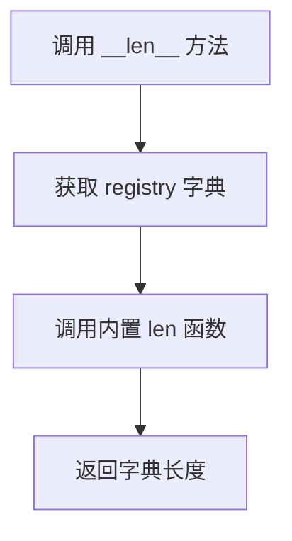
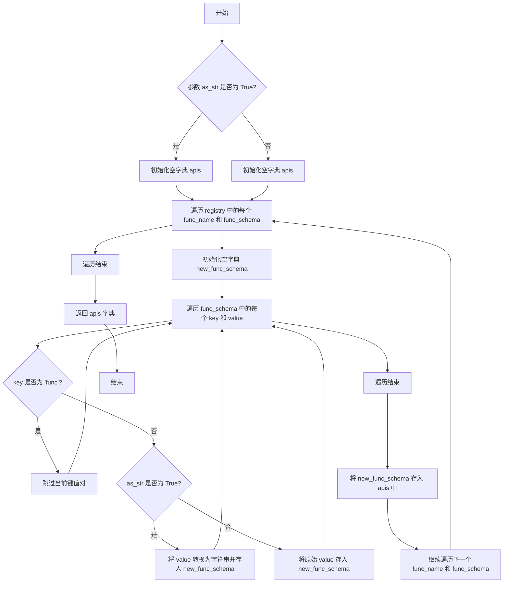

# `.\MetaGPT\metagpt\environment\api\env_api.py` 详细设计文档

该代码实现了一个环境API存储系统，核心功能是提供API的注册、管理和查询机制。它通过抽象类定义API的基本结构，并通过注册表类来存储和管理可调用的API函数，支持读写API的分类管理。

## 整体流程

```mermaid
graph TD
    A[开始] --> B[创建EnvAPIRegistry实例]
    B --> C[注册API函数]
    C --> D{查询API?}
    D -- 是 --> E[调用get()或__getitem__()]
    D -- 否 --> F{获取所有API?}
    F -- 是 --> G[调用get_apis()]
    F -- 否 --> H[结束]
    E --> I{API存在?}
    I -- 是 --> J[返回API函数]
    I -- 否 --> K[抛出KeyError异常]
    G --> L[返回API信息字典]
```

## 类结构

```
BaseModel (Pydantic基类)
├── EnvAPIAbstract (API抽象描述类)
└── EnvAPIRegistry (API注册表基类)
    ├── WriteAPIRegistry (写API注册表)
    └── ReadAPIRegistry (读API注册表)
```

## 全局变量及字段


### `EnvAPIAbstract.api_name`
    
API函数名称或标识符，用于唯一标识环境API

类型：`str`
    


### `EnvAPIAbstract.args`
    
API函数的必需参数集合，存储位置参数信息

类型：`set`
    


### `EnvAPIAbstract.kwargs`
    
API函数的关键字参数字典，存储可选参数信息

类型：`dict`
    


### `EnvAPIRegistry.registry`
    
存储API名称到可调用函数的映射字典，作为环境API的注册表

类型：`dict[str, Callable]`
    
    

## 全局函数及方法

### `EnvAPIRegistry.get`

从注册表 `registry` 中根据给定的 `api_name` 查找并返回对应的可调用函数。如果指定的 `api_name` 不存在于注册表中，则抛出 `KeyError` 异常。

参数：
- `api_name`：`str`，要查找的API函数名称或标识符。

返回值：`Callable`，与 `api_name` 关联的可调用函数对象。

#### 流程图

```mermaid
flowchart TD
    A[开始: 调用 get(api_name)] --> B{api_name 是否在 registry 中?}
    B -- 是 --> C[从 registry 中获取对应函数]
    C --> D[返回函数对象]
    B -- 否 --> E[抛出 KeyError 异常]
    E --> F[结束]
    D --> F
```

#### 带注释源码

```python
def get(self, api_name: str):
    # 检查给定的 api_name 是否存在于注册表 registry 中
    if api_name not in self.registry:
        # 如果不存在，抛出 KeyError 异常，提示未找到
        raise KeyError(f"api_name: {api_name} not found")
    # 如果存在，使用字典的 get 方法安全地返回对应的可调用函数
    return self.registry.get(api_name)
```

### `EnvAPIRegistry.__getitem__`

该方法实现了 `EnvAPIRegistry` 类的 `[]` 索引操作符重载，用于通过 API 名称（`api_name`）直接获取注册表中对应的可调用函数。它本质上是对 `get` 方法的封装，提供了更简洁的字典式访问语法。

参数：

- `api_name`：`str`，要查找的 API 接口的名称或标识符。

返回值：`Callable`，与给定 `api_name` 关联的可调用函数对象。如果 `api_name` 不存在于注册表中，将抛出 `KeyError` 异常。

#### 流程图

```mermaid
flowchart TD
    A[调用 __getitem__(api_name)] --> B{api_name 是否在 registry 中?};
    B -- 是 --> C[调用 get(api_name) 方法];
    C --> D[返回 registry.get(api_name)];
    B -- 否 --> E[get 方法抛出 KeyError 异常];
    E --> F[异常向上传递];
```

#### 带注释源码

```python
def __getitem__(self, api_name: str) -> Callable:
    # 通过重载 `[]` 操作符，允许使用 `registry[api_name]` 的语法来获取 API 函数。
    # 该方法直接调用内部的 `get` 方法，其逻辑是：
    # 1. 检查 `api_name` 是否存在于 `self.registry` 字典中。
    # 2. 如果存在，返回对应的可调用对象 (`Callable`)。
    # 3. 如果不存在，`get` 方法会抛出 `KeyError` 异常。
    return self.get(api_name)
```

### `EnvAPIRegistry.__setitem__`

该方法用于向 `EnvAPIRegistry` 的注册表 `registry` 中添加或更新一个键值对，其中键是 API 名称，值是对应的可调用函数。这是实现字典式赋值操作（如 `registry["api_name"] = func`）的核心方法。

参数：

- `api_name`：`str`，要注册或更新的 API 的名称。
- `func`：`Callable`，与 `api_name` 关联的可调用函数对象。

返回值：`None`，此方法不返回任何值，其作用是将函数存入内部字典。

#### 流程图

```mermaid
flowchart TD
    A[开始: __setitem__(api_name, func)] --> B[执行赋值操作<br>self.registry[api_name] = func]
    B --> C[结束]
```

#### 带注释源码

```python
def __setitem__(self, api_name: str, func: Callable):
    # 将传入的 `api_name` 和 `func` 作为键值对，存储到内部的 `registry` 字典中。
    # 如果 `api_name` 已存在，其对应的值将被新的 `func` 覆盖。
    self.registry[api_name] = func
```

### `EnvAPIRegistry.__len__`

该方法返回注册表中存储的API函数数量，实现了Python内置的`len()`函数支持。

参数：无

返回值：`int`，返回注册表`registry`字典中键值对的数量，即已注册的API函数总数。

#### 流程图



#### 带注释源码

```python
def __len__(self):
    # 返回 self.registry 字典的长度，即已注册的API函数数量
    return len(self.registry)
```

### `EnvAPIRegistry.get_apis`

该方法用于获取注册表中所有API的架构信息，可以选择性地将值转换为字符串格式。它遍历注册表中的每个API，过滤掉函数实例（`"func"`键），并返回一个包含API名称和对应架构信息的字典。

参数：

- `as_str`：`bool`，控制是否将架构中的值转换为字符串。默认为`True`。

返回值：`dict[str, dict[str, Union[dict, Any, str]]]`，返回一个字典，键为API名称，值为对应的架构信息（可能为字符串格式或原始格式）。

#### 流程图



#### 带注释源码

```python
def get_apis(self, as_str=True) -> dict[str, dict[str, Union[dict, Any, str]]]:
    """return func schema without func instance"""
    apis = dict()  # 初始化一个空字典，用于存储最终的API架构信息
    for func_name, func_schema in self.registry.items():  # 遍历注册表中的每个API名称和对应的架构
        new_func_schema = dict()  # 初始化一个新的字典，用于存储过滤后的架构信息
        for key, value in func_schema.items():  # 遍历当前API架构中的每个键值对
            if key == "func":  # 如果键是'func'，表示这是函数实例，跳过
                continue
            new_func_schema[key] = str(value) if as_str else value  # 根据as_str参数决定是否将值转换为字符串
        new_func_schema = new_func_schema  # 此行无实际作用，可能是冗余代码
        apis[func_name] = new_func_schema  # 将过滤后的架构信息存入apis字典中，键为API名称
    return apis  # 返回包含所有API架构信息的字典
```

## 关键组件


### EnvAPIAbstract

用于定义环境API的抽象模型，包含API名称、位置参数和关键字参数的元数据。

### EnvAPIRegistry

一个通用的环境API注册表，用于存储和检索可调用对象（API函数），并提供获取API元数据的功能。

### WriteAPIRegistry

继承自EnvAPIRegistry，作为一个显式的类名，用于标识和存储“写”类型的环境API。

### ReadAPIRegistry

继承自EnvAPIRegistry，作为一个显式的类名，用于标识和存储“读”类型的环境API。


## 问题及建议


### 已知问题

-   **`EnvAPIAbstract` 类字段类型定义不精确且存在潜在问题**：`args` 字段的类型被定义为 `set`，但默认值却是一个空字典 `{}`，这会导致类型不匹配和运行时错误。`kwargs` 字段的默认值使用 `dict()` 是冗余的，可以直接使用 `{}`。
-   **`EnvAPIRegistry.get_apis` 方法逻辑存在缺陷**：该方法假设 `self.registry` 字典中的值（即 `func_schema`）本身是字典，并尝试遍历其 `items()`。然而，根据 `registry` 字段的类型提示 `dict[str, Callable]`，其值应为可调用对象（函数），而非字典。这会导致 `AttributeError`（`'Callable' object has no attribute 'items'`），方法无法按预期工作。
-   **`WriteAPIRegistry` 和 `ReadAPIRegistry` 类仅为别名，未体现差异化设计**：这两个类直接继承 `EnvAPIRegistry` 且没有添加任何新字段、方法或重写行为。它们仅作为“显式类名”存在，这在设计上显得冗余，并未在类型系统或功能上提供实质区分，可能违反里氏替换原则的初衷（如果初衷是区分两类API）。
-   **`EnvAPIRegistry` 的 `registry` 字段缺少线程安全考虑**：`__setitem__` 和 `get` 方法直接操作字典，在多线程环境下并发注册或获取API时可能导致数据竞争或不一致状态。
-   **错误信息不够具体**：`EnvAPIRegistry.get` 方法在找不到 `api_name` 时仅抛出 `KeyError`，未提供更多上下文，例如可用的API列表，不利于调试。

### 优化建议

-   **修正 `EnvAPIAbstract` 的字段定义**：将 `args` 字段的类型更正为 `set` 并设置正确的默认值 `set()`，或将类型改为 `list` / `tuple` 如果顺序重要。将 `kwargs` 的默认值简化为 `{}`。
-   **重构 `EnvAPIRegistry` 及其 `get_apis` 方法的设计**：
    -   明确 `registry` 的用途。如果目的是存储函数及其元数据（模式），应考虑将值类型改为一个包含 `Callable` 和元数据字典的复合结构（例如一个Pydantic模型或 `TypedDict`）。
    -   修改 `get_apis` 方法，使其能够从存储的复合结构中提取并格式化元数据，而不是错误地假设值就是字典。
    -   或者，如果只需要存储函数，则应移除 `get_apis` 方法或彻底重写其逻辑以生成函数签名等元信息。
-   **重新考虑 `WriteAPIRegistry` 和 `ReadAPIRegistry` 的存在必要性**：
    -   如果读写API在行为或约束上有本质区别（例如，写API需要事务性，读API需要缓存），应在各自的类中实现这些差异。
    -   如果仅需类型提示上的区分，可以考虑使用 `typing.NewType` 创建 distinct 类型别名，或者使用泛型。
    -   如果当前没有差异，建议移除这两个子类，直接使用 `EnvAPIRegistry`，并通过命名或文档来区分读写用途。
-   **增强 `EnvAPIRegistry` 的线程安全性**：如果该注册表可能在多线程环境中使用，应考虑使用线程锁（如 `threading.Lock`）来保护对 `registry` 字典的访问，尤其是在 `__setitem__` 和 `get` 方法中。
-   **改进错误处理与提示**：在 `KeyError` 中附加当前已注册的API名称列表，方便开发者快速定位问题。
-   **添加更完善的类型注解**：为 `__len__` 等方法添加返回值类型提示。确保所有公共方法的类型提示准确无误。
-   **考虑使用 `functools.lru_cache` 或类似机制**：如果某些API的获取或元数据生成成本较高，可以考虑添加缓存机制来提升 `get` 或 `get_apis` 的性能。


## 其它


### 设计目标与约束

该模块的核心设计目标是提供一个轻量级、类型安全的环境API注册与管理系统，用于存储和检索可调用的环境读写接口。它遵循以下约束：1) 基于Pydantic模型确保数据验证和序列化；2) 通过抽象基类`EnvAPIAbstract`定义API的通用结构；3) 提供两个具体的注册表类`WriteAPIRegistry`和`ReadAPIRegistry`以在语义上区分读写操作；4) 注册表核心功能通过魔术方法（如`__getitem__`, `__setitem__`）提供类似字典的直观访问接口；5) 提供`get_apis`方法以获取API的元数据（模式），可选择性地排除函数实例本身以支持序列化或远程传输。

### 错误处理与异常设计

模块的错误处理主要集中在对无效API名称的访问上。在`EnvAPIRegistry.get`方法中，当请求的`api_name`不在注册表中时，会抛出`KeyError`异常，并附带清晰的错误信息。`__getitem__`方法依赖于`get`方法，因此继承了相同的错误处理逻辑。其他操作，如`__setitem__`（添加API）和`__len__`，在正常情况下不会抛出异常。当前设计未包含对重复注册API、传入无效`Callable`类型参数或`get_apis`方法内部处理异常的具体处理，这些属于潜在的优化点。

### 数据流与状态机

模块的数据流相对简单直接：1) **初始化**：创建`WriteAPIRegistry`或`ReadAPIRegistry`实例，其内部的`registry`字典为空。2) **注册API**：通过`__setitem__`方法或直接操作`registry`字典，将API名称（`str`）与对应的可调用函数（`Callable`）进行绑定。此操作改变注册表的内部状态。3) **查询/调用API**：通过`get`方法或`__getitem__`（`[ ]`操作符）根据API名称检索对应的函数。这是一个无状态的查询操作。4) **获取元数据**：调用`get_apis`方法遍历`registry`，生成一个包含所有API名称及其模式（排除函数对象）的新字典。此过程不改变注册表状态。模块本身不维护复杂的状态机，其状态完全由`registry`字典的内容决定。

### 外部依赖与接口契约

1.  **外部依赖**：
    *   `typing`: 用于类型注解（`Any`, `Callable`, `Union`）。
    *   `pydantic`: 用于定义数据模型（`BaseModel`, `Field`），提供字段验证、序列化和排除字段（`exclude=True`）等功能。
2.  **接口契约**：
    *   `EnvAPIAbstract`: 定义了环境中单个API/接口的抽象描述契约，包含`api_name`、`args`、`kwargs`字段。具体实现需继承此类。
    *   `EnvAPIRegistry`及其子类：提供了管理`Callable`对象的注册表契约。关键方法包括`get`（查询）、`__setitem__`（注册）、`get_apis`（获取模式）。使用者通过字符串键来存储和检索可调用对象。
    *   传递给`__setitem__`的`func`参数必须为`Callable`类型。
    *   `get_apis`返回的字典结构为：`Dict[str, Dict[str, Union[dict, Any, str]]]`，其中外层键是API名称，内层字典是该API的模式信息（排除了`'func'`键）。

### 安全与权限考量

当前代码实现未显式包含安全或权限控制机制。`EnvAPIRegistry`作为一个基础的存储容器，对其内部`registry`的访问（读、写、枚举）没有内置的权限检查。这意味着：1) 任何能够访问注册表实例的代码都可以注册新的API或覆盖已有的API。2) 任何能够访问注册表实例的代码都可以检索并调用任何已注册的API。在实际应用中，如果API涉及敏感操作或数据，需要在更上层（例如，在注册到该存储库之前，或在调用从该存储库检索到的函数时）实现身份验证、授权和参数验证等安全措施。`WriteAPIRegistry`和`ReadAPIRegistry`的区分仅为语义上的，不提供实际的写保护。

### 配置与扩展点

1.  **配置**：模块本身没有外部配置文件。行为主要通过代码初始化时决定，例如`EnvAPIAbstract`中字段的默认值，以及`EnvAPIRegistry.registry`字段使用`exclude=True`使其在序列化时被排除。
2.  **扩展点**：
    *   **继承`EnvAPIAbstract`**：可以创建更具体的API描述类，添加额外的元数据字段（如版本、作者、副作用描述）。
    *   **继承`EnvAPIRegistry`**：`WriteAPIRegistry`和`ReadAPIRegistry`是其最简单的扩展示例。可以进一步子类化以添加日志记录、访问统计、自动验证注册函数签名、或与特定框架（如FastAPI）集成自动生成接口文档等功能。
    *   **重写`get_apis`方法**：可以自定义API模式信息的生成逻辑，例如包含更丰富的类型信息、文档字符串，或适配不同的元数据格式标准（如OpenAPI Schema）。
    *   **`Callable`类型**：注册的函数可以是普通函数、类方法、`lambda`表达式或任何实现了`__call__`方法的对象，这提供了极大的灵活性。

    