# `.\MetaGPT\metagpt\environment\base_env.py` 详细设计文档

该文件定义了一个用于多智能体系统的环境基类框架。它提供了一个可扩展的外部环境（ExtEnv）抽象，支持通过注册的读写API与环境交互，并实现了一个具体的环境类（Environment），用于承载和管理多个角色（BaseRole），处理角色间的消息路由与异步执行。

## 整体流程

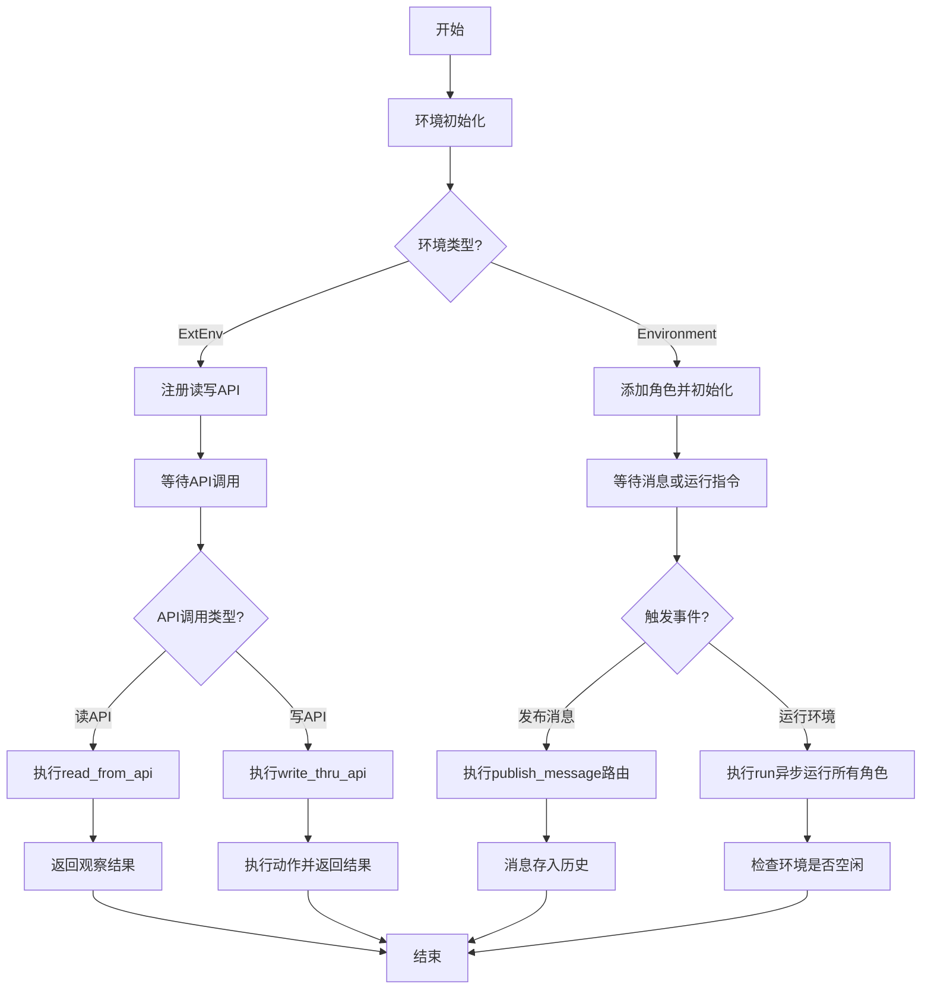

## 类结构

```
BaseEnvironment (来自metagpt.base)
├── ExtEnv (外部环境抽象基类)
│   ├── 抽象方法: reset, observe, step
│   ├── 具体方法: get_all_available_apis, read_from_api, write_thru_api
│   └── Environment (具体环境实现类)
│       ├── 覆盖方法: reset, observe, step (当前为空实现)
│       ├── 核心方法: add_role, add_roles, publish_message, run
│       └── 辅助方法: get_roles, get_role, role_names, is_idle, get_addresses, set_addresses, archive
```

## 全局变量及字段


### `env_write_api_registry`
    
全局的写API注册表，用于注册和管理所有可写入环境的外部API函数。

类型：`WriteAPIRegistry`
    


### `env_read_api_registry`
    
全局的读API注册表，用于注册和管理所有可从环境读取数据的外部API函数。

类型：`ReadAPIRegistry`
    


### `EnvType.ANDROID`
    
枚举值，表示Android类型的环境。

类型：`EnvType`
    


### `EnvType.GYM`
    
枚举值，表示Gym类型的环境，通常用于强化学习场景。

类型：`EnvType`
    


### `EnvType.WEREWOLF`
    
枚举值，表示狼人杀类型的环境。

类型：`EnvType`
    


### `EnvType.MINECRAFT`
    
枚举值，表示Minecraft类型的环境。

类型：`EnvType`
    


### `EnvType.STANFORDTOWN`
    
枚举值，表示StanfordTown类型的环境。

类型：`EnvType`
    


### `ExtEnv.action_space`
    
动作空间，定义了环境中所有可能的动作集合，用于强化学习场景。

类型：`spaces.Space[ActType]`
    


### `ExtEnv.observation_space`
    
观察空间，定义了环境中所有可能的观察状态集合，用于强化学习场景。

类型：`spaces.Space[ObsType]`
    


### `Environment.desc`
    
环境的描述信息，用于说明环境的用途或特性。

类型：`str`
    


### `Environment.roles`
    
环境中所有角色的字典，键为角色名称，值为角色对象。

类型：`dict[str, SerializeAsAny[BaseRole]]`
    


### `Environment.member_addrs`
    
角色与地址的映射字典，用于消息路由，确定消息应发送给哪些角色。

类型：`Dict[BaseRole, Set]`
    


### `Environment.history`
    
历史记录存储器，用于存储环境中发生的所有消息，便于调试和回溯。

类型：`Memory`
    


### `Environment.context`
    
环境上下文，包含环境的配置和运行时信息，供环境中的角色共享使用。

类型：`Context`
    
    

## 全局函数及方法

### `mark_as_readable`

`mark_as_readable` 是一个装饰器函数，用于将指定的函数标记为可读API，并将其注册到全局的可读API注册表中。被标记的函数通常用于从外部环境（ExtEnv）中观察或获取信息。

参数：

- `func`：`Callable`，需要被标记为可读API的函数对象。

返回值：`Callable`，返回原始的函数对象，以便装饰器可以正常包装函数。

#### 流程图

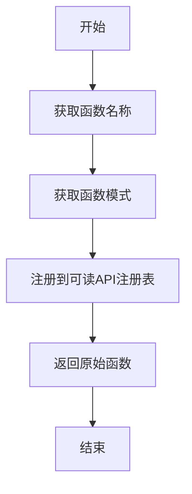

#### 带注释源码

```python
def mark_as_readable(func):
    """mark functionn as a readable one in ExtEnv, it observes something from ExtEnv"""
    # 将函数名称作为键，函数模式作为值，注册到全局的可读API注册表中
    env_read_api_registry[func.__name__] = get_function_schema(func)
    # 返回原始函数，以便装饰器正常工作
    return func
```

### `mark_as_writeable`

`mark_as_writeable` 是一个装饰器函数，用于将指定的函数标记为可写API，并将其注册到全局的`env_write_api_registry`中。这样，被标记的函数可以被外部环境调用，以执行对环境的写操作。

参数：

- `func`：`Callable`，需要被标记为可写API的函数。

返回值：`Callable`，返回原始函数，确保装饰器不会改变函数的行为。

#### 流程图

```mermaid
flowchart TD
    A[开始] --> B[接收函数 func]
    B --> C[获取函数模式 get_function_schema(func)]
    C --> D[注册到 env_write_api_registry]
    D --> E[返回原始函数 func]
    E --> F[结束]
```

#### 带注释源码

```python
def mark_as_writeable(func):
    """mark functionn as a writeable one in ExtEnv, it does something to ExtEnv"""
    env_write_api_registry[func.__name__] = get_function_schema(func)
    return func
```

### `ExtEnv._check_api_exist`

该方法用于检查给定的读写API名称是否存在。如果API名称为空或不存在，则抛出`ValueError`异常。

参数：

- `rw_api`：`Optional[str]`，要检查的读写API名称。如果为`None`或空字符串，则视为不存在。

返回值：`None`，无返回值。如果API不存在，则抛出异常。

#### 流程图

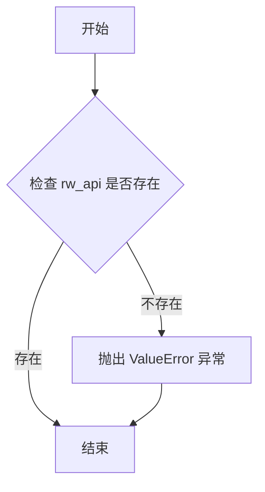

#### 带注释源码

```python
def _check_api_exist(self, rw_api: Optional[str] = None):
    # 检查传入的API名称是否为空或None
    if not rw_api:
        # 如果为空，抛出ValueError异常，提示API不存在
        raise ValueError(f"{rw_api} not exists")
```

### `ExtEnv.get_all_available_apis`

该方法用于获取环境中所有可用的读取或写入API的定义。它根据指定的模式（"read"或"write"）从相应的注册表中检索API列表。

参数：

- `mode`：`str`，指定要获取的API类型，可选值为"read"（读取API）或"write"（写入API）。

返回值：`list[Any]`，返回指定模式下所有可用API的定义列表。

#### 流程图

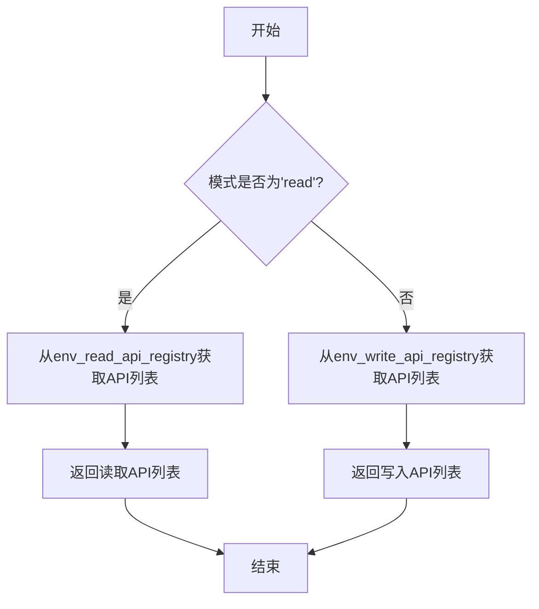

#### 带注释源码

```python
def get_all_available_apis(self, mode: str = "read") -> list[Any]:
    """get available read/write apis definition"""
    assert mode in ["read", "write"]  # 确保模式参数只能是'read'或'write'
    if mode == "read":
        return env_read_api_registry.get_apis()  # 返回所有可读API的定义
    else:
        return env_write_api_registry.get_apis()  # 返回所有可写API的定义
```

### `ExtEnv.read_from_api`

`read_from_api` 方法是 `ExtEnv` 类的一个异步实例方法，用于通过特定的读取API从外部环境中获取观察数据。它支持两种调用方式：通过API名称字符串或通过一个 `EnvAPIAbstract` 实例。方法内部会根据API的类型（同步或异步）来调用相应的函数，并返回调用结果。

参数：

- `env_action`：`Union[str, EnvAPIAbstract]`，指定要调用的读取API。可以是API的名称字符串，也可以是一个封装了API名称和参数的 `EnvAPIAbstract` 对象。

返回值：`Any`，返回从指定API调用中获取的观察数据，具体类型由被调用的API函数决定。

#### 流程图

```mermaid
flowchart TD
    A[开始: read_from_api] --> B{env_action 类型?}
    B -->|字符串| C[从注册表获取函数<br>env_read_api_registry.get]
    B -->|EnvAPIAbstract| D[从注册表获取函数<br>env_read_api_registry.get]
    C --> E{函数存在?}
    D --> E
    E -->|否| F[抛出 ValueError]
    E -->|是| G{是协程函数?<br>is_coroutine_func}
    G -->|是| H[await env_read_api(self, ...)]
    G -->|否| I[env_read_api(self, ...)]
    H --> J[返回结果 res]
    I --> J
    F --> K[结束]
    J --> K
```

#### 带注释源码

```python
async def read_from_api(self, env_action: Union[str, EnvAPIAbstract]):
    """get observation from particular api of ExtEnv"""
    # 判断传入的 env_action 是字符串还是 EnvAPIAbstract 对象
    if isinstance(env_action, str):
        # 如果是字符串，则从读取API注册表中根据名称获取对应的函数定义
        env_read_api = env_read_api_registry.get(api_name=env_action)["func"]
        # 检查获取到的函数是否存在，不存在则抛出异常
        self._check_api_exist(env_read_api)
        # 判断该函数是否是协程函数（异步函数）
        if is_coroutine_func(env_read_api):
            # 如果是异步函数，则使用 await 调用，仅传入 self（环境实例本身）
            res = await env_read_api(self)
        else:
            # 如果是同步函数，则直接调用
            res = env_read_api(self)
    elif isinstance(env_action, EnvAPIAbstract):
        # 如果是 EnvAPIAbstract 对象，则从注册表中根据其 api_name 属性获取函数
        env_read_api = env_read_api_registry.get(api_name=env_action.api_name)["func"]
        self._check_api_exist(env_read_api)
        if is_coroutine_func(env_read_api):
            # 调用异步函数，并传入 EnvAPIAbstract 对象中携带的参数
            res = await env_read_api(self, *env_action.args, **env_action.kwargs)
        else:
            # 调用同步函数，并传入参数
            res = env_read_api(self, *env_action.args, **env_action.kwargs)
    # 返回API调用的结果
    return res
```

### `ExtEnv.write_thru_api`

该方法用于通过特定的写入API执行对ExtEnv（外部环境）的操作。它支持多种类型的输入参数，包括`Message`对象、`EnvAPIAbstract`对象或其列表，并根据输入类型执行相应的操作：发布消息或调用注册的写入API函数。

参数：

- `env_action`：`Union[str, Message, EnvAPIAbstract, list[EnvAPIAbstract]]`，表示要执行的环境动作。可以是字符串（API名称）、`Message`对象、`EnvAPIAbstract`对象或`EnvAPIAbstract`对象的列表。

返回值：`Any`，返回执行结果。如果输入是`Message`对象，则返回`None`；如果输入是`EnvAPIAbstract`对象，则返回对应API函数的执行结果。

#### 流程图

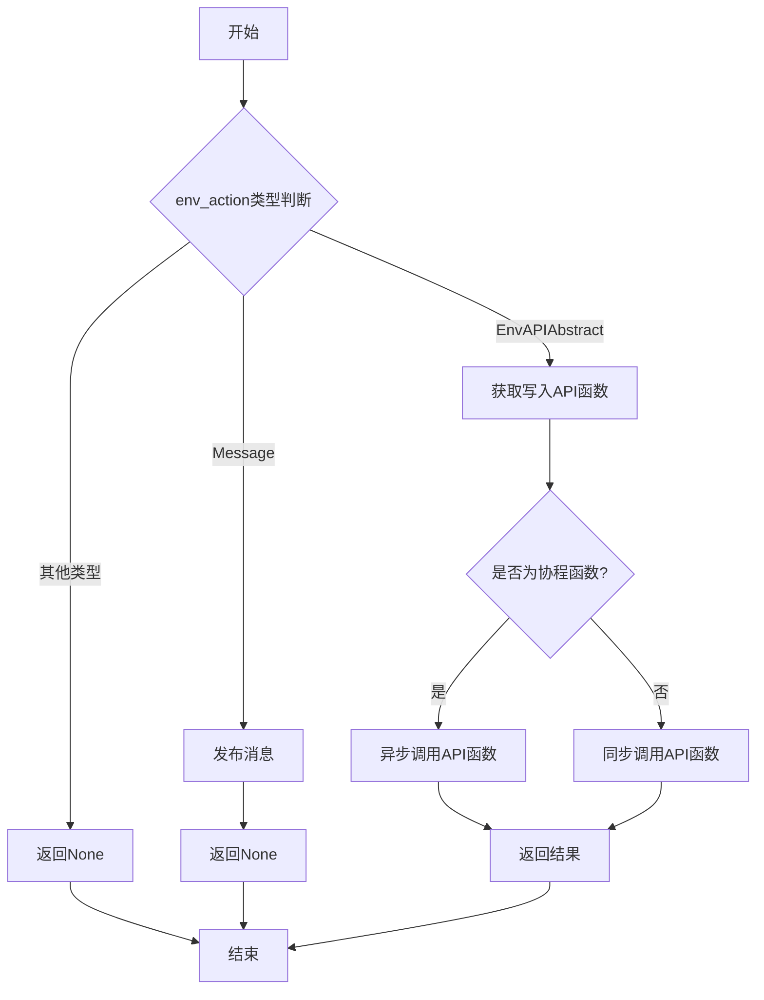

#### 带注释源码

```python
async def write_thru_api(self, env_action: Union[str, Message, EnvAPIAbstract, list[EnvAPIAbstract]]):
    """execute through particular api of ExtEnv"""
    res = None  # 初始化返回结果为None
    if isinstance(env_action, Message):  # 如果输入是Message对象
        self.publish_message(env_action)  # 发布消息到环境
    elif isinstance(env_action, EnvAPIAbstract):  # 如果输入是EnvAPIAbstract对象
        env_write_api = env_write_api_registry.get(env_action.api_name)["func"]  # 从注册表中获取对应的写入API函数
        self._check_api_exist(env_write_api)  # 检查API函数是否存在
        if is_coroutine_func(env_write_api):  # 判断是否为协程函数
            res = await env_write_api(self, *env_action.args, **env_action.kwargs)  # 异步调用API函数
        else:
            res = env_write_api(self, *env_action.args, **env_action.kwargs)  # 同步调用API函数
    return res  # 返回执行结果
```

### `Environment.reset`

该方法用于重置环境到初始状态，但当前实现为空（`pass`），是一个待实现的抽象方法占位符。它遵循了父类 `ExtEnv` 的接口约定，旨在接收可选的随机种子和配置选项，并返回环境的初始观察信息和额外信息。

参数：

- `seed`：`Optional[int]`，可选的随机数种子，用于确保环境重置后状态的可复现性。
- `options`：`Optional[dict[str, Any]]`，可选的配置字典，用于传递环境重置时的特定参数或配置。

返回值：`tuple[dict[str, Any], dict[str, Any]]`，返回一个元组，包含两个字典。第一个字典应为环境的初始观察值，第二个字典应为重置过程中的额外信息（如调试信息）。

#### 流程图

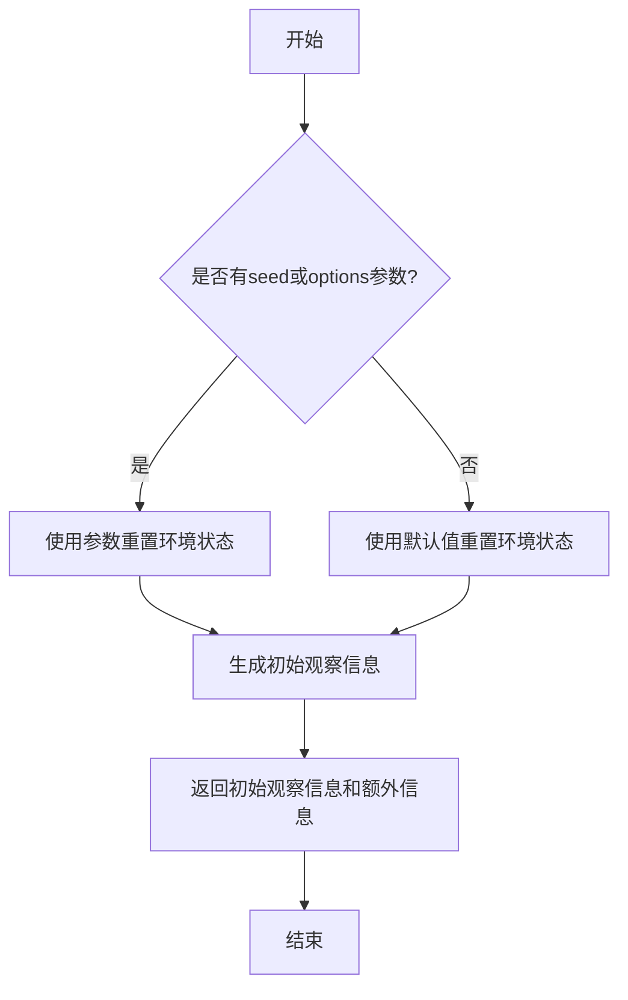

#### 带注释源码

```python
def reset(
    self,
    *,
    seed: Optional[int] = None,
    options: Optional[dict[str, Any]] = None,
) -> tuple[dict[str, Any], dict[str, Any]]:
    pass  # 这是一个待实现的占位符方法，用于重置环境到初始状态并返回初始观察信息。
```

### `ExtEnv.observe`

`ExtEnv.observe` 是一个抽象方法，用于从环境中获取部分观察结果。它允许根据提供的观察参数（`obs_params`）来定制化地观察环境状态，而不是获取完整的环境状态。该方法需要在子类中具体实现，以适应不同环境的具体观察逻辑。

参数：

- `obs_params`：`Optional[BaseEnvObsParams]`，观察参数，用于指定观察的具体内容或方式。如果为 `None`，则可能返回默认的观察结果。

返回值：`Any`，返回从环境中观察到的数据，具体类型和内容由子类实现决定。

#### 流程图

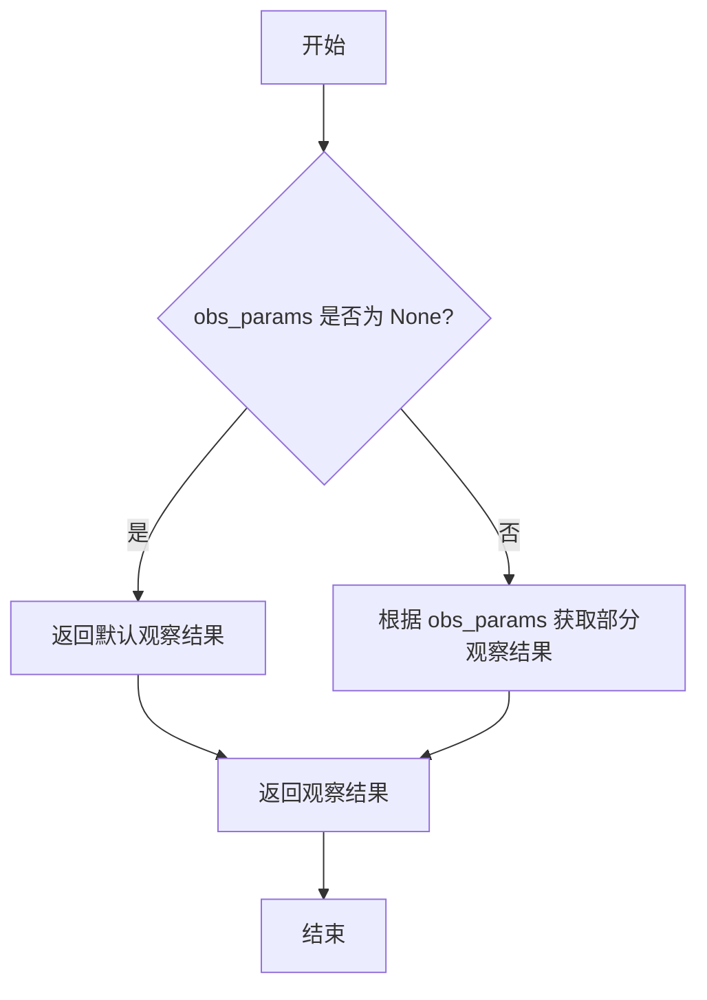

#### 带注释源码

```python
@abstractmethod
def observe(self, obs_params: Optional[BaseEnvObsParams] = None) -> Any:
    """Implement this if you want to get partial observation from the env"""
    # 这是一个抽象方法，需要在子类中具体实现。
    # 参数 obs_params 是可选的，用于指定观察的具体内容或方式。
    # 返回值类型为 Any，具体内容由子类实现决定。
    pass
```

### `ExtEnv.step`

`ExtEnv.step` 是一个抽象方法，用于定义外部环境（ExtEnv）的核心交互逻辑。当环境接收到一个动作（`BaseEnvAction`）后，该方法负责执行该动作，并返回执行后的结果，包括新的环境状态、奖励、是否终止、是否截断以及额外的调试信息。该方法的具体实现由 `ExtEnv` 的子类（如 `Environment`）提供，以适配不同的实际环境（如游戏、模拟器等）。

参数：

- `action`：`BaseEnvAction`，表示环境需要执行的动作，通常包含动作类型和参数。

返回值：`tuple[dict[str, Any], float, bool, bool, dict[str, Any]]`，返回一个五元组，包含：
  1. 新的观察状态（observation），类型为字典，键为字符串，值为任意类型。
  2. 奖励值（reward），类型为浮点数。
  3. 是否终止（terminated），类型为布尔值，表示当前回合是否结束。
  4. 是否截断（truncated），类型为布尔值，表示当前回合是否因步数限制等原因被提前终止。
  5. 额外的调试信息（info），类型为字典，键为字符串，值为任意类型，用于提供额外的环境信息。

#### 流程图

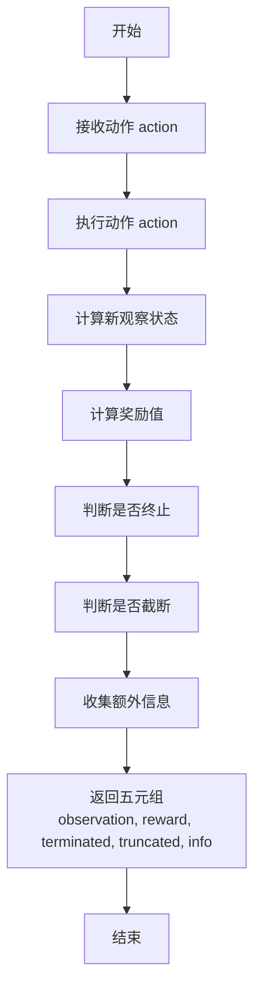

#### 带注释源码

```python
@abstractmethod
def step(self, action: BaseEnvAction) -> tuple[dict[str, Any], float, bool, bool, dict[str, Any]]:
    """Implement this to feed a action and then get new observation from the env"""
    # 这是一个抽象方法，需要在子类中具体实现。
    # 参数 action: 一个 BaseEnvAction 类型的对象，代表要执行的动作。
    # 返回值: 一个五元组，包含：
    #   - 新的观察状态 (observation): 一个字典，描述执行动作后的环境状态。
    #   - 奖励值 (reward): 一个浮点数，表示执行该动作后获得的即时奖励。
    #   - 是否终止 (terminated): 一个布尔值，True 表示当前回合（episode）已结束（例如，任务成功或失败）。
    #   - 是否截断 (truncated): 一个布尔值，True 表示当前回合因步数限制等非终止条件而提前结束。
    #   - 额外信息 (info): 一个字典，包含用于调试、日志记录或其他目的的额外环境数据。
    pass
```

### `Environment.reset`

该方法用于重置环境到初始状态，但目前仅是一个空实现（pass），未包含具体的重置逻辑。它遵循了父类 `ExtEnv` 中定义的抽象方法签名，旨在为子类提供重置环境的标准接口。

参数：

- `seed`：`Optional[int]`，可选参数，用于设置环境的随机种子，以确保实验的可重复性。
- `options`：`Optional[dict[str, Any]]`，可选参数，一个字典，包含重置环境时可能需要的额外配置选项。

返回值：`tuple[dict[str, Any], dict[str, Any]]`，返回一个元组，包含两个字典。第一个字典通常表示环境的初始观察状态（observation），第二个字典包含重置过程中的额外信息（info）。当前实现返回 `None`。

#### 流程图

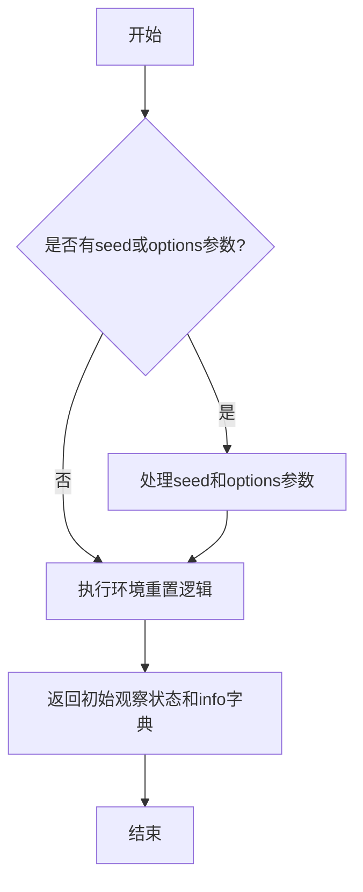

#### 带注释源码

```python
def reset(
    self,
    *,
    seed: Optional[int] = None,
    options: Optional[dict[str, Any]] = None,
) -> tuple[dict[str, Any], dict[str, Any]]:
    pass  # 当前为空实现，需在子类中具体实现环境重置逻辑
```

### `Environment.observe`

`Environment.observe` 方法旨在从环境中获取部分观察结果。在当前的 `Environment` 类实现中，该方法是一个抽象方法的占位符，没有具体的实现逻辑，直接返回 `None`。它继承自 `ExtEnv` 基类，遵循了 Gymnasium 环境接口的约定，允许子类根据具体环境的需求（如游戏状态、传感器数据等）实现具体的观察逻辑。

参数：

- `obs_params`：`Optional[BaseEnvObsParams]`，可选的观察参数，用于指定获取观察时的特定条件或过滤信息。在当前实现中未使用。

返回值：`Any`，返回从环境中观察到的任何信息。在当前实现中直接返回 `None`。

#### 流程图

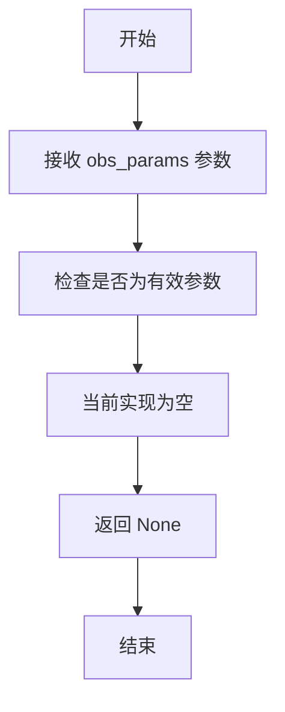

#### 带注释源码

```python
def observe(self, obs_params: Optional[BaseEnvObsParams] = None) -> Any:
    """
    从环境中获取部分观察结果。
    此方法为抽象方法的占位符，当前实现为空，直接返回 None。
    子类应重写此方法以提供具体的观察逻辑。

    Args:
        obs_params (Optional[BaseEnvObsParams]): 可选的观察参数，用于指定获取观察时的条件。

    Returns:
        Any: 观察结果。当前实现返回 None。
    """
    pass  # 当前为空实现，等待子类具体实现
```

### `Environment.step`

该方法在`Environment`类中定义，是继承自`ExtEnv`类的抽象方法`step`的具体实现。根据代码，当前实现为空（`pass`），这意味着该方法尚未实现具体的环境交互逻辑。其预期功能是接收一个动作（`action`），执行该动作，并返回执行后的环境状态、奖励、是否终止、是否截断以及额外信息。

参数：

- `action`：`BaseEnvAction`，表示要在环境中执行的动作。

返回值：`tuple[dict[str, Any], float, bool, bool, dict[str, Any]]`，返回一个元组，包含：
  1. 观察结果（`observation`）：一个字典，包含执行动作后环境的新状态信息。
  2. 奖励（`reward`）：一个浮点数，表示执行该动作后获得的奖励。
  3. 终止标志（`terminated`）：一个布尔值，表示当前情节是否已结束（例如，任务完成或失败）。
  4. 截断标志（`truncated`）：一个布尔值，表示当前情节是否因时间限制等原因被提前截断。
  5. 额外信息（`info`）：一个字典，包含调试或其他辅助信息。

#### 流程图

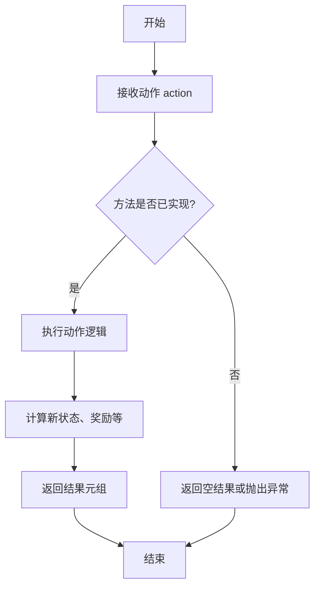

#### 带注释源码

```python
def step(self, action: BaseEnvAction) -> tuple[dict[str, Any], float, bool, bool, dict[str, Any]]:
    """
    在环境中执行一个动作，并返回执行后的结果。
    当前实现为空，需要子类根据具体环境逻辑进行重写。

    参数:
        action (BaseEnvAction): 要执行的动作。

    返回:
        tuple[dict[str, Any], float, bool, bool, dict[str, Any]]: 
            一个包含以下内容的元组：
            - observation (dict): 执行动作后的环境观察状态。
            - reward (float): 执行动作后获得的奖励。
            - terminated (bool): 指示当前情节是否已终止。
            - truncated (bool): 指示当前情节是否被截断。
            - info (dict): 包含额外信息的字典，用于调试或记录。
    """
    pass  # 具体实现应由子类提供
```

### `Environment.init_roles`

`init_roles` 是 `Environment` 类的一个模型验证器方法，在 Pydantic 模型实例化后自动调用。它的核心功能是初始化环境中的角色，确保所有通过构造函数或字段赋值传入的角色都被正确地添加到环境实例中，并完成角色与环境、上下文的关联设置。

参数：

-  `self`：`Environment`，当前 `Environment` 类的实例。

返回值：`Environment`，返回初始化后的 `Environment` 实例自身。

#### 流程图

```mermaid
flowchart TD
    A[开始: init_roles被调用] --> B[调用 self.add_roles<br>传入 self.roles.values]
    B --> C{遍历 roles 列表}
    C --> D[调用 role.set_env(self)<br>设置角色的环境]
    D --> E[设置 role.context = self.context<br>同步上下文]
    E --> C
    C -->|遍历完成| F[返回 self]
    F --> G[结束]
```

#### 带注释源码

```python
    @model_validator(mode="after")
    def init_roles(self):
        # 这是一个Pydantic模型验证器，在模型实例的所有字段被赋值后（mode="after"）自动执行。
        # 它的目的是确保在Environment对象创建后，其`roles`字段中的所有角色都被正确初始化并关联到当前环境。
        self.add_roles(self.roles.values())
        # 调用`add_roles`方法，传入当前环境中所有角色对象的可迭代集合。
        # `add_roles`方法会遍历这些角色，将每个角色添加到`self.roles`字典，并调用`role.set_env(self)`和`role.context = self.context`完成绑定。
        return self
        # 模型验证器要求返回模型实例本身或一个包含更新字段的字典。这里返回`self`，表示实例已准备就绪。
```

### `Environment.add_role`

增加一个在当前环境的角色。该方法将给定的角色对象添加到环境管理的角色字典中，并设置该角色的环境上下文。

参数：

- `role`：`BaseRole`，要添加到环境中的角色对象。

返回值：`None`，无返回值。

#### 流程图

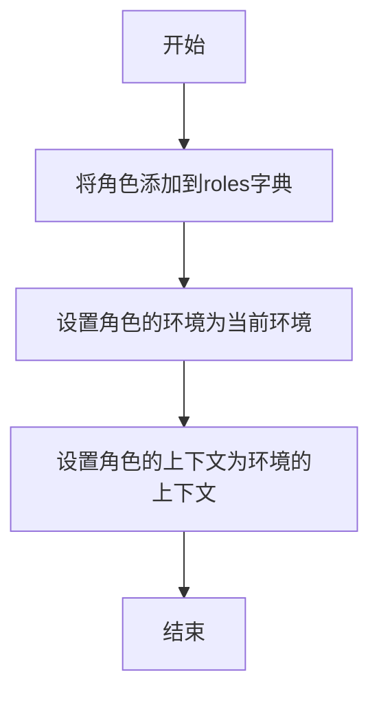

#### 带注释源码

```python
def add_role(self, role: BaseRole):
    """增加一个在当前环境的角色
    Add a role in the current environment
    """
    # 将角色对象以其名称作为键，存储到环境的roles字典中
    self.roles[role.name] = role
    # 调用角色的set_env方法，将当前环境对象（self）设置为该角色的环境
    role.set_env(self)
    # 将当前环境的上下文（self.context）赋值给角色的上下文属性
    role.context = self.context
```

### `Environment.add_roles`

该方法用于向当前环境中批量添加多个角色。它会遍历传入的角色迭代器，将每个角色添加到环境的角色字典中，并为每个角色设置环境上下文和系统消息。

参数：

- `roles`：`Iterable[BaseRole]`，一个可迭代对象，包含要添加到环境中的角色实例。

返回值：`None`，无返回值。

#### 流程图

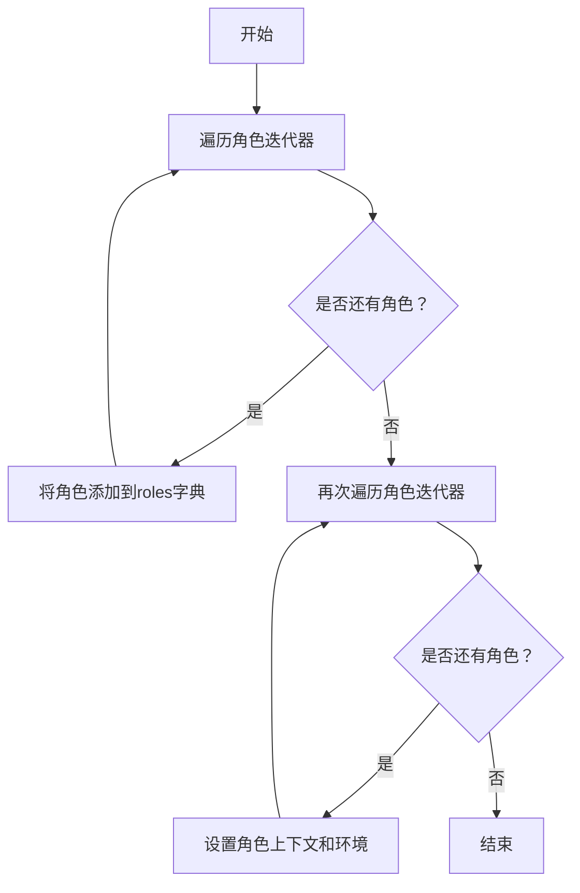

#### 带注释源码

```python
def add_roles(self, roles: Iterable[BaseRole]):
    """增加一批在当前环境的角色
    Add a batch of characters in the current environment
    """
    # 第一次遍历：将所有角色添加到self.roles字典中
    for role in roles:
        self.roles[role.name] = role

    # 第二次遍历：为每个角色设置上下文和环境
    for role in roles:  # setup system message with roles
        role.context = self.context
        role.set_env(self)
```

### `Environment.publish_message`

该方法负责将消息分发给环境中的接收者。它根据消息中的路由信息，将消息传递给符合条件的角色，并记录到历史中用于调试。

参数：

- `message`：`Message`，要发布的消息对象，包含消息内容和路由信息。
- `peekable`：`bool`，指示消息是否可被查看，默认为`True`。

返回值：`bool`，始终返回`True`，表示消息发布操作已完成。

#### 流程图

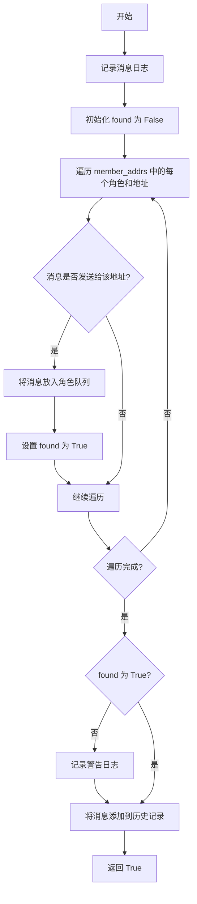

#### 带注释源码

```python
def publish_message(self, message: Message, peekable: bool = True) -> bool:
    """
    Distribute the message to the recipients.
    In accordance with the Message routing structure design in Chapter 2.2.1 of RFC 116, as already planned
    in RFC 113 for the entire system, the routing information in the Message is only responsible for
    specifying the message recipient, without concern for where the message recipient is located. How to
    route the message to the message recipient is a problem addressed by the transport framework designed
    in RFC 113.
    """
    logger.debug(f"publish_message: {message.dump()}")  # 记录消息发布的调试日志
    found = False  # 初始化标志，用于追踪是否找到接收者
    # According to the routing feature plan in Chapter 2.2.3.2 of RFC 113
    for role, addrs in self.member_addrs.items():  # 遍历环境中的所有角色及其地址
        if is_send_to(message, addrs):  # 检查消息是否应发送给该角色的地址
            role.put_message(message)  # 将消息放入角色的消息队列
            found = True  # 标记已找到接收者
    if not found:  # 如果未找到任何接收者
        logger.warning(f"Message no recipients: {message.dump()}")  # 记录警告日志
    self.history.add(message)  # 将消息添加到历史记录中，用于调试

    return True  # 始终返回 True，表示操作完成
```

### `Environment.run`

`Environment.run` 方法是 `Environment` 类的核心异步方法，负责并发执行环境中所有非空闲角色的 `run` 方法。它通过 `asyncio.gather` 并行启动所有角色的任务，从而实现环境中角色的同步推进。该方法通常用于驱动一个模拟“回合”或“时间步”，直到所有角色都进入空闲状态或达到指定的执行次数。

参数：
- `k`：`int`，可选参数，默认为1。指定方法运行的轮次（或迭代次数）。在每一轮中，所有非空闲角色都会并发执行一次。

返回值：`None`，此方法不返回任何值，其作用在于执行并发的角色任务。

#### 流程图

```mermaid
flowchart TD
    A[开始运行 Environment.run(k)] --> B{初始化循环 i < k?};
    B -- 是 --> C[初始化 futures 列表];
    C --> D[遍历所有角色];
    D --> E{角色是否空闲?};
    E -- 否 --> F[将 role.run() 加入 futures];
    E -- 是 --> D;
    F --> D;
    D --> G{futures 列表为空?};
    G -- 否 --> H[使用 asyncio.gather 并发执行];
    H --> I[记录环境空闲状态];
    I --> B;
    G -- 是 --> B;
    B -- 否 --> J[结束];
```

#### 带注释源码

```python
async def run(self, k=1):
    """处理一次所有信息的运行
    Process all Role runs at once
    """
    # 外层循环，控制整个环境运行的轮次（回合数）
    for _ in range(k):
        futures = []
        # 遍历环境中的所有角色
        for role in self.roles.values():
            # 跳过当前空闲的角色，不为其安排任务
            if role.is_idle:
                continue
            # 获取角色的异步运行协程（future）
            future = role.run()
            futures.append(future)

        # 如果本轮有角色需要运行（futures非空）
        if futures:
            # 使用 asyncio.gather 并发执行所有角色的 run 方法
            await asyncio.gather(*futures)
        # 记录当前环境是否处于空闲状态（所有角色都空闲）
        logger.debug(f"is idle: {self.is_idle}")
```

### `Environment.get_roles`

该方法用于获取当前环境中注册的所有角色，返回一个字典，其中键为角色名称，值为对应的角色对象。

参数：无

返回值：`dict[str, BaseRole]`，返回一个字典，包含环境中所有角色的名称和对应的角色对象。

#### 流程图

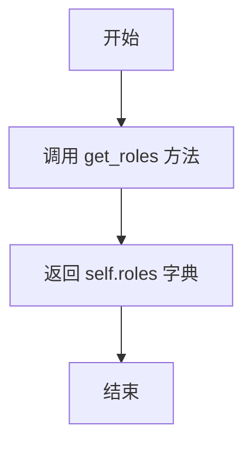

#### 带注释源码

```python
def get_roles(self) -> dict[str, BaseRole]:
    """获得环境内的所有角色
    Process all Role runs at once
    """
    return self.roles  # 直接返回存储所有角色的字典
```

### `Environment.get_role`

该方法用于从当前环境中获取指定名称的角色实例。如果环境中存在该名称的角色，则返回对应的 `BaseRole` 对象；如果不存在，则返回 `None`。

参数：

- `name`：`str`，要获取的角色的名称。

返回值：`BaseRole`，返回环境中指定名称的角色实例，如果不存在则返回 `None`。

#### 流程图

```mermaid
flowchart TD
    A[开始] --> B{检查 roles 字典中<br>是否存在键 name}
    B -- 存在 --> C[返回 roles[name]]
    B -- 不存在 --> D[返回 None]
    C --> E[结束]
    D --> E
```

#### 带注释源码

```python
def get_role(self, name: str) -> BaseRole:
    """获得环境内的指定角色
    get all the environment roles
    """
    # 使用字典的 get 方法，根据键 name 查找对应的角色对象。
    # 如果找到，返回该角色；如果未找到，返回 None。
    return self.roles.get(name, None)
```

### `Environment.role_names`

该方法返回环境中所有角色的名称列表。

参数：无

返回值：`list[str]`，包含环境中所有角色名称的列表

#### 流程图

```mermaid
flowchart TD
    A[开始] --> B[初始化空列表 result]
    B --> C[遍历 self.roles.values]
    C --> D{是否还有角色未处理?}
    D -- 是 --> E[获取当前角色 role]
    E --> F[将 role.name 添加到 result 列表]
    F --> C
    D -- 否 --> G[返回 result 列表]
    G --> H[结束]
```

#### 带注释源码

```python
def role_names(self) -> list[str]:
    # 使用列表推导式遍历 self.roles 字典中的所有角色对象
    # 提取每个角色的 name 属性，组成新的列表并返回
    return [i.name for i in self.roles.values()]
```

### `Environment.is_idle`

`Environment.is_idle` 是一个属性（property），用于检查当前环境中的所有角色是否都处于空闲状态。如果所有角色都空闲，则返回 `True`；否则返回 `False`。

参数：无

返回值：`bool`，如果所有角色都空闲则返回 `True`，否则返回 `False`。

#### 流程图

```mermaid
flowchart TD
    A[开始] --> B[遍历环境中的每个角色]
    B --> C{角色是否空闲？}
    C -->|否| D[返回 False]
    C -->|是| E[继续检查下一个角色]
    E --> B
    B --> F[所有角色检查完毕]
    F --> G[返回 True]
```

#### 带注释源码

```python
@property
def is_idle(self):
    """If true, all actions have been executed."""
    for r in self.roles.values():  # 遍历环境中的所有角色
        if not r.is_idle:          # 如果发现某个角色不空闲
            return False           # 立即返回 False
    return True                    # 所有角色都空闲，返回 True
```

### `Environment.get_addresses`

该方法用于获取指定对象在环境中的地址集合。地址集合用于消息路由，判断消息是否应发送给该对象。

参数：

- `obj`：`Any`，需要查询地址的对象，通常是`BaseRole`实例。

返回值：`Set`，返回对象对应的地址集合，如果对象不存在则返回空集合`{}`。

#### 流程图

```mermaid
graph TD
    A[开始] --> B{检查 member_addrs 中是否存在 obj 键};
    B -- 是 --> C[返回 obj 对应的地址集合];
    B -- 否 --> D[返回空集合 {}];
    C --> E[结束];
    D --> E;
```

#### 带注释源码

```python
def get_addresses(self, obj):
    """Get the addresses of the object."""
    # 从成员地址字典 member_addrs 中获取 obj 对应的地址集合
    # 如果 obj 不存在，则返回一个空集合 {}
    return self.member_addrs.get(obj, {})
```

### `Environment.set_addresses`

该方法用于为环境中的某个对象（通常是角色）设置一个地址集合。地址用于消息路由，以确定消息应发送给哪些对象。

参数：

- `obj`：`Any`，需要设置地址的对象，通常是`BaseRole`实例。
- `addresses`：`Set`，要分配给该对象的地址集合。

返回值：`None`，无返回值。

#### 流程图

```mermaid
flowchart TD
    A[开始] --> B[接收参数 obj 和 addresses]
    B --> C[将 addresses 赋值给<br>self.member_addrs[obj]]
    C --> D[结束]
```

#### 带注释源码

```python
def set_addresses(self, obj, addresses):
    """Set the addresses of the object"""
    # 将传入的地址集合 addresses 存储到成员字典 member_addrs 中，
    # 键为传入的对象 obj（通常是角色实例），值为地址集合。
    # 这用于后续的消息路由，以确定哪些消息应发送给此对象。
    self.member_addrs[obj] = addresses
```

### `Environment.archive`

该方法用于在满足条件时自动归档项目代码到Git仓库。它检查环境上下文中的`project_path`配置，如果存在且启用了自动归档，则调用Git仓库的归档功能。

参数：

- `auto_archive`：`bool`，控制是否自动执行归档操作的标志，默认为True

返回值：`None`，无返回值

#### 流程图

```mermaid
flowchart TD
    A[开始] --> B{auto_archive为True?}
    B -- 否 --> C[结束]
    B -- 是 --> D{上下文包含project_path?}
    D -- 否 --> C
    D -- 是 --> E[创建GitRepository对象]
    E --> F[调用archive方法]
    F --> C
```

#### 带注释源码

```python
def archive(self, auto_archive=True):
    # 检查是否启用自动归档且上下文包含项目路径
    if auto_archive and self.context.kwargs.get("project_path"):
        # 创建Git仓库操作对象
        git_repo = GitRepository(self.context.kwargs.project_path)
        # 执行归档操作
        git_repo.archive()
```

## 关键组件

### ExtEnv (External Environment)

作为集成实际游戏环境的外部环境基类，它定义了与外部环境交互的抽象接口（如 `reset`, `observe`, `step`）和通过注册表机制动态发现、调用读写API（`read_from_api`, `write_thru_api`）的能力，实现了环境动作与观察的标准化管理。

### Environment

作为承载并管理多个角色（`BaseRole`）的运行时环境，它提供了角色间的消息路由与分发机制（`publish_message`），支持角色的批量添加与异步运行调度（`run`），并维护了角色的上下文、通信地址和历史记录，是Multi-Agent系统交互的核心协调者。

### API 注册机制 (ReadAPIRegistry / WriteAPIRegistry)

通过装饰器（`mark_as_readable`, `mark_as_writeable`）和全局注册表（`env_read_api_registry`, `env_write_api_registry`）动态注册环境可提供的读写操作API，实现了环境功能的可扩展性和自描述性，允许外部查询（`get_all_available_apis`）并调用这些API。

### 消息路由与分发

基于 `Message` 对象中的路由信息和环境维护的 `member_addrs` 映射，`publish_message` 方法将消息精准投递给目标角色。它遵循了关注点分离的设计，将消息的“目的地”逻辑与“如何送达”的传输机制解耦。

### 角色管理

环境通过 `roles` 字典集中管理所有角色实例，提供角色的增删查改（`add_role`, `get_role`, `role_names`）功能，并为角色设置统一的环境上下文（`context`）和所属环境引用，确保角色在正确的上下文中运行。

## 问题及建议

### 已知问题

-   **抽象方法未实现**：`ExtEnv` 类中的 `reset`、`observe` 和 `step` 方法被标记为 `@abstractmethod`，但继承它的 `Environment` 类仅提供了空实现（`pass`），这违反了抽象基类的设计初衷，可能导致运行时错误或功能缺失。
-   **API注册与检查逻辑不一致**：`_check_api_exist` 方法在 `rw_api` 为 `None` 时抛出异常，但在 `read_from_api` 和 `write_thru_api` 方法中，当 `env_read_api_registry.get` 或 `env_write_api_registry.get` 未找到API时，返回的是 `None`，而后续的 `self._check_api_exist(env_read_api)` 调用会因 `env_read_api` 为 `None` 而触发异常。然而，异常信息 `f"{rw_api} not exists"` 中的 `rw_api` 变量名与实际传入的参数名（`env_read_api` 或 `env_write_api`）不匹配，导致错误信息不准确。
-   **潜在的循环导入风险**：代码中从 `metagpt.base` 导入了 `BaseEnvironment` 和 `BaseRole`，同时 `Environment` 类又继承了 `ExtEnv`（它继承自 `BaseEnvironment`）。如果模块间的依赖关系复杂，可能存在循环导入的风险。
-   **`is_idle` 属性可能计算不准确**：`is_idle` 属性通过遍历所有角色并检查其 `is_idle` 属性来判断环境是否空闲。如果角色的 `is_idle` 状态更新不及时或逻辑有误，可能导致环境状态判断错误。
-   **`archive` 方法依赖外部上下文**：`archive` 方法的功能依赖于 `self.context.kwargs.get("project_path")` 提供的路径。如果上下文未正确设置或 `project_path` 不存在，该方法将静默失败（不执行任何操作），缺乏错误处理或日志记录。

### 优化建议

-   **实现或明确抽象方法**：应在 `Environment` 类中提供 `reset`、`observe` 和 `step` 方法有意义的实现，或者重新考虑类的继承层次（例如，如果 `Environment` 不需要这些方法，可能不应继承自 `ExtEnv`）。至少，应在空实现中添加 `raise NotImplementedError` 或日志记录，以明确指示功能待实现。
-   **统一并改进API查找与错误处理**：重构 `read_from_api` 和 `write_thru_api` 方法中的API查找逻辑。建议直接从注册表获取函数引用，如果为 `None`，则抛出带有清晰错误信息（包括请求的API名称）的异常。可以创建一个辅助方法来封装此逻辑，避免重复代码。
-   **优化消息发布性能**：`publish_message` 方法中，对于每条消息都需要遍历 `self.member_addrs` 字典并检查每个角色的地址集合。如果角色和消息数量很大，这可能成为性能瓶颈。可以考虑使用更高效的数据结构（如索引或反向映射）来加速消息路由。
-   **增强异步处理健壮性**：`run` 方法使用 `asyncio.gather` 并发运行所有角色的 `run` 方法。如果某个角色的 `run` 方法抛出未处理的异常，`gather` 会传播异常并可能导致整个环境运行中断。建议添加错误处理（如 `try-except` 块）来记录异常并允许其他角色继续运行，或使用 `asyncio.shield` 等机制。
-   **改进日志与可观测性**：在关键方法（如 `add_role`、`publish_message`、`run`）中添加更详细的日志级别输出（例如 `INFO`），以便于调试和监控环境状态。特别是在 `publish_message` 中记录消息的最终路由结果（发送给了哪些角色）。
-   **考虑内存管理**：`Environment` 持有所有角色对象 (`roles`) 和完整的历史消息 (`history`)。在长时间运行或角色数量动态变化的场景中，这可能导致内存持续增长。应考虑实现消息历史的内存清理策略（如基于数量或时间的滚动窗口），或提供角色注销机制。
-   **类型注解细化**：部分方法的类型注解可以更精确。例如，`get_all_available_apis` 的返回值类型标注为 `list[Any]`，可以细化为 `list[Dict]` 或使用自定义的 `APISchema` 类型。`read_from_api` 和 `write_thru_api` 的返回值类型也应具体化。
-   **分离关注点**：`Environment` 类同时承担了角色管理、消息路由、环境状态维护（如 `is_idle`）以及外部集成（通过继承 `ExtEnv`）等多种职责。考虑遵循单一职责原则，将角色管理、消息总线、环境状态机等拆分为独立的组件或服务类。

## 其它


### 设计目标与约束

本模块的核心设计目标是构建一个可扩展的、支持多种具体环境（如游戏、模拟器）的通用环境抽象层。它旨在作为智能体（角色）与外部世界交互的媒介，管理角色间的通信（通过消息传递）和协调角色的并发执行。设计上遵循了面向对象和基于组件的架构原则，通过抽象基类定义接口，通过具体类提供默认实现。主要约束包括：需要与Gymnasium API保持兼容以利用其丰富的生态系统；需要支持异步操作以处理高并发场景；需要通过Pydantic模型确保配置和状态的数据验证与序列化。

### 错误处理与异常设计

模块中的错误处理主要采用Python标准的异常机制。关键方法如 `_check_api_exist` 会检查API是否存在，并在不存在时抛出 `ValueError`。在异步方法 `read_from_api` 和 `write_thru_api` 中，对可调用对象进行了同步与异步的区分处理，但未显式捕获或转换执行API时可能抛出的异常，这意味着调用者需要处理来自具体环境API的实现异常。`publish_message` 方法在找不到消息接收者时会记录警告日志而非抛出异常，体现了“尽力交付”的设计理念。整体上，错误处理策略偏向于将异常抛给上层调用者处理，模块内部仅进行基本的参数验证和状态检查。

### 数据流与状态机

模块的核心数据流围绕`Message`对象和`EnvAPIAbstract`动作展开。角色通过`publish_message`向环境发布`Message`，环境根据`member_addrs`路由表将消息分发给目标角色。外部控制器或角色也可以通过`write_thru_api`方法，以`EnvAPIAbstract`动作的形式直接对环境状态施加影响。观察数据流通过`observe`抽象方法和`read_from_api`方法实现，允许按需获取环境状态。环境本身没有复杂的状态机，其核心状态包括角色集合(`roles`)、消息历史(`history`)和路由表(`member_addrs`)。`run`方法驱动所有非空闲角色并发执行其内部行为，构成了一个基于事件的协同调度循环。

### 外部依赖与接口契约

1.  **Gymnasium**: 依赖其`spaces.Space`定义动作和观察空间，`ActType`, `ObsType`类型。`ExtEnv`类继承了Gymnasium的环境接口规范（`reset`, `step`, `observe`），这是与强化学习算法集成的主要契约。
2.  **Pydantic**: 作为`BaseModel`的基类，用于`Environment`和`ExtEnv`的数据验证、序列化配置（通过`model_config`）和字段管理（如`Field`, `SerializeAsAny`）。
3.  **asyncio**: 用于实现`run`、`read_from_api`、`write_thru_api`等方法的异步并发执行。
4.  **内部依赖**:
    *   `BaseEnvironment`, `BaseRole`, `BaseEnvAction`, `BaseEnvObsParams`: 来自`metagpt.base`和`metagpt.base.base_env_space`的抽象基类，定义了核心接口。
    *   `Context`, `Memory`: 来自`metagpt.context`和`metagpt.memory`，提供运行时上下文和历史记忆存储。
    *   `Message`: 来自`metagpt.schema`，是角色间通信的基本单元。
    *   `EnvAPIAbstract`, `ReadAPIRegistry`, `WriteAPIRegistry`: 来自`metagpt.environment.api.env_api`，定义了环境读写操作的抽象和注册机制。
    *   `GitRepository`: 来自`metagpt.utils.git_repository`，用于项目归档。

### 配置管理与序列化

配置管理主要通过Pydantic模型实现。`Environment`类的字段如`desc`（环境描述）、`roles`（角色字典）可通过实例化时传入字典或配置文件进行初始化。`model_config = ConfigDict(arbitrary_types_allowed=True)` 的设置允许字段包含非Pydantic原生类型（如`spaces.Space`, `Context`）。`SerializeAsAny[BaseRole]`用于确保`roles`字典中的角色子类对象能被正确序列化和反序列化。`action_space`和`observation_space`字段被标记为`exclude=True`，意味着它们通常不被包含在序列化输出（如JSON）中，这适用于那些复杂或运行时动态生成的对象。`archive`方法展示了如何根据`context`中的配置（`project_path`）触发Git仓库归档，这是一种与项目配置绑定的行为。

### 并发与异步模型

模块采用了基于`asyncio`的协程并发模型。`Environment.run(k)`方法是并发调度的核心，它遍历所有非空闲角色，并发启动它们的`role.run()`异步方法（通过`asyncio.gather`等待所有完成）。`ExtEnv.read_from_api`和`write_thru_api`方法内部会判断目标API函数是否为协程函数（`is_coroutine_func`），并相应地使用`await`进行调用或直接同步调用，从而兼容同步和异步的环境API实现。这种设计允许环境高效处理多个角色的同时活动以及可能阻塞的I/O操作（如网络请求、文件读写）。`member_addrs`和消息路由机制确保了在并发消息传递过程中的线程安全（在单线程asyncio事件循环内）。

### 扩展机制与插件架构

扩展机制的核心是读写API注册表（`env_write_api_registry`, `env_read_api_registry`）和对应的装饰器（`@mark_as_writeable`, `@mark_as_readable`）。具体环境（如`AndroidEnv`, `WerewolfEnv`）可以定义自己的类继承自`ExtEnv`或`Environment`，并使用这些装饰器将方法注册为环境的标准读写接口。`EnvAPIAbstract`类及其子类（未在提供代码中显示，但由`EnvAPIAbstract`类型提示暗示）提供了一种结构化、参数化的方式来调用这些注册的API。这使得核心环境框架与具体环境的实现解耦，新环境的接入主要通过实现抽象方法（`reset`, `step`, `observe`）和注册特定API来完成，符合插件架构的思想。

    