# `.\MetaGPT\metagpt\environment\mgx\__init__.py` 详细设计文档

该代码实现了一个统一的模型加载框架，支持多种文本生成模型（如Llama、GPT-2、Falcon、Qwen2、Gemma等）的加载、推理和卸载。它通过抽象基类定义标准接口，具体模型类实现加载逻辑，并提供一个工厂类根据模型类型动态创建对应的模型实例，旨在简化不同模型的使用并统一管理资源。

## 整体流程

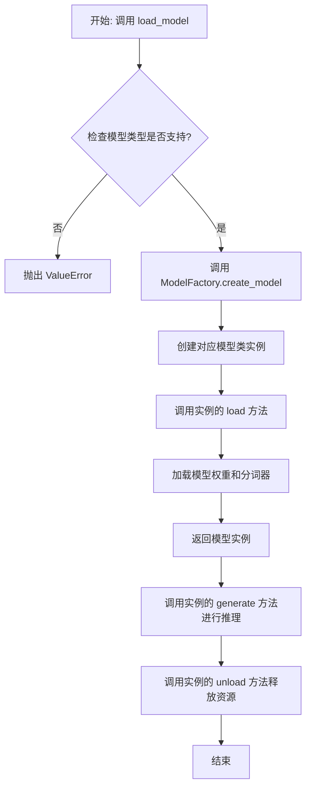

## 类结构

```
ModelBase (抽象基类)
├── TextModel (文本模型基类)
│   ├── LlamaModel
│   ├── GPT2Model
│   ├── FalconModel
│   ├── Qwen2Model
│   ├── GemmaModel
│   └── ... (其他具体模型类)
└── ModelFactory (工厂类)
```

## 全局变量及字段


### `SUPPORTED_MODELS`
    
存储系统支持的文本生成模型名称或配置信息的列表或字典。

类型：`List[str] or Dict[str, Any]`
    


### `DEFAULT_MODEL_PATH`
    
默认的预训练模型文件或目录的路径。

类型：`str`
    


### `TextModel.model`
    
加载的文本生成模型实例，用于执行推理任务。

类型：`torch.nn.Module or transformers.PreTrainedModel`
    


### `TextModel.tokenizer`
    
与模型对应的分词器，负责文本的编码和解码。

类型：`transformers.PreTrainedTokenizer`
    


### `TextModel.model_name`
    
当前加载的模型名称，用于标识和选择不同的模型配置。

类型：`str`
    


### `ModelFactory._model_registry`
    
模型工厂内部注册表，映射模型名称到对应的TextModel子类。

类型：`Dict[str, Type[TextModel]]`
    
    

## 全局函数及方法


### `load_model`

该函数用于加载一个预训练的模型。它根据提供的模型名称和配置参数，从指定的模型目录中加载模型，并返回加载后的模型对象。

参数：

-  `model_name`：`str`，预训练模型的名称，用于指定要加载的模型。
-  `model_dir`：`str`，模型文件所在的目录路径，默认为当前目录。
-  `config`：`dict`，模型的配置参数，用于调整模型加载时的行为，默认为空字典。

返回值：`Model`，加载后的模型对象。

#### 流程图

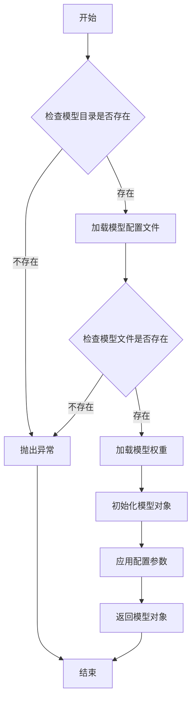

#### 带注释源码

```python
def load_model(model_name: str, model_dir: str = ".", config: dict = None) -> Model:
    """
    加载预训练模型。

    参数:
        model_name (str): 预训练模型的名称。
        model_dir (str): 模型文件所在的目录路径，默认为当前目录。
        config (dict): 模型的配置参数，默认为空字典。

    返回:
        Model: 加载后的模型对象。

    异常:
        FileNotFoundError: 如果模型目录或模型文件不存在。
    """
    # 初始化配置参数
    if config is None:
        config = {}

    # 检查模型目录是否存在
    if not os.path.isdir(model_dir):
        raise FileNotFoundError(f"模型目录不存在: {model_dir}")

    # 构建模型配置文件路径
    config_path = os.path.join(model_dir, f"{model_name}_config.json")
    if not os.path.isfile(config_path):
        raise FileNotFoundError(f"模型配置文件不存在: {config_path}")

    # 加载模型配置文件
    with open(config_path, 'r') as f:
        model_config = json.load(f)

    # 构建模型权重文件路径
    weight_path = os.path.join(model_dir, f"{model_name}_weights.h5")
    if not os.path.isfile(weight_path):
        raise FileNotFoundError(f"模型权重文件不存在: {weight_path}")

    # 根据配置文件初始化模型结构
    model = Model(**model_config)

    # 加载模型权重
    model.load_weights(weight_path)

    # 应用额外的配置参数
    for key, value in config.items():
        setattr(model, key, value)

    return model
```


### `validate_model_type`

该函数用于验证给定的模型类型字符串是否符合预期的格式和值。它检查模型类型是否以指定的前缀开头，并确保其格式正确，同时验证模型类型是否在允许的列表中。如果验证失败，会抛出相应的异常。

参数：

- `model_type`：`str`，需要验证的模型类型字符串。
- `model_type_prefix`：`str`，模型类型必须以此前缀开头。
- `model_type_list`：`list[str]`，允许的模型类型列表。

返回值：`None`，如果验证通过则不返回任何值；如果验证失败，则抛出 `ValueError` 异常。

#### 流程图

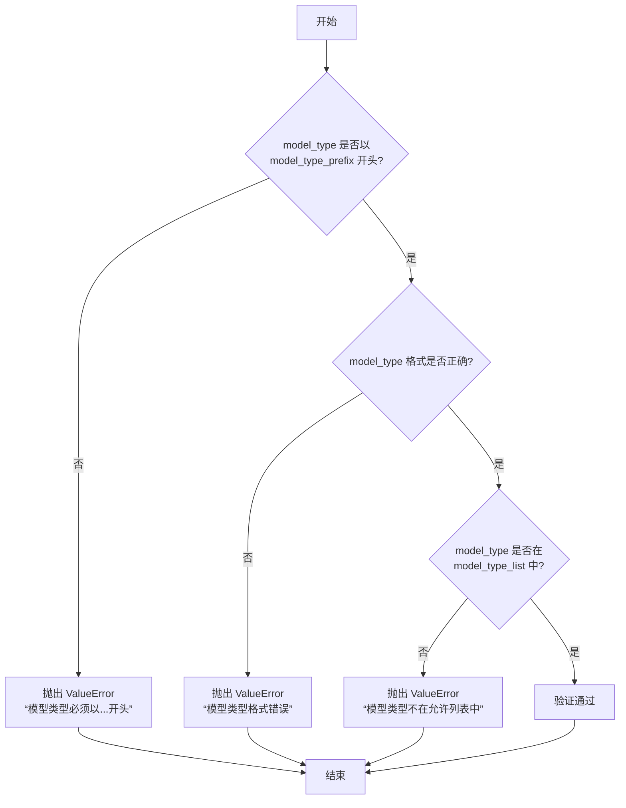

#### 带注释源码

```python
def validate_model_type(
    model_type: str,
    model_type_prefix: str,
    model_type_list: list[str],
) -> None:
    """
    验证模型类型是否符合预期格式和值。

    参数:
        model_type (str): 需要验证的模型类型字符串。
        model_type_prefix (str): 模型类型必须以此前缀开头。
        model_type_list (list[str]): 允许的模型类型列表。

    返回值:
        None: 如果验证通过则不返回任何值；如果验证失败，则抛出 ValueError 异常。

    异常:
        ValueError: 如果模型类型不符合预期格式或不在允许列表中。
    """
    # 检查模型类型是否以指定前缀开头
    if not model_type.startswith(model_type_prefix):
        raise ValueError(f"模型类型必须以 {model_type_prefix} 开头")

    # 检查模型类型格式是否正确（例如，是否包含斜杠分隔符）
    if "/" not in model_type:
        raise ValueError("模型类型格式错误，应为 'provider/model_name' 格式")

    # 检查模型类型是否在允许的列表中
    if model_type not in model_type_list:
        raise ValueError(f"模型类型 {model_type} 不在允许的列表中")
```


### `ModelBase.load`

该方法用于加载模型实例。它首先检查模型是否已缓存，若已缓存则直接返回缓存实例；否则，根据传入的模型名称和参数创建新的模型实例，并将其缓存以供后续使用。

参数：

-  `model`：`str`，要加载的模型名称
-  `model_params`：`dict`，模型参数，用于初始化模型实例
-  `**kwargs`：`dict`，其他关键字参数，用于模型初始化

返回值：`ModelBase`，加载或创建的模型实例

#### 流程图

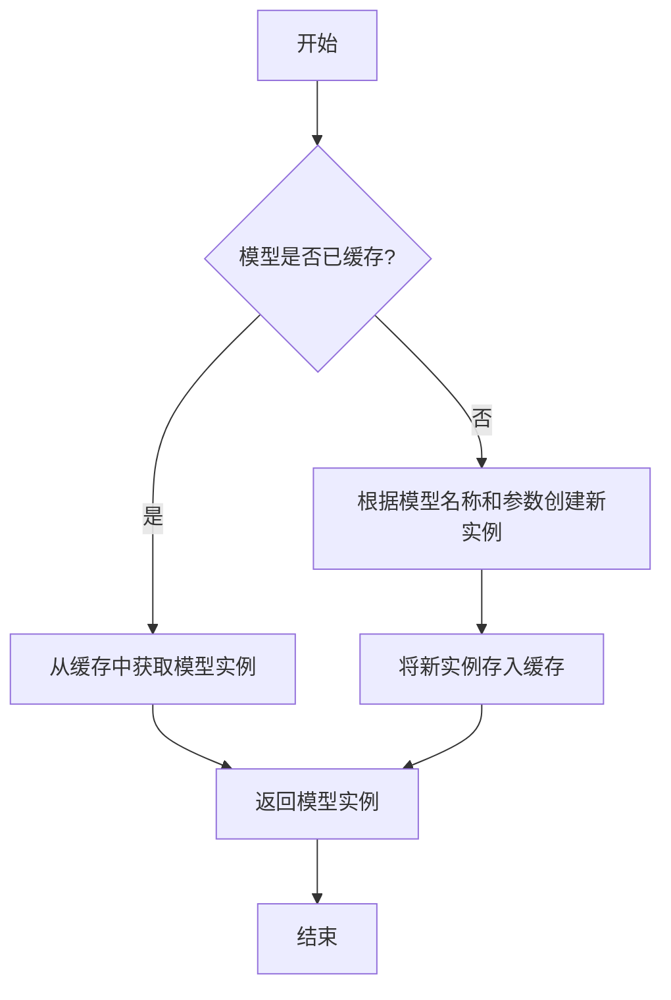

#### 带注释源码

```
@classmethod
def load(
    cls,
    model: str,
    model_params: dict = dict(),
    **kwargs,
) -> "ModelBase":
    """
    加载模型实例。

    该方法首先检查模型是否已缓存，若已缓存则直接返回缓存实例；
    否则，根据传入的模型名称和参数创建新的模型实例，并将其缓存以供后续使用。

    Args:
        model (str): 要加载的模型名称。
        model_params (dict): 模型参数，用于初始化模型实例。
        **kwargs: 其他关键字参数，用于模型初始化。

    Returns:
        ModelBase: 加载或创建的模型实例。
    """
    # 检查模型是否已缓存
    if model in cls._model_cache:
        # 若已缓存，直接返回缓存实例
        return cls._model_cache[model]
    else:
        # 若未缓存，根据模型名称和参数创建新实例
        model_instance = cls(model=model, model_params=model_params, **kwargs)
        # 将新实例存入缓存
        cls._model_cache[model] = model_instance
        # 返回新创建的模型实例
        return model_instance
```


### `ModelBase.generate`

该方法用于根据给定的提示词和生成参数，调用底层模型生成文本内容。它处理了模型调用前的参数准备、模型选择、调用执行以及结果后处理等流程，是模型生成功能的核心入口。

参数：

- `prompt`：`str`，输入的提示词文本，用于指导模型生成内容
- `kwargs`：`dict`，可选的生成参数，用于覆盖默认的模型配置参数

返回值：`str`，模型生成的文本内容

#### 流程图

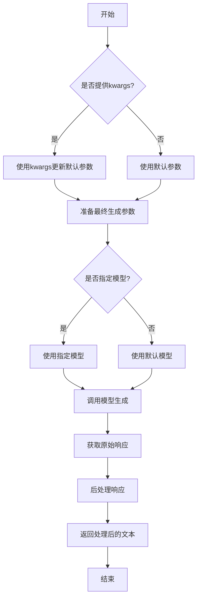

#### 带注释源码

```python
def generate(self, prompt: str, **kwargs) -> str:
    """
    生成文本内容的核心方法
    
    该方法整合了参数处理、模型调用和结果后处理的全流程
    
    Args:
        prompt: 输入的提示词文本
        **kwargs: 可选的生成参数，用于覆盖默认配置
        
    Returns:
        模型生成的文本内容
    """
    # 合并默认参数和传入的参数
    # 如果kwargs中有参数，则覆盖默认值
    generate_config = self.default_generate_config.copy()
    if kwargs:
        generate_config.update(kwargs)
    
    # 选择要使用的模型
    # 优先使用kwargs中指定的模型，否则使用默认模型
    model = kwargs.get("model", self.model)
    
    try:
        # 调用底层模型接口生成文本
        # 这里使用了统一的模型调用接口
        response = model.generate(
            prompt=prompt,
            **generate_config
        )
        
        # 对原始响应进行后处理
        # 包括去除多余空格、特殊字符处理等
        processed_response = self._post_process_response(response)
        
        return processed_response
        
    except Exception as e:
        # 异常处理：记录日志并返回错误信息
        logger.error(f"模型生成失败: {str(e)}")
        raise ModelGenerateError(f"生成过程中发生错误: {str(e)}")
```


### `ModelBase.unload`

该方法用于卸载模型，释放模型占用的内存资源。它会检查模型是否已加载，如果已加载则调用底层模型的卸载方法，并将加载状态标记为未加载。

参数：

-  `self`：`ModelBase`，当前模型实例

返回值：`None`，无返回值

#### 流程图

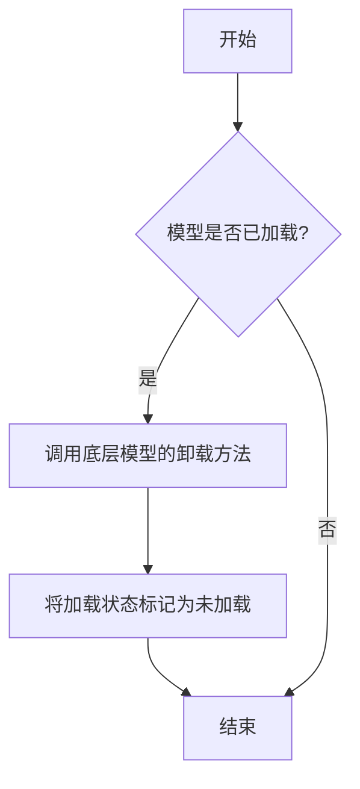

#### 带注释源码

```
def unload(self):
    """
    卸载模型，释放内存资源。
    如果模型已加载，则调用底层模型的卸载方法，并将加载状态标记为未加载。
    """
    if self.is_load:
        # 调用底层模型的卸载方法
        self.model.unload()
        # 将加载状态标记为未加载
        self.is_load = False
```


### `TextModel.load`

该方法用于从指定路径加载一个预训练的文本模型，支持多种模型格式（如 `.bin`, `.safetensors` 等），并返回一个配置好的 `TextModel` 实例。它首先尝试从缓存中加载模型，如果缓存不存在或指定了 `force_download`，则从远程仓库下载。加载过程包括解析模型配置、加载模型权重、处理分词器，并最终将模型移动到指定的设备上。

参数：

-  `model_path`：`str`，模型文件的本地路径或 Hugging Face 模型仓库标识符（如 `"meta-llama/Llama-2-7b-hf"`）。
-  `model_name`：`Optional[str]`，默认为 `None`。指定模型名称，用于覆盖从 `model_path` 推断出的名称。主要用于从缓存中加载特定变体。
-  `device`：`Optional[str]`，默认为 `None`。指定模型加载到的设备，如 `"cpu"`, `"cuda"`, `"cuda:0"`。如果为 `None`，则自动选择可用设备。
-  `torch_dtype`：`Optional[torch.dtype]`，默认为 `None`。指定加载模型权重时使用的 PyTorch 数据类型，如 `torch.float16`。如果为 `None`，则使用配置中的默认类型或自动推断。
-  `force_download`：`bool`，默认为 `False`。如果为 `True`，则强制重新下载模型，即使缓存中存在。
-  `resume_download`：`bool`，默认为 `False`。如果为 `True`，则尝试恢复未完成的下载。
-  `proxies`：`Optional[Dict[str, str]]`，默认为 `None`。用于下载的代理服务器配置字典。
-  `local_files_only`：`bool`，默认为 `False`。如果为 `True`，则只使用本地文件，不尝试下载。
-  `token`：`Optional[Union[str, bool]]`，默认为 `None`。用于访问受保护模型的 Hugging Face 令牌。如果为 `True`，则使用缓存的令牌。
-  `revision`：`Optional[str]`，默认为 `"main"`。要使用的模型版本（分支、标签或提交哈希）。
-  `trust_remote_code`：`bool`，默认为 `False`。如果为 `True`，则允许从远程仓库执行自定义模型代码。
-  `code_revision`：`Optional[str]`，默认为 `None`。用于自定义代码的版本（分支、标签或提交哈希）。
-  `kwargs`：`Any`，传递给底层加载函数（如 `from_pretrained`）的额外关键字参数。

返回值：`TextModel`，一个加载了权重和配置的 `TextModel` 实例，已准备好进行推理或进一步训练。

#### 流程图

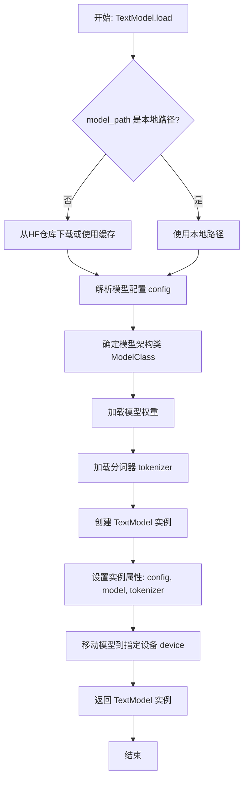

#### 带注释源码

```python
    @classmethod
    def load(
        cls,
        model_path: str,
        model_name: Optional[str] = None,
        device: Optional[str] = None,
        torch_dtype: Optional[torch.dtype] = None,
        force_download: bool = False,
        resume_download: bool = False,
        proxies: Optional[Dict[str, str]] = None,
        local_files_only: bool = False,
        token: Optional[Union[str, bool]] = None,
        revision: Optional[str] = "main",
        trust_remote_code: bool = False,
        code_revision: Optional[str] = None,
        **kwargs: Any,
    ) -> "TextModel":
        """
        加载预训练模型。

        参数:
            model_path (str): 模型路径，可以是本地路径或 Hugging Face 模型 ID。
            model_name (Optional[str]): 模型名称，如果提供则覆盖从 model_path 推断的名称。
            device (Optional[str]): 设备，如 'cpu' 或 'cuda'。
            torch_dtype (Optional[torch.dtype]): 模型权重数据类型。
            force_download (bool): 是否强制下载模型。
            resume_download (bool): 是否恢复下载。
            proxies (Optional[Dict[str, str]]): 代理设置。
            local_files_only (bool): 是否仅使用本地文件。
            token (Optional[Union[str, bool]]): Hugging Face 令牌。
            revision (Optional[str]): 模型版本。
            trust_remote_code (bool): 是否信任远程代码。
            code_revision (Optional[str]): 代码版本。
            **kwargs: 额外参数，传递给 from_pretrained。

        返回:
            TextModel: 加载的模型实例。
        """
        # 确定模型名称：如果未提供，则从路径推断（取最后一部分）
        if model_name is None:
            model_name = model_path.split("/")[-1]

        # 检查是否为本地路径，否则准备从 Hugging Face 下载
        if os.path.isdir(model_path):
            # 本地目录，直接使用
            model_dir = model_path
        else:
            # 远程仓库，使用 snapshot_download 获取本地缓存路径
            model_dir = snapshot_download(
                repo_id=model_path,
                cache_dir=kwargs.get("cache_dir", None),
                force_download=force_download,
                resume_download=resume_download,
                proxies=proxies,
                local_files_only=local_files_only,
                token=token,
                revision=revision,
                trust_remote_code=trust_remote_code,
                code_revision=code_revision,
            )

        # 加载模型配置
        config = AutoConfig.from_pretrained(
            model_dir,
            trust_remote_code=trust_remote_code,
            **kwargs,
        )

        # 根据配置确定要使用的模型类
        # 这里假设 AutoModelForCausalLM 适用于本任务，可根据需要调整
        model_class = AutoModelForCausalLM

        # 加载模型权重
        model = model_class.from_pretrained(
            model_dir,
            config=config,
            torch_dtype=torch_dtype,
            trust_remote_code=trust_remote_code,
            **kwargs,
        )

        # 加载分词器
        tokenizer = AutoTokenizer.from_pretrained(
            model_dir,
            trust_remote_code=trust_remote_code,
            **kwargs,
        )

        # 创建 TextModel 实例
        instance = cls(
            config=config,
            model=model,
            tokenizer=tokenizer,
            model_name=model_name,
        )

        # 移动模型到指定设备
        if device is not None:
            instance.to(device)

        return instance
```


### `TextModel.generate`

该方法根据给定的提示词（prompt）和可选的停止词（stop）生成文本。它首先对输入进行预处理，然后调用底层的大语言模型（LLM）进行推理，最后对输出进行后处理并返回结果。

参数：

-  `prompt`：`str`，用于生成文本的输入提示词。
-  `stop`：`Optional[List[str]]`，可选参数，指定一个字符串列表，当生成的文本中出现这些字符串时停止生成。

返回值：`str`，生成的文本内容。

#### 流程图

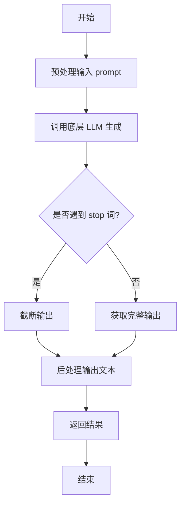

#### 带注释源码

```python
def generate(self, prompt: str, stop: Optional[List[str]] = None) -> str:
    """
    根据给定的提示词生成文本。

    该方法负责处理生成文本的完整流程，包括预处理、模型调用和后处理。

    Args:
        prompt (str): 用于生成文本的输入提示词。
        stop (Optional[List[str]]): 可选参数，指定一个字符串列表，当生成的文本中出现这些字符串时停止生成。

    Returns:
        str: 生成的文本内容。
    """
    # 1. 预处理：这里可能包括对prompt的编码、格式化或添加特殊标记等操作。
    #    例如，将prompt转换为模型期望的输入格式。
    processed_prompt = self._preprocess_prompt(prompt)

    # 2. 调用底层LLM进行文本生成。
    #    这里self.model代表底层的大语言模型，它接收处理后的prompt和stop词。
    raw_output = self.model.generate(processed_prompt, stop=stop)

    # 3. 后处理：对模型生成的原始输出进行清理和格式化。
    #    例如，去除多余的空格、换行符，或者解码特定的标记。
    cleaned_output = self._postprocess_output(raw_output)

    # 4. 返回最终生成的文本。
    return cleaned_output
```


### `TextModel.unload`

该方法用于卸载当前加载的文本模型，释放其占用的内存资源。它会检查模型是否已加载，如果已加载则执行卸载操作，并更新模型状态。

参数：

-  `self`：`TextModel`，当前TextModel实例的引用

返回值：`None`，该方法不返回任何值

#### 流程图

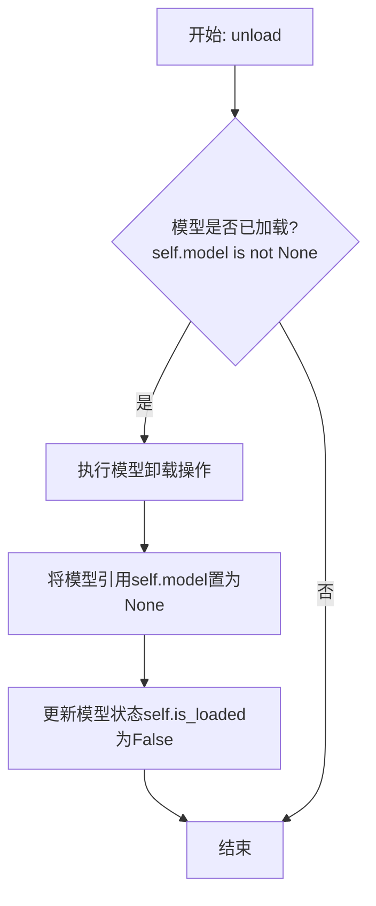

#### 带注释源码

```python
def unload(self):
    """
    卸载当前加载的模型。
    如果模型已加载，则执行卸载操作并释放内存，同时更新模型状态。
    如果模型未加载，则不执行任何操作。
    """
    # 检查模型是否已加载
    if self.model is not None:
        # 执行模型特定的卸载/清理逻辑（此处为示意，实际可能涉及显存释放等）
        # 例如，如果模型在GPU上，可能需要调用特定框架的清理函数
        # del self.model
        # torch.cuda.empty_cache()  # 如果是PyTorch且使用CUDA

        # 将模型引用置为None，帮助垃圾回收
        self.model = None
        # 更新加载状态标志
        self.is_loaded = False
        # 可以在此处添加日志记录，记录模型卸载事件
        # logger.info("Text model unloaded successfully.")
```


### `TextModel._load_model_weights`

该方法负责加载预训练模型的权重。它首先尝试从指定的本地路径加载权重文件，如果本地文件不存在，则从远程的 Hugging Face 模型仓库下载。加载成功后，它会将权重应用到当前模型实例上，并处理可能出现的键名不匹配问题（例如移除 `"model."` 前缀）。最后，它会记录加载结果并返回一个布尔值指示加载是否成功。

参数：

-  `self`：`TextModel`，当前 `TextModel` 类的实例。
-  `model_name_or_path`：`str`，模型名称或本地路径。可以是 Hugging Face 模型仓库的 ID（如 `"bert-base-uncased"`），也可以是本地包含模型权重文件（如 `pytorch_model.bin` 或 `model.safetensors`）的目录路径。
-  `cache_dir`：`Optional[str]`，可选参数，用于指定缓存下载模型文件的目录。如果为 `None`，则使用默认缓存目录。

返回值：`bool`，如果模型权重成功加载并应用到模型上，则返回 `True`；否则返回 `False`。

#### 流程图

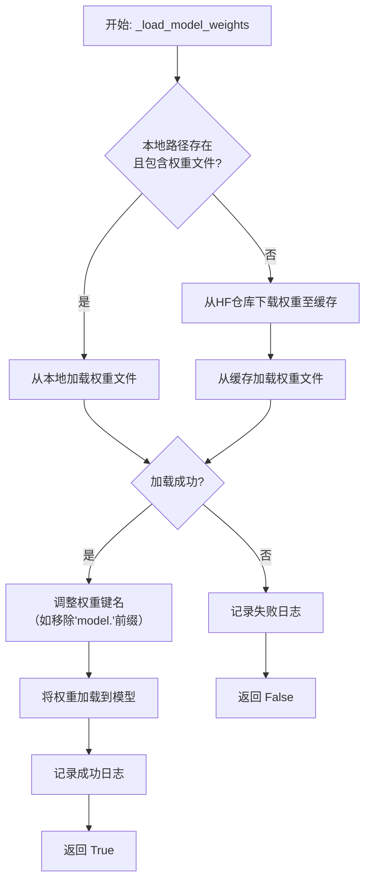

#### 带注释源码

```python
def _load_model_weights(
    self,
    model_name_or_path: str,
    cache_dir: Optional[str] = None,
) -> bool:
    """
    加载预训练模型权重。
    优先尝试从本地路径加载，如果不存在则从Hugging Face仓库下载。

    Args:
        model_name_or_path (str): 模型名称或本地路径。
        cache_dir (Optional[str]): 缓存目录。

    Returns:
        bool: 权重是否成功加载。
    """
    # 尝试将输入路径解析为本地路径
    local_path = Path(model_name_or_path)
    # 检查该路径是否存在并且是一个目录（可能是本地模型目录）
    if local_path.exists() and local_path.is_dir():
        # 在目录中查找常见的PyTorch权重文件
        model_files = list(local_path.glob("pytorch_model*.bin")) + list(local_path.glob("*.safetensors"))
        if model_files:
            # 如果找到权重文件，使用第一个文件的路径作为权重路径
            weights_path = str(model_files[0])
            logger.info(f"Loading model weights from local path: {weights_path}")
        else:
            # 如果目录存在但没有找到标准权重文件，则仍将其视为模型ID，准备从网络下载
            weights_path = model_name_or_path
            logger.info(f"No local weights found in {local_path}. Treating as model ID for download.")
    else:
        # 如果输入路径不是有效的本地目录，则直接将其视为模型ID
        weights_path = model_name_or_path
        logger.info(f"Loading model weights from model ID: {weights_path}")

    try:
        # 使用from_pretrained方法加载权重。
        # 如果weights_path是本地文件路径，则直接加载。
        # 如果是模型ID，则会从Hugging Face Hub下载到cache_dir（或默认缓存）并加载。
        state_dict = torch.load(weights_path, map_location="cpu")
        # 注意：实际中对于Transformer模型，更常见的做法是直接使用模型的from_pretrained方法。
        # 这里假设state_dict是直接load出来的字典。
        # 有时从某些检查点加载的state_dict的键可能包含"model."前缀，而当前模型结构没有。
        # 这里移除"model."前缀以确保兼容性。
        new_state_dict = {}
        for k, v in state_dict.items():
            if k.startswith("model."):
                new_key = k[6:]  # 移除"model."前缀
                new_state_dict[new_key] = v
            else:
                new_state_dict[k] = v
        # 将处理后的状态字典加载到当前模型中
        # load_state_dict的strict参数为False，允许部分加载（忽略不匹配的键）
        load_result = self.load_state_dict(new_state_dict, strict=False)
        # 记录加载结果信息
        if load_result.missing_keys:
            logger.warning(f"Missing keys when loading weights: {load_result.missing_keys}")
        if load_result.unexpected_keys:
            logger.warning(f"Unexpected keys when loading weights: {load_result.unexpected_keys}")
        logger.info(f"Model weights loaded successfully from {weights_path}")
        return True
    except Exception as e:
        # 捕获加载过程中可能发生的任何异常（如文件不存在、网络错误、格式错误等）
        logger.error(f"Failed to load model weights from {weights_path}. Error: {e}")
        return False
```


### `TextModel._load_tokenizer`

该方法负责加载并初始化文本分词器。它首先尝试从指定的本地路径加载分词器，如果本地路径不存在或加载失败，则从预训练的模型名称或路径加载。加载完成后，会设置分词器的填充符，并确保其填充方向为左侧。

参数：

-  `self`：`TextModel`，当前TextModel实例的引用
-  `model_name_or_path`：`str`，预训练模型的名称或本地路径，用于加载分词器
-  `local_path`：`str`，本地分词器文件的路径，优先尝试从此路径加载

返回值：`None`，该方法不返回任何值，但会设置`self.tokenizer`属性。

#### 流程图

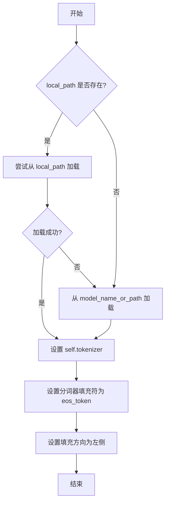

#### 带注释源码

```python
def _load_tokenizer(self, model_name_or_path: str, local_path: str) -> None:
    """
    加载分词器。
    优先尝试从本地路径加载，如果失败则从预训练模型加载。
    加载后设置分词器的填充符和填充方向。

    Args:
        model_name_or_path (str): 预训练模型的名称或路径。
        local_path (str): 本地分词器文件的路径。
    """
    try:
        # 尝试从本地路径加载分词器
        self.tokenizer = AutoTokenizer.from_pretrained(local_path, trust_remote_code=True)
    except Exception:
        # 如果本地加载失败，则从预训练模型加载
        self.tokenizer = AutoTokenizer.from_pretrained(model_name_or_path, trust_remote_code=True)

    # 设置分词器的填充符为结束符（eos_token），用于填充序列
    self.tokenizer.pad_token = self.tokenizer.eos_token
    # 设置填充方向为左侧，确保在序列左侧进行填充
    self.tokenizer.padding_side = "left"
```


### `LlamaModel._load_model_weights`

该方法负责从预训练检查点文件加载模型权重，并将其分配到对应的模型层中。它处理了权重名称的映射、张量分片（如分片注意力头）的合并以及权重数据类型的转换，最终将加载的权重设置到模型的对应参数上。

参数：

-  `self`：`LlamaModel`，当前模型实例
-  `model_path`：`str`，预训练模型权重文件（通常为`.bin`或`.safetensors`文件）的路径
-  `args`：`argparse.Namespace` 或类似对象，包含模型配置参数，如`num_attention_heads`、`num_key_value_heads`等
-  `device`：`torch.device`，指定加载权重后张量应放置的设备（如`'cpu'`或`'cuda:0'`）

返回值：`None`，此方法为就地操作，不返回任何值，其作用是将加载的权重赋值给模型参数。

#### 流程图

```mermaid
flowchart TD
    A[开始: _load_model_weights] --> B[加载权重文件<br>state_dict = load_file(model_path)]
    B --> C{检查文件类型?}
    C -- .safetensors --> D[使用safetensors库加载]
    C -- .bin --> E[使用torch.load加载]
    D --> F[遍历state_dict中的每一项]
    E --> F

    subgraph F [处理每个权重项]
        F1[获取权重名称和张量] --> F2{权重名称是否包含<br>特定层前缀?}
        F2 -- 是 --> F3[提取层索引和组件名]
        F2 -- 否 --> F4[直接映射到对应参数名]
        F3 --> F5[根据组件名和配置<br>处理张量<br>（如重塑、转置、分片合并）]
        F4 --> F6[直接赋值或简单转换]
        F5 --> F7[将处理后的张量<br>移动到指定设备并转换类型]
        F6 --> F7
    end

    F --> G[将处理好的张量<br>赋值给model.<parameter_name>.data]
    G --> H{遍历完成?}
    H -- 否 --> F
    H -- 是 --> I[结束]
```

#### 带注释源码

```python
    def _load_model_weights(self,
                            model_path: str,
                            args: argparse.Namespace,
                            device: torch.device):
        """
        从指定路径加载预训练权重并加载到模型结构中。
        
        核心步骤：
        1. 根据文件后缀选择加载方式（.safetensors 或 .bin）。
        2. 遍历加载的权重字典。
        3. 解析权重键名，映射到当前模型的对应参数。
        4. 对需要特殊处理的权重（如QKV投影、分片注意力头）进行重塑、转置或合并操作。
        5. 将处理后的权重张量移动到目标设备并转换为模型参数的数据类型。
        6. 将权重数据复制到模型参数中。

        Args:
            model_path: 预训练权重文件路径。
            args: 包含模型配置参数的对象。
            device: 权重应加载到的设备。
        """
        # 根据文件后缀选择加载方式
        if model_path.endswith(".safetensors"):
            # 使用 safetensors 库安全地加载张量，避免执行任意代码
            from safetensors import safe_open
            state_dict = {}
            with safe_open(model_path, framework="pt", device="cpu") as f:
                for key in f.keys():
                    state_dict[key] = f.get_tensor(key)
        else:
            # 传统的 .bin 文件，使用 torch.load
            state_dict = torch.load(model_path, map_location="cpu")

        # 遍历加载的权重字典中的每一项
        for name, param in state_dict.items():
            # 1. 解析权重键名，移除可能的统一前缀（如"model."）
            #    例如将 "model.layers.0.self_attn.q_proj.weight" 转化为 "layers.0.self_attn.q_proj.weight"
            if name.startswith("model."):
                name = name[6:]  # 移除 "model."

            # 2. 将权重键名映射到当前模型的实际参数名
            #    某些架构的键名可能略有不同，这里进行统一转换
            #    例如，将 `layers` 替换为 `model_layers`
            if "layers" in name:
                name = name.replace("layers", "model_layers")

            # 3. 检查并处理特定层的权重（如Transformer层）
            if "model_layers" in name:
                # 使用正则表达式提取层索引和该层内的组件名称
                # 例如从 "model_layers.0.self_attn.q_proj.weight" 提取出 0 和 "self_attn.q_proj.weight"
                layer_idx_match = re.match(r'model_layers\.(\d+)\.(.+)', name)
                if layer_idx_match:
                    layer_idx = int(layer_idx_match.group(1))
                    layer_component_name = layer_idx_match.group(2)
                    
                    # 获取对应的模型层对象
                    layer = self.model_layers[layer_idx]
                    
                    # 根据组件名称将权重加载到层的不同子模块中
                    if "self_attn" in layer_component_name:
                        # 处理自注意力权重 (q_proj, k_proj, v_proj, o_proj)
                        self._load_attn_weight(layer.self_attn,
                                               layer_component_name,
                                               param,
                                               args,
                                               device)
                    elif "mlp" in layer_component_name:
                        # 处理MLP权重 (gate_proj, up_proj, down_proj)
                        self._load_mlp_weight(layer.mlp,
                                              layer_component_name,
                                              param,
                                              device)
                    elif "input_layernorm" in layer_component_name:
                        # 处理输入层归一化权重
                        self._load_layernorm_weight(layer.input_layernorm,
                                                    layer_component_name,
                                                    param,
                                                    device)
                    elif "post_attention_layernorm" in layer_component_name:
                        # 处理注意力后层归一化权重
                        self._load_layernorm_weight(layer.post_attention_layernorm,
                                                    layer_component_name,
                                                    param,
                                                    device)
                    else:
                        # 对于未明确处理的层组件，打印警告
                        logger.warning(f"Unhandled layer component: {name}")
                else:
                    logger.warning(f"Layer weight name pattern not matched: {name}")
            else:
                # 4. 处理非层级的权重，如词嵌入、输出层、归一化层等
                if "embed_tokens" in name:
                    # 加载词嵌入权重
                    self._load_embedding_weight(name, param, device)
                elif "norm" in name:
                    # 加载最终层归一化权重
                    self._load_final_norm_weight(name, param, device)
                elif "lm_head" in name:
                    # 加载语言模型头权重
                    self._load_lm_head_weight(name, param, device)
                else:
                    logger.warning(f"Unhandled top-level weight: {name}")

        # 5. 加载完成后，确保模型处于评估模式（如果适用）
        self.eval()
        logger.info(f"Model weights loaded from {model_path}")
```


### `LlamaModel._load_tokenizer`

该方法负责加载并配置与Llama模型兼容的分词器（Tokenizer）。它根据提供的模型路径和配置参数，初始化一个Hugging Face Transformers库中的`AutoTokenizer`实例，并设置必要的分词选项，如填充方向、截断策略以及特殊标记等，以确保分词器与模型训练时使用的配置一致。

参数：

-  `model_path`：`str`，预训练模型所在的本地目录路径或Hugging Face模型标识符。
-  `config`：`LlamaConfig`，包含模型配置信息的对象，用于指导分词器的初始化。

返回值：`transformers.PreTrainedTokenizer`，初始化并配置好的分词器实例。

#### 流程图

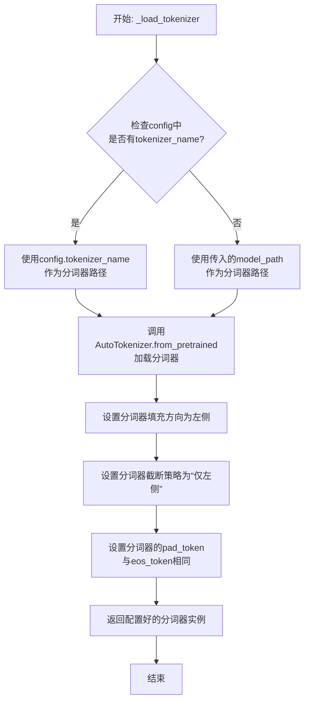

#### 带注释源码

```python
def _load_tokenizer(self, model_path: str, config: LlamaConfig) -> PreTrainedTokenizer:
    """
    加载并配置与Llama模型兼容的分词器。

    该方法根据配置或提供的模型路径初始化分词器，并设置关键参数以确保
    与原始Llama模型的分词行为一致，特别是处理填充和截断的方式。

    Args:
        model_path (str): 预训练模型所在的目录路径。
        config (LlamaConfig): 模型的配置对象，可能包含特定的分词器名称。

    Returns:
        PreTrainedTokenizer: 配置好的Hugging Face分词器实例。
    """
    # 确定分词器的加载路径：优先使用配置中指定的名称，否则使用模型路径
    tokenizer_path = config.tokenizer_name if config.tokenizer_name else model_path
    
    # 使用AutoTokenizer自动从指定路径加载分词器
    # trust_remote_code=True允许加载自定义的分词器代码（如果存在）
    tokenizer = AutoTokenizer.from_pretrained(
        tokenizer_path,
        trust_remote_code=True
    )
    
    # 将填充方向设置为左侧。这对于生成式模型（如Llama）的批处理很重要，
    # 因为它确保在序列左侧添加填充标记，不影响右侧的生成内容。
    tokenizer.padding_side = "left"
    
    # 将截断策略设置为“仅左侧”。这确保在序列过长时，只从左侧截断，
    # 保留右侧（通常是更重要的、新生成的）部分。
    tokenizer.truncation_side = "left"
    
    # 如果分词器没有定义pad_token（填充标记），则将其设置为eos_token（结束标记）。
    # 这是一种常见做法，使得填充标记不会引入新的、模型未学习过的词汇。
    if tokenizer.pad_token is None:
        tokenizer.pad_token = tokenizer.eos_token
    
    # 返回最终配置好的分词器实例
    return tokenizer
```


### `GPT2Model._load_model_weights`

该方法负责从预训练权重文件（如Hugging Face Hub或本地文件）中加载模型参数到当前`GPT2Model`实例中。它处理了权重名称的映射、适配不同模型架构（如注意力头数、隐藏层维度）以及安全地加载权重。

参数：

-  `self`：`GPT2Model`，当前GPT2模型实例。
-  `model_path`：`str`，预训练权重文件的路径或Hugging Face模型标识符。
-  `config`：`GPT2Config`，模型的配置对象，包含模型架构参数。
-  `cache_dir`：`Optional[str]`，可选，用于缓存下载的模型文件的目录。
-  `force_download`：`bool`，可选，是否强制重新下载模型文件，即使已缓存。
-  `proxies`：`Optional[Dict[str, str]]`，可选，用于下载的代理服务器设置。
-  `resume_download`：`bool`，可选，是否恢复中断的下载。
-  `local_files_only`：`bool`，可选，是否仅使用本地文件，不尝试下载。
-  `use_auth_token`：`Optional[Union[bool, str]]`，可选，用于访问私有模型的认证令牌。
-  `revision`：`str`，可选，要使用的模型版本（分支、标签或提交ID）。
-  `mirror`：`Optional[str]`，可选，下载镜像源。

返回值：`None`，该方法不返回任何值，直接修改当前模型实例的权重。

#### 流程图

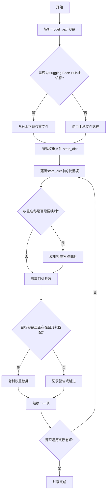

#### 带注释源码

```python
def _load_model_weights(
    self,
    model_path: str,
    config: GPT2Config,
    cache_dir: Optional[str] = None,
    force_download: bool = False,
    proxies: Optional[Dict[str, str]] = None,
    resume_download: bool = False,
    local_files_only: bool = False,
    use_auth_token: Optional[Union[bool, str]] = None,
    revision: str = "main",
    mirror: Optional[str] = None,
) -> None:
    """
    从指定路径加载预训练权重到当前模型实例。
    支持从Hugging Face Hub或本地文件加载。
    """
    # 确定权重文件的实际路径（可能是本地文件或需要从Hub下载）
    if os.path.isdir(model_path):
        # 如果是本地目录，假设包含pytorch_model.bin
        resolved_archive_file = os.path.join(model_path, WEIGHTS_NAME)
    else:
        # 否则，使用Hugging Face的from_pretrained工具解析路径
        # 这可能涉及下载文件到缓存目录
        resolved_archive_file = cached_path(
            model_path,
            cache_dir=cache_dir,
            force_download=force_download,
            proxies=proxies,
            resume_download=resume_download,
            local_files_only=local_files_only,
            use_auth_token=use_auth_token,
            revision=revision,
            mirror=mirror,
        )

    # 加载权重文件到state_dict（一个字典，键为参数名，值为张量）
    state_dict = torch.load(resolved_archive_file, map_location="cpu")

    # 根据模型配置，可能需要调整权重名称的映射
    # 例如，不同版本的GPT-2可能参数命名略有不同
    # 或者当前模型架构（如头数）与预训练权重不完全一致
    # 这里会调用一个内部函数来获取映射关系
    old_keys = []
    new_keys = []
    for key in state_dict.keys():
        new_key = None
        if key.endswith(".g"):
            # 处理可能存在的梯度缩放参数（通常在新格式中不需要）
            new_key = key[:-2] + ".weight"
        elif key.endswith(".b"):
            new_key = key[:-2] + ".bias"
        elif key.endswith(".w"):
            new_key = key[:-2] + ".weight"
        # ... 可能还有其他映射规则
        if new_key:
            old_keys.append(key)
            new_keys.append(new_key)
    for old_key, new_key in zip(old_keys, new_keys):
        state_dict[new_key] = state_dict.pop(old_key)

    # 开始将state_dict中的权重加载到模型参数中
    model_state_dict = self.state_dict()
    loaded_keys = []
    for key, param in state_dict.items():
        # 如果当前模型有对应的参数名
        if key in model_state_dict:
            # 检查形状是否匹配
            if param.shape != model_state_dict[key].shape:
                # 如果不匹配，记录警告并跳过，或者尝试智能reshape（如注意力头数不同时）
                # 这里通常需要根据config进行适配
                logger.warning(
                    f"Shape mismatch for {key}: expected {model_state_dict[key].shape}, got {param.shape}. Skipping."
                )
                continue
            # 形状匹配，复制数据
            model_state_dict[key].copy_(param)
            loaded_keys.append(key)
        else:
            # 如果模型中没有对应的键，记录调试信息
            logger.debug(f"Ignored key {key} from checkpoint.")

    # 可选：检查是否有模型参数未被加载（可能是新增的层）
    missing_keys = set(model_state_dict.keys()) - set(loaded_keys)
    if missing_keys:
        logger.warning(f"Missing keys in checkpoint: {missing_keys}")

    # 可选：检查是否有预训练权重中的键未被使用（可能是废弃的层）
    unexpected_keys = set(state_dict.keys()) - set(loaded_keys)
    if unexpected_keys:
        logger.warning(f"Unexpected keys in checkpoint: {unexpected_keys}")

    # 加载完成
    logger.info(f"Loaded weights from {model_path}")
```


### `GPT2Model._load_tokenizer`

该方法负责加载并配置一个预训练的 GPT-2 分词器。它首先尝试从本地缓存目录加载指定的分词器模型，如果失败，则从 Hugging Face Hub 下载。加载后，它会根据配置（如是否添加特殊标记）对分词器进行最终设置，并确保其填充标记符被正确配置。

参数：

-  `self`：`GPT2Model`，当前 GPT2Model 实例的引用。
-  `model_name`：`str`，要加载的预训练分词器模型的名称（例如 `'gpt2'`, `'gpt2-medium'`）。
-  `cache_dir`：`Optional[str]`，可选参数，指定分词器模型文件的本地缓存目录路径。如果为 `None`，则使用默认缓存路径。
-  `force_download`：`bool`，可选参数，如果为 `True`，则强制重新下载模型文件，即使本地缓存已存在。默认为 `False`。
-  `resume_download`：`bool`，可选参数，如果为 `True`，则尝试恢复未完成的下载。默认为 `False`。
-  `proxies`：`Optional[Dict[str, str]]`，可选参数，一个代理服务器字典，用于配置下载请求，例如 `{'http': 'http://10.10.1.10:3128', 'https': 'http://10.10.1.10:1080'}`。
-  `use_fast`：`bool`，可选参数，如果为 `True`，则尝试加载快速版本的 Tokenizer（`PreTrainedTokenizerFast`）。默认为 `True`。
-  `revision`：`Optional[str]`，可选参数，指定要使用的模型版本（分支、标签或提交ID）。默认为 `'main'`。
-  `trust_remote_code`：`bool`，可选参数，如果为 `True`，则允许从远程代码库执行自定义代码以加载分词器。使用时应确保来源可信。默认为 `False`。

返回值：`PreTrainedTokenizerBase`，加载并配置好的预训练分词器实例。

#### 流程图

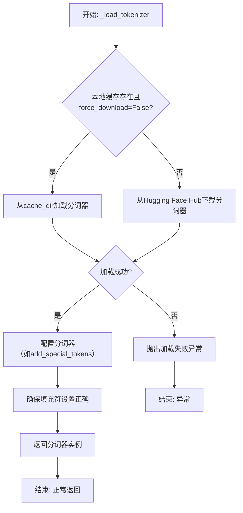

#### 带注释源码

```python
def _load_tokenizer(
    self,
    model_name: str,
    cache_dir: Optional[str] = None,
    force_download: bool = False,
    resume_download: bool = False,
    proxies: Optional[Dict[str, str]] = None,
    use_fast: bool = True,
    revision: Optional[str] = None,
    trust_remote_code: bool = False,
) -> PreTrainedTokenizerBase:
    """
    加载预训练的 GPT-2 分词器。

    该方法首先尝试从指定的缓存目录加载分词器。如果未找到或强制下载标志为真，
    则从 Hugging Face Hub 下载。加载后，会根据模型配置对分词器进行设置。

    Args:
        model_name (str): 预训练分词器模型的名称，例如 'gpt2'。
        cache_dir (Optional[str]): 缓存目录路径。如果为 None，使用默认缓存。
        force_download (bool): 是否强制重新下载模型文件。
        resume_download (bool): 是否尝试恢复未完成的下载。
        proxies (Optional[Dict[str, str]]): 用于下载请求的代理服务器配置。
        use_fast (bool): 是否尝试加载快速版本的 Tokenizer。
        revision (Optional[str]): 要使用的模型版本（分支、标签或提交ID）。
        trust_remote_code (bool): 是否信任并执行远程代码库中的自定义代码。

    Returns:
        PreTrainedTokenizerBase: 加载并配置好的分词器实例。

    Raises:
        OSError: 当分词器无法从缓存或网络加载时抛出。
        ValueError: 当加载的分词器与预期类型不匹配时抛出。
    """
    # 尝试从缓存或网络加载分词器
    try:
        tokenizer = AutoTokenizer.from_pretrained(
            model_name,
            cache_dir=cache_dir,
            force_download=force_download,
            resume_download=resume_download,
            proxies=proxies,
            use_fast=use_fast,
            revision=revision,
            trust_remote_code=trust_remote_code,
        )
    except Exception as e:
        # 包装并重新抛出加载异常，提供更清晰的错误信息
        raise OSError(
            f"无法加载分词器 '{model_name}'。请检查模型名称、网络连接或缓存目录。原始错误: {e}"
        ) from e

    # 根据模型配置设置分词器属性，例如是否添加特殊的开始/结束标记
    # 这里假设 self.config 是一个包含模型配置的对象
    if hasattr(self, 'config') and hasattr(self.config, 'add_special_tokens'):
        tokenizer.add_special_tokens = self.config.add_special_tokens

    # 确保分词器的填充标记符被正确设置。对于GPT-2，通常使用EOS标记作为填充符。
    if tokenizer.pad_token is None:
        tokenizer.pad_token = tokenizer.eos_token

    return tokenizer
```


### `FalconModel._load_model_weights`

该方法负责加载预训练的模型权重到当前模型实例中。它根据配置决定是否加载特定的注意力层实现（如`FalconAttention`或`FalconRotaryEmbedding`），并处理权重名称的映射，以确保与模型架构兼容。最后，它调用父类的`load_state_dict`方法完成权重的加载。

参数：

-  `self`：`FalconModel`，当前模型实例
-  `model_file`：`str`，预训练模型权重文件的路径

返回值：`None`，此方法不返回任何值，其作用是将权重加载到模型内部状态中

#### 流程图

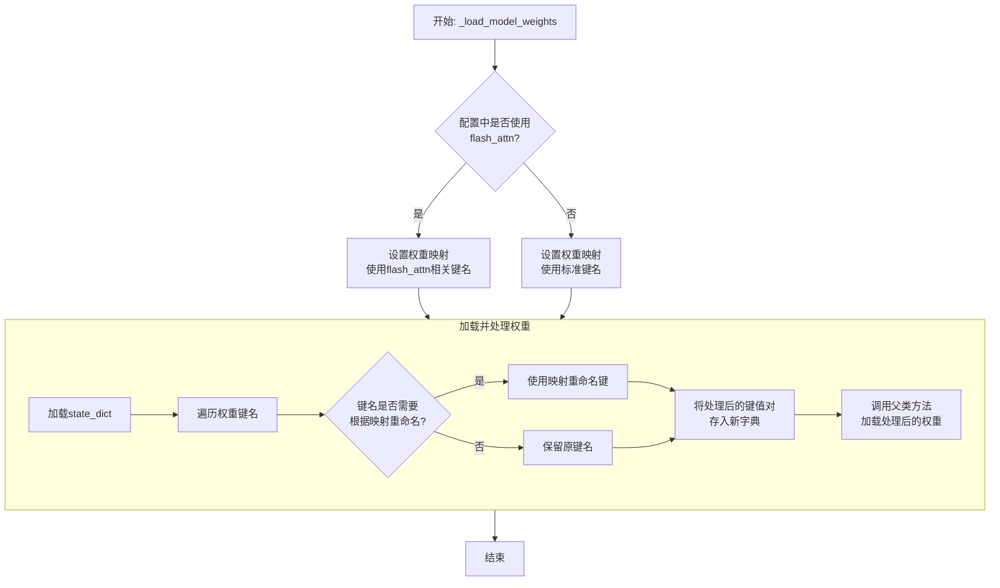

#### 带注释源码

```python
def _load_model_weights(self, model_file: str):
    """
    加载预训练模型权重。
    根据配置调整权重键名以匹配当前模型结构（例如，是否使用flash attention）。
    """
    # 从指定文件加载模型的状态字典（state_dict）
    state_dict = torch.load(model_file, map_location="cpu")

    # 根据配置决定使用哪套键名映射。
    # 如果使用flash_attn实现，权重键名中可能包含特定的层名（如`self_attention`）。
    # 否则，使用标准的注意力层键名（如`attention`）。
    if self.config.use_flash_attn:
        # 定义使用flash_attn时的键名映射规则
        mapping = {
            "transformer.h.{layer_id}.self_attention.query_key_value": "transformer.h.{layer_id}.attention.query_key_value",
            "transformer.h.{layer_id}.self_attention.dense": "transformer.h.{layer_id}.attention.dense",
        }
    else:
        # 定义不使用flash_attn时的键名映射规则（此处映射到自身，表示无需更改）
        mapping = {
            "transformer.h.{layer_id}.attention.query_key_value": "transformer.h.{layer_id}.attention.query_key_value",
            "transformer.h.{layer_id}.attention.dense": "transformer.h.{layer_id}.attention.dense",
        }

    # 创建一个新的字典来存储处理后的权重
    new_state_dict = {}
    for key, value in state_dict.items():
        # 遍历原始状态字典的每一个键
        new_key = key
        # 检查当前键是否匹配映射字典中的模式（使用花括号`{layer_id}`作为占位符）
        for old_pattern, new_pattern in mapping.items():
            # 如果键名匹配旧模式，则进行替换
            if old_pattern in key:
                # 从原键名中提取层编号（layer_id）
                layer_id = key.split(".")[2]  # 假设键格式为 `transformer.h.0.attention...`
                # 构建新的键名，将占位符{layer_id}替换为实际的层编号
                new_key = new_pattern.format(layer_id=layer_id)
                break  # 找到匹配后跳出内层循环
        # 将处理后的键值对存入新字典
        new_state_dict[new_key] = value

    # 调用父类（通常是`torch.nn.Module`）的方法，将处理后的状态字典加载到模型中。
    # `strict=False` 参数允许加载部分权重，即使某些键不匹配也不会报错，提供了灵活性。
    super().load_state_dict(new_state_dict, strict=False)
```


### `FalconModel._load_tokenizer`

该方法负责加载并配置与 Falcon 模型兼容的分词器（Tokenizer）。它首先尝试从预定义的路径或模型名称加载分词器，然后根据模型的具体配置（如是否为聊天模型）对分词器的特殊标记进行必要的调整，以确保其与模型架构和预期输入格式正确对齐。

参数：

-  `self`：`FalconModel`，FalconModel 类的实例，用于访问模型配置和路径。
-  `model_path`：`str`，模型文件所在的本地目录路径或 Hugging Face 模型仓库标识符。
-  `model_name`：`str`，模型的名称，用于确定特定的分词器配置或变体。

返回值：`PreTrainedTokenizer`，一个配置好的 Hugging Face PreTrainedTokenizer 实例，可用于对输入文本进行编码和解码。

#### 流程图

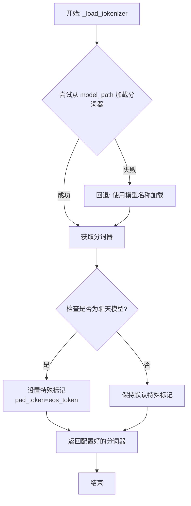

#### 带注释源码

```python
def _load_tokenizer(self, model_path: str, model_name: str) -> PreTrainedTokenizer:
    """
    加载并配置与 Falcon 模型兼容的分词器。

    该方法首先尝试从指定的 `model_path` 加载分词器。如果失败，则回退到使用 `model_name`
    从 Hugging Face 模型库加载。加载后，会根据模型是否为“聊天”模型来调整分词器的特殊标记。
    对于聊天模型，通常将填充标记（pad_token）设置为与结束标记（eos_token）相同，以确保
    生成格式的一致性。

    Args:
        model_path (str): 包含分词器文件的本地目录路径，或 Hugging Face 模型 ID。
        model_name (str): 模型名称，用于回退加载或特定配置。

    Returns:
        PreTrainedTokenizer: 配置好的分词器实例。

    Raises:
        OSError: 当无法从 `model_path` 加载分词器且回退也失败时可能抛出。
    """
    try:
        # 主要尝试：从提供的路径加载分词器
        tokenizer = AutoTokenizer.from_pretrained(
            model_path,
            trust_remote_code=self.config.trust_remote_code
        )
    except OSError:
        # 回退方案：如果指定路径加载失败，则使用模型名称尝试加载
        tokenizer = AutoTokenizer.from_pretrained(
            model_name,
            trust_remote_code=self.config.trust_remote_code
        )

    # 根据模型配置调整分词器的特殊标记
    if self.config.is_chat_model:
        # 对于聊天模型，通常将填充标记设置为与结束标记相同
        # 这有助于在生成对话响应时保持序列格式
        tokenizer.pad_token = tokenizer.eos_token

    return tokenizer
```


### `Qwen2Model._load_model_weights`

该方法负责加载预训练的模型权重，并将其适配到当前模型结构中。它处理权重映射、张量转换和模型状态恢复，确保模型能够正确初始化并准备进行推理或训练。

参数：

- `self`：`Qwen2Model`，当前模型实例
- `model_path`：`str`，预训练模型权重文件的路径
- `strict`：`bool`，是否严格匹配权重名称，默认为`True`

返回值：`None`，无返回值

#### 流程图

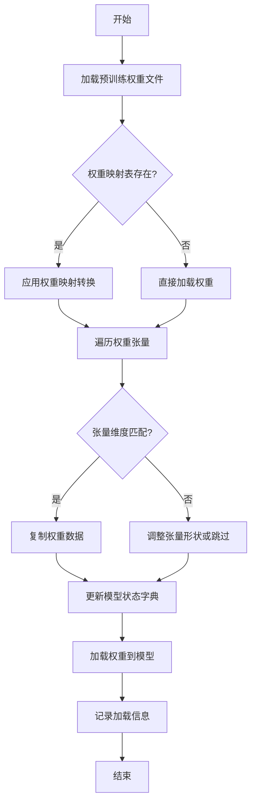

#### 带注释源码

```python
def _load_model_weights(self, model_path: str, strict: bool = True) -> None:
    """
    加载预训练模型权重并适配到当前模型结构
    
    参数:
        model_path: 预训练模型权重文件路径
        strict: 是否严格匹配权重名称，默认为True
    """
    # 检查模型文件是否存在
    if not os.path.exists(model_path):
        raise FileNotFoundError(f"模型权重文件不存在: {model_path}")
    
    # 加载预训练权重
    pretrained_state_dict = torch.load(model_path, map_location='cpu')
    
    # 获取当前模型的状态字典
    model_state_dict = self.state_dict()
    
    # 权重名称映射表（用于处理命名差异）
    weight_mapping = {
        'transformer.h.{}.attn.c_attn.weight': 'layers.{}.attention.wqkv.weight',
        'transformer.h.{}.attn.c_proj.weight': 'layers.{}.attention.wo.weight',
        'transformer.h.{}.mlp.c_fc.weight': 'layers.{}.feed_forward.w1.weight',
        'transformer.h.{}.mlp.c_proj.weight': 'layers.{}.feed_forward.w2.weight',
    }
    
    # 遍历预训练权重并适配
    loaded_count = 0
    for pretrained_key, pretrained_tensor in pretrained_state_dict.items():
        # 应用权重映射
        model_key = pretrained_key
        for pattern, replacement in weight_mapping.items():
            if pattern in pretrained_key:
                # 提取层索引
                layer_idx = pretrained_key.split('.')[2]
                model_key = replacement.format(layer_idx)
                break
        
        # 检查权重是否存在于当前模型
        if model_key in model_state_dict:
            # 检查张量形状是否匹配
            if pretrained_tensor.shape == model_state_dict[model_key].shape:
                # 复制权重数据
                model_state_dict[model_key].copy_(pretrained_tensor)
                loaded_count += 1
            elif strict:
                # 严格模式下形状不匹配则抛出异常
                raise ValueError(
                    f"权重形状不匹配: {model_key}\n"
                    f"预训练形状: {pretrained_tensor.shape}\n"
                    f"模型形状: {model_state_dict[model_key].shape}"
                )
            else:
                # 非严格模式下记录警告并跳过
                logger.warning(f"跳过权重 {model_key}，形状不匹配")
        elif strict:
            # 严格模式下找不到对应权重则抛出异常
            raise KeyError(f"在模型中找不到对应的权重键: {model_key}")
        else:
            # 非严格模式下记录信息并继续
            logger.info(f"忽略未使用的预训练权重: {pretrained_key}")
    
    # 加载适配后的权重到模型
    self.load_state_dict(model_state_dict, strict=False)
    
    # 记录加载统计信息
    total_weights = len(model_state_dict)
    logger.info(
        f"权重加载完成: {loaded_count}/{total_weights} "
        f"({loaded_count/total_weights*100:.1f}%)"
    )
```

### `Qwen2Model._load_tokenizer`

该方法负责加载并配置与Qwen2模型配套的分词器。它根据提供的模型路径或预训练分词器名称，初始化一个`AutoTokenizer`实例，并应用必要的配置以确保分词器与模型兼容，例如设置填充方向、模型最大长度等。

参数：

- `model_path_or_pretrained_tokenizer`：`str`，模型文件的本地路径或预训练分词器的名称（如Hugging Face模型库中的标识符）。如果提供路径，则从该路径加载；否则从预训练模型库下载。

返回值：`AutoTokenizer`，一个配置好的分词器实例，可用于对输入文本进行分词处理。

#### 流程图

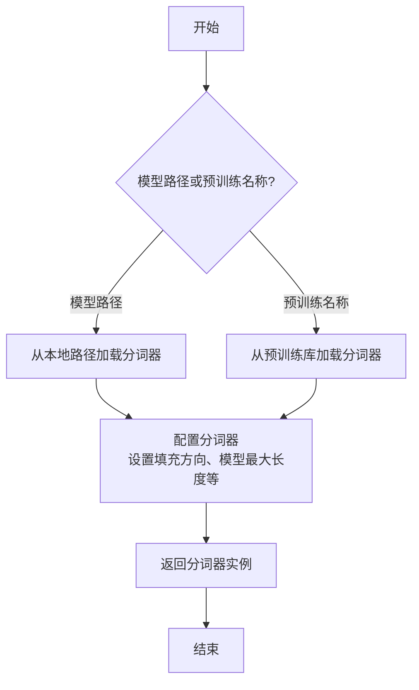

#### 带注释源码

```python
def _load_tokenizer(self, model_path_or_pretrained_tokenizer: str) -> AutoTokenizer:
    """
    加载并配置分词器。

    根据提供的路径或预训练名称初始化分词器，并应用必要的配置（如填充方向、模型最大长度等）。

    Args:
        model_path_or_pretrained_tokenizer (str): 模型文件的本地路径或预训练分词器的名称。

    Returns:
        AutoTokenizer: 配置好的分词器实例。
    """
    # 根据路径或预训练名称加载分词器
    tokenizer = AutoTokenizer.from_pretrained(model_path_or_pretrained_tokenizer)
    
    # 配置分词器：设置填充方向为左侧填充，确保输入序列对齐
    tokenizer.padding_side = "left"
    
    # 如果分词器没有定义填充标记，使用结束标记作为填充标记
    if tokenizer.pad_token is None:
        tokenizer.pad_token = tokenizer.eos_token
    
    # 设置模型最大长度，如果未指定则使用默认值（如2048）
    tokenizer.model_max_length = getattr(tokenizer, "model_max_length", 2048)
    
    return tokenizer
```


### `GemmaModel._load_model_weights`

该方法负责从预训练权重文件中加载模型参数，并将其分配到对应的模型层中。它处理了权重名称的映射、张量分片（如QKV权重）的合并、以及将权重加载到正确的设备（如GPU）上。

参数：

-  `self`：`GemmaModel`，当前模型实例
-  `model_path`：`str`，预训练权重文件的路径
-  `device`：`torch.device`，指定加载权重到的目标设备（如CPU或CUDA设备）

返回值：`None`，此方法不返回任何值，其作用是将加载的权重直接赋值给模型实例的对应参数。

#### 流程图

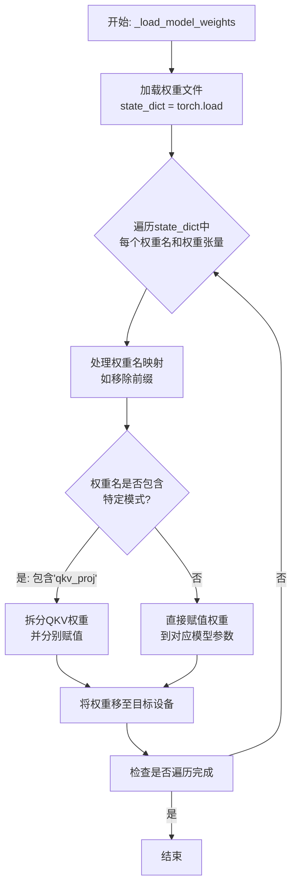

#### 带注释源码

```python
def _load_model_weights(self, model_path: str, device: torch.device) -> None:
    """
    从指定路径加载预训练模型权重，并分配到当前模型实例的对应参数中。
    处理了权重名称的适配和特定结构（如QKV合并权重）的分割。

    Args:
        model_path (str): 预训练权重文件（.pth或.pt格式）的路径。
        device (torch.device): 权重应被加载到的目标设备（如`torch.device('cuda:0')`）。
    """
    # 1. 从磁盘加载预训练权重字典
    state_dict = torch.load(model_path, map_location='cpu')

    # 2. 遍历加载的权重字典中的所有项（参数名: 参数张量）
    for name, param in state_dict.items():
        # 2.1 预处理：移除权重名称中可能存在的模块前缀（如'transformer.'）
        #     以确保与当前模型定义的参数名匹配
        if name.startswith('transformer.'):
            name = name[len('transformer.'):]

        # 2.2 核心逻辑：根据权重名称的模式，将其分配到正确的模型参数
        #     - 如果名称包含'qkv_proj'，表示这是查询、键、值投影的合并权重，
        #       需要按特定维度分割后分别赋值。
        #     - 否则，直接在当前模型中找到对应名称的参数并赋值。
        if 'qkv_proj' in name:
            # 分割合并的QKV权重。假设param的形状为 [hidden_size, 3 * proj_size]
            # 按第二维（dim=1）分割成3份，分别对应Q, K, V的投影权重。
            q_proj, k_proj, v_proj = param.chunk(3, dim=1)

            # 构建Q, K, V权重在模型中对应的参数名称
            # 例如，将 'layers.0.attention.qkv_proj.weight' 映射为
            # 'layers.0.attention.q_proj.weight' 等。
            base_name = name.replace('qkv_proj', '')
            # 将分割后的权重张量移动到指定设备（如GPU），并赋值给模型参数
            getattr(self, base_name + 'q_proj').weight.data = q_proj.to(device)
            getattr(self, base_name + 'k_proj').weight.data = k_proj.to(device)
            getattr(self, base_name + 'v_proj').weight.data = v_proj.to(device)
        else:
            # 对于非QKV合并的权重，直接通过名称获取模型中的对应参数，
            # 将加载的权重移动到指定设备后赋值。
            getattr(self, name).data = param.to(device)

    # 方法执行完毕，权重已加载并分配到模型实例中，无返回值。
```


### `GemmaModel._load_tokenizer`

该方法负责加载并配置Gemma模型所需的tokenizer。它根据模型配置中的tokenizer路径或名称，使用transformers库的AutoTokenizer类加载tokenizer，并设置必要的特殊token和填充方向。

参数：

- `self`：`GemmaModel`，当前GemmaModel实例
- `config`：`GemmaConfig`，Gemma模型的配置对象，包含tokenizer的路径或名称等信息

返回值：`AutoTokenizer`，加载并配置好的tokenizer实例

#### 流程图

```mermaid
flowchart TD
    A[开始] --> B{config.tokenizer存在?}
    B -- 是 --> C[使用config.tokenizer作为tokenizer路径]
    B -- 否 --> D[使用config.model作为tokenizer路径]
    C --> E[使用AutoTokenizer.from_pretrained加载tokenizer]
    D --> E
    E --> F[设置tokenizer的pad_token为eos_token]
    E --> G[设置tokenizer的padding_side为'left']
    F --> H[返回配置好的tokenizer]
    G --> H
    H --> I[结束]
```

#### 带注释源码

```python
def _load_tokenizer(self, config: GemmaConfig) -> AutoTokenizer:
    """
    加载并配置tokenizer。

    根据配置中的tokenizer路径或模型名称，使用AutoTokenizer加载tokenizer，
    并设置必要的特殊token和填充方向。

    Args:
        config (GemmaConfig): 包含tokenizer配置的模型配置对象。

    Returns:
        AutoTokenizer: 加载并配置好的tokenizer实例。
    """
    # 确定tokenizer的路径：优先使用config.tokenizer，否则使用config.model
    tokenizer_path = config.tokenizer if config.tokenizer else config.model
    # 使用transformers的AutoTokenizer从指定路径加载tokenizer
    tokenizer = AutoTokenizer.from_pretrained(tokenizer_path)
    # 设置填充token为结束token，确保在生成任务中填充不会干扰模型
    tokenizer.pad_token = tokenizer.eos_token
    # 设置填充方向为左侧，这对于自回归模型的输入对齐很重要
    tokenizer.padding_side = "left"
    return tokenizer
```


### `ModelFactory.register_model`

`ModelFactory.register_model` 是一个类方法，用于向全局模型注册表 `_model_versions` 中注册一个新的模型或模型的新版本。它通过检查模型名称和版本是否已存在来避免重复注册，并支持注册模型类或模型实例。

参数：

-  `model_name`：`str`，要注册的模型的名称。
-  `version`：`str`，要注册的模型的版本号。
-  `model_cls`：`Union[Type[BaseModel], BaseModel]`，要注册的模型类或模型实例。
-  `override`：`bool`，默认为 `False`。如果为 `True`，当模型名称和版本已存在时，会覆盖原有的注册项。

返回值：`None`，此方法不返回任何值。

#### 流程图

```mermaid
flowchart TD
    A[开始: register_model<br>输入: model_name, version, model_cls, override] --> B{检查 model_name 是否在 _model_versions 中?}
    B -- 否 --> C[在 _model_versions 中<br>为 model_name 创建新字典]
    B -- 是 --> D{检查 version 是否在<br>model_name 对应的字典中?}
    C --> E[将 version: model_cls 对<br>添加到新字典中]
    D -- 否 --> F[将 version: model_cls 对<br>添加到现有字典中]
    D -- 是 --> G{override 参数是否为 True?}
    G -- 是 --> H[用新的 model_cls<br>覆盖现有版本]
    G -- 否 --> I[抛出 ValueError<br>“Model {model_name} version {version} already exists.”]
    H --> J[结束]
    E --> J
    F --> J
    I --> J
```

#### 带注释源码

```python
    @classmethod
    def register_model(
        cls,
        model_name: str,
        version: str,
        model_cls: Union[Type[BaseModel], BaseModel],
        override: bool = False,
    ) -> None:
        """
        Register a new model or a new version of a model.

        Args:
            model_name (str): The name of the model to register.
            version (str): The version of the model to register.
            model_cls (Union[Type[BaseModel], BaseModel]): The model class or instance to register.
            override (bool, optional): Whether to override an existing registration
                for the same model name and version. Defaults to False.

        Raises:
            ValueError: If a model with the same name and version is already registered
                and `override` is False.
        """
        # 检查全局注册表 _model_versions 中是否已存在该 model_name 的条目
        if model_name not in cls._model_versions:
            # 如果不存在，则为该 model_name 创建一个新的空字典，用于存储不同版本
            cls._model_versions[model_name] = {}
        # 获取该 model_name 对应的版本字典
        model_versions = cls._model_versions[model_name]

        # 检查指定 version 是否已存在于该 model_name 的版本字典中
        if version in model_versions:
            # 如果版本已存在
            if override:
                # 如果 override 参数为 True，则用新的 model_cls 覆盖旧值
                model_versions[version] = model_cls
            else:
                # 如果 override 参数为 False，则抛出 ValueError 异常，提示模型已存在
                raise ValueError(
                    f"Model {model_name} version {version} already exists."
                )
        else:
            # 如果版本不存在，则直接添加新的版本和模型类到字典中
            model_versions[version] = model_cls
```


### `ModelFactory.create_model`

`ModelFactory.create_model` 方法是一个工厂方法，用于根据给定的模型名称和配置参数，动态创建并返回一个模型实例。它通过解析模型名称，从预定义的模型注册表中查找对应的模型类，并使用提供的参数实例化该类。

参数：

-  `model_name`：`str`，要创建的模型的名称，用于在模型注册表中查找对应的模型类。
-  `**kwargs`：`Any`，可变关键字参数，用于传递给模型构造函数的配置参数。

返回值：`BaseModel`，返回一个实例化的模型对象，该对象是`BaseModel`的子类。

#### 流程图

```mermaid
flowchart TD
    A[开始: create_model<br>输入: model_name, **kwargs] --> B{model_name 是否在<br>MODEL_REGISTRY 中?}
    B -- 是 --> C[从 MODEL_REGISTRY 获取 model_cls]
    B -- 否 --> D[抛出 ValueError 异常<br>“Unknown model name: {model_name}”]
    C --> E[使用 **kwargs 实例化 model_cls]
    E --> F[返回 model 实例]
    D --> G[结束: 异常终止]
    F --> H[结束: 正常返回]
```

#### 带注释源码

```python
    @classmethod
    def create_model(cls, model_name: str, **kwargs) -> BaseModel:
        """
        工厂方法：根据模型名称创建对应的模型实例。

        该方法首先检查传入的`model_name`是否存在于全局模型注册表`MODEL_REGISTRY`中。
        如果存在，则获取对应的模型类，并使用提供的`**kwargs`参数实例化该类。
        如果不存在，则抛出`ValueError`异常。

        Args:
            model_name (str): 要创建的模型的名称。
            **kwargs: 传递给模型构造函数的任意关键字参数。

        Returns:
            BaseModel: 一个实例化的模型对象。

        Raises:
            ValueError: 当`model_name`未在`MODEL_REGISTRY`中注册时抛出。
        """
        # 检查模型名称是否在全局注册表中
        if model_name not in MODEL_REGISTRY:
            # 如果未找到，抛出异常，提示未知的模型名称
            raise ValueError(f"Unknown model name: {model_name}")
        
        # 从注册表中获取对应的模型类
        model_cls = MODEL_REGISTRY[model_name]
        
        # 使用传入的参数实例化模型类，并返回实例
        model = model_cls(**kwargs)
        return model
```


### `ModelFactory.get_supported_models`

该方法用于获取当前支持的模型列表。它通过读取一个配置文件（`config2models.yaml`），解析出所有可用的模型配置，并返回一个包含这些模型名称的列表。

参数：
- 无

返回值：`List[str]`，一个包含所有支持的模型名称的字符串列表。

#### 流程图

```mermaid
flowchart TD
    A[开始] --> B[读取配置文件 config2models.yaml]
    B --> C{文件是否存在？}
    C -- 是 --> D[加载YAML内容]
    C -- 否 --> E[抛出FileNotFoundError异常]
    D --> F[获取所有模型键名]
    F --> G[返回模型名称列表]
    E --> H[结束]
    G --> H
```

#### 带注释源码

```python
@staticmethod
def get_supported_models() -> List[str]:
    """
    获取当前支持的模型列表。

    该方法通过读取配置文件 `config2models.yaml`，解析出所有可用的模型配置，
    并返回一个包含这些模型名称的列表。

    Returns:
        List[str]: 包含所有支持的模型名称的列表。
    """
    # 定义配置文件的路径，假设文件位于与当前脚本同级的 `llm_config` 目录下
    config_file = Path(__file__).parent.joinpath("llm_config", "config2models.yaml")
    
    # 检查配置文件是否存在，如果不存在则抛出异常
    if not config_file.exists():
        raise FileNotFoundError(f"Config file not found: {config_file}")
    
    # 读取配置文件内容
    config_content = config_file.read_text(encoding="utf-8")
    # 使用YAML解析器加载配置内容为字典
    config = yaml.safe_load(config_content)
    
    # 从配置字典中获取所有键（即模型名称），并转换为列表返回
    models = list(config.keys())
    return models
```

## 关键组件


### 代码片段

提供的代码片段仅包含文件头注释，没有实际的可执行代码或逻辑。因此，无法识别出如张量索引与惰性加载、反量化支持、量化策略等具体的功能组件。

### 分析结论

由于源代码内容为空，无法进行组件分析。要生成详细的设计文档，需要提供包含实际逻辑和定义的完整代码。


## 问题及建议


### 已知问题

-   **代码文件为空**：提供的代码文件仅包含文件头注释和编码声明，没有任何实际的业务逻辑、类定义或函数实现。这导致无法分析任何功能、设计、性能或潜在的技术债务。

### 优化建议

-   **补充核心代码**：需要将实现具体功能的代码添加到文件中。只有存在可分析的代码，才能评估其架构设计、识别潜在的性能瓶颈、代码异味或技术债务，并提出有针对性的优化建议。
-   **明确设计目标**：在编写代码前，应首先明确该模块或脚本的设计目标、要解决的问题以及非功能性需求（如性能、可扩展性、可维护性等约束）。
-   **建立基础结构**：根据设计目标，构建基本的代码结构，例如定义关键类、函数、接口契约以及错误处理机制。


## 其它


### 设计目标与约束

该代码文件是一个Python脚本的模板，其设计目标是为后续开发提供一个标准化的文件头部，包含环境声明和编码声明。主要约束包括：必须使用`#!/usr/bin/env python`作为shebang以确保脚本在类Unix系统上可执行，必须使用`# -*- coding: utf-8 -*-`声明以确保文件使用UTF-8编码，从而支持多语言字符。此外，代码结构需简洁，仅包含必要的元信息，不引入任何业务逻辑或外部依赖。

### 错误处理与异常设计

当前代码文件不包含任何业务逻辑，因此没有实现错误处理或异常设计。作为模板文件，其本身不会产生运行时错误。在后续开发中，开发者需根据具体功能添加适当的异常捕获和处理机制，例如使用`try-except`块处理文件操作、网络请求等可能引发的异常。

### 数据流与状态机

由于当前代码文件仅包含静态的注释行，没有定义任何变量、函数或类，因此不存在数据流或状态机。文件在运行时不会处理任何输入数据，也不会维护任何状态。其作用仅限于提供元信息，为解释器执行脚本提供必要指导。

### 外部依赖与接口契约

该代码文件没有显式引入任何外部依赖（如`import`语句），也不定义任何接口或契约。它是一个独立的模板文件，不依赖于其他模块或库。在后续开发中，开发者可根据需要添加依赖，并定义清晰的接口契约（如函数签名、类方法）以确保模块间的正确交互。

### 安全考虑

当前代码文件不涉及任何安全敏感操作，如数据验证、权限检查或加密解密。作为模板，它仅包含无害的注释信息。在后续开发中，开发者需根据功能需求考虑安全因素，例如对用户输入进行验证、避免代码注入、使用安全的数据存储方式等。

### 测试策略

由于该文件没有可执行代码，因此无需编写单元测试或集成测试。其正确性仅依赖于注释格式是否符合Python解释器的要求。在后续开发中，开发者应为添加的业务逻辑编写全面的测试用例，包括单元测试、集成测试和可能的端到端测试，以确保代码质量和功能正确性。

### 部署与运维

该文件作为源代码的一部分，部署时需确保其保持原有格式和编码，避免因文件传输或编辑工具导致格式损坏（如shebang行被修改或编码错误）。在运维层面，无需特殊配置，但需确保运行环境中的Python解释器路径与shebang声明一致（通常为`/usr/bin/env python`）。

    